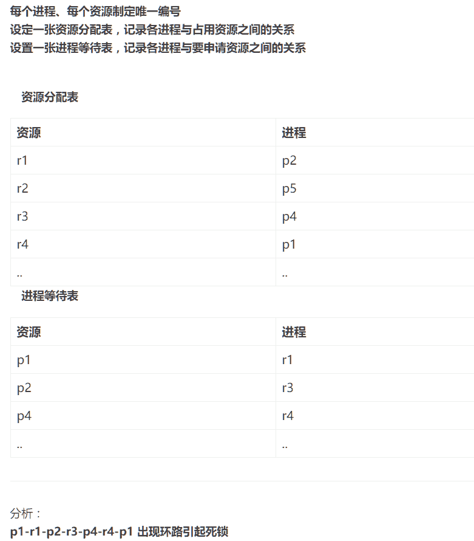

# 腾讯 2017 校招开发工程师笔试试卷（二）

## 1

下列哪些可以用于 Linux 进程间通讯?

正确答案: A B C D E   你的答案: 空 (错误)

```cpp
UNIX 套接字
```

```cpp
信号量
```

```cpp
无名管道
```

```cpp
文件锁
```

```cpp
共享内存
```

本题知识点

Linux

讨论

[一瓢之饮](https://www.nowcoder.com/profile/4057885)

Linux 进程通信六大方式：1，管道及(pipe)有名管道 2，信号（signal）                3,  报文队列 4，共享内存 5，信号量(semaphore)6，套接字（socket）

发表于 2017-08-18 11:04:40

* * *

[陈洁玉](https://www.nowcoder.com/profile/6257846)

Linux 下进程间的通信方式有以下几种（1）管道/无名管道（2）信号（3）共享内存（4）消息队列（5）信号量（6）socket 这是书上说的六种通信方式，通过文件锁的方式也可以实现进程间的通信（上网查了一下）所以要记住文件锁

发表于 2017-08-28 15:13:13

* * *

[妇科圣手](https://www.nowcoder.com/profile/8210500)

无名管道:管道是半双工的，数据只能向一个方向流动；需要双方通信时，需要建立起两个管道；只能用于父子进程或者兄弟进程之间（具有亲缘关系的进程）。 单独构成一种独立的文件系统：管道对于管道两端的进程而言，就是一个文件，但它不是普通的文件，它不属于某种文件系统，而是自立门户，单独构成一种文件系统，并且只存在与内存中。

数据的读出和写入：一个进程向管道中写的内容被管道另一端的进程读出。写入的内容每次都添加在管道缓冲区的末尾，并且每次都是从缓冲区的头部读出数据。有名管道：不同于管道之处在于它提供一个路径名与之关联，以 FIFO 的文件形式存在于文件系统中。这样，即使与 FIFO 的创建进程不存在亲缘关系的进程，只要可以访问该路径，就能够彼此通过 FIFO 相互通信（能够访问该路径的进程以及 FIFO 的创建进程之间），因此，通过 FIFO 不相关的进程也能交换数据。值得注意的是，FIFO 严格遵循先进先出（first in first out），对管道及 FIFO 的读总是从开始处返回数据，对它们的写则把数据添加到末尾。它们不支持诸如 lseek()等文件定位操作。

发表于 2017-08-18 16:27:14

* * *

## 2

请问下列代码的输出是多少（） 

```cpp
#include <stdio.h>
int main() {
    int m[] = {1, 2, 3, 4, 5, 6, 7, 8, 9, 0};
    int(*p)[4] = (int(*)[4])m;
    printf("%d", p[1][2]);
    return 0;
}

```

正确答案: A   你的答案: 空 (错误)

```cpp
7
```

```cpp
3
```

```cpp
8
```

```cpp
4
```

本题知识点

C 语言

讨论

[FlyingByWind](https://www.nowcoder.com/profile/5739663)

1、int (*p)[4]：表示行指针，单位移动量为 4 个 int 类型。即 p+1，则一次移动 4 个 int 类型 2、(int (*)[4])m：表示以数组指针类型组织 m，每 4 个为一个数组 3、这样一来，m 为｛｛1，2，3，4｝，｛5，6，7，8｝，｛9，0， ， ｝｝，p 指向第一行 4、故 p[1][2]即*（*（p+1）+2），表示第二行第三个元素，为 7

发表于 2017-08-20 12:36:48

* * *

[静水云深](https://www.nowcoder.com/profile/2842161)

这道题首先需要清楚指针数组和数组指针的区别。

C 语言中 int*p[4] 和 int（*p）[4]的区别：

 ```cpp
int *p[4];  //定义一个指针数组，该数组中每个元素是一个指针，每个指针指向哪里就需要程序中后续再定义了。
int (*p)[4];  //定义一个数组指针，该指针指向含 4 个元素的一维数组（数组中每个元素是 int 型）。

区分 int *p[n]; 和 int (*p)[n]; 就要看运算符的优先级了。
int *p[n]; 中，运算符[ ]优先级高，先与 p 结合成为一个数组，再由 int*说明这是一个整型指针数组。
int (*p)[n]; 中( )优先级高，首先说明 p 是一个指针，指向一个整型的一维数组。
1、int (*p)[4]：定义一个数组指针，该指针指向含 4 个元素的一维数组（数组中每个元素是 int 型）； 2、(int (*)[4])m：表示将 m 强制转换为大小为 4 的数组指针；
``` 

编辑于 2017-08-29 22:44:08

* * *

[陈洁玉](https://www.nowcoder.com/profile/6257846)

```cpp

	 intm []={1,2,3,4,5,6,7,8,9,0};

	    int(*p)[4]=(int(*)[4])m;

	    printf(“%”,p[1][2]);

	这个题我是这样理解的

	1 2 3 4 5 6 7 8 9 0 

	p[0]指向 1

	首先 p 是一个数组指针，指向的数组的空间大小为 4，

	1 2 3 4 5 6 7 8 9 0

	        p[1]指向 5 的位置，同时这也是 p[1][0], 所以 p[1][2]指向 7

```

发表于 2017-08-28 15:20:17

* * *

## 3

ARP 协议实现的功能是()

正确答案: A   你的答案: 空 (错误)

```cpp
IP 地址到物理地址的解析
```

```cpp
域名地址到 IP 地址的解析
```

```cpp
IP 地址到域名地址的解析
```

```cpp
物理地址到 IP 地址的解析
```

本题知识点

网络基础

讨论

[一瓢之饮](https://www.nowcoder.com/profile/4057885)

地址解析协议，即 ARP（Address Resolution Protocol），是根据[IP 地址](https://baike.baidu.com/item/IP%E5%9C%B0%E5%9D%80)获取[物理地址](https://baike.baidu.com/item/%E7%89%A9%E7%90%86%E5%9C%B0%E5%9D%80)的一个[TCP/IP 协议](https://baike.baidu.com/item/TCP%2FIP%E5%8D%8F%E8%AE%AE)。[主机](https://baike.baidu.com/item/%E4%B8%BB%E6%9C%BA)发送信息时将包含目标 IP 地址的 ARP 请求广播到网络上的所有主机，并接收返回消息，以此确定目标的物理地址；收到返回消息后将该 IP 地址和物理地址存入本机 ARP 缓存中并保留一定时间，下次请求时直接查询 ARP 缓存以节约资源。地址解析协议是建立在网络中各个主机互相信任的基础上的，网络上的主机可以自主发送 ARP 应答消息，其他主机收到应答报文时不会检测该报文的真实性就会将其记入本机 ARP 缓存；由此攻击者就可以向某一主机发送伪 ARP 应答报文，使其发送的信息无法到达预期的主机或到达错误的主机，这就构成了一个[ARP 欺骗](https://baike.baidu.com/item/ARP%E6%AC%BA%E9%AA%97)。[ARP 命令](https://baike.baidu.com/item/ARP%E5%91%BD%E4%BB%A4)可用于查询本机 ARP 缓存中 IP 地址和[MAC 地址](https://baike.baidu.com/item/MAC%E5%9C%B0%E5%9D%80)的对应关系、添加或删除静态对应关系等。相关协议有[RARP](https://baike.baidu.com/item/RARP)、[***ARP](https://baike.baidu.com/item/%E4%BB%A3%E7%90%86ARP)。[NDP](https://baike.baidu.com/item/NDP)用于在[IPv6](https://baike.baidu.com/item/IPv6)中代替地址解析协议。

发表于 2017-08-18 11:11:41

* * *

[嘤其鸣矣，求其友声](https://www.nowcoder.com/profile/7624301)

DNS:域名到 IP 地址 ARP:IP 地址到物理地址

发表于 2017-08-27 23:15:25

* * *

[逸清 SCY](https://www.nowcoder.com/profile/8811545)

一脸懵逼

发表于 2018-01-22 00:24:57

* * *

## 4

以下关于死锁，描述正确的有（）

正确答案: A C   你的答案: 空 (错误)

```cpp
有序分配锁资源可以预防死锁
```

```cpp
银行家算法是用于检测死锁的
```

```cpp
剥夺死锁进程的所有资源可以解除死锁
```

```cpp
以上描述都不对
```

本题知识点

操作系统

讨论

[妇科圣手](https://www.nowcoder.com/profile/8210500)

1.  互斥条件：一个资源每次只能被一个进程使用。
2.  请求与保持条件：一个进程因请求资源而阻塞时，对已获得的资源保持不放。
3.  不剥夺条件:进程已获得的资源，在末使用完之前，不能强行剥夺。
4.  循环等待条件:若干进程之间形成一种头尾相接的循环等待资源关系。

*   **        死锁的预防**

死锁的预防是保证系统不进入死锁状态的一种策略。它的基本思想是要求进程申请资源时遵循某种协议，从而打破产生死锁的四个必要条件中的一个或几个，保证系统不会进入死锁状态。   〈1〉打破互斥条件。即允许进程同时访问某些资源。但是，有的资源是不允许被同时访问的，像打印机等等，这是由资源本身的属性所决定的。所以，这种办法并无实用价值。   〈2〉打破不可抢占条件。即允许进程强行从占有者那里夺取某些资源。就是说，当一个进程已占有了某些资源，它又申请新的资源，但不能立即被满足时，它必须释放所占有的全部资源，以后再重新申请。它所释放的资源可以分配给其它进程。这就相当于该进程占有的资源被隐蔽地强占了。这种预防死锁的方法实现起来困难，会降低系统性能。        〈3〉打破占有且申请条件。可以实行资源预先分配策略。即进程在运行前一次性地向系统申请它所需要的全部资源。如果某个进程所需的全部资源得不到满足，则不分配任何资源，此进程暂不运行。只有当系统能够满足当前进程的全部资源需求时，才一次性地将所申请的资源全部分配给该进程。由于运行的进程已占有了它所需的全部资源，所以不会发生占有资源又申请资源的现象，因此不会发生死锁。

*   **死锁避免**

1.安全序列

  我们首先引入安全序列的定义：所谓系统是安全的，是指系统中的所有进程能够按照某一种次序分配资源，并且依次地运行完毕，这种进程序列{P1，P2，...，Pn}就是安全序列。如果存在这样一个安全序列，则系统是安全的；如果系统不存在这样一个安全序列，则系统是不安全的。

  安全序列{P1，P2，...，Pn}是这样组成的：若对于每一个进程 Pi，它需要的附加资源可以被系统中当前可用资源加上所有进程 Pj 当前占有资源之和所满足，则{P1，P2，...，Pn}为一个安全序列，这时系统处于安全状态，不会进入死锁状态。

  虽然存在安全序列时一定不会有死锁发生，但是系统进入不安全状态（四个死锁的必要条件同时发生）也未必会产生死锁。当然，产生死锁后，系统一定处于不安全状态。 

2.银行家算法银行家算法是从当前状态出发，逐个按安全序列检查各客户谁能完成其工作，然后假定其完成工作且归还全部贷款，再进而检查下一个能完成工作的客户，......。如果所有客户都能完成工作，则找到一个安全序列，银行家才是安全的。

*   **死锁检测与解除**


**- 撤销所有的死锁进程** 
- **进程回退（Roll Back）再启动** 
- **按照某种原则逐一撤销死锁的进程直到。。。** 
- **按照某种原则逐一抢占资源（资源被抢占的进程必须回退到之前对应的状态），直到。。。**

发表于 2017-08-18 16:43:21

* * *

[小李 8](https://www.nowcoder.com/profile/8260064)

银行家算法就是用来避免死锁的

发表于 2017-09-06 17:27:44

* * *

[五月 Lucy](https://www.nowcoder.com/profile/2911311)

银行家算法避免死锁

发表于 2017-08-29 22:39:25

* * *

## 5

Java 语言中，如果"xyz"没有被创建过，String s =new String(“xyz”);创建了几个 string object？

正确答案: B   你的答案: 空 (错误)

```cpp
1
```

```cpp
2
```

```cpp
3
```

```cpp
4
```

本题知识点

Java

讨论

[HelloWord。](https://www.nowcoder.com/profile/5908104)

两个。第一个在堆中，第二个在字符串常量池中！如果在 Java 字符串常量池中已经存在，就只会创建一个

编辑于 2017-09-27 11:21:54

* * *

[bfchengnuo](https://www.nowcoder.com/profile/2809575)

相关知识点

类加载对一个类只会进行一次。
"xyz" 在类加载时就已经创建并驻留了（如果该类被加载之前已经有 "xyz" 字符串被驻留过则不需要重复创建用于驻留的"xyz"实例）。

驻留的字符串是放在全局共享的字符串常量池中的。

> 在 HotSpot VM 里实现的 string pool 功能的是一个 StringTable 类，它是一个哈希表，里面存的是驻留字符串(也就是我们常说的用双引号括起来的)**的引用（而不是驻留字符串实例本身）**
> 也就是说在堆中的某些字符串实例被这个 StringTable 引用之后就等同被赋予了”驻留字符串”的身份。
> 这个 StringTable 在每个 HotSpot VM 的实例只有一份，被所有的类共享。

* * *

在这段代码后续被运行的时候，"xyz" 字面量对应的 String 实例已经固定了(前面的类加载过程)，不会再被重复创建。

所以这段代码将常量池中的对象**复制一份**放到 heap 中，并且把 heap 中的这个对象的引用交给 s1 持有。

简单理解

对于这句代码，可分为两个过程：

1.  jvm 首先在字符串常量池内里面看看找不找到字符串"xyz"；找到，进入第二步；否则，创建新的 String 对象，并“放到”字符串常量池里面。
2.  然后由于遇到了 new，还会在堆创建 String 对象，其实实际是引用的常量池的那个，最后将其返回给 s1。

将 new String("xyz")拆分为 new String()和"xyz"
如果写在类方法里，请参考前面的类加载，就是相比之下提前驻留了吧。

编辑于 2019-03-25 13:19:26

* * *

[帅的不行](https://www.nowcoder.com/profile/6861951)

这题出的有歧义，可能有一个，也有可能是两个，“xyz”对应一个对象，这个对象存放在字符 串常量缓冲区，不管常量“xyz”出现多少遍，都是缓冲区的那一个，new String 每写一遍就创建一个新的对象，如果之前用过“xyz”,那就不会创建，直接从缓冲区拿。所以说可能一个或者两个对象

发表于 2017-04-27 18:03:23

* * *

## 6

定义以下泛型： Internal sealed class DictionaryStringKey:Dictionary{} 哪个选项不会抛出异常（）

正确答案: C   你的答案: 空 (错误)

```cpp
Type t=typeof(Dictionary<,>);
  Object o=Activator.CreateInstance(t);
```

```cpp
Type t=typeof(DictionaryStringKey<>);
  Object o=Activator.CreateInstance(t);
```

```cpp
Type t=typeof(DictionaryStringKey<Guid>);
  Object o=Activator.CreateInstance(t);
```

本题知识点

C#

讨论

[渡劫余生 1289](https://www.nowcoder.com/profile/9016616)

选 C 在.NET 中，CLR 会为应用程序使用的每个类型创建一个内部数据结构，这种数据结构成为：类型对象（type Object）。 具有泛型类型参数的类型仍然是类型，CLR 同样会为它创建一个内部类型对象。无论是引用类型（类）、值类型（结构）、接口类型，还是委托类型，这一点都是成立的。然而，具有泛型类型参数的类型称之为：开放类型（open type），CLR 禁止构造开发类型的任何实例。这一点类似于 CLR 禁止构造结构类型的实例。 代码引用一个泛型类型时，可指定一组泛型类型实参，假如所有类型实参传递的都是实际数据类型，类型就称为封闭类型（closed type）。CLR 允许构造封闭类型的实例，然而，当代码引用一个泛型类型的时候，可能会留下一些泛型类型实参未指定，这会在 CLR 中创建一个新的开放类型的对象，而且不能创建该类型的实例，以下代码说明了这一点  internal sealed class DictionaryStringKey <tvalue>: Dictionary <string tvalue="">{ }      public static class Program    {        static void Main(string[] args)        {            Object o = null;              //Dictionary 是一个开放类型，它有两个类型参数            Type t = typeof(Dictionary);            //尝试创建该类型的一个实例失败            o = CreateInstance(t);            Console.WriteLine();              //DictionaryStringKey 是一个开放类型，他有一个类型参数            t = typeof(DictionaryStringKey<>);            //尝试创建该类型的一个实例失败            o = CreateInstance(t);            Console.WriteLine();              //DictionaryStringKey<guid>是一个封闭类型            t = typeof(DictionaryStringKey<guid>);            //尝试创建该类型的一个实例成功            o = CreateInstance(t);            //证明它确实能够工作            Console.WriteLine(" 对象类型："+o.GetType());        }          private static Object CreateInstance(Type t) {            Object o = null;            try            {                o = Activator.CreateInstance(t);                Console.WriteLine("已创建{0}的实例。",t.ToString());            }            catch (ArgumentException e)            {                Console.WriteLine(e.Message);            }            return o;        }    }

发表于 2017-03-06 21:22:24

* * *

[嘻嘻 818](https://www.nowcoder.com/profile/7295134)

在.NET 中，CLR 会为应用程序使用的每个类型创建一个内部数据结构，
这种数据结构成为：类型对象（type Object）。 
具有泛型类型参数的类型仍然是类型，CLR 同样会为它创建一个内部类型对象。
无论是引用类型（类）、值类型（结构）、接口类型，还是委托类型，这一点都是成立的。
然而，具有泛型类型参数的类型称之为：开放类型（open type），
CLR 禁止构造开发类型的任何实例。这一点类似于 CLR 禁止构造结构类型的实例。 
代码引用一个泛型类型时，可指定一组泛型类型实参，
假如所有类型实参传递的都是实际数据类型，类型就称为封闭类型（closed type）。
CLR 允许构造封闭类型的实例，然而，当代码引用一个泛型类型的时候，可能会留下一些泛型类型实参未指定，这会在 CLR 中创建一个新的开放类型的对象，而且不能创建该类型的实例，以下代码说明了这一点。 

```cpp
internal sealed class DictionaryStringKey<TValue> : Dictionary<String, TValue> { }      
public static class Program    
{        
    static void Main(string[] args)        
    {            
    Object o = null;              //Dictionary<,>是一个开放类型，它有两个类型参数            
    Type t = typeof(Dictionary<,>);            //尝试创建该类型的一个实例失败            
    o = CreateInstance(t);            
    Console.WriteLine();              //DictionaryStringKey 是一个开放类型，他有一个类型参数            
    t = typeof(DictionaryStringKey<>);            //尝试创建该类型的一个实例失败           
    o = CreateInstance(t);            
    Console.WriteLine();              //DictionaryStringKey<Guid>是一个封闭类型           
    t = typeof(DictionaryStringKey<Guid>);            //尝试创建该类型的一个实例成功            
    o = CreateInstance(t);            //证明它确实能够工作            
    Console.WriteLine(" 对象类型："+o.GetType());  
    } 

    private static Object CreateInstance(Type t) 
    {            
        Object o = null;            
        try            
        {                
            o = Activator.CreateInstance(t);               
            Console.WriteLine("已创建{0}的实例。",t.ToString());
        }            
        catch (ArgumentException e)            
        {               
         Console.WriteLine(e.Message);            
        }           
      return o;        
    }    
 }

```

编辑于 2019-05-14 10:08:31

* * *

[dcjer](https://www.nowcoder.com/profile/7778497)

复制楼上的解释：具有泛型类型参数的类型称之为：开放类型（open type），CLR 禁止构造开发类型的任何实例。这一点类似于 CLR 禁止构造结构类型的实例。 代码引用一个泛型类型时，可指定一组泛型类型实参，假如所有类型实参传递的都是实际数据类型，类型就称为封闭类型（closed type）。CLR 允许构造封闭类型的实例

发表于 2018-02-12 22:26:43

* * *

## 7

下面关于数据库唯一索引正确的是（ ）？

正确答案: A B C   你的答案: 空 (错误)

```cpp
表可以包含多个唯一约束，但只能有一个主键
```

```cpp
唯一约束列可以包含 null 值
```

```cpp
唯一约束列可修改和更新
```

```cpp
唯一约束不能用来定义外键
```

本题知识点

数据库

讨论

[爱到荼蘼 _ 却不肯回头](https://www.nowcoder.com/profile/5295301)

1.主键约束（PRIMARY KEY） 
1) 主键用于唯一地标识表中的每一条记录，可以定义一列或多列为主键。 
2) 是不可能（或很难）更新． 
3) 主键列上没有任何两行具有相同值（即重复值），不允许空（NULL）．
4) 主健可作外健，唯一索引不可；

2.唯一性约束（UNIQUE） 1) 唯一性约束用来限制不受主键约束的列上的数据的唯一性，用于作为访问某行的可选手段，一个表上可以放置多个唯一性约束．
2) 只要唯一就可以更新． 
3) 即表中任意两行在  指定列上都不允许有相同的值，允许空（NULL）．
4) 一个表上可以放置多个唯一性约束

3.唯一索引（INDEX）    创建唯一索引可以确保任何生成重复键值的尝试都会失败。

   唯一性约束和主键约束的区别：
    （1）.唯一性约束允许在该列上存在 NULL 值，而主键约束的限制更为严格，不但不允许有重复，而且也不允许有空值。
    （2）.在创建唯一性约束和主键约束时可以创建聚集索引和非聚集索引，但在 默认情况下主键约束产生聚集索引，而唯一性约束产生非聚集索引

   约束和索引， 前者是用来检查数据的正确性，后者用来实现数据查询的优化，目的不同。
   唯一性约束与唯一索引有所不同：

   （1）.创建唯一约束会在 Oracle 中创建一个 Constraint，同时也会创建一个该约束对应的唯一索引。

   （2）.创建唯一索引只会创建一个唯一索引，不会创建 Constraint。

   也就是说其实唯一约束是通过创建唯一索引来实现的。

   在删除时这两者也有一定的区别：

   删除唯一约束时可以只删除约束而不删除对应的索引，所以对应的列还是必须唯一的，

   而删除了唯一索引的话就可以插入不唯一的值

发表于 2017-10-27 10:13:34

* * *

[JennyWinnie](https://www.nowcoder.com/profile/9324923)

唯一索引不允许两行具有相同的索引值。

如果现有数据中存在重复的键值，则大多数数据库都不允许将新创建的唯一索引与表一起保存。当新数据将使表中的键值重复时，数据库也拒绝接受此数据。例如，如果在 employee 表中的职员姓氏(lname) 列上创建了唯一索引，则所有职员不能同姓。唯一索引可为空。

发表于 2017-08-21 14:13:02

* * *

[一瓢之饮](https://www.nowcoder.com/profile/4057885)

D.若要设置外键，在参照表(referencing table，即 Pc 表) 和被参照表 (referenced table，即 parts 表) 中，相对应的两个字段必须都设置索引(index)。

发表于 2017-08-18 11:23:18

* * *

## 8

请指出下列代表有几处错误？

```cpp
#include <stdio.h>
class A
{
    public:
      virtual void f(){}
    public:
       A()
       {
           f();
       }
};

class B1:public A()
{
    private:
        char *_s;
    public:
        B1()
        {
            _s=new char[1024];
        }
    private:
        void f()
        {
            delete _s[];
            _s=NULL;
        }
}

class B2:public A
{
    private:
        int * _m;
    public:
        B2()
        {
            _m=new int(2016);
        }
    private:
        virtual void f()
        {
            delete _m;
            _m=NULL;
        }
}
int main()
{
    A *a1=new B();
    A *a2=new C;
    delete a1;
    delete a2;
    return 0;
}
```

正确答案: D   你的答案: 空 (错误)

```cpp
3
```

```cpp
4
```

```cpp
5
```

```cpp
6
```

本题知识点

C++ C 语言

讨论

[罗马的猫](https://www.nowcoder.com/profile/2530176)

```cpp
这道题我不会做，但是写出这样的代码会被项目经理拍死
```

发表于 2017-10-10 12:53:07

* * *

[CobbyZ](https://www.nowcoder.com/profile/5653866)

6 处 line12      classB1:publicAline24     delete[] _s;line27     };line43     };line46     A*a1 = new B1();line47     A*a2 = new B2;

发表于 2017-08-13 17:39:25

* * *

[炮祺泡祺君](https://www.nowcoder.com/profile/1994385)

共 6 处错误：12. class  B1:public  A() -> class  B1:public  A24. delete  _s[]; -> delete []_s;27\. } -> };43\. } -> };46. A*a1=new  B(); -> A*a1=new  B1();47. A*a2=new  C; -> A*a2=new B2;

发表于 2018-11-18 18:51:11

* * *

## 9

下面哪些项是 TCP 具有的能力？

正确答案: A B D   你的答案: 空 (错误)

```cpp
有连接
```

```cpp
数据可靠传输
```

```cpp
数据按序到达
```

```cpp
端到端流量控制
```

本题知识点

网络基础

讨论

[promising1](https://www.nowcoder.com/profile/6768768)

TCP 发送的数据是有序的，接收端最后整成有序的，但接受的顺序不一定是有序的，会对其再次排序，从而保证结果的有序性。

发表于 2017-08-19 16:33:53

* * *

[天天向上 ff](https://www.nowcoder.com/profile/8457283)

C 是有序递交，不是有序到达

发表于 2018-05-28 09:17:22

* * *

[IconExp](https://www.nowcoder.com/profile/2266825)

如果指的是内部接收的顺序，那还问 TCP 具有的能力干啥呢，物理链路上数据按序到达是不可能的，只能相对看，而如果从更上层来看，TCP 可不就是具有按序重排，数据准确到达上层么。好谜额

发表于 2017-08-26 01:27:28

* * *

## 10

若一棵二叉树具有 10 个度为 2 的结点，5 个度为 1 的结点，则度为 0 的结点个数是（）

正确答案: B   你的答案: 空 (错误)

```cpp
9
```

```cpp
11
```

```cpp
15
```

```cpp
不确定
```

本题知识点

树

讨论

[colining](https://www.nowcoder.com/profile/6589111)

总有人和我一样不知道这个公式吧；[传送门](http://www.cnblogs.com/willwu/p/6007555.html)

**性质 4：在任意一棵二叉树中，若终端结点的个数为 n0，度为 2 的结点数为 n2，则 n0=n2+1**

证明：因为二叉树中所有结点的度数均不大于 2，所以结点总数(记为 n)="0 度结点数(n0)" + "1 度结点数(n1)" + "2 度结点数(n2)"。由此，得到等式一。
(等式一) n=n0+n1+n2
另一方面，0 度结点没有孩子，1 度结点有一个孩子，2 度结点有两个孩子，故二叉树中孩子结点总数是：n1+2n2。此外，只有根不是任何结点的孩子。故二叉树中的结点总数又可表示为等式二。
(等式二) n=n1+2n2+1
由(等式一)和(等式二)计算得到：n0=n2+1。原命题得证！

编辑于 2017-08-19 13:26:25

* * *

[点滴快乐](https://www.nowcoder.com/profile/5634458)

度为 0 的结点总是比度为 2 的结点多 1，即 n0 = n2+1;

发表于 2017-08-25 11:47:42

* * *

[一瓢之饮](https://www.nowcoder.com/profile/4057885)

度为 2 的结点 n2,度为 1 的结点 n1，度为 0 的结点 n0 总度数为 n = 2*n2+1*n1 总结点数 ~n =  n2+n1+n0n = ~n - 1   ==> n0 = n2+1 = 11

发表于 2017-08-18 11:39:18

* * *

## 11

NumberList 是一个顺序容器，以下代码执行后，NumberList 里的元素依次为：

```cpp
List<int> NumberList = new List<int>(){2,4,1,3,5};
for(int i = 0;i<NumberList.Count;++i)
{
    int v = NumberList[i];
    if(v%2 = = 0)
    {
        NumberList.Remove(v);//删除的是元素，而非下标
    }
}
```

正确答案: C   你的答案: 空 (错误)

```cpp
2,4,1,3,5
```

```cpp
2,1,3,5
```

```cpp
4,1,3,5
```

```cpp
1,3,5
```

本题知识点

链表 *讨论

[爱豆儿](https://www.nowcoder.com/profile/3365426)

选择 C 初始时，{2,4  查看全部)

编辑于 2017-08-15 13:58:15

* * *

[琅琊榜第一 BUG](https://www.nowcoder.com/profile/606167)

选 c，第一次循环删除元素 2，因为是顺序容器，容器中后面所有元素需要向前移动一个位置，即{4,1,3,5}。进入第二次循环判断的是 i=1 位置的元素，并没有对 4 进行操作，所以 4 并没有被删除。所以答案选 C

发表于 2017-08-13 03:15:07

* * *

[怪我过分萌](https://www.nowcoder.com/profile/8465342)

类似于 Java 中的 ArrayList,初始时 Arraylist 为{2,4,1,3,5}第一次循环 i=0;v=2;2 是偶数，所以把 2 从 ArrayList 中移除这时 ArrayList 变为{4,1,3,5}第二次循环 i=1;v=1(因为新的 ArrayList 中 4 的索引是 0),1 不是偶数，依次  3 和 5 都不是偶数所以只删除了元素 2 那么剩下的就是{4,1,3,5}咯

发表于 2017-08-19 11:36:56

* * *

## 12

64 位 Linux 系统里，下面几个 sizeof 的运行结果是（）

```cpp
int intValue = 1024;
char str[] = “Tencent”;
const char* ch = str;
sizeof(intValue) = __a__;
sizeof(str) = ___b__;
sizeof(ch) = __c___;
```

正确答案: D   你的答案: 空 (错误)

```cpp
a=1，b=1，c=1
```

```cpp
a=4，b=4，c=4
```

```cpp
a=4，b=8，c=4
```

```cpp
a=4，b=8，c=8
```

本题知识点

Linux

讨论

[啊咿呀嘿](https://www.nowcoder.com/profile/9778602)

64 位操作系统 char ：1 个字节(固定)*(即指针变量): 8 个字节 short int : 2 个字节(固定)int： 4 个字节(固定)unsigned int : 4 个字节(固定)float: 4 个字节(固定)double: 8 个字节(固定)long: 8 个字节 unsigned long: 8 个字节(变化*其实就是寻址控件的地址长度数值)long long: 8 个字节(固定)

b 末尾还有一个\0 

发表于 2017-08-07 22:49:08

* * *

[心 _ 的方向](https://www.nowcoder.com/profile/4038794)

补充一下。因为 64 为操作系统肯定对应的 64 位 cpu。因为指针存放的是内存地址，64 位 cpu 对象内存地址肯定 64 位的。所以指针类型占的内存大小是 8 个字节

发表于 2017-08-17 09:23:14

* * *

[汐海朝笙](https://www.nowcoder.com/profile/6803450)

指针跟自己的系统有关，32 位系统是 4 个字节，64 是 8 个字节

发表于 2018-05-25 21:06:44

* * *

## 13

c++定义一个空的类 CTest，CTest 没有定义任何成员变量和成员函数，在 32 位机器上，以下结论正确的有：

正确答案: B C   你的答案: 空 (错误)

```cpp
对该类求 sizeof，结果为 0。
```

```cpp
给 CTest 添加构造函数，再对 CTest 求 sizeof，结果为 1.
```

```cpp
给 CTest 添加虚函数，再对 CTest 求 sizeof，结果为 4.
```

```cpp
给 CTest 添加虚函数，再对 CTest 求 sizeof，结果为 5.
```

本题知识点

C++

讨论

[线上幽灵 007](https://www.nowcoder.com/profile/4039680)

C++标准规定类的大小不为 0，空类的大小为 1，当类不包含虚函数和非静态数据成员时，其对象大小也为 1。对有虚函数的类来说，必须为它的对象提供运行时类型信息(RTTI，Run-Time Type Information)和关于虚函数表的信息，常见的做法是在对象中放置一个指向虚函数表的指针，此外，为了支持 RTTI，许多编译器都把该类型信息放在虚函数表中。但是，是否必须采用这种实现方法，C++标准没有规定，主流编译器均采用的一种方案。 虚函数、成员函数[包括静态与非静态]、和静态数据成员都是不占用对象的存储空间的对象大小  =  虚函数指针  +   所有非静态数据成员大小   +   因对齐而多占的字节
例子：

```cpp
#include <iostream>  
using namespace std;

class   A
{
};

class   B
{
    char   ch;
    void   func() {  }
};

class   C
{
    char   ch1;             //占用 1 字节  
    char   ch2;             //占用 1 字节  
    virtual   void   func() { }
};

class   D
{
    int   in;
    virtual   void   func() {}
};

int  main()
{
    A   a;
    B   b;
    C   c;
    D   d;
    cout << sizeof(a) << endl;//result=1  
    cout << sizeof(b) << endl;//result=1  
    cout << sizeof(c) << endl;//result=8     
    cout << sizeof(d) << endl;//result=8     
}

```

发表于 2018-04-07 15:57:59

* * *

[lcj199](https://www.nowcoder.com/profile/7001666)

空类求 sizeof 为 1，加不加构造函数对 sizeof 没影响，但有了虚函数，则需要有一个指针指向虚函数表，32 位下，指针 sizeof 为 4

发表于 2017-08-14 01:35:13

* * *

[编程的渣渣啊啊啊](https://www.nowcoder.com/profile/8501721)

空类 sizeof 为 1，大小与构造函数无关；需要有一个指针指向虚函数，32 位下大小是 4 字节。

发表于 2018-04-18 20:30:00

* * *

## 14

employee 的表结构及数据结构如图所示，以下语句结果分别为：

| ID | Name | Score |
| 1 | jack | 1 |
| 2 | tom | 1 |
| 3 | rose | null |

```cpp
select count(*) from employee;
select conut(1) from employee;
select count(Score) from employee;
```

正确答案: B   你的答案: 空 (错误)

```cpp
3,1,3
```

```cpp
3,3,2
```

```cpp
3,1,2
```

```cpp
3,3,1
```

本题知识点

数据库

讨论

[MC 枫少](https://www.nowcoder.com/profile/4171070)

大家好，我是 MC 枫少，让 MC 枫少来为您解答这道题这种题，这样解释就好多了，count(*)肯定是查全部的记录条数了 count(数字)，和 count(*)效果一样，有几条记录就显示几 count(属性名)则查处的是属性名下面的非 null 数据的个数 count()则报错 错误码: 1064
You have an error in your SQL syntax; check the manual that corresponds to your MySQL server version for the right syntax to use near ') from food' at line 1

编辑于 2018-04-23 15:43:14

* * *

[jhuil](https://www.nowcoder.com/profile/496113)

Count(1)和 Count(*)实际上的意思是，评估 Count（）中的表达式是否为 NULL，如果为 NULL 则不计数，而非 NULL 则会计数。比如 select count( ) from tablename  则结果为零，而 select count(*) 或者 count(1)或者 count('anything') from tablename 则都可以统计到表中所有行数。

发表于 2017-08-17 21:30:40

* * *

[zengqingfa](https://www.nowcoder.com/profile/2313999)

第二个 select 语句 count 写错了

发表于 2018-06-10 15:17:28

* * *

## 15

如果主存容量为 8G，硬盘容量为 128G，计算机地址寄存器为 32 位，则虚存的最大容量是以下哪个？

正确答案: A   你的答案: 空 (错误)

```cpp
4G
```

```cpp
8G
```

```cpp
16G
```

```cpp
128G
```

```cpp
136G
```

本题知识点

操作系统

讨论

[zm29](https://www.nowcoder.com/profile/3545641)

因为,地址寄存器是 32 位。而系统是二进制的，1 位地址可以寻找 2 个空间。2 位可以寻找 4 个空间。比如用两个符号 AB 去代表门牌号，那么就可以有 4 个号，00 ，01，11，10. 所以，地址空间是 n 位，就能寻址 2 的 n 次方空间。 2³²=4 X 2¹⁰ X 2¹⁰ X 2¹⁰ bit=4Gb
(2¹⁰bit=1Kb,2¹⁰Kb=1Mb,2¹⁰Mb=1Gb)

发表于 2018-04-03 16:49:39

* * *

[frisky](https://www.nowcoder.com/profile/6200194)

32 位操作系统会为每个进程分配一个 4GB 大小的虚拟进程地址空间。在 32 位的操作系统中，一个指针长度是 4 字节，而 4 字节指针的寻址能力从 0x00000000~0xFFFFFFFF ，最大值 0xFFFFFFFF 表示的即为 4GB 大小的容量。

发表于 2017-08-18 20:27:57

* * *

[笑以](https://www.nowcoder.com/profile/1333690)

这靠操作系统啊，跟计算机网络没什么关。有个公式: min(2^寄存器位数， 主存+硬盘)

发表于 2019-04-03 16:48:15

* * *

## 16

有如下一段代码（unit16_t 为 2 字节无符号整数，unit8_t 位 1 字节无符号整数）； ```cpp
union X
{
    unint16_t a;
    struct Z
    {
        unint8_t m;
        unint8_t n;
    }z;
};

union X x;
x.a = 0x1234;
```

请问 x.z.n 在大字节序和小字节序机器上的值分别为多少（）

正确答案: A   你的答案: 空 (错误)

```cpp
0x34,0x12
```

```cpp
0x12,0x34
```

```cpp
0x1234,0x1234
```

```cpp
0x1234,0
```

```cpp
0，0x1234
```

本题知识点

C++ C 语言

讨论

[46](https://www.nowcoder.com/profile/7008520)

最清楚的解释：0x12340x12：高位 0x34：低位结构体中，先声明的是低地址，后声明的是高地址 m：低地址 n：高地址大端：低位放在高地址：0x34---->n 小端：高位放在高地址：0x12---->n

发表于 2018-11-15 12:13:10

* * *

[少年乖](https://www.nowcoder.com/profile/101060)

问的是 x.z.n 在大端小端机器上的值，记住大端和阅读习惯一致所以大端是 0x34,小端 0x12

发表于 2017-08-18 13:44:20

* * *

[xxxxxxxxxxxxxxxa](https://www.nowcoder.com/profile/4397117)

```cpp
 unionX

	{

	unint16_t a;

	structZ

	{

	unint8_t m;

	unint8_t n;

	}z;

	}; 
```

union 的基本知识：分配空间按成员最大的来对齐的基本知识：对齐与补齐（不一样）union x 存储空间为  m  n
                                  a

```cpp
x.a = 0x1234;
```

小端模式    m   n
                  34   12 大端          m     n
                 12    34

```cpp
x.z.n=12 （小） 34（大）
```

发表于 2018-05-11 16:53:01

* * *

## 17

关系模式 R 中的属性全是主属性，则 R 的最高范式必定是（）。

正确答案: C   你的答案: 空 (错误)

```cpp
1NF
```

```cpp
2NF
```

```cpp
3NF
```

```cpp
BCNF
```

本题知识点

数据库

讨论

[美团到店招聘](https://www.nowcoder.com/profile/3472441)

“最高范式”会引起误解。从题目中可以得到：最低是 3NF 的结论，再往上都是有可能

发表于 2019-05-13 08:55:06

* * *

[刘德聪](https://www.nowcoder.com/profile/164135)

```cpp
这样如 R(X,Y,Z),  F={Y->Z, XZ->Y}. XY 和 XZ 都可以做为候选码,即 R 中的属性全为主属性,且不存在非主属性对码的传递函数依赖,因此 R 属于 3NF.
BCNF 的定义是:关系模式 R<U,F 属于 1NF.若 Y 函数依赖于 X 且 Y 不包含于 X 时 X 必含有码,则 R<U,F 属于 BCNF.即若每一个决定因素都包含码,则 R 属于 BCNF.
BCNF 中有一条性质,是所有的主属性对每一个不包含它的码,是完全函数依赖.这样当选择 XY 做为主码时,Z 就对 XY 部分函数依赖了(因为 Z 函数依赖于 Y),因此 R 不属于 BCNF
```

发表于 2017-08-20 19:31:00

* * *

[Cuiyirui](https://www.nowcoder.com/profile/2094393)

第一范式就是无重复的列。第二范式就是非主属性非部分依赖于主关键字。第三范式就是属性不依赖于其它非主属性。第五范式（5NF）是最终范式，消除了 4NF 中的连接依赖所以选 C

发表于 2018-03-18 16:44:59

* * *

## 18

下列协议或应用，哪些是只使用 TCP，而不使用 UDP 的？

正确答案: B C   你的答案: 空 (错误)

```cpp
QQ
```

```cpp
FTP
```

```cpp
HTTP
```

```cpp
DNS
```

本题知识点

网络基础

讨论

[opps_li](https://www.nowcoder.com/profile/449210)

wireshark 抓包，QQ 默认用的是 UDP 和腾讯自己的 QICQ 协议，但是 QQ 登录时选择 TCP 选项，也用到了 TCP 协议。微信主要是 TCP 协议。

发表于 2017-09-12 15:07:49

* * *

[一瓢之饮](https://www.nowcoder.com/profile/4057885)

```cpp
TCP 支持的应用协议主要有：Telnet、FTP、SMTP 等；UDP 支持的应用层协议主要有：NFS（网络文件系统）、SNMP（简单网络管理协议）、DNS（主域名称系统）、TFTP（通用文件传输协议）等
```

发表于 2017-08-18 11:55:41

* * *

[梦境迷离](https://www.nowcoder.com/profile/759736)

qq 视频语音是 udp 其他基本都改用 tcp 了。以前不是。

发表于 2018-04-30 23:42:28

* * *

## 19

下列属于 android 常用的跨进程通信工具有：

正确答案: A B   你的答案: 空 (错误)

```cpp
broadcast
```

```cpp
AIDL
```

```cpp
handler
```

本题知识点

Android

讨论

[斯密](https://www.nowcoder.com/profile/7341830)

四种方式：1.**访问其他应用程序的 Activity****2.**Content Provider** ****3.**广播（Broadcast）** ****4.**AIDL 服务******链接：[`www.cnblogs.com/sevenyuan/archive/2013/03/22/2975122.html`](https://www.cnblogs.com/sevenyuan/archive/2013/03/22/2975122.html)**

发表于 2018-04-05 10:21:23

* * *

[向羽他爹](https://www.nowcoder.com/profile/5658781)

handler 是跨线程！

发表于 2017-08-11 22:39:35

* * *

[白泽丶](https://www.nowcoder.com/profile/1384059)

问的是跨进程

发表于 2017-08-29 12:58:42

* * *

## 20

在 32 位环境下，以下代码输出的是（）

```cpp
#include<stdio.h>
class A {
public:
    A(){ printf("A");}
    ~A(){ printf("~A");}
};
class B : public A {
public:
    B(){ printf("B");}
    ~B(){ printf("~B");}
};

int main() {
    A *c = new B[2];
    delete[] c;
    return 0;
}
```

正确答案: A   你的答案: 空 (错误)

```cpp
ABAB`~A~A
```

```cpp
ABAB`~B~A~B~A
```

```cpp
ABAB`~B~A
```

```cpp
ABAB`~A~B~A~B
```

本题知识点

C 语言

讨论

[点滴快乐](https://www.nowcoder.com/profile/5634458)

在 C++中，析构函数的作用是：当一个对象被销毁时，调用析构函数对类对象和对象成员进行释放内存资源。当我们定义一个指向派生类类型对象指针时，构造函数按照从基类到派生类的顺序被调用，但是当删除指向派生类的基类指针时，派生类的析构函数没有被调用，只是调用了基类的析构函数，此时派生类将会导致内存泄漏我们需要将基类的析构函数声明为虚函数，此时在调用析构函数的时候是根据 ptr 指向的具体类型来调用析构函数，此时会调用派生类的析构函数。

发表于 2017-08-25 14:17:48

* * *

[R0b1n](https://www.nowcoder.com/profile/9885630)

即使把析构函数定义为 virtual 依然会无法调用到派生类的析构函数因为数组的多态会导致未定义的行为编译器需要建立起遍历数组来调用析构函数的代码这样他不得不先确定数组的大小调用如下语句时

```cpp
//p 为指向基类的指针
delete [] p;
```

编译器把指针 p 指向的**静态类型的大小**和**析构函数指针**一并传给 delete 运算符而这二者都与实际不符所以最终没有调用到派生类的 destructor 大家会困惑为何 delete 数组时不能像 delete 单个对象一样使用虚拟化 动态决议删除的实际对象类型这里涉及数组的实例化机制数组的元素数量事实上在初始化时被存储于一个 hash map 中 hash key 就是数组首元素地址但是 并未保存元素的大小和元素的构造函数和析构函数指针等内容销毁数组的时候对数组中的每个元素迭代调用类似如下全局函数

```cpp
void * vec_delete (
    //数组首地址
    void *array,
    //元素大小
    size_t elem_size,
    //元素个数
    int elem_count,
    //析构函数指针
    void (*destructor)(void *)
);
```

这里的 array 传入 p 因为 p 是个基类指针当它是一个非第一直接基类时与一个正确的派生类指针的地址相比会有一定的偏移 elem_size 和 destructor 都是根据 p 的静态类型来获取显然都是不符合实际的 elem_count 则是通过 hash map 取出由于 hash key 是数组首地址这个都不一定是对的那么就不一定能取得正确的 elem_count 甚至当对应的 hash 槽位为空时根本取不到以上所言种种变数导致了使用基类指针来做 delete[]是一个未定义行为只需要对题目的示例程序稍作改变立刻能玩崩：

class Base {

public:

Base() {printf("Base\n");}

~Base() {printf("~Base\n");}

int i = 1;

};

class A : virtual  public  Base

{

public:

A() { printf("A\n");}

~A(){ printf("~A\n");}

};

class B : virtual  public  Base

{

public:

B() { printf("B\n");}

~B(){ printf("~B\n");}

};

class C : public  A, public  B

{

public:

C() { printf("C\n");}

~C(){ printf("~C\n");}

};

int main()

{

C *c = new  C[2];

/*

分别将如下各变体拿到注释外执行：

Base *p = c;

A *p = c;

B *p = c;

*/

printf("%p %p\n", p, c);

delete[] p;

}

我们修改了原来的单继承为多继承+虚继承诸位可以用示例代码中的注释中的变体程序一一尝试各种崩溃的结果可以玩出花来原来的 A *p 如果说还能碰巧因为和 C *c 的初始地址对齐而勉强执行成功而新来的非第一直接基类 B *p 和虚基类 Base *p 则会带来不一样的初始地址和酸爽的崩溃触目惊心之余得来一句逆耳忠言别用基类指针释放动态数组内存下面对比一下单个对象的 delete

```cpp
delete p;
```

这里如果 p 的析构函数是个非虚函数那么就直接调用了如果是个虚析构函数编译器会直接进入 p 所指对象的虚表里通过 thunk 技术检索得到派生类的析构函数指针并将 this 指针完成一定偏移指向派生类对象的初始地址所以单个变量的析构过程是可以动态化的进一步思考，假如我们在题目示例代码的程序层面上做些调整；

```cpp
    const static int N = 2;
    A* c = new B[N];
    for (int i=0; i<N; ++i) {
        delete ((B*)c+i);
    }
```

这样也是不行的 C++标准表示，对数组调用 delete 而不是 delete[]运算符会导致未定义行为以上代码会出现一个运行时错误：

> ABAB~B~ATestCPP(1739,0x10012c3c0) malloc: *** error for object 0x1004067e8: pointer being freed was not allocated

**可见已经析构到了第一个对象的基类了****但是显示的错误是重复 delete****这就是未定义行为**所以在对数组元素执行虚函数时还是要用派生类的指针来 delete

```cpp
B* p = new B[N];
delete[] p;
```

编辑于 2018-04-09 11:58:04

* * *

[眉目如初](https://www.nowcoder.com/profile/1394675)

1 

#include<stdio.h>

class A

{

 public:

 A(){ printf("A");}

 ~A(){ printf("~A");}

};

class B: public A

{

 public:

 B(){ printf("B");}

 ~B(){ printf("~B");}

};

int main()

{

 A* c = new  B[2];

 delete[] c;

 return  0;

} **ABAB~A~A** **2 **#include<stdio.h>

class A

{

    public:

    A(){ printf("A");}

    virtual ~A(){ printf("~A");}

};

class B: public A

{

    public:

        B(){ printf("B");}

        ~B(){ printf("~B");}

};

int main()

{

    A* c = new B[2];

    delete[] c;

    return 0;

}**ABAB~A~A****3**#include<stdio.h>

class A

{

    public:

    A(){ printf("A");}

    ~A(){ printf("~A");}

};

class B: public A

{

    public:

        B(){ printf("B");}

        ~B(){ printf("~B");}

};

int main()

{

    B* c = new B[2];

    delete[] c;

    return 0;

} **ABAB~B~A~B~A** 4

#include<stdio.h>

class A

{

 public:

 A(){ printf("A");}

 virtual ~A(){ printf("~A");}

};

class B: public A

{

 public:

 B(){ printf("B");}

 ~B(){ printf("~B");}

};

int main()

{

 B* c = new  B[2];

 delete[] c;

 return  0;

} **ABAB~B~A~B~A****结合程序 1、2 可知，不管基类析构函数加不加 virtual，只要是声明的是基类的指针，即使实际指向的实例是派生类的，也不会调用派生类的析构方法。****由程序 3、4 可知，****不管基类析构函数加不加 virtual，只要是声明的是派生类的指针，并且实际指向的实例是派生类的，会先调用派生类的析构方法，然后级联调用父类的析构方法。**

发表于 2017-08-29 11:21:45

* * *

## 21

以下属于 ios 常用的多线程编程组件有：

正确答案: A B C   你的答案: 空 (错误)

```cpp
GCD
```

```cpp
NSOperationQueue
```

```cpp
NSThread
```

本题知识点

iOS

讨论

[Tyrone3](https://www.nowcoder.com/profile/8639877)

ABC

发表于 2017-08-30 12:01:33

* * *

[阿诺 41](https://www.nowcoder.com/profile/8089149)

iOS 多线程常见的 3 种方式

发表于 2017-09-11 20:13:44

* * *

[不锋利的小刀](https://www.nowcoder.com/profile/4654053)

就是这三种吗？没我别的吗？

发表于 2017-10-12 22:24:03

* * *

## 22

智能手机的手势解锁密码是九宫格 3X3 的点阵中的一条路径，这条路  径最少连接四个点，最多连接九个点，请问总共有多少种解锁密码？（    ）

正确答案: C   你的答案: 空 (错误)

```cpp
1000 种量级
```

```cpp
10000 种量级
```

```cpp
100000 种量级
```

```cpp
500000 种以上
```

本题知识点

模拟

讨论

[lemon_clown](https://www.nowcoder.com/profile/3947987)

// 答案是 389112// Java 代码如下

```cpp

```
/*~  *  Created by lemon-clown on 2017/8/25  */  import java.util.Scanner;  /** *  3*3 的智能机手势密码方案数  */ public class GesturePassword { private static int NUMBERS = 9;  private static final int[][] G = new int[NUMBERS+1][NUMBERS+1];  private static boolean[] visited = new boolean[NUMBERS+1];   static { G[1][3] = G[3][1] = 2;  G[1][7] = G[7][1] = 4;  G[1][9] = G[9][1] = 5;  G[2][8] = G[8][2] = 5;  G[3][7] = G[7][3] = 5;  G[3][9] = G[9][3] = 6;  G[4][6] = G[6][4] = 5;  G[7][9] = G[9][7] = 8;  } /** *  MIN_NUMBERS: 最少连接点数  *  MAX_NUMBERS: 最多连接点数  */  private static int MIN_NUMBERS;  private static int MAX_NUMBERS;  private static int DFS(int o, int cur) { if( cur > MAX_NUMBERS ) return 0;  int cnt = (cur >= MIN_NUMBERS? 1: 0);   visited[o] = true;  for(int i=1; i <= NUMBERS; ++i) { int target = G[o][i];  if( visited[target] && !visited[i] ) cnt += DFS(i, cur + 1);  } visited[o] = false;  return cnt;  } public static void main(String[] args) { Scanner in = new Scanner(System.in);  while( in.hasNext() ) { MIN_NUMBERS = in.nextInt();  MAX_NUMBERS = in.nextInt();  if( MIN_NUMBERS == 0 && MAX_NUMBERS == 0 ) break;   int ans = DFS(0, 0);  System.out.println(ans);  }
    }
}

```cpp

            发表于 2017-08-25 12:25:42

            [窗前男孩](https://www.nowcoder.com/profile/1232430)

                                                                    但是还要考虑同一条线上的数字不能随意更换数字，比如没有 1324 这样的密码，这样的话会少很多种。

            发表于 2017-11-13 13:10:28

            [一个故作忧郁的 bug](https://www.nowcoder.com/profile/1033006)

                                                                      根据排列组合原理，该题答案应为    A[9]⁹+A[9]⁸+A[9]⁷+A[9]⁶+A[9]⁵+A[9]⁴,    可求得：    A[9]⁹=9*8*7*6*5*4*3*2*1=362880，    A[9]⁸=9*8*7*6*5*4*3*2=362880，    A[9]⁷=9*8*7*6*5*4*3=181440，    A[9]⁶=9*8*7*6*5*4=60480，    A[9]⁵=9*8*7*6*5=15120，    A[9]⁴=9*8*7*6=3024，    和为 985824。    严格来讲 C,D 都对。    但是我其实只算了 A[9]⁹，想了一下 A[8]⁸，就直接选了 D，虽然觉得 C 应该没错。    现在看了看对 C 选项的满足也是很惊险。    如有错误肯请指正。 

            发表于 2017-08-30 16:21:34

        23
          下面一段 c 代码正确输出的是（）   

```
#include <stdio.h>
int main() {
    int *p = NULL;
    int a[] = {1, 2, 3, 4};
    p = a;
    *(p++) += 100;
    printf("%d %d %d %d %d\n", *p, a[0], a[1], a[2], a[3]);
    return 0;
}
```cpp

    正确答案:
                                                 B
                                                         你的答案:

                  空
                             (错误)

```
1 101 2 3 4
```cpp

```
2 101 2 3 4
```cpp

```
1 102 2 3 4
```cpp

```
2 102 2 3 4
```cpp

本题知识点

                                                            C++ 
                                                C 语言 

讨论

[EthanA](https://www.nowcoder.com/profile/6979426)

                                                                      p 指向(等价)a[0],    *(p++) + = 100;    等价*p + = 100,p++;即 a[0]+=100,pl 指向 a[1];    *p = 2,a[0]=101... 

发表于 2017-08-15 12:49:48

* * *

[jane1](https://www.nowcoder.com/profile/3702407)

                                                                      p++是运行完代码在向 p 添加 1，而++p 是先加再执行代码 

发表于 2017-08-28 13:53:36

* * *

[右右空格](https://www.nowcoder.com/profile/4427433)

                                                                      这是一道常考类型题，重点考察*(p++) + = 100; 错误想法是*(p++)  = *(p++) + 100; 正确的步骤是先计算*p.  p = a，*p 代表 1，计算*p = *p + 100；此时*p = 101,即 a 的第一个元素被替换成 101，然后再计算 p++，即指针 p 向后移动一位，指向 a 的第二个元素，*p 代表 2。还要注意 printf 的参数计算顺序，不过这道题这里没什么陷阱。    大家可以算一下下面这道题，掌握一下这类题    int arr[] = {6,7,8,9,10};    int *ptr = arr;    *(ptr++) += 123;    printf("%d, &d",*ptr,*(++ptr));    答案:8,8

发表于 2020-05-16 12:34:07

* * *

## 24

        下列关于栈的叙述中正确的是（）

正确答案:
                                                                                   D
                       你的答案:

                  空
                             (错误)

```
在栈中只能插入数据
```cpp

```
在栈中只能删除数据
```cpp

```
栈是先进先出的线性表
```cpp

```
栈是先进后出的线性表
```cpp

本题知识点

                                                            栈  *讨论

[--sgf--](https://www.nowcoder.com/profile/8882859)

                                                                    栈（Stack）是限定只能在表的一端进行插入和删除操作的线性表。 队列（Queue）是限定只能在表的一端进行插入和在另一端进行删除操作的线性表。

发表于 2022-01-08 18:12:34

* * *

[向峰](https://www.nowcoder.com/profile/3872609)

                                                                    d

发表于 2017-08-14 10:10:41

* * *

[While.](https://www.nowcoder.com/profile/393679111)

                                                                    D

发表于 2020-11-05 15:29:04

* * *

## 25

        在公司局域网上 ping [www.qq.com](http://www.qq.com)没有涉及到的网络协议是：（    ）

正确答案:
                                A
                                                                          你的答案:

                  空
                             (错误)

```
TCP
```cpp

```
DNS
```cpp

```
ICMP
```cpp

```
ARP
```cpp

本题知识点

                                                            网络基础 

讨论

[笑以](https://www.nowcoder.com/profile/1333690)

                                                                    计网（第七版）p149：“ICMP 的一个重要应用就是分组间探测 PING，用来测试两台主机之间的连通性，ping 使用了 ICMP 回送请求与回送回答报文。ping 是应用层之间使用网络层 ICMP 的一个例子，它没有通过运输层的 TCP 或 UDP。”然后我一直想着 ICMP，就直接选了它。。。

发表于 2018-04-01 19:41:11

* * *

[航小天](https://www.nowcoder.com/profile/726155780)

                                                                    因为 ping 的话 后面跟的是地址，所以要先将域名转换为 ip 地址，即用到了 DNS 

获取到 ip 地址后，在数据链路层是根据 MAC 地址传输的，所以要用到 ARP 解析服务，获取到 MAC 地址 

ping 功能是测试另一台主机是否可达，程序发送一份 ICMP 回显请求给目标主机，并等待返回 ICMP 回显应答，（ICMP 主要是用于 ip 主机、路由器之间传递控制信息，控制信息是指网络通不通，主机是否科大） 

TCP 的话，不涉及数据传输，不会用到 

发表于 2018-10-17 08:34:41

* * *

[SanDuo](https://www.nowcoder.com/profile/9194567)

                                                                      ping 使用的协议为 icmp，通过域名解析，需要用到 DNS，局域网中使用 arp 进行主机间的通信。TCP 层是位于 IP 层之上,应用层之下的中间层。不同主机的应用层之间经常需要可靠的、像管道一样的连接    故选择 A

发表于 2017-08-14 23:06:23

* * *

## 26

        现有数据库表 t_order,主键为 Forder_id,并在表的 Fuin、Fstate、Fcreate、ime 建立复合索引，下列选项中能使索引的是（    ）

正确答案:
                                                 B
                                                         你的答案:

                  空
                             (错误)

```
select Fmerchant_id,Fuin FROM t_order WHERE Forder_id=’27000022016041412037866’;
```cpp

```
select Fmerchant_id,Forder_id FROM t_order WHERE Fuin=’42176034’ AND Fstate=1;
```cpp

```
select Fmerchant_id,Fuin,Fstate FROM t_order WHERE Forder_id LIKE ‘%20160414%’;
```cpp

```
select Fmerchant_id,Famount FROM t_order WHERE Forder_id=’27000022016041412037866’ OR Fuin=’42176034’;
```cpp

本题知识点

                                                            数据库 

讨论

[Max43](https://www.nowcoder.com/profile/806133)

                                                                      个人认为应该选 B。题干是表的 Fuin、Fstate、Fcreate、ime 建立复合索引，所以只用看选项的 where 子句。复合索引的列的顺序对查询是有很大影响的，例如建立索引：(姓, 名)，在索引文件中，它会先按照姓排序，在姓相同时，再按照名排序，而单独查询名或者先查询名是不会使用到索引的。据此已经能把 ACD 排除。答案选 C 是不合理的，模糊搜索 like 能使用 XXX%可以用到索引，但%XXX%肯定是不能用到索引的。    索引的使用限制场合：       1、使用不等于操作符(<>, !=)  
     2、使用 is null 或 is not null  
     3、使用函数  
     4、比较不匹配的数据类型  

编辑于 2017-08-23 20:12:21

* * *

[牛客 449070 号](https://www.nowcoder.com/profile/449070)

                                                                    主键不是会自动建立索引吗

发表于 2017-09-01 21:57:17

* * *

[没意思了](https://www.nowcoder.com/profile/4559796)

                                                                    a 也对

发表于 2019-03-27 21:26:29

* * *

## 27

          有以下代码：    

```
struct A
{
    bool b;
    int arr[2];
    int i;
    int j;
};
int main()
{
    A a;
    a.b = false;
    a.arr[0] = 1;
    a.arr[1] = 2;
    a.i = 20;
    a.j = 30;
    *(a.arr + 1) = 40;
    A *p = 0;
    unsigned int q = (unsigned int)(&p->i);
    (*(int *)((char *)&a + q)) = -50;
     return 0;
}
```cpp

   当 main 函数返回之前，请问以下哪些说法是错误的（）  

正确答案:
                                                                  C
                                        你的答案:

                  空
                             (错误)

```
a.b 的值是 false
```cpp

```
arr[0]的值是 1
```cpp

```
a.i 的值是 20
```cpp

```
a.j 的值是 30
```cpp

本题知识点

                                                            C++ 
                                                C 语言 

讨论

[早上的粥 _](https://www.nowcoder.com/profile/392100485)

                                                                      答：这里主要是最后几行代码怎么解释？     A*p = 0;     unsigned int q = (unsigned int)(&p->i));     (*(int*)((char*)&a +q)) = -50;    考点 1：结构体指针，结构体指针的访问方式为（p->i）    考点 2：->优先级大于&,故而这里是取对象的成员相对地址    考点 3：考虑字节 4 对齐，bool b 后面有 3 个空字节，所以 i 的地址就是 12\. 即 q=12    考点 4：(char*)&a +q 先把 a 的地址转换成指向 char 型（即 1 个 Byte）指针，然后指针往后移动 q 个 Byte。    所以最后得出的结果是 a.i 的值为-50。  

发表于 2018-10-20 11:55:27

* * *

[没毛病](https://www.nowcoder.com/profile/5098983)

                                                                    p 的地址为 0，那么&p->i 的地址为 12，相当于 i 相对于结构体头地址的偏移量为 12 个字节，(char*)&a +q 自然就指向的 a 中 i 的地址，i 被修改为-50

编辑于 2017-08-18 14:18:22

* * *

[DEDABO](https://www.nowcoder.com/profile/146803)

                                                                    ->优先级大于&,故而这里是取对象的成员相对地址，这种情况下，编译器并不去访问指针，所以指针可以为任意值，这算是一种应用技巧。。。

发表于 2017-08-24 18:41:00

* * *

## 28

          32 位系统下，对于下面的结构体 A 和 B，sizeof(A), sizeof(B)的结果分别是（）   

```
#include <stdio.h>
#pragma pack(2)
struct A {
 int a;
 char b;
 short c;
};
#pragma pack()

#pragma pack(4)
struct B {
 char b;
 int a;
 short c;
};
#pragma pack()

int main() {
    printf(“sizeof(A)=%d, sizeof(B)=%d\n”,sizeof(A),sizeof(B));
    return 0;
}
```cpp

正确答案:
                                                                  C
                                        你的答案:

                  空
                             (错误)

```
8,8
```cpp

```
8,10
```cpp

```
8,12
```cpp

```
7,8
```cpp

本题知识点

                                                            C 语言 

讨论

[Lnz](https://www.nowcoder.com/profile/7935484)

                                                                      内存对齐原则    1、  对于结构的各个成员，第一个成员位于偏移为 0 的位置，以后每个数据成员的偏移量必须是 min(#pragma pack()指定的数，这个数据成员的自身长度) 的倍数。    2、  在数据成员完成各自对齐之后，结构(或联合)本身也要进行对齐，对齐将按照#pragma pack 指定的数值和结构(或联合)最大数据成员长度中，比较小的那个进行。  

发表于 2017-08-31 09:50:07

* * *

[小鱼啊酷](https://www.nowcoder.com/profile/7026699)

                                                                      内存对齐原则：    第一个是 4,1,2 内存对齐为 4+2+2=8；    第二个是 1,4,2 内存对齐为 4+4+4=12

发表于 2018-06-15 14:15:55

* * *

[路飞的小伙伴 9](https://www.nowcoder.com/profile/8171817)

                                                                      #pragma pack(n)表示默认以 n 字节对齐，若某变量（如 int）的字节大于 n,则以 n 的倍数对齐。    A：    ----    ----    B：    ----    ----    ---- 

发表于 2017-09-05 18:44:28

* * *

## 29

          程序最后输出什么？（    ）    

```
#define Mul(x,y) ++x*++y

void main()
{
    int a = 1;
    int b = 2;
    int c = 3;

    printf(“%d”,Mul(a+b,b+c));
}
```cpp

正确答案:
                                A
                                                                          你的答案:

                  空
                             (错误)

```
14
```cpp

```
24
```cpp

```
48
```cpp

```
18
```cpp

本题知识点

                                                            C++ 
                                                C 语言 

讨论

[张婉佳](https://www.nowcoder.com/profile/592894382)

                                                                    Mul(a+b,b+c)经过宏替换变成++a+b*++b+c，需要注意宏替换的原则，是不会凭空加括号的。另外++优先级大于*，因此会先++a 和++b，然后 a=2,b=3 进行 a+b*b+c=2+3*3+3=14

发表于 2018-09-11 11:06:32

* * *

[史壳郎](https://www.nowcoder.com/profile/5577746)

                                                                    Mul(a+b,b+c)经过宏替换变成++a+b*(++b)+c，即 2+3*3+3

发表于 2017-08-11 20:04:04

* * *

[一瓢之饮](https://www.nowcoder.com/profile/4057885)

                                                                    优先级（）>  ++ > * > +

发表于 2017-08-18 12:03:56

* * *

## 30

          如输入 1，最后输出什么（）   

```
void main()
{
    char c;
    scanf("%c", &c);
    switch(c)
    {
        case '1':
            printf("1");
        case '2':
            printf("2")
        case '3':
            printf("3")
        default:
            printf("error");
    }
}
```cpp

正确答案:
                                                                                   D
                       你的答案:

                  空
                             (错误)

```
1
```cpp

```
2
```cpp

```
3
```cpp

```
123error
```cpp

本题知识点

                                                            C++ 
                                                C 语言 

讨论

[刷题中~](https://www.nowcoder.com/profile/6610189)

                                                                    中间的 printf 没有分号还能继续执行？？？

发表于 2017-09-09 11:31:42

* * *

[眉目如初](https://www.nowcoder.com/profile/1394675)

                                                                    switch 语句原理是跳转到 caseX 位置执行剩下所有的语句（包括其他 case 里面的），直到最后或者遇见 break 为止。因此在每一条语句最后+break 即可。

发表于 2017-08-29 15:15:42

* * *

[解泓瑜](https://www.nowcoder.com/profile/9042289)

                                                                    并没有写 break，所以从第一个开始依次执行

发表于 2017-08-10 20:13:03

* * *

## 31

          假定一种编码的编码范围是 a-y 的 25 个字母，从 1 位到 4 位的编码，如果我们把该编码按字典序排序，形成一个数组如下：    a,aa,aaa,aaaa,aaab,aaac,.....,....,b,ba,baa,baaa,baab,baac,... ...,yyyw,yyyx,yyyy    其中 a 的 Index 为 0，aa 的 Index 为 1，aaa 的 Index 为 2，以此类推。    编写一个函数，输入是任意一个编码，输出这个编码对应的 index，如：    输入：baca    输出：16331 

你的答案

        None

讨论

[opps_li](https://www.nowcoder.com/profile/449210)

```
#include <iostream>
#include <string>
#include <math.h>
using namespace std;
int main(){
    string s;
    while(cin>>s){
        int len=s.length();
        int index=0;
        for(int i=0; i<len; i++,index++){
            int n=s[i]-'a';
            for(int j=0; j<4-i; j++)
                index+=n*pow(25,j);
        }
        cout<<index-1<<endl;
    }
    return 0;
}

```cpp

发表于 2017-09-12 17:15:03

* * *

[colining](https://www.nowcoder.com/profile/6589111)

```
public class LexicographicalCode {
    /**
     * 假定一种编码的编码范围是 a ~ y 的 25 个字母，从 1 位到 4 位的编码，
     * 如果我们把该编码按字典序排序，形成一个数组如下：
     * a, aa, aaa, aaaa, aaab, aaac, … …, b, ba, baa, baaa, baab, baac … …, yyyw, yyyx, yyyy
     * 其中 a 的 Index 为 0，aa 的 Index 为 1，aaa 的 Index 为 2，
     * 以此类推。 编写一个函数，输入是任意一个编码，
     * 输出这个编码对应的 Index.
     *
     * @param args
     */
    public static void main(String[] args) {
        Scanner scanner = new Scanner(System.in);
        String i = scanner.next();
        System.out.println(codeIndex(i));
    }

    /**
     * 思路：排列组合的思想<br>
     * a 和 b 之间 有 25+25*25+25*25*25 个数  (25:aa,ab……ay),<br>
     * (25*25: aaa,aab……aba……ayy);(25*25*25: aaaa,……ayyy)<br>
     * 所以 b 的位置是 a+ 25+25*25+25*25*25+1<br>
     * 以此类推：ab = aa +25+25*25 +1 <br>
     * aab = aaa + 25 + 1<br>
     * aaab + aaaa + 1;<br>
     * 然后索引从 a, aa,aaa 开始 0,1,2，可以认为是长度-1<br>
     * @param code
     * @return
     */

    public static int codeIndex(String code) {
        int factor[] = {1 + 25 + 25 * 25 + 25 * 25 * 25, 1 + 25 + 25 * 25, 1 + 25, 1};
        char[] codeArray = code.toCharArray();
        int index = 0;
        int len = 0;
        for (int i = 0; i < codeArray.length; i++) {
            index += factor[len++] * (codeArray[i] - 'a');
        }
        return index + (len - 1);
    }

    public static String deCode(int index) {
        int factor[] = {1 + 25 + 25 * 25 + 25 * 25 * 25, 1 + 25 + 25 * 25, 1 + 25, 1};
        StringBuilder stringBuilder = new StringBuilder();
        int i = 0;
        while (index > 0) {
            stringBuilder.append((char) ('a' + index / factor[i]));
            index %= factor[i++];
            index--;
        }
        return stringBuilder.toString();
    }
}
```cpp

发表于 2017-08-19 13:50:56

* * *

[没毛病](https://www.nowcoder.com/profile/5098983)

                                                                      #include <iostream>    #include <vector>    #include <string>      using namespace std;    vector<int> formedStr(const string &str){    vector<int> res(4);    for(int i = 0; i < str.size(); i++){    res[i] = str[i]-'a'+1;    }    return res;    }    int getVal(const string &str){    vector<int> num = formedStr(str);    int ans = 0;    ans += (num[0]-1)*(1+25+25*25+25*25*25);    ans += (num[1]==0? 0:1)*(num[1]-1)*(2+25+25*25);    ans += (num[2]==0? 0:1)*(num[2]-1)*(2+25);    ans += (num[3]==0? 0:1)*(num[3]-1)*(2);     return ans+1;    }    int main(){    string str;    while (cin >> str){    cout<< getVal(str)<< endl;    }    return 0;       

                      1               |
                               }                
       |

发表于 2017-08-18 14:19:44

* * *

## 32

          全民飞机大战是腾讯研发的一款非常好玩的休闲游戏，游戏内的社区“飞行学院”。有一个功能是让某些玩家能获得系统赠送的钻石并以红包形式分享给自己的粉丝。比如系统赠送 200 钻石，玩家可以把它分成 20 份并分享给自己的 10 万个粉丝。假如是你来设计开发这个红包功能，你会怎样解决一下问题？    1\. 钻石的最小单位是 1，如何设计钻石分配算法？    2.红包份数有限，高并发情况下怎么解决固定份数和限额的问题？    3.如果高峰阶段，抢红包的并发请求数可能达到 8000 次/秒，使用什么样的存储系统可以支持该方案？ 

你的答案

本题知识点

                                                            C++ 

讨论

[qiang01](https://www.nowcoder.com/profile/4753688)

                                                                      1、10 万个粉丝应该会有很多个粉丝群，不妨假设每个粉丝群总数被限定为 1000，则其有 100 个粉丝群，而砖石总共只有 20 分，所以应该用随机分配算法分配到某 20 个粉丝群中，随机算法有很多，可以先产生 20 个不同的随机数（带时间种子的 rand()函数），再对 100 进行求余。    然后就是一个粉丝群抢红包问题了，可以参考微信抢红包随机算法（网上一大堆）    2、这个我不太清楚。。。。。    3、可以将每个红包生成唯一的红包 ID，根据请求顺序，进入队列。队列先进先出，满足要求，还可以根据每个红包的剩余砖石数量为 0，拒接无效请求，直接返回客户端红包抢光了（其实就是微信红包架构）。 

发表于 2017-09-03 11:05:56

* * *

[wushu](https://www.nowcoder.com/profile/4909349)

                                                                      1.对 200 个钻石的分配，如何分配使结果真正符合随机。    一般来说有两种办法，一种是提前预设好多种分配方案中，在多种方案中随机选择    另一种是算法解决，使用插板法，200 个钻石间有 199 个间隔，在 199 个间隔中随机选 19 个位置插板，即可将 200 个钻石随机的分为 20 个红包（上面几个人说的方法，在实际操作中会出现很多问题）    2.不明白题意。可能是说高并发下，服务器无法承担 1 中的分配算法，如果是这样，就按 1.1 方案即可解决    3.题目意思是一台服务器肯定是承受不了的，那就要多台服务器来承担服务，那么存储系统就涉及到分布式存储，可以通过纵向分割，将红包分到多个奖池中，由多台设备分别负责，再通过负载均衡（前端分流，路由分流）来实现分流。在单一设备上使用队列处理  

编辑于 2017-09-16 22:47:57

* * *

[ylink](https://www.nowcoder.com/profile/975776418)

                                                                    补一下第二题的答案，高并发情况下想到的就是要避免出现状态不一致的问题，那么引入锁机制。

发表于 2019-12-15 12:27:45

* * *

## 33

          游戏里面有很多各种各样的任务，其中有一种任务玩家只能做一次，这类任务一共有 1024 个，任务 ID 范围[1,1024].请用 32 个 unsigned int 类型来记录着 1024 个任务是否已经完成。初始状态为未完成。    输入两个参数，都是任务 ID，需要设置第一个 ID 的任务为已经完成；并检查第二个 ID 的任务是否已经完成。    输出一个参数，如果第二个 ID 的任务已经完成输出 1，如果未完成输出 0,。如果第一或第二个 ID 不在[1,1024]范围，则输出 1\.    如：    输入：1024 1024    输出：1 

你的答案

本题知识点

                                                            Python 
                                                C# 
                                                Javascript 
                                                Java 
                                                C++ 

讨论

[Vivian。～](https://www.nowcoder.com/profile/3615217)

```
//每个 unsigned int 有 32 位，unsigned int target[32]就可表示 32*32 个任务 ID 的状态。
#include<iostream>
using namespace std;

int main()
{
	unsigned int target[32] = {0};
	int ID1, ID2;
	cin>>ID1>>ID2;
	if(ID1<1||ID1>1024||ID2<1||ID2>1024)
	{
		cout<<-1<<endl;
		return 0;
	}
	int groupID = ID1/32;
	int indexID = ID1%32;
	int marktmp = 1<<indexID;
	target[groupID] = target[groupID]|marktmp;

	groupID = ID2/32;
	indexID = ID2%32;
	marktmp = 1<<indexID;

	if(marktmp & target[groupID]) cout<<1<<endl;
	else cout<<0<<endl;

	return 0;
}
```cpp

发表于 2017-08-28 01:36:42

* * *

[洧點憾覺](https://www.nowcoder.com/profile/7895389)

                                                                    32 个 unsigned int 就是 32*32=1024 位，每个位存储一个任务是否完成。按一定的顺序规则存储即可，其他就是写代码实现了。

发表于 2017-11-19 20:31:02

* * *

[Woa](https://www.nowcoder.com/profile/2705675)

```
#include <iostream>
using namespace std;
unsigned int buff[32] = {0};

int main(){
    int n1, n2;
    cin >>n1>>n2;

    unsigned int set = 0x1;
    set = set << n1%32;
    buff[n1/32] =  buff[n1/32] | set;

    unsigned int get = 0x1;
    get = get << n2%32;
    unsigned int ans = buff[n2/32] & get;

    cout<<(ans>>n2%32)<<endl;
    return 0;
}
```cpp

编辑于 2020-04-25 18:20:16

* * *

## 34

        有一组关键字为{77,28,38,41,45,1,9,31,99,51,23,47,68,61}.1,请构造一个 hash 函数，形式为 H（key）=key mod p，装填因子 a=0.8，用链地址法解决冲突；2 计算等概率情况下查找成功的平均查找长度；3 计算等概率情况下查找失败的平均查找长度（空指针的比较不计入）。

你的答案

本题知识点

                                                            Python 
                                                C# 
                                                Javascript 
                                                Java 
                                                C++ 

讨论

[努力变强的王小姐](https://www.nowcoder.com/profile/6637226)

                                                                    hhhh

发表于 2017-08-10 19:09:43

* * *

[冷静。](https://www.nowcoder.com/profile/857171240)

                                                                    #include <iostream>#include <math.h>
 #include <string.h>
 using namespace std;

 int main()
 {
     int key[14] = {77,28,38,41,45,1,9,31,99,51,23,47,68,61};
     int remain[14];
     int remain_conts = 0;
     int temp;
     int p = 0;
     while(++p)
     {
         remain_conts = 0;
         for (int i = 0; i < 14; i++)
         {
             temp = key[i]%p;
             int j = 0;
             for (; j < remain_conts; j++)
             {
                 if (remain[j] == temp) break;
             }
             if (j == remain_conts)
             {
                 remain[remain_conts++] = temp;
             }
         }
         if (abs((float)remain_conts/p-0.8) < 0.1)
         {
             break;
         }
     }
     cout<<p<<endl;
     cout<<"对应的余数:"<<endl;
     for (int i = 0; i< 14; i++)
     {
         cout<<key[i]%p<<endl;
     }
     return 0;
   }    通过计算，p 等于 6，对应的余数为：5 4 2 5 3 1 3 1 3 3 5 5 2 1，共占 5 个表项，5/6 约等于 0.83  

发表于 2018-08-05 18:11:20

* * *

[没毛病](https://www.nowcoder.com/profile/5098983)

                                                                    装填因子为 0.8 元素个数为 14 个，那么表长为 14/0.8＝17.5，那么表长取 18     :)我总感觉不太对:)   那 p 取 18  hash 函数为 mod 18，对应的槽编号为{5 10 2 5 9 1  9 13 9 15 5 11 14 7}，查找成功的比较次数为{1 1 1 2 1 1 2 1 3 1 3 1 1 1}查找 14 个数需要比较 20 次 查找成功平均查找长度为 20/14。链地址法，查找失败，每个元素都会比较一次，18 次查找失败的总比较次数为元素总数 14，失败平均查找长度为 14/18

编辑于 2017-08-18 23:42:44

* * *</iostream>* 
```*</guid></guid></string></tvalue>