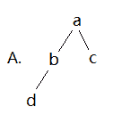
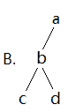
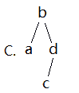
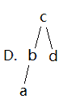
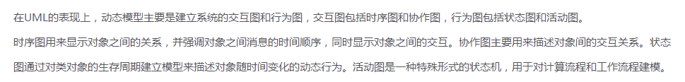
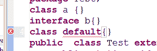
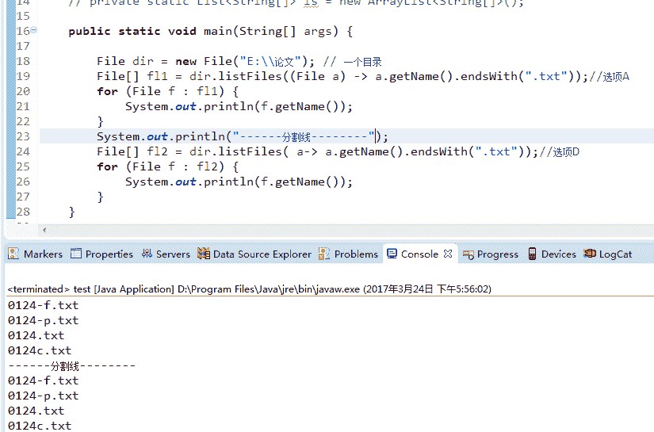

# 北京赞同 2017 校招 java 工程师笔试试卷

## 1

假定 x 和 y 为 double 型，则执行 x=2 ； y=x+3/2； 后 y 的值为（）

正确答案: D   你的答案: 空 (错误)

```cpp
3.500000
```

```cpp
3
```

```cpp
2.000000
```

```cpp
3.000000
```

本题知识点

编程基础 *C++ Java 工程师 北京赞同 2017* *讨论

[牛客 8641736 号](https://www.nowcoder.com/profile/8641736)

我们知道数值的默认类型为 int，题中只定义了 x 和 y 为 double 类型，那么 3/2 的值应该也为 int，也就是 1，用得到的值在于 x 进行计算，等于 3，那么题目中定义 y 为 double 类型，所以得到的结果不是 3，而是 3.00000

发表于 2017-08-18 18:04:38

* * *

[剑凌苍穹](https://www.nowcoder.com/profile/3839590)

3/2 仍是整型运算，为 1

发表于 2017-01-09 00:15:53

* * *

[加贝木贞](https://www.nowcoder.com/profile/8604179)

这道题出题的人应该是想让我们选择 D，可是输入跟语言和编译器都有关系，题目没有给明条件，导致输出结果可能多种多样，我用 c 写输出的就是 3.000000，而 c++是 3.0，编译器为 codebooks

发表于 2017-08-25 11:40:50

* * *

## 2

算式 3<<2|3 的结果是（）

正确答案: C   你的答案: 空 (错误)

```cpp
1
```

```cpp
0
```

```cpp
15
```

```cpp
3
```

本题知识点

C 语言

讨论

[larrysea](https://www.nowcoder.com/profile/5430709)

答案是 C  15  因为左移运算符优先级大于 或运算符，所以 0011（3） 左移两位之后变成 1100  然后与 3 做| 运算之后结果是  1111  十进制就是 15.

发表于 2017-01-29 21:47:36

* * *

[梦境迷离](https://www.nowcoder.com/profile/759736)

还好先算按位是没答案的哈哈

发表于 2018-02-26 17:20:56

* * *

[宗琦](https://www.nowcoder.com/profile/6274268)

00001100 ==3<<200000011==300001111==result 8|3

编辑于 2017-08-29 21:47:50

* * *

## 3

已知 int a=0x122 ，则 a/2 为

正确答案: C   你的答案: 空 (错误)

```cpp
61
```

```cpp
0x61
```

```cpp
145
```

```cpp
94
```

```cpp
以上皆错
```

本题知识点

C 语言

讨论

[zhaoyun](https://www.nowcoder.com/profile/626681)

0x122--二进制 100100010
右移 1 位后 10010001
为十进制 145

发表于 2016-12-28 22:14:58

* * *

[胡文娟 8](https://www.nowcoder.com/profile/8880525)

```cpp
0x122;
C/C++规定,16 进制数必须以 0x 开头；
因此 122 = 1*16²+2*16+2 = 290 
```

发表于 2017-08-18 15:18:38

* * *

[我也支持](https://www.nowcoder.com/profile/6206174)

**十进制 145****十六进制 91**

编辑于 2017-06-28 21:26:03

* * *

## 4

8 位有符号二进数 11100101 代表的十进制数为（）

正确答案: B   你的答案: 空 (错误)

```cpp
229
```

```cpp
-27
```

```cpp
345
```

```cpp
-26
```

本题知识点

编译和体系结构

讨论

[如是我闻 _](https://www.nowcoder.com/profile/667554)

注意是有符号位，首位是 1，表示是负数，负数的表示是正数的原码取反加 1 也就是补码。 1110 0101 要求原码 先减 1 1110 0100 再取反 0001 1011 就是 27，别忘记了符号 就是-27

发表于 2017-01-06 13:38:09

* * *

[Alphat](https://www.nowcoder.com/profile/4832303)

首位是 1，所以是负数，末位是 1，所以是奇数，只有-27 了。

编辑于 2017-08-18 16:46:00

* * *

[星之刃](https://www.nowcoder.com/profile/5534130)

补码：11100101 反码：11100100 原码：10011011 真值：0011011，从原码来看是一个负数，为-27

发表于 2018-03-14 09:46:32

* * *

## 5

下面关于时间复杂度的说法正确的是（）

正确答案: A   你的答案: 空 (错误)

```cpp
冒泡排序法的平均时间复杂度为 O(n²)
```

```cpp
二分法的平均时间复杂度度是 O（n）
```

```cpp
m 个并列循环的时间复杂度为 O（mn）
```

```cpp
快速排序法的时间复杂度一定优于冒泡排序法
```

本题知识点

复杂度 Java 工程师 北京赞同 2017

讨论

[春天的故事 666](https://www.nowcoder.com/profile/2792938)

```cpp
冒泡排序法的平均时间复杂度为 O(n²)
二分法的平均时间复杂度度是 O（logn）,好于顺序表查找的 O(n).
快速排序法的最坏的情况下时间复杂度等于冒泡排序法，都为 O(n²)
```

发表于 2017-08-19 10:32:44

* * *

[NJ](https://www.nowcoder.com/profile/6589088)

冒泡排序的最差时复是 o（n²）吧

发表于 2017-07-22 11:09:57

* * *

[larrysea](https://www.nowcoder.com/profile/5430709)

答案是 A 冒泡排序的时间复杂度是 o(n²) 是真确的。B 二分法排序时间复杂度也是 o(n²)D 快速排序算法时间复杂度不一定优于冒泡排序，最坏情况下也是 O(n²).

发表于 2017-01-29 22:00:52

* * *

## 6

将整数数组（ 7-6-3-5-4-1-2 ）按照堆排序的方式进行升序排列，请问在第一轮排序结束之后，数组的顺序是（）

正确答案: C   你的答案: 空 (错误)

```cpp
1-2-3-4-5-6-7
```

```cpp
2-6-3-5-4-1-7
```

```cpp
6-5-3-2-4-1-7
```

```cpp
5-4-3-2-1-6-7
```

本题知识点

数组 堆 排序 *Java 工程师 北京赞同 2017* *讨论

[丨太阳与月亮丨](https://www.nowcoder.com/profile/9415270)

C 首先原始堆如左上角图  查看全部)

编辑于 2017-03-18 09:03:46

* * *

[大将军豆腐脑好](https://www.nowcoder.com/profile/7116850)

大家对升降序部分可能有点疑惑。先给一个结论：如果想要数组升序就建立大顶推，如果想要数组降序就建立小顶推。 大家要注意，所需要排序的部分是交换到最后一个结点的部分，是这部分排序的，而不是建堆的部分。所以每次建堆的部分为最大堆，根结点变成最大值，然后与最后一个结点交换，所以最后一个结点再出去，最终成为一个题目所要求的成为升序。

编辑于 2017-07-29 10:18:06

* * *

[霞 43](https://www.nowcoder.com/profile/3084718)

初始顺序为 7-6-3-5-4-1-2，将初始顺序调整为最大堆，发现顺序没有变，也 7 是最大值。这时，把最大值 7 与堆中的最后一个数 2 进行调换位置，不再把最后一位算在内，将前后的 6 个数字调整为最大堆 6-5-3-2-4-1-7。后续是把 6 与倒数第二个换顺序再建最大堆吗？也就是每次用堆输出一个最大值，把最大值放在最后，最后直接从堆顶依次输出就是升序序列了，所以是组建大根堆？

发表于 2017-06-09 23:39:10

* * *

## 7

对于二分搜索法，下面描述正确的是（）

正确答案: A C   你的答案: 空 (错误)

```cpp
可用于数组
```

```cpp
可用于单链表
```

```cpp
只能在已排序的数据上进行
```

```cpp
最坏情况下时间复杂度是 O（N*LogN）
```

本题知识点

查找 *Java 工程师 北京赞同 2017* *讨论

[fadkjfalfas](https://www.nowcoder.com/profile/190595)

A C

*   二分查找首先要求数据是有序的,同时要求能随机访问数据元素, 有序数组可以, 链表不行,

*   二分查找因为每次都是从中间点开始查找，所以最坏情况是目标元素存在于最边缘的情况。最坏为 O（LogN）

发表于 2017-01-04 00:18:57

* * *

[丨太阳与月亮丨](https://www.nowcoder.com/profile/9415270)

AC 二分查找需要在已排序的数组上进行，需要能够通过下标直接索引到值，因此无法在链表上进行每次可以排除一般的数字，复杂度 O(logn)

发表于 2017-02-22 14:48:34

* * *

[牛客 580050057 号](https://www.nowcoder.com/profile/580050057)

AC 二分查找首先要求数据是有序的，同时要求能随机访问数据元素，有序数组可以，链表不行二分查找因为每次都是从中间点开始查找，所以最坏情况是目标元素存在于最边缘的情况。最坏为 O(LogN)

发表于 2021-05-12 14:21:25

* * *

## 8

中序遍历为 abcd 的二叉树可能是下面的哪棵？                                         

正确答案: C D   你的答案: 空 (错误)

```cpp
A
```

```cpp
B
```

```cpp
C
```

```cpp
D
```

本题知识点

树 Java 工程师 北京赞同 2017

讨论

[一条大咸鱼](https://www.nowcoder.com/profile/8811452)

把树垂直向下映射得到的顺序就是中序遍历的顺序

发表于 2017-08-24 21:15:52

* * *

[2FA0](https://www.nowcoder.com/profile/6103754)

cd 感觉都对

发表于 2017-08-25 12:49:34

* * *

[阿里云智能招聘](https://www.nowcoder.com/profile/2982788)

中根序遍历：先遍历左子树，然后遍历根结点，最后遍历右子树。

发表于 2017-08-18 17:29:42

* * *

## 9

元素 3,1,2 依次放入一个栈后，顺序取出的结果是（）

正确答案: D   你的答案: 空 (错误)

```cpp
3,2,1
```

```cpp
3,1,2
```

```cpp
1,2,3
```

```cpp
2,1,3
```

本题知识点

栈 *Java 工程师 北京赞同 2017* *讨论

[levine](https://www.nowcoder.com/profile/372089)

2，1，3 栈：先进后出。队列：先进先出。

发表于 2017-08-18 17:43:26

* * *

[qzuser693](https://www.nowcoder.com/profile/7700170)

这里强调的 顺序 。只要按照后进先出就行了

发表于 2017-08-19 15:27:26

* * *

[宫保鸡丁没萝卜](https://www.nowcoder.com/profile/6075174)

栈是后进先出，所以是 2,1,3，选择 D

发表于 2017-01-28 02:04:11

* * *

## 10

设计一个判别表达式中左右括号是否匹配对出现的算法，采用（）数据结构最佳。

正确答案: D   你的答案: 空 (错误)

```cpp
线性表的顺序存储结构
```

```cpp
队列
```

```cpp
线性表的链式存储结构
```

```cpp
栈
```

本题知识点

栈 *Java 工程师 北京赞同 2017* *讨论

[hexiaosa](https://www.nowcoder.com/profile/9067338)

D.利用栈先进后出的特点，左括号入栈，知道碰到一个右括号，则 pop 一个左括号，最后如果碰到右括号栈里没有元素或者访问完表达式栈里还有元素，则说明不配对，否则就是配对。

发表于 2017-03-06 14:23:31

* * *

[奔跑的小渣渣](https://www.nowcoder.com/profile/7284614)

用栈可以实现字符模式匹配

发表于 2017-08-21 02:45:02

* * *

[🏃2579](https://www.nowcoder.com/profile/7111543)

d

发表于 2017-01-06 20:34:56

* * *

## 11

下列哪一个命令为删除 sample 数据库的 tb_ame 表（）

正确答案: D   你的答案: 空 (错误)

```cpp
delete from tb_ame
```

```cpp
delete from sample.tb_ame
```

```cpp
drop table tb_ame
```

```cpp
drop table sample.tb_ame
```

本题知识点

数据库 Java 工程师 北京赞同 2017

讨论

[丨太阳与月亮丨](https://www.nowcoder.com/profile/9415270)

D 删除表首先得确定是哪  查看全部)

编辑于 2017-02-16 11:42:53

* * *

[月光骑士[月亮]](https://www.nowcoder.com/profile/307544183)

delete from 删除数据 drop table 删除表

编辑于 2020-01-30 11:42:08

* * *

[知白 201903201637336](https://www.nowcoder.com/profile/738875004)

C:是进入该数据库 删除数据库内的表文件 D:是在数据库外部 也就是说 可以不用进去数据库就可以删除

发表于 2019-08-08 09:15:20

* * *

## 12

有以下程序段， 则下面正确的选项是（）

```cpp
public class MyThead extends Thread{
	public static void main(String[] args) {
		MyThead t=new MyThead();
		MyThead s=new MyThead();
		t.start();
		System.out.println("one.");
		s.start();
		System.out.println("two.");
	}
	public void run() {
		System.out.println("Thread");
	}
}
```

正确答案: B C D   你的答案: 空 (错误)

```cpp
编译失败
```

```cpp
程序运行可能结果为：
one.
Thread
two.
Thread
```

```cpp
程序运行可能结果是：
one.
two.
Thread
Thread
```

```cpp
程序运行结果不稳定
```

本题知识点

Java Java 工程师 北京赞同 2017

讨论

[城去歌](https://www.nowcoder.com/profile/1595612)

就没人只选了个 D 吗。。。

发表于 2017-09-12 14:50:11

* * *

[阿猫阿狗被占用](https://www.nowcoder.com/profile/918575)

选了个 A.妈的。

发表于 2017-03-24 19:38:09

* * *

[呆尐兔兔](https://www.nowcoder.com/profile/6638666)

start()是开启线程，等待获得时间片，一到获得时间片就执行。所以可能一开启就获得了时间片执行，也有可能等到 two 输出后才获得了时间片。所以 BC 都可能，所以 D 也正确。

编辑于 2017-05-26 15:27:58

* * *

## 13

在掩码为 255.255.224.0 条件下，下面哪些 ip 地址属于同一网段（）

正确答案: A C   你的答案: 空 (错误)

```cpp
192.168.235.25
```

```cpp
192.168.188.99
```

```cpp
192.168.246.187
```

```cpp
192.168.67.28
```

本题知识点

网络基础 Java 工程师 北京赞同 2017

讨论

[cquptli](https://www.nowcoder.com/profile/913077)

**方法一：区间段****第三段 224**

| **1** | **1** | **1** | 0 | 0 | 0 | 0 | 0 |

 最小值：225

| **1** | **1** | **1** | 0 | 0 | 0 | 0 | 1 |

 最大值：254

| **1** | **1** | **1** | 1 | 1 | 1 | 1 | 0 |

区间在【225-254】即可  所以答案为 A C**方法二: 子网掩码相同**224 **1 1 1** 0 0 0 0 0

A 235 **1 1 1** 0   1 0 1 1

B 188  1 0 1 1   1 1 0 0

C 246 **1 1 1** 1  0 1 1 0

D 67   0 1 0 1  0 0 1 1

编辑于 2017-03-14 11:45:39

* * *

[SunburstRun](https://www.nowcoder.com/profile/557336)

答案是 AC 这是一个 B 类地址,那么下面应该分为 8 个网段 ，0-255 被分为 0 到 31，到 63，到 95，到 127，到 159，到 191，到 223，到 254。所以答案是 AC

编辑于 2016-12-13 14:13:44

* * *

[offerofferoffer](https://www.nowcoder.com/profile/8481939)

做与运算，出来的结果为网络号，相同的就在同一个网络

发表于 2017-09-13 20:54:06

* * *

## 14

下面（）属于 UML 中的动态视图。

正确答案: D   你的答案: 空 (错误)

```cpp
类图
```

```cpp
用例图
```

```cpp
对象图
```

```cpp
状态图
```

```cpp
时序图
```

本题知识点

系统设计 Java 工程师 北京赞同 2017

讨论

[Yang201903290934334](https://www.nowcoder.com/profile/950163492)

uml 中的动态图有四种：1.状态图 2.序列图 3.活动图 4.协作图

发表于 2019-04-15 16:31:10

* * *

[梦境迷离](https://www.nowcoder.com/profile/759736)

时序图（Sequence Diagram），又名序列图、循序图、顺序图，是一种 UML 交互图。它通过描述对象之间发送消息的时间顺序显示多个对象之间的动态协作。它可以表示[用例](https://baike.baidu.com/item/%E7%94%A8%E4%BE%8B)的行为顺序，当执行一个用例行为时，其中的每条消息对应一个类操作或[状态机](https://baike.baidu.com/item/%E7%8A%B6%E6%80%81%E6%9C%BA)中引起转换的触发事件。看不懂题目什么意思

发表于 2018-02-26 17:28:43

* * *

[菜鸟菜鸟](https://www.nowcoder.com/profile/6204171)



发表于 2017-08-18 22:37:31

* * *

## 15

以下对于方法覆盖的说法正确的有（）

正确答案: B C D   你的答案: 空 (错误)

```cpp
方法覆盖发生在同一类中
```

```cpp
方法的覆盖发生在子类型中
```

```cpp
方法名一定要一样
```

```cpp
参数类型一定要一样
```

```cpp
返回类型一定要一样
```

```cpp
访问权限只能一样
```

本题知识点

C++

讨论

[墨荷](https://www.nowcoder.com/profile/8283691)

B C D

*   ```cpp
    方法覆盖发生在同一类中 错误，在一个类中叫重载
    ```

*   ```cpp
    方法的覆盖发生在子类型中 正确，覆盖发生在之类
    ```

*   ```cpp
    方法名一定要一样    正确，覆盖方法名必须一样   
    ```

*   ```cpp
    参数一定要一样    正确，覆盖时方法参数一致
    ```

*   ```cpp
    返回类型一定要一样    错误，方法的覆盖对返回值的要求是：小于等于父类的返回值
    ```

*   ```cpp
    访问权限只能一样    错误，方法的覆盖对访问要求是：大于等于父类的访问权限
    ```

如果有误请大家帮忙纠正过来，谢谢各位。

编辑于 2016-12-29 09:10:53

* * *

[Linsanity](https://www.nowcoder.com/profile/7457652)

MARK 一下，方法覆盖（区别于方法重载，在一个类中的是重载）1.“两小” ：子类方法的返回值类型、抛出的异常  均应小于等于父类方法的 2.“两同”：子类方法的方法名、参数列表均应该与父类方法相同 3.“一大”：子类方法的访问权限应该大于等于父类方法的访问权限

发表于 2017-05-09 13:29:10

* * *

[橙小白](https://www.nowcoder.com/profile/5330600)

方法覆盖就是重写的意思

发表于 2017-08-26 14:11:04

* * *

## 16

下面关于程序编译说法正确的是（）

正确答案: C   你的答案: 空 (错误)

```cpp
java 语言是编译型语言，会把 java 程序编译成二进制机器指令直接运行
```

```cpp
java 编译出来的目标文件与具体操作系统有关
```

```cpp
java 在运行时才进行翻译指令
```

```cpp
java 编译出来的目标文件，可以运行在任意 jvm 上
```

本题知识点

Java Java 工程师 北京赞同 2017

讨论

[梦辛弃忧](https://www.nowcoder.com/profile/9132953)

  查看全部)

编辑于 2018-05-06 22:37:59

* * *

[洒洒](https://www.nowcoder.com/profile/4739590)

什么烂题

发表于 2016-12-14 23:55:49

* * *

[叼根烟似的](https://www.nowcoder.com/profile/3282233)

编译型语言的首先将源代码编译生成机器语言，再由机器运行[机器码](http://baike.baidu.com/view/52.htm)（[二进制](http://baike.baidu.com/view/18536.htm)）。像 C/C++等都是[编译型语言](http://baike.baidu.com/view/1284280.htm)。程序执行效率高，依赖编译器，跨平台性差些。如 C、C++、Delphi 等[解释性语言](http://baike.baidu.com/view/1760224.htm)在运行[程序](http://baike.baidu.com/view/17674.htm)的时候才翻译，比如解释性 basic 语言，专门有一个[解释器](http://baike.baidu.com/view/592974.htm)能够直接执行 basic 程序，每个语句都是执行的时候才翻译。这样[解释性语言](http://baike.baidu.com/view/1760224.htm)每执行一次就要翻译一次，效率比较低。如 JavaScript、VBScript、Perl、Python、Ruby、MATLAB 等等**Java 不同于一般的编译语言和直译语言。它首先将源代码编译成字节码，然后依赖各种不同平台上的虚拟机来解释执行字节码，从而实现了“一次编写[，](http://zh.wikipedia.org/wiki/%E4%B8%80%E6%AC%A1%E7%BC%96%E5%86%99%EF%BC%8C%E5%88%B0%E5%A4%84%E8%BF%90%E8%A1%8C)到处运行”的跨平台特性，** 所以说 java 是一种解释型的语言

发表于 2017-03-20 15:57:23

* * *

## 17

对于构造方法（ constructor ）描述正确的有：（）

正确答案: A C   你的答案: 空 (错误)

```cpp
构造方法没有返回类型
```

```cpp
构造方法一定是 public 的方法
```

```cpp
如果我们没有显示定义构造方法，系统会提供一个缺省的
```

```cpp
构造方法不能重载
```

本题知识点

C++

讨论

[cyanlong](https://www.nowcoder.com/profile/8977519)

A:构造方法没有返回类型。正确 B.错误。构造方法的访问修饰符是可以为任意的。比如最常见的当我们构造单例时需要将构造函数私有化。C.正确。当没有显示定义构造器时，会默认提供一个无参的构造器。D.错误。重载是指拥有相同方法名，但方法参数列表不同。构造器支持重载，如下例子:

```cpp
class Student{
    int id;
    String name;

    public Student(){
    }
    public Student(int id){
        this.id = id;    
    }   
    public Student(String name){
        this.name = name;
    }
}          
```

这样，我们可以根据不同的初始化字段提供不同的构造函数供客户端方便使用。总：答案为 AC

编辑于 2016-12-31 16:02:57

* * *

[心存蓝天](https://www.nowcoder.com/profile/2690446)

AC，构造函数没有返回类型，这个是对。构造函数可以是私有的，当构造函数是私有函数的时候，就不能实例化一个对象了。构造函数如果我们不去显式的去定义，系统是会提供一个默认的构造函数。构造函数可以重载，参数数目或者参数类型不同都是重载的构造函数。

发表于 2016-12-31 16:03:28

* * *

[牛客 620058012 号](https://www.nowcoder.com/profile/620058012)

这不是 C++的知识吗？怎么 C 语言题库中会出现

发表于 2020-10-15 19:25:42

* * *

## 18

以下为 java 语法保留不能作为类名和方法名使用的是

正确答案: A B C D   你的答案: 空 (错误)

```cpp
default
```

```cpp
int
```

```cpp
implements
```

```cpp
throws
```

本题知识点

Java Java 工程师 北京赞同 2017

讨论

[Fndoid](https://www.nowcoder.com/profile/9439878)

Java8 关键字 default 也被使用了，所以正确答案应该全选

发表于 2016-12-20 18:21:07

* * *

[阿森先生](https://www.nowcoder.com/profile/4775155)

default 也是不能作为类名的关键字啊

发表于 2017-01-11 20:44:06

* * *

[晓飛](https://www.nowcoder.com/profile/706019)

implements《注意有 s 结尾》是 java 实现接口的关键字，而 implement 则是普通单词，default 是保留字，throws 是抛出异常的关键字，所以正确答案是 ABD

编辑于 2017-04-04 15:44:47

* * *

## 19

Choose the correct  ones from the following statements:

正确答案: A D   你的答案: 空 (错误)

```cpp
A class can implement more than one interfaces
```

```cpp
A class can extend more than one class
```

```cpp
An interface has at least one method declared.
```

```cpp
An abstract class which has no abstract methods declared is legal
```

本题知识点

编程基础 *Java Java 工程师 北京赞同 2017* *讨论

[紫旋](https://www.nowcoder.com/profile/795206)

```cpp
1、一个类可以有多个接口； 2
```

  查看全部)

编辑于 2017-03-17 23:30:20

* * *

[牛客 hw](https://www.nowcoder.com/profile/8648683)

简单的做个关于抽象类和接口的总结吧：区别 1：抽象类体现继承关系，一个类只能単继承。接口体现实现关系，一个类可以多实现。区别 2：抽象类中可以定义非抽象方法和抽象方法，子类继承后可以直接使用非抽象方法。接口的方法都            是抽象的，必须由子类去实现。接口中的成员都有固定的修饰符。区别 3：抽象类有构造方法，用于给子类对象初始化。而接口没有构造方法。特点 1：抽象类不可以实例化，即不能用 new 创建对象。抽象类必须由其子类**覆盖**了所有的抽象方法后，           该子类才可以实例化，否则，这个子类也是抽象类。特点 2：抽象类 abstract 关键字不能和哪些关键字共存:

*   final 因为 final 修饰的方法不能被继承。
*   static 因为类.方法（），此方法没有方法体，没有意义。
*   private 因为抽象方法是要被子类覆盖的，加上 private 子类就不知道这个方法了。

特点 3：接口中声明变量必须是 final、public 、static 的，接口中定义的方法都是 abstract、                    public 的。接口里的数据成员必须初始化，且全是常量，不是变量。特点 4：接口是抽象类的 ***变体（*** 你没看错 ***），*** 接口也可以通过关键字 extends 来继承其他接                  口。格式如下所示：            class 类名称 implements 接口 A，接口 B{   //接口的实现}            interface 子接口名称 extends 父接口 1，父接口 2，...{}

编辑于 2017-03-31 11:34:50

* * *

[╰゛Mor~ning](https://www.nowcoder.com/profile/6520662)

大家不要吵了。这一题考的是英语。

发表于 2017-03-02 12:14:10

* * *

## 20

下面哪些写法能在 java8 中编译执行（）

正确答案: A D   你的答案: 空 (错误)

```cpp
dir.listFiles((File f)->f.getName().endsWith(“.Java”));
```

```cpp
dir.listFiles((File f)=>f.getName().endsWith(“.Java”));
```

```cpp
dir.listFiles((_.getName().endsWith(“.Java”)));
```

```cpp
dir.listFiles( f->f.getName().endsWith(“.Java”));
```

本题知识点

Java Java 工程师 北京赞同 2017

讨论

[Vanguard](https://www.nowcoder.com/profile/5495460)

Lanbda 表达式的主要作用就是代替匿名内部类的繁琐语法， 它由三部分组成：（1） 形参列表。形参列表允许省略形参类型。如果形参列表中只有一个参数，甚至连形参列表的圆括号也可以省略。（2） 箭头（→）。必须通过英文中画线和大于符号组成。（3）代码块。如果代码块只包含一条语句，Lambda 表达式允许省略代码块的花括号，那么那条语句就不要用花括号表示语句结束。Lambda 代码块只有一条 return 语句，甚至可以省略 return 关键字。Lambda 表达式需要返回值，而它的代码块中仅有一套省略了 return 的语句。Lambda 表达式会自动返回这条语句的值。由此可见，应该是 A 和 D 正确。

发表于 2017-08-02 08:24:35

* * *

[武岩](https://www.nowcoder.com/profile/4552908)

亲测 A 和 D，BC 会报错。

编辑于 2017-03-24 17:57:17

* * *

[牛客 4868318 号](https://www.nowcoder.com/profile/4868318)

C 明显括号都不匹配，我不知道正确在哪。A 和 D 都是 jdk8 的 lambda 表达式

```cpp
public class TestJdk08 { public static void main(String args[]){
    File file =new File("/Users/hao/Downloads");  File[] ff=file.listFiles( (File f)->f.getName().endsWith(".caj")); for (File ss: ff) {
        System.out.println(ss.getName());  }

}
} 
```

发表于 2017-01-05 11:26:37

* * *******