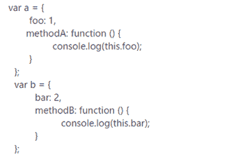
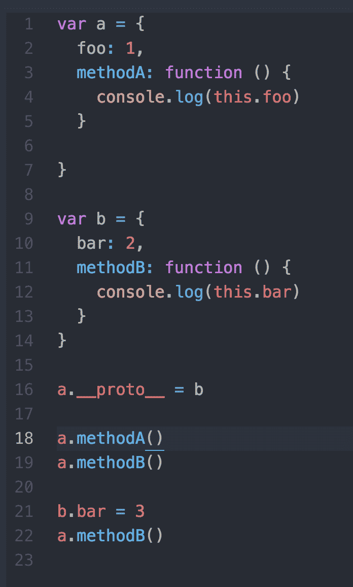
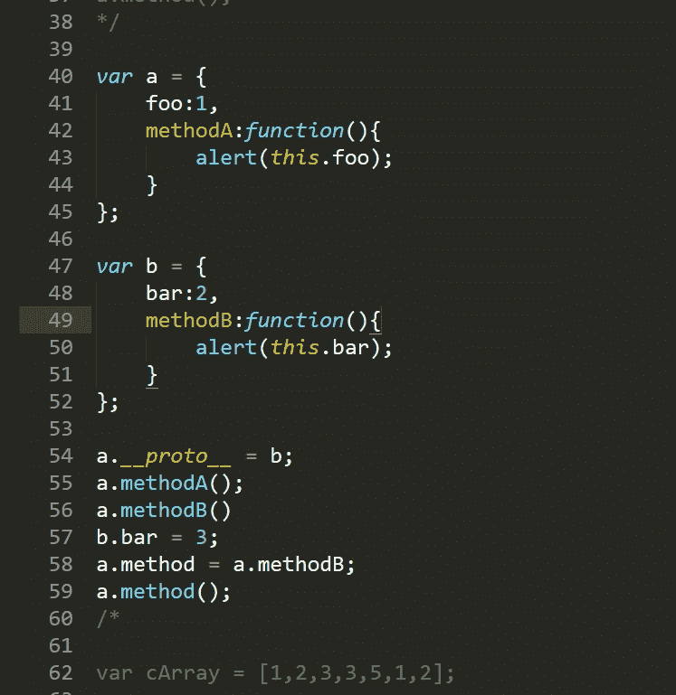
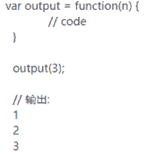
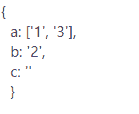
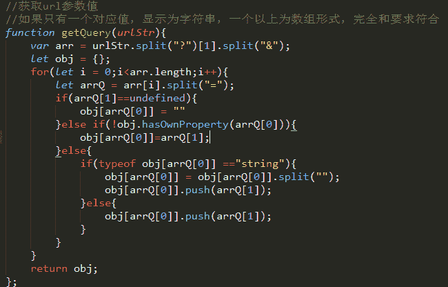

# 挖财 2017 校招前端工程师笔试试卷

## 1

如何实现点击文字选中 checkbox？

你的答案

本题知识点

HTML 前端工程师 挖财 2017

讨论

[Rosevil](https://www.nowcoder.com/profile/2133146)

DOM 结构：

```cpp
<form>
    <label for="check">点我选中</label>
    <input type="checkbox" name="name" id="check">
</form>

```

js 代码：

```cpp
var label = document.getElementsByTagName('label')[0]
var check = document.getElementsById('check')
label.onclick = function ( ) {
    check.checked = true
}
```

发表于 2017-08-21 15:18:04

* * *

[坠凡～涅护](https://www.nowcoder.com/profile/6920603)

1.  第一题， 可以直接通过 label 标签

```cpp
<label for="check"><input type="checkbox" id="check"/>name</label>
```

1.  第二题 http 是无状态协议，因此服务端普通情况下无法区分请求是谁发出来的，因此引入了 session 机制，那么问题来了，session 怎么用？他会默认保存在浏览器的 cookie 之中，每一个请求都会带上 cookie,cookie 有服务器区别是哪一个客服端发出的请求 session,因此，服务器就能正常区分了。正常情况下，浏览器关闭会清除 session. 此外，cookie 还可以保存任何本地信息，不过有容量限制

编辑于 2017-03-24 14:48:50

* * *

[小七 201809242255482](https://www.nowcoder.com/profile/744723081)

直接设置 label 的 for 属性值为 input 的 id 属性值

发表于 2019-03-04 10:23:31

* * *

## 2

cookie、session 分别用来做什么的，有什么关系？

你的答案

本题知识点

WebServer 前端工程师 挖财 2017

讨论

[Rosevil](https://www.nowcoder.com/profile/2133146)

1\. cookie 用来在客户端存储用户信息，session 用来在服务器端存储用户数据，均可用于户跟踪用户状态。2\. 由于存放在服务器端，session 较存放在客户端的 cookie 来说更为安全，用户验证等重要信息一般存放于 session，但 cookie 也可以加密来提高安全性。3\. cookie 在使用脚本或用户手动删除前永久保存，最大一般为 4KB。session 在会话期间保存，当访问增多会加重服务器负担。4\. session 的实现需要 cookie 支持：session 依赖 session ID 实现，而 session ID 存放于 cookie，因此，禁用 cookie 之后 session 也会失效。但可使用其他方法实现，如：在 URL 中传递 session ID。5\. session 在服务器端可存放于文件（默认）、数据库或内存。6\. session 支持各种类型对象，cookie 只保存字符串。

发表于 2017-08-21 15:36:14

* * *

[Ewall](https://www.nowcoder.com/profile/7542550)

Session 是在服务端保存的一个数据结构，用来跟踪用户的状态，这个数据可以保存在集群、数据库、文件中；
Cookie 是客户端保存用户信息的一种机制，用来记录用户的一些信息，也是实现 Session 的一种方式

发表于 2018-01-15 11:02:25

* * *

[ichengzi_me](https://www.nowcoder.com/profile/6957224)

Session:因为 http 协议本身是无状态的，但是往往网站的业务又需要维护用户状态信息。那么 session 是用来在服务器端为一个固定用户的一个会话创建一个 sessionid。通过这个 session 在服务器端和客户端之间的传递来维持会话。Session 的失效的情况有:超过一定时间服务器端没有接收到请求(tomcat 默认是 30 分钟)，或者客户端的浏览器实例关闭。

 既然是维持会话状态，那一定客户端也要维持这个 sessionid，这里就用到了 cookies。而且这个 cookies 往往是没有过期时间的，所以不会持久化到磁盘，而是存放在内存中，就由浏览器实例来管理。客户端发送请求的时候，所谓的 SESSINOID 参数有正是在 cookies 这个头里面的。

 以上是 session 和 cookies 的关系。  

 但是 cookie 的功能又不完全是为了配合 session 的。很多网站会利用 cookies 做很多的业务，比如购物车，个人喜好等。往往这些 cookies 有一定的过期时间，所以必须要保存在磁盘中去，其实想想服务器端一定也会持久化这些信息，才能达到两者之间的交互。

发表于 2017-02-23 19:18:42

* * *

## 3

如何实现一个 img 图片在指定容器中水平垂直居中？

你的答案

本题知识点

HTML 前端工程师 挖财 2017

讨论

[牛客 5277420 号](https://www.nowcoder.com/profile/5277420)

left:50%;top:50%;transform:translate(-50%,-50%)

发表于 2016-12-22 17:42:57

* * *

[Amethyst](https://www.nowcoder.com/profile/5469256)

父元素：

```cpp
position: relative;

```

img:

```cpp
position: absolute;
top: 0;
right: 0;
bottom: 0;
left: 0;
margin: auto;
```

发表于 2017-08-23 13:13:39

* * *

[mMelisa](https://www.nowcoder.com/profile/579688)

<div class="wrap">    
</div><style>/* 法一（IE6/IE7 不支持 table-cell）：*/.wrap{ display:table-cell;width:600px;height:600px;text-align:center;vertical-align:middle; }/* 法二（元素高度/字体大小=1.14 时支持垂直居中；font-size 和 font-family 解决）：*/.wrap{ display:table-cell;width:600px;height:600px;text-align:center;vertical-align:middle; *font-family:simsun;*font-size:200px;}.wrap img{ vertical-align:middle; } /* 法三 */.wrap{ position:relative; }.wrap img{ position:absolute;left:50%;top:50%;-webkit-tranform:translate(-50%,-50%);-moz-tranform:translate(-50%,-50%);tranform:translate(-50%,-50%);}</style>

发表于 2017-08-29 16:08:41

* * *

## 4

给出伪元素(::before, ::after)的几种使用场景？

你的答案

本题知识点

HTML 前端工程师 挖财 2017

讨论

[Xiaolony](https://www.nowcoder.com/profile/2968685)

1.清除浮动时 2.利用 attr()来实现某些动态功能时 3.与 counter()结合实现序号问题，而不用使用列表元素 4.实现各种特效

发表于 2017-02-21 20:18:33

* * *

[最最可爱的💕](https://www.nowcoder.com/profile/1267099)

1：[String] - 使用引号包括一段字符串，将会向元素内容中添加字符串 2：attr() – 调用当前元素的属性，可以方便的比如将图片的 Alt 提示文字或者链接的 Href 地址显示出来。 3：url() / uri() – 用于引用媒体文件。4：counter() – 调用计数器，可以不使用列表元素实现序号功能。5:清除浮动.clear-fix  { *overflow: hidden; *zoom: 1; }  .clear-fix:after  { display: table; content: ""; width: 0; clear: both; } 

发表于 2017-10-23 10:27:44

* * *

[牛客 9033596 号](https://www.nowcoder.com/profile/9033596)

a:after  { content: "↗"; }a:after  { content:"(" attr(href) ")"; }h1::before  { content: url(logo.png); }h2:before  { counter-increment: chapter; content: "Chapter " counter(chapter) ". " }

发表于 2017-08-23 15:01:01

* * *

## 5

针对如下 DOM 结构，编写 CSS ，实现三栏水平布局，其中 left 、 right 分别位于左右两边， left 宽度为 200px ， right 宽度为 300px ， main 处在中间，宽度自适应。要求：允许增加额外 DOM 节点，但不能修改现有节点顺序。

```cpp
<divclass="container">
    <div class="main">main</div>
    <div class="left">left</div>
    <div class="right">right</div>
</div>
```

你的答案

本题知识点

HTML 前端工程师 挖财 2017

讨论

[Rosevil](https://www.nowcoder.com/profile/2133146)

```cpp
 .container {
    display:flex;
}
.main{
    flex: 1;
    background-color:#eee;
}
.left{
    flex-basis:200PX;
    order:-1;
    background-color: lightblue;
}
.right {
    flex-basis: 300px;
    background-color:lightblue;
}
```

发表于 2017-08-21 15:51:00

* * *

[一只大恐龙](https://www.nowcoder.com/profile/8124467)

圣杯布局双飞翼布局绝对定位布局 flex 布局

发表于 2017-08-20 17:34:57

* * *

[昔阳](https://www.nowcoder.com/profile/3105469)

```cpp
<style>
*{margin:0px;}
</style>
<div class="container">
<div class="main" style="width:auto;margin-left:200px;margin-right:300px;">main</div>
<div class="left" style="width:200px;position:absolute;top:0px;left:0px;">left</div>
<div class="right" style="width:300px;position:absolute;top:0px;right:0px;">right</div>
</div>
```

发表于 2017-03-07 15:55:46

* * *

## 6

如下两个普通对象

 

可以不考虑执行环境的兼容性，实现如下要求：- 执行  a.methodA() 输出  1- 执行  a.methodB() 输出  2- 执行  b.bar=3; a,method() 输出  3

你的答案

本题知识点

编程基础 *Javascript 前端工程师 挖财 2017* *讨论

[CedricSong](https://www.nowcoder.com/profile/1819066)



发表于 2017-03-06 14:34:02

* * *

[寂寞的刘老头](https://www.nowcoder.com/profile/9377386)

```cpp
var a = {
	foo:1,
	methodA:function(){
		alert(this.foo);
	}
};

var b = {
	bar:2,
	methodB:function(){
		alert(this.bar);
	}
};

a.methodA();

a.methodB = function(){
	b.methodB();
}
a.methodB();

b.bar=3;
a.method = function(){
	alert(b.bar);
}
a.method();

// 另外一种方法
var a = {
	foo:1,
	methodA:function(){
		alert(this.foo);
	}
};

var b = {
	bar:2,
	methodB:function(){
		alert(this.bar);
	}
};

a.__proto__ = b;
a.methodA();
a.methodB()
b.bar = 3;
a.method = a.methodB;
a.method();

```



编辑于 2017-08-30 16:28:38

* * *

[Orange。](https://www.nowcoder.com/profile/608812)

```cpp
var a = {
	foo : 1,
	methodA : function(){
		console.log(this.foo);
	}
};
var b = {
	bar : 2,
	methodB : function(){
		console.log(this.bar)
	}
};

a.methodB = function(){
	return b.methodB();
}

a.methodA(); //1
a.methodB(); //2
b.bar = 3;
a.methodB(); //3
```

编辑于 2017-08-22 11:51:11

* * *

## 7

实现一个定时输出函数，传入一个正整数参数 ’n’ ，从 1 开始每隔 1s 递增输出整数，直到等于 ’n’ 为止。

你的答案

本题知识点

编程基础 *Javascript 前端工程师 挖财 2017* *讨论

[Rosevil](https://www.nowcoder.com/profile/2133146)

```cpp
var output = function(n){
    var i = 1
    var timer = setInterval(function(){
        console.log(i++)
        if(--n == 0){
            clearInterval(timer)
        }
    }, 1000)
}
```

发表于 2017-08-21 16:39:00

* * *

[Senor 焱](https://www.nowcoder.com/profile/7904198)

```cpp
var output = function(n){ 
    for(var i=0; i; i++){
        (function(){ 
            var j =i;  
            setTimeout(function () {                     
              console.log(j+1)
            },j*1000)
        })();  
    }
} 
```

编辑于 2017-04-08 22:41:43

* * *

[人生还有多少个二十年](https://www.nowcoder.com/profile/8733038)

此题要是实现的是一个定时输出的函数，因此要用到定时器。以下我给出两个解决方案:

**方案一（使用 setTimeout(fn, delay)）**

```cpp
var output = function(n){
    i = i || 0;
    if(i <= n){
        console.log(i++);
        setTimeout(function(){output(n);},1000);}
} 
```

**方案二（使用 setInterval(fn, delay)）**

```cpp
var output = function(n){
    i = i || 0;
    var timer = setInterval(function(){ 
                               console.log(i++);
                               if(i > n){
                                   clearInterval(timer);}                        
    },1000);
} 
```

编辑于 2017-03-05 16:51:16

* * *

## 8

鼠标悬停在某个元素上时，在这个位置出现一个 tooltip 文字提示。请给出主要实现代码或伟大吗，包括 DOM 结构，CSS，JS 等。

你的答案

本题知识点

Javascript HTML 前端工程师 挖财 2017

讨论

[Rosevil](https://www.nowcoder.com/profile/2133146)

```cpp
<!DOCTYPE html>
<html lang="en">
<head>
	<meta charset="UTF-8">
	<title> tooltip</title>
	<style type="text/css">
		#box{
			margin-left: 300px;
			width: 500px;
			height:500px;
			background-color:lightblue;
			} 
		#tooltip{
			z-index: 1000;
			position: relative;
			top:0;
			left:0;
			display:none;
			width: 200px;
			height: 35px;
			line-height: 35px;
			background-color:#eee;
		}
	</style>
</head>

<body>
<div id="box">
	<p>鼠标快过来呀</p>
	<div id="tooltip">~\(≧▽≦)/~啦啦啦</div>
</div>
</body>

<script type="text/javascript">
var box = document.getElementById('box')
var tooltip = document.getElementById('tooltip')

box.onmousemove = function(e){
	e = e ? e : window.event
	var x = e.clientX - box.offsetLeft
	var y = e.clientY - box.clientTop

	tooltip.style.display = "block"
	tooltip.style.left = x + "px"
	tooltip.style.top = y + "px"
}
box.onmouseout = function () {
	tooltip.style.display = "none"
}
</script>
</html>
```

编辑于 2017-08-21 17:51:28

* * *

[番茄炒西红柿、](https://www.nowcoder.com/profile/811407852)

```cpp
 <!DOCTYPE html>
<html lang="en">
<head>
  <meta charset="UTF-8">
  <meta name="viewport" content="width=device-width, initial-scale=1.0">
  <meta http-equiv="X-UA-Compatible" content="ie=edge">
  <title>Document</title>
  <style>
    .tooltip {
      visibility: hidden;
      transition: all 0.5s;
    }
  </style>

</head>

<body>
  <p class="tooltip">请输入日期信息</p>
  <input class="date-input" type="date"></input>

  <script>
    (function showTooltip(event) {
      var dateInput = document.getElementsByClassName('date-input')[0];
      var tooltip = document.getElementsByClassName('tooltip')[0];
      dateInput.addEventListener('mouseover', function() {
        tooltip.style.visibility = "visible";
      })
      dateInput.addEventListener('mouseout', function() {
        tooltip.style.visibility = "hidden";
      })
    })()
  </script>
</body>
</html> 
```

发表于 2018-10-07 10:13:29

* * *

[小七 201809242255482](https://www.nowcoder.com/profile/744723081)

直接设置 title 属性

发表于 2019-03-04 10:37:09

* * *

## 9

解析指定 url 地址，返回其中的 query 参数对象，可以不考虑执行环境的兼容性。 如： [`www.wacai.com/login?a=1&b=2&a=3&c`](http://www.wacai.com/login?a=1&b=2&a=3&c)返回：

你的答案

本题知识点

PHP C# Javascript 前端工程师 挖财 2017

讨论

[rookie1992](https://www.nowcoder.com/profile/209589)

//如果只有一个对应值，显示为字符串，一个以上为数组形式，完全和要求符合
function getQuery(urlStr){
    var arr = urlStr.split("?")[1].split("&");
    let obj = {};
    for(let i = 0;i<arr.length;i++){
        let arrQ = arr[i].split("=");
        if(arrQ[1]==undefined){
            obj[arrQ[0]] = ""
        }else if(!obj.hasOwnProperty(arrQ[0])){
            obj[arrQ[0]]=arrQ[1];
        }else{
            if(typeof obj[arrQ[0]] =="string"){
                obj[arrQ[0]] = obj[arrQ[0]].split("");
                obj[arrQ[0]].push(arrQ[1]);
            }else{
                obj[arrQ[0]].push(arrQ[1]);
            }
        }
    }
    return obj;
};



编辑于 2017-10-12 22:33:01

* * *

[Rosevil](https://www.nowcoder.com/profile/2133146)

```cpp
function urlParse(url) {
	var result = {}
	var elems = url.split('?')[1].split('&')

	elems.forEach(function(e){
		var keyVal = e.split('='),
			key = keyVal[0]
			val = keyVal[1] || ''		//没有 value 的情况下表示为‘’而非 undefined

		if(result[key] !== void 0){		//属性有两个以上的值，存储为字符串数组
			result[key] = [].concat(result[key]).concat(val)
		}else{							//只有一个属性值，以字符串形式存储
			result[key] = val
		}
	})

	return result
}
```

发表于 2017-08-21 17:40:26

* * *

[Bidding](https://www.nowcoder.com/profile/2628596)

```cpp
function getQuery(url){
	var queryArr=url.split('?')[1].split('&');
	var obj={};
	for(var i=0;i<queryArr.length;i++){
		var temp=queryArr[i].split('=');
		if (temp.length===1) {
			obj[temp[0]]='';
		}else{
			if (!obj[temp[0]]) {
				obj[temp[0]]=temp[1];
			}else{
				obj[temp[0]]=[obj[temp[0]]];
				obj[temp[0]].push(temp[1]);
			}
		}
	}
	return obj;
}
```

发表于 2017-08-01 10:07:11

* * ***