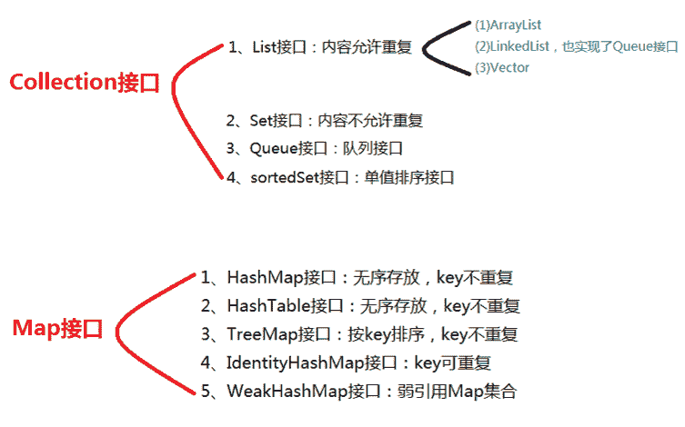
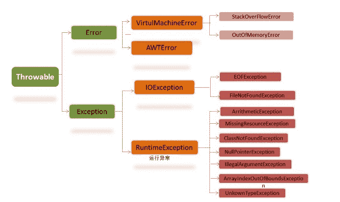
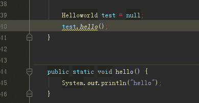
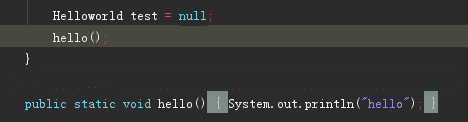
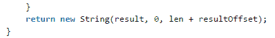
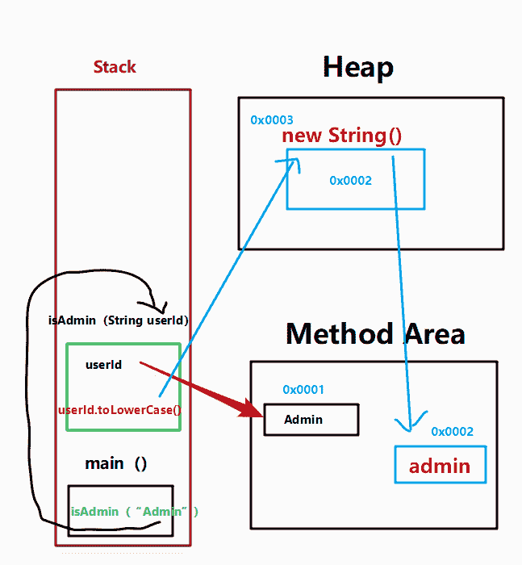
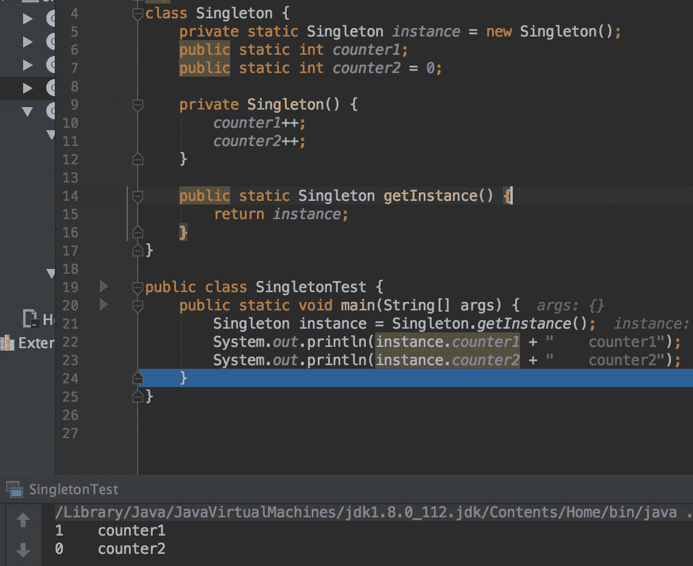
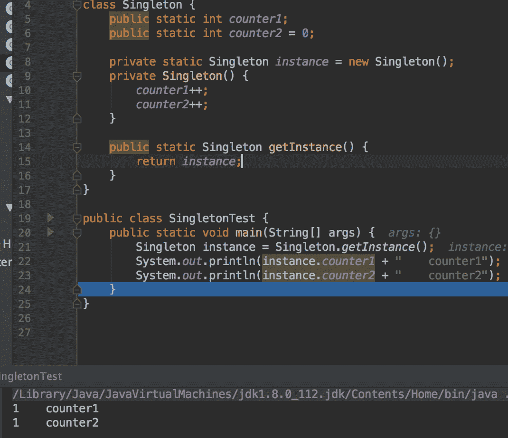

# 新奥特 2017 校招 java 工程师笔试题

## 1

在上下文及头文件均正常的情况下，执行如下代码， c 的值是：（）

```cpp
int a = 0, c = 0;
do{
    --c;
    a = a-1;
}while(a > 0);
```

正确答案: C   你的答案: 空 (错误)

```cpp
0
```

```cpp
1
```

```cpp
-1
```

```cpp
死循环
```

本题知识点

C++

讨论

[华中第一狠人程德彪](https://www.nowcoder.com/profile/616662)

**do-while** **语句的一般形式为** **:**
**        do** **语句** **        while(** **表达式** **)** **；**  **这个循环与** **while** **循环的不同在于** **:** **它先执行循环中的语句** **,** **然后再判断表达式是否为真** **,** **如果为真则继续循环；如果为假** **,** **则终止循环。因此** **, do-while** **循环至少要执行一次** [**循环语句**](https://www.baidu.com/s?wd=%E5%BE%AA%E7%8E%AF%E8%AF%AD%E5%8F%A5&tn=44039180_cpr&fenlei=mv6quAkxTZn0IZRqIHckPjm4nH00T1dBuW--uARvPHb3rHbLP1I-0ZwV5Hcvrjm3rH6sPfKWUMw85HfYnjn4nH6sgvPsT6KdThsqpZwYTjCEQLGCpyw9Uz4Bmy-bIi4WUvYETgN-TLwGUv3EnHDYP1m1PjTL) **。**  使用 while 语句应注意以下几点： 1 **、** **while** **语句中的表达式一般是关系表达或** [**逻辑表达式**](https://www.baidu.com/s?wd=%E9%80%BB%E8%BE%91%E8%A1%A8%E8%BE%BE%E5%BC%8F&tn=44039180_cpr&fenlei=mv6quAkxTZn0IZRqIHckPjm4nH00T1dBuW--uARvPHb3rHbLP1I-0ZwV5Hcvrjm3rH6sPfKWUMw85HfYnjn4nH6sgvPsT6KdThsqpZwYTjCEQLGCpyw9Uz4Bmy-bIi4WUvYETgN-TLwGUv3EnHDYP1m1PjTL) **，只要表达式的值为真** **(** **非** **0)** **即可继续循环。** **2** **、循环体如包括有一个以上的语句，则必须用** **{}** **括起来，组成复合语句。**

 程序最开始执行--c,现在 c 变成了-1，接着执行 a=a-1,a 也变成了-1，再执行 while 语句，while（a>0）,判断为假，退出循环，故 c= -1

编辑于 2017-01-22 16:49:11

* * *

[牛客 6683143 号](https://www.nowcoder.com/profile/6683143)

其实这是一道 “看图说话” 的题型你们想多了

发表于 2017-01-28 20:31:00

* * *

[吐币蓝波万](https://www.nowcoder.com/profile/633554459)

do....while（）至少执行一次，while（）可能一次也不执行

发表于 2019-01-18 20:15:33

* * *

## 2

Math.round(11.5) 等于：（）

正确答案: C   你的答案: 空 (错误)

```cpp
11
```

```cpp
11.5
```

```cpp
12
```

```cpp
12.5
```

本题知识点

Java C++ Java 工程师 新奥特 2017

讨论

[万万没想到鲁大师](https://www.nowcoder.com/profile/1532927)

[图]**首先**要注意的是它的返  查看全部)

编辑于 2017-03-19 22:23:15

* * *

[牛客 9621235 号](https://www.nowcoder.com/profile/9621235)

round 方法，它表示“四舍五入”，算法为 Math.floor(x+0.5)，即将原来的数字加上 0.5 后再向下取整，所以，Math.round(11.5)的结果为 12，Math.round(-11.5)的结果为-11。 ceil 是天花板，向上取整。 floor 是地板，向下去整。

发表于 2017-01-15 11:16:18

* * *

[/brady](https://www.nowcoder.com/profile/5291920)

Math 类中提供了三个与取整有关的方法：ceil、floor、round，这些方法的作用与它们的英文名称的含义相对应，例如，ceil 的英文意义是天花板，该方法就表示向上取整，Math.ceil(11.3)的结果为 12,Math.ceil(-11.3)的结果是-11；floor 的英文意义是地板，该方法就表示向下取整，Math.ceil(11.6)的结果为 11,Math.ceil(-11.6)的结果是-12；最难掌握的是 round 方法，它表示“四舍五入”，算法为 Math.floor(x+0.5)，即将原来的数字加上 0.5 后再向下取整，所以，Math.round(11.5)的结果为 12，Math.round(-11.5)的结果为-11。

发表于 2017-09-05 12:16:37

* * *

## 3

以下哪些继承自 Collection 接口（）

正确答案: A B   你的答案: 空 (错误)

```cpp
List
```

```cpp
Set
```

```cpp
Map
```

```cpp
Array
```

本题知识点

Java Java 工程师 新奥特 2017

讨论

[雨杉](https://www.nowcoder.com/profile/837161)

集合常考点：

编辑于 2017-03-19 20:11:16

* * *

[zjavax](https://www.nowcoder.com/profile/9852488)

答案 A B  Collection

├List

│├LinkedList

│├ArrayList

│└Vector

│　└Stack

└Set

Map

├Hashtable

├HashMap

└WeakHashMap

发表于 2017-01-18 20:55:38

* * *

[小小哎呀](https://www.nowcoder.com/profile/6673547)

A、BCollection 中存放的是一组各自独立的对象，Map 中存放的是“键-值”对象。List 和 Set 都是 Collection 的子接口，List 是一个有序可重复列表，Set 是一个无序重复集。而 Array 是数组，并不继承 Collection 接口。

发表于 2017-01-18 15:22:43

* * *

## 4

java7 后关键字 switch 支不支持字符串作为条件：（）

正确答案: A   你的答案: 空 (错误)

```cpp
支持
```

```cpp
不支持
```

本题知识点

Java Java 工程师 新奥特 2017

讨论

[Viva La Vida](https://www.nowcoder.com/profile/121471)

在 Java7 之前，switc

  查看全部)

编辑于 2017-03-17 23:17:53

* * *

[bbblemon](https://www.nowcoder.com/profile/3807435)

**选 A****看了一下，这个题大家都说的不是很全面。****switch(exp)，在 JDK7 之前，只能是 byte、short、char、int 或者对应的包装类，或者枚举常量（内部也是由整型或字符类型实现）。****为什么必须是这些呢，因为其实 exp 只是对 int 型支持的，其他都是因为可以自动拆卸或者自动向上转型到 int，所以才可以。****到了 JDK7 的时候，String 被引入了，为什么 String 能被引入呢？****其实本质上还是对 int 类型值得匹配。****原理如下，通过对 case 后面得 String 对象调用 hashCode 方法，得到一个 int 类型得 hash 值，然后用这个 hash 值来唯一标识这个 case。那么当匹配时，首先调用 exp 的 hashCode，得到 exp 的 hash 值，用这个 hash 值来匹配所有 case，如果没有匹配成功，就说明不存在；如果匹配成功了，接着会调用字符串的 equals 方法进行匹配。（hash 值一致，equals 可不一定返回的就是 true****）。****所以，exp 不能为 null，cas 子句使用的字符串也不能为 null，不然会出现空指针异常。**

发表于 2018-07-13 11:05:04

* * *

[牛客 1433853 号](https://www.nowcoder.com/profile/1433853)

你问我支持不支持，我当然是支持的。

发表于 2017-05-06 09:51:20

* * *

## 5

有时为了避免某些未识别的异常抛给更高的上层应用，在某些接口实现中我们通常需要捕获编译运行期所有的异常， catch 下述哪个类的实例才能达到目的：（）

正确答案: B   你的答案: 空 (错误)

```cpp
Error
```

```cpp
Exception
```

```cpp
RuntimeException
```

```cpp
Throwable
```

本题知识点

Java Java 工程师 新奥特 2017 C 语言

讨论

[bbblemon](https://www.nowcoder.com/profile/3807435)

**选 B**

发表于 2018-07-04 09:04:20

* * *

[sniperlife](https://www.nowcoder.com/profile/6551980)

正确答案是 B，因为 error 是系统出错，catch 是无法处理的，难以修复的，RuntimeException 不需要程序员进行捕获处理，error 和 exception 都是 throwable 的子类，我们只需要对 exception 的实例进行捕获即可

发表于 2017-01-24 14:27:04

* * *

[“猿先生”](https://www.nowcoder.com/profile/291489745)

既然是要捕获在 **编译期** 和 **运行期****首先编译期在有些方法是必须要进行 try catch****而运行期可以手动添加 try catch****运行期间出现的异常都可以使用 RuntimeException 这个是运行期间所有异常的 “组长”****但是编译期就多了，他们没有这个所谓的 “组长”，但是它们上面还有个 “班长”（Exception）也就时 “组长” 的 “头儿”****所以可以使用这个 “班长”**（Exception）**解决这两个组的异常**

发表于 2019-02-22 10:09:21

* * *

## 6

下列说法正确的有：（）

正确答案: C   你的答案: 空 (错误)

```cpp
class 中的 constructor 不可省略
```

```cpp
constructor 必须与 class 同名，但方法不能与 class 同名
```

```cpp
constructor 在一个对象被 new 时执行
```

```cpp
一个 class 只能定义一个 constructor
```

本题知识点

Java Java 工程师 新奥特 2017

讨论

[****](https://www.nowcoder.com/profile/7962671)

答案为 C A,构造函数  查看全部)

编辑于 2017-03-19 22:27:50

* * *

[麦田里的稻草人 199941](https://www.nowcoder.com/profile/7310174)

```cpp
方法可以和类名同名的，和构造方法唯一的区别就是，构造方法没有返回值。百度上的
```

发表于 2017-01-04 21:06:17

* * *

[SkyNet_s 废柴君](https://www.nowcoder.com/profile/533542)

方法也能与类同名，区别在于构造器没有返回类型。

发表于 2017-03-12 14:29:03

* * *

## 7

阅读如下代码。 请问，对语句行 test.hello(). 描述正确的有（）

 ```cpp
package NowCoder;
class Test {
	public static void hello() {
	    System.out.println("hello");
	}
}
public class MyApplication {
	public static void main(String[] args) {
		// TODO Auto-generated method stub
		Test test=null;
		test.hello();
	}
}
``` 

正确答案: A   你的答案: 空 (错误)

```cpp
能编译通过，并正确运行
```

```cpp
因为使用了未初始化的变量，所以不能编译通过
```

```cpp
以错误的方式访问了静态方法
```

```cpp
能编译通过，但因变量为 null，不能正常运行
```

本题知识点

Java

讨论

[阿森先生](https://www.nowcoder.com/profile/4775155)

答案是 A 吧
这题我认为答案错  查看全部)

编辑于 2017-03-19 11:40:05

* * *

[VagrantYang](https://www.nowcoder.com/profile/6863719)

很简单，静态方法属于静态绑定，编译器根据引用类型所属的静态类型为它绑定其对应的方法。此语句会翻译成 invokestatic，该指令的调用中不会涉及 this,所以不会依赖对象！ 还有引用类型=null，其实就是指该引用在堆中没有对应的对象，但是编译的时候还是能根据声明找到其所属的静态类型。

发表于 2017-07-13 18:20:41

* * *

[牛客 1232911 号](https://www.nowcoder.com/profile/1232911)

看下 class 反编译后结果就都清楚了。源码：
class 反编译后

编辑于 2018-07-25 19:37:47

* * *

## 8

下面代码将输出什么内容：（）

```cpp
public class SystemUtil{
    public static boolean isAdmin(String userId){
        return userId.toLowerCase()=="admin";
    }
    public static void main(String[] args){
        System.out.println(isAdmin("Admin"));
    }
}
```

正确答案: B   你的答案: 空 (错误)

```cpp
true
```

```cpp
false
```

```cpp
1
```

```cpp
编译错误
```

本题知识点

Java

讨论

[广泛的雨季稻](https://www.nowcoder.com/profile/8844059)

equals 和==的区别 ==  查看全部)

编辑于 2017-03-19 10:40:44

* * *

[觉醒之力](https://www.nowcoder.com/profile/184838)

在源码中 toLowerCase 是重新 new String()



所以为 == 是比较对象是否是同一个对象，所以为 false 。

发表于 2017-03-14 12:38:11

* * *

[爱吃青菜皮卷面的 byr](https://www.nowcoder.com/profile/1411365)

首先要知道 toLowerCase()的底层实现是

```cpp
return new String(result, 0, len + resultOffset);
```

所以底层 new 了一个新的字符串并且返回。
因为 0x0003 不等于 0x0002 ，所以返回 false，如果是 equals 则返回 true 因为== 比较的是地址。equals 比较的话 先比较地址，如果相等，直接返回 true 然后看比较的对象是不是 String 类型，如果不是直接返回 false 如果是的话，则依次比较每个字符，如果全部相等，则返回 true

编辑于 2017-12-08 09:43:53

* * *

## 9

Mybatis 中如何实现对多数据库的兼容？

你的答案

本题知识点

小众语言 数据库 Java 工程师 新奥特 2017

讨论

[sniperlife](https://www.nowcoder.com/profile/6551980)

mybatis3.1.1 起，本身可以支持多数据库。首先你要在 mybatis.xml 文件中添加如下配置：

```cpp
<databaseIdProvider type="DB_VENDOR">  
  <property name="SQL value="sqlserver"/>  
  <property name="DB2" value="db2"/>          
  <property name="Oracle" value="oracle" />    
  <property name="Adaptive Server Enterprise" value="sybase"/>     
  <property name="MySQL" value="mysql" />  
</databaseIdProvider><!-- name 是数据库厂商名，value 是你自己的标识名 --> 
```

这个 name 如果不知道该填什么，可以用如下代码获取：

```cpp
Connection conn = dataSource.getConnection();     
DatabaseMetaData metaData = conn.getMetaData();     
return metaData.getDatabaseProductName();
```

然后，在 sql 映射文件里。要如下写 sql，在后面加上数据库标记

```cpp
<?xml version="1.0" encoding="UTF-8" ?>    
<!DOCTYPE mapper PUBLIC "-//mybatis.org//DTD Mapper 3.0//EN" "http://mybatis.org/dtd/mybatis-3-mapper.dtd">   
<mapper namespace="com.boco.iwms.base.dao.BasicSqlDao">  
    <select id="getCountOfSql" resultType="int" useCache="false" statementType="STATEMENT" timeout="5000" databaseId="mysql">  
        <![CDATA[ 
            SELECT COUNT(*) FROM user 
        ]]>  
    </select>  

    <select id="getCountOfSql" resultType="int" useCache="false" statementType="STATEMENT" timeout="5000" databaseId="oracle">  
        <![CDATA[ 
            SELECT COUNT(*) FROM user 
        ]]>  
    </select>      
</mapper> 
```

这样程序会自动识别数据库，根据你配置的 value 和 databaseId 来寻找合适的 sql 方言。

发表于 2017-01-24 14:49:26

* * *

[﹋千年以后√"](https://www.nowcoder.com/profile/6470604)

(1)写一个配置文件，类型里标注出数据库类型;在程序里通过取该字符串判断一下，来选择加载不同的 mybatis 配置文件;每个配置文件的 mapper 中，通过不同的映射文件，达到多方言支持的效果(2)配置 mybatis.xml 文件,然后在 sql 映射文件里写 sql，在后面加上数据库标记，这样程序会自动识别数据库，根据你配置的 value 和 databaseId 来寻找合适的 sql 方言

发表于 2017-08-23 16:47:05

* * *

[OrsonJu](https://www.nowcoder.com/profile/331811342)

这里有详细多介绍：[`blog.csdn.net/qq_28898917/article/details/103634570`](https://blog.csdn.net/qq_28898917/article/details/103634570)

发表于 2019-12-24 14:05:39

* * *

## 10

Eclispse 中有很多快捷键，在 windows 系统中格式化代码的是（）

正确答案: C   你的答案: 空 (错误)

```cpp
Ctrl+Alt+F
```

```cpp
Ctrl+F
```

```cpp
Ctrl+Shift+F
```

```cpp
Alt+Shift+F
```

本题知识点

开发工具 Java 工程师 新奥特 2017

讨论

[colining](https://www.nowcoder.com/profile/6589111)

我真的第一次见到这种题；你让我这种用 intellij 的人怎么活？

发表于 2017-08-18 15:08:12

* * *

[天阔退飞鸿](https://www.nowcoder.com/profile/3082361)

题目不严谨吧应该是默认的快捷键哈哈哈哈哈哈

发表于 2017-08-23 22:45:45

* * *

[进击的馒头](https://www.nowcoder.com/profile/8313616)

ctrl+shift+f——代码格式化。 意思就是：代码排版更规范了。

发表于 2017-08-21 07:52:55

* * *

## 11

如下程序代码 的执行结果是

```cpp
class Singleton {
   private static Singleton obj = new Singleton();
   public static int counter1;
   public static int counter2 = 0;   private Singleton() {
      counter1++;
      counter2++;
    }
   public static Singleton getInstance() {
      return obj;
    }
} 
public class MyMain()
  public static void main(String[] args) {
        Singleton obj = Singleton.getInstance();
        System.out.printIn("obj.counter1=="+obj.counter1);
        System.out.printIn("obj.counter2=="+obj.counter2);
    }
}
```

你的答案

本题知识点

编程基础 *Java Java 工程师 新奥特 2017* *讨论

[levine](https://www.nowcoder.com/profile/372089)

counter1=1counter2=0

详解：首先调用类的静态方法（Singleton.getInstance()），会加载这个类（这里指 Singleton 类）。

执行过程：           1.给所有的静态变量赋予一个默认值（int 类型的默认值为 0）；【singleton=null,counter1=0,counter2=0(赋值操作未执行)】    2.初始化（从上到下开始执行，把右边的值赋值给左边）；    new Singleton()要生成对象（实例），会自动调用它的构造方法。此时 counter1++，所以 counter=1；counter2++,counter2=1；    然后继续向下执行，此时 counter1 没有赋值，故 counter1 还是等于 1， counter2 被赋值为 0；

发表于 2017-04-16 12:03:31

* * *

[牛客 9054244 号](https://www.nowcoder.com/profile/9054244)

 

发表于 2017-03-20 12:05:17

* * *

[为了 java](https://www.nowcoder.com/profile/4391917)

答案： obj.counter1==1obj.counter2==01.obj = Singleton.getInstance();调用 getInstance()方法 。2.在 getInstance()方法中返回 obj 对象。这个对象已经被 new 出来了。3.创建对象也就是 new 对象走构造方法 4. Singleton() {      counter1++;      counter2++;    }5.这时 counter1=1 counter2=16.然后进行静态初始化  publicstaticintcounter1;  publicstaticintcounter2 = 0;  //这个时候 counter2 被赋值为 0 所以答案为 1          0

发表于 2017-08-19 21:10:35

* * *

## 12

请仔细阅读下面代码，其中 MDSinputStream 继承自 java.io.BufferedInputStream 类； showProcess （）是该类的私有函数，用于计算进度： MD5.asHex() 是一个公共函数，用于将 MD5 计算结果转换为可显示的字符串。

```cpp
private String computeMD5(FILE file) throws IOException {
    int buf_size = 65536;
    byte[] buf = new byte[buf_size];
    MD5InputStream close_me = null;
    try{
        close_me = new MD5InputStream new(File InputStream(file));
        int completed = 0;while ((completed = close_me.read(buf)) != -1) {
            this.showProcess(completed);     
        }
        String result = MD5.asHex(in.hash());
        close_me.close();
        close_me = null;
        return result;
   }catch (IOException e) {
        throw e;
   }
}
```

请指出上述代码最关键的问题，并改正：

你的答案

本题知识点

编程基础 *Java Java 工程师 新奥特 2017* *讨论

[mew 嗷](https://www.nowcoder.com/profile/5532090)

第一，方法已经抛出异常了，所以不需要异常处理，其次如果出现异常，方法将没有返回值,必定错误。 第二，close_me = new MD5InputStream new(File InputStream(file));很明显的错误，改为 close_me = new MD5InputStream(new FileInputStream(file)); 第三，既然流已经关闭，那么 close_me = null;也就多于了。 最后，还没找到其他错误，in.hash()感觉怪怪的。

编辑于 2017-08-30 11:15:12

* * *

[匆匆 714](https://www.nowcoder.com/profile/8359932)

我觉得是关闭流需要在 finally 中，不然如果 try 语句里的捕获异常以后就关不了了。

发表于 2017-08-25 16:24:47

* * *

[Tianwu](https://www.nowcoder.com/profile/501536)

应该另起一个局部变量 tmp，用来保存每次读取的字节数，然后传入 tmp+completed 给 showProcess。以前学 Python 时，在终端上写过进度条这样的小程序，意思是每隔 1 秒或几秒秒更新进度，显然每次传入的应该是变化了。length = int(flag)widgets = ['Progress: ', progressbar.Percentage(),' ',progressbar.Bar(marker='#', left='[', right=']'),' ', progressbar.ETA(), ' ', progressbar.FileTransferSpeed()]pbar = progressbar.ProgressBar(widgets=widgets, maxval=length).start()还有一点就是，它的时间间隔在哪？内存读取很快的？另外，如果文件很大，超过 INT 的范围，有怎么办，这个函数的只适合计算小文件的 MD5.

发表于 2017-08-27 17:32:47

* * ***