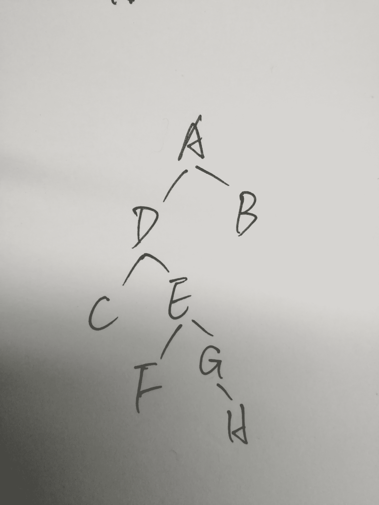
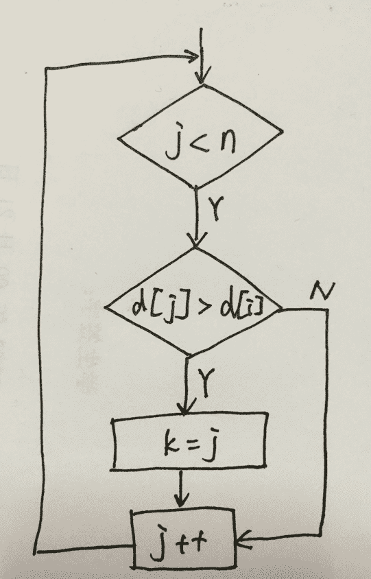

# 爱数科技 2017 校招测试开发工程师笔试试卷

## 1

数据库设计的（）阶段进行关系规范化。

正确答案: C   你的答案: 空 (错误)

```cpp
需求分析
```

```cpp
概念设计
```

```cpp
逻辑设计
```

```cpp
物理设计
```

本题知识点

数据库 测试工程师 测试开发工程师 上海爱数 2017

讨论

[peng.tan](https://www.nowcoder.com/profile/3111850)

按照规范的设计方法，一个完整的 [数据库设计](https://www.baidu.com/s?wd=%E6%95%B0%E6%8D%AE%E5%BA%93%E8%AE%BE%E8%AE%A1&tn=44039180_cpr&fenlei=mv6quAkxTZn0IZRqIHckPjm4nH00T1Yznvc4nj99rjf4PWTsm1Ih0ZwV5Hcvrjm3rH6sPfKWUMw85HfYnjn4nH6sgvPsT6KdThsqpZwYTjCEQLGCpyw9Uz4Bmy-bIi4WUvYETgN-TLwGUv3EnHT3rjRdPW61) 一般分为以下六个阶段：
⑴需求分析：分析用户的需求，包括数据、功能和性能需求；
⑵概念结构设计：主要采用 E-R 模型进行设计，包括画 E-R 图；
⑶逻辑结构设计：通过将 E-R 图转换成表，实现从 E-R 模型到关系模型 的转换； **进行关系规范化。**
⑷数据库物理设计：主要是为所设计的数据库选择合适的 [存储结构](https://www.baidu.com/s?wd=%E5%AD%98%E5%82%A8%E7%BB%93%E6%9E%84&tn=44039180_cpr&fenlei=mv6quAkxTZn0IZRqIHckPjm4nH00T1Yznvc4nj99rjf4PWTsm1Ih0ZwV5Hcvrjm3rH6sPfKWUMw85HfYnjn4nH6sgvPsT6KdThsqpZwYTjCEQLGCpyw9Uz4Bmy-bIi4WUvYETgN-TLwGUv3EnHT3rjRdPW61) 和存取路径；
⑸数据库的实施：包括编程、测试和试运行；
⑹数据库运行与维护：系统的运行与数据库的日常维护。

发表于 2017-01-10 00:58:51

* * *

## 2

系统测试由若干个不同的测试类型组成，其中（）检查系统能力的最高实际限度，即软件在一些超负荷情况下的运行情况。

正确答案: B   你的答案: 空 (错误)

```cpp
情况测试
```

```cpp
性能测试
```

```cpp
恢复测试
```

```cpp
可靠性测试
```

本题知识点

软件测试 测试工程师 测试开发工程师 上海爱数 2017

讨论

[会飞的鱼 _fly](https://www.nowcoder.com/profile/5622111)

软件在一些超负荷情况下的运行情况属于压力测试，或者说属于负载测试应该也是合理的。而压力测试和负载测试属于性能测试，所以选 B

发表于 2017-07-10 20:56:11

* * *

[♀绝影→..§](https://www.nowcoder.com/profile/5123937)

软件可靠性是软件系统在规定的时间内以及规定的环境条件下，完成规定功能的能力。因而不选 d

发表于 2017-08-18 18:01:58

* * *

[阿里小红](https://www.nowcoder.com/profile/3231453)

1.  **性能测试**是测试过程中不可或缺的一个环节，它是通过自动化脚本的测试工具模拟多种正常、峰值以及异常条件来对系统的各项性能指标进行测试。
2.  恢复测试是测试一个系统从如下灾难中能否很好地恢复，如遇到系统崩溃、硬件损坏或其他灾难性问题。 恢复测试指通过人为的让软件（或者硬件）出现故障来检测系统是否能正确的恢复，通常关注恢复所需的时间以及恢复的程度。

个人认为答案选 B，希望牛神来莅临指导~~~~~撒花欢迎欢迎

发表于 2017-03-31 14:28:11

* * *

## 3

已知一棵二叉树，如果先序遍历的节点顺序是：ADCEFGHB，中序遍历是：CDFEGHAB，则后序遍历结果为：（）

正确答案: A   你的答案: 空 (错误)

```cpp
CFHGEDBA
```

```cpp
CDFEGHBA
```

```cpp
FGHCDEBA
```

本题知识点

树 测试工程师 测试开发工程师 上海爱数 2017

讨论

[sniperlife](https://www.nowcoder.com/profile/6551980)

答案是 A 根据前序遍历以及中序遍历，可以知道根是 A，A 只有一个右节点是 B，构建出如下图的二叉树：
后序遍历的结果是 A

发表于 2017-01-24 17:18:47

* * *

## 4

系统测试将软件，硬件，网络等其他因素结合，对整个软件进行测试.（）不是系统测试的内容。 

正确答案: A   你的答案: 空 (错误)

```cpp
路径测试
```

```cpp
可靠性测试
```

```cpp
安装测试
```

本题知识点

软件测试 测试工程师 测试开发工程师 上海爱数 2017

讨论

[暗月下捉迷藏](https://www.nowcoder.com/profile/480887)

路径测试属于白盒测试，系统测试阶段不包括白盒测试，故选 A

发表于 2017-08-30 21:46:56

* * *

[G2Bent](https://www.nowcoder.com/profile/4767218)

软件开发阶段一般又划分成需求分析、概要设计、详细设计、编码与单元测试、组装与系统测试以及安装与验收等 6 个阶段。系统测试是将软件系统与硬件、外设和网络等其他因素结合，对整个软件系统进行测试。常见的系统测试主要有恢复测试、安全性测试、强度测试、性能测试、可靠性测试和安装测试等。

发表于 2017-07-11 00:21:16

* * *

[追风少女鸭](https://www.nowcoder.com/profile/8456936)

单元测试以白盒为主，测试单元内部独立路径、逻辑结构、规范等；集成测试也是以白盒为主，黑盒辅助，注重测试模块间接口数据传递、参数的个数、属性和顺序的正确性

发表于 2018-03-21 15:29:54

* * *

## 5

SQL 语言中，删除一个表的命令是（）

正确答案: B   你的答案: 空 (错误)

```cpp
CLEAR TABLE
```

```cpp
DROP TABLE
```

```cpp
DELETE TABLE
```

本题知识点

数据库 测试工程师 测试开发工程师 上海爱数 2017

讨论

[Richardliu007](https://www.nowcoder.com/profile/1182836)

选择 B 解析：删除表用 drop，删除记录用 delete

发表于 2017-01-24 17:29:58

* * *

[酸梅梨子汤](https://www.nowcoder.com/profile/38649467)

drop: 删除所有。包括表的结构和内容。
delete: 根据 where 确定删除的表的记录（表的结构和剩下的表的记录仍在）。
truncate: 删除所有表的内容（表的结构仍在）。
Reference: [`www.runoob.com/note/22984`](https://www.runoob.com/note/22984)

发表于 2019-10-19 09:36:13

* * *

[寒宫冷月](https://www.nowcoder.com/profile/8702960)

送分题，B

发表于 2017-02-21 08:03:39

* * *

## 6

建立动态路由需要用到的文件有（）

正确答案: B   你的答案: 空 (错误)

```cpp
/etc/hosts
```

```cpp
/etc/gateways
```

```cpp
/etc/resolv、conf
```

本题知识点

Linux 测试工程师 测试开发工程师 上海爱数 2017

讨论

[囧破苍穹 514](https://www.nowcoder.com/profile/289541)

/etc/hosts 设定用户自已的 IP 与名字的对应表

/etc/gateways 设定路由器 /etc/resolv.conf    设置 DNS 

发表于 2017-03-12 19:49:44

* * *

[可可岛](https://www.nowcoder.com/profile/6119387)

/etc 下主要配置文件解释

/etc/hosts：主机名到 IP 地址的映射关系的文件；

/etc/resolv.conf：DNS 服务的配置文件 ；

/etc/gateways：建立动态路由需要用到的文件 ；

/etc/services：定义了网络服务的端口；

/etc/resolv.conf：设置 DNS。

发表于 2018-07-25 08:49:27

* * *

[小念宗](https://www.nowcoder.com/profile/967526766)

/etc/hosts 设定用户的 IP 与名字对应表； /etc/gateways 设定路由器的； /etc/resolv.conf  设置 dns。

发表于 2019-02-27 14:24:36

* * *

## 7

下面是一段求最大值的程序，其中 datalist 是数据表， n 是 datalist 的长度

```cpp
int GetMax(int n,int datalist[])
{
    int k=0;
    for(int j=1;j<n;j++)
        if(datalist[j]>datalist[k])
            k=j;
    return k;
}
```

请问该程序段的 McCabe 环路复杂性为多少？（）

正确答案: B   你的答案: 空 (错误)

```cpp
2
```

```cpp
3
```

```cpp
4
```

```cpp
5
```

本题知识点

复杂度

讨论

[黏黏糖](https://www.nowcoder.com/profile/7036341)

流图 G 的环形复杂度 V(G)=E-N+2，其中，E 是流图中边的条数，N 是结点数画出控制流图即可知：V(G) = 5 - 4 + 2 = 3

发表于 2017-06-19 15:59:08

* * *

[Yummy 蛋卷](https://www.nowcoder.com/profile/4269926)

条件判断语句数目+1

发表于 2018-04-28 23:56:40

* * *

[江南消夏](https://www.nowcoder.com/profile/8611799)

程序的环路复杂性给出了程序基本路径集中的独立路径条数，这是确保程序中每个可执行语句至少执行一次所必需的测试用例数目的上界

McCabe 复杂性程序的环路复杂性，简单的定义为控制流图的区域数。从程序的环路复杂性可导出程序基本路径集合中的独立路径条数，这是确保程序中每个可执行语句至少执行一次所必需的最少测试用例数。

判定节点法

通过控制流图中判定节点数计算。若 P 为控制流图中的判定节点数，则 V(G)=P+1。控制流图中有 3 个判定节点，因此其环路复杂性 V(G)=P+1=2+1=3，所以该程序段的环路复杂性为 3。

编辑于 2017-01-07 18:04:07

* * *

## 8

设有关系 R(S,D,M), 其函数依赖集 F={S,D,D->M}. 则关系 R 至多满足 1 范式

你的答案 (错误)

1 参考答案 (1) 第一

本题知识点

组合数学 *测试工程师 测试开发工程师 上海爱数 2017* *讨论

[青山崖野](https://www.nowcoder.com/profile/7614806)

函数依赖集 F={S,D,D->M}，显然满足第一范式的“属性唯一”的要求。码：(S,D)主属性：S、D，非主属性：M 存在非主属性对 M 对码（S,D）的函数部分依赖，所以，不满足第二范式的要求。

发表于 2017-09-01 11:53:18

* * *

[growing-cyan](https://www.nowcoder.com/profile/274896)

```cpp
第一范式(属性不重复+UID)，就是保证一张二维表里的字段不要重复，这里没有重复的字段
```

发表于 2017-08-18 16:44:26

* * *

[rppp](https://www.nowcoder.com/profile/9542322)

若一张二维表中的字段不重复，则满足第一范式

发表于 2017-08-22 21:10:19

* * *

## 9

SSH 服务默认端口为 1.Telnet 服务默认端口为 2 .

你的答案 (错误)

12 参考答案 (1) 22
(2) 23

本题知识点

Linux 测试工程师 测试开发工程师 上海爱数 2017

讨论

[Richardliu007](https://www.nowcoder.com/profile/1182836)

  查看全部)

编辑于 2017-05-23 18:04:40

* * *

[后劲好大](https://www.nowcoder.com/profile/4013442)

SSH 默认端口为 22，Telnet 默认端口为 23

发表于 2017-06-07 11:25:47

* * *

## 10

在 RedHat 中，从 root 用户切换到 user1 用户，命令是 1.

你的答案 (错误)

1 参考答案 (1) su user1

本题知识点

Linux 测试工程师 测试开发工程师 上海爱数 2017

讨论

[沒見過世面的菇涼](https://www.nowcoder.com/profile/2271761)

linux 下从管理员用户切换到普通用户：1.su user12.su - user1(-左右都有空格)linux 下从普通用户切换到管理员用户：1.su2.su -

发表于 2017-09-05 14:40:58

* * *

[牛客 8022409 号](https://www.nowcoder.com/profile/8022409)

su - user1

发表于 2017-08-18 08:26:43

* * *

[ataoli](https://www.nowcoder.com/profile/9644421)

su user1

发表于 2018-06-13 08:09:25

* * *

## 11

基础测试的工作开展更多站在 1 的角度上；系统测试站在 2 的角度上。

你的答案 (错误)

12 参考答案 (1) 测试人员
(2) 用户

本题知识点

软件测试 测试工程师 测试开发工程师 上海爱数 2017

讨论

[阿里巴巴宜搭团队招聘](https://www.nowcoder.com/profile/927755)

1.测试人员 2.用户

编辑于 2017-05-23 18:05:51

* * *

[ShaoXiaobao](https://www.nowcoder.com/profile/4765842)

这个系统真是醉了。写了测试工作人员，错了。。系统测试阶段因为系统已经进入尾声，主要检查各种功能是否满足需求，所以是站在用户角度

发表于 2017-08-24 17:05:38

* * *

[牛客 754495002 号](https://www.nowcoder.com/profile/754495002)

1.测试人员 2.用户

发表于 2020-05-17 18:59:39

* * *

## 12

这里有两个表，请用 SQL 语句查询年龄小于平均年龄的作者姓名，图书名，出版社。表 1：图书（图书号、图书名、作者编号、出版社、出版日期）

表 2：作者（作者姓名、作者编号、年龄、性别）

你的答案

本题知识点

数据库 测试工程师 测试开发工程师 上海爱数 2017

讨论

[Beaver_](https://www.nowcoder.com/profile/1757434)

select 作者姓名，图书名，出版社 from 作者，图书 where 作者.作者编号=图书.作者编号 and 年龄发表于 2017-08-20 16:32:38

* * *

[Jayking`](https://www.nowcoder.com/profile/6945249)

两张表为：

books(id,title,address,date)

author(no,name,age,sex)

SQL 语句为：

SELECT

`author.`name`,`books.title,

books.address

FROM

books

INNER JOIN author ON books.authorid = author.`no`

WHERE

author.age < (SELECT AVG(age) FROM author);

发表于 2017-08-20 18:32:35

* * *

[Krfsky<3Offer](https://www.nowcoder.com/profile/1769695)

SELECT 作者.作者姓名, 图书.图书名, 图书.出版社 FROM 作者 INNER JOIN 图书 WHERE （作者.作者编号 == 图书.作者编号） AND （作者.年龄 < (SELECT AVG(年龄) FROM 作者))好奇地问一下，两个表分别取不同的列，需要 JOIN 吗，还是直接 select 就好了

发表于 2017-09-05 11:58:07

* * *

## 13

指出下列代码有什么错误。(1)

```cpp
void test1(){
    char string[10];
    char* str1="0123456789";
    strcpy(string,str1);
}
```

(2)

```cpp
void test5(){
    int iv=0;
    int &reiv;
    int *pi;
    pi=&iv;
}
```

你的答案

本题知识点

C++ 测试工程师 测试开发工程师 上海爱数 2017

讨论

[七宝 Wendy](https://www.nowcoder.com/profile/9624213)

int &reiv;//错误，声明一个引用，但引用不能为空，必须同时初始化 int &reiv2=iv;//声明了一个引用，并同时初始化，也就是 reiv2 是 iv 的别名 int *pi;//正确，声明了一个指针，但是没有定义指针所指向的地址 *pi=5;//错误，整数指针 pi 没有指向实际地址，在这种情况下给它赋值是错误的 pi=&iv3;//正确，指针指向 iv3 的实际地址 const  double di;//错误，const 常量赋值时，必须同时初始化 const  double maxWage=10.0;//const 常量赋值并同时初始化 const  double*pc=&maxWage;//const 常量指针赋值并同时初始化

编辑于 2017-08-19 15:59:27

* * *

[♀绝影→..§](https://www.nowcoder.com/profile/5123937)

（1）str1 长度 11，strcpy 方***溢出 （2）声明一个引用，引用不能为空，必须同时初始化

发表于 2017-08-19 00:15:09

* * *

[tuozi271](https://www.nowcoder.com/profile/577431)

test1 中， str1 的长度实际为 11，因为包括‘\0’字符，拷贝到 string 里面去后，string 会越界。

test2 中， 引用 reiv 为空，必须同时初始化。

发表于 2017-09-02 14:06:41

* * *

## 14

这是一个用浏览器打开的网易邮箱注册的界面。

1、请使用有效类划分法，写出”邮箱地址”的等价类类别。

2、请为这个界面设计测试用例，请尽量详细。


你的答案

本题知识点

软件测试 测试工程师 测试开发工程师 上海爱数 2017

讨论

[久慕](https://www.nowcoder.com/profile/3286469)

|  | 有效等价类 | 无效等价类 |
| 邮箱地址 | 1.6~18 个字符 | 2.少于 18 个字符 |
| 3.多于 6 个字符 |
| 4.以字母开头 | 5.不以字母开头 |
| 6.使用了字母、数字、下划线 | 7.使用了除字母、数字、下划线之外的其他字符 |
| 密码 | 8.6~16 个字符 | 9.多于 16 个字符 |
| 10.少于 6 个字符 |
| 确认密码 | 11.与设置密码相同 | 12.与设置密码不相同 |
| 13.与设置密码字母大小写不同 |

|  | 邮箱地址 | 密码 | 确认密码 | 预期结果 |
| 1.(1,4,6,8,11) | m_123456 | Abc1234 | Abc1234 | 注册成功 |
| 2.(2,4,6,8,11) | m_123 | Abc1234 | Abc1234 | 邮件地址应在 6~18 个字符之间 |
| 3.(3,4,6,8,11) | m_123456123456789012 | Abc1234 | Abc1234 | 邮件地址应在 6~18 个字符之间 |
| 4.(1,5,6,8,11) | 1_m12346 | Abc1234 | Abc1234 | 邮件地址应以字母开头 |
| 5.(1,4,7,8,11) | m_123@45 | Abc1234 | Abc1234 | 邮件地址只能含有字母、数字或下划线 |
| 6.(1,4,6,9,11) | m_123456 | Abc123412345nbge666 | Abc123412345nbge666 | 密码应在 6~16 个字符之间 |
| 7.(1,4,6,10,11) | m_123456 | Abc1 | Abc1 | 密码应在 6~16 个字符之间 |
| 8.(1,4,6,8,12) | m_123456 | Abc1234 | Abc1235 | 两次密码不一致，请重新输入 |
| 9.(1,4,6,8,13) | m_123456 | Abc1234 | abc1234 | 两次密码不一致，请重新输入 |

发表于 2018-03-26 22:16:05

* * *

[watermelon_xi](https://www.nowcoder.com/profile/6323786)

  有效等价类                                   无效等价类
邮箱地址              1.6~18 个字符                                2.少于 6 个字符
                                                                                  3.多于 18 个字符
                            4.以字母开头                                 5.未使用字母开头
                            6.使用了字母，数字，下划线        7.使用了除字母，数字，下划线之外的其他字符
密码                     8.6~16 个字符                                9.少于 6 个字符
                                                                                  10.多于 16 个字符
确认密码             11.与设置的密码相同                     12.与设置的密码不相同
                                                                                  13.与设置的密码字母大小写不同
测试用例：       
                                     邮箱地址                                 密码                  确认密码              预期结果
1.(1,4,6,8,11)              zx_123456                              csyl1234             csyl1234            注册成功
2.(2,4,6,8,11)              zx_12                                      csyl1234             csyl1234            请输入邮件地址在 6~18 个字符之间
3.(3,4,6,8,11)              zx_123456789012345678      csyl1234             csyl1234            请输入邮件地址在 6~18 个字符之间
4.(1,5,6,8,11)             123456789                               csyl1234             csyl1234            邮箱地址请以字母开头
5.(1,4,7,8,11)             zx_12345@6                            csyl1234             csyl1234            邮箱地址请勿出现除数字，字母，下划线之外的其他字符
6.(1,4,6,9,11)              zx_123456                              12345                 12345                 请输入密码在 6~16 个字符之间
7.(1,4,6,10,11)            zx_123456        csyl12345678901234    csyl12345678901234    请输入密码在 6~16 个字符之间
8.(1,4,6,8,12)              zx_123456                             csyl1234               123456               两次密码输入不同，请重新输入
9.(1,4,6,8,13)              zx_123456                             csyl1234                Csyl1234            两次密码输入不同，请重新输入  

发表于 2017-08-22 15:51:51

* * *

[wen_jian](https://www.nowcoder.com/profile/8001180)

1：有效等价类： 邮箱以字母开头，有大小写，然后字母，数字，下划线任意组合。长度在 6-18 密码：密码在 6―16，任意组合。 2.无线等价类: 邮箱以下划线开头 邮箱以字母开头 邮箱以非字母，下划线，数字开头 邮箱长度小于 6 邮箱长度大于 18 密码： 密码长度小于 6 密码长度大于 16 密码带空格 两次输入的密码不一致

发表于 2018-09-12 00:51:13

* * *

## 15

判断 101-200 之间有多少个素数，并输出所有素数。

你的答案

本题知识点

Python C# Javascript Java C++ 测试工程师 测试开发工程师 上海爱数 2017

讨论

[李成广](https://www.nowcoder.com/profile/6056256)

```cpp
# 使用 python 列表推导式，两行代码。
s = [p for p in range(101,201) if 0 not in [p % d for d in range(2, int(p**0.5)+1)]]
print(len(s),s) # 结果 21 [101, 103, 107, 109, 113, 127, 131, 137, 139, 149, 151, 157, 163, 167, 173, 179, 181, 191, 193, 197, 199]
```

发表于 2017-10-31 20:37:20

* * *

[渣叔。](https://www.nowcoder.com/profile/2118334)

public class Test {
    public static void main(String[] args) {
        for (int i = 101; i <= 200; i++) {
            boolean b = false;
            for (int j = 2; j < Math.sqrt(i) ; j++) {
                if(i % j == 0){
                    b = false;
                    break;
                }else{
                    b = true;
                }
            }
            if(b){
                System.out.println(i);
            }
        }
    }
}

发表于 2017-09-22 19:10:06

* * *

[有点甜。](https://www.nowcoder.com/profile/7913992)

public class isPrime {public static void main(String[] args) {boolean b = false;for (int i = 101; i < 201; i++) {for (int j = 2; j < i - 1; j++) {if (i % j == 0) {b = false;break;} else {b = true;}}if (b == true) {System.out.print(i + " ");}}}}

发表于 2017-08-20 11:14:31

* * **