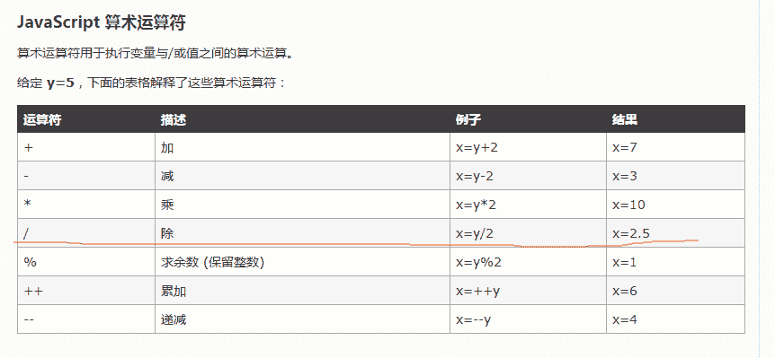

# 同程 2017 校招前端工程师笔试试卷

## 1

关于以下 URL 的描述错误的是（ ） [`www.ly.com/`](http://www.ly.com/)

正确答案: A   你的答案: 空 (错误)

```cpp
http 表面使用 TCP 协议
```

```cpp
又名统一资源定位符，方便确定一个资源，并表示出它在哪里
```

```cpp
URL 中隐藏了端口号，默认是 80 端口
```

```cpp
访问 URL 可使用大写字母
```

本题知识点

网络基础 前端工程师 同程旅行 2017

讨论

[liby](https://www.nowcoder.com/profile/499045)

http 底层使用 tcp 才是对的

发表于 2017-08-18 18:28:35

* * *

[招商银行信用卡中心](https://www.nowcoder.com/profile/2617066)

URL 由三部分组成：资源类型、存放资源的主机域名、资源文件名。 URL 的一般语法格式为： (带方括号[]的为可选项)： protocol :// hostname[:port] / path / [;parameters][?query]#fragment protocol（协议） 指定使用的传输协议，下表列出 protocol 属性的有效方案名称。 最常用的是 HTTP 协议，它也是目前 WWW 中应用最广的协议。 file 资源是本地计算机上的文件。格式 file:///，注意后边应是三个斜杠。 ftp 通过 FTP 访问资源。格式 FTP:// gopher 通过 Gopher 协议访问该资源。 http 通过 HTTP 访问该资源。 格式 HTTP:// https 通过安全的 HTTPS 访问该资源。 格式 HTTPS:// mailto 资源为电子邮件地址，通过 SMTP 访问。 格式 mailto: MMS 通过 支持 MMS（流媒体）协议的播放该资源。（代表软件：Windows Media Player）格式 MMS:// ed2k 通过 支持 ed2k（专用下载链接）协议的 P2P 软件访问该资源。（代表软件：电驴） 格式 ed2k:// Flashget 通过 支持 Flashget:（专用下载链接）协议的 P2P 软件访问该资源。（代表软件：快车） 格式 Flashget:// thunder 通过 支持 thunder（专用下载链接）协议的 P2P 软件访问该资源。（代表软件：迅雷） 格式 thunder:// news 通过 NNTP 访问该资源。 hostname（主机名） 是指存放资源的服务器的域名系统(DNS) 主机名或 IP 地址。有时，在主机名前也可以包含连接到服务器所需的用户名和密码（格式：username:password@hostname）。 port（端口号） 整数，可选，省略时使用方案的默认端口，各种传输协议都有默认的端口号，如 http 的默认端口为 80。如果输入时省略，则使用默认端口号。有时候出于安全或其他考虑，可以在服务器上对端口进行重定义，即采用非标准端口号，此时，URL 中就不能省略端口号这一项。 path（路径） 由零或多个“/”符号隔开的字符串，一般用来表示主机上的一个目录或文件地址。 parameters（参数） 这是用于指定特殊参数的可选项。 query(查询) 可选，用于给***页（如使用 CGI、ISAPI、PHP/JSP/ASP/ASP。NET 等技术制作的网页）传递参数，可有多个参数，用“&”符号隔开，每个参数的名和值用“=”符号隔开。 fragment（信息片断） 字符串，用于指定网络资源中的片断。例如一个网页中有多个名词解释，可使用 fragment 直接定位到某一名词解释。

发表于 2017-08-08 07:54:16

* * *

[轻雨抚心澜](https://www.nowcoder.com/profile/2646891)

我感觉是没写全吧  Http 基于 TCP/IP 协议

发表于 2017-04-27 21:00:29

* * *

## 2

有以下代码片段：

```cpp
var a =[];
a[0]=1, a[1]=2, a[2]=3, a[5]=4;
```

请问 a.length 的值是多少（ ）

正确答案: D   你的答案: 空 (错误)

```cpp
会报错
```

```cpp
3
```

```cpp
4
```

```cpp
6
```

本题知识点

编程基础 *Javascript 前端工程师 同程旅行 2017* *讨论

[@thee](https://www.nowcoder.com/profile/637854)

> ECMAScript 数组的大小是可以动态调整的，既可以随着数据的添加自动增长以容纳新增数据。当把一个值放在超出当前数组大小的位置上时，数组就会重新计算长度值，即长度值等于最后一项的索引加一，前面的值都自动被赋值为了 undefined 了。

发表于 2016-12-22 14:13:02

* * *

[可乐妥妥](https://www.nowcoder.com/profile/552695)

a[0]:1
a[1]:2
a[2]:3
a[3]:undefined
a[4]:undefined
a[5]:4

发表于 2017-06-12 10:47:02

* * *

[Big 坚](https://www.nowcoder.com/profile/8366548)

**选择了 A

发表于 2017-09-19 14:18:48

* * *

## 3

下列代码运行的结果（ ）

```cpp
short i=65537;
int j=i+1;
printf("i=%d,j=%d\n",i,j);
```

正确答案: B   你的答案: 空 (错误)

```cpp
i=65537,j=65538
```

```cpp
i=1,j=2
```

```cpp
i=-1,j=0
```

```cpp
i=1,j=65538
```

本题知识点

C++ 编程基础 *前端工程师 同程旅行 2017* *讨论

[美团到店招聘](https://www.nowcoder.com/profile/3472441)

short 占两个字节，65537 的二进制表示为：1 00000000 00000001，short i = 65537 时，发生了溢出，i 取 16bit，为 1。所以 i=1,j=2

发表于 2017-01-27 17:38:01

* * *

[朱珠](https://www.nowcoder.com/profile/143224)

记住 65536 相当于 unsigned short  的 0 值。

发表于 2017-06-08 21:49:09

* * *

[羽落长安](https://www.nowcoder.com/profile/416341)

short i;
i 取值范围-32768~32767
若 i 不在-32768~32767 范围内:
i=-32768+(i-32768)%65536;
i=65537  ==>i=1
i=32768  ==>i=-32768

发表于 2017-01-05 21:45:09

* * *

## 4

归并排序的时间复杂度（ ）

正确答案: B   你的答案: 空 (错误)

```cpp
O(log(N))
```

```cpp
O(N*log(N))
```

```cpp
O(N)
```

```cpp
O(N²)
```

本题知识点

复杂度 排序 *讨论

[@追风小青年](https://www.nowcoder.com/profile/838172)


归并排序（Merge Sort）

> 和选择排序一样，归并排序的性能不受输入数据的影响，但表现比选择排序好的多，因为始终都是 O(n log n）的时间复杂度。代价是需要额外的内存空间。
> 
> (1)算法简介
> 
> > 归并排序是建立在归并操作上的一种有效的排序算法。该算法是采用分治法（Divide and Conquer）的一个非常典型的应用。归并排序是一种稳定的排序方法。将已有序的子序列合并，得到完全有序的序列；即先使每个子序列有序，再使子序列段间有序。若将两个有序表合并成一个有序表，称为 2-路归并。
> 
> (2)算法描述和实现
> 
> 具体算法描述如下：
> 
> *   <1>.把长度为 n 的输入序列分成两个长度为 n/2 的子序列；
> *   <2>.对这两个子序列分别采用归并排序；
> *   <3>.将两个排序好的子序列合并成一个最终的排序序列。
> 
> Javscript 代码实现:function mergeSort(arr) { //采用自上而下的递归方法 var len = arr.length; if(len < 2) { return arr; } var middle = Math.floor(len / 2), left = arr.slice(0, middle), right = arr.slice(middle); return merge(mergeSort(left), mergeSort(right)); } function merge(left, right) { var result = []; console.time('归并排序耗时'); while (left.length && right.length) {
> 
> ```cpp
>         if (left[0] <= right[0])="" {="" result.push(left.shift());="" }="" else="" result.push(right.shift());="" while="" (left.length)="" (right.length)="" console.timeend('归并排序耗时');="" return="" result;="" var="" arr="[3,44,38,5,47,15,36,26,27,2,46,4,19,50,48];" console.log(mergesort(arr));<="" code="">
> ```

发表于 2017-08-25 21:02:07

* * *

[guopeng112997](https://www.nowcoder.com/profile/1833271)

[`www.cnblogs.com/dushao/p/6004883.html`](http://www.cnblogs.com/dushao/p/6004883.html)

发表于 2017-08-26 13:49:17

* * *

[nomico271](https://www.nowcoder.com/profile/2527957)

归并排序的时间复杂度均为 O(nlogn)。稳定。

发表于 2017-07-17 22:07:44

* * *

## 5

数据库事务的 4 个特征是：原子性、一致性、（ ）、隔离性。

正确答案: C   你的答案: 空 (错误)

```cpp
只读性
```

```cpp
封装性
```

```cpp
持续性
```

```cpp
恢复性
```

本题知识点

数据库 前端工程师 同程旅行 2017

讨论

[牛客 1717250 号](https://www.nowcoder.com/profile/1717250)

C：原子性：事务执行情况只能有两种：全部执行，全部不执行（回滚制度）
一致性：事务执行前后数据具有一致性
隔离性：事务之间不可以相互干扰
持续性：事务一旦执行，不可自然逆转。

发表于 2017-03-11 16:20:14

* * *

[文々涛｜](https://www.nowcoder.com/profile/3587812)

ACID 原子性（Atomicity）、一致性（Consistency）、隔离性（Isolation）、持久性（Durability）

发表于 2017-07-06 16:12:14

* * *

[mine_jm](https://www.nowcoder.com/profile/888271607)

1.  A:原子性，事务执行要么全部完成，要么回到初始状态；
2.  C:一致性，事务执行过程中，前后数据保持一致性。事务从账户余额 100 中取出 50，则提交后账户余额更新为 50；
3.  D:持久性：事务一旦提交，对数据库的改变是持久的。

4.  I:隔离性，事务之间互不干扰，存在四种隔离级别：

*   未提交读：脏读，事务 A 读取到了事务 B 未提交的数据后事务 B 发生错误回滚，这种现象称为未提交读；
*   不可重复读：事务 A 反复读取某一数据，在读取过程中，事务 B 对数据进行了修改（update）导致事务 A 前后读取数据发生变化；
*   可重复读：事务 A 反复读取某一数据，在读取过程中，事务 B 对数据进行了删除或增加（insert/delete）导致事务 A 前后读取数据发生变化；
*   序列化：解决上述问题。

发表于 2020-03-05 14:55:57

* * *

## 6

整数 0x12345678，在采用 bigendian 中内存的排序序列是（ ）

正确答案: A   你的答案: 空 (错误)

```cpp
12 34 56 78
```

```cpp
78 56 34 12
```

```cpp
87 65 43 21
```

```cpp
21 43 65 87
```

本题知识点

编译和体系结构 前端工程师 同程旅行 2017 排序 *讨论

[一只大恐龙](https://www.nowcoder.com/profile/8124467)

看这里：[CPU 的大端模式(big endian)和小端(little endian)模式](http://blog.csdn.net/xiajun07061225/article/details/7295421)

编辑于 2017-08-19 20:48:59

* * *

[我想叫你尼莫的](https://www.nowcoder.com/profile/3011907)

一般默认大端所以大端原样小端交换前后

发表于 2017-08-20 12:12:59

* * *

[warpar](https://www.nowcoder.com/profile/1756076)

对于整型、长整型等数据类型，Big endian 认为第一个字节是最高位字节（按照从低地址到高地址的顺序存放数据的高位字节到低位字节）；而 Little endian 则相反，它认为第一个字节是最低位字节（按照从低地址到高地址的顺序存放据的低位字节到高位字节）。

例如，假设从内存地址 0x0000 开始有以下数据：  
0x0000         0x0001       0x0002       0x0003  
0x12            0x34           0xab           0xcd 
如果我们去读取一个地址为 0x0000 的四个字节变量，若字节序为 big-endian，则读出结果为 0x1234abcd；若字节序为 little-endian，则读出结果为 0xcdab3412。

如果我们将 0x1234abcd 写入到以 0x0000 开始的内存中，则 Little endian 和 Big endian 模式的存放结果如下：  
地址           0x0000         0x0001        0x0002          0x0003 
big-endian   0x12           0x34            0xab            0xcd  
little-endian  0xcd           0xab            0x34            0x12

一般来说，x86 系列 CPU 都是 little-endian 的字节序，PowerPC 通常是 big-endian，网络字节顺序也是 big-endian 还有的 CPU 能通过跳线来设置 CPU 工作于 Little endian 还是 Big endian 模式。

对于 0x12345678 的存储：

小端模式：（从低字节到高字节）
地位地址 0x78 0x56 0x34 0x12 高位地址

大端模式：（从高字节到低字节）
地位地址 0x12 0x34 0x56 0x78 高位地址

发表于 2017-08-22 15:37:20

* * *

## 7

执行以下 SQL，下面哪个名字会被查询出来（ ）

```cpp
Select firstname from stafflist
where firstname like'_A%'
```

正确答案: C D   你的答案: 空 (错误)

```cpp
Allen
```

```cpp
CLARK
```

```cpp
JACKSON
```

```cpp
DAVID
```

本题知识点

数据库 前端工程师 同程旅行 2017

讨论

[阿森先生](https://www.nowcoder.com/profile/4775155)

这是模糊查询的通配符
_:代表的是任意单个字符
%:任意长度的字符串
所以 _A%代表返回第二个单词为 A 的任意字符串
兄弟姐妹们记住咯!!!!不能再错了!!!
拓展:[]:代表指定范围内的任意单个字符
        [^]:代表指定范围内或者集合中的任意单个字符

发表于 2017-02-05 17:24:24

* * *

[BeLLESS](https://www.nowcoder.com/profile/5806370)

明明是下划线 题干给了个杠 是啥意思

发表于 2017-08-23 10:17:26

* * *

[csajob](https://www.nowcoder.com/profile/457026)

本题应该选择 C.D 选项吧，D 也是正确的

发表于 2016-12-23 20:05:05

* * *

## 8

如下代码片段的运行结果是

```cpp
var obj ={a:1,b:function () {alert(this.a)}}; 
var fun =obj.b; 
fun();
```

正确答案: C   你的答案: 空 (错误)

```cpp
弹出 a
```

```cpp
弹出 1
```

```cpp
弹出 undefined
```

```cpp
什么也看不到
```

本题知识点

Javascript 前端工程师 同程旅行 2017

讨论

[ntscshen](https://www.nowcoder.com/profile/636237)

```cpp
var b = functio
```

  查看全部)

编辑于 2017-03-19 19:46:37

* * *

[lemonn](https://www.nowcoder.com/profile/5159023)

this 的行为有时候会显得极其诡异，让人感到困惑，但只需要记住 **this 的值要等到代码真正执行时才能确定**
同时 this 的值具体有以下几种情况：

1.  new 调用时指的是被构造的对象

2.  call、apply 调用，指向我们指定的对象

3.  对象调用，如执行 obj.b()，this 指向 obj

4.  默认的，指向全局变量 window(相当于执行 window.fun())

这样看来，当你执行 fun()的时候，以上 1,2 点均不满足。
第 3 点,因为 this 是运行时确定的，而我们执行 fun()，等同于 windown.fun()(**与 obj 没有任何关系**)，自然的 this 指向 window，而 window 没有定义变量 a，结果是 undefined。

发表于 2017-08-27 14:05:42

* * *

[金超](https://www.nowcoder.com/profile/4811484)

```cpp

	var fun = obj.b;    //相当于 var fun = function(){alert(this.a)};

	fun();    //没有谁来调用的时候，this 自然指向 window

	//而 window 里面没有定义 a,所以弹出 undefined

```

发表于 2018-03-13 19:53:10

* * *

## 9

二分查找的时间复杂度（ ）

正确答案: C   你的答案: 空 (错误)

```cpp
O(N*log(N))
```

```cpp
O(N)
```

```cpp
O(log(N))
```

```cpp
O(N²)
```

本题知识点

复杂度 查找 *前端工程师 同程旅行 2017* *讨论

[暗夜行路](https://www.nowcoder.com/profile/2459844)

C 二分法每次比较会去掉一半的  查看全部)

编辑于 2017-02-16 10:40:00

* * *

[wanlanwalan](https://www.nowcoder.com/profile/7952866)

因为二分查找每次排除掉一半的不适合值，所以对于 n 个元素的情况：
一次二分剩下：n/2
两次二分剩下：n/2/2 = n/4
。。。
m 次二分剩下：n/(2^m)
在最坏情况下是在排除到只剩下最后一个值之后得到结果，所以为
n/(2^m)=1;
2^m=n;
所以时间复杂度为：log2(n)

发表于 2017-04-26 16:49:36

* * *

[deefre](https://www.nowcoder.com/profile/36503303)

注意是二分查找不是排序

发表于 2019-08-04 17:35:03

* * *

## 10

下面叙述错误的是（ ）

```cpp
char acX[]="abc";
char acY[]={'a','b','c'};
char *szX="abc";
char *szY="abc";
```

正确答案: D   你的答案: 空 (错误)

```cpp
acX 与 acY 的内容可以修改
```

```cpp
szX 与 szY 指向相同的地址
```

```cpp
acX 占用的内存空间比 acY 占用的大
```

```cpp
szX 的内容修改后，szY 的内容也会被更改
```

本题知识点

C++ 编程基础 *前端工程师 同程旅行 2017* *讨论

[ciphersaw](https://www.nowcoder.com/profile/543695)

正确答案应该选**D**，而不是选 B**char *szX = "abc";与 char *szY = "abc";**"abc"是保存在文字常量区，属于字符串常量，所以该数据不能修改，默认是只读属性。
因此不能通过指针 szX 或 szY 的指向来修改此值，而且 szX 和 szY 指向字符串常量"abc"相同的地址，可推出选 D 而不选 B。

**char acX[] = "abc";**
"abc"是保存在栈空间数组里. 其数组名为 acX,，数组名为数组的首地址（属于指针常量），
因此可以通过 acX[i] = 'x' 或 *(acX+i) = 'x' 的形式来修改数组内容。

编辑于 2017-07-09 13:01:44

* * *

[jesure](https://www.nowcoder.com/profile/8473774)

B 选项：szX 与 szY 指向相同的地址，这句话是正确的。
对于有人说打印出来的地址相同，可能是打印了指针的地址。
#include <stdio.h>
void main(void)
{
    char *x = "abcd";
    char *y = "abcd";
    //打印指针所指向的地址
    printf("%p\n", x);
    printf("%p\n", y);
    //打印指针的地址
    printf("%p\n", &x);
    printf("%p\n", &y);
}

执行结果：
0x400624
0x400624
0x7ffc3f2b3560
0x7ffc3f2b3568

发表于 2017-07-21 11:33:58

* * *

[shortking](https://www.nowcoder.com/profile/3630574)

szX 和 szY 指向的是字符串常量 不能被改变

发表于 2018-05-06 17:53:32

* * *

## 11

某计算机内存空间按字节编址，若某区域的起始地址为：4A000H,终止地址为 4DFFFH，则该段内存区域的容量是（ ）[进制转换计算]

正确答案: A   你的答案: 空 (错误)

```cpp
16KB
```

```cpp
24KB
```

```cpp
214KB
```

```cpp
1MB
```

本题知识点

编译和体系结构 前端工程师 同程旅行 2017

讨论

[span](https://www.nowcoder.com/profile/9634575)

4DFFFH-4A000+H = 4000H 4*16³/2¹⁰=16kb

发表于 2017-02-24 11:49:58

* * *

[叶川飞流](https://www.nowcoder.com/profile/255898609)

详细解答 B 二进制、D 十进制、 H 十六进制 4DFFFH - 4A000H = (0100 1101 1111 1111 1111B) - (0100 1010 0000 0000 0000B) = (0011 1111 1111 1111B) 结果为 3FFFH = 4000H - 1 约等于 4000H = 2¹⁴bit 1KB = 1024bit, 2¹⁴bit/2¹⁰bit = 2⁴KB = 16KB

发表于 2019-03-14 19:26:03

* * *

[走过路过见过记得](https://www.nowcoder.com/profile/2702149)

4A000H-4DFFFH=3FFFH 约等于 4000H，4*16³/1024=16

发表于 2017-08-19 12:41:04

* * *

## 12

以下哪个是并选择器（ ）

正确答案: C   你的答案: 空 (错误)

```cpp
item
```

```cpp
span.item
```

```cpp
span, .item
```

```cpp
span .item
```

本题知识点

前端工程师 同程旅行 2017

讨论

[呆呆胖](https://www.nowcoder.com/profile/1278602)

正确答案是 c 吧。同时选中了 span 标签 和
class 名为 item 的标签。
a 只是选中了 item 标签，没有并集存在；
b 选中了 class 名为 item 的 span；
d 选中了 span 下面的 class 名为 item 的元素

发表于 2017-07-10 15:39:37

* * *

[李。老虎](https://www.nowcoder.com/profile/6229509)

```cpp
<!--
        并集选择器
        1,格式:
        选择器 1,选择器 2,...{
                属性:值;
           }
        2,注意点:
        (1),选择器之间利用,连接
        (2),选择器可以是标签名称,也可以是 id、class 名称
    -->
```

发表于 2018-03-07 21:08:45

* * *

[js 我来了](https://www.nowcoder.com/profile/954719781)

**几种常见的高级选择器**

1 后代选择器  a b{}  用空格隔开    选中 a 的后代中的 b(后代指后面很多代)元素

2 子代选择器  a>b{}  用箭头隔开    选中 a 的子代中的 b(子代指下一代)元素

3 并集选择器  a,b{}  用逗号隔开     选中满足 a 或者 b 的元素

4 交集选择器  ab{}   没有分隔符     选中同时满足 a 和 b 的元素

a，b 可以是类选择器，标签选择器，id 选择器

发表于 2019-10-06 22:03:43

* * *

## 13

如下语句通过算术运算和逻辑运算之后 i 和 j 的结果是（ ）

```cpp
int i=0;
int j=0;
if((++i>0)||(++j>0)) {
//打印出 i 和 j 的值。
}
```

正确答案: D   你的答案: 空 (错误)

```cpp
i=0;j=0
```

```cpp
i=1;j=1
```

```cpp
i=0;j=1
```

```cpp
i=1;j=0
```

本题知识点

同程旅行 2017 C++

讨论

[晓飛](https://www.nowcoder.com/profile/706019)

  查看全部)

编辑于 2017-03-19 20:04:25

* * *

[VagrantYang](https://www.nowcoder.com/profile/6863719)

&& 和 || 为短路与 短路或
&&若前面的表达式为 false,整个逻辑表达式为 false,所以后面的表达式无论 true 和 false 都无法影响整个表达式的逻辑结果，所以为了提高代码执行速率，这里后面的表达式就不会执行。
同理，若前面表达式为 true,则后面的表达式无需计算。

& 和 | 为不短路与 不短路或
无论什么情况，前面的和后面的都要执行。

发表于 2017-07-11 11:07:12

* * *

[流水 123](https://www.nowcoder.com/profile/6294705)

++i 先自增再运算，i++先运算在自增，所以 i=1。||短路前一部分不正确就不会继续执行，所以 j=0\.

发表于 2017-09-14 15:42:01

* * *

## 14

在 SQL 中，建立表用得命令是（ ）

正确答案: A   你的答案: 空 (错误)

```cpp
CREATE TABLE
```

```cpp
CREATE RULE
```

```cpp
CREATE VIEW
```

```cpp
CREATE INDEX
```

本题知识点

数据库 前端工程师 同程旅行 2017

讨论

[丨太阳与月亮丨](https://www.nowcoder.com/profile/9415270)

AA 是建立表，B 是建立规则，C 是建立视图，D 是建立索引

发表于 2017-01-28 12:18:48

* * *

[SunburstRun](https://www.nowcoder.com/profile/557336)

SQL 语言中，CREATE 命令完成的功能是数据定义的功能，利用 CREATE 语句，可以建立基本表、视图、索引和模式。在本题的 4 个选项中，CREATE RULE 命令的功能是建立规则；CREATETABLE 命令的功能是建立基本表：CREATEINDEX 命令的功能是建立索引：CREATEVIEW 命令的功能是建立视图。因此本题的正确选项是 A

发表于 2016-11-30 17:21:27

* * *

## 15

SQL 查询语句中 where、group by、having 这些关键字区别和用法总结错误的是（ ）

正确答案: D   你的答案: 空 (错误)

```cpp
HAVING 在查询语句中必须依赖于 GROUP BY
```

```cpp
WHERE 子句用来限制 select 语句从表中指定选取得行
```

```cpp
GROUP BY 子句用来分组 WHERE 子句的输出结果集
```

```cpp
HAVING 子句用来从分组的结果中筛选列
```

本题知识点

数据库 前端工程师 同程旅行 2017

讨论

[csajob](https://www.nowcoder.com/profile/457026)

```cpp
HAVING 子句用来从分组
```

  查看全部)

编辑于 2017-03-18 09:34:09

* * *

[马卡维奇](https://www.nowcoder.com/profile/367018)

1.having 只能用在 group by 之后，对分组后的结果进行筛选，筛选行(即使用 having 的前提条件是分组)。2.where 肯定在 group by 之前 3.where 后的条件表达式里不允许使用聚合函数，而 having 可以。

发表于 2017-08-05 13:30:46

* * *

[cct](https://www.nowcoder.com/profile/3167413)

Select 语句完整的执行顺序： 1、from 子句组装来自不同数据源的数据； 2、where 子句基于指定的条件对记录行进行筛选； 3、group by 子句将数据划分为多个分组； 4、使用聚集函数进行计算； 5、使用 having 子句筛选分组； 6、计算所有的表达式； 7、使用 order by 对结果集进行排序。 8、select 集合输出。 飞梦天 07210213  2014-10-27 1.查询中用到的关键词主要包含六个，并且他们的顺序依次为  select--from--where--group by--having--order by  其中 select 和 from 是必须的，其他关键词是可选的，这六个关键词的执行顺序  与 sql 语句的书写顺序并不是一样的，而是按照下面的顺序来执行  from--where--group by--having--select--order by,  from:需要从哪个数据表检索数据  where:过滤表中数据的条件  group by:如何将上面过滤出的数据分组  having:对上面已经分组的数据进行过滤的条件  select:查看结果集中的哪个列，或列的计算结果  order by :按照什么样的顺序来查看返回的数据  2.from 后面的表关联，是自右向左解析的  而 where 条件的解析顺序是自下而上的。  也就是说，在写 SQL 文的时候，尽量把数据量大的表放在最右边来进行关联，  而把能筛选出大量数据的条件放在 where 语句的最下面。 where 最先执行，然后按 group by 分组，之后满足 having 条件的组被留下，执行 select 筛选。 热心网友 2013-5-10

编辑于 2017-09-06 08:41:02

* * *

## 16

下列代码的运行结果（ ）

```cpp
int a[]={1,2,3,4};
int *b=a;
*b+=2;
*(b+2)=2;
b++;
printf("%d,%d\n",*b,*(b+2));
```

正确答案: C   你的答案: 空 (错误)

```cpp
1,3
```

```cpp
1,2
```

```cpp
2,4
```

```cpp
3,2
```

本题知识点

编程基础 *C++ 前端工程师 同程旅行 2017* *讨论

[lord_chao](https://www.nowcoder.com/profile/7979940)

  查看全部)

编辑于 2017-03-19 10:45:31

* * *

[好好学习唷](https://www.nowcoder.com/profile/3904502)

*b=a  a 数组名代表数组首地址，b 指向了第一个元素 1

*b+=2  相当于*b=*b+2=3，然而此时*b 仍指向第一个元素，即数组第一个元素由 1 变为 3

*(b+2)=2  相当于 a[2]=2，即第三个元素由 3 变为 2

b++    此时 b 指向第二个元素

所以*b 就为 2，*(b+2)也就指向第四个元素为 4

发表于 2018-02-09 22:18:18

* * *

[Felix_s](https://www.nowcoder.com/profile/2526121)

b++ 很灵性

发表于 2018-01-05 19:52:58

* * *

## 17

农夫需要把狼、羊、菜和自己运到河对岸上去，只有农夫能够划船，而且船比较小，除了农夫之外，每次只能运一种东西，还有一个棘手问题，就是如果没有农夫看着，羊会偷吃菜，狼会吃羊，请按照下列顺序选择合理过河方法（） A 农夫单独过河  B 农夫带狼过河  C 农夫带羊过河  D 农夫带菜过河  E 农夫单独返回  F 农夫带狼返回  G 农夫带羊返回  H 农夫带菜返回

正确答案: B D   你的答案: 空 (错误)

```cpp
CEDEBEC
```

```cpp
CEBGDEC
```

```cpp
BEDEC
```

```cpp
CEDGBEC
```

本题知识点

数学运算

讨论

[spenglu](https://www.nowcoder.com/profile/116670)

C 答案错在先把狼带过去了，就剩下菜和羊，羊会把菜吃了，所有不行。

发表于 2017-08-02 16:16:03

* * *

[给口饭吃吧求求了](https://www.nowcoder.com/profile/222508282)

竟然是多选，窒息…认真读题认真读题认真读题！！！

编辑于 2019-05-15 10:09:00

* * *

[LillieLiValeur](https://www.nowcoder.com/profile/8578043)

C 不可以，带狼过去，羊会吃菜的。之前考虑不周

编辑于 2017-08-25 08:54:49

* * *

## 18

以下哪些是 JavaScript 的基本数据类型

正确答案: A B C   你的答案: 空 (错误)

```cpp
String
```

```cpp
Number
```

```cpp
Undefined
```

```cpp
Date
```

本题知识点

Javascript 前端工程师 同程旅行 2017

讨论

[CpInsist](https://www.nowcoder.com/profile/9634389)

JavaScript 中的数据  查看全部)

编辑于 2017-03-17 23:31:25

* * *

[cedric_chan](https://www.nowcoder.com/profile/6636147)

我觉得这题有歧义。  你没说基本数据类型。Date 属于引用数据类型。那你只说类型就会有歧义啊！

编辑于 2017-05-03 00:37:18

* * *

[a_ 梦](https://www.nowcoder.com/profile/271084)

js 的数据类型分为：基本数据类型和引用数据类型 1.基本数据类型：Number  String Boolean  Undefined  Null   共五个 2.引用数据类型：Object  Array   Function  

发表于 2017-08-18 17:40:14

* * *

## 19

在不考虑 H5 的情况下,下列哪些值是可以作为标签的 type 属性的属性值。（）

正确答案: A B C   你的答案: 空 (错误)

```cpp
text
```

```cpp
submit
```

```cpp
button
```

```cpp
date
```

本题知识点

HTML 前端工程师 同程旅行 2017

讨论

[白糖+咖啡](https://www.nowcoder.com/profile/8676188)

按照 h5 标准来看的话，abc  查看全部)

编辑于 2017-03-19 09:11:57

* * *

[藍裙子的百合魂](https://www.nowcoder.com/profile/7046624)

看清题意，不考虑 H5，而 Date 是 HTML5 新增。所以只选 ABC.

发表于 2017-06-12 12:07:31

* * *

[错落年间〃我许你一生](https://www.nowcoder.com/profile/9645627)

H5 新增的 input 标签  date(日期)为啥不对

发表于 2016-12-07 19:29:06

* * *

## 20

有 2 个表，表 1 为邮轮订单表： CruiseOrder ，表 2 为用户表： B2CUser

```cpp
CruiseOrder:
OrderSerialId B2CUserld OrderPersons OrderAmount
Dc00001 1 2 4000
Dc00002 2 3 6000
Dc00003 3 4 8000
B2CUser:
B2CUserId B2CUserName
```

1 赵先生

2 钱女士

3 孙先生

小明写了两个 SQL 语句：

 ```cpp
SELECT OrderSerialId,B2CUserName,OrderPersons,OrderAmount FROM CruiseOrder co
LEFT JOIN B2CUser bu ON co.B2CUserId=bu.B2CUserId and bu.B2CUserName=’赵先生’
SELECT OrderSerialId,B2CUserName,OrderPersons,OrderAmount FROM CruiseOrder co
LEFT JOIN B2CUser bu ON co.B2CUserId=bu.B2CUserId WHERE bu.B2CUserName=’赵先生’
``` 请问两个语句执行结果为：（）

正确答案: B   你的答案: 空 (错误)

```cpp
一样
```

```cpp
不一样
```

```cpp
一样，执行结果为 Dc00001 赵先生 2 4000
```

```cpp
不一样，
第一个语句结果为 
                 Dc0001 赵先生 2 4000
                 Dc0002 钱女士 3 6000
                 Dc0003 孙先生 4 8000
第二个语句结果为
                 Dc0001 赵先生 2 4000
```

本题知识点

数据库 前端工程师 同程旅行 2017

讨论

[是小毛吖](https://www.nowcoder.com/profile/672111)

两次执行结果不一样：选择 B。  查看全部)

编辑于 2017-05-24 14:30:33

* * *

[小小帅 0322](https://www.nowcoder.com/profile/539006122)

第一个 sql 语句执行的结果第二条 sql 语句执行的结果
结果就出来了

编辑于 2021-09-12 22:10:21

* * *

[promising1](https://www.nowcoder.com/profile/6768768)

 在使用 left jion 时，on 和 where 条件的区别如下： 
1、 on 条件是在生成临时表时使用的条件，它不管 on 中的条件是否为真，都会返回左边表中的记录。 2、where 条件是在临时表生成好后，再对临时表进行过滤的条件。这时已经没有 left join 的含义（必须返回左边表的记录）了，条件不为真的就全部过滤掉

发表于 2017-08-20 11:10:20

* * *

## 21

当 position 属性值是 1 时，不能做绝对定位的参考元素。

你的答案 (错误)

1 参考答案 (1) static

本题知识点

HTML 前端工程师 同程旅行 2017

讨论

[蒋斌 2](https://www.nowcoder.com/profile/2364809)

position relative 相对定位 absolutely 绝对定位 static 固定定位

发表于 2017-10-25 13:07:29

* * *

[拖延症晚期 2](https://www.nowcoder.com/profile/9609012)

static

发表于 2017-08-18 00:28:31

* * *

[我想叫你尼莫的](https://www.nowcoder.com/profile/3011907)

static 相当于没有定位 absolute 定位寻找已绝对定位的父元素 找不到就 html

发表于 2017-08-20 12:22:21

* * *

## 22

用 margin 设置边距，上：10px，下 20px，左：10px，右 10px1

你的答案 (错误)

1 参考答案 (1) margin:10px 10px 20px 10px;

本题知识点

HTML 前端工程师 同程旅行 2017

讨论

[icey1](https://www.nowcoder.com/profile/1963469)

可以写成：margin：10px 10px 20px;

发表于 2017-08-25 17:29:21

* * *

[小矮子 Lean](https://www.nowcoder.com/profile/3838905)

margin:10px 10px 20px 10px;（上，右，下左） margin:10px 10px 20px;（上，右左都为 10，下）

发表于 2018-01-30 05:00:52

* * *

[D.。](https://www.nowcoder.com/profile/6541149)

margin:10px 10px 20px 10px;样式后面还是需要分号把，这让人很慌啊

发表于 2017-08-18 19:57:35

* * *

## 23

分割字符串的方法名是 1，连接数组元素的方法名是 2。

你的答案 (错误)

12 参考答案 (1) split
(2) join

本题知识点

Javascript 前端工程师 同程旅行 2017

讨论

[一只大恐龙](https://www.nowcoder.com/profile/8124467)

刚才一个题，css 样式后面不加分号，这个方法又不加括号，我算是摸清牛客的出题套路了！！！

发表于 2017-08-19 21:29:28

* * *

[慵懒阳光](https://www.nowcoder.com/profile/3931899)

```cpp

```
var arr = new Array(3)
arr[0] = "George"
arr[1] = "John"
arr[2] = "Thomas"

document.write(arr.join())
>>George,John,Thomas 
```cpp

```
var arr = new Array(3)
arr[0] = "George"
arr[1] = "John"
arr[2] = "Thomas"

var arr2 = new Array(3)
arr2[0] = "James"
arr2[1] = "Adrew"
arr2[2] = "Martin"

document.write(arr.concat(arr2))
>>George,John,Thomas,James,Adrew,Martin 
```cpp

	连接数组 concat，连接数组元素 join，只能这么理解了┑(￣Д ￣)┍

```

发表于 2017-08-19 16:38:45

* * *

[坏坏的让我疯狂的可爱伦](https://www.nowcoder.com/profile/2686617)

split()join()不应该带()吗？？？

发表于 2017-08-19 11:36:35

* * *

## 24

设置锚点用的 a 标签的 1 属性，lable 的 for 属性指向的是表单元素的 2 属性。

你的答案 (错误)

12 参考答案 (1) href
(2) id

本题知识点

HTML 前端工程师 同程旅行 2017

讨论

[小矮子 Lean](https://www.nowcoder.com/profile/3838905)

对应 for 属性可把 label 绑定到另外一个元素，所以 label 标签中 for 属性应当与相关元素的 id 属性相同。 

[┌;蕜 sんāйɡ魢成浀`灬.°](https://www.nowcoder.com/profile/3581592)

name id

发表于 2017-09-21 13:28:58

* * *

[不要放弃。](https://www.nowcoder.com/profile/5019985)

href id

编辑于 2017-11-30 21:12:14

* * *

## 25

在数组尾部添加元素的方法是 1，弹出数组最后一个元素的方法是 2。

你的答案 (错误)

12 参考答案 (1) push
(2) pop

本题知识点

Javascript 前端工程师 同程旅行 2017

讨论

[静宝宝](https://www.nowcoder.com/profile/6045882)

push:在数组尾部添加 pop:从数组尾部删除，返回被删除元素

发表于 2017-08-12 09:48:20

* * *

[一万个 60 分钟](https://www.nowcoder.com/profile/441487115)

append 不能在数组末尾添加吗

发表于 2020-08-20 12:07:41

* * *

[衡芜](https://www.nowcoder.com/profile/5879481)

push() pop()

发表于 2018-09-23 15:25:44

* * *

## 26

表单元素，设置表单提交方式和路径的属性为 1 和 2。

你的答案 (错误)

12 参考答案 (1) method
(2) action

本题知识点

HTML 前端工程师 同程旅行 2017

讨论

[@追风小青年](https://www.nowcoder.com/profile/838172)


发表于 2017-08-25 21:10:57

* * *

[雪后初阳](https://www.nowcoder.com/profile/6636295)

method 是提交方式，有 get 和 post。action 后边写提交路径

发表于 2017-08-12 09:15:06

* * *

[TiAmo_9955](https://www.nowcoder.com/profile/317867636)

表单提交方法由 method 决定 主要有 POST 和 GET 两种方法 action 属性是设置表单要提交到的路径

发表于 2019-04-28 20:51:38

* * *

## 27

选中类名为 menu 和 open 的 li 标签的子元素 a 的 css 选择器是 1。

你的答案 (错误)

1 参考答案 (1) li.menu.open>a

本题知识点

HTML 前端工程师 同程旅行 2017

讨论

[天然的](https://www.nowcoder.com/profile/3397375)

li.menu.open>a

发表于 2017-10-16 00:46:31

* * *

[...............1221](https://www.nowcoder.com/profile/2911051)

```cpp
li .menu .open>a
```

发表于 2017-08-28 08:55:29

* * *

[撒哈拉的故事 1](https://www.nowcoder.com/profile/3340687)

.menu li a .open li a

发表于 2017-09-30 18:12:11

* * *

## 28

设计表格会设计到哪些标签元素？（请至少列出 4 个）

你的答案

本题知识点

HTML 前端工程师 同程旅行 2017

讨论

[9aoyang](https://www.nowcoder.com/profile/5935167)

  查看全部)

编辑于 2017-05-24 14:37:24

* * *

[@追风小青年](https://www.nowcoder.com/profile/838172)


发表于 2017-08-25 21:12:53

* * *

[风萧萧梦也潇潇](https://www.nowcoder.com/profile/3048579)

tabletheadtbodytfoottrtdth

发表于 2017-08-22 10:29:32

* * *

## 29

常用的伪类选择器有哪些？(至少写出 4 个)

你的答案

本题知识点

HTML 前端工程师 同程旅行 2017

讨论

[七月会下雪🔥](https://www.nowcoder.com/profile/2811450)

  查看全部)

编辑于 2017-05-24 14:39:52

* * *

[呆呆胖](https://www.nowcoder.com/profile/1278602)

结构为类选择器：        -type  nth-of-type      -child  nth-child      其他：：root  :not    :empty   :target
状态伪类选择器：      :focus    :checked    ::selection    :enable   :disabled   :read-only  :before  :after

发表于 2017-07-10 15:46:44

* * *

[风萧萧梦也潇潇](https://www.nowcoder.com/profile/3048579)

:first-child:last-child:focus:link:lang:checked:hover:active:visited:nth-child(n):nth-of-type 等

发表于 2017-08-22 10:36:44

* * *

## 30

Input 标签的 type 属性可以设置哪些值？（请至少列出 6 个）.

你的答案

本题知识点

HTML 前端工程师 同程旅行 2017

讨论

[七月会下雪🔥](https://www.nowcoder.com/profile/2811450)

  查看全部)

编辑于 2017-05-24 14:40:19

* * *

[choco__zzz](https://www.nowcoder.com/profile/8665653)

buttonhiddenimagepasswordradiotextsubmitreset

发表于 2017-08-22 11:02:17

* * *

[风萧萧梦也潇潇](https://www.nowcoder.com/profile/3048579)

textradiocheckboxbuttonsubmitfilerangedateemailpasswordtelnumreset 等

发表于 2017-08-22 10:39:21

* * *

## 31

1==true 的返回值是 true，这句话是否正确？

正确答案: A   你的答案: 空 (错误)

```cpp
正确
```

```cpp
错误
```

本题知识点

Javascript 前端工程师 同程旅行 2017

讨论

[沾沾君](https://www.nowcoder.com/profile/4130704)

看到很多说的类型转化其实有点错误，并不是把 1 转化成 true，而是把 true 转化成 1。在==的隐式转化中，是对两边进行 Number(),Number(true) = 1

发表于 2017-10-01 10:22:26

* * *

[小霞霞 568](https://www.nowcoder.com/profile/2835751)

== 操作符：先转类型，再比较；Boolean 值和数值比较，先将 Boolean 值转为数值，true 转为 1，false 转为 0

发表于 2018-08-31 10:18:27

* * *

[嚯嚯嚯嘿嘿嘿](https://www.nowcoder.com/profile/5304986)

权威指南：

发表于 2019-05-13 23:27:35

* * *

## 32

<i><em>标签语义分别表示斜体和加粗，是否正确？

正确答案: B   你的答案: 空 (错误)

```cpp
正确
```

```cpp
错误
```

本题知识点

HTML 前端工程师 同程旅行 2017

讨论

[dreamsqin](https://www.nowcoder.com/profile/7646877)

**都表示斜体，如果这种斜体字对该浏览器不可用的话，可以使用高亮、反白或加下划线等样式。区别在于*表示强调，*单纯表示斜体*

编辑于 2017-08-24 13:07:33

* * *

[dayday_up](https://www.nowcoder.com/profile/4864122)

*标签只是单纯的样式标签，表现斜体的样式，但是语义上与普通文本无异；*标签在样式上表示为斜体，同时在语义上也表示为斜体。*标签可以被设备识别，而*标签不能被识别。*

发表于 2018-01-02 13:00:35

* * *

[pxp 迅鹏](https://www.nowcoder.com/profile/818033)

i 标签和 em 标签在浏览器的行为表现是一致的，也就是都是斜体。但在 html 中，em 标签是语义化标签，表示强调。

发表于 2017-11-30 14:47:41

* * *

## 33

当/的两边都是整数时，/表示整除，是否正确？

正确答案: B   你的答案: 空 (错误)

```cpp
正确
```

```cpp
错误
```***  ***本题知识点

前端工程师 同程旅行 2017

讨论

[妮妮安](https://www.nowcoder.com/profile/5721535)

整除的意思是相除之后是一个整数，除数与被除数之间是倍数的关系。

发表于 2017-08-18 23:23:05

* * *

[业余写代码，专业修 bug](https://www.nowcoder.com/profile/8758856)

题目说了两边都是整数，所以不存在字符串的说法  实际上 /  就是表示普通的除法运算

发表于 2017-09-01 17:09:20

* * *

[guopeng112997](https://www.nowcoder.com/profile/1833271)

整除就是被除数为整数？？语文不好学不了数学。。

发表于 2017-10-14 16:26:08

* * *

## 34

函数是一种特殊的数据类型，这句话是否正确？

正确答案: A   你的答案: 空 (错误)

```cpp
正确
```

```cpp
错误
```***  ***本题知识点

C++ 前端工程师 同程旅行 2017 C 语言

讨论

[是萌萌的前辈呀](https://www.nowcoder.com/profile/649256)

看到题目我想到的就是函数指针，比如说 int （*p）(int ,int)，p 是个函数指针变量，它的类型其实就是函数类型

发表于 2018-04-19 15:25:55

* * *

[南邮 kd](https://www.nowcoder.com/profile/449686)

函数是一种引用数据类型，不知道哪里有问题

发表于 2017-08-21 10:46:14

* * *

[wangzheqie1](https://www.nowcoder.com/profile/88709518)

c++里什么是数据类型? 能用 typedef 的都是数据类型，比如声明一个 int 型的回调函数

```cpp
typedef int (*func)();
```

此时`func`就是 一种 `int` 数据类型

如果往 c 语言内核探究，你会发现`int` 关键字之所以是 `int` 类型, 是因为内部用了类似`int()`这样的函数对`int`关键字进行了处理

发表于 2022-01-18 00:46:16

* * *

## 35

在不改变元素的显示属性的情况下，元素都是可以设置宽度的，并且能够设置成功，这句话是否正确？

正确答案: B   你的答案: 空 (错误)

```cpp
正确
```

```cpp
错误
```***  ***本题知识点

HTML 前端工程师 同程旅行 2017 CSS

讨论

[Z 皓](https://www.nowcoder.com/profile/4718208)

在 CSS 中，html 中的标签元素大体被分为三种不同的类型： 块状元素、内联元素(又叫行内元素)和内联块状元素。 **常用的块状元素有：** <div>、<p>、<h1>…<h6>、<ol>、<ul>、<dl>、<table>、<address>、<blockquote> 、<form>** 什么是块级元素？ **在 html 中<div>、<p>、<h1>、<form>、<ul>和<li>就是块级元素。设置 display:block 就是将元素显示为块级元素。如下代码就是将内联元素 a 转换为块状元素，从而使 a 元素具有块状元素特点。 a{display:block;} **块级元素特点：** 1、每个块级元素都从新的一行开始，并且其后的元素也另起一行。（真霸道，一个块级元素独占一行）; 2、元素的高度、宽度、行高以及顶和底边距都可设置。 3、元素宽度在不设置的情况下，是它本身父容器的 100%（和父元素的宽度一致），除非设定一个宽度。 **常用的内联元素有： **<a>、<span>、<br>、<i>、<em>、<strong>、<label>、<q>、<var>、<cite>、<code> 在 html 中，<span>、<a>、<label>、<strong> 和<em>就是典型的内联元素（行内元素）（inline）元素。当然块状元素也可以通过代码 display:inline 将元素设置为内联元素。如下代码就是将块状元素 div 转换为内联元素，从而使 div 元素具有内联元素特点。 div{ display:inline; } ...... <div>我要变成内联元素</div> **内联元素特点： **1、和其他元素都在一行上； 2、元素的高度、宽度及顶部和底部边距不可设置； ***（这是答案^-^）***3、元素的宽度就是它包含的文字或图片的宽度，不可改变。 **常用的内联块状元素有：** 、<input> 内联块状元素（inline-block）就是同时具备内联元素、块状元素的特点，代码 display:inline-block 就是将元素设置为内联块状元素。**inline-block 元素特点： **1、和其他元素都在一行上； 2、元素的高度、宽度、行高以及顶和底边距都可设置。

编辑于 2017-08-30 15:29:03

* * *

[技术佣兵](https://www.nowcoder.com/profile/975698583)

行内元素就不行了，宽高设置无效，当然这个是在浏览器的标准模式下

发表于 2020-05-23 10:46:05

* * *

[晴天 201811142208291](https://www.nowcoder.com/profile/96451964)

*   浮动的盒子不再保留原先的位置
*   如果多个盒子都设置了浮动，则它们会按照属性值一行内显示并且顶端对齐排列
*   浮动的元素是相互贴靠在一起的（不会有缝隙），如果父级宽度装不下这些浮动的盒子，多出的盒子会另起一行对齐。
*   浮动元素会具有行内块元素特性
    任何元素都可以浮动。不管原先是什么模式的元素，添加浮动之后都具有行内块元素相似的特性。

    如果块级盒子没有设置宽度，默认宽度和父级一样宽，但是添加浮动后，它的大小根据内容来决定
    如果行内元素有了浮动，则不需要转换块级\行内块元素就可以直接给高度和宽度
    浮动的盒子中间是没有缝隙的，是紧挨着一起的 

发表于 2022-01-13 21:51:59

* * *

## 36

写个 JavaScript 函数来判断是否大于 18 岁，比如传入 1993-6-3，返回 true，传递 2001-6-3 返回 false；

你的答案***  ***本题知识点

Javascript 前端工程师 同程旅行 2017

讨论

[墨裳花开](https://www.nowcoder.com/profile/994851)

```cpp
 /* 分割时间字符串 */ 
```

  查看全部)

编辑于 2017-05-24 14:41:09

* * *

[Rosevil](https://www.nowcoder.com/profile/2133146)

```cpp
function adult(date){
    var elems = date.split('-'),
        today = new Date(),
        year = today.getFullYear(),
        month = today.getMonth() + 1,
        day = today.getDate()

    if (+elems[0]+18 < year) {
        return true
    }else if(+elems[0]+18 > year){
        return false
    }else{
        if (+elems[1] < month) {
            return true
        }else if(+elems[1] < month){   
            return false
        }else{
            if (+elems[2] < day) {
                return true
            }else{
                return false
            }
        }
    }
}
```

发表于 2017-08-21 15:00:09

* * *

[人生还有多少个二十年](https://www.nowcoder.com/profile/8733038)

method1

例子：若今日为“2017-10-10”，生日为“1999-10-9”，**思路如下**，

```cpp
"2017-10-10" => "1999-10-10" => "19991010"
"1999-10-9" => "1999-10-09" => "19991009"
"19991009" - "19991010" = -1 < 0(返回 true)
```

**代码实现**

```cpp
function format(num){
    return num.toString().replace(/^(\d)$/, "0$1");
}
function isAdult(birthday){
    var n = new Date(),
        b = birthday.replace(/\-(\d{1})(\b)/g, "-0$1").replace(/\-/g,""),
        t = (n.getFullYear()-18) + format(n.getMonth()+1) + format(n.getDate());
    return (b - t <= 0);
}
```

method2

```cpp
function isAdult(birthday){
    let [birYear, birMonth, birDate] = birthday.split("-");
    let today = new Date();
    let [Y,M,D] = [today.getFullYear(), today.getMonth() + 1, today.getDate()];
    if(Y - birYear < 18){
        return false;
    }else if(Y - birYear === 18){
        if(M - birMonth < 0){
            return false;
        }else if(M - birMonth === 0){
            if(D - birDate < 0){
                return false;
            }
        }
    }
    return true;
}
```

编辑于 2017-10-29 20:18:34

* * *

## 37

流程图由哪些元素组成，请画一个登入的流程图？

你的答案***  ***本题知识点

软件工程 前端工程师 同程旅行 2017

讨论

[Here 额](https://www.nowcoder.com/profile/1147702)

http://jobhere.cn

发表于 2017-08-25 15:31:35

* * *

[石壹笑](https://www.nowcoder.com/profile/2851715)


登入还是登录呀

发表于 2017-08-23 17:37:27

* * *

[BeLLESS](https://www.nowcoder.com/profile/5806370)

百度了下 可以看看这个 [`www.sohu.com/a/114701912_114819`](http://www.sohu.com/a/114701912_114819)

发表于 2017-08-23 10:39:03

* * *

## 38

请解释什么是 MVC 开发模式？

你的答案***  ***本题知识点

软件工程 系统设计 前端工程师 同程旅行 2017

讨论

[你好再见](https://www.nowcoder.com/profile/7777632)

        MVC 是一种  查看全部)

编辑于 2017-05-24 14:41:50

* * *

[我是小栗子](https://www.nowcoder.com/profile/1809063)

Model 是存放数据的糖果盒，View 是盒子的包装，Controller 是你打开盒子取糖果的方式

发表于 2017-08-24 21:10:26

* * *

[心伤余痛](https://www.nowcoder.com/profile/7905393)

```cpp

	 MVC 设计模式实际上强制性地将程序的输入、处理、和输出分开。

	   Model-View-Controller 实际上担当着不同的角色。

	   Model:代表着业务数据和业务逻辑处理，（主要包括业务逻辑模块（web 项目中的 dao 类）和数据模块（model 类）和 JavaBean 相同，由 Model 提供视图的显示数据，同时一个 Model 可以为多个视图提供业务数据，因此 Model 也就提高应用程序的可重用性。

	   View:代表视图，也就是与用户交互的界面，可以给用户显示业务逻辑数据，同时也可以 接收用户输入的数据。（在 web 项目中以 jsp 作为 view）

	注意：在视图中不对数据进行任何的业务逻辑处理。

	   Controller:代表控制器，用来接收从视图输入的参数，同时调用对应的 Model 模型对数据进行业务逻辑处理，同时将处理好的数据传递到对应的视图来显示给用户。（在 web 项目中以 Servlet 作为控制器）

	   MVC 的处理顺序：首先是用户通过视图将参数输入提交到控制器，控制器调用对应的 Model 去处理，同时将处理好的数据输出到对应的视图显示给用户。

```

发表于 2017-03-10 15:24:04

* * *

## 39

请解释 css 中的浮动，以及清浮动的方法。

你的答案***  ***本题知识点

HTML 前端工程师 同程旅行 2017

讨论

[Rosevil](https://www.nowcoder.com/profile/2133146)

一、什么是浮动通过设置 float 的值不为 none，使得元素按特定的方向脱离文档流，不占据空间。浮动元素碰到包含它的边框或者浮动元素的边框停留。二、浮动带来的问题 1\. 父元素高度塌陷；2\.  浮动元素后的同级非浮动元素紧随其后；3\. 若浮动元素非同级第一个元素，其前面的元素也需要设置浮动，否则会被遮挡。三、清除浮动的方法 1\. 浮动元素后加一个空 div，设置 clear:both；2\. 父元素 overflow: hidden/auto；zoom:1;3\. 父元素加 clearfix 类，定义如下：.clearfix:after{    display:block;
    content:''';    height:0;
    clear:both;
    visibility:hidden;}.clearfix{    *zoom:1;    //IE6 触发 hasLayout
}4\. 固定父元素高度

发表于 2017-08-21 11:33:35

* * *

[mMelisa](https://www.nowcoder.com/profile/579688)

.clearfix:before, .clearfix:after {  display: table;  content: " "; } .clearfix:after {  clear: both; } .clearfix{  *zoom: 1; }

发表于 2017-08-29 14:56:18

* * *

[石壹笑](https://www.nowcoder.com/profile/2851715)

```cpp
浮动元素脱离文档流，不占据空间。浮动元素碰到包含它的边框或者浮动元素的边框停留。
```

> 清除浮动的几种方法：

```cpp
    1.额外标签法，<div style="clear:both;"></div>/*（缺点：不过这个办***增加额外的标签使 HTML 结构看起来不够简洁。） */ 2.浮动父元素 /* 过多使用与 Web 精髓相违背 */ 3.设置 overflow 为 hidden 或者 auto 4.使用 after 伪类 #parent:after{ content:"."; height:0; visibility:hidden; display:block; clear:both;

        } /* 优化为 ====> */ .clearfix:after, .clearfix:before{ content: " "; display: table;
      } .clearfix:after{ clear: both;
      } /* 伪类 before 可以解决浏览器顶部空白部分，即上下 margin 重合问题 */
```

发表于 2017-08-23 17:40:15

* * **************