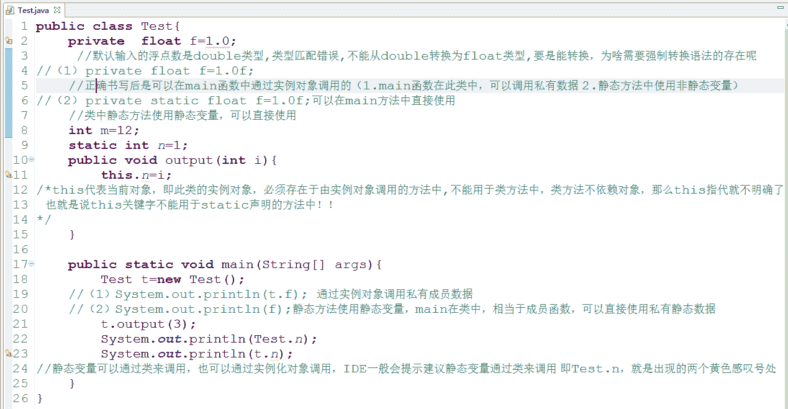
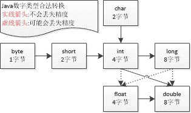
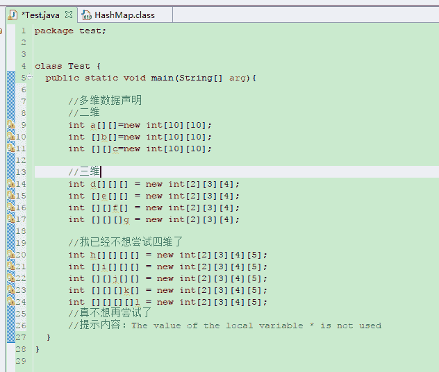
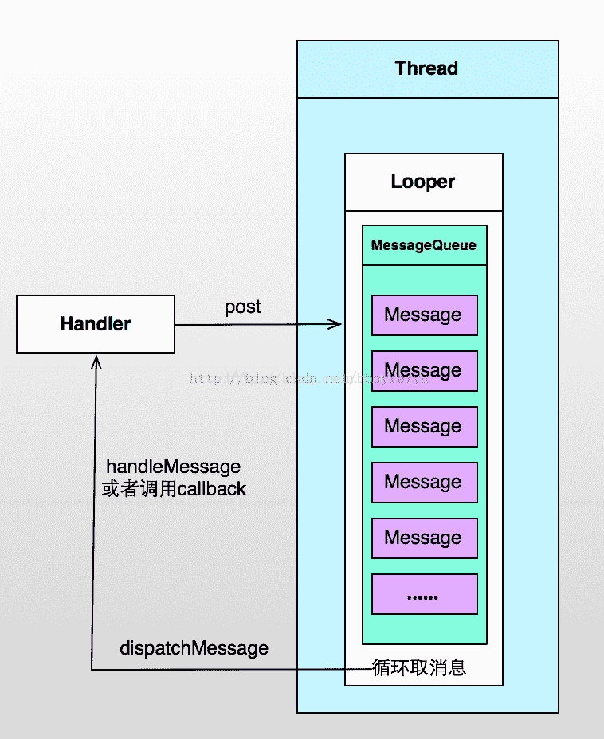

# 挖财 2017 校招安卓工程师笔试试卷

## 1

下面哪些在 android 中不是合法的属性（）

正确答案: D   你的答案: 空 (错误)

```cpp
android：id
```

```cpp
android：name
```

```cpp
android：description
```

```cpp
android：protectionlevel
```

本题知识点

Android 安卓工程师 挖财 2017

讨论

[啦啦啦～～](https://www.nowcoder.com/profile/9427568)

垃圾题 -.-

发表于 2017-08-23 17:12:20

* * *

[＆Francis￥](https://www.nowcoder.com/profile/1846955)

选择 D

```cpp
//D 选项 l 应为大写，改为下面这个
android:protectionLevel 
```

发表于 2017-02-19 20:01:27

* * *

[八八啊](https://www.nowcoder.com/profile/6133717)

id 可以在 xml 文件里设置空间属性用到，name 可以在 manifest 里面设置 activity 的名字用到，description 作用类似 label，可以比 label 长，最后一个用来对 permission 进行自定义

发表于 2017-09-14 00:28:57

* * *

## 2

What is the difference between parcelable and serializable()

正确答案: A   你的答案: 空 (错误)

```cpp
Parcels are light weght serialzable .It is perfred to use parcels for marsshaling objects into byte streams
```

```cpp
Sreializable objects are faster to transfer when compared to parcelable
```

```cpp
Android app heavliy depends on Serialization concept tomarshal objects
```

```cpp
Android uses Linux IPC driver to transfer data between two processes.
```

本题知识点

Android 安卓工程师 挖财 2017

讨论

[Vzer](https://www.nowcoder.com/profile/5990181)

Parcelable 和 Serializable 俩者异同 1、Serializable 在序列化的时候会产生大量的临时变量，从而引起频繁的 GC；2、在使用内存的时候，Parcelable 比 Serializable 性能高，所以推荐使用 Parcelable。3、Parcelable 不能使用在要将数据存储在磁盘上的情况，因为 Parcelable 不能很好的保证数据的持续性在外界有变化的情况下。尽管 Serializable 效率低点，但此时还是建议使用 Serializable 。

发表于 2017-08-15 09:16:42

* * *

[魔路锋芒](https://www.nowcoder.com/profile/1570289)

三短一长选什么？？？？？

发表于 2017-08-15 10:12:48

* * *

[Kok3E](https://www.nowcoder.com/profile/4151662)

都是英语 我看不懂...所以随便选的.

发表于 2017-10-25 15:35:27

* * *

## 3

下面的代码段中，执行之后 i 和 j 的值是什么（）

```cpp
int i=1;
int j;
j=i++;
```

正确答案: C   你的答案: 空 (错误)

```cpp
1,1
```

```cpp
1,2
```

```cpp
2,1
```

```cpp
2,2
```

本题知识点

C 语言

讨论

[图拉丁鱼](https://www.nowcoder.com/profile/6770936)

j 和 i 看反了的来点赞😂

发表于 2017-12-13 01:30:51

* * *

[这个好玩吗？](https://www.nowcoder.com/profile/864589)

选择 C  j = i++  表示先赋值后运算，所以 j = i = 1 ，后运算 i = i + 1

发表于 2017-03-14 15:46:08

* * *

[haimingchen](https://www.nowcoder.com/profile/1596468)

选 c     j = i++ 先赋值在自增, 如果是 j = ++i 则是先自增后赋值

发表于 2017-08-19 15:48:34

* * *

## 4

如下哪些是 java 中有效的关键字（）

正确答案: A D   你的答案: 空 (错误)

```cpp
native
```

```cpp
NULL
```

```cpp
false
```

```cpp
this
```

本题知识点

Java

讨论

[我是小埋哟](https://www.nowcoder.com/profile/6306378)

这个关键字常见的坑：true、false、null 都不是关键字
goto、const、是保留的关键字

```cpp
abstract                continue           for            new        
switch                  default            if             package     
synchronized            do                 goto           private     
this                    break              double         implements   
protected               throw              byte           else       
import                  public             throws         case       
enum                    instanceof         return         transient  
catch                   extends            int            short       
try                     char               final          interface    
static                  void               class          finally   
long                    strictfp           volatile       const      
float                   native             super          while
boolean                 assert 
```

编辑于 2017-09-16 01:43:23

* * *

[leozam](https://www.nowcoder.com/profile/320048)

The keywords const and goto are reserved, even though they are not currently used. This may allow a Java compiler to produce better error messages if these C++ keywords incorrectly appear in programs.

While true and false might appear to be keywords, they are technically boolean literals ([§3.10.3](http://docs.oracle.com/javase/specs/jls/se8/html/jls-3.html#jls-3.10.3)). Similarly, while null might appear to be a keyword, it is technically the null literal ([§3.10.7](http://docs.oracle.com/javase/specs/jls/se8/html/jls-3.html#jls-3.10.7)).

大概意思：const 和 goto 是保留关键字。true 和 false 看起来像关键字，但严格来说，它们是 boolean 常量；null 看起来也像关键字，但严格来说，它是 null 常量。

综上，true,false,null 不是关键字。而是常量。

> [点击查看 java se 8 官方解释](http://docs.oracle.com/javase/specs/jls/se8/html/jls-3.html#jls-3.9)

编辑于 2017-08-17 18:16:29

* * *

[宋佑廉](https://www.nowcoder.com/profile/605615533)

true false null 都不是关键字 true false null 都不是关键字 true false null 都不是关键字重点事情说 3 遍!   !  !

发表于 2018-10-27 19:50:25

* * *

## 5

下面哪些选项是正确的（）

正确答案: A D   你的答案: 空 (错误)

```cpp
>>是算术右移操作符
```

```cpp
>>是逻辑右移操作符
```

```cpp
>>>是算术右移操作符
```

```cpp
>>>是逻辑右移操作符
```

本题知识点

Java

讨论

[石头孩儿](https://www.nowcoder.com/profile/842004)

A,D 就是这么规定的吧。>> 右移 高位补符号位>>> 右移 高位补 0

发表于 2017-02-06 08:52:27

* * *

[杉杉来啦](https://www.nowcoder.com/profile/243827773)

运算符“>>”执行算术右移，它使用最高位填充移位后左侧的空位。

    右移的结果为：每移一位，第一个操作数被 2 除一次，移动的次数由第二个操作数确定。

逻辑右移或叫无符号右移运算符“>>>“只对位进行操作，没有算术含义，它用 0 填充左侧的空位。

**算术右移不改变原数的符号，而逻辑右移不能保证这点。**

移位运算符约简其右侧的操作数，当左侧操作数是 int 类型时，右侧以 32 取模；当左侧是 long 类型时，右侧以 64 取模。

发表于 2020-08-07 16:58:55

* * *

[小刘不秃头](https://www.nowcoder.com/profile/188586330)

哈哈哈，完美避开正确答案

发表于 2022-03-18 09:37:30

* * *

## 6

已知如下类说明：

```cpp
public class Test{
    private float f=1.0f;
    int m=12;
    static int n=1;
    public static void main(String args[]){
        Test t=new Test();
    }
}
```

如下哪些使用是正确的（）

正确答案: D   你的答案: 空 (错误)

```cpp
t.f = 1.0
```

```cpp
this.n
```

```cpp
Test.m
```

```cpp
Test.n
```

本题知识点

Java

讨论

[阿森先生](https://www.nowcoder.com/profile/4775155)

答案：D
A：编译不成功，因为 float 浮点类型默认是 double 类型 所以 float f=1.0f;（必须加上 f 强调定义的是 float）此处是精度由高(double)向低(float)转型所以会报错   但是若是 float f=1;这里是默认类型是 Int 类型  精度由低(int)向高转型(float)不丢失精度不会报错。
B：this 的使用时针对在方法内部使局部变量等值于实例变量而使用的一个关键字，此处的 n 是静态变量而非实例变量 所以 this 的调用会出错（试想一下，static 本来是全类中可以使用的，是全局的，你非得 this 去调用，这不是区分局部变量和实例变量的分水线吗？但是此处是全局的，不需要区分）
C：m 是实例变量，什么是实例变量：就是需要 new 一个对象出来才能使用的，这里直接用类名就调用了，jvm 怎么知道 m 是谁？
D：类变量可以通过类直接调用

编辑于 2017-08-21 13:54:08

* * *

[踩在脚下](https://www.nowcoder.com/profile/210060)



发表于 2017-08-15 08:52:12

* * *

[a_dream](https://www.nowcoder.com/profile/6290541)

**D**

A.1.0 默认为 double 类型，float f = 1.0 编译出错，如果是 float f= 1 就可以通过

B.static 中没有对象的说法，this 不存在

C.m 不是 static 的，需要依附于对象存在

发表于 2017-04-03 17:06:49

* * *

## 7

下面代码的运行结果是（）

```cpp
public static void main(String[] args){
    String s;
    System.out.println("s="+s);
}
```

正确答案: C   你的答案: 空 (错误)

```cpp
代码编程成功，并输出”s=”
```

```cpp
代码编译成功，并输出”s=null”
```

```cpp
由于 String s 没有初始化，代码不能编译通过。
```

```cpp
代码编译成功，但捕获到 NullPointException 异常
```

本题知识点

Java

讨论

[SkyNet_s 废柴君](https://www.nowcoder.com/profile/533542)

局部变量没有默认值

编辑于 2017-03-19 10:46:34

* * *

[a_dream](https://www.nowcoder.com/profile/6290541)

**C**

成员变量有初始值，而局部变量没有初始值得。本体中的 s 定义在方法中所以为局部变量-没有初始值。变量没有初始值就使用了，编译通不过

发表于 2017-04-03 15:21:17

* * *

[阿里钉钉程序猿](https://www.nowcoder.com/profile/8687562)

类中实例变量可以不用初始化，使用相应类型的默认值即可；方法中的定义的局部变量必须初始化，否则编译不通过。

发表于 2017-03-30 20:24:23

* * *

## 8

下面哪些赋值语句是正确的（）

正确答案: A B D   你的答案: 空 (错误)

```cpp
long test=012
```

```cpp
float f=-412
```

```cpp
int other =(int)true
```

```cpp
double d=0x12345678
```

```cpp
byte b=128
```

本题知识点

Java

讨论

[崔洪振 367](https://www.nowcoder.com/profile/606942)

选 ABDA 和 B 中 lon  查看全部)

编辑于 2017-03-19 20:00:28

* * *

[紫月](https://www.nowcoder.com/profile/371702)

java 中不需要强制向下转型的合法数字类型转换图：core java 书中有记载

发表于 2016-12-28 16:47:59

* * *

[牛客 7675652 号](https://www.nowcoder.com/profile/7675652)

我成功的避开了所有正确答案

发表于 2017-02-20 12:56:01

* * *

## 9

下面哪几个函数 public void example(){....} 的重载函数？（）

正确答案: A D   你的答案: 空 (错误)

```cpp
public void example(int m){...}
```

```cpp
public int example(){..}
```

```cpp
public void example2(){..}
```

```cpp
public int example(int m,float f){...}
```

本题知识点

Java

讨论

[武岩](https://www.nowcoder.com/profile/4552908)

  查看全部)

编辑于 2017-03-19 11:47:58

* * *

[248569875288](https://www.nowcoder.com/profile/4856755)

java 重载的时候以参数个数和类型作为区分，方法名相同，返回类型可以相同也可以不同，但不以返回类型作为区分，所以 b 也是错的，因为 b 的参数列表和原来的一样，

发表于 2017-04-20 11:27:11

* * *

[谁南牛客](https://www.nowcoder.com/profile/5279005)

重载只要求参数列表不同，返回值无关。

发表于 2017-02-28 16:42:02

* * *

## 10

下面哪几个语句正确的声明一个整型的二维数组（）

正确答案: C D   你的答案: 空 (错误)

```cpp
int a[][]=new int[][]
```

```cpp
int b[10][10]=new int[][]
```

```cpp
int c[][]=new int[10][10]
```

```cpp
int []d[]=new int[10][10]
```

本题知识点

Java

讨论

[Likwind](https://www.nowcoder.com/profile/995326)



发表于 2017-06-30 10:39:08

* * *

[柚子皮 Uzipi](https://www.nowcoder.com/profile/5056050)

1\. 定义一维数组时，必须显式指明数组的长度；2\. 定义***数组时，其一维数组的长度必须首先指明，其他维数组长度可以稍后指定；3\. 采用给定值初始化数组时，不必指明长度；4\. “[]” 是数组运算符的意思，在声明一个数组时，数组运算符可以放在数据类型与变量之间，也可以放在变量之后。

发表于 2018-02-24 14:02:15

* * *

[不会编程孙一峰](https://www.nowcoder.com/profile/4844392)

这种问题意义何在？编写可读性差的代码？

发表于 2017-08-21 11:22:31

* * *

## 11

对于一个已经存在的 SharedPreferences 对象 setting ，想向其中存入一个字符串 ”person”,”setting” 应该先调用什么方法？

正确答案: A   你的答案: 空 (错误)

```cpp
edit（）
```

```cpp
save()
```

```cpp
commit()
```

```cpp
putString()
```

本题知识点

Android 安卓工程师 挖财 2017

讨论

[墨荷](https://www.nowcoder.com/profile/8283691)

这个题虽然是安卓的内容，但是可以了解一下。SharedPreferences 他是安卓中的一个轻型的数据存储方式，它的本质是基于 xml 文件存储 key-value 键值对数据，通常适用于存储一些配置信息。使用步骤    1.通过 Context 上下文来过去到 SharePreferences 对象
    2.调用 SharePreferences 的 edit()方法返回一个 Editor 对象    3.在通过 Editor 的 putXXX(key , value);方法设置数据    4. 在通过 Editor 的  commit(); 方法 关闭对象

编辑于 2016-12-26 11:27:20

* * *

[阿森先生](https://www.nowcoder.com/profile/4775155)

将数据保存至 SharedPreferences:SharedPreferences preferences=getSharedPreferences("user",Context.MODE_PRIVATE);Editor editor=preferences.edit();String name="xixi";String age="22";editor.putString("name", name);editor.putString("age", age);editor.commit();从 SharedPreferences 获取数据:SharedPreferences preferences=getSharedPreferences("user", Context.MODE_PRIVATE);String name=preferences.getString("name", "defaultname");String age=preferences.getString("age", "0");

发表于 2017-01-12 14:18:04

* * *

[牛客-120 抢救中心](https://www.nowcoder.com/profile/6165623)

这是一道送命题

发表于 2017-08-02 11:07:47

* * *

## 12

如果 androd 应用程序中需要发送短信，那么需要在 AndroidMainfest.xml 文件中增加什么权限（）？

正确答案: D   你的答案: 空 (错误)

```cpp
发送短信，无需配置权限
```

```cpp
permison.SMS
```

```cpp
android.permissino.RECEIEVE_SMS
```

```cpp
android.permission.SEND_SMS
```

本题知识点

Android 安卓工程师 挖财 2017

讨论

[hexiaosa](https://www.nowcoder.com/profile/9067338)

D.发送短信需要的权限  查看全部)

编辑于 2017-03-18 10:02:30

* * *

[徐国宝](https://www.nowcoder.com/profile/507307469)

没人看到 permission 都拼错了么

发表于 2018-10-17 12:43:42

* * *

[WalterCapable](https://www.nowcoder.com/profile/123159)

官方文档的说明。

发表于 2018-01-06 15:58:24

* * *

## 13

关于 intent 的说法，错误的是（）

正确答案: C   你的答案: 空 (错误)

```cpp
可以用来激活组件
```

```cpp
表示程序想做某事的意图
```

```cpp
只能用于一个组件内部
```

```cpp
是一个简单的消息对象
```

本题知识点

Android 安卓工程师 挖财 2017

讨论

[夜临永寂](https://www.nowcoder.com/profile/7539663)

答案 C  Intent 可用于在 Activity 中启动另一 Activity、Service 等操作，不局限于一个组件内

发表于 2017-03-06 13:04:46

* * *

[牛宇堃](https://www.nowcoder.com/profile/696337)

错误的 c

发表于 2016-12-13 01:38:19

* * *

[iso8859-1](https://www.nowcoder.com/profile/113939263)

只有我看不到题吗

发表于 2019-03-23 06:11:39

* * *

## 14

下面哪种进程最重要，最后被销毁？（）

正确答案: C   你的答案: 空 (错误)

```cpp
服务进程
```

```cpp
后台进程
```

```cpp
前台进程
```

```cpp
可见进程
```

本题知识点

Android 安卓工程师 挖财 2017

讨论

[.Ensensen](https://www.nowcoder.com/profile/4542121)

重要性依次是：前台进程、可见进程、服务进程、后台进程、空进程。所以销毁的顺序为逆方向。

发表于 2017-01-24 22:46:10

* * *

[Android 程序猿 DayDayUp](https://www.nowcoder.com/profile/8011134)

前台是指与用户交互的嘛？执行完 onResume 的？可见是指 onStart 的？

发表于 2017-09-20 13:09:28

* * *

[阿云 ⿻ Reiner](https://www.nowcoder.com/profile/9314067)

这是 Android 的东西也不写清楚

发表于 2017-07-23 10:30:15

* * *

## 15

为满足线程间通信，android 提供了?

正确答案: A   你的答案: 空 (错误)

```cpp
Handler 和 Looper
```

```cpp
Handler
```

```cpp
Message Queue
```

```cpp
Looper
```

本题知识点

Android 安卓工程师 挖财 2017

讨论

[归去来](https://www.nowcoder.com/profile/517367)

这题目出得真怪，A B C D 都是相互有关的如果缺少了一个呢？哪怎么去通信。

发表于 2015-10-18 16:14:08

* * *

[程序员之路](https://www.nowcoder.com/profile/660897)

A

andriod 提供了 Handler  和  Looper  来满足线程间的通信。 Handler 先进先出原则。 Looper 类用来管理特定线程内对象之间的消息交换 (MessageExchange) 。 
1)Looper:  一个线程可以产生一个 Looper 对象，由它来管理此线程里的 MessageQueue( 消息队列 ) 。 
2)Handler:  你可以构造 Handler 对象来与 Looper 沟通，以便 push 新消息到 MessageQueue 里 ; 或者接收 Looper 从 Message Queue 取出 ) 所送来的消息。 
3) Message Queue( 消息队列 ): 用来存放线程放入的消息。 
4) 线程： UIthread  通常就是 main thread ，而 Android 启动程序时会替它建立一个 MessageQueue 。 

发表于 2015-03-01 16:03:18

* * *

[ViceBanished](https://www.nowcoder.com/profile/443979)

Thread 可以有唯一的一个 Looper 和 Handler 结构如图，但是我傻 x 了，记成 Handler 包含 Looper，是 Thread 包含 Looper

发表于 2016-04-07 20:08:17

* * *

## 16

在 android studio 中，下列哪一项是 mainfest 文件的功能

正确答案: A   你的答案: 空 (错误)

```cpp
都是
```

```cpp
声明要求的最低 API 级别
```

```cpp
声明要求的用户权限的级别
```

```cpp
记录程序中使用的 Activity 等资源
```

本题知识点

Android 安卓工程师 挖财 2017

讨论

[陈鑫](https://www.nowcoder.com/profile/7157649)

前一套题还不能定义 api 到这又能了

发表于 2017-08-25 14:12:03

* * *

[hyman_android](https://www.nowcoder.com/profile/4093818)

API 级别难道不是在 build.gradle 里面设置的吗？

发表于 2017-11-20 11:47:46

* * *

[A.大飞](https://www.nowcoder.com/profile/940558088)

如果这道题目的正确答案为 A,那么这个不是用 Android Studio 开发的情况下但是题目中明确指出在“在 android studio 中”所以 A 是不正确的，请出题者，及管网本着严谨的态度进行审核。

发表于 2018-11-28 11:44:27

* * *

## 17

android 默认使用 （）作为字号单位。

正确答案: C   你的答案: 空 (错误)

```cpp
dip
```

```cpp
px
```

```cpp
sp
```

```cpp
pt
```

本题知识点

Android 安卓工程师 挖财 2017

讨论

[誓言还是噬言](https://www.nowcoder.com/profile/1071823)

android 默认使用 dp 为像素单位，而**字号**使用的是 sp 为单位，本题属于粗心大意导致

发表于 2017-09-17 20:05:42

* * *

[从此。海比天蓝](https://www.nowcoder.com/profile/2309906)

c

发表于 2017-05-12 10:37:04

* * *

[牛客 8525849 号](https://www.nowcoder.com/profile/8525849)

c

发表于 2017-02-10 15:02:03

* * *

## 18

下面不可以退出 Activity 的是？（）

正确答案: D   你的答案: 空 (错误)

```cpp
finish
```

```cpp
抛异常强制退出
```

```cpp
system.exit(0)
```

```cpp
onStop()
```

本题知识点

Android 安卓工程师 挖财 2017

讨论

[张瑞泽](https://www.nowcoder.com/profile/9276849)

生命周期的回调方法应当由系统进行调用，而不应当自己手工干涉。无论怎样，手动调用 onStop 也只是回调而已，无法真正产生作用。

发表于 2017-03-29 14:09:43

* * *

[从此。海比天蓝](https://www.nowcoder.com/profile/2309906)

D,

发表于 2017-05-12 10:40:37

* * *

[叫我巍仔](https://www.nowcoder.com/profile/5245439)

D 了解生命周期可知 OnDestroy 才是销毁

发表于 2017-03-05 18:54:07

* * *

## 19

我们都知道 Handler 是线程与 Activity 通信的桥梁，如果线程处理不当，你的机器就会变得越慢，此时可以选择人为销毁线程来缓解资源。那么线程销毁过程中，会被调用到的方法是（）

正确答案: A   你的答案: 空 (错误)

```cpp
onDestroy()
```

```cpp
onClear()
```

```cpp
onFinish()
```

```cpp
onStop()
```

本题知识点

Android 安卓工程师 挖财 2017

讨论

[Binvan](https://www.nowcoder.com/profile/5596222)

我从博客：[`blog.csdn.net/xingfeng2010/article/details/7878929`](http://blog.csdn.net/xingfeng2010/article/details/7878929)找到了相关的答案。可以理解题目的意思为：在 Activity 中创建的线程，在 app 退出时如果没有结束掉线程，那么每次打开 app，都会创建一个新的线程，导致线程越来越多。因此，需要在 app 退出的时候，销毁掉创建的线程。问题是，应该在 Activity 中的哪个方法中操作、销毁。

发表于 2017-06-20 15:11:55

* * *

[一神](https://www.nowcoder.com/profile/5855776)

感觉题目非常不严谨，销毁线程是什么鬼！

发表于 2017-01-04 20:22:13

* * *

[Shoad](https://www.nowcoder.com/profile/5480777)

出题的技术很 low 吧

发表于 2018-04-12 19:31:21

* * *

## 20

请列举你使用过的开源库，说出你选择它的理由以及它的缺点。

你的答案

本题知识点

开发工具 安卓工程师 挖财 2017

讨论

[无名 huster](https://www.nowcoder.com/profile/7450384)

当前流行：Retrofit+OkHttp+RxJava/RxAndroid 有些过时：volleyEventBus

发表于 2017-08-21 13:16:48

* * *

[心伤余痛](https://www.nowcoder.com/profile/7905393)

mysql，开源免费是一大亮点，这个也是众多人使用的原因，还有就是 mysql 安装方便

发表于 2017-03-10 14:50:52

* * *

## 21

Android 中， ListView 的 Adapter 有什么作用，如何利用 Adapter 在 ListView 中展现多种样式的 item ， ListView 是如何重用与之对应的 item 的。

你的答案

本题知识点

Android 安卓工程师 挖财 2017

讨论

[牛客 7726615 号](https://www.nowcoder.com/profile/7726615)

  查看全部)

编辑于 2017-03-19 11:59:42

* * *

[a_dream](https://www.nowcoder.com/profile/6290541)

**listview 是一个展示数据的控件，adapter 决定展示的数据有哪些，可以通过 getitemtype 来支持多种样式，Listview 对滑出屏幕的 view 进行回收并保持在内存中，有新的划进来的 view 是拿出来使用**

发表于 2017-04-03 16:57:57

* * *

[无名 huster](https://www.nowcoder.com/profile/7450384)

作用：适配器，加载子 Item 布局和填充数据多样式 Item：     重写 getViewTypeCount、getItemViewType
重用：    convertView 重用、使用 viewHolder 减少 findViewById 的操作

发表于 2017-08-21 13:18:07

* * *

## 22

【编程】分别从性能优先和维护两个角度完成 printChange 函数，输入总金额 dCash 和应付款 dCost，打印出应该找零的钱，且尽量给整钱：比如输入总金额 5000，应付款 33.34 元，则打印出”找零 1 个 10 元，1 个 5 元，1 个 1 元，一个 5 毛，一个 5 分，一个 1 分”。

你的答案

本题知识点

Python C# Javascript Java C++ 安卓工程师 挖财 2017

讨论

[职业浪子 _](https://www.nowcoder.com/profile/7831395)

循环减大钱，减不过减小钱

发表于 2017-09-03 17:56:46

* * *

[hahec](https://www.nowcoder.com/profile/3050648)

```cpp
import java.math.BigDecimal;

public class Test3 {

    public void printchagnge(double sum,double leave){
        double[] a={100,50,20,10,5,1,0.5,0.1,0.05,0.01};
        int[] b=new int[10];
        //避免误差 比如 30-33.34，结果就是 16.659999999999997，懵逼
        BigDecimal sum1=new BigDecimal(Double.toString(sum));
        BigDecimal leave1=new BigDecimal(Double.toString(leave));
        double t=sum1.subtract(leave1).doubleValue();

        for(int i=0;i<10;i++){
            int temp=(int) (t/a[i]);
            if(temp>=1){

                t=t-a[i]*temp;
            }
            b[i]=temp;

        }

        for(int i=0;i<10;i++){
            switch(i){
            case 0: if(b[i]!=0){
                System.out.print(b[i]+"个 100 元，");
            }
            break;

            case 1: if(b[i]!=0){
                System.out.print(b[i]+"个 50 元，");
            }
            break;

            case 2: if(b[i]!=0){
                System.out.print(b[i]+"个 20 元，");
            }
            break;

            case 3: if(b[i]!=0){
                System.out.print(b[i]+"个 10 元，");
            }
            break;

            case 4: if(b[i]!=0){
                System.out.print(b[i]+"个 5 元，");
            }
            break;

            case 5: if(b[i]!=0){
                System.out.print(b[i]+"个 1 元，");
            }
            break;

            case 6: if(b[i]!=0){
                System.out.print(b[i]+"个 5 毛，");
            }
            break;

            case 7: if(b[i]!=0){
                System.out.print(b[i]+"个 1 毛，");
            }
            break;

            case 8: if(b[i]!=0){
                System.out.print(b[i]+"个 5 分，");

            }
            break;

            case 9: if(b[i]!=0){
                System.out.print(b[i]+"个 1 分");
            }
            break;

            }
        }

    }

    public static void main(String[] args) {
        // TODO Auto-generated method stub

        Test3 t=new Test3();
        t.printchagnge(50, 33.34);

        }
    } 
```

发表于 2017-09-06 14:52:13

* * *

[牛客 7606463 号](https://www.nowcoder.com/profile/7606463)

先做减法，然后除 100，除 10，除 5，除 1，除 0.5，除 0.1，除 0.01 分别取商，取余既为所求

发表于 2017-10-29 11:18:25

* * *

## 23

【编程】完成 rejetRepeatedChars 函数，从给定的字符串中剔除连续字符，只保留一个，比如 aaabbbcdc，处理完之后返回 abcdc。

你的答案

本题知识点

Python C# Javascript Java C++ 安卓工程师 挖财 2017

讨论

[从此。海比天蓝](https://www.nowcoder.com/profile/2309906)

```cpp
private static String rejetRepeatedChars(String str) {
		if (str == null || str.trim().length() == 0)
			return null;
		char temp = str.charAt(0);
		StringBuilder sb = new StringBuilder(temp + "");
		for (int i = 1, n = str.length(); i < n; i++) {
			if (temp != str.charAt(i)) {
				temp = str.charAt(i);
				sb.append(temp);
			} 
		}
		return sb.toString();
	}
```

发表于 2017-09-10 12:11:15

* * *

[◣夏天的風◥](https://www.nowcoder.com/profile/6943797)

function rejetRepeatedChars(str){return str.replace(/(.)\1+/gi,"$1"); }var str = rejetRepeatedChars('aaabbbccdc');console.log(str);

发表于 2017-08-18 18:34:46

* * *

[恒 201711071041336](https://www.nowcoder.com/profile/7755630)

```cpp
object = 'aaabbbcdc'
target = ""
alpha = ""
for i in object:
    if alpha != i:
        alpha = i
       target += alpha
```

发表于 2017-11-07 10:47:30

* * *