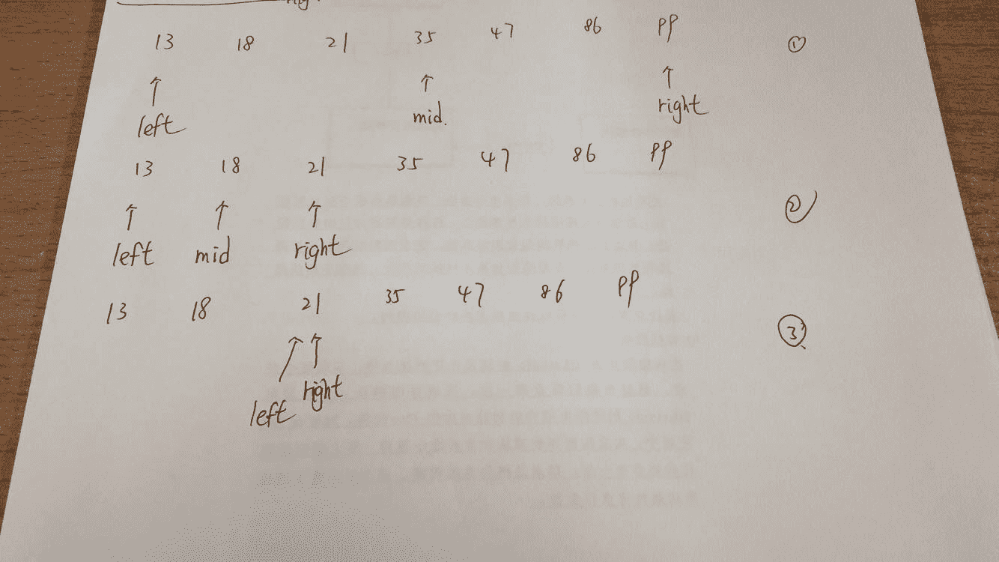
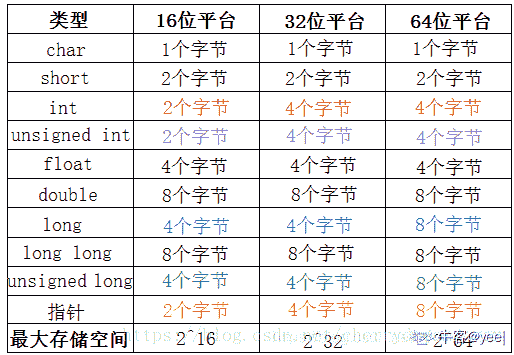

# 欢聚时代 2017 校招笔试题目（iOS 工程师类）A 卷

## 1

以下数据结构属于非线性数据结构的是

正确答案: B   你的答案: 空 (错误)

```cpp
队列
```

```cpp
二叉树
```

```cpp
栈
```

```cpp
数组
```

本题知识点

iOS 工程师 欢聚集团 2017 iOS 工程师 欢聚集团 2017

讨论

[shiyan 娃娃](https://www.nowcoder.com/profile/612398)

队列，栈，数组都属于线性结构，二叉树属于非线性结构。

发表于 2017-08-31 17:48:07

* * *

## 2

关于链表，下面说法错误的是

正确答案: B   你的答案: 空 (错误)

```cpp
不必事先估计存储空间
```

```cpp
可随机访问任一元素
```

```cpp
插入删除不需要移动元素
```

```cpp
所需空间与线性表长度成正比
```

本题知识点

iOS 工程师 欢聚集团 2017 iOS 工程师 欢聚集团 2017

讨论

[Pro_tected](https://www.nowcoder.com/profile/198873920)

A.采用动态存储分配，不会造成内存浪费和溢出。

B. 不能随机访问，查找时要从头指针开始遍历

C. 插入、删除时，只要找到对应前驱结点，修改指针即可，无需移动元素

D. 需要用额外空间存储线性表的关系，存储密度小

编辑于 2020-02-05 21:59:08

* * *

[shiyan 娃娃](https://www.nowcoder.com/profile/612398)

顺序表可随机访问任一元素，而链表不能。链表访问结点必须要从头结点开始，并不是可以随机访问任一元素。链表无需事先估计存储空间大小切所需空间郁存储元素成正比。链表插入、删除不需要移动元素。链表所需空间与线性表长度成正比。

发表于 2017-08-31 17:53:21

* * *

## 3

以下四种排序算法中，平均情况下时间复杂度最高的是

正确答案: C   你的答案: 空 (错误)

```cpp
堆排序
```

```cpp
快速排序
```

```cpp
选择排序
```

```cpp
归并排序
```

本题知识点

iOS 工程师 欢聚集团 2017

讨论

[shiyan 娃娃](https://www.nowcoder.com/profile/612398)

时间复杂度如下：
堆排序：O（nlog2n）（注意：2 表示的是底数）快速排序：O（nlog2n）（注意：2 表示的是底数）归并排序：O（nlog2n）（注意：2 表示的是底数）选择排序：O（n2）（注意：2 表示的是平方）

编辑于 2017-08-31 17:58:36

* * *

## 4

在一个具有 n 个顶点的无向图中，要连通全部顶点至少需要多少条边？

正确答案: C   你的答案: 空 (错误)

```cpp
n
```

```cpp
n+1
```

```cpp
n-1
```

```cpp
n/2
```

本题知识点

iOS 工程师 欢聚集团 2017

讨论

[阿诺 41](https://www.nowcoder.com/profile/8089149)

一个具有 n 个顶点的最小连通图的边数是 n-1。

发表于 2017-09-17 11:34:04

* * *

## 5

将长度为 n 的有序单链表 LA 与长度为 m 的有序单链表 LB 合并为一条有序的单链表 LC，算法的时间复杂度为

正确答案: D   你的答案: 空 (错误)

```cpp
O(1)
```

```cpp
O(n)
```

```cpp
O(m)
```

```cpp
O(m+n)
```

本题知识点

iOS 工程师 欢聚集团 2017

讨论

[Kaztha](https://www.nowcoder.com/profile/4986155)

有序合并、在合并的时候为了保证有序需要遍历两条链表。

发表于 2017-09-11 16:50:21

* * *

[shiyan 娃娃](https://www.nowcoder.com/profile/612398)

在链表链接时，要遍历到链表的尾指针，这个遍历的过程需要消耗时间。

发表于 2017-08-31 18:01:45

* * *

## 6

设有序表中的元素为(13，18，21，35，47，86，99)，则在其中利用二分法查找值为 21 的元素需要经过多少次比较。

正确答案: C   你的答案: 空 (错误)

```cpp
1
```

```cpp
2
```

```cpp
3
```

```cpp
4
```

本题知识点

iOS 工程师 欢聚集团 2017

讨论

[shiyan 娃娃](https://www.nowcoder.com/profile/612398)



发表于 2017-08-31 18:10:38

* * *

## 7

设某棵二叉树的前序遍历序列为 ABDGFCE，中序遍历序列为：GDFBAEC，则其后序遍历序列为

正确答案: B   你的答案: 空 (错误)

```cpp
BDGFCEA
```

```cpp
GFDBECA
```

```cpp
GFDBCEA
```

```cpp
BDGFECA
```

本题知识点

iOS 工程师 欢聚集团 2017

讨论

[丿皮卡丘皮](https://www.nowcoder.com/profile/2654590)

1.首先，根据先序遍历的特点，我们知道根节点为 A

2.其次观察中序遍历 GDFBAEC,其中 root 节点 A 左侧的 GDFB 必定是 root 的左子树，A 右侧的 EC 必定是 root 的右子树

3.同理，观察 root 节点左子树,先序为 BDGF,中序为 GDFB,可知 B 为左子树的根节点。

4.同理，观察 root 节点右子树,先序为 CE,中序为 EC,可知 C 为右子树的根节点。

5.以上为一个递归的过程。先找到当前树的根节点，然后划分为左子树，右子树，然后进入左子树重复上面的过程，然后进入右子树重复上面的过程。最后就可以还原一棵树了。

即，此题后续遍历序列为 GFDBECA

发表于 2018-05-24 21:23:26

* * *

## 8

设栈的输入序列是 M，N，P，Q,则以下哪个选项不可能是其出栈序列？

正确答案: D   你的答案: 空 (错误)

```cpp
M，N，Q，P
```

```cpp
N，M，P，Q
```

```cpp
M，Q，P，N
```

```cpp
Q，P，M，N
```

本题知识点

iOS 工程师 欢聚集团 2017

讨论

[ZeroOnet](https://www.nowcoder.com/profile/3134792)

题设并不是说输入序列必须一次全部入栈，因为这样出栈序列的顺序是唯一的。这里的意思是说保证压栈的序列顺序是固定的，而只要栈中有元素就可以出栈。如此，来对于输入系列进行分析：选项 A.    M 进 M 出 N 进 N 出 P 进 Q 进 Q 出 P 出；选项 B.    M 进 N 进 N 出 M 出 P 进 P 出 Q 进 Q 出；选项 C.    M 进 M 出 N 进 P 进 Q 进 Q 出 P 出 N 出；选项 D.    不满足栈的特性，M 与 N 位置应互换。

发表于 2017-09-27 18:17:12

* * *

## 9

二进制数 110010 转换成十六进制数是

正确答案: B   你的答案: 空 (错误)

```cpp
0x42
```

```cpp
0x32
```

```cpp
0xCA
```

```cpp
0xC2
```

本题知识点

iOS 工程师 欢聚集团 2017 iOS 工程师 欢聚集团 2017

讨论

[悠悠 0227](https://www.nowcoder.com/profile/290762924)

分拆数字为 0011 对应 16 进制的 3 0010 对应 16 进制的 2 组合一下就是 32 加上前缀 ox，就是 ox32

发表于 2019-08-13 15:49:40

* * *

[阿诺 41](https://www.nowcoder.com/profile/8089149)

二进制：    0011 001016 进制：0x      3      2

发表于 2017-09-17 11:37:13

* * *

## 10

以下程序的输出结果是（ ）

```cpp
#include <stdio.h>
int main() {
    unsigned char a = 235;
    unsigned char b = ~a;
    unsigned char c = b >> 1;
    printf(“%d”, c);
};
```

正确答案: D   你的答案: 空 (错误)

```cpp
6
```

```cpp
2
```

```cpp
4
```

```cpp
10
```

本题知识点

iOS 工程师 欢聚集团 2017 C 语言

讨论

[steam_fight](https://www.nowcoder.com/profile/657092030)

将 10 进制转换为 2 进制，a=1110 1011; b=~a=0001 0100; c=b>>1=0000 1010。最后转成 10 进制就是 c=10

发表于 2020-09-28 13:56:46

* * *

[勾陈一.](https://www.nowcoder.com/profile/744252839)

私以为这个题目不是简单地考察十进制转二进制再做取反移位的操作，这样的操作，势必要用到草稿纸（不用草稿纸也行，但脑算还是容易错的），这个题直接从二进制的角度出发进行解析，如下。(255)[10] = (1111 1111)[2]，意思是，unsigned char 型的变量对应最大的十进制数是 255，用 255-235=20，记住这个 20，用进制转换的步骤对比着解析，(235)[10 ]= (1110 1011)[2] ，然后对 235 进行取反，即(0001 0100)[2 ]= 20，也就是说，取反的这一步，b = ~a 就可以直接通过熟悉的十进制运算直接得出 20，第三步，对 b 右移一位，c = b >> 1 ，在二进制的运算中，左移右移，对应十进制的关系就是乘 2 或除以 2，左移一位是乘 2，右移一位是除以 2，所以这一步，20 / 2 = 10。 拓展一个例子，假如 255 - a 得到的是一个奇数，假设是 21，那很简单，右移一位，就是除以 2，而且是整除，余数 1 直接不要就可以了。总结下这个题目，我认为看似是考察十进制与二进制之间的转换以及基本运算，但实际是在考察是否掌握二进制运算与十进制之间相互对应的实质，也就是说，理解与掌握了这个本质，这个题目是完全可以通过简单的口算解决的，不需要动草稿纸，毕竟是个选择题嘛~

发表于 2021-10-28 20:16:39

* * *

[阿诺 41](https://www.nowcoder.com/profile/8089149)

～按位取反；>>右移，相当于➗2

发表于 2017-09-17 11:38:02

* * *

## 11

在 64 位系统中，下面代码段的输出为（）

```cpp
struct Student {
    int a;
    char b;
    char c;
    long d;
};
int main() {
    printf("%lu", sizeof(struct Student));
}
```

正确答案: B   你的答案: 空 (错误)

```cpp
20
```

```cpp
16
```

```cpp
12
```

```cpp
24
```

本题知识点

iOS 工程师 欢聚集团 2017 C 语言

讨论

[yee|](https://www.nowcoder.com/profile/164263137)

找到结构体内最长的字节类型 long  8  结构体的字节大小一定是 8 的倍数 进行内存对齐 int 4+两 char 1 占一个 8 剩下位置不够塞 long 在补一个 8 结构体字节大小就为 16 另外结构体内有 char a[10]; int i;这种 以 int 的长度 4 对齐 不是 10 数组只是叠加在一起不影响对齐 a[10]分成到三个 4 字节内存 加上 int i 则结构体字节大小为 16

发表于 2021-10-17 21:59:13

* * *

[牛客 629395155 号](https://www.nowcoder.com/profile/629395155)

64 位系统里，long 是 8 字节

发表于 2020-08-27 22:25:15

* * *

[牛客 733976669 号](https://www.nowcoder.com/profile/733976669)

char 型各补齐两字节刚好对齐 4+2+2+8

编辑于 2021-04-14 17:38:34

* * *

## 12

以下哪种情况下会出现死锁

正确答案: A   你的答案: 空 (错误)

```cpp
两个线程因竞争资源而相互等待对方释放已占有的资源
```

```cpp
有多个线程同时执行同一个任务
```

```cpp
主线程执行同步的网络请求，长时间没有返回
```

```cpp
资源数大大小于线程数或线程同时申请的资源数大大超过资源总数
```

本题知识点

iOS 工程师 欢聚集团 2017 iOS 工程师 欢聚集团 2017

讨论

[阿诺 41](https://www.nowcoder.com/profile/8089149)

死锁是指两个或两个以上的进程在执行过程中，由于竞争资源或者由于彼此通信而造成的一种阻塞的现象，若无外力作用，它们都将无法推进下去。此时称系统处于死锁状态或系统产生了死锁，这些永远在互相等待的进程称为死锁进程。

发表于 2017-09-17 11:40:53

* * *

## 13

如果某一进程获得除 CPU 以外的所有所需运行资源，经调度，分配 CPU 给它，该进程将进入什么状态?

正确答案: B   你的答案: 空 (错误)

```cpp
就绪状态
```

```cpp
运行状态
```

```cpp
阻塞状态
```

```cpp
活动状态
```

本题知识点

iOS 工程师 欢聚集团 2017

讨论

[shiyan 娃娃](https://www.nowcoder.com/profile/612398)

运行中的进程可以处在运行、就绪和等待三种状态之一。进程若已获得除 CPU 以外的所有运行所需资源，此时申请 CPU 的得不到满足，应该依然处于就绪状态：正在运行的进程，因为某种原因而暂停，此时处于阻塞状态(也称等待状态、挂起状态)；进程获得除 CPU 以外的所有所需运行资源，并分配 CPU 给它，该进程将进入运行状态。

发表于 2017-09-01 08:36:43

* * *

## 14

下列关于线程的叙述中，正确的是

正确答案: B   你的答案: 空 (错误)

```cpp
每个线程有自己独立的地址空间
```

```cpp
线程包含 CPU 现场，是系统独立调度和分派的基本单位
```

```cpp
每个进程只能有一个线程
```

```cpp
线程之间的通信必须使用系统调用
```

本题知识点

iOS 工程师 欢聚集团 2017 iOS 工程师 欢聚集团 2017

讨论

[阿诺 41](https://www.nowcoder.com/profile/8089149)

```cpp
 多进程下，每个进程都有自己的独立地址空间，进程间的数据空间也相互独立，彼此通信以专门的通信方式进行。而多线程下，同一进程内的线程共享进程的地址空间
```

发表于 2017-09-17 11:42:56

* * *

[shine 高小小](https://www.nowcoder.com/profile/3465147)

A、在多线程下，同一进程的线程共享进程的地址空间 B、进程是一个资源分配的基本单位，也是一个独立运行和调度的基本单位。而线程的属性：独立调度和分派的基本单位

发表于 2017-10-12 14:41:39

* * *

## 15

进程 A 和进程 B 通过共享缓冲区协作完成数据处理，进程 A 负 责产生数据并放入缓冲区，进程 B 从缓冲区读数据并输出。进程 A 和进程 B 之间的制约关系是

正确答案: A   你的答案: 空 (错误)

```cpp
同步关系
```

```cpp
互斥关系
```

```cpp
互斥和同步关系
```

```cpp
无关系
```

本题知识点

iOS 工程师 欢聚集团 2017

讨论

[shiyan 娃娃](https://www.nowcoder.com/profile/612398)

```cpp
相交进程之间的关系主要有两种，同步与互斥。所谓互斥，是指散步在不同进程之间的若干程序片断，当某个进程运行其中一个程序片段时，其它进程就不能运行它 们之中的任一程序片段，只能等到该进程运行完这个程序片段后才可以运行。所谓同步，是指散步在不同进程之间的若干程序片断，它们的运行必须严格按照规定的 某种先后次序来运行，这种先后次序依赖于要完成的特定的任务。
　　显然，同步是一种更为复杂的互斥，而互斥是一种特殊的同步。
　　也就是说互斥是两个线程之间不可以同时运行，他们会相互排斥，必须等待一个线程运行完毕，另一个才能运行，而同步也是不能同时运行，但他是必须要安照某种次序来运行相应的线程（也是一种互斥）！
　　总结：互斥：是指某一资源同时只允许一个访问者对其进行访问，具有唯一性和排它性。但互斥无法限制访问者对资源的访问顺序，即访问是无序的。
　　同步：是指在互斥的基础上（大多数情况），通过其它机制实现访问者对资源的有序访问。在大多数情况下，同步已经实现了互斥，特别是所有写入资源的情况必定是互斥的。少数情况是指可以允许多个访问者同时访问资源。
```

发表于 2017-09-02 11:36:38

* * *

## 16

用户程序发出磁盘 IO 请求后，系统的正确处理流程是

正确答案: B   你的答案: 空 (错误)

```cpp
用户程序->系统调用->中断处理->设备驱动
```

```cpp
用户程序->系统调用->设备驱动->中断处理
```

```cpp
用户程序->设备驱动->系统调用->中断处理
```

```cpp
用户程序->设备驱动->中断处理->系统调用
```

本题知识点

iOS 工程师 欢聚集团 2017 iOS 工程师 欢聚集团 2017

讨论

[shiyan 娃娃](https://www.nowcoder.com/profile/612398)

用户程序发出磁盘 I/O 请求后，系统的处理顺序：用户程序-系统调用-设备驱动-中断处理。

发表于 2017-09-02 12:02:50

* * *

## 17

若进程 P 一旦被唤醒就能投入运行，则系统可能是

正确答案: B   你的答案: 空 (错误)

```cpp
非抢占式调度方式，进程 P 的优先级最高
```

```cpp
抢占式调度方式，P 的优先级高于当前运行的进程
```

```cpp
就绪队列为空队列
```

```cpp
抢占式调度方式，就绪队列上的所有进程的优先级皆比 P 低
```

本题知识点

iOS 工程师 欢聚集团 2017 iOS 工程师 欢聚集团 2017

讨论

[stalary](https://www.nowcoder.com/profile/4599751)

非抢占的调度策略在线程运行优先级一般时用到，而对于高优先级的线程调度则多采用抢占式的调度策略

发表于 2017-10-15 09:19:59

* * *

[dear_deer1025](https://www.nowcoder.com/profile/782116841)

A.首先是为抢占式调度才会在有进程在执行时中断该进程立即执行目标进程。B.就绪队列所有进程优先级比 P 低，但执行中的进程优先级高的话，也依旧先执行当前进程，结束后才会执行 P。C.其次即使当就绪队列为空，当前也有可能有正在执行的进程。

发表于 2021-06-05 17:32:46

* * *

## 18

以下哪种不属于进程间通信的方式

正确答案: A   你的答案: 空 (错误)

```cpp
全局变量
```

```cpp
消息队列
```

```cpp
共享内存
```

```cpp
Socket
```

本题知识点

iOS 工程师 欢聚集团 2017

讨论

[shiyan 娃娃](https://www.nowcoder.com/profile/612398)

进程间通信方式：管道（pipe）有名管道（named pipe）信号量（semophore）消息队列（message queue）信号（signal）共享内存（shared memory）套接字（socket）

发表于 2017-09-02 12:12:42

* * *

## 19

面向对象程序设计的设计思想不包括

正确答案: B   你的答案: 空 (错误)

```cpp
封装
```

```cpp
接口
```

```cpp
多态
```

```cpp
继承
```

本题知识点

iOS 工程师 欢聚集团 2017 iOS 工程师 欢聚集团 2017

讨论

[阿诺 41](https://www.nowcoder.com/profile/8089149)

继承，封装，多态是面向对象的三大特点。

发表于 2017-09-17 11:45:00

* * *

## 20

Objective-C 定义一个类所要用到的指令是

正确答案: A   你的答案: 空 (错误)

```cpp
@interface
```

```cpp
@class
```

```cpp
@protocol
```

```cpp
@implementation
```

本题知识点

iOS 工程师 欢聚集团 2017 iOS 工程师 欢聚集团 2017

## 21

NSDictionary 类的方法： - (ObjectType)objectForKey:(KeyType)aKey 的时间复杂度是

正确答案: C   你的答案: 空 (错误)

```cpp
O(n)
```

```cpp
O(log(n))
```

```cpp
O(1)
```

```cpp
O(n*log(n))
```

本题知识点

iOS 工程师 欢聚集团 2017

## 22

关于宏的使用，以下说法错误的是

正确答案: C   你的答案: 空 (错误)

```cpp
宏没有执行类型安全性检查，并尽量避免使用
```

```cpp
大量使用宏可能会导致程序的二进制文件大小增加
```

```cpp
宏是在程序运行时将代码中的字符串替换成宏体
```

```cpp
相比函数调用，使用宏可以带来效率上的优势
```

本题知识点

iOS 工程师 欢聚集团 2017

讨论

[kiterunnert](https://www.nowcoder.com/profile/8920440)

宏不是函数,只是在编译前(编译预处理阶段)将程序中有关字符串替换成宏体

发表于 2017-09-16 15:42:31

* * *

## 23

关于 ARC，下面说法正确的是

正确答案: B   你的答案: 空 (错误)

```cpp
ARC 即是垃圾回收技术
```

```cpp
ARC 是由编译器在编译时插入对象销毁代码
```

```cpp
ARC 模式下可以保证不会出现内存泄露
```

```cpp
开启 ARC 模式，重载 dealloc 时，必须在 dealloc 里写 [super dealloc]方法
```

本题知识点

iOS 工程师 欢聚集团 2017

## 24

对于 Objective-C 的运行时(runtime)，以下说法错误的是

正确答案: C   你的答案: 空 (错误)

```cpp
在运行时修改对象的方法实现
```

```cpp
在运行时增加对象的方法
```

```cpp
在运行时动态加载 lib 文件
```

```cpp
在运行时查看对象所属的类
```

本题知识点

iOS 工程师 欢聚集团 2017

## 25

以下不属于数据序列化技术的是

正确答案: C   你的答案: 空 (错误)

```cpp
JSON
```

```cpp
Property List
```

```cpp
HTML
```

```cpp
Protocol Buffer
```

本题知识点

iOS 工程师 欢聚集团 2017 HTML

讨论

[Kaitle](https://www.nowcoder.com/profile/2213693)

A：JSON 数据格式 B：list 数据格式 D：protocal buffer 是 Google 出品的一种轻量 & 高效的结构化数据存储格式，性能比 Json、XML 强

发表于 2020-08-28 11:44:21

* * *

[天天吃饺子](https://www.nowcoder.com/profile/657629844)

什么叫做数据序列化技术？

发表于 2022-03-09 21:45:31

* * *

## 26

在 UIKit 中，frame 与 bounds 的区别是

正确答案: C   你的答案: 空 (错误)

```cpp
两者没有区别
```

```cpp
frame 和 bounds 所属的结构体类型不同
```

```cpp
frame 的参考系是父视图坐标，bounds 的参考系是自己视图的坐标
```

```cpp
frame 的参考系是自己视图的坐标，bounds 的参考系是父视图的坐标
```

本题知识点

iOS 工程师 欢聚集团 2017

## 27

对以下代码说法正确的是： @property (copy, nonatomic) Student *stuA；

正确答案: D   你的答案: 空 (错误)

```cpp
此属性可保证多线程安全
```

```cpp
此属性合成时会自动生成 getter、setter 方法
```

```cpp
类 Student 必须实现 NSCopying protocol
```

```cpp
以上说法都正确
```

本题知识点

iOS 工程师 欢聚集团 2017

## 28

以下哪个选项不属于 HTTP 的 Method

正确答案: C   你的答案: 空 (错误)

```cpp
PUT
```

```cpp
GET
```

```cpp
DEL
```

```cpp
POST
```

本题知识点

iOS 工程师 欢聚集团 2017

## 29

数据链路层上协议数据单元是

正确答案: A   你的答案: 空 (错误)

```cpp
帧
```

```cpp
比特
```

```cpp
分组
```

```cpp
数据包
```

本题知识点

iOS 工程师 欢聚集团 2017

## 30

对于 IP 地址为 192.124.210.200，属于哪一类网络地址

正确答案: C   你的答案: 空 (错误)

```cpp
A 类
```

```cpp
B 类
```

```cpp
C 类
```

```cpp
D 类
```

本题知识点

iOS 工程师 欢聚集团 2017

## 31

IP 协议属于哪一层

正确答案: C   你的答案: 空 (错误)

```cpp
应用层
```

```cpp
数据链路层
```

```cpp
网络层
```

```cpp
传输层
```

本题知识点

iOS 工程师 欢聚集团 2017

讨论

[9028_qqq](https://www.nowcoder.com/profile/125866061)

网络层是整个互联网的核心，要尽可能简单，提供简单灵活，面向无连接，尽最大可能交付的数据报服务。ip 协议属于*网络层协议*，可以将异构的物理网络连接起来，使其在网络层看起来像是一个统一的网络。配套的协议有：ARPICMPIGMP

编辑于 2020-11-30 15:52:07

* * *

## 32

下列以下 HTTP 返回码表示重定向的是

正确答案: A   你的答案: 空 (错误)

```cpp
302
```

```cpp
503
```

```cpp
200
```

```cpp
404
```

本题知识点

iOS 工程师 欢聚集团 2017

讨论

[不想做渣渣了](https://www.nowcoder.com/profile/529637)

A

发表于 2018-02-22 17:06:50

* * *

## 33

关于 TCP 和 UDP 的说法表述错误的是

正确答案: C   你的答案: 空 (错误)

```cpp
TCP 和 UDP 都是传输层协议
```

```cpp
TCP 是面向连接的传输协议
```

```cpp
UDP 不提供流控制和错误恢复功能，但能保证包按顺序到达
```

```cpp
TCP 和 UDP 都以 IP 协议为基础
```

本题知识点

iOS 工程师 欢聚集团 2017

## 34

TCP 协议三次握手的步骤如下，最后一步应该是（）Client->Server:  SYN=1, seq=xServer->Client:  SYN=1, ACK=1, seq=y, ack=x+1Client->Server:  ____________

正确答案: D   你的答案: 空 (错误)

```cpp
ACK=1, seq=y+1, ack=x+1
```

```cpp
ACK=1, seq=x+1, ack=y
```

```cpp
ACK=1, seq=y+1, ack=x
```

```cpp
ACK=1, seq=x+1, ack=y+1
```

本题知识点

iOS 工程师 欢聚集团 2017

## 35

以下哪个不属于应用层协议

正确答案: C   你的答案: 空 (错误)

```cpp
HTTP
```

```cpp
SMTP
```

```cpp
IGMP
```

```cpp
SNMP
```

本题知识点

iOS 工程师 欢聚集团 2017

## 36

下列关于数据库索引的说法正确的是

正确答案: B   你的答案: 空 (错误)

```cpp
在查找频繁的场合，应该尽量多建索引提高性能
```

```cpp
索引会降低写数据库的性能
```

```cpp
基于 Hash 的索引能很好的适用于范围查找
```

```cpp
在创建了索引的列上进行范围查找，不会进行全表扫描
```

本题知识点

iOS 工程师 欢聚集团 2017

## 37

关于主键，以下哪些说法是正确的

正确答案: D   你的答案: 空 (错误)

```cpp
一个表中可以设置多个主键约束
```

```cpp
主键约束的字段中的数据可以为 null
```

```cpp
sql 语句主键预留的关键为：main key
```

```cpp
sql 语句主键预留的关键为：primary key
```

本题知识点

iOS 工程师 欢聚集团 2017

## 38

请从四个选项中选择你认为最合理的一项，来填补空缺项，使以下数列符合原数列的排列规律： 4， 12， 30， 80， 178， （）

正确答案: C   你的答案: 空 (错误)

```cpp
510
```

```cpp
211
```

```cpp
420
```

```cpp
256
```

本题知识点

iOS 工程师 欢聚集团 2017

## 39

有苹果，橙子各一筐，苹果有 240 个，桔子有 313 个，把这两筐水果平均分给一些小朋友,已知苹果分到最后余 2 个,桔子分到最后还余 7 个，求最多有多少个小朋友参加分水果？

正确答案: D   你的答案: 空 (错误)

```cpp
38
```

```cpp
17
```

```cpp
28
```

```cpp
34
```

本题知识点

iOS 工程师 欢聚集团 2017

讨论

[shine 高小小](https://www.nowcoder.com/profile/3465147)

苹果有 240 个，桔子有 313 个，把这两筐水果平均分给一些小朋友,已知苹果分到最后余 2 个,桔子分到最后还余 7 个；那么苹果分走了 238 个，桔子分走了 306 个，那么参加的人数，应该是 238 和 306 个公倍数，只有 D 符合条件。

发表于 2017-10-12 15:33:03

* * *

## 40

有两批人要坐到排成一排的 150 个座位上，第一批人坐下后，恰好使得第二批入座的人必定在与第一批入座的人相邻的座位上，第一批入座的人至少有多少人。

正确答案: D   你的答案: 空 (错误)

```cpp
20
```

```cpp
30
```

```cpp
35
```

```cpp
50
```

本题知识点

iOS 工程师 欢聚集团 2017

讨论

[shine 高小小](https://www.nowcoder.com/profile/3465147)

第一批的人记为 A，第二批的人记为 B，则符合要求的座位顺序为 BAB,BAB,...,BAB,也就是说，一个 A，旁边有两个相邻的 B，那么就是 3*x = 150,那么 x = 50

发表于 2017-10-12 15:35:10

* * *

## 41

一个数组有 N 个元素，使用快速排序对其进行排序输出(本题还会人工阅卷,请使用快速排序算法进行排序)

本题知识点

排序 *分治 iOS 工程师 欢聚集团 2017* *讨论

[迪拜塔下≒仰望你的笑容.](https://www.nowcoder.com/profile/2020031)

```cpp
#include<bits/stdc++.h>
using namespace std;
int partition(vector<int> &a,int start,int end){
    int small=start;
    for(int i=start;i<end;i++){
        if(a[i]<a[end]){
            swap(a[i],a[small]);
            small++;
        }
    }
    swap(a[end],a[small]);
    return small;
}
void quicksort(vector<int> &a,int start,int end){
    if(start==end) return;
    int dex=partition(a,start,end);
    if(dex>start) quicksort(a,start,dex-1);
    if(dex<end) quicksort(a,dex+1,end);
}
int main(){
    int n;
    cin>>n;
    vector<int> a(n);
    for(int i=0;i<n;i++) cin>>a[i];
    quicksort(a,0,n-1);
    for(int i=0;i<n;i++) {
        if(i==0) cout<<a[i];
        else cout<<' '<<a[i];
    }
    cout<<endl;
    return 0;
}

```

编辑于 2018-04-03 12:12:17

* * *

[名字是乱打的](https://www.nowcoder.com/profile/2460854)

```cpp
package com.algorithm.sort;

import com.algorithm.comparator.ArrayComparator;

public class QuickSort extends ArrayComparator {

    public static void quickSort(int[] arr,int L,int R){ //在 L 到 R 上排序
        if (L<R){
            int[] ints = partition(arr, L, R);
            quickSort(arr,L,ints[0]);//小于区继续排
            quickSort(arr,ints[1],R);//大于区继续排
        }
    }

    //以最后一个位置上的数做划分
    //将小于最后一个数的放左边,大于最后一个数的放右边,等于的放中间
    //返回排序后返回小于区最后一个数和大于区第一个数
    public static int[] partition(int[] arr, int L, int R) {
        int less = L - 1;  //小于 arr[R]的最后一个索引
        int more = R; //大于 arr[R]的第一个索引
        int curr=L;
        while (curr < more) {
            if (arr[curr] < arr[R]) {
                swap(arr, ++less, curr++);
            } else if (arr[curr] >arr[R]) {
                swap(arr, --more, curr);
            } else {
                curr++;
            }
        }
        swap(arr,R,curr);
        return new int[] { less + 1, more};
    }

    public static void main(String[] args){
        int[] a={4,1,2,8,6,7};
        quickSort(a,0,a.length-1);
        for (int i = 0; i <a.length; i++) {
            System.out.print(a[i]+" ");
        }
    }
}

```

发表于 2019-12-13 00:26:27

* * *

[lalalaaaxxx](https://www.nowcoder.com/profile/1350442)

```cpp
def quicksort(s,left,right):
    l = left
    r = right
    if(left>right):
        return
    temp = int(s[left])
    while(l != r):
        while(int(s[r])>=temp and l<r):
            r -= 1
        while(int(s[l])<=temp and l<r):
            l += 1
        if (l<r):
            t = int(s[l])
            s[l] = int(s[r])
            s[r] = t
    s[left]=int(s[l]); 
    s[l]=temp; 
    quicksort(s,left,l-1)
    quicksort(s,l+1,right)
    return s
n = int(input())
right = n-1
s = input().split(" ")
result = quicksort(s,0,right)
print(" ".join(str(i) for i in result))
```

发表于 2017-09-03 10:02:08

* * *

## 42

读入一个有 n 个数的递增整形数组，并给出一个和值 sum，判断是否存在两个数字使得它们的和为 sum

本题知识点

数组 iOS 工程师 欢聚集团 2017

## 43

一个数量为 N 的整数数组，其中有很多重复，其中一个数字出现次数超过 N/2，请将该数字找出来。

本题知识点

贪心 数学 栈 *iOS 工程师 欢聚集团 2017* *讨论

[元气の悟空](https://www.nowcoder.com/profile/392974)

```cpp
#include<stdio.h>
int main(){
    int x,i,times=0,card,n,cnt=0;
    for(scanf("%d",&n),i=0;i<n;i++){
        scanf("%d",&x);
        if(!times) card=x,times=1;
        else if(x-card) times--;
        else times++;
    }
    printf("%d\n",card);
}

```

编辑于 2017-10-21 16:47:21

* * *

[间客.](https://www.nowcoder.com/profile/2885265)

import java.util.HashMap;
import java.util.Map;
import java.util.Scanner;
import java.util.Set;

/**
 * Created by 15040 on 2017/10/21.
 * 找出数组中出现最多的数
 */
public class Main {
    public static void main(String[] args) {
        Scanner sc=new Scanner(System.in);
        int n=sc.nextInt();
        int []a=new int [n];
        Map<Integer,Integer> map=new HashMap<>();
        for (int i=0;i<n;i++){
            a[i]=sc.nextInt();
            if (map.containsKey(a[i])){
                map.put(a[i],map.get(a[i])+1);
            }else {
                map.put(a[i],1);
            }
        }
        int temp=Integer.MIN_VALUE;
        int result=temp;
        for(Map.Entry<Integer,Integer> i:map.entrySet()){
            if(i.getValue()>temp){
                result =i.getKey();
                temp=i.getValue();
            }
        }
        System.out.println(result);
    }
}

发表于 2017-10-21 10:57:40

* * *

[bingzibing](https://www.nowcoder.com/profile/2771332)

import java.util.*;
public class Main{
    public static int findNumber(int[] nums){
        if(nums==null||nums.length==0){
            return 0;
        }
        int N=nums.length;
        Map<Integer,Integer> map=new HashMap<Integer,Integer>();
        for(int num:nums){
            map.put(num,map.getOrDefault(num,0)+1);
        }
        for(int cur:nums){
            if(map.get(cur)>N/2){
                return cur;
            }
        }
        return 0;
    }
    public static void main(String[] args){
        Scanner sc=new Scanner(System.in);
        int n=sc.nextInt();
        String[] str=new String[n];
        int[] num=new int[n];
        for(int i=0;i<n;i++){
            str[i]=sc.next();
        }
        for(int i=0;i<n;i++){
            num[i]=Integer.parseInt(str[i]);
        }
        Main main=new Main();
        System.out.println(main.findNumber(num));
    }
}

发表于 2020-02-27 22:31:07

* * *

## 44

使用伪码描述建立 TCP 连接服务器和客户端的流程。

你的答案

本题知识点

iOS 工程师 欢聚集团 2017**