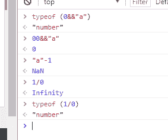
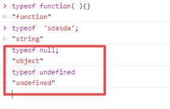
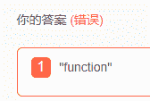
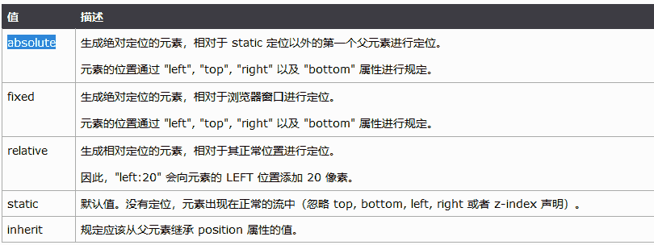
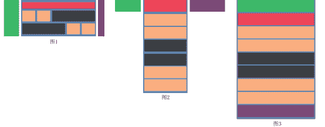

# 欢聚时代 2017 校招笔试题目（web 前端类）A 卷

## 1

使用了"use strict"后，以下哪些描述错误

正确答案: A B C   你的答案: 空 (错误)

```cpp
"use strict";
var x = 17;
with (obj) {
  		x;
}
//会报 obj 未定义的错误
```

```cpp
"use strict";
var x;
	delete x;
//运行正常
```

```cpp
function f(a){
		"use strict";
		a = 42;
   		return a==arguments[0];
}
f(5); //运行结果为 true
```

```cpp
function f(str){
"use strict";
    	return eval(str);
}
f(‘alert(1)’);
//运行正常，弹窗 1 的对话框
```

本题知识点

前端工程师 欢聚集团 2017

讨论

[春天再战](https://www.nowcoder.com/profile/3477549)

A：严格模式下禁止使用 with 语句，因为 with 语句无法在编译时就确定，属性到底归属哪个对象。B：严格模式下无法删除变量。只有 configurable 设置为 true 的对象属性，才能被删除。C：严格模式下 arguments 不再追踪参数的变化，在函数内部，参数 a 被重新赋值为 42，但 arguments[0]仍然为 5。详见：[`www.ruanyifeng.com/blog/2013/01/javascript_strict_mode.html`](http://www.ruanyifeng.com/blog/2013/01/javascript_strict_mode.html)

发表于 2017-08-31 12:17:26

* * *

[不瘦下去不改名字](https://www.nowcoder.com/profile/773225715)

    严格模式：禁止未定义就使用的变量禁止使用 with 严格模式下无法删除变量。只有 configurable 设置为 true 的对象属性，才能被删除。

发表于 2019-08-10 14:40:43

* * *

[myBoy](https://www.nowcoder.com/profile/329609)

应该是 bcd 吧

发表于 2017-08-30 19:40:16

* * *

## 2

以下输出结果为 true 的有

正确答案: A B C   你的答案: 空 (错误)

```cpp
’’==false
```

```cpp
’’==0
```

```cpp
’’==[]
```

```cpp
’’=={}
```

本题知识点

前端工程师 欢聚集团 2017

讨论

[Aleen_Cheung](https://www.nowcoder.com/profile/9588466)

可以参考这篇 JS 操作数隐式类型转换（[`segmentfault.com/a/1190000006161381`](https://segmentfault.com/a/1190000006161381)），JS 在做==运算时会将操作数转换为 Number 类型之后再操作，而' '，false，0，[]都能转换为为数字类型 0，而{}却转换不了，转换后为 NaN,而 NaN 做任何运算返回都是 false

发表于 2017-09-04 14:07:30

* * *

[Orange。](https://www.nowcoder.com/profile/608812)

执行类型转换的规则如下：如果一个运算数是 Boolean 值，在检查相等性之前，把它转换成数字值。false 转换成 0，true 为 1。如果一个运算数是字符串，另一个是数字，在检查相等性之前，要尝试把字符串转换成数字。如果一个运算数是对象，另一个是字符串，在检查相等性之前，要尝试把对象转换成字符串。如果一个运算数是对象，另一个是数字，在检查相等性之前，要尝试把对象转换成数字。

发表于 2017-08-31 14:41:01

* * *

[暮宿落花间](https://www.nowcoder.com/profile/3193197)

== 会将两边的值进行转换， [] => [].toString() => '' 所以 [] == ''

发表于 2017-08-31 11:29:31

* * *

## 3

以下代码执行的结果是（）

```cpp
var a = 0;
function b(c) {
 console.log(a);
 var a = 1;
 arguments[0] = 2;
 console.log(c);
 console.log(a);
}
b(3);
console.log(a);
```

正确答案: A   你的答案: 空 (错误)

```cpp
undefined,2,1,0
```

```cpp
1,2,2,0
```

```cpp
undefined,3,1,0
```

```cpp
undefined,3,2,0
```

本题知识点

前端工程师 欢聚集团 2017

讨论

[Dmmmmmmmmmm](https://www.nowcoder.com/profile/5432376)

原代码相当于：

```cpp
var a = 0;
function b(c) {
 var a;          //声明提前
 console.log(a);
 a = 1;
 c = 2;       //非严格模式，arguments 追踪参数变化
 console.log(c);
 console.log(a);
}
b(3);
console.log(a);

```

发表于 2017-09-05 11:50:00

* * *

[bong_Ju](https://www.nowcoder.com/profile/2371308)

var a = 0; function b(c) { console.log(a);//函数声明提升 var a = 1; arguments[0] = 2;//不是严格模式，可以跟踪改变参数 c 的值 console.log(c); console.log(a); } b(3); console.log(a);

编辑于 2017-09-04 09:18:21

* * *

[不瘦下去不改名字](https://www.nowcoder.com/profile/773225715)

```cpp
非严格模式，arguments 追踪参数变化
```

发表于 2019-08-10 14:45:47

* * *

## 4

以下代码的执行后将输出（）

```cpp
var a = 0;
var obj = {
 a:'obj',
 b:function(a){
 setTimeout(function(){
 console.log(this.a);
 },1000)
 }
}
obj.b(1);
```

正确答案: C   你的答案: 空 (错误)

```cpp
undefined
```

```cpp
’obj’
```

```cpp
0
```

```cpp
1
```

本题知识点

前端工程师 欢聚集团 2017

讨论

[song&](https://www.nowcoder.com/profile/6294324)

setTimeout 中所执行函数中的 this，永远指向 window！！注意是要**延迟执行的函数中的 this**哦！！

发表于 2017-08-31 11:34:13

* * *

[阿胜 4K](https://www.nowcoder.com/profile/8887390)

```cpp
setTimeout(console.log(this), 1000); // window
```

有是一个坑.
非严格模式指向 window,
严格模式指向 undefined

编辑于 2017-09-11 15:02:48

* * *

[916343510。](https://www.nowcoder.com/profile/8035436)

这里的 this 指的是 window 

发表于 2017-08-30 20:46:13

* * *

## 5

以下运算结果不是 number 类型的是

正确答案: D   你的答案: 空 (错误)

```cpp
"a"-1
```

```cpp
1/0
```

```cpp
0 && "a"
```

```cpp
new Number(1)
```

本题知识点

前端工程师 欢聚集团 2017

讨论

[二大爷 ol](https://www.nowcoder.com/profile/3110042)

以下为运行情况：var a = 'a'-1;
console.log(a,typeof a);       //NaN "number"
var b = 1/0;
console.log(b,typeof b);      //Infinity "number"
var c = 0 && 'a';
console.log(c,typeof c);      //0 "number"
var d =new Number(1);
console.log(d,typeof d);    //Number {[[PrimitiveValue]]: 1} "object"
五种简单数据类型为：Undefined/Null/Boolean/Number/String;一种复杂数据类型为：Object。其中 Number 数据类型除了包含普通的数值外，还包含超出范围的值 Infinity 和非数值 NaN。A.   'a'-1  为 NaN；
B.   1/0     为 Infinity，   0/0 返回 NaN， 正数/0 返回 Infinity，负数/0 返回-Infinity;C.   0 && “a"    为 0，&&为短路操作，且如果有一个操作数不是布尔值，则结果就不一定返回布尔值。 a && b,如果 a 能转换成 false，则返回 a。D.   new Number(1)   为基本包装类型的对象。故答案为 D。

编辑于 2017-11-08 12:32:18

* * *

[Dmmmmmmmmmm](https://www.nowcoder.com/profile/5432376)

"a"-1 结果为 NaN，但是 typeof NaN === ‘number’1/0 结果为 Infinity，但是 typeof Infinity === ‘number’0 && “a” 结果为 1，是 number 类型 new Number(1) 产生的是对象类型数据

发表于 2017-09-05 11:58:55

* * *

[916343510。](https://www.nowcoder.com/profile/8035436)



发表于 2017-08-30 20:48:17

* * *

## 6

你如何对网站的文件和资源进行优化?期待的解决方案包括：（ ）

正确答案: A B C D   你的答案: 空 (错误)

```cpp
文件合并
```

```cpp
文件最小化/文件压缩
```

```cpp
使用 CDN 托管
```

```cpp
缓存的使用
```

本题知识点

前端工程师 欢聚集团 2017

讨论

[牛客 4190072 号](https://www.nowcoder.com/profile/4190072)

```cpp
1、文件合并（目的是减少 http 请求）：Web 性能优化最佳实践中最重要的一条是减少 HTTP 请求，它也是 YSlow 中比重最大的一条规 则。减少 HTTP 请求的方案主要有合并 JavaScript 和 CSS 文件、CSS Sprites、图像映射 （Image Map）和使用 Data URI 来编码图片。CSS Sprites 和图像映射现在已经随处可见了，但由于 IE6 和 IE7 不支持 Data URI 以及性能问题，这项技术尚未大量使用。目前大部分网页中的 JavaScript 和 CSS 文件数量和开发时一致，少量的网页会根据实际情况采取本地合 并，这些合并中相当多的是有选择地手动完成，每次新的合并都需要重新在本地完成并上传到服务器，比较的随意和繁琐，同样文件的压缩也有类似的情况。而利用 服务端的合并和压缩，我们就可以按照开发的逻辑尽可能让文件的颗粒度变小，利用网页中 URL 的规则来自动实现文件的合并和压缩，这会相当的灵活和高效。参照[`www.iamued.com/qianduan/1462.html`](http://www.iamued.com/qianduan/1462.html)
```

```cpp
2、文件压缩：目的是直接减少文件下载的体积；常用的工具是 YUI Compressor。参考[`www.cnblogs.com/Darren_code/archive/2011/12/31/property.html`](http://www.cnblogs.com/Darren_code/archive/2011/12/31/property.html)
```

```cpp
3、 使用 CDN （内容分发网络）来托管资源；"其基本思路是尽可能避开互联网上有可能影响数据传输速度和稳定性的瓶颈和环节，使内容传输的更快、更稳定。通过在网络各处放置节点服务器所构成的在现有的互联网基础之上的一层智能虚拟网络，CDN 系统能够实时地根据网络流量和各节点的连接、负载状况以及到用户的距离和响应时间等综合信息将用户的请求重新导向离用户最近的服务节点上。"   形象点说：古代打仗大家一定都知道，由于古代的交通很不发达，所以当外族进攻的时候往往不能及时的反击，等朝廷征完兵再把兵派往边境的时候那些侵略者却是早已不见了踪影，这个让古代的帝王很是郁闷。后来帝王们学聪明了，都将大量的兵员提前派往边境驻扎，让他们平时屯田，战时当兵，这样的策略起到了很显著的作用。
```

```cpp

```
4、缓存的使用（并且多个域名来提供缓存）
```cpp

```
5、GZIP 压缩你的 JS 和 CSS 文件
```cpp

```

发表于 2017-09-06 21:21:20

* * *

## 7

WEB 应用从服务器主动推送 Data 到客户端有那些方式？

正确答案: A B C D E   你的答案: 空 (错误)

```cpp
html5 websoket
```

```cpp
WebSocket 通过 Flash
```

```cpp
XHR 长时间连接
```

```cpp
XHR Multipart Streaming
```

```cpp
不可见的 Iframe
```

本题知识点

前端工程师 欢聚集团 2017

## 8

以下选项中，哪些是 html5 input 的新属性

正确答案: B C E   你的答案: 空 (错误)

```cpp
file
```

```cpp
search
```

```cpp
number
```

```cpp
reset
```

```cpp
tel
```

本题知识点

前端工程师 欢聚集团 2017 HTML

讨论

[春天再战](https://www.nowcoder.com/profile/3477549)

在 HTML5 中，为 input 元素新增了以下一些 type 属性值：

*   color：用于指定颜色的控件。
*   date：用于输入日期的控件（年，月，日，不包括时间）。
*   month：用于输入年月的控件，不带时区。
*   week：用于输入一个由星期-年组成的日期，日期不包括时区
*   time：用于输入不含时区的时间控件。
*   datetime：基于 UTC 时区的日期时间输入控件（时，分，秒及几分之一秒）。
*   datetime-local：用于输入日期时间控件，不包含时区。
*   email：用于应该包含 e-mail 地址的输入域。在提交表单时，会自动验证 email 域的值。
*   number: 用于应该包含数值的输入域。只能输入数字
*   range：用于应该包含一定范围内数字值的输入域。range 类型显示为滑动条。
*   search：用于输入搜索字符串的单行文本字段。换行会被从输入的值中自动移除。
*   tel：用于输入电话号码的控件。在移动端输入会显示数字键盘，PC 端无效果
*   url：用于编辑 URL 的字段。

发表于 2017-08-31 16:39:43

* * *

[益阳雷佳音](https://www.nowcoder.com/profile/549218159)

管它是不是 h5 提出的，能用不就行了，这题目也不知道有什么意义

发表于 2020-10-07 10:43:46

* * *

[Jnim](https://www.nowcoder.com/profile/509820987)

应该问 input 的 type 属性哪些值是新值

| colorNew | 定义拾色器。 |
| dateNew | 定义 date 控件（包括年、月、日，不包括时间）。 |
| datetimeNew | 定义 date 和 time 控件（包括年、月、日、时、分、秒、几分之一秒，基于 UTC 时区）。 |
| datetime-localNew | 定义 date 和 time 控件（包括年、月、日、时、分、秒、几分之一秒，不带时区）。 |
| emailNew | 定义用于 e-mail 地址的字段。 |

| monthNew | 定义 month 和 year 控件（不带时区）。 |
| numberNew | 定义用于输入数字的字段。 |

| rangeNew | 定义用于精确值不重要的输入数字的控件（比如 slider 控件）。 |

| searchNew | 定义用于输入搜索字符串的文本字段。 |

| telNew | 定义用于输入电话号码的字段。 |

| timeNew | 定义用于输入时间的控件（不带时区）。 |
| urlNew | 定义用于输入 URL 的字段。 |
| weekNew | 定义 week 和 year 控件（不带时区）。 |

发表于 2020-08-11 17:23:25

* * *

## 9

以下单词属于 javascript 关键字：

正确答案: A B C   你的答案: 空 (错误)

```cpp
with
```

```cpp
void
```

```cpp
class
```

```cpp
parent
```

本题知识点

前端工程师 欢聚集团 2017

讨论

[Month 丶](https://www.nowcoder.com/profile/7400867)

js 关键字（带*为 ES6 新增）

| abstract | arguments | boolean | break | byte |
| case | catch | char | class* | const |
| continue | debugger | default | delete | do |
| double | else | enum* | eval | export* |
| extends* | false | final | finally | float |
| for | function | goto | if | implements |
| import* | in | instanceof | int | interface |
| let | long | native | new | null |
| package | private | protected | public | return |
| short | static | super* | switch | synchronized |
| this | throw | throws | transient | true |
| try | typeof | var | void | volatile |
| while | with | yield |

发表于 2017-12-07 13:55:19

* * *

[~一个人聆听、音乐](https://www.nowcoder.com/profile/6553169)

为啥我感觉是全部呢

发表于 2017-11-05 12:01:50

* * *

## 10

IE 和 DOM 事件流的区别

正确答案: A B C   你的答案: 空 (错误)

```cpp
执行顺序不一样
```

```cpp
参数不一样
```

```cpp
this 指向问题
```

```cpp
参数一样，但事件不加 on
```

本题知识点

前端工程师 欢聚集团 2017

讨论

[没有别的选择](https://www.nowcoder.com/profile/1936275)

IE:冒泡，attachEvent/detachEvent，srcElement,returnValue=false，cancelBubble=true。 DOM:捕获再冒泡，addEventListener/removeEventListener，target，preventDefault，stopPropagation。

发表于 2017-11-11 18:14:07

* * *

[张柱华](https://www.nowcoder.com/profile/5558690)

执行顺序：IE 是冒泡，DOM 是先捕获再冒泡参数：IE 两个（事件类型，事件），DOM 三个（事件类型，事件，flag(是否是捕获阶段)）

发表于 2017-10-27 16:55:56

* * *

## 11

typeof function( ){} 输出的是 1 。

你的答案 (错误)

1 参考答案 (1) "function"

本题知识点

前端工程师 欢聚集团 2017

讨论

[雪月风花](https://www.nowcoder.com/profile/5551520)

我就是来提醒这两个的区别的

发表于 2017-10-03 14:30:14

* * *

[K111](https://www.nowcoder.com/profile/3682008)

我犹豫了很久，最终写下了双引号。。。

发表于 2017-09-03 15:43:27

* * *

[liyn](https://www.nowcoder.com/profile/7372466)

“function”

发表于 2017-09-05 10:53:43

* * *

## 12

在 ES6 中提供了 _1_ 用于二进制的操作。

你的答案 (错误)

1 参考答案 (1) ArrayBuffer、TypeArray、DataView

本题知识点

前端工程师 欢聚集团 2017

讨论

[前端 dog](https://www.nowcoder.com/profile/1782486)

Typed Array 主要由下面几个类构成：ArrayBuffer: 连续的内存缓冲区，用于实际储存各种类型的数组数据[Typed Array View 类](http://www.khronos.org/registry/typedarray/specs/latest/#7)：比如 Int32Array、Uint8Array、Float32Array 等，表示一个特定类型的数组 DataView: 工具类，提供 getUint8、setFloat32 等工具方法修改 ArrayBuffer 不同位置的数据值

发表于 2017-09-06 11:10:41

* * *

[liyn](https://www.nowcoder.com/profile/7372466)

ArrayBuffer、TypedArray、DataView

发表于 2017-09-05 11:03:47

* * *

[走过路过见过记得](https://www.nowcoder.com/profile/2702149)

[`developer.mozilla.org/en-US/docs/Web/JavaScript/Reference/Global_Objects`](https://developer.mozilla.org/en-US/docs/Web/JavaScript/Reference/Global_Objects)

发表于 2017-09-04 14:38:05

* * *

## 13

css reset 的作用和用途 1。

你的答案 (错误)

1 参考答案 (1) reset 重置浏览器的 css 默认属性 浏览器的品种不同，样式不同，然后重置，让他们统一

本题知识点

前端工程师 欢聚集团 2017

讨论

[喵呜～这里是蓝星球嘛？](https://www.nowcoder.com/profile/7257393)

初始化浏览器中默认样式。因为各大浏览器默认样式有点差别

发表于 2018-02-28 18:30:46

* * *

## 14

写出 4 个正则表达式中的特殊字符 1 。

你的答案 (错误)

1 参考答案 (1) $ * () + . [ ? \ ^ | {

本题知识点

前端工程师 欢聚集团 2017

讨论

[牛客 206597936 号](https://www.nowcoder.com/profile/206597936)

表示量词的有 ? * + {} 匹配单个字符的有. \d  \s  \w \b, []  匹配位置的有^ $  分组()多种情况  |

编辑于 2021-01-20 21:16:52

* * *

## 15

浏览器为了重新渲染部分或整个页面，重新计算页面元素位置和几何结构的进程叫做 1

你的答案 (错误)

1 参考答案 (1) Reflow

本题知识点

前端工程师 欢聚集团 2017

讨论

[留恋阳光](https://www.nowcoder.com/profile/4513481)

**reflow：回流。只要用户行为引起了页面上某些元素的占位面积、定位方式、边距等属性的变化，都会引起它内部、周围甚至整个页面的重新渲 染。所以重新计算页面元素位置和几何结构就是回流**

**repaint：重绘。**如果只是改变某个元素的背景色、文 字颜色、边框颜色等等不影响它周围或内部布局的属性，将只会引起浏览器 repaint（重绘）。repaint 的速度明显快于 reflow

发表于 2017-09-26 12:34:34

* * *

[...剧终](https://www.nowcoder.com/profile/6255873)

这不是重绘吗？

发表于 2017-09-07 21:03:55

* * *

## 16

请写出 HTML5 新增的布局标签 1

你的答案 (错误)

1 参考答案 (1) header、hgroup、nav、aside、section、article、footer、figure、menu

本题知识点

前端工程师 欢聚集团 2017

讨论

[SiuwingWoo](https://www.nowcoder.com/profile/6996371)

所有主流浏览器不支持 menu

发表于 2017-09-06 18:18:21

* * *

## 17

请使用 CSS3 画出一个线性渐变，渐变的方向是从右上角到左下角，起点颜色是从白色到黑色，请写出标准的写法 1

你的答案 (错误)

1 参考答案 (1) background:linear-gradient(to bottom left)

本题知识点

前端工程师 欢聚集团 2017

讨论

[暮宿落花间](https://www.nowcoder.com/profile/3193197)

正确答案应该是 background: linear-gradient(to bottom left, #fff, #000)

发表于 2017-08-31 11:39:02

* * *

[qweasd](https://www.nowcoder.com/profile/8050741)

 background:linear-gradient(225deg,white,black); 这样不行吗

发表于 2017-12-06 14:02:44

* * *

[李 kun](https://www.nowcoder.com/profile/6388272)

background:linear-gradient(to bottom left,#fff,#000)

发表于 2017-10-06 16:54:20

* * *

## 18

CSS 属性 position 有哪些属性值？1

你的答案 (错误)

1 参考答案 (1) static、fixed、relative、absolute

本题知识点

前端工程师 欢聚集团 2017

讨论

[刷了这题忘了那题](https://www.nowcoder.com/profile/749852797)

不是还有个 sticky 吗

发表于 2022-03-12 11:42:12

* * *

[qjie](https://www.nowcoder.com/profile/3917790)



发表于 2018-09-02 11:17:56

* * *

## 19

HTML5 的设计目的 1

你的答案 (错误)

1 参考答案 (1) 为了在移动设备上支持多媒体

本题知识点

前端工程师 欢聚集团 2017

## 20

==和===的区别是 1

你的答案 (错误)

1 参考答案 (1) 是否会进行强制类型转换

本题知识点

前端工程师 欢聚集团 2017

讨论

[喵呜～这里是蓝星球嘛？](https://www.nowcoder.com/profile/7257393)

==会进行类型转换，===不会

发表于 2018-02-28 18:37:49

* * *

## 21

请问当执行这句代码 var jay = new Person();时 new 运算符所做的工作，请尽量详细描述。

你的答案

本题知识点

前端工程师 欢聚集团 2017

讨论

[(-..-)](https://www.nowcoder.com/profile/6431683)

摘抄自 js 高级程序设计（第三版）145 页：

要创建 Person 的新实例，必须使用 new 操作符。以这种方式调用构造函数实际上会经历以下 4 个步骤：

（1）创建一个新对象；

（2）将构造函数的作用域赋给新对象（因此 this 就指向了这个新对象）；

（3）执行构造函数中的代码（为这个新对象添加属性）；

（4）返回新对象。

发表于 2017-09-07 18:36:36

* * *

[不期而遇 o](https://www.nowcoder.com/profile/259877113)

1.new 是用来做继承的 2.person 的实例对象 Jay 继承了它的属性和方法，还有他原型链的属性

发表于 2019-04-06 17:19:59

* * *

[喵呜～这里是蓝星球嘛？](https://www.nowcoder.com/profile/7257393)

1.新建一个对象 2.this 指向这个新建对象 3.给对象加属性、方法 4.隐式返回这个新对象

发表于 2018-02-28 18:37:26

* * *

## 22

什么是 TCP 中的 RTT 和 RTO？

你的答案

本题知识点

前端工程师 欢聚集团 2017

讨论

[你可以回去等通知了](https://www.nowcoder.com/profile/3647843)

RTT，客户端到服务器往返时间。RTO，重传超时时间。

发表于 2017-11-23 10:01:17

* * *

[张柱华](https://www.nowcoder.com/profile/5558690)

RTO（Retransmission TimeOut）为了防止数据报丢失,当 TCP 发送一个[报文](https://baike.baidu.com/item/%E6%8A%A5%E6%96%87)时,就启动重传[计时器](https://baike.baidu.com/item/%E8%AE%A1%E6%97%B6%E5%99%A8),有 2 种情况:1.若在[计时器](https://baike.baidu.com/item/%E8%AE%A1%E6%97%B6%E5%99%A8)超时之前收到了特定[报文](https://baike.baidu.com/item/%E6%8A%A5%E6%96%87)的确认,则撤消这个计时器;2.特定数据报在[计时器](https://baike.baidu.com/item/%E8%AE%A1%E6%97%B6%E5%99%A8)超时前没有收到确认,则重传该数据报,并把计时器复位 RTT 简单来说，就是我发送一个数据包，然后对端回一个 ack，那么当我接到 ack 之后，就能计算出从我发送出包到接到过了多久，这个时间就是 RTT。RTT 的计算是很简单的，就是一个时间差。 

编辑于 2017-10-30 10:07:06

* * *

## 23

你觉得 https 和 http 的区别是什么？有什么优点和缺点？

你的答案

本题知识点

前端工程师 欢聚集团 2017

讨论

[你可以回去等通知了](https://www.nowcoder.com/profile/3647843)

1\. http 的 URL 以 http:// 开头，https 以 https:// 开头

2\. http 标准端口是 80 ，https 是 443

3.https 协议需要到 ca 申请证书，http 不需要。

4.http 是超文本传输协议，信息是明文传输，https 则是具有安全性的 ssl 加密传输协议

5.http 的连接很简单,是无状态的，https 协议是由 SSL+http 协议构建的可进行加密传输、身份认证的网络协议 要比 http 协议安全

优点：

1.  通过证书可以更信任服务器

2.  更安全，防篡改

缺点：

1.  https 需要证书。

2.  因为对传输进行加密，会一定程度增加 cpu 消耗。

3.  由于 https 要还密钥和确认加密算法的需要，所以首次建立连接会慢一些。

4.  带宽消耗会增加。

发表于 2017-11-23 10:01:34

* * *

## 24

你的个人 github 地址？你是如何认识到前端的？你了解业内那几位前端大牛？他们的代表作是什么？

你的答案

本题知识点

前端工程师 欢聚集团 2017

## 25

你对前端界面工程师这个职位是怎么样理解的？它的前景会怎么样？

你的答案

本题知识点

前端工程师 欢聚集团 2017

## 26

请实现一个闭包，并说明它的作用。

你的答案

本题知识点

前端工程师 欢聚集团 2017

讨论

[Lielephant](https://www.nowcoder.com/profile/9508195)

```cpp
function f1(){
    var n = 999;
    nAdd = function(){
        n+=1
    }
    function f2(){
        alert(n)
    }
    return f2
}
var result = f1();
result();
nAdd();
result();
```

作用就是可以让变量保存在内存中，可以在函数外部对函数内部的局部变量进行操作

发表于 2019-11-28 14:00:34

* * *

## 27

请用 js 实现一个简单的双向循环链表，定义出类的成员变量和主要方法，并实现从链表头部插的方法，尽量用 ES6 完成。

你的答案

本题知识点

前端工程师 欢聚集团 2017

讨论

[你可以回去等通知了](https://www.nowcoder.com/profile/3647843)

classChain { constructor() { this.size = 0; this.head = null; } travel() { } // 遍历 getHead() { } // 得到链表 head insertHead(data) { let node = newNode(); this.size++; if(this.head === null) { node.prev = node; node.next = node; this.head = node; } else{ let p = this.head; node.prev = p.prev; node.next = p; p.prev.next = node; p.prev = node; } }}classNode { constructor(data) { this.next = null; this.prev = null; this.data = data; }}

发表于 2017-11-23 10:02:23

* * *

## 28

请用 HTML5+CSS3 实现左中右的三列布局（图 1），默认内容宽度为 960px 并居中，里面的六种颜色可自由配色，但不能超过七种色彩；当窗口宽度小于 960px 并大于 768px 时，变成（图 2）的布局；当窗口宽度小于 768px 时，变成（图 3）的布局。（10 分） 

你的答案

本题知识点

前端工程师 欢聚集团 2017

讨论

[背题背题背题](https://www.nowcoder.com/profile/5211568)

<!DOCTYPE html><html lang="en"><head><meta charset="UTF-8"><title>promise</title><style>html,body{width: 100%;margin: 0;padding: 0;font-size: 0;}.left{background: green;}.right{background: purple;}.pink-color{background: pink;box-sizing: border-box;border: gray 10px solid;}.yellow-color{background: yellow;box-sizing: border-box;border: gray 10px solid;}.black-color{background: black;box-sizing: border-box;border: gray 10px solid;}.container{width: 100%;margin: 0 auto;}@media (min-width: 960px){.container{width: 960px;}.left{width: 16.6%;height: 300px;display: inline-block;}.center{display: inline-block;width: 74.999%;font-size: 0;height: 300px;}.right{display: inline-block;width: 8%;height: 300px;}.pink{width: 100%;display: inline-block;height: 33.3%;}.yellow{width: 25%;display: inline-block;height: 33.3%;}.black{width: 50%;display: inline-block;height: 33.3%;}}@media (min-width: 768px) and (max-width: 960px) {.container{width: 960px;margin: 0 auto;}.pink,.yellow,.black{width:100%;height: 100px;}.center{float: left;width: 33.3%;border: 10px white solid;border-top: 0;}.left{float: left;width: 30%;height: 100px;}.right{float: left;width: 33.3%;height: 100px;}}@media (max-width: 768px){.container{width: 100%;height: 100px;}.left,.right{width: 100%;display: block;height: 100px;}.center{width: 100%;}.pink,.yellow,.black{width: 100%;height: 100px;}}</style></head><body><div class="container"><div class="left"></div><div class="center"><div class="pink pink-color "></div><div class="yellow yellow-color"></div><div class="yellow yellow-color"></div><div class="black black-color"></div><div class="black black-color"></div><div class="yellow yellow-color"></div><div class="yellow yellow-color"></div></div><div class="right"></div></div></body></html>

发表于 2017-09-04 08:22:36

* * *