# 欢聚时代 2017 校招笔试题目（PHP 工程师类）A 卷

## 1

css 的正确注释是？

正确答案: C   你的答案: 空 (错误)

```cpp
// this is a comment //
```

```cpp
// this is a comment
```

```cpp
/* this is a comment */
```

```cpp
#this is a comment
```

本题知识点

PHP 工程师 欢聚集团 2017 CSS

讨论

[GuXinLie](https://www.nowcoder.com/profile/7929214)

C

发表于 2017-09-08 21:39:34

* * *

[吃橘子的柯基](https://www.nowcoder.com/profile/215970714)

怎么会有这么捞的题

发表于 2021-09-08 18:57:06

* * *

## 2

CSS 中控制字体的大小属性是？

正确答案: B   你的答案: 空 (错误)

```cpp
text-size
```

```cpp
font-size
```

```cpp
text-style
```

```cpp
font-style
```

本题知识点

PHP 工程师 欢聚集团 2017 CSS

讨论

[牛客 665705143 号](https://www.nowcoder.com/profile/665705143)

**css 文本 text 外观属性**

color: 　　颜色值（red,blue）十六进制 ，rgb

letter-spacing: 　　字间距 px,em

word-spacing:　　单词间距 对中文无效

line-height: 　　行间距 px，em , %

text-transform: 　　文本转换 none:不转换 capitalize:首字母大写 uppercase: 全部字符转换为大写 lowercase: 全部字符转换为小写

text-decoration:　　文本装饰 none:默认值 underline:下划线 overline:上画线 line-through:删除线 可以赋值多个

text-align: 　　　　水平对齐方式 left center right

text-indent: 　　首行缩进 数值 em %

white-space: 　　空白符处理 normal：常规默认 pre: 预格式化，按文档书写格式保留空格 nowrap:空格空行无效 强制文本不能换行，除非遇到换行标记<br/>

**css 字体样式属性(font)**

1，font-size: 字体大小 em,px,rem,

2, font-family:　　Arial,"微软雅黑","宋体"; 各种字体间用英文逗号隔开，英文字***于中文字体之前，英文字体一般不需要加引号。

3，font-weight:　　normal,bold,bolder,lighter,100-900 字体粗细

4，font-style:　　normal,italic,oblique 字体风格

5, 选择器{font:font-style font-variant font-weight font-size/line-height font-family} 综合设置字体样式

发表于 2021-08-04 15:33:42

* * *

[Blue_01](https://www.nowcoder.com/profile/625595407)

CSS 属性是 font-size，属性值可以是任意的数字大小加 px 单位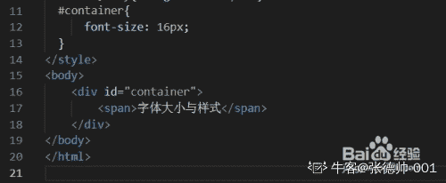 

编辑于 2020-09-03 16:24:00

* * *

## 3

在 HTML 中，标记

```cpp
的作用是？

    正确答案:
                                                 B
                                                         你的答案:

                  空
                             (错误)

```
标题标记
```cpp

```
预排版标记
```cpp

```
转行标记
```cpp

```
文字效果标记
```cpp

本题知识点

                                                            PHP 工程师 
                                                欢聚集团 
                                                2017 
                                                HTML 

讨论

[圈～](https://www.nowcoder.com/profile/5121786)

                                                                    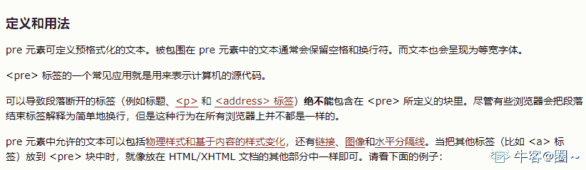

发表于 2020-08-21 23:15:48

* * *

[宇宙机吴彦祖](https://www.nowcoder.com/profile/7269298)

```
HTML 

```cpp
 元素表示预定义格式文本。在该元素中的文本通常按照原文件中的编排，以等宽字体的形式展现出来，文本中的空白符（比如空格和换行符）都会显示出来。(紧跟在 

```
 开始标签后的换行符也会被省略)

```cpp

```

```cpp

发表于 2022-01-15 23:31:18

* * *

[你快乐吗](https://www.nowcoder.com/profile/5271388)

                                                                    pre 标签就是用来转义的，所以选 B--预排版标记。

发表于 2020-11-10 10:28:03

* * *

## 4

        js 语句“var x=0; while(____) x+=2;”，要使 while 循环体执行 10 次，空白处的循环判定式应写为？

正确答案:
                                                                  C
                                        你的答案:

                  空
                             (错误)

```
x<10
```cpp

```
x<=10
```cpp

```
x<20
```cpp

```
x<=20
```cpp

本题知识点

                                                            PHP 工程师 
                                                欢聚集团 
                                                2017 
                                                PHP 工程师 
                                                欢聚集团 
                                                2017 

## 5

          分析下面的 Javascript 代码段，输出结果是？  

```
var a=parseInt("2017 年欢聚时代校园招聘");
alert(a);
```cpp

正确答案:
                                                                  C
                                        你的答案:

                  空
                             (错误)

```
NaN
```cpp

```
2017 年欢聚时代校园招聘
```cpp

```
2017
```cpp

```
出现脚本错误
```cpp

本题知识点

                                                            PHP 工程师 
                                                欢聚集团 
                                                2017 

讨论

[空空以空空](https://www.nowcoder.com/profile/479441)

                                                                      parseInt()方法，只有字符串的第一个数字会被返回，如果字符串的第一个字符不是数字，那么就会返回 NaNa    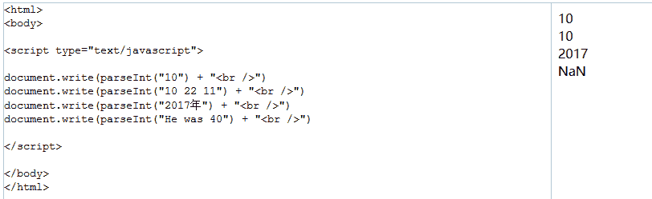

发表于 2017-09-03 17:05:20

* * *

## 6

        以下 js 中哪个能每隔 1.5 秒就调用 foo 函数一次

正确答案:
                                A
                                                                          你的答案:

                  空
                             (错误)

```
setInterval(foo(),1500);
```cpp

```
setTimeout(1500,foo());
```cpp

```
setTimeout(“foo”,1500);
```cpp

```
windows.time(1500,foo);
```cpp

本题知识点

                                                            PHP 工程师 
                                                欢聚集团 
                                                2017 

讨论

[布拉德·皮蛋](https://www.nowcoder.com/profile/1450806)

                                                                    setTimeout（）是一次性的！

发表于 2017-08-30 22:31:18

* * *

[GSBen](https://www.nowcoder.com/profile/1749890)

                                                                    A 选项不应该加上引号？

编辑于 2017-10-10 08:58:14

* * *

[空空以空空](https://www.nowcoder.com/profile/479441)

                                                                    A.setInterval() 方法可按照指定的周期（以毫秒计）来调用函数或计算表达式。 

  setInterval() 方***不停地调用函数，直到 clearInterval() 被调用或窗口被关闭。由 setInterval() 返回的 ID 值可用作 clearInterval() 方法的参数。 

  语法 

```
setInterval(code,millisec[,"lang"])

```cpp

 B.setTimeout() 方法用于在指定的毫秒数后调用函数或计算表达式。 **setTimeout() 只执行 code 一次。如果要多次调用，请使用 setInterval() 或者让 code 自身再次调用 setTimeout()** 

  语法 

```
setTimeout(code,millisec)
```cpp

                |
                |

                |
                |

                |
                |

发表于 2017-09-03 17:10:52

* * *

## 7

        下面哪个选项不是 mysql 中 innodb 引擎的特点？

正确答案:
                                                                  C
                                        你的答案:

                  空
                             (错误)

```
支持事务
```cpp

```
支持行锁
```cpp

```
支持全文索引
```cpp

```
支持外键
```cpp

本题知识点

                                                            PHP 工程师 
                                                欢聚集团 
                                                2017 

讨论

[空空以空空](https://www.nowcoder.com/profile/479441)

                                                                      这个还真是 要好好注意一下，以前从来都不懂，mysql 有多种存储引擎，比如 innoDB,myISAM，memory,merge,创建表时可以用 engine 来指定所要用的存储引擎。 
   innodb:支持事务处理；提供了行锁，提供与 [Oracle](https://www.2cto.com/database/Oracle/) 类型一致的不加锁读取。提供外键约束；InnoDB 不支持 FULLTEXT 类型的索引（即全文索引） 
   myISAM:非事务安全的；MyISAM 是 MySQL 缺省存贮引擎；表格可以被压缩；支持全文搜索.；不支持外键；如果执行大量的 SELECT，MyISAM 是更好的选择。 
   读取操作在效率上要优于 InnoDB.小型应用使用 MyISAM 是不错的选择.并发性弱于 InnoDB 

发表于 2017-09-03 17:30:32

* * *

[风水流架构师](https://www.nowcoder.com/profile/8811373)

                                                                    B

发表于 2017-08-31 10:03:40

* * *

## 8

        $a = array()，$b = array($a) 请问 isset($a) 和 empty($b)的结果是？

正确答案:
                                A
                                                                          你的答案:

                  空
                             (错误)

```
true,false
```cpp

```
true,true
```cpp

```
false,true
```cpp

```
false,false
```cpp

本题知识点

                                                            PHP 工程师 
                                                欢聚集团 
                                                2017 

讨论

[我犹豫了半天](https://www.nowcoder.com/profile/1058940)

                                                                    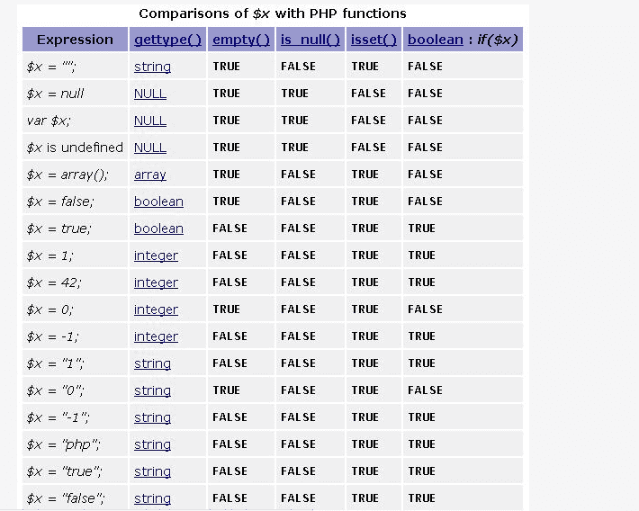

发表于 2017-08-31 11:46:25

* * *

[akubaba](https://www.nowcoder.com/profile/1907844)

  **isset()****函数****一般用来检测变量是否设置** 

  返回值：   若变量**不存在**则返回 FALSE  若变量**存在**且其值为 NULL，也返回 FALSE  若变量**存在且值不为****NULL**，则返回 TURE  同时检查多个变量时，每个单项都符合上一条要求时才返回 TRUE，否则结果为 FALSE 

  **empty()****函数****判断值为否为空**  

  返回值：   若变量不存在则返回 TRUE   

   若变量**存在且其值为****""****、****0****、****"0"****、****NULL****、、****FALSE****、****array()****、****var $var;** **以及没有任何属性的对象，则返回** **TURE**  
     若变量**存在且值不为****""****、****0****、****"0"****、****NULL****、、****FALSE****、****array()****、****var $var;** **以及没有任何属性的对象，则返回** **FALSE**  

发表于 2017-09-15 14:51:56

* * *

[空空以空空](https://www.nowcoder.com/profile/479441)

```
 $a = array();
    $b = array($a);
    var_dump($b);
    echo "<br/>";
    echo "a isset ?  ";
    echo isset($a)?"yes":"no";
    echo "<br/> b is empty ? ";
    echo empty($b)?"yes":"no";
```cpp

   我们可以来看看 b 的打印结果 
   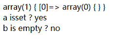 
   所以$b 不为 0，它的第一个元素是$a 数组，既然$a 已经是 set 的了，那么$b 就不会为空 

发表于 2017-09-03 20:41:53

* * *

## 9

        $a['12345']=1;      $a[12345]=null;     执行以上两行代码后，isset($a[12345])和 empty($a['12345'])的结果分别是 ______

正确答案:
                                                                                   D
                       你的答案:

                  空
                             (错误)

```
false false
```cpp

```
true true
```cpp

```
true false
```cpp

```
false true
```cpp

本题知识点

                                                            PHP 工程师 
                                                欢聚集团 
                                                2017 

讨论

[空空以空空](https://www.nowcoder.com/profile/479441)

                                                                      首先 php 中$a['12345'] 和 $a[12345] 是一样的  
   再次，$变量=null 的方法是可以释放其内存的。  

*   isset()方法用于检测变量是否设置，**并且不是 NULL.** **如果使用 isset()测试一个被设置成 NULL 的变量，将返回 FALSE.**       

*   **而 empty()：**当变量存在时，并且非空非 0，就会返回 false;不存在，也不会产生警告，会返回 false      

 下列情况将返回 true 

```
数字 0； 
空字符串： ""  ； 
空字符： ''   ； 
作为浮点数的 0：  0.0 ； 
作为 0 的字符串： "0" ；
FALSE ；
NULL ； 
空数组：array()； 
声明了但是没有赋值的变量 ： $var
```cpp

   我们来做个验证 

```
  /*****注意区分 a 和 b*****/  
    $a = null;
    $b = "";//同时要注意的是一个 NULL 字节（"\0"）并不等同于 PHP 的 NULL 常数
    var_dump($a);//NULL
    echo "<br/>";
    var_dump($b);//string(0) ""
    echo "<br/> a isset? ";
    echo isset($a);
    echo "<br/> b isset? ";
    echo isset($b);//1

```cpp

   结果： 

   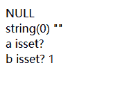

编辑于 2017-09-03 21:20:08

* * *

[訫誂](https://www.nowcoder.com/profile/5105248)

                                                                    其实$a['12345'] 与 $a[12345] 是一样的，相当于 2 次定义，运行完后，最终$['12345'] 或 $[12345] 是 null（要知道$['12345'] 与 $[12345] 是等同的）

发表于 2017-09-01 19:01:32

* * *

[我犹豫了半天](https://www.nowcoder.com/profile/1058940)

                                                                       
   我怎么觉得选 A 啊 

发表于 2017-08-31 11:49:24

* * *

## 10

        $foo = 5 + '10  duowan.com';表达式的$foo 正确的值是.

正确答案:
                                A
                                                                          你的答案:

                  空
                             (错误)

```
15
```cpp

```
15 duowan.com
```cpp

```
510 duowan.com
```cpp

```
报错
```cpp

本题知识点

                                                            PHP 工程师 
                                                欢聚集团 
                                                2017 

讨论

[空空以空空](https://www.nowcoder.com/profile/479441)

                                                                      这个可以理解为字符串转换为数值 
   我们参考以下代码 

```
<?php
   $a = "sss"+"aaa";
   echo $a;// 0 
   $b = 5+"hello"; 
   echo "<br/>".$b; //5
   echo "<br/>\$a==$a; type is " . gettype ($a) . "<br />\n";

```cpp

   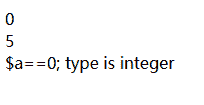

   由$a = 0;我们可知即使不是字符串和数值相加，字符串和字符串相加得到的结果最后还是数值 0，而不是我们想象中的 sssaaa 
   我想这大概是和 php 的变量类型是自动的有关吧，因为 php 中运算符，" + "是算数运算符，字符串运算符是” . "  和 “ .=  "   ;应该是把字符串当作一个数值来取值了。[PHP](https://www.baidu.com/s?wd=PHP&tn=44039180_cpr&fenlei=mv6quAkxTZn0IZRqIHckPjm4nH00T1YdnAc1PWu-nWf1mynLnynL0ZwV5Hcvrjm3rH6sPfKWUMw85HfYnjn4nH6sgvPsT6KdThsqpZwYTjCEQLGCpyw9Uz4Bmy-bIi4WUvYETgN-TLwGUv3EPHRzrjT3njcz)在运算时自动根据参**加运算的量和运算符转换为一致类型** 
   字符串转化为数值： 
      **该字符串的开始部分决定了它的值**。如果该字符串以合法的数值开始，则使用该数值。**否则其值为 0（零）**。合法数值由可选的正负号，后面跟着一个或多个数字（可能有小数点），再跟着可选的指数部分。指数部分由 'e' 或 'E' 后面跟着一个或多个数字构成。  

发表于 2017-09-03 21:53:01

* * *

[爱上的地方](https://www.nowcoder.com/profile/6715510)

                                                                    在 php7 及以上，会有 Notice 警告，不知道这算不算报错

发表于 2019-07-05 11:09:01

* * *

## 11

        $a 的值是 _________

正确答案:
                                                                                   D
                       你的答案:

                  空
                             (错误)

```
true
```cpp

```
1
```cpp

```
false
```cpp

```
null
```cpp

本题知识点

                                                            PHP 工程师 
                                                欢聚集团 
                                                2017 

讨论

[我犹豫了半天](https://www.nowcoder.com/profile/1058940)

                                                                    对于未定义的变量就是 false

发表于 2017-08-31 11:50:21

* * *

[山 418](https://www.nowcoder.com/profile/7552848)

                                                                      这题我在打印未定义的变量是： 
      error_reporting(0);  
     var_dump($a);  
     var_dump(false);  

   结果： 
      NULL  
     bool(false)  

发表于 2017-09-05 21:31:57

* * *

## 12

        array('a')+array('b') 的结果是 ____________?

正确答案:
                                                                  C
                                        你的答案:

                  空
                             (错误)

```
array('a','b')
```cpp

```
array('b','a')
```cpp

```
array('a')
```cpp

```
array('b')
```cpp

本题知识点

                                                            PHP 工程师 
                                                欢聚集团 
                                                2017 

讨论

[么得感情的 Robot](https://www.nowcoder.com/profile/9582890)

                                                                    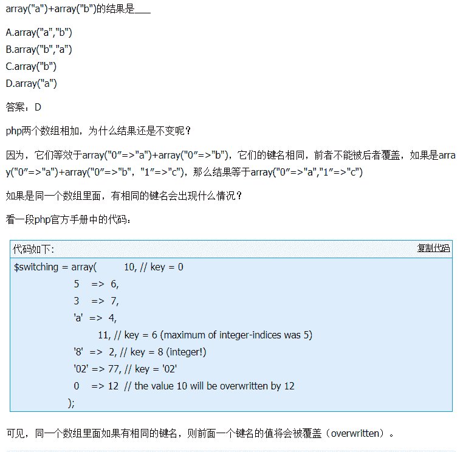

发表于 2017-10-07 22:02:50

* * *

[空空以空空](https://www.nowcoder.com/profile/479441)

                                                                      黑人问号脸。。。。 

```
    $a  = array('a');
    $b  = array('b');
    $c  = $a+$b;
    $d  = array('a')+array('b');
    echo "<pre>";
      echo "\$a is: ";
      var_dump($a);
      echo "\$b is: ";
      var_dump($b);
      echo "\$c is: ";
      var_dump($c);
      echo "\$d is: ";
      var_dump($d);
    echo "</pre>"
```cpp

 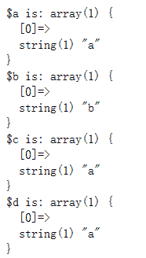

发表于 2017-09-03 22:04:02

* * *

[我可以摸一下你的校徽吗](https://www.nowcoder.com/profile/2863410)

                                                                    运行出来都是 C 的答案啊

发表于 2017-09-01 13:23:12

* * *

## 13

        Class demo{Const C = "const";},以下调用 demo 类中的常量 C 正确的是:

正确答案:
                                                                  C
                                        你的答案:

                  空
                             (错误)

```
$Cls = new demo();$Cls->C;
```cpp

```
Demo::$C;
```cpp

```
Demo::C;
```cpp

```
Demo->$C;
```cpp

本题知识点

                                                            PHP 工程师 
                                                欢聚集团 
                                                2017 
                                                PHP 

讨论

[oceanLiang](https://www.nowcoder.com/profile/2852142)

```
类中的常量使用 const 定义后，其访问方式和静态成员类似，都是通过类名或在成员方法中使用 self 访问,但在 PHP 5.3.0 之后也可以使用对象来访问。被 const 定义的常量不能重新赋值，如果在程序中试图改变它的值将会出现错误。
```cpp

1.  <?php      

2.  class MyClass {      

3.  const CONSTANT = 'CONSTANT value' ; //使用 const 声明一个常量，并直接赋上初使值       

4.  function showConstant() {      

5.  echo self ::CONSTANT ."<br>" ;//使用 self 访问常量，注意常量前不要加“$”       

6.  }      

7.  }      

8.  echo MyClass:: CONSTANT . "<br>" ; //在类外部使用类名称访问常量，也不要加”$”       

9.  $class = new MyClass();      

10.  $class->showConstant();      

11.  echo  $class ::CONSTANT; // PHP 5.3.0 之后       

12.  ?>     

编辑于 2017-09-05 11:47:47

* * *

[人海追风](https://www.nowcoder.com/profile/896834337)

                                                                    MMp,What a *** question!

发表于 2020-11-24 10:24:39

* * *

[空空以空空](https://www.nowcoder.com/profile/479441)

                                                                      可以把在类中始终保持不变的值定义为常量。在定义和使用常量的时候不需要使用 $ 符号。 
   自 PHP 5.3.0 起，可以用一个变量来动态调用类。但该变量的值不能为关键字（如 *self*，*parent* 或 *static*）。 

```
<?php
    class demo{
    const constant = 'const';
    /*****成员方法*****/
    function showConstant() {
        echo  self::constant . "\n";
    }
}
/********通过类名访问*******/
echo demo::constant . "\n";   
$classname = "MyClass";
echo $classname::constant . "\n"; // 自 5.3.0 起

/********通过成员方法中使用 self 访问*******/
$class = new demo();
$class->showConstant();
echo $class::constant."\n"; // 自 PHP 5.3.0 起
?>

```cpp

 这是我所理解的，但是用对象访问是如何访问的呢？new 一个对象，然后通过成员方法中使用 self 方法访问？

发表于 2017-09-03 22:20:48

* * *

## 14

        echo count(strlen("test")) 的输出为 ____

正确答案:
                                                                  C
                                        你的答案:

                  空
                             (错误)

```
Null
```cpp

```
4
```cpp

```
1
```cpp

```
0
```cpp

本题知识点

                                                            PHP 工程师 
                                                欢聚集团 
                                                2017 

讨论

[空空以空空](https://www.nowcoder.com/profile/479441)

                                                                      php 中 count()函数只负责统计数组的长度或者是对象中的属性个数 
   如果不是数组类型或者没有实现 Countable 接口的对象，将返回 1。  
   有个例外：如果 array_or_countable 是 NULL 则结果是 0。（即空的数组或者对象属性为空） 
   另外：**count() 对没有初始化的变量返回 0，但对于空的数组也会返回 0。 用 isset() 来测试变量是否已经初始化**。 

编辑于 2017-09-03 22:25:00

* * *

## 15

        PHP 的官网是？

正确答案:
                                                 B
                                                         你的答案:

                  空
                             (错误)

```
php.com
```cpp

```
php.net
```cpp

```
php.org
```cpp

```
php.cn
```cpp

本题知识点

                                                            PHP 工程师 
                                                欢聚集团 
                                                2017 

讨论

[小小客牛](https://www.nowcoder.com/profile/587523146)

                                                                    B

发表于 2021-03-18 16:23:32

* * *

[风一样的男子 20190929180076](https://www.nowcoder.com/profile/736215556)

                                                                    我去...这 TM 也能考

发表于 2019-09-29 18:24:16

* * *

[B.Duck](https://www.nowcoder.com/profile/9886236)

                                                                      噗 幸好常常看手册 
   [`php.net/manual/zh/index.php`](http://php.net/manual/zh/index.php)

发表于 2017-09-23 16:49:04

* * *

## 16

        PHP 中怎样获取用户上传图片的真实文件类型？____

正确答案:
                                                                                   D
                       你的答案:

                  空
                             (错误)

```
getimagesize()
```cpp

```
imagetype()
```cpp

```
$FILES['type']
```cpp

```
exif_imagetype()
```cpp

本题知识点

                                                            PHP 工程师 
                                                欢聚集团 
                                                2017 

讨论

[空空以空空](https://www.nowcoder.com/profile/479441)

                                                                      该函数  判断一个图像的类型  
   读取一个图像的第一个字节并检查其签名，如果发现了恰当的签名则返回一个对应的常量，否则返回 FALSE。返回值和 [getimagesize()](http://php.net/manual/zh/function.getimagesize.php) 返回的数组中的索引 2 的值是一样的，但 exif_imagetype 函数快得多。 

   A.getimagesize() 函数用于获取图像大小及相关信息，成功返回一个数组，失败则返回 FALSE 并产生一条 E_WARNING 级的错误信息。 
   好像没有 B 和 C 这两个函数 
   应该是 exif_imagetype()和$_FILES[‘uploadfile’][‘type’]
 如果是 php 上传文件，则可以用$_FILES[‘uploadfile’][‘type’]来获取文件类型，该方法仅仅只能根据文件后缀来判断文件类型。 

编辑于 2017-09-04 16:37:58

* * *

[么得感情的 Robot](https://www.nowcoder.com/profile/9582890)

                                                                      exif_imagetype — 判断一个图像的类型 

发表于 2017-10-07 22:10:07

* * *

## 17

        preg_replace()与 ereg_replace()，rand()与 mt_rand()这两组功能一样的函数，哪两个性能更优？

正确答案:
                                                 B
                                                         你的答案:

                  空
                             (错误)

```
preg_replace() ,rand()
```cpp

```
preg_replace(), mt_rand()
```cpp

```
ereg_replace() ,rand()
```cpp

```
ereg_replace(), mt_rand()
```cpp

本题知识点

                                                            PHP 工程师 
                                                欢聚集团 
                                                2017 

讨论

[空空以空空](https://www.nowcoder.com/profile/479441)

                                                                      mt_rand() 比 rand() 快四倍,很多老的 libc 的随机数发生器具有一些不确定和未知的特性而且很慢。PHP 的 rand() 函数默认使用 libc 随机数发生器。mt_rand() 函数是非正式用来替换它的。  

   preg_replace()是 Perl 内置的一种文字匹配模式，不过用起来一些参数会比 ereg_relace()复杂一些.  
   用 preg_replace()的函数普遍在 0.08-0.12 秒之间，用 ereg_replace()的函数却去到 0.35-0.38 秒之间  
   参考：[`zzhi191.blog.163.com/blog/static/1350849520127133570656/`](http://zzhi191.blog.163.com/blog/static/1350849520127133570656/)  

发表于 2017-09-03 22:47:46

* * *

## 18

        比较两个字符串是否相同，最佳方式是？

正确答案:
                                                 B
                                                         你的答案:

                  空
                             (错误)

```
使用==
```cpp

```
使用 strcmp()
```cpp

```
使用 strcasecmp()
```cpp

```
使用 strpos()
```cpp

本题知识点

                                                            PHP 工程师 
                                                欢聚集团 
                                                2017 

讨论

[赵贵明](https://www.nowcoder.com/profile/3273008)

                                                                    ==是比较地址，strcmp()是比较每个字符

发表于 2017-09-02 17:45:36

* * *

[此时丶彼时](https://www.nowcoder.com/profile/8004193)

                                                                      在 PHP 中，使用==比较两个字符串是否相等一般情况下是可以的，但当你的字符串看起来像是一个数字的时候，那么它就会认为这是一个数字，比如下面的代码输出结果都是 bool(true):  

```
var_dump("010" == "1e1");
var_dump("873E-536" == "251E-490");//数字太小，两边都为 float(0)
```cpp

   所以要比较两个字符串是否相等最好使用===而不是==  
   strcmp()也可以比较两个字符串是否相等，但效率比===慢一些

编辑于 2018-07-28 00:37:22

* * *

[空空以空空](https://www.nowcoder.com/profile/479441)

                                                                      strcmp()：比较字符串内容是否相等 
   strcasecmp():忽略大小写，比较字符串是否相等 
   strpos():查找某个字符串在另外一个字符串中首次出现的位置 

发表于 2017-09-03 22:51:13

* * *

## 19

        变量 $str 为字符串 'abc' ， $str['key'] 的值是 ______

正确答案:
                                                                  C
                                        你的答案:

                  空
                             (错误)

```
没有值
```cpp

```
null
```cpp

```
'a'
```cpp

```
''
```cpp

本题知识点

                                                            PHP 工程师 
                                                欢聚集团 
                                                2017 

讨论

[啊咿呀嘿](https://www.nowcoder.com/profile/9778602)

这是个字符串，字符串虽然也可以用键值对表示，但是键都是数字类型，因为 key 也是字符串，会被强制转换为数字

```
php > echo (int)'key';
0 
```cpp

因此输出的就是$str[0],就是'a',答案选 c

发表于 2017-09-09 14:46:09

* * *

[空空以空空](https://www.nowcoder.com/profile/479441)

                                                                      还不如自己敲代码来验证一下吧 
   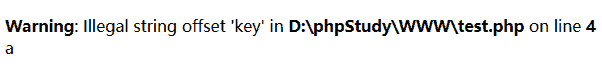

   结果会有一个警告，但是还是输出了 a 
   但是为什么，我也不知道。。。目前查不到相关的说法 

发表于 2017-09-03 23:03:05

* * *

[我可以摸一下你的校徽吗](https://www.nowcoder.com/profile/2863410)

                                                                    难道不是报错 Undefined variable: key 吗

发表于 2017-09-01 13:25:39

* * *

## 20

        假如现在是 2010 年 3 月 25 日 9 点 25 分 01 秒，要使用 date()生成“2010325-92501”格式的时间，应该选择以下哪种参数 ______

正确答案:
                                                                  C
                                        你的答案:

                  空
                             (错误)

```
date('Ymd-Gis')
```cpp

```
date('Ymd-His')
```cpp

```
date('Ynd-Gis')
```cpp

```
date('Ynd-His')
```cpp

本题知识点

                                                            PHP 工程师 
                                                欢聚集团 
                                                2017 

讨论

[我犹豫了半天](https://www.nowcoder.com/profile/1058940)

```
以下是详细的参数：

format 字符 	说明 	返回值例子
日 	--- 	---
d 	月份中的第几天，有前导零的 2 位数字 	01 到 31
D 	星期中的第几天，文本表示，3 个字母 	Mon 到 Sun
j 	月份中的第几天，没有前导零 	1 到 31
l（“L”的小写字母） 	星期几，完整的文本格式 	Sunday 到 Saturday
N 	ISO-8601 格式数字表示的星期中的第几天（PHP 5.1.0 新加） 	1（表示星期一）到 7（表示星期天）
S 	每月天数后面的英文后缀，2 个字符 	st，nd，rd 或者 th。可以和 j 一起用
w 	星期中的第几天，数字表示 	0（表示星期天）到 6（表示星期六）
z 	年份中的第几天 	0 到 366
星期 	--- 	---
W 	ISO-8601 格式年份中的第几周，每周从星期一开始（PHP 4.1.0 新加的） 	例如：42（当年的第 42 周）
月 	--- 	---
F 	月份，完整的文本格式，例如 January 或者 March 	January 到 December
m 	数字表示的月份，有前导零 	01 到 12
M 	三个字母缩写表示的月份 	Jan 到 Dec
n 	数字表示的月份，没有前导零 	1 到 12
t 	给定月份所应有的天数 	28 到 31
年 	--- 	---
L 	是否为闰年 	如果是闰年为 1，否则为 0
o 	ISO-8601 格式年份数字。这和 Y 的值相同，只除了如果 ISO 的星期数（W）属于前一年或下一年，则用那一年。（PHP 5.1.0 新加） 	Examples: 1999 or 2003
Y 	4 位数字完整表示的年份 	例如：1999 或 2003
y 	2 位数字表示的年份 	例如：99 或 03
时间 	--- 	---
a 	小写的上午和下午值 	am 或 pm
A 	大写的上午和下午值 	AM 或 PM
B 	Swatch Internet 标准时 	000 到 999
g 	小时，12 小时格式，没有前导零 	1 到 12
G 	小时，24 小时格式，没有前导零 	0 到 23
h 	小时，12 小时格式，有前导零 	01 到 12
H 	小时，24 小时格式，有前导零 	00 到 23
i 	有前导零的分钟数 	00 到 59>
s 	秒数，有前导零 	00 到 59>
时区 	--- 	---
e 	时区标识（PHP 5.1.0 新加） 	例如：UTC，GMT，Atlantic/Azores
I 	是否为夏令时 	如果是夏令时为 1，否则为 0
O 	与格林威治时间相差的小时数 	例如：+0200
P 	与格林威治时间（GMT）的差别，小时和分钟之间有冒号分隔（PHP 5.1.3 新加） 	例如：+02:00
T 	本机所在的时区 	例如：EST，MDT（【译者注】在 Windows 下为完整文本格式，例如“Eastern Standard Time”，中文版会显示“中国标准时间”）。
Z 	时差偏移量的秒数。UTC 西边的时区偏移量总是负的，UTC 东边的时区偏移量总是正的。 	-43200 到 43200
完整的日期／时间 	--- 	---
c 	ISO 8601 格式的日期（PHP 5 新加） 	2004-02-12T15:19:21+00:00
r 	RFC 822 格式的日期 	例如：Thu, 21 Dec 2000 16:01:07 +0200
U 	从 Unix ***（January 1 1970 00:00:00 GMT）开始至今的秒数 	参见 time()
```cpp

发表于 2017-08-31 12:16:15

* * *

[空空以空空](https://www.nowcoder.com/profile/479441)

                                                                    好吧，原来 n 是没有前导 0，我倒还真没注意这个

发表于 2017-09-03 14:07:25

* * *

## 21

        将一个或多个单元压入数组末尾的函数是哪个？

正确答案:
                                                                                   D
                       你的答案:

                  空
                             (错误)

```
array_pop
```cpp

```
array_shift
```cpp

```
array_unshift
```cpp

```
array_push
```cpp

本题知识点

                                                            PHP 工程师 
                                                欢聚集团 
                                                2017 

讨论

[boomclap](https://www.nowcoder.com/profile/3790430)

                                                                    array_push:将一个或多个单元压入数组的末尾(入栈); array_pop:将数组最后一个单元弹出(出栈)； array_shift:将数组开头的单元移出数组； array_unshift:在数组开头插入一个或多个单元

发表于 2017-10-05 10:15:27

* * *

## 22

        哪个函数可以控制 PHP 的错误信息是否输出到页面上？

正确答案:
                                A
                                                                          你的答案:

                  空
                             (错误)

```
error_reporting()
```cpp

```
error_log()
```cpp

```
error_trigger()
```cpp

```
error_echo()
```cpp

本题知识点

                                                            PHP 工程师 
                                                欢聚集团 
                                                2017 

讨论

[空空以空空](https://www.nowcoder.com/profile/479441)

                                                                      B. error_log() — 发送错误信息到某个地方  
   C.写错了，只有 trigger_error()— 产生一个用户级别的 error/warning/notice 信息  
   D.没有这个函数

发表于 2017-09-04 16:46:52

* * *

[mark_php](https://www.nowcoder.com/profile/38262677)

                                                                      A 
   error_reporting(-1)相当于 error_reporting(E_ALL) 打印所有类型的错。error_reporting(0)不打印报错 
   error_log() 处理错误日志 
   trigger_error() 创建用户级别报错 

发表于 2021-04-13 17:05:37

* * *

## 23

          请问以下代码的输出是什么? 

```
 <?php    echo 'Testing ' . 1 + 2 . '45';    ?>
```cpp

正确答案:
                                A
                                                                          你的答案:

                  空
                             (错误)

```
245
```cpp

```
Testing 1245
```cpp

```
Testing 345
```cpp

```
Testing 1+245
```cpp

本题知识点

                                                            PHP 工程师 
                                                欢聚集团 
                                                2017 

讨论

[３６０１](https://www.nowcoder.com/profile/3359469)

                                                                    这里相当于'Testing1'+'245'，前面部分相当于 0，0+'245'，结果就是 A

发表于 2017-08-30 20:25:11

* * *

[mark_php](https://www.nowcoder.com/profile/38262677)

                                                                      A 
   1，. + 运算符的优先级一样 从左往右匹配 
   2，字符串转 int 类型 如果该字符串以合法的数值开始，则使用该数值。否则其值为 0（零） 

发表于 2021-04-13 17:57:20

* * *

[傅芋頭](https://www.nowcoder.com/profile/8008084)

                                                                      1.算数运算符(除了幂运算)和字符串运算符优先级一致 
   2.字符串转化为数值：
     该字符串的开始部分决定了它的值。如果该字符串以合法的数值开始，则使用该数值。否则其值为 0（零）。合法数值由可选的正负号，后面跟着一个或多个数字（可能有小数点），再跟着可选的指数部分。指数部分由 'e' 或 'E' 后面跟着一个或多个数字构成。

   所以: 
   'Testing ' . 1  =>  'Testing 1';
 'Testing 1' + 2 => 2;
 2 + '45' => 245;

发表于 2019-06-03 16:19:10

* * *

## 24

        请问做如下 html 输出时需要对$link 变量和$html 变量做什么样的转义比较合适？    '' . $html .'
 '

正确答案:
                                                 B
                                                         你的答案:

                  空
                             (错误)

```
htmlentities($link); htmlentities($html);
```cpp

```
htmlentities(urlencode($link)); htmlentities($html);
```cpp

```
htmlentities($link); htmlentities(urlencode($html));
```cpp

```
urlencode(htmlentities($link)); htmlentities($html);
```cpp

本题知识点

                                                            PHP 工程师 
                                                欢聚集团 
                                                2017 

## 25

        请选出$test = 0; $test < 1 || $test = 1;这段代码$test 的值

正确答案:
                                A
                                                                          你的答案:

                  空
                             (错误)

```
0
```cpp

```
1
```cpp

```
null
```cpp

```
无法运行.
```cpp

本题知识点

                                                            PHP 工程师 
                                                欢聚集团 
                                                2017 

讨论

[空空以空空](https://www.nowcoder.com/profile/479441)

```
<?php
   !$var && $var=1;
   $error or die("error");
?>

```cpp

 A && B, 只有当 A 和 B 都为真的时候,这句才是真
 PHP 会先判断 A 是否为真, 若 A 为真的话 就会继续判断 B.
 所以,**当 A 为真, B 是一个语句的时候,  B 就会运行.**
   同理,当 A 为假的时候, 这句一定是假, 就没有必要往后判断了, 此时, B 就不会运行. 
   || or 则不同
 A or B, 只要 A 或者 B 中有一个是真, 这句就是真
 PHP 先判断 A 是否为真, 若 A 为真的话,  此句一定是真, 没有必要再去判断 B
 所以当 A 为假的时候, PHP 会继续判断 B 是不是真, 此时, B 如果是一个语句就会运行. 

发表于 2017-09-04 17:19:00

* * *

## 26

        foo 对象有 att 属性，那么获取 att 属性的值，以下哪些做法是可以的：（javascript）

正确答案:
                                A
                                                                               D
                                             E
                       你的答案:

                  空
                             (错误)

```
foo["att"]
```cpp

```
foo("att")
```cpp

```
foo{"att"}
```cpp

```
foo.att
```cpp

```
foo[["a","t","t"].join("")]
```cpp

本题知识点

                                                            PHP 工程师 
                                                欢聚集团 
                                                2017 

讨论

[HelloWord。](https://www.nowcoder.com/profile/5908104)

                                                                    javascrit 获取对象属性的方法有两种：分别是采用'.'和[]。所以 ADE 都正确

发表于 2017-10-10 16:38:26

* * *

[GSBen](https://www.nowcoder.com/profile/1749890)

                                                                    e 答案和 a 答案是一样的，只不过 e 答案是将字符串打伞再组合

发表于 2017-10-10 09:47:31

* * *

## 27

        下面 _______ 属于函数，非语言结构

正确答案:
                                A
                                             B
                                                                                                                 G
                       你的答案:

                  空
                             (错误)

```
is_set
```cpp

```
is_null
```cpp

```
print_r
```cpp

```
print
```cpp

```
echo
```cpp

```
list
```cpp

```
Empty
```cpp

本题知识点

                                                            PHP 工程师 
                                                欢聚集团 
                                                2017 

讨论

[空空以空空](https://www.nowcoder.com/profile/479441)

                                                                      答案好像不对吧，如果用 function_exits()测试，print_r,结果是 true 啊。

   1.什么是语言结构 
 语言结构：就是[PHP](http://lib.csdn.net/base/php)语言的关键词，语言语法的一部分；它不可以被用户定义或者添加到语言扩展或者库中；它可以有也可以没有变量和返回值。 
 2.语言结构执行速度快的原因 
 函数都要先被[php](http://lib.csdn.net/base/php)解析器（Zend 引擎）分解成语言结构，所以，函数比语言结构多了一层解析器解析，速度就相对慢了 
   3.php 中语言结构有哪些 

```
echo();
print() ;
die() ;
isset() ;
unset();
include(); //博客上说 include_once()是函数，我用 function_exits()测试，结果为 false
require();
array() ;
list() ;
empty() ;
```cpp

 4.语言结构与函数的区别 

*   语言结构比对应功能的函数快      

*   语言结构在错误处理上比较鲁棒，由于是语言关键词，所以不具备再处理的环节      

*   语言结构不能在配置项(php.ini)中禁用，函数则可以。      

*   语言结构不能被用做回调函数     

     参考：[`blog.csdn.net/hsd2012/article/details/51103646`](http://blog.csdn.net/hsd2012/article/details/51103646)  
     (个人觉得这篇文章不太对，判断是语言结构还是函数，用 function_exist(),我觉得不太恰当吧。那对于一个不存在的函用这个方法呢，那也不能证明他就是语言结构吧，百度上都是这篇文章。。。。

编辑于 2017-09-04 18:04:02

* * *

[么得感情的 Robot](https://www.nowcoder.com/profile/9582890)

  4、  语言结构列表 

  echo() 

  print() 

  die() 

  isset() 

  unset() 

  include()，注意，include_once()是函数 

  require()，注意，require_once()是函数 

  array() 

  list() 

   empty() 
   -------------------------------------------------- 
   print_r 是函数 

编辑于 2017-10-10 13:31:30

* * *

## 28

        以下表达式哪些为真？（javascript）

正确答案:
                                                                  C
                                                              E
                                                              G
                       你的答案:

                  空
                             (错误)

```
NaN == NaN
```cpp

```
null instanceof Object
```cpp

```
null == undefined
```cpp

```
null === undefined
```cpp

```
false == 0
```cpp

```
100 === 100
```cpp

```
function(){} instanceof Object
```cpp

本题知识点

                                                            PHP 工程师 
                                                欢聚集团 
                                                2017 

讨论

[么得感情的 Robot](https://www.nowcoder.com/profile/9582890)

                                                                      答案好像不对? 
    100 === 100  return true 

   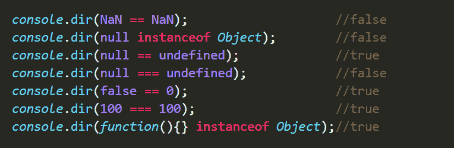 

发表于 2017-10-08 09:22:49

* * *

[先锋五](https://www.nowcoder.com/profile/497970808)

                                                                    100 === 100 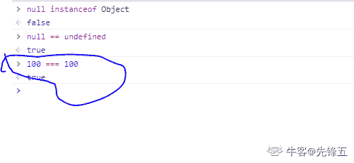

发表于 2020-05-20 12:17:00

* * *

## 29

        下面哪些选项不能作为类的成员函数名

正确答案:
                                                 B
                                             C
                                             D
                       你的答案:

                  空
                             (错误)

```
_abc
```cpp

```
123abc
```cpp

```
empty
```cpp

```
list
```cpp

本题知识点

                                                            PHP 工程师 
                                                欢聚集团 
                                                2017 

## 30

        假设$n=0，以下的哪些表达式是返回 true 的？

正确答案:
                                                                                   D
                       你的答案:

                  空
                             (错误)

```
(null != $n) ? true : false;
```cpp

```
('' == $n) ? false : true;
```cpp

```
0 == $n && $n !== 0;
```cpp

```
$n = 5 || $n == 0;
```cpp

本题知识点

                                                            PHP 工程师 
                                                欢聚集团 
                                                2017 

讨论

[求份 offer](https://www.nowcoder.com/profile/1816045)

                                                                    空字段串 null false 都是以值为 0 存储的

发表于 2017-10-13 05:33:51

* * *

[酥窝](https://www.nowcoder.com/profile/4088502)

                                                                      敲代码验证一下， CD 都返回 true。 

发表于 2018-06-10 15:11:33

* * *

## 31

        写个正则实现判断一个字符串是由数字和字母及减号组成,但减号不能出现在头尾。

你的答案

本题知识点

                                                            PHP 工程师 
                                                欢聚集团 
                                                2017 

讨论

[啊咿呀嘿](https://www.nowcoder.com/profile/9778602)

减号不能出现的头和尾部，参考答案也不对吧

```
preg_match('/^[a-zA-Z0-9][a-zA-Z0-9-]*[a-zA-Z0-9]$/', $str); 
```cpp

发表于 2017-09-09 15:17:12

* * *

[彳亍スコヘル](https://www.nowcoder.com/profile/4629430)

```
^[a-zA-Z0-9][a-zA-Z0-9-]*[a-zA-Z0-9]$
```cpp

编辑于 2018-07-24 16:59:38

* * *

[金鸿](https://www.nowcoder.com/profile/380162626)

```
$pattern = "/^[0-9a-zA-Z][\w]*[a-zA-Z0-9]$/"; 
```cpp

发表于 2019-10-03 12:47:24

* * *

## 32

        请说出 session 和 cookie 的联系和区别

你的答案

本题知识点

                                                            PHP 工程师 
                                                欢聚集团 
                                                2017 

讨论

[空空以空空](https://www.nowcoder.com/profile/479441)

                                                                      cookie 是 session 的一种，客户第一次向服务器发送请求，服务器端会产生一个 sessionId,而通过 cookie 返回给客户端。

   session 保存在服务器端，cookie 保存在客户端，而且当用户关闭了浏览器，cookie 将会被清除。
 从安全性能上看，session 安全性能比较高。 
   从保存内容的类型上看，cookie 只是保存了字符串（即能够自动转换成字符串），而 session 保存了所有数据类型
 从保存内容的大小上看 cookie 保存的内容是有限制的，比较小，而 session 没有限制 
   从性能角度上看，session 对服务器的压力会更大 

发表于 2017-09-03 14:04:33

* * *

[可乐多加点冰](https://www.nowcoder.com/profile/837514496)

                                                                      cookie 是 session 的一种，客户第一次向服务器发送请求，服务器端会产生一个 sessionId,而通过 cookie 返回给客户端。

   session 保存在服务器端，cookie 保存在客户端，而且当用户关闭了浏览器，cookie 将会被清除。
 从安全性能上看，session 安全性能比较高。 
   从保存内容的类型上看，cookie 只是保存了字符串（即能够自动转换成字符串），而 session 保存了所有数据类型
 从保存内容的大小上看 cookie 保存的内容是有限制的，比较小，而 session 没有限制 
   从性能角度上看，session 对服务器的压力会更大 

发表于 2020-07-02 21:26:30

* * *

[么得感情的 Robot](https://www.nowcoder.com/profile/9582890)

                                                                      cookie 保存在客户端,理论上可以长期保存,数据在客户端,相对不安全 
   session 保存在服务器端,(session 的数据保存在服务器端,而 sessionId 保存在客户端),用户浏览器关闭,session 消失,相对安全 

发表于 2017-10-08 10:43:56

* * *

## 33

        请分别写出以下 HTTP 状态码的含义：200/301/403/404/500。

你的答案

本题知识点

                                                            PHP 工程师 
                                                欢聚集团 
                                                2017 

讨论

[空空以空空](https://www.nowcoder.com/profile/479441)

                                                                      200：OK,服务器成功处理了请求 
   301：重定向，请求的 URL 已移走 
   304：未修改，客户端的缓存资源是最新的 ，要客户端使用缓存 
   403：forbidden，请求被服务器拒绝了 
   404：Not Found，未找到资源 
   500：Internal Server Error，内部服务器错误，服务器遇到了一个错误，使其无法为请求提供服务

发表于 2017-09-03 14:04:38

* * *

[石壹笑](https://www.nowcoder.com/profile/2851715)

```
 1XX 表示请求已经接受了，正在处理

    100  Continue  继续，一般在发送 post 请求时，已发送了 http header 之后服务端将返回此信息，表示确认，之后发送具体参数信息

    2XX 表示处理成功接受，处理掉了

    200  OK   正常返回信息

    201  Created  请求成功并且服务器创建了新的资源

    202  Accepted  服务器已接受请求，但尚未处理

    3XX 重定向，比如完成这个操作可能需要重定向，或者更多操作

    301  Moved Permanently  请求的网页已永久移动到新位置。

    302 Found  临时性重定向。

    303 See Other  临时性重定向，且总是使用 GET 请求新的 URI。

    304  Not Modified  自从上次请求后，请求的网页未修改过。

    4XX 客户端错误 请求错误 比如说，语法错误，无法实现

    400 Bad Request  服务器无法理解请求的格式，客户端不应当尝试再次使用相同的内容发起请求。

    401 Unauthorized  请求未授权。

    403 Forbidden  禁止访问。

    404 Not Found  找不到如何与 URI 相匹配的资源。

    5XX 可能就是服务器端错误，

    500 Internal Server Error  最常见的服务器端错误。

    503 Service Unavailable 服务器端暂时无法处理请求（可能是过载或维护）。
```cpp

发表于 2017-09-01 00:42:26

* * *

## 34

        常见的登录页面需要将用户名、密码传输到服务端进行验证， 你会从哪几个方面、用怎样的方式来确保安全？另外请尽量多的写出你所了解的关于 WEB 安全相关的攻击方法及防范措施。

你的答案

本题知识点

                                                            PHP 工程师 
                                                欢聚集团 
                                                2017 

讨论

[空空以空空](https://www.nowcoder.com/profile/479441)

                                                                      web 的安全攻击有： 
   1.xss: 
   攻击方法：攻击者在网页中嵌入客户端脚本(例如 JavaScript), 用户浏览网页就会触发恶意脚本执行。 比如获取用户的 Cookie，导航到恶意网站,携带木马等  
   防范措施： 1.  文本输入做中对 js 关键字做编码，让回给用户浏览器的 js 不可执行      

2.  浏览器的同源策略，浏览器只允许访问 cookie 的 IP+port 必须同最初创建 cookie 的 ip+port 相同      

3.  web app 或者浏览器提供“禁用 script”的选项      2.SQL 注入：
 攻击方法：用户提交一段数据库查询代码，根据程序返回的结果，获得某些他想得知的数据，这就是所谓的 SQL Injection。用户恶意的输入
 防范措施：从安全技术手段上来说，可以通过数据库防火墙实现对 SQL 注入攻击的防范，因为 SQL 注入攻击往往是通过应用程序来进攻，可以使用虚拟补丁技术实现对注入攻击的 SQL 特征识别，实现实时攻击阻断。   

 3. Denial-of-service             

      拒绝服务攻击就是想尽办法让你的服务器无法正常提供服务。方法太多了，但是仔细研究攻击的模式，可以分为以下四种情况：     

      a.消耗包括网络带宽、存储空间、CPU 时间等资源；     

      b.破坏或者更改配置信息；     

      C.物理破坏或者改变网络部件；     

      d.利用服务程序中的处理错误使服务失效     

发表于 2017-09-03 14:04:48

* * *

[石壹笑](https://www.nowcoder.com/profile/2851715)

   前端和后端分别过滤一次用户输入 
   验证用户的 referer 
   提交方式采用 POST，不用明文 GET 
   当然可以添加表单令牌做安全校验 

发表于 2017-09-01 01:22:10

* * *

[伊涅斯塔](https://www.nowcoder.com/profile/650932)

                                                                      1.密码进行 hash 之后传输 
   2.加入验证码防止机器攻击 
   3.加入时间等校验的 token 
   4.服务器对提交的数据进行校验，防止 sql 注入等攻击

发表于 2017-09-19 18:34:15

* * *

## 35

        用 PHP 写一个同时包含单例模式和工厂模式的简单示例。

你的答案

本题知识点

                                                            PHP 工程师 
                                                欢聚集团 
                                                2017 

讨论

[关九](https://www.nowcoder.com/profile/386257)

```
class Factroy
{
    public static function createInstance()
    {
         return DB::getInstance();
    } 
}

class DB
{
    private static $db;
    private function __controuct(){}
    private function __clone(){}
    public static function getInstance()
    {
        if(!self::$db){
            self::$db = new self;
        } 

        return self::$db;
    }
}

$db_test = Factroy::createInstance();

```cpp

发表于 2017-09-06 11:09:18

* * *

[mark_php](https://www.nowcoder.com/profile/38262677)

```
<?php

namespace DesignPattern;

/**
 * Class SimpleFactory
 * @package DesignPattern
 * 工厂的作用是实例化对象，而不需要客户了解这个对象属于哪个具体的子类
 */
class SimpleFactory
{
    public static function factory($className)
    {
        $class = __NAMESPACE__ .'\\'. $className;
        if (!class_exists($class)) {
            throw new \Exception('class not found!');
        }
        return $class::getInstance();
    }
}

/**
 * Class Singleton
 * 单例模式：在程序生命周期内，任何一个节点获取到的单例类的实例是唯一的
 */
class Singleton
{
    private static $instance = null;

    public static function getInstance()
    {
        if (self::$instance == null) {
            self::$instance = new self();
        }
        return self::$instance;
    }

    /**
     * Singleton constructor.
     * 私有化构造方法，防止单例类被实例化
     */
    private function __construct(){}

    /**
     * 防止单例类对象被 clone
     */
    private function __clone(){}

    /**
     * 防止单例类对象被反序列化
     */
    private function __wakeup(){}
}

SimpleFactory::factory('Singleton');

```cpp

编辑于 2021-04-14 19:02:33

* * *

[么得感情的 Robot](https://www.nowcoder.com/profile/9582890)

```
//单例的工厂类
class Factory{
    //私有的静态的保存对象的数组属性
    private static $arr = array();
    //公共的静态的创建不同类对象的方法
    public static function getInstance($className){
        //判断当前类的对象是否存在
        if(!isset(self::$arr[$className])){
            //如果当前对象不存在,则创建他
            self::$arr[$className] = new $className();
        }
        //返回当前类的对象
        return self::$arr[$className];
    }
}

```cpp

发表于 2017-10-08 11:39:02

* * *

## 36

        根据以下题目编写代码（可使用任意你熟悉的编程语言） 每瓶啤酒 2 元，2 个空酒瓶或 4 个瓶盖可换 1 瓶啤酒。10 元最多可喝多少瓶啤酒？

你的答案

本题知识点

                                                            PHP 工程师 
                                                欢聚集团 
                                                2017 

讨论

[念、已成依赖](https://www.nowcoder.com/profile/617781)

```
    <script type="text/javascript">
    var $Y = 10;
    var J = 0;
    var G = 0;
    var K = 0;
    var AllJ = 0;
    // 钱-酒
    function func1() {
        AllJ = J = $Y / 2;
    }
    // 酒-瓶盖+空瓶
    function func2() {
        G += J;
        K += J;
        J = 0;
    }
    // 空瓶-酒
    function func3() {
        J += ~~(K >= 2 ? K / 2 : 0);
        K = K >= 2 ? K % 2 : K;
    }
    // 盖-酒
    function func4() {
        J += ~~(G >= 4 ? G / 4 : 0);
        AllJ += J;
        G = G >= 4 ? G % 4 : G;
    }
    func1();
    do{
        func2();
        func3();
        func4();
    }while(G >= 4 || K >= 2 || J > 0)
    console.log(~~AllJ);
  </script>

```cpp

编辑于 2017-10-20 17:39:10

* * *

[Dawn817](https://www.nowcoder.com/profile/8016628)

                                                                         $p=5;
     $g=5;
     $b=5;

     function pgChange(){
         global $p,$g,$b;
         if($p<2&&$g<4){

             return;
         }else if($p>=2){
             $p-=1;
             $g+=1;
             $b+=1;

             pgChange();
         }else if($g>=4){
             $g-=3;
             $p+=1;
             $b+=1;

             pgChange();
         }

     }
     pgChange();
     echo "p:{$p} g:{$g} b:{$b} <br>";
     echo "10 元最多可喝{$b}瓶啤酒";

 ?>

发表于 2017-10-14 20:18:13

* * *

[牛客网彭于晏](https://www.nowcoder.com/profile/5627740)

```
#include<iostream>
using namespace std;
int main(){
    int n,x,m,n;
    while(cin>>n>>k>>m>>n){
        int total = n/k;
       int bottle = total;
        int cover = total;
        while(bottle>=m || cover>=n){
            int tmp = bottle/m + cover/n;
            bottle = bottle%m + tmp;
            cover = cover%n + tmp;
            total += tmp;
        }
        cout<<total<<endl;
    }
    return 0;
}  

```cpp

发表于 2017-09-01 20:41:52

* * *

## 37

        说说你对 Mysql 索引的理解。

你的答案

本题知识点

                                                            PHP 工程师 
                                                欢聚集团 
                                                2017 

讨论

[石壹笑](https://www.nowcoder.com/profile/2851715)

                                                                      **1、普通索引** 
   **2、唯一索引** 
   **3、主键索引** 

   **索引的不足之处**  

   上面都在说使用索引的好处，但过多的使用索引将会造成滥用。因此索引也会有它的缺点：  

   1.虽然索引大大提高了查询速度，同时却会降低更新表的速度，如对表进行 INSERT、UPDATE 和 DELETE。因为更新表时，MySQL 不仅要保存数据，还要保存一下索引文件。  

   2.建立索引会占用磁盘空间的索引文件。一般情况这个问题不太严重，但如果你在一个大表上创建了多种组合索引，索引文件的会膨胀很快。  

   索引只是提高效率的一个因素，如果你的 MySQL 有大数据量的表，就需要花时间研究建立最优秀的索引，或优化查询语句。  

   **使用索引的注意事项**  

   使用索引时，有以下一些技巧和注意事项：  

   1.索引不会包含有 NULL 值的列  

   只要列中包含有 NULL 值都将不会被包含在索引中，复合索引中只要有一列含有 NULL 值，那么这一列对于此复合索引就是无效的。所以我们在数据库设计时不要让字段的默认值为 NULL。  

   2.使用短索引  

   对串列进行索引，如果可能应该指定一个前缀长度。例如，如果有一个 CHAR(255)的列，如果在前 10 个或 20 个字符内，多数值是惟一的，那么就不要对整个列进行索引。短索引不仅可以提高查询速度而且可以节省磁盘空间和 I/O 操作。  

   3.索引列排序  

   MySQL 查询只使用一个索引，因此如果 where 子句中已经使用了索引的话，那么 order by 中的列是不会使用索引的。因此数据库默认排序可以符合要求的情况下不要使用排序操作；尽量不要包含多个列的排序，如果需要最好给这些列创建复合索引。  

   4.like 语句操作  

   一般情况下不鼓励使用 like 操作，如果非使用不可，如何使用也是一个问题。like “%aaa%” 不会使用索引而 like “aaa%”可以使用索引。  

     5.不要在列上进行运算  
     select * from users where YEAR(adddate)<2007;  
     将在每个行上进行运算，这将导致索引失效而进行全表扫描，因此我们可以改成  
     select * from users where adddate<‘2007-01-01';  
     6.不使用 NOT IN 和<>操作  

发表于 2017-09-01 00:56:31

* * *

[天涯梦远](https://www.nowcoder.com/profile/2215648)

                                                                      索引 可以分为： 主键索引 ，唯一索引，普通索引等。索引其实本身也是一种表，也会占用磁盘得存储空间。创建和维护索引表需要时间和空间。所以索引会降低表的更新效率。但是，索引可以提高数据访问效率。 
   主键索引  根据主键创建，不允许重复，不允许为空·。 
   唯一索引 创建索引的列的值唯一，允许为空 
   普通索引 没有任何限制 

发表于 2019-03-11 22:32:00

* * *

[空空以空空](https://www.nowcoder.com/profile/479441)

                                                                      索引是一种特殊的文件（InnoDB 数据表上的索引是表空间的一个组成部分），它们包含着对数据表里所有记录的引用指针。  
   普通索引（由关键字 KEY 或 INDEX 定义的索引）的唯一任务就是加快对数据的访问速度 

 普通索引允许被索引的数据列包含重复的值，如果能确定某个数据列将只包含彼此间各不相同的值，在为这个数据列创建索引的时候就应该用关键字 UNIQUE 将它定义为唯一索引 

 主键是特殊的唯一索引，在一张表中只能定义一个主键索引，主键用于唯一标识一条记录，使用关键字 PRIMARY KEY 
   创建， 
   索引可以覆盖多个数据列，像 INDEX（columnA，columnB)索引，就是联合索引， 
   索引可以极大的提高数据的查询速度，但是会降低插入、删除、更新表的速度，因为在执行这些操作的时候，还要操作索引文件

发表于 2017-09-03 14:05:04

* * *

```