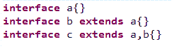
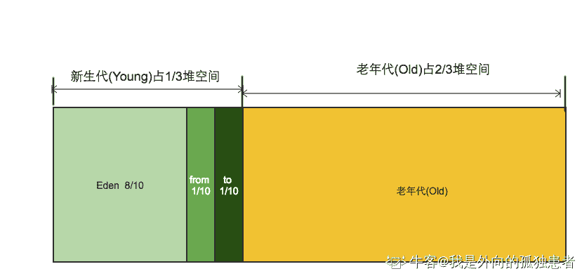
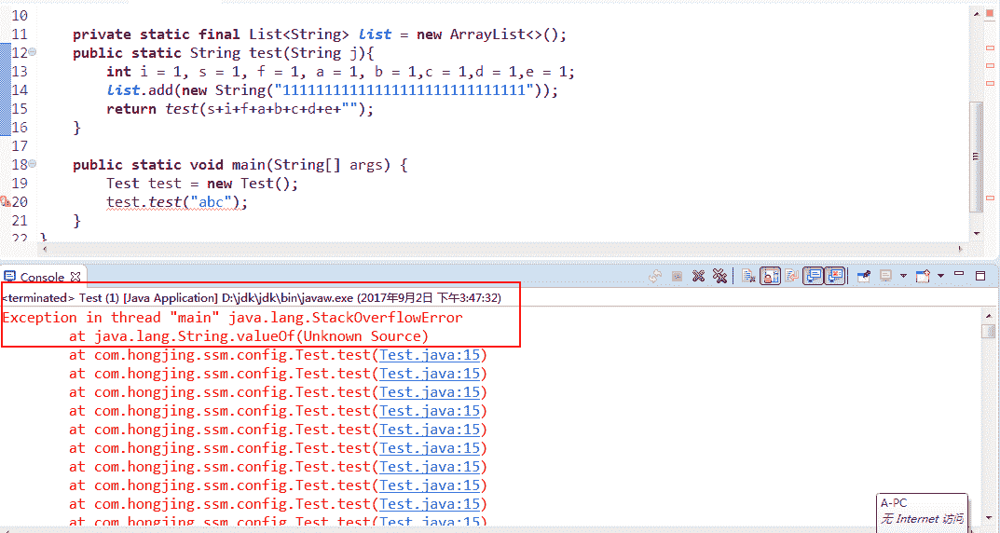
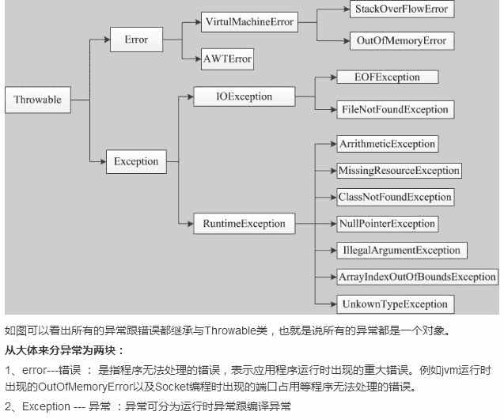
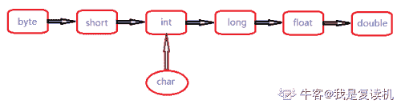
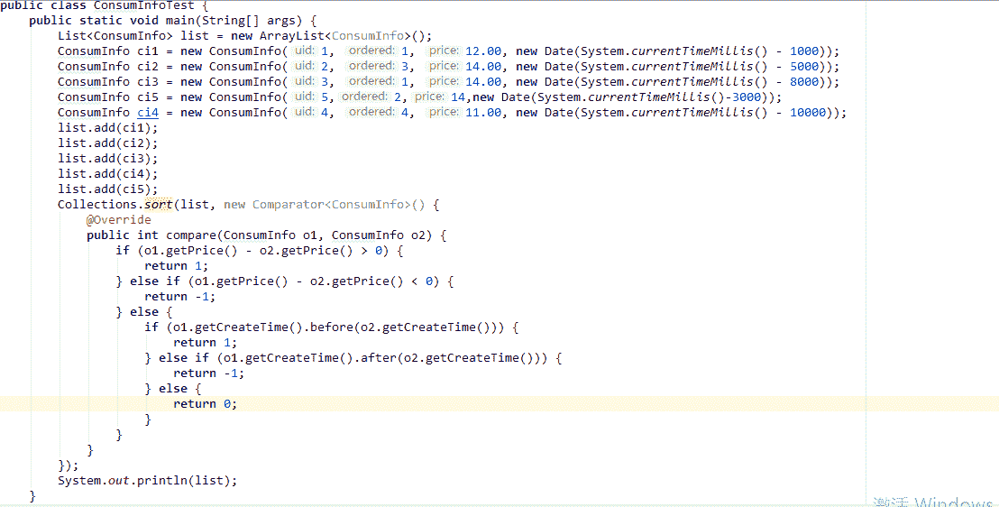

# 欢聚时代 2017 校招笔试题目（JAVA 基础类）A 卷

## 1

以下运行结果哪个是正确的： ( )

```cpp
class A{
public String show(D d){return ("AD");}
public String show(A a){return ("AA");}
}

class B extends A{
public String show(B b){return ("BB");}
public String show(A a){return ("BA");}
}

class C extends B{}

class D extends B{}

public class Test{

    public static void main(String[] args) {
        A a = new A();
        B b = new B();
        C c = new C();
        D d = new D();
        System.out.println(a.show(b)+"-"+a.show(c)+"-"+a.show(d)+"-"+b.show(a)+"-"+b.show(c)+"-"+b.show(d));
    }
}
```

正确答案: C   你的答案: 空 (错误)

```cpp
AD-AA-AD-BA-BB-AD
```

```cpp
AA-AD-AD-BA-BB-AD
```

```cpp
AA-AA-AD-BA-BB-AD
```

```cpp
AA-AA-AD-BA-BA-AD
```

本题知识点

Java 工程师 欢聚集团 2017

讨论

[victor_](https://www.nowcoder.com/profile/9673955)

对象 a 有两个重载的 show 方法，分别是 Show（D d），Show（A a）；对象 b 有三个重载的 show 方法，分别是 Show（B b），Show（A a）以及 show（D d）（相当于，因为 B 继承了 A，所以有了 Show（D d）和 Show（A a）），但是 B 又重写了 show（A a）方法，并新增了方法重载方法 Show（B b）；因此当调用 b.show(a)时是调用的自己重写过的方法 show（A a），当调用 b.show(d)时直接调用从父类 A 继承来的方法。

a.show(b) 相当于对象 a 调用自己的方法 show(A a)，因为 b 是 A 类型，而不是 D 类型的；

a.show(c) 相当于对象 a 调用自己的方法 show(A a)，因为 c 是 B 类型，即 A 类型，而不是 D 类型；

a.show(d) 相当于对象 a 调用自己的方法 show(D d)，因为 d 是 D 类型的；

b.show(a) 相当于对象 b 调用自己的方法 show(A a)，因为 a 是 A 类型的；

b.show(c) 相当于对象 b 调用自己的方法 show(B b)，因为 c 是 B 类型的；

b.show(d) 相当于对象 b 调用父类 A 的方法 show(D d)总结一下就是，子类先找自己的方法，如果有就直接调用，若没有，则检查继承自父类的方法。

发表于 2017-09-08 17:52:07

* * *

[空空以空空](https://www.nowcoder.com/profile/479441)

参考楼上的解答，我也说一下自己的理解；继承具有传递性，A 是 B 的父类，B 是 C 和 D 的父类。所以 B 就继承了 A 的所有非私有方法和属性。当子类和父类拥有相同的方法时，子类就会覆盖掉父类的方法，代码运行时总会执行子类的那个方法。当我们定义一个 class 的时候，我们实际上就定义了一种数据类型。判断一个变量是否是某个类型可以用 instanceof 判断

```cpp
boolean res1;
boolean res2;
res1 = b instanceof A;//true
res2 = b instanceof B;//true
```

所以 b 还是 A 类型的
下面分析一下代码

```cpp
public class Test{

    public static void main(String[] args) {
        A a =new A();
        B b =new B();
        C c =new C();
        D d =new D();  /********对象 a 调用自己的方法******/
        a.show(b);//b 是 A 类型的，相当于 a.show(A b)
        a.show(c);//c 是 B 类型的，B 又继承自 A，所以 c 也是 A 类型的,相当于 a.show(A c)
        a.show(d);//A 类本来就有 show(D d),所以就执行了 show(D,d);
   /********对象 b 调用自己的方法******/
        b.show(a);
        b.show(c);
   /********对象 b 调用了父类的方法 show(D d)******/
        b.show(d);
    }
}
```

参考：[`www.liaoxuefeng.com/wiki/001374738125095c955c1e6d8bb493182103fac9270762a000/001386820044406b227b3e751cc4d5190420d17a2dc6353000`](https://www.liaoxuefeng.com/wiki/001374738125095c955c1e6d8bb493182103fac9270762a000/001386820044406b227b3e751cc4d5190420d17a2dc6353000)

编辑于 2017-09-06 19:51:25

* * *

[我是如此相信](https://www.nowcoder.com/profile/7988004)

静态分配和动态分配

发表于 2019-03-25 15:49:28

* * *

## 2

以下对继承的描述错误的是

正确答案: C   你的答案: 空 (错误)

```cpp
Java 中的继承存在着传递性
```

```cpp
父类更具有通用性，子类更具体
```

```cpp
定义为 finally 的类可以被继承
```

```cpp
当实例化子类时会递归调用父类中的构造方法
```

本题知识点

Java 工程师 欢聚集团 2017

讨论

[親愛的破小孩](https://www.nowcoder.com/profile/5304840)

首先写错了 final 为 finally，并且定义为 final 的类不能被继承

发表于 2017-08-31 13:35:39

* * *

[夜静自然凉](https://www.nowcoder.com/profile/8178782)

java 中的继承 review 继承使用 extends 关键词 java 中继承的特点：java 中的类只能单继承，但可以多重继承，因此继承具备传递性继承中的父类：父类由一系列具有相同属性和方法的类“抽象”而得继承中的子类：子类除了拥有从父类中继承的属性和方法外，还可以有自己特有的属性和方法，当父类的方法，不能满足子类的需求时，子类可以通过重写的方式，完成对原有方法的功能扩展或修改因此，父类更通用，子类更具体。继承的好处：实现代码的复用哪些能继承？子类可以继承父类的成员变量，成员方法哪些不能被继承？构造方法不能被继承 final 修饰的类不能被继承

发表于 2017-10-01 15:46:28

* * *

[Hutonm](https://www.nowcoder.com/profile/6517610)

**final 类不能被继承，没有子类。**
**final 方法不能被子类的方法覆盖。**
**final 成员变量表示常量，只能被赋值一次，赋值后值不再改变。**

发表于 2017-09-09 11:55:30

* * *

## 3

在同一包下，以下说法正确的是

正确答案: A B C D   你的答案: 空 (错误)

```cpp
super.方法（）可以调用父类的所有非私有方法
```

```cpp
super（）可以调用父类的所有非私有构造函数
```

```cpp
super.属性可以调用父类的所有非私有属性
```

```cpp
this 和 super 关键字可以出现在同一个构造函数中
```

本题知识点

Java 工程师 欢聚集团 2017

讨论

[裴小强](https://www.nowcoder.com/profile/2575877)

4D 也是对的吧
public class Student extends Person {

    String name;
    public Student(String name){
       ***super***();
        ***this***.name=name;
    }
}

编辑于 2017-08-30 19:09:22

* * *

[这？](https://www.nowcoder.com/profile/9918942)

这个题不严谨啊，应该是 super()和 this()不能出现在同一个构造函数中。B 中，super()又没有参数，万一父类是有参构造函数呢？？？？

发表于 2017-08-30 22:34:44

* * *

[2FA0](https://www.nowcoder.com/profile/6103754)

abc 选项是不是都忽略了如果父类和子类不在同一个包下边，但是函数又是 default 的情况了吧，这问题很大吧

发表于 2017-09-03 11:15:19

* * *

## 4

以下对重载描述错误的是

正确答案: B   你的答案: 空 (错误)

```cpp
方法重载只能发生在一个类的内部
```

```cpp
构造方法能重载，但静态方法不能重载
```

```cpp
重载要求方法名相同，参数列表不同
```

```cpp
方法的返回值类型不是区分方法重载的条件
```

本题知识点

Java 工程师 欢聚集团 2017 Java 工程师 欢聚集团 2017

讨论

[山衔寒漪](https://www.nowcoder.com/profile/4593622)

静态方法可以重载

发表于 2017-09-01 17:05:09

* * *

[不停奔跑的蜗牛](https://www.nowcoder.com/profile/4150853)

```cpp
package statickeyword;
//get 方法是一个静态方法，重载并没有出现问题啊！
public class StaticDemo {     public static void get(){         System.out.println("get1");     }          public static void get(int a) {         System.out.println("get2 "+a);              }
}

```

发表于 2017-09-26 14:45:36

* * *

[冷暧](https://www.nowcoder.com/profile/2362215)

```cpp
int  a(){
System,out.println("有返回")；
}
void a(){
System,out.println("就是没有返回值")； }
然后再 main 里面调用 a();你觉得 jvm 会给你输出什么；
```

编辑于 2017-09-03 21:30:21

* * *

## 5

以下对接口描述错误的有

正确答案: D   你的答案: 空 (错误)

```cpp
接口没有提供构造方法
```

```cpp
接口中的方法默认使用 public、abstract 修饰
```

```cpp
接口中的属性默认使用 public、static、final 修饰
```

```cpp
接口不允许多继承
```

本题知识点

Java 工程师 欢聚集团 2017 Java 工程师 欢聚集团 2017

讨论

[化羽成风](https://www.nowcoder.com/profile/9793993)



发表于 2017-09-11 18:30:46

* * *

[简相杰](https://www.nowcoder.com/profile/8442454)

interface 可以多继承 interface。class 只能单继承 class，但可以多实现 interfaceabstract 具有类的特性。可以多 implement interface 只能单 extends class 或者 abstract 希望大家改正

发表于 2017-09-04 21:36:38

* * *

[牛客 2525060 号](https://www.nowcoder.com/profile/2525060)

接口是实现，可以实现多个接口

发表于 2017-08-31 02:15:11

* * *

## 6

以下关于内存管理描述错误的是

正确答案: D   你的答案: 空 (错误)

```cpp
基本数据类型的变量、对象的引用及函数调用的现场保存都使用内存栈空间
```

```cpp
通过 new 关键字和构造器创建的对象放在堆空间，类信息、常量、静态变量放在方法区
```

```cpp
计数器是唯一一个没有规定任何 OutOfMemoryError 情况的区域
```

```cpp
直接内存的分配不会受到 Java 堆大小的限制，所以不会抛 OutOfMemoryError 异常
```

本题知识点

Java 工程师 欢聚集团 2017

讨论

[Smile_Hjj](https://www.nowcoder.com/profile/5588952)

*   OutOfMemoryError 异常 

    *   程序计数器：无
    *   Java 虚拟机栈： 如果虚拟机栈可扩展，扩展时无法申请到足够内存
    *   本地方法栈：与 Java 虚拟机栈相同
    *   Java 堆：堆中没有内存完成实例分配，并且堆无法再进行扩展
    *   方法区（运行时常量池）：方法区无法满足内存分配需求（常量池无法申请到内存）
    *   直接内存：内存区域总和大于物理内存总和
*   StackOverflowError 异常 

    *   程序计数器：无
    *   Java 虚拟机栈：线程请求的栈深度大于虚拟机所允许的深度
    *   本地方法栈：与 Java 虚拟机栈相同
    *   Java 堆：无
    *   方法区：无
    *   直接内存：无
    *   **直接内存**（Direct Memory）并不是虚拟机运行时数据区的一部分，也不是 Java 虚拟机规范中定义的内存区域，但是这部分内存也被频繁地使用，而且也可能导致 OutOfMemoryError 异常出现，所以我们放到这里一起讲解。

              在 JDK 1.4 中新加入了 NIO（New Input/Output）类，引入了一种基于通道（Channel）与缓冲区（Buffer）的 I/O 方式，它可以使用 Native 函数库直接分配堆外内存，然后通过一个存储在 Java 堆里面的 DirectByteBuffer 对象作为这块内存的引用进行操作。这样能在一些场景中显著提高性能，因为避免了在 Java 堆和 Native 堆中来回复制数据。

              显然，本机直接内存的分配不会受到 Java 堆大小的限制，但是，既然是内存，则肯定还是会受到本机总内存（包括 RAM 及 SWAP 区或者分页文件）的大小及处理器寻址空间的限制。服务器管理员配置虚拟机参数时，一般会根据实际内存设置-Xmx 等参数信息，但经常会忽略掉直接内存，使得各个内存区域的总和大于物理内存限制（包括物理上的和操作系统级的限制），从而导致动态扩展时出现 OutOfMemoryError 异常。

发表于 2017-09-06 15:09:18

* * *

[嘤嘤怪.](https://www.nowcoder.com/profile/4887286)

```cpp
直接内存的分配不会受到 Java 堆大小的限制，但是会受到机器本身内存大小的限制，超过本机最大内存的时候还是会抛 oom
```

发表于 2017-08-30 16:32:27

* * *

[Lvan•Wong](https://www.nowcoder.com/profile/270615737)

《深入理解 java 虚拟机》第二章 39-44 程序计数器：很小的内存，可以看做当前线程执行的字节码的行号指示器。分支、跳转、循环、线程恢复都需要它。**线程私有，唯一一个 java 虚拟机规范中没有可能出现 OutOfMemoryError 情况的区域（执行 Native 方法，计数器的值为空）****虚拟机栈：两种情况的异常：****1、线程请求深度大于虚拟机允许的深度——>StackOverflowError;****2、虚拟机动态拓展，无法申请到足够的内存——>**OutOfMemoryError******线程私有****本地方法栈：****同上，区别是：******虚拟机栈——》虚拟机执行 java 方法服务（字节码文件——>加载解析初始化）********本地方法栈——》执行的是 native 方法服务******java 堆：****内存共享
如果堆没有内存完成实例分配，也没办法拓展，OutOfMemoryError****** **运行时常量池和方法区****内存共享，方法区放的是：类信息、常量、静态变量、即时编译器编译后的代码等数据****为何放一起？Java7 以后**运行时常量池就是方法区的一部分，当无法满足分配需求，就会抛出；**OutOfMemoryError********还有一个直接内存，jdk1.4 引入的基于通道与缓冲区的 IO****存在的意义：提高工作效率****eg：native 堆执行的时候需要函数库，这块的函数库可以直接分配堆外内存，然后通过一个存储在 java 堆的一个流对象引用这块内存操作，避免了**native 堆和 java 堆数据来回复制****这块的内存是在不是 java 虚拟机规范中定义，不会受到 java 堆大小的限制，但是内存，还是会受到本机的总内存影响，动态拓展有可能出现 OutOfMenoryError。（注意，我们平时会设置-Xmx 等信息，这些不会影响到直接内存，要设置直接内存可以从物理的和操作系统层面限制）

编辑于 2020-08-26 13:39:19

* * *

## 7

关于以下方法调用描述正确的是：

```cpp
private static final List<String> list = new ArrayList<>();
public static String test(String j){
    int i = 1, s = 1, f = 1, a = 1, b = 1,c = 1,d = 1,e = 1;
    list.add(new String("11111111111111111111111111111"));
    return test(s+i+f+a+b+c+d+e+"");
}
```

正确答案: B D   你的答案: 空 (错误)

```cpp
一定会发生” OutOfMemoryError: Java heap space”
```

```cpp
一定会发生” StackOverflowError”
```

```cpp
一定会发生” OutOfMemoryError: Java heap space 与 StackOverflowError”
```

```cpp
当发生内存溢出错误时不需要用 try…catch 来捕获，需检查代码及 jvm 参数配置的合理性
```

本题知识点

Java 工程师 欢聚集团 2017

讨论

[弘静](https://www.nowcoder.com/profile/1985638)

代码执行结果就这样，栈溢出。我个人的理解是调用栈的增长比内存的消耗更快，更消耗内存。

发表于 2017-09-02 15:54:33

* * *

[Smile_Hjj](https://www.nowcoder.com/profile/5588952)

      **java.lang.Error**: An Error is a subclass of Throwable that indicates serious problems that a reasonable application should not try to catch. Most such errors are abnormal conditions. 即：Error 是 Throwable 的子类，用于标记严重错误。**合理的应用程序不应该去 try/catch 这种错误。绝大多数的错误都是非正常的，就根本不该出现的。** 
    **java.lang.Exception**: The class Exception and its subclasses are a form of Throwable that indicates conditions that a reasonable application might want to catch. 即 Exception 是 Throwable 的一种形式的子类，用于指示一种合理的程序想去 catch 的条件。**即它仅仅是一种程序运行条件，而非严重错误，并且鼓励用户程序去 catch 它。**

发表于 2017-09-06 15:43:44

* * *

[小马嘟嘟骑](https://www.nowcoder.com/profile/9160619)

递归时没有退出条件会发生栈溢出。然后这题 D 也是对的吧？

发表于 2017-08-30 18:15:07

* * *

## 8

下列关于堆内存管理描述错误的是

正确答案: A   你的答案: 空 (错误)

```cpp
堆内存分为年轻代、老年代、持久代，持久代内存溢出为 OutOfMemoryError: Java heap space
```

```cpp
当 Eden 区满，再创建对象，会触发年轻代 GC，不能回收的对象会放到 To Survivor 区
```

```cpp
年轻代的 To Survivor 满了或里面的对象足够 Old（超过 XX:MaxTenuringThreshold），则这些对象被 copy 到老年代
```

```cpp
当 Old 区被放满的之后，进行 Full GC，Full GC 后，若 Survivor 及 old 区仍然无法存放从 Eden 复制过来的部分对象，则出现 OOM 错误
```

本题知识点

Java 工程师 欢聚集团 2017

讨论

[Fanxiaolin](https://www.nowcoder.com/profile/8025188)

给你们三个地址链接，耐心仔细看，你就所有有关这些 java 内存的题目都会了！1.我自己写的一篇博客，希望对你们有帮助：[`blog.csdn.net/xiaolinnulidushu/article/details/87205709`](https://blog.csdn.net/xiaolinnulidushu/article/details/87205709)2.[`www.cnblogs.com/gw811/archive/2012/10/19/2730258.html`](http://www.cnblogs.com/gw811/archive/2012/10/19/2730258.html)3.[`www.importnew.com/14630.html`](http://www.importnew.com/14630.html)不用谢，点赞就好

编辑于 2019-02-23 14:36:21

* * *

[Smile_Hjj](https://www.nowcoder.com/profile/5588952)

内存申请过程

1.  JVM 会试图为相关 Java 对象在 Eden 中初始化一块内存区域；
2.  当 Eden 空间足够时，内存申请结束。否则到下一步；
3.  JVM 试图释放在 Eden 中所有不活跃的对象（minor collection），释放后若 Eden 空间仍然不足以放入新对象，则试图将部分 Eden 中活跃对象放入 Survivor 区；
4.  Survivor 区被用来作为 Eden 及 old 的中间交换区域，当 OLD 区空间足够时，Survivor 区的对象会被移到 Old 区，否则会被保留在 Survivor 区；
5.  当 old 区空间不够时，JVM 会在 old 区进行 major collection；
6.  完全垃圾收集后，若 Survivor 及 old 区仍然无法存放从 Eden 复制过来的部分对象，导致 JVM 无法在 Eden 区为新对象创建内存区域，则出现"Out of memory 错误"。

发表于 2017-09-06 16:45:59

* * *

[a676610050](https://www.nowcoder.com/profile/5850617)

永久代也会 OOM,不过永久代的是：java.lang.OutOfMemoryError: PermGen space

发表于 2017-09-01 13:29:41

* * *

## 9

以下关于异常的描述错误的是

正确答案: C   你的答案: 空 (错误)

```cpp
RuntimeException：可以不使用 try...catch 进行处理，但是如果有异常产生，则异常将由 JVM 进行处理
```

```cpp
finally 语句块是不管有没有出现异常都要执行的内容
```

```cpp
throw 关键字可以在方法上声明该方法要抛出的异常
```

```cpp
try 是用于检测被包住的语句块是否出现异常，如果有异常，则抛出异常，并执行 catch 语句
```

本题知识点

Java 工程师 欢聚集团 2017

讨论

[萧特特](https://www.nowcoder.com/profile/4912593)

关键字是 throws

发表于 2017-08-30 21:56:53

* * *

[interfaceone](https://www.nowcoder.com/profile/473717)

throws 声明
throw 动作

发表于 2017-10-31 19:54:02

* * *

[GigaDrillBreak](https://www.nowcoder.com/profile/981022901)

有点问题，finally 执行的条件是进入 try 并且 jvm 运行，当我在进入 try 之前出了异常，是不会进入 finally 中的。

发表于 2019-05-18 18:56:18

* * *

## 10

以下代码输出结果是：

```cpp
public class Demo {
    public static void main(String[] args) {
      try {
        System.out.println("try-");
        int[] a = new int[0];
        a[0] = 1;
        System.out.println(a[0]+”-”);
       return;
     } catch (Exception e) {
       System.out.println("catch-");
     } finally {
       System.out.println("finally");
     }
   }
}
```

正确答案: D   你的答案: 空 (错误)

```cpp
try-1-catch-finally
```

```cpp
try-1-finally
```

```cpp
try-1-catch
```

```cpp
try-catch-finally
```

本题知识点

Java 工程师 欢聚集团 2017

讨论

[蒲公英的约定 8](https://www.nowcoder.com/profile/3563885)

因为数组的长度定义为 0，接下来又给数组进行赋值，所以会抛异常，执行 catch，finally

发表于 2017-09-01 00:20:44

* * *

[CYRTO](https://www.nowcoder.com/profile/4367012)

ArrayIndexOutOfBoundsException 是 Exception 类 下的子类，第 6 行发生该异常被捕获，try 块以后的语句不在执行。不会输出 a[0]+”-”，finally 块里的语句不管是否有异常，都会被执行。

发表于 2017-09-01 14:17:01

* * *

[JonTang](https://www.nowcoder.com/profile/1173781)

粗心啊，没看到定义数组大小为 0，会抛出异常。

发表于 2018-08-21 17:16:59

* * *

## 11

以下输出结果正确的是：

```cpp
String a = "helloworld";
String b = new String("helloworld");
String c = "hello" + "world";
System.out.print((a == b)+”-”+( a == c)+”-”+ a.equals(b)+”-”+( c.equals(a)));
```

正确答案: A   你的答案: 空 (错误)

```cpp
false-true-true-true
```

```cpp
false-false-true-true
```

```cpp
true-false-false-true
```

```cpp
true-false-true-false
```

本题知识点

Java 工程师 欢聚集团 2017

讨论

[百变小狼](https://www.nowcoder.com/profile/821094380)

https://blog.csdn.net/yztfst/article/details/97935502

发表于 2019-09-12 13:04:21

* * *

[傻笑绝爱](https://www.nowcoder.com/profile/8514870)

==比较地址  equals 比较内容 new 重新开辟地址   String a = ""会先在常量池里寻找有没有 a 的存在，如果有直接赋值过去

发表于 2017-11-20 22:22:10

* * *

[爱吃米线的吴彦祖](https://www.nowcoder.com/profile/4154422)

equals()比较的是内容，“==”比较的是地址

发表于 2017-09-17 23:44:32

* * *

## 12

以下说法有错误的是

正确答案: D   你的答案: 空 (错误)

```cpp
int 占 4 个字节，32 位
```

```cpp
long 占 8 个字节
```

```cpp
short 占 2 个字节
```

```cpp
char 不能存储一个汉字
```

本题知识点

Java 工程师 欢聚集团 2017 C++ C 语言

讨论

[小马嘟嘟骑](https://www.nowcoder.com/profile/9160619)

这题有错，long 占 8 个字节，64 位。JAVA 使用 UNICODE 存储字符，因此能够存储汉字

发表于 2017-08-30 18:09:56

* * *

[逗是辣个锅](https://www.nowcoder.com/profile/967595689)

c 语言 32 位 long 占 4 字节，char 一个字节怎么存汉字？不是 c 的专项练习吗？淦。

发表于 2020-09-19 02:08:30

* * *

[牛客 157460761 号](https://www.nowcoder.com/profile/157460761)

32 位 long 占 4 个字节

发表于 2020-08-06 08:07:45

* * *

## 13

以下输出结果正确的是： System.out.println("3.0" + 2+1)

正确答案: D   你的答案: 空 (错误)

```cpp
6
```

```cpp
33
```

```cpp
321
```

```cpp
3.021
```

本题知识点

Java 工程师 欢聚集团 2017

讨论

[蒲公英的约定 8](https://www.nowcoder.com/profile/3563885)

字符串跟整数相加相当于字符串拼接

发表于 2017-09-01 00:24:31

* * *

## 14

找出以下关于 float 的不正确的声明

正确答案: B   你的答案: 空 (错误)

```cpp
float foo=-1;
```

```cpp
float foo=1.0;
```

```cpp
float foo=2.02f;
```

```cpp
float foo=0x0123;
```

本题知识点

Java 工程师 欢聚集团 2017 C++ C 语言

讨论

[小马嘟嘟骑](https://www.nowcoder.com/profile/9160619)

float 可以赋值为整型变量，整型自动类型转换为 float 型，但是浮点型默认为 double 型的，如果要赋值给 float 需要强制类型转换

发表于 2017-08-30 18:08:41

* * *

[哈利波特与桃花娘](https://www.nowcoder.com/profile/501696196)

float a=1.0；编译通过，VS2019，我迷茫了

发表于 2020-08-13 10:33:32

* * *

[我是复读机](https://www.nowcoder.com/profile/162099353)

1、java 中，整数默认是 int 类型，小数默认是 double 类型；2、顺着箭头方向，从小到大，自动转换；逆着箭头方向，需要强制转换。对于 A 选项，int 转 float，自动完成；对于 B 选项，double 转 float，不能自动完成，需要强转；对于 C 选项，2.02f 本身就是 float 类型，无需转换；对于 D 选项，int 转 float，自动完成。

发表于 2020-12-29 16:04:09

* * *

## 15

下面那些方法不会阻塞线程

正确答案: C   你的答案: 空 (错误)

```cpp
inputStream.read()
```

```cpp
Thread.sleep(100)
```

```cpp
StringBuilder.append(“test”)
```

```cpp
Object.wait()
```

本题知识点

Java 工程师 欢聚集团 2017

讨论

[TracyDragon](https://www.nowcoder.com/profile/5168521)

```cpp
StringBuilder 是非线程安全的，所以不会阻塞线程。
```

发表于 2017-09-04 22:33:41

* * *

[anyco](https://www.nowcoder.com/profile/9874063)

StringBuffer 和 StringBuilder 类的区别在于 StringBuffer 支持并发操作，线性安全的，适合多线程中使用。StringBuilder 不支持并发操作，是线程不安全的，不适合多线程中使用，但其在单线程中的性能比 StringBuffer 高。

编辑于 2017-11-17 20:32:35

* * *

## 16

启动线程时不调用 start()而使用调用 run()方法，会有什么后果

正确答案: B   你的答案: 空 (错误)

```cpp
不会启动新线程，run 方法也不会执行。
```

```cpp
不会启动新线程，但是 run 方法会执行。
```

```cpp
启动了新线程，但是 run 方法不会被执行。
```

```cpp
启动了新线程，run 方法也会被执行。
```

本题知识点

Java 工程师 欢聚集团 2017

讨论

[午夜阳光 1](https://www.nowcoder.com/profile/2973766)

```cpp
public class MyThread extends Thread { public void run() {  
　　 System.out.println("MyThread.run()");  
　　}  
}  

MyThread myThread1 = new MyThread();  
MyThread myThread2 = new MyThread();  
myThread1.start();  
myThread2.start(); 
```

发表于 2018-09-12 20:46:50

* * *

[蒲公英的约定 8](https://www.nowcoder.com/profile/3563885)

那就相当于对象调用方法，执行方法

发表于 2017-09-01 00:28:09

* * *

## 17

下面的描述哪一个是正确的

正确答案: C   你的答案: 空 (错误)

```cpp
当线程的 interrupt()方法被调用时，线程马上中断。
```

```cpp
当线程调用了 sleep(1000)，线程睡眠 1 秒后可以不通过 cpu 调度马上往下执行。
```

```cpp
当线程调用了对象的 wait()，notify()、notifyAll()，需要先获得对象的锁。
```

```cpp
wait()，notify()、notifyAll()执行完成后会自动释放锁
```

本题知识点

Java 工程师 欢聚集团 2017

讨论

[嘤嘤怪.](https://www.nowcoder.com/profile/4887286)

notify()或者 notifyAll()方法并不是真正释放锁，必须等到 synchronized 方法或者语法块执行完才真正释放锁

发表于 2017-08-30 16:40:07

* * *

[我是复读机](https://www.nowcoder.com/profile/162099353)

    Thread.interrupt()方法: 作用是中断线程。将会设置该线程的中断状态位，即设置为 true，中断的结果线程是死亡、还是等待新的任务或是继续运行至下一步，就取决于这个程序本身。线程会不时地检测这个中断标示位，以判断线程是否应该被中断（中断标示值是否为 true）。它并不像 stop 方法那样会中断一个正在运行的线程 。

    interrupt()方法只是改变中断状态，不会中断一个正在运行的线程。需要用户自己去监视线程的状态为并做处理。支持线程中断的方法（也就是线程中断后会抛出 interruptedException 的方法）就是在监视线程的中断状态，一旦线程的中断状态被置为“中断状态”，就会抛出中断异常。这一方法实际完成的是，给受阻塞的线程发出一个中断信号，这样受阻线程检查到中断标识，就得以退出阻塞的状态。 

    更确切的说，如果线程被 Object.wait, Thread.join 和 Thread.sleep 三种方法之一阻塞，此时调用该线程的 interrupt()方法，那么该线程将抛出一个 InterruptedException 中断异常（该线程必须事先预备好处理此异常），从而提早地终结被阻塞状态。如果线程没有被阻塞，这时调用 interrupt()将不起作用，直到执行到 wait(),sleep(),join()时,才马上会抛出 InterruptedException。

编辑于 2020-12-28 17:03:59

* * *

[Cloud2049](https://www.nowcoder.com/profile/8508158)

interrupt()的作用是中断本线程的执行。 本线程中断自己是被允许的；其它线程调用本线程的 interrupt()方法时，会通过 checkAccess()检查权限。这有可能抛出 SecurityException 异常。

发表于 2017-08-31 19:38:45

* * *

## 18

以下关于 List 删除方法使用错误的是

正确答案: C   你的答案: 空 (错误)

```cpp
list 循环外指定 index 删除：list.remove(i);
```

```cpp
list 循环外指定元素删除：list.remove(obj)
```

```cpp
for(Object obj:list){list.remove(obj);}
```

```cpp
for(Iterator it= list.iterator();it.hasNext();){it.next();it.remove();}
```

本题知识点

Java 工程师 欢聚集团 2017

讨论

[小马嘟嘟骑](https://www.nowcoder.com/profile/9160619)

1、可以在循环外通过索引删除对象或直接删除对象。

2、在循环过程中从 List 中删除非基本数据类型以后，继续循环 List 时会报 ConcurrentModificationException  。

3、使用增强的 for 循环对 List 进行遍历删除，但删除之后马上就跳出的也不会出现异常 

4、不使用增强的 for 循环的也可以正常删除和遍历,   这里所谓的正常是指它不会报异常，但是删除后得到的  数据不一定是正确的，这主要是因为删除元素后，被删除元素后的元素索引发生了变化。

5、使用 Iterator 的方式可以顺利删除和遍历  

发表于 2017-08-30 18:06:46

* * *

[傻笑绝爱](https://www.nowcoder.com/profile/8514870)

集合循环方方式 for：在删除一元素时，集合大小会改变，索引会改变，有些元素删不完，逻辑错误集合循环方式加强 for：在删除操作时会直接报错，当前对象不能被改变集合循环方式 iteratior：可以用 iterator.remove,但不能用 list.remove

发表于 2017-11-20 22:59:49

* * *

## 19

在一个有序数据集合中，经常需要对数据进行插入和删除的操作(不考虑线程安全)，请问使用哪个数据结构最合适

正确答案: B   你的答案: 空 (错误)

```cpp
ArrayList
```

```cpp
LinkedList
```

```cpp
Vector
```

```cpp
HashMap
```

本题知识点

Java 工程师 欢聚集团 2017

讨论

[燃烧的雪](https://www.nowcoder.com/profile/9921213)

在进行查询操作时，线性表效率更加高些，而在执行插入删除操作时，具有链表结构的数据会更加方便，因为不需要移动很多数据，只需要将相对应的指针修改就可以了。【小生初来乍到，还望多多指教】

发表于 2018-05-29 11:55:03

* * *

[扎实](https://www.nowcoder.com/profile/222850111)

LinkedList 以链表存储，在随机增删时需要搜索元素所在的位置，不需要数组扩容。ArrayList 以数组存储，不需要搜索位置，但需要数组扩容和复制元素。实际测试 10 万条 ArrayList 随机增删时 ArrayList 的性能更好。

```cpp
addarraylist 10 万次: 5591110739
addlinkedlist 10 万次:22285398106
delarraylist 1 万次: 836916614
dellinkedlist 1 万次:2722411422

```

发表于 2018-06-19 22:13:21

* * *

[嘤其鸣矣，求其友声](https://www.nowcoder.com/profile/7624301)

List 以特定次序来持有元素，可有重复元素

Set  无法拥有重复元素,内部排序

Map Map 中不允许重复的键，value 可多值。ArrayList 底层使用数组存储，LinkedList 底层使用双向链表存储
ArrayList 在访问数据时效率较高，在插入和删除数据时效率较低

什么是 HashSet

HashSet 实现了 Set 接口，它不允许集合中有重复的值，当我们提到 HashSet 时，第一件事情就是在将对象存储在 HashSet 之前，要先确保对象重写 equals()和 hashCode()方法，这样才能比较对象的值是否相等，以确保 set 中没有储存相等的对象。如果我们没有重写这两个方法，将会使用这个方法的默认实现。

public boolean add(Object o)方法用来在 Set 中添加元素，当元素值重复时则会立即返回 false，如果成功添加的话会返回 true。

什么是 HashMap

HashMap 实现了 Map 接口，Map 接口对键值对进行映射。Map 中不允许重复的键。Map 接口有两个基本的实现，HashMap 和 TreeMap。TreeMap 保存了对象的排列次序，而 HashMap 则不能。HashMap 允许键和值为 null。HashMap 是非 synchronized 的

HashSet 和 HashMap 的区别

| *HashMap* |    *HashSet* |
| HashMap 实现了 Map 接口 |    HashSet 实现了 Set 接口 |
| HashMap 储存键值对 |    HashSet 仅仅存储对象 |
| 使用 put()方法将元素放入 map 中 |    使用 add()方法将元素放入 set 中 |
| HashMap 中使用键对象来计算 hashcode 值 |    HashSet 使用成员对象来计算 hashcode 值，对于两个对象来说 hashcode 可能相同，所以 equals()方法用来判断对象的相等性，如果两个对象不同的话，那么返回 false |
| HashMap 比较快，因为是使用唯一的键来获取对象 |    HashSet 与 Hashmap 存取速度基本一致，HashSet 把 HashMap 进行了封装 |

发表于 2017-09-17 12:48:29

* * *

## 20

Java 反射机制的说法错误的是

正确答案: C   你的答案: 空 (错误)

```cpp
在运行时判断对象所属的类
```

```cpp
在运行时判断类所具有的成员变量和方法
```

```cpp
在运行时改变方法的实现
```

```cpp
在运行时调用一个对象的方法
```

本题知识点

Java 工程师 欢聚集团 2017

讨论

[嘤其鸣矣，求其友声](https://www.nowcoder.com/profile/7624301)

 Java 反射机制是在运行状态中，对于任意一个类，都能够知道这个类的所有属性和方法；对于任意一个对象，都能够调用它的任意一个方法和属性；这种动态获取的信息以及动态调用对象的方法的功能称为 Java 语言的反射机制。

发表于 2017-09-17 12:38:25

* * *

## 21

现有如下信息：

用户列表数据 :List<Long>uidList, size=10000

消费查询远程接口： long  queryByUid(long uid)

请根据用户信息及远程接口，写一段程序统计用户的平均消费。

要求：以性能最优实现

你的答案

本题知识点

Java 工程师 欢聚集团 2017

讨论

[我是大虾](https://www.nowcoder.com/profile/6914936)

```cpp
float getAverageConsum(List[Long] uidList,int size){
    double sum = 0;
    int count;
    Iterator it = list.iterator();
    while(it.hasNext()){
        sum+=queryByUid(it.next);
       count++;
    }
    return sum/count;
}
```

发表于 2017-10-28 10:24:38

* * *

[WindrangersS](https://www.nowcoder.com/profile/902907071)

```cpp
public long average(List<Long> uidList){
    Iterator<Long> iter = uidList.iterator();
    Long sum = 0.0;
    while(iter.hasNext()){
        sum += iter.next();
    }
    return sum/uidList.size();
}
```

发表于 2020-08-03 21:18:42

* * *

[NST_Xx](https://www.nowcoder.com/profile/2131630)

import java.util.*;
private long aveConsume(){long sum = 0;for(Iterator it = uidList.iterator();it.hasNext()){it = it.next();sum+=queryByUid(it.)
}

```cpp
return sum;
```

}

发表于 2017-09-01 15:37:59

* * *

## 22

用程序实现实时过滤用户评论中的非法关键词 , 具体描述如下：

```cpp
public class FilterKeywords {
 private Set<String> keywordsSet = new HashSet<String>();// 关键词集合
 public FilterKeywords(Set<String> keywordsSet){this.keywordsSet = keywordsSet;} 
 /**
  * 过滤方法
  *@param txt  待过滤的评论内容
  *@return 过滤出来的关键词及对应出现的次数
  */
 public Map<String, Integer> filter(String txt){
   //todo
 }
}
```

要求：

1. 实现 filter 方法，构造函数实现可以修改（示例提供默认实现）

2. 实时过滤，性能最优

你的答案

本题知识点

Java 工程师 欢聚集团 2017

讨论

[宁静、致远](https://www.nowcoder.com/profile/7651090)

我感觉这参考答案有点问题，比如当还是用原来的例子，只是关键词多包含一个"hell"，参考答案就找不出来，我这里稍微改动一下，代码如下。

import java.util.HashMap;
import java.util.HashSet;
import java.util.Map;
import java.util.Set;

public class FilterWord {
private TreeNode firstNode;
private Set<String> filterWords;
Map<String,Integer> result=new HashMap<String,Integer>();

```cpp
public FilterWord(Set<String> filterWords){
    this.filterWords=filterWords;
    init();
}

public void init(){
    firstNode=new TreeNode();
    for(String filterWord:filterWords){
        addToTree(filterWord);
    }
}

public void addToTree(String filterWord){
    TreeNode cur=firstNode;
    for(int i=0;i<filterWord.length();i++){
        if(cur.nodeSet.containsKey(filterWord.charAt(i))){
            cur=cur.nodeSet.get(filterWord.charAt(i));
        }else{
            cur=cur.addNode(filterWord.charAt(i));
        }
    }
    cur.keywords=filterWord;
}

public Map<String,Integer> filter(String txt){

    for(int i=0;i<txt.length();i++){
        TreeNode cur=firstNode;
        int j=i;
        while(j<txt.length() && cur.nodeSet.containsKey(txt.charAt(j))){
            cur=cur.nodeSet.get(txt.charAt(j));
            putToResult(cur);
            j++;
        }
    }
    return result;
}

public void putToResult(TreeNode node){
    if(node.keywords!=null){
        if(result.containsKey(node.keywords)){
            int count=(Integer)result.get(node.keywords);
            count++;
            result.put(node.keywords,count);
        }else{
            result.put(node.keywords,1);
        }
    }
}

public static void main(String[] args) {
    Set<String> keywordsSet = new HashSet<String>();
    keywordsSet.add("cgchello");
    keywordsSet.add("cgchello1");
    keywordsSet.add("cgchello2");
    keywordsSet.add("cgchello3");
    keywordsSet.add("cgchello4");
    keywordsSet.add("cgchello5");
    keywordsSet.add("hell");
    FilterWord filterWord=new FilterWord(keywordsSet);
    Map<String, Integer> results =filterWord.filter("cgchello_cgchello1_cgchello_cgchello2");
    Set keys=results.keySet();
    for(Object key:keys){
        System.out.println(key+" "+results.get(key));
    }
}

class TreeNode{
    public String keywords;
    public HashMap<Character,TreeNode> nodeSet=new HashMap<Character,TreeNode>();
    public TreeNode parent;

    public TreeNode addNode(char c){
        if(nodeSet.containsKey(c)){
            return nodeSet.get(c);
        }else{
            TreeNode treeNode=new TreeNode();
            treeNode.parent=this;
            nodeSet.put(c,treeNode);
            return treeNode;
        }
    }
} 
```

}

发表于 2017-11-21 22:09:37

* * *

[Fanxiaolin](https://www.nowcoder.com/profile/8025188)

import java.util.HashMap;import java.util.HashSet;import java.util.Iterator;import java.util.Map;import java.util.Map.Entry;import java.util.Set;public class FilterKeywords {private Set<String> keywordsSet = new HashSet<String>();// 关键词集合 public FilterKeywords(Set<String> keywordsSet) {this.keywordsSet = keywordsSet;}/*** 过滤方法** @param txt*            待过滤的评论内容* @return 过滤出来的关键词及对应出现的次数*/public Map<String, Integer> filter(String txt) {Map<String, Integer> resultMap = new HashMap<String, Integer>();int size = txt.length();for (int i = 0; i < size; i++) {for (int j = 0; j < size - i; j++) {String str = txt.substring(j, j+i+1);if(resultMap.containsKey(str)){resultMap.put(str, resultMap.get(str)+1);}else{resultMap.put(str, 1);}}}Map result = new HashMap<String, Integer>();Iterator iterator = resultMap.entrySet().iterator();while(iterator.hasNext()){Map.Entry map = (Entry) iterator.next();if(keywordsSet.contains(map.getKey())){//System.out.println(map.getKey()+" :" + map.getValue());result.put(map.getKey(), map.getValue());}}return result;}public static void main(String[] args) {Set keywordsSet = new HashSet<String>();keywordsSet.add("***妈");keywordsSet.add("***");String str = "你是不是***，***妈，***，***你就是个******妈";FilterKeywords filterKeywords = new FilterKeywords(keywordsSet);filterKeywords.filter(str);}}

编辑于 2017-09-15 16:05:34

* * *

[眉毛密过发](https://www.nowcoder.com/profile/204442994)

 publicMap<String, Integer> filter(String txt){         Map<String, Integer>  map=HashMap<String, Integer>();          string[] strs= txt.split(" ");         int len=str.length;        for(int i=0;i<len;i++){                 string str=strs[i];                if(keywordsSet .contains(str){                      if(map.get(str){                             map.put(str,map.get(str)+1);                     }else{   map.put(str,1);                     }       }       return map; }

发表于 2019-09-15 16:23:51

* * *

## 23

现有一列表： List<ConsumInfo> list ， ConsumInfo 属性如下：

```cpp
private long uid;
private long ordered;
private double price;
private Date createTime
```

请依次根据 ConsumInfo 中的 price 、 createTime 对 list 进行倒序排序

说明： ConsumInfo 可自定义

你的答案

本题知识点

Java 工程师 欢聚集团 2017

讨论

[傻笑绝爱](https://www.nowcoder.com/profile/8514870)



发表于 2017-11-21 17:36:02

* * *

[编程的渣渣啊啊啊](https://www.nowcoder.com/profile/8501721)

compare(int i1,int i2){    if (i1 < i2) return -1;
    else if (i1 > i2) return 1;
    else return 0;
}

发表于 2018-03-01 16:16:12

* * *

[Aa~！天道酬勤](https://www.nowcoder.com/profile/1711798)

    //根据 createTime 倒序排列
    public list<ConsumInfo> sortTime(list<ConsumInfo> listCon){
        for( int i = 0; i<listCon.size()-1; i++){
            for( int k = i+1; k<listCon.size(); k++){
                if(listCon.get(i).createTime.after(listCon.get(k).createTime)){
                    listCon.set(i,listCon.get(k));
                    listCon.set(k,listCon.get(i));
                }
            }
        }
        return listCon;
    }

    //根据 price 倒序排列
    public list<ConsumInfo> sortDouble(list<ConsumInfo> listCon){
        for( int i = 0; i<listCon.size()-1; i++){
            for( int k = i+1; k<listCon.size(); k++){
                if((listCon.get(i).price.compareTo(listCon.get(k).price)) < 0){
                    listCon.set(i,listCon.get(k));
                    listCon.set(k,listCon.get(i));
                }
            }
        }
        return listCon;
    }

发表于 2017-11-11 17:26:57

* * *