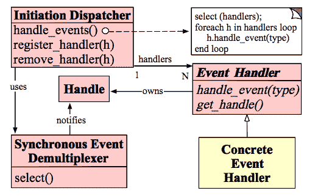
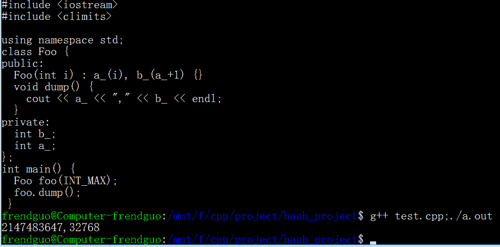

# 欢聚时代 2017 校招笔试题目（C 基础类）B 卷

## 1

使用 ping 命令测试 RTT, 请问广州到北京的平均 RTT 与下面哪个值接近

正确答案: C   你的答案: 空 (错误)

```cpp
200 ms
```

```cpp
100 ms
```

```cpp
50 ms
```

```cpp
10 ms
```

本题知识点

C++工程师 欢聚集团 2017

讨论

[uloveqian1](https://www.nowcoder.com/profile/8752356)

北京到广州大约 2200 公里左右，传播速度约 2*10⁵km，RTT 往返时延约 2200/（2*10⁵）*2

发表于 2017-09-01 14:53:09

* * *

## 2

64 位系统下有 `char * p[1];` 请问 `sizeof p` 的值是多少

正确答案: B   你的答案: 空 (错误)

```cpp
1
```

```cpp
8
```

```cpp
16
```

```cpp
32
```

本题知识点

C++工程师 欢聚集团 2017

讨论

[WaltSmith](https://www.nowcoder.com/profile/9614497)

按照数组理解。p 为数组，存放 1 个指向 char 类型的指针。在 32 为系统中指针占用 4 位，64 位系统中指针占用 8 位。故 8*1=8；若改为 char * p[4]，则结果为 8*4=32.

发表于 2017-09-17 08:22:04

* * *

[超级无敌](https://www.nowcoder.com/profile/5632406)

p 是个指针，在 32 位系统下大小为 4,64 位系统下为 8.

发表于 2017-08-31 19:41:14

* * *

## 3

如果有定义语句 int *ptr[4]，typeid(ptr).name() 结果为 "A4_Pi",

请问对 int *(ptr[4]) ， typeid(ptr).name() 输出是

正确答案: B   你的答案: 空 (错误)

```cpp
PPi
```

```cpp
A4_Pi
```

```cpp
PA4_i
```

```cpp
A4_i
```

本题知识点

C++工程师 欢聚集团 2017 C++ C 语言

讨论

[烬天玉藻前](https://www.nowcoder.com/profile/195480900)

int *ptr[4];指数组 ptr 中有 4 个元素，每个元素都是 int *类型的；*和[]对 ptr 的结合性：先和[]结合，而*和 int 结合用来修饰 ptr,所以加个括号也和之前的一样。**关于 typeid():**在 c++中，typeid 用于返回指针或引用所指对象的实际类型，它是一个操作符。
可以在运行时获知变量类型名称，可以使用 typeid(变量).name()获取。

发表于 2020-08-21 16:35:04

* * *

[牛客 670531181 号](https://www.nowcoder.com/profile/670531181)

两者等价，括号会比*的优先级高

发表于 2021-08-24 11:01:16

* * *

[超级无敌](https://www.nowcoder.com/profile/5632406)

int *ptr[4]与 int *（ptr[4]）等价。

发表于 2017-08-31 19:44:24

* * *

## 4

下面关于 inline 说法正确的是（）

正确答案: B   你的答案: 空 (错误)

```cpp
关键字 inline 是强制行为
```

```cpp
关键字 inline 只是一种编译器建议
```

```cpp
inline 不能避免函数调用时的参数传递带来的栈开销
```

```cpp
inline 在运行时生效
```

本题知识点

C++工程师 欢聚集团 2017 C 语言

讨论

[烬天玉藻前](https://www.nowcoder.com/profile/195480900)

 函数执行前有准备工作，要将实参、局部变量、返回地址以及寄存器存入栈中，然后执行函数体的代码；执行完函数体的代码后，要清理现场，把栈中的数据出栈，然后再执行该函数后面位置的代码。

 上述中压栈、出栈是消耗时间和空间的，当然了，执行函数体的代码也是要时间的。

 如果函数体代码执行时间短，那么调用函数时，压栈、出栈的比重就会上升，建议将函数定义为内联函数，那么这个函数的源码会在编译阶段就嵌入该位置，而不用去调用函数，执行压栈、出栈操作了。
类似于宏定义的展开。

A.没有强制，和 B 是矛盾关系
B.的确只是建议
C.可以避免栈开销，inline 函数直接把函数体代码嵌入到该函数位置
D.在编译时就生效了

发表于 2021-02-23 15:00:16

* * *

[北路十三号](https://www.nowcoder.com/profile/2773166)

我的理解是将宏替换升级变成内联函数。特点就是编译时进行函数体替换，加快代码执行，减少调用开销。

发表于 2017-08-31 09:37:32

* * *

[SAFELANDING007](https://www.nowcoder.com/profile/922492374)

inline 编译阶段嵌入 运行时不算调用 因此不需要栈

发表于 2022-03-15 10:00:46

* * *

## 5

下面对于友元函数描述正确的是

正确答案: C   你的答案: 空 (错误)

```cpp
友元函数的实现必须在类的内部定义
```

```cpp
友元函数是类的成员函数
```

```cpp
友元函数破坏了类的封装性和隐藏性
```

```cpp
友元函数不能访问类的私有成员
```

本题知识点

C++工程师 欢聚集团 2017 C++工程师 欢聚集团 2017

讨论

[青鸟 WD](https://www.nowcoder.com/profile/9992599)

友元函数没有 this 指针**2.1.1** 要访问非 static 成员时，需要对象做参数； **2.1.2** 要访问 static 成员或全局变量时，则不需要对象做参数；

**2.1.3 **如果做参数的对象是全局对象，则不需要对象做参数； 因为友元函数是类外的函数，所以它的声明可以放在类的私有段或公有段且没有区别。 可以直接调用友元函数，不需要通过对象或指针 **友元类** 可以声明为公有私有均可，常写为私有(把类看成一个变量) 声明类 A 是类 B 的友元类，则类 B 即可访问类 A 的所有成员，私有成员等

发表于 2017-09-17 10:55:50

* * *

[点滴快乐](https://www.nowcoder.com/profile/5634458)

友元函数的优点：能够提高效率，减少系统开销。1.在实现类之间数据共享时，例如类 A 中的函数要访问类 B 中的成员，那么类 A 中该函数就是类 B 的友元函数。2.运算符重载的某些场合需要使用友元。友元函数的缺点：友元函数破坏了封装机制，应该尽量不使用友元函数。

发表于 2017-09-05 14:30:06

* * *

## 6

请问对一个排好序的数组用二分法进行查找，时间复杂度为

正确答案: C   你的答案: 空 (错误)

```cpp
O(1)
```

```cpp
O(n)
```

```cpp
O(logn)
```

```cpp
O(nlogn)
```

本题知识点

C++工程师 欢聚集团 2017

讨论

[Mysticer](https://www.nowcoder.com/profile/771039)

二分查找:n,n/2，n/4…令 n/2*k=1\. 得 k=log2n（以 2 为为底的对数）

发表于 2017-09-12 12:02:42

* * *

## 7

下面关于 HTTP 状态码的说法哪个是正确的

正确答案: C   你的答案: 空 (错误)

```cpp
403 Forbidden, 这是一个服务器错误
```

```cpp
401 Unauthorized, 这是一个服务器错误
```

```cpp
404 Not Found, 这是一个客户端错误
```

```cpp
400 Bad Request, 这是一个服务器错误
```

本题知识点

C++工程师 欢聚集团 2017

讨论

[北路十三号](https://www.nowcoder.com/profile/2773166)

1**  信息，服务器收到请求，需要请求者继续执行操作 2**  成功，操作被成功接收并处理 3**  重定向，需要进一步的操作以完成请求 4**  客户端错误，请求包含语法错误或无法完成请求 5**  服务器错误，服务器在处理请求的过程中发生了错误

发表于 2017-08-31 10:45:45

* * *

[咿呀 0](https://www.nowcoder.com/profile/913039)

| 400 | Bad Request | 客户端请求的语法错误，服务器无法理解 |
| 401 | Unauthorized | 请求要求用户的身份认证 |
| 402 | Payment Required | 保留，将来使用 |
| 403 | Forbidden | 服务器理解请求客户端的请求，但是拒绝执行此请求 |
| 404 | Not Found | 服务器无法根据客户端的请求找到资源（网页）。通过此代码，网站设计人员可设置"您所请求的资源无法找到"的个性页面 |
| 405 | Method Not Allowed | 客户端请求中的方法被禁止 |

发表于 2017-08-31 14:41:43

* * *

## 8

linux 下使用 write 函数发送网络数据，函数返回 n(n>0),下面哪个说法正确

正确答案: A   你的答案: 空 (错误)

```cpp
本地已经发送 n 个字节到系统缓冲
```

```cpp
对端已经收到 n 个字节
```

```cpp
本地已经发送 n 个字节到网络
```

```cpp
本地发送失败
```

本题知识点

C++工程师 欢聚集团 2017 C++工程师 欢聚集团 2017

讨论

[及时行乐 z](https://www.nowcoder.com/profile/7818261)

TCP 发送方式：1.先写入 n 个数据到系统缓冲区 2.若写入的数据大于缓冲区大小，则 write 会阻塞或失败。3.直到接收到对方的确认号，系统才会把缓冲区的对应数据删除，然后通知应用程序缓冲区可用。UDP 发送方式：UDP 是以报文的形式发送的，若有一个完整的报文则立即发送，不需要对方回应，所以发送后数据就会被删除，不需要缓冲区。

发表于 2017-09-01 20:48:52

* * *

## 9

下面哪些可以用于数据交换时的序列化和反序列化

正确答案: A B C   你的答案: 空 (错误)

```cpp
protobuf
```

```cpp
thrift
```

```cpp
avro
```

```cpp
rest
```

本题知识点

C++工程师 欢聚集团 2017

## 10

声明语句为 int a[3][4];，下列表达式中与数组元素 a[1][2]等价的是（）

正确答案: B C   你的答案: 空 (错误)

```cpp
*(&a[0][0]+7)
```

```cpp
*(a[1]+2)
```

```cpp
*(a[0]+6)
```

```cpp
a[7]
```

本题知识点

C++工程师 欢聚集团 2017 C 语言

讨论

[刘提莫](https://www.nowcoder.com/profile/182927)

a[1][2] 是数组的第七个元素。。 A 选项表示数据的第八个元素

发表于 2017-09-04 00:04:59

* * *

[篮天](https://www.nowcoder.com/profile/965024956)

二维数组其实就是一维数组，a[0] == &a[0][0] 一维数组第一个元素,而 a[1][2]是 1*4+3 = 7  第 7 个元素，所以 C 对 A 错,B 选项 *(a[1]+2) = *(&a[1][0] +2) = *(&a[1][2]) = a[1][2]正确，D 选项表示错误。

发表于 2020-09-13 12:35:06

* * *

[Rayfan](https://www.nowcoder.com/profile/516555903)

a[row][col] => *(*(a + row) + col)&a[0][0] => &(*(a + 0) + 0) => int *  
a[1] = > *(a + 1) => int *
a[0] => *(a + 0) => int *int * 指针加一，会指向下一个 int

发表于 2021-03-03 16:39:55

* * *

## 11

下面哪些属于 C++的惯用法

正确答案: C D   你的答案: 空 (错误)

```cpp
SIMD
```

```cpp
SWAR
```

```cpp
IMPL
```

```cpp
RAII
```

本题知识点

C++工程师 欢聚集团 2017 C++

讨论

[找故事里的那个人](https://www.nowcoder.com/profile/772441)

IMPL 是 C++中的桥接设计模式，主要是为了隐藏数据以及减轻编译时的压力，通常的做法是另外定义一个新的类，其接口和原来的类一致，但是其数据全部隐藏在新的类中。例如我们定义 A 类，然后定义一个新类 B 和其有相同的接口，其数据成员都在新类中。引用 A 类的代码就不需要重新编译。 RAII 是英文短语的首字母缩写：Resource Acquisition Is Initialisation，这句话直译为中文的意思是： 资源获得即初始化。 这只是一个短语， 不能指望靠望文生义来了解字面背后的完整含义， 但是短语本身的确反映了重要的论点： 资源是其一， 初始化是其二。RAII 是有关资源的。 资源是一切需要分配的数量有限的资料。 比如， [存储](http://www.storworld.com/)器， 文件句柄， 网络套接字端口， 数据库连接， 以及线程池等。 基本上， 由于物理的限制， 所有的资料都是有限的。 在某些特殊的情况下， 资料由于局部的极大丰富而丧失了资源的意义， 比如沙子， 空气等。 但是在大多数情况下， 资料都是有限的， 需要我们善加管理。 资源管理的最基本形式就是善始善终。 申请了资源， 用完了， 就要归还。 在 C++程序员生活里最常见的就是内存资源， 资源管理就是内存管理： 申请了内存， 不管什么时候逻辑上完成了对这片内存的使用， 内存就要被正确地释放。 RAII 仅需少量的管理代码（对类不对对象）， 能普遍适用于各种资源对象的使用， 时间上可以控制和预测。 能为资源管理提供一个统一的模式。 RAII 是自由的， 它更多是靠程序员对规范的简单遵守（坚持使用对象而不是指针）来达到目的。  

发表于 2017-09-16 13:56:41

* * *

## 12

下面关于索引的说法哪些是正确的

正确答案: B C D   你的答案: 空 (错误)

```cpp
在 mysql 上增加索引会提高性能，最坏的情况也能与不加持平
```

```cpp
倒排索引常用于文档检索
```

```cpp
B-Tree 索引常用于数据库
```

```cpp
正确的索引可以极大加速数据查询速度
```

本题知识点

C++工程师 欢聚集团 2017

讨论

[吸着雾霾准备补考](https://www.nowcoder.com/profile/6244177)

索引结构指一个文件的信息存放在若干不连续的物理块中，系统为每个文件建立一个专用的数据结构——索引表，并将这些块的块号存放在索引表中。有点是保留了链接结构的优点，同时解决了其缺点，即能顺序存取，又能随机存取，满足了文件动态增长，插入删除的需求，也能充分利用外存空间。缺点是索引表本身带来的系统开销。 

为了提高文件的检索效率，可以采用索引方法组织文件。采用索引这种结构，逻辑上连续的文件可以存放在若干不连续的物理块中，但对于每个文件，在存储介质中除存储文件本身外，还要求系统另外建立一张索引表，索引表记录了文件信息所在的逻辑块号和与之对应的物理块号。索引表也以文件的形式存储在存储介质中，索引表的物理地址则由文件说明信息项给出。

    在很多情况下，有的文件很大，文件索引表也就较大。如果索引表的大小超过了一个物理块，可以采用间接索引（多重索引），也就是在索引表所指的物理块中存放的不是文件信息，而是装有这些信息的物理块地址。这样，如果一个物理块可装下 n 个物理块地址，则经过一级间接索引，可寻址的文件长度将变为 n×n 块。如果文件长度还大于 n×n 块，还可以进行类似的扩充，即二级间接索引。

    不过，大多数文件不需要进行多重索引，也就是说，这些文件所占用的物理块的所有块号可以放在一个物理块内。如果对这些文件也采用多重索引，则显然会降低文件的存取速度。因此，在实际系统中，总是把索引表的头几项设计成直接寻址方式，也就是这几项所指的物理块中存放的是文件信息；而索引表的后几项设计成多重索引，也就是间接寻址方式。在文件较短时，就可利用直接寻址方式找到物理块号而节省存取时间。

 索引结构既适用于顺序存取，也适用于随机存取，并且访问速度快，文件长度可以动态变化。索引结构的缺点是由于使用了索引表而增加了存储空间的开销。另外，在存取文件时需要至少访问存储器两次以上，其中，一次是访问索引表，另一次是根据索引表提供的物理块号访问文件信息。由于文件在存储设备的访问速度较慢，因此，如果把索引表放在存储设备上，势必大大降低文件的存取速度。一种改进的方法是，当对某个文件进行操作之前，系统预先把索引表放入内存，这样，文件的存取就可直接在内存通过索引表确定物理地址块号，而访问存储设备的动作只需要一次。当文件被打开时，为提高访问速度将索引表读入内存，故又需要占用额外的内存空间。

发表于 2017-09-15 22:24:12

* * *

## 13

面向对象的设计原则，下面哪些是正确的

正确答案: A B C   你的答案: 空 (错误)

```cpp
SRP（单一职责原则）就一个类而言，应该仅有一个引起它变化的原因
```

```cpp
OCP（开闭原则）软件实体应该是可以扩展的，但是不可以修改
```

```cpp
DIP（依赖倒置原则）抽象不应该依赖于细节，细节应该依赖于抽象
```

```cpp
LSP（Liskov 替换原则）基类型必须能够替换掉它们的子类型
```

本题知识点

C++工程师 欢聚集团 2017

讨论

[找故事里的那个人](https://www.nowcoder.com/profile/772441)

面向对象的七种设计原则：1.SRP：Single responsibility principle   单一职责原则又称单一功能原则，核心：解耦和增强内聚性（高内聚，低耦合）2.开闭原则（OCP：Open Closed Principle）核心：对扩展开放，对修改关闭。即在设计一个模块的时候，应当使这个模块可以在不被修改的前提下被扩展。
3.里氏替换原则（LSP：Liskov Substitution Principle）核心：1.在任何父类出现的地方都可以用他的子类来替代（子类应当可以替换父类并出现在父类能够出现的任何地方）子类必须完全实现父类的方法。在类中调用其他类是务必要使用父类或接口，如果不能使用父类或接口，则说明类的设计已经违背了 LSP 原则。2.子类可以有自己的个性。子类当然可以有自己的行为和外观了，也就是方法和属性。3.覆盖或实现父类的方法时输入参数可以被放大。即子类可以重载父类的方法，但输入参数应比父类方法中的大，这样在子类代替父类的时候，调用的仍然是父类的方法。即以子类中方法的前置条件必须与超类中被覆盖的方法的前置条件相同或者更宽松。4.覆盖或实现父类的方法时输出结果可以被缩小。4.依赖倒转原则(DIP：Dependence Inversion Principle) 别名：依赖倒置原则或依赖反转原则。核心：要依赖于抽象，不要依赖于具体的实现。（1）.高层模块不应该依赖低层模块，两者都应该依赖其抽象（抽象类或接口）
（2）.抽象不应该依赖细节（具体实现）
（3）.细节（具体实现）应该依赖抽象。5.原则五：接口分离原则(ISP：Interface Segregation Principle) 核心思想：不应该强迫客户程序依赖他们不需要使用的方法。接口分离原则的意思就是：一个接口不需要提供太多的行为，一个接口应该只提供一种对外的功能，不应该把所有的操作都封装到一个接口当中.分离接口的两种实现方法：1.使用委托分离接口。（Separation through Delegation）2.使用多重继承分离接口。（Separation through Multiple Inheritance）6.合成复用原则（CRP：Composite Reuse Principle）核心思想：尽量使用对象组合，而不是继承来达到复用的目的。该原则就是在一个新的对象里面使用一些已有的对象，使之成为新对象的一部分：新的对象通过向这些对象的委派达到复用已有功能的目的。复用的种类：1.继承 2.合成聚合.注：在复用时应优先考虑使用合成聚合而不是继承 7.迪米特原则（LOD：Law of Demeter）又叫最少知识原则，核心思想：一个对象应当对其他对象有尽可能少的了解,不和陌生人说话。（类间解耦，低耦合）意思就是降低各个对象之间的耦合，提高系统的可维护性；在模块之间只通过接口来通信，而不理会模块的内部工作原理，可以使各个模块的耦合成都降到最低，促进软件的复用。注：1.在类的划分上，应该创建有弱耦合的类；2.在类的结构设计上，每一个类都应当尽量降低成员的访问权限；3.在类的设计上，只要有可能，一个类应当设计成不变；4.在对其他类的引用上，一个对象对其它对象的引用应当降到最低；5.尽量降低类的访问权限；6.谨慎使用序列化功能；7.不要暴露类成员，而应该提供相应的访问器(属性)。

发表于 2017-09-16 14:10:37

* * *

[叶赫那拉坤](https://www.nowcoder.com/profile/1392392)

D 选项，里氏替换原则，应该是父类出现的地方都可以用子类替代

发表于 2017-09-02 08:38:01

* * *

[青鸟 WD](https://www.nowcoder.com/profile/9992599)

单一职责原则 SRP：解耦和增强内聚性（高内聚，低耦合），专注于单一的功能
开闭原则 OCP：对扩展开放，对修改关闭
里氏替换原则 LSP：在任何父类出现的地方都可以用他的子类来替代
依赖倒转原则 DIP：要依赖于抽象，不要依赖于具体的实现，抽象不应该依赖细节，细节（具体实现）应该依赖抽象。
接口分离原则 ISP：一个接口应该只提供一种对外的功能
合成复用原则 CRP: 尽量使用对象组合，而不是继承来达到复用的目的。
迪米特原则 LOD：一个对象应当对其他对象有尽可能少的了解,不和陌生人说话

发表于 2017-09-17 11:39:19

* * *

## 14

有定义如下，
```cpp
  const char *p1 = "hello";
  char *const p2 = new char[12]{'h', 'e', 'l', 'l', 'o'};
```

正确答案: A D   你的答案: 空 (错误)

```cpp
p1++;
```

```cpp
p2++;
```

```cpp
p1 = '-';
```

```cpp
*(p2+1) = '-';
```

本题知识点

C++工程师 欢聚集团 2017 C++ C 语言

讨论

[Moody..未来可期](https://www.nowcoder.com/profile/247953307)

const 离谁更近就修饰谁。

*   const char *p1 中 const 修饰 char，表示 p1 所指向的内容为常量，不可改变，但指针 p1 本身可以改变；
*   char *const p2，const 修饰 p2，表示指针 p2 是一个常量，不可改变，但 p2 所指向的内容可以改变；

编辑于 2021-03-03 16:24:07

* * *

[牛起来 66](https://www.nowcoder.com/profile/1489658)

题目估摸着在问，下列哪些操作是正确的

发表于 2017-08-31 17:11:18

* * *

[猪有 Feel](https://www.nowcoder.com/profile/1995209)

p1 内容不能变 p2 指向不能变

发表于 2017-09-10 19:47:01

* * *

## 15

下面关于缓存的说法哪些正确

正确答案: A C D   你的答案: 空 (错误)

```cpp
缓存经常用来减少磁盘读压力
```

```cpp
在大数据系统中，数据的写入量越大更新越频繁，缓存越有价值
```

```cpp
对应用做性能测试时有时需要避免缓存生效
```

```cpp
硬盘也可以用来做缓存
```

本题知识点

C++工程师 欢聚集团 2017

讨论

[殷帅](https://www.nowcoder.com/profile/5428142)

硬盘缓存，很强势！

发表于 2017-09-10 20:13:02

* * *

[黄汉韬](https://www.nowcoder.com/profile/7252447)

有人可以解释一下 B 选项为什么错了吗？

发表于 2017-11-10 21:33:38

* * *

## 16

下面关于 reactor 模式的一些说法哪些是正确的

正确答案: D   你的答案: 空 (错误)

```cpp
reactor 利用多线程来支持多个连接
```

```cpp
reactor 中有阻塞 io 调用也不会影响并发性
```

```cpp
reactor 是异步的
```

```cpp
reactor 是非阻塞的
```

本题知识点

C++工程师 欢聚集团 2017

讨论

[黄汉韬](https://www.nowcoder.com/profile/7252447)

[`daimojingdeyu.iteye.com/blog/828696`](http://daimojingdeyu.iteye.com/blog/828696)

发表于 2017-11-10 21:40:05

* * *

[找故事里的那个人](https://www.nowcoder.com/profile/772441)

reactor 模式：reactor 设计模式，是一种基于事件驱动的设计模式。Reactor 框架是 ACE 各个框架中最基础的一个框架，其他框架都或多或少地用到了 Reactor 框架。 
      在事件驱动的应用中，将一个或多个客户的服务请求分离（demultiplex）和调度（dispatch）给应用程序。在事件驱动的应用中，同步地、有序地处理同时接收的多个服务请求。 
      reactor 模式与外观模式有点像。不过，观察者模式与单个事件源关联，而反应器模式则与多个事件源关联 。当一个主体发生改变时，所有依属体都得到通知优点：   1）响应快，不必为单个同步时间所阻塞，虽然 Reactor 本身依然是同步的； 
       2）编程相对简单，可以最大程度的避免复杂的多线程及同步问题，并且避免了多线程/进程的切换开销； 
       3）可扩展性，可以方便的通过增加 Reactor 实例个数来充分利用 CPU 资源； 
       4）可复用性，reactor 框架本身与具体事件处理逻辑无关，具有很高的复用性；
缺点： 1）相比传统的简单模型，Reactor 增加了一定的复杂性，因而有一定的门槛，并且不易于调试。 
      2）Reactor 模式需要底层的 Synchronous Event Demultiplexer 支持，比如 Java 中的 Selector 支持，操作系统的 select 系统调用支持，如果要自己实现 Synchronous Event Demultiplexer 可能不会有那么高效。 
      3） Reactor 模式在 IO 读写数据时还是在同一个线程中实现的，即使使用多个 Reactor 机制的情况下，那些共享一个 Reactor 的 Channel 如果出现一个长时间的数据读写，会影响这个 Reactor 中其他 Channel 的相应时间，比如在大文件传输时，IO 操作就会影响其他 Client 的相应时间，因而对这种操作，使用传统的 Thread-Per-Connection 或许是一个更好的选择，或则此时使用 Proactor 模式。
架构图如下：                                  

发表于 2017-09-16 14:14:48

* * *

## 17

最近开源的实时流处理系统 heron 中有如下代码（节选），请写出这段代码所用到的设计模式与惯用法及其各自适用的场景或原因
```cpp c++
class PCQueue {
 public:
  PCQueue() {}
  virtual ~PCQueue() throw() {}

  PCQueue(const PCQueue& pcqueue) = delete;
  PCQueue& operator=(const PCQueue& pcqueue) = delete;

  void enqueue(void* _item);
  void* dequeue(void);

 protected:
  std::queue<void*> queue_;
  std::condition_variable cond_;
  std::mutex mutex_;
};

void PCQueue::enqueue(void* _item) {
  std::unique_lock<std::mutex> m(mutex_);
  queue_.push(_item);
  cond_.notify_one();
}

void* PCQueue::dequeue() {
  std::unique_lock<std::mutex> m(mutex_);
  while (queue_.empty()) cond_.wait(m);
  void* item = queue_.front();
  queue_.pop();
  return item;
}

你的答案

本题知识点

C++工程师 欢聚集团 2017

讨论

[AliceSnowden](https://www.nowcoder.com/profile/144511475)

lass PCQueue {
 public:
  PCQueue() {}
  virtual ~PCQueue() throw() {}
  PCQueue(const PCQueue& pcqueue) = delete;
  PCQueue& operator=(const PCQueue& pcqueue) = delete;
  void enqueue(void* _item);
  void* dequeue(void);
 protected:
  std::queue<void*> queue_;
  std::condition_variable cond_;
  std::mutex mutex_;
};
void PCQueue::enqueue(void* _item) {
  std::unique_lock<std::mutex> m(mutex_);
  queue_.push(_item);
  cond_.notify_one();
}
void* PCQueue::dequeue() {
  std::unique_lock<std::mutex> m(mutex_);
  while (queue_.empty()) cond_.wait(m);
  void* item = queue_.front();
  queue_.pop();
  return item;
}

发表于 2021-07-07 15:08:09

* * *

## 18

写一段代码展示 RAII 在 C++中的使用

你的答案

本题知识点

C++工程师 欢聚集团 2017

讨论

[锲而不舍](https://www.nowcoder.com/profile/7570901)

将资源抽象为类，用局部对象来表示资源，把管理资源的任务转化为管理局部对象的任务[`www.cnblogs.com/hsinwang/articles/214663.html`](http://www.cnblogs.com/hsinwang/articles/214663.html)

发表于 2017-09-13 10:07:48

* * *

## 19

c++11 增加了 std::memory_order，请说明 memory_order_acquire， memory_order_release 的含义

你的答案

本题知识点

C++工程师 欢聚集团 2017

讨论

[国科](https://www.nowcoder.com/profile/6348531)

[`www.cnblogs.com/lizhanzhe/p/10893016.html`](https://www.cnblogs.com/lizhanzhe/p/10893016.html) 可以参考一下这个博客

发表于 2020-04-01 16:54:53

* * *

## 20

对于下面代码片断

```
```cpp
 void dump(const std::vector<int> &vec)
 {
 cout << vec.size() << ", ";
 for (const auto &i : vec)
 std::cout << i;
 std::cout << std::endl;
 }
 std::vector<int> v{1, 2, 1, 4, 5, 6, 7};
 dump(v); // a
 auto itr = std::remove(v.begin(), v.end(), 1);
 dump(v); // b
 v.erase(itr, v.end());
 dump(v); // c
 v.erase(std::begin(v), std::end(v));
 dump(v); // d
 ```
```cpp

std::remove 算法实现如下面代码片断所示时

```
```cpp
 __first = _x0008_std::find(__first, __last, __value);
 if(__first == __last)
 return __first;
 _ForwardIterator __result = __first;
 ++__first;
 for(; __first != __last; ++__first)
 if(!(*__first == __value))
 {
 *__result = std::move(*__first);
 ++__result;
 }
 return __result;
 ```
```cpp

注释 a 处的输出为  `7, 1214567`
请给出：
注释 b 处的输出为
注释 c 处的输出为
注释 d 处的输出为

你的答案

本题知识点

C++工程师 欢聚集团 2017

讨论

[51Hz](https://www.nowcoder.com/profile/541081)

remove 并不是真正的删除，只是重新移动了元素，返回一个迭代器，指向新的终点。执行完 b，容器内容为 2456767，itr 此时指向右边第一个 6。执行 c，将 itr 到 end 之间的内容删除，剩余 24567 执行 d，全部删除

发表于 2017-09-07 21:29:59

* * *

## 21

请说明布隆过滤器的实现方式、应用场景及误判的影响

你的答案

本题知识点

C++工程师 欢聚集团 2017

## 22

请说明下面代码的输出结果

```
```cpp
 class Foo {
 public:
 Foo(int i) : a_(i), b_(a_+1) {}
 void dump() {
 cout << a_ << "," << b_ << endl;
 }
 private:
 int b_;
 int a_;
 };
 int main() {
 Foo foo(INT_MAX);
 foo.dump();
 }
 ```
```cpp

你的答案

本题知识点

C++工程师 欢聚集团 2017

讨论

[呵呵呵哒 2](https://www.nowcoder.com/profile/7014184)



发表于 2017-09-09 12:45:44

* * *

[51Hz](https://www.nowcoder.com/profile/541081)

```
2147483647,-2147483648
```cpp

发表于 2017-09-07 21:30:30

* * *

## 23

有字符串 “aabbaabb”， 写当正则表达式为 (a.*b)， (a.*?b)， (a.??b) 各自匹配到的结果

你的答案

本题知识点

C++工程师 欢聚集团 2017

讨论

[牛客 206597936 号](https://www.nowcoder.com/profile/206597936)

”aabbaabb“   ”aab“  "aab"(a.*b)  * 重复前面字符 0 次或无数次 默认贪婪匹配(a.*?b)  在量词后加？,表示非贪婪匹配(a.??)  同上，最少匹配

发表于 2021-01-20 21:12:37

* * *

[大么 M 的主人](https://www.nowcoder.com/profile/6686002)

["aabbaabb"],["aab","aab"],["aab","aab"].

发表于 2017-09-30 17:49:15

* * *

## 24

实现函数 int32_t my_strtoint32(const string& str), 将一个 10 进制的 ASCII 码字符串转换成 int32_t，支持正负号，字符串前后请允许空格, 数字串可以有前置 0 `12345 == my_strtoint32("12345");`

```
 #define UINT32_MAX 0xffffffff 
#define EINVAL 22 #define ERANGE 34 ```cpp ``` 返回值与错误码参照 <stdlib.h> strtol 说明 Return Value The strtol() function returns the result of the conversion, unless the value would underflow or overflow. If an underflow occurs, strtol() returns LONG_MIN. If an overflow occurs, strtol() returns LONG_MAX. In both cases, errno is set to ERANGE. Errors EINVAL, The given base contains an unsupported value. ERANGE, The resulting value was out of range. ```cpp </stdlib.h>
```

本题知识点

模拟 字符串 *C++工程师 欢聚集团 2017*