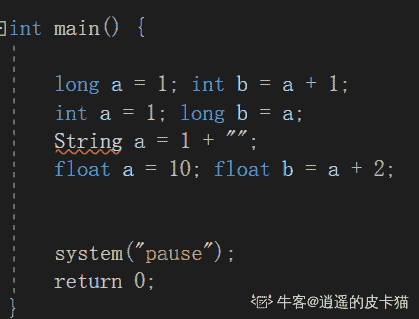

# 欢聚时代 2017 校招笔试题目（JAVA 基础类）B 卷

## 1

以下对于抽象类和接口的描述哪个是错误的

正确答案: D   你的答案: 空 (错误)

```cpp
接口所有的方法隐含的都是抽象的,而抽象类则可以同时包含抽象和非抽象的方法
```

```cpp
类可以实现很多个接口，但是只能继承一个抽象类
```

```cpp
抽象类可以在不提供接口方法实现的情况下实现接口
```

```cpp
接口是绝对抽象的，不可以被实例化。抽象类可以被实例化
```

本题知识点

Java 工程师 欢聚集团 2017

讨论

[玄学改名求 offer](https://www.nowcoder.com/profile/5261102)

自己总结的，有遗漏请私我指正，不知道为什么网上都说接口没有 Main 方法，然而我用 IDEA 和 eclipse 是可以的，不知道是不是我理解错了。

**jdk1.8 之前**

**接口**

1.多实现

2.变量类型默认且只能为为 public static final

3.函数类型默认且只能为 public，只能有 public 类型的静态成员函数

4.非静态成员函数没有方法体，静态成员函数有方法体

5.子类必须实现所有接口函数

6.可以有 main 方法；可以 new 一个接口，需要在方法体中实现所有接口函数

7.没有构造器

**抽象类**

1.单继承

2.变量类型不限（静态变量+非静态变量）

3.函数类型不限（静态函数+非静态函数）

4.非静态函数包含没有方法体的抽象函数. 有方法体的普通函数

5.子类可以不覆写父类的抽象方法，但子类也要申明为抽象类；子类可以选择覆写父类的非抽象方法

6.可以有 main 方法；不可以 new 一个抽象类

7.可以有构造器

**Jdk1.8**

**接口中可以有 default 类型的方法，实现类可以选择实现该方法**

**意义：**默认方法的主要优势是提供一种拓展接口的方法，而不破坏现有代码。另一个优势为该方法是可选的，子类可以根据不同的需求 Override 或默认实现。

发表于 2017-09-07 13:36:17

* * *

[最美蔷薇](https://www.nowcoder.com/profile/5029717)

抽象类不可以被实例化

发表于 2017-10-05 19:25:54

* * *

[安静就好](https://www.nowcoder.com/profile/7834073)

我感觉 B 不 ok,接口可以多继承接口的,可能是我太钻牛角尖了

发表于 2017-09-18 14:09:09

* * *

## 2

以下对封装的描述正确的是：

正确答案: D   你的答案: 空 (错误)

```cpp
只能对一个类中的方法进行封装，不能对属性进行封装
```

```cpp
如果子类继承了父类，对于父类中进行封装的方法，子类仍然可以直接调用
```

```cpp
封装的意义不大，因此在编码时尽量不要使用
```

```cpp
封装的主要作用在于对外隐藏内部实现细节，增强程序的安全性
```

本题知识点

Java 工程师 欢聚集团 2017 C++

讨论

[谁叫一个点](https://www.nowcoder.com/profile/3058450)

推荐回答 只能直接调用非私有的方法。如果是 private 修饰的方法，子类也是不能调用的。

发表于 2017-09-13 22:20:02

* * *

[小和尚与小狐狸](https://www.nowcoder.com/profile/923484116)

选 D

发表于 2022-01-27 15:27:35

* * *

## 3

以下关于 final 关键字说法错误的是

正确答案: A   你的答案: 空 (错误)

```cpp
final 是 java 中的修饰符，可以修饰类、接口、抽象类、方法和属性
```

```cpp
final 修饰的类肯定不能被继承
```

```cpp
final 修饰的方法可以被重载
```

```cpp
final 修饰的变量不允许被再次赋值
```

本题知识点

Java 工程师 欢聚集团 2017

讨论

[小桂子！](https://www.nowcoder.com/profile/4341267)

final 关键字不能修饰接口和抽象类，A 错

发表于 2017-09-01 10:51:33

* * *

[Cloud2049](https://www.nowcoder.com/profile/8508158)

```cpp
final 修饰的方法可以被重载,不可以被重写
```

发表于 2017-08-31 15:08:25

* * *

[爱吃米线的吴彦祖](https://www.nowcoder.com/profile/4154422)

final 关键字声明属性、方法和类的时候需要注意以下几点：
1、使用 final 声明的类不能有子类
2、使用 final 声明的方法不能被子类覆写
3、使用 final 声明的变量即为常量，常量不能修改
4、在使用 final 声明变量时，要求全部的字母大写

发表于 2017-09-17 15:42:21

* * *

## 4

以下程序的输出是：

```cpp
class PassS
 {
     public static void main(String [] args) 
     {
         PassS p = new PassS();
         p.start();
     }
     void start() 
     {
         String s1 = "slip";
         String s2 = fix(s1);
         System.out.println(s1 + " " + s2);
     }
     String fix(String s1) 
     {
         s1 = s1 + "stream";
         System.out.print(s1 + " ");
         return "stream";
     }
 }
```

正确答案: C   你的答案: 空 (错误)

```cpp
slip stream
```

```cpp
slipstream stream
```

```cpp
slipstream slip stream
```

```cpp
slipstreamslipstreamstream
```

本题知识点

Java 工程师 欢聚集团 2017

讨论

[小桂子！](https://www.nowcoder.com/profile/4341267)

start 方法中调用 fix 方法，先执行 fix 方法中的输出函数：输出 slipstream+" ",调用结束后，返回 stream，此时 s2 被赋值为 stream。接着执行输出语句：System.out.println(s1 + " "  + s2);此时 S1 的值不能被改变，因为是值传递。故 s1 输出还是 slip。故这句话输出为 slip+""+stream .所以选 C

发表于 2017-09-01 11:08:24

* * *

## 5

以下程序的输出是：

```cpp
class TT {
    public static void main(String [] args) {
        int value = -1;
        long longvalue = value & 0x00000000ffffffffL;
        System.out.print(longvalue);
    }
}
```

正确答案: C   你的答案: 空 (错误)

```cpp
-1
```

```cpp
1
```

```cpp
4294967295
```

```cpp
-4294967295
```

本题知识点

Java 工程师 欢聚集团 2017

讨论

[王璃](https://www.nowcoder.com/profile/9283955)

```cpp
1111 1111 1111 1111 1111 1111 1111 1111    （-1）

```

```cpp
0000 0000 0000 0000 1111 1111 1111 1111     {& 0x00000000ffffffffL}
0000 0000 0000 0000 1111 1111 1111 1111     0x00000000ffffffffL
```

发表于 2017-10-22 22:44:41

* * *

[天栎](https://www.nowcoder.com/profile/9164894)

计算机中 负数用补码存储

发表于 2017-09-03 18:01:01

* * *

[嘤嘤怪.](https://www.nowcoder.com/profile/4887286)

-1 在 java 中的二进制表示为 0b11111111111111111111111111111111，和十六进制的 8 个 F 按位与之后还是十六进制的 FFFFFFFF，因此是一个非常巨大的整数(int 的最大值)，所以选 C

编辑于 2017-08-30 17:56:29

* * *

## 6

现有如下类和方法：

```cpp
class A {
 public int a;
}
public void call(A aa1) {
 int b1 = 2;
 A aa2 = new A();
}
```

在方法 call 中，不存在于 Java 堆空间的值/实例有：

正确答案: A   你的答案: 空 (错误)

```cpp
b1
```

```cpp
b1，aa2，aa2.a
```

```cpp
b1，aa1.a，aa2.a
```

```cpp
b1，aa1，aa1.a，aa2，aa2.a
```

本题知识点

Java 工程师 欢聚集团 2017

讨论

[最美蔷薇](https://www.nowcoder.com/profile/5029717)

对象都是在堆空间里，而基本数据类型在栈中，对象的实例也是在堆中

发表于 2017-10-05 19:33:49

* * *

[嘤嘤怪.](https://www.nowcoder.com/profile/4887286)

对象的实例都在堆上，函数传参都是传值，哪怕是传对象，实际上也只是传对象的引用的一个副本

发表于 2017-08-30 17:57:43

* * *

[梦境迷离](https://www.nowcoder.com/profile/759736)

严格来说 对象的引用指针还是在堆栈，只有引用的内容在堆中。

编辑于 2018-02-27 16:00:03

* * *

## 7

以下关于业务异常处理写法错误的是：

```cpp
public void doBus ()throws Exception{…};
```

正确答案: C   你的答案: 空 (错误)

```cpp
public  void  test()throws Exception{ doBus();}
```

```cpp
public  void  test()throws Exception{try{ doBus();}catch(Exception e){throw new Exception(“test_exception”);}}
```

```cpp
public  void  test(){try{ doBus();}finally{}}
```

```cpp
public  void  test()throws Exception {try{ doBus();}catch(Exception e){log.error(“test_error”,e);//写日志….//各种业务处理逻辑}}
```

本题知识点

Java 工程师 欢聚集团 2017

讨论

[彩排](https://www.nowcoder.com/profile/5820999)

try 语句块可以不与 catch 一起出现，但是没有 catch 语句块时一定要有 finally 语句块，所以这题并不是因为没有 catch 才选 c；c 中调用了 doBus（）方法，抛出异常，未被捕获，所以需要在方法签名中抛出或者在进行处理

发表于 2017-09-07 21:09:44

* * *

[少壮不努力老大徒伤悲](https://www.nowcoder.com/profile/5933296)

答案错误修改了,不能误导人,哈铪

编辑于 2017-09-12 19:57:03

* * *

## 8

以下哪个方法是类 A 的合法继承方法：

```cpp
class A 
{ 
 protected int method1(int a, int b) 
 {
     return 0; 
 } 
}
```

正确答案: A   你的答案: 空 (错误)

```cpp
public int method1(int a, int b) {return 0; }
```

```cpp
private int method1(int a, int b) { return 0; }
```

```cpp
public short method1(int a, int b) { return 0; }
```

```cpp
static protected int method1(int a, int b) { return 0; }
```

本题知识点

Java 工程师

讨论

[maoger](https://www.nowcoder.com/profile/8532495)

B:重写时方法的访问权限只能相等或更大，而抛出的异常只能相等或更小；C:方法重写时，返回值类型需要相同；D:非 static 方法，重写时子类中也要是非 static 的。。而 static 方法重写时，子类中也要是 static 的。

发表于 2017-09-10 10:18:34

* * *

[sjxbdbdj](https://www.nowcoder.com/profile/2546198)

在方法重写时，方法的访问权限只能相等或者更大，返回值应该相同，抛出的异常应该更小

发表于 2017-09-12 10:54:40

* * *

[木司堇年](https://www.nowcoder.com/profile/6370964)

继承的子类覆盖父类的方法，定义其访问权限只能一样或更松

发表于 2017-09-01 18:48:17

* * *

## 9

以下哪些选项编译不过

正确答案: A   你的答案: 空 (错误)

```cpp
long a = 1;int b = a + 1;
```

```cpp
int a = 1;long b = a;
```

```cpp
String a = 1 + "";
```

```cpp
float a = 10;float b = a + 2;
```

本题知识点

Java 工程师 欢聚集团 2017 C++ C 语言

讨论

[zt_xcyk](https://www.nowcoder.com/profile/839070)

在 C++ 里面  A 是对的。

发表于 2020-08-05 15:13:16

* * *

[Cloud2049](https://www.nowcoder.com/profile/8508158)

精度和长度都不能向上兼容。float a=10;//正确，此时 10 是 int 型 float b=10.0;//错误，因为 10.0 是 double 型，float 不能向上兼容

发表于 2017-08-31 15:16:10

* * *

[逍遥的皮卡猫](https://www.nowcoder.com/profile/638768373)

S 应该是小写。。。。

编辑于 2020-10-13 09:05:22

* * *

## 10

以下输出结果正确的是：
System.out.println("3" + 2);

正确答案: B   你的答案: 空 (错误)

```cpp
5
```

```cpp
32
```

```cpp
3
```

```cpp
2
```

本题知识点

Java 工程师 欢聚集团 2017

讨论

[ZB 美丽人生](https://www.nowcoder.com/profile/5648916)

“3”+2 =》字符串 “32”

编辑于 2017-09-06 18:48:17

* * *

## 11

找出以下关于 float 的不正确的声明

正确答案: B   你的答案: 空 (错误)

```cpp
float foo=-1;
```

```cpp
float foo=1.0;
```

```cpp
float foo=2.02f;
```

```cpp
float foo=0x0123;
```

本题知识点

Java 工程师 欢聚集团 2017 Java 工程师 欢聚集团 2017

讨论

[这？](https://www.nowcoder.com/profile/9918942)

1.0 默认是 double 型。正确是 1.0f

发表于 2017-08-30 22:40:42

* * *

[fsdfsd](https://www.nowcoder.com/profile/9097671)

```cpp
float a = 1;这里的 1 是整形，当赋值给一个 float 时，存在一个隐式转换，不损失精度。
float a = 1f;1f 就是 float 类型的。
如果你这样定义 f
float f = 1.0; 
肯定会出错。 因为 1.0 默认是 double 类型的。double 范围比 float 大。会损失精度
float f = 1.0f;  这才是正确的
```

发表于 2017-09-03 11:24:26

* * *

[菜鸟腾飞](https://www.nowcoder.com/profile/8242197)

浮点型默认是 double 类型，如果要指明 float 后面添加 f F

发表于 2017-09-09 16:15:36

* * *

## 12

以下哪个是 Java 线程 Thread 启动的方法

正确答案: C   你的答案: 空 (错误)

```cpp
run()
```

```cpp
execute()
```

```cpp
start()
```

```cpp
go()
```

本题知识点

Java 工程师 欢聚集团 2017 Java 工程师 欢聚集团 2017

讨论

[里暮色](https://www.nowcoder.com/profile/6067871)

run 不能启动？run 启动的线程只是在主线程中循序执行吧

编辑于 2017-09-01 11:20:33

* * *

[Smile_Hjj](https://www.nowcoder.com/profile/5588952)

run() 不开启线程，仅仅是对象调用方法。start() 开启线程，并让 jvm 调用 run()在开启的线程中执行

发表于 2017-09-06 16:53:30

* * *

## 13

可以让多个线程顺序执行的方法是

正确答案: D   你的答案: 空 (错误)

```cpp
sleep()
```

```cpp
wait()
```

```cpp
interrupt()
```

```cpp
join()
```

本题知识点

Java 工程师 欢聚集团 2017 Java 工程师 欢聚集团 2017

讨论

[LuckilyStar](https://www.nowcoder.com/profile/9019079)

**sleep()**

使当前线程（即调用该方法的线程）暂停执行一段时间，让其他线程有机会继续执行，但它并不释放对象锁。也就是说如果有 synchronized 同步快，其他线程仍然不能访问共享数据。注意该方法要捕捉异常。

例如有两个线程同时执行(没有 synchronized)一个线程优先级为 MAX_PRIORITY，另一个为 MIN_PRIORITY，如果没有 Sleep()方法，只有高优先级的线程执行完毕后，低优先级的线程才能够执行；但是高优先级的线程 sleep(500)后，低优先级就有机会执行了。

总之，sleep()可以使低优先级的线程得到执行的机会，当然也可以让同优先级、高优先级的线程有执行的机会。

**2、join()**

join()方法使调用该方法的线程在此之前执行完毕，也就是等待该方法的线程执行完毕后再往下继续执行。注意该方法也需要捕捉异常。

**3、yield()**

该方法与 sleep()类似，只是不能由用户指定暂停多长时间，并且 yield（）方法只能让同优先级的线程有执行的机会。

发表于 2017-08-30 16:33:47

* * *

## 14

下面那些类不是线程安全的

正确答案: D   你的答案: 空 (错误)

```cpp
HashTable
```

```cpp
ConcurrentHashMap
```

```cpp
StringBuffer
```

```cpp
HashMap
```

本题知识点

Java 工程师 欢聚集团 2017 Java 工程师 欢聚集团 2017

讨论

[铃儿想叮当](https://www.nowcoder.com/profile/9498681)

StringBuffer 为什么是线程安全的？

发表于 2017-10-15 17:18:58

* * *

[梦境迷离](https://www.nowcoder.com/profile/759736)

推荐
ConcurrentHashMap 代替 hashtable  前者使用 CAS 【比较 and 交换】
其实可以看出 JDK1.8 版本的 ConcurrentHashMap 的数据结构已经接近 HashMap，相对而言，ConcurrentHashMap 只是增加了同步的操作来控制并发  
从 JDK1.7 版本的 ReentrantLock+Segment+HashEntry，到 JDK1.8 版本中 synchronized+CAS+HashEntry+红黑树,相对而言，总结如下思考： 
JDK1.8 的实现降低锁的粒度，JDK1.7 版本锁的粒度是基于 Segment 的，包含多个 HashEntry，而 JDK1.8 锁的粒度就是 HashEntry（首节点） 
JDK1.8 版本的数据结构变得更加简单，使得操作也更加清晰流畅，因为已经使用 synchronized 来进行同步，所以不需要分段锁的概念，也就不需要 Segment 这种数据结构了，由于粒度的降低，实现的复杂度也增加了 
JDK1.8 使用红黑树来优化链表，基于长度很长的链表的遍历是一个很漫长的过程，而红黑树的遍历效率是很快的，代替一定阈值的链表，这样形成一个最佳拍档 
JDK1.8 为什么使用内置锁 synchronized 来代替重入锁 ReentrantLock，我觉得有以下几点： 
因为粒度降低了，在相对而言的低粒度加锁方式，synchronized 并不比 ReentrantLock 差，在粗粒度加锁中 ReentrantLock 可能通过 Condition 来控制各个低粒度的边界，更加的灵活，而在低粒度中，Condition 的优势就没有了 
JVM 的开发团队从来都没有放弃 synchronized，而且基于 JVM 的 synchronized 优化空间更大，使用内嵌的关键字比使用 API 更加自然 
在大量的数据操作下，对于 JVM 的内存压力，基于 API 的 ReentrantLock 会开销更多的内存，虽然不是瓶颈，但是也是一个选择依据 

编辑于 2018-02-27 16:07:19

* * *

[Smile_Hjj](https://www.nowcoder.com/profile/5588952)

**ConcurrentHashMap****的锁分段技术**

HashTable 容器在竞争激烈的并发环境下表现出效率低下的原因，是因为所有访问 HashTable 的线程都必须竞争同一把锁，那假如容器里有多把锁，每一把锁用于锁容器其中一部分数据，那么当多线程访问容器里不同数据段的数据时，线程间就不会存在锁竞争，从而可以有效的提高并发访问效率，这就是 ConcurrentHashMap 所使用的锁分段技术，首先将数据分成一段一段的存储，然后给每一段数据配一把锁，当一个线程占用锁访问其中一个段数据的时候，其他段的数据也能被其他线程访问。

发表于 2017-09-06 17:07:18

* * *

## 15

在一个数据集合中，经常需要做数据查找的操作(不考虑线程安全)，请问使用哪个数据结构最合适：

正确答案: C   你的答案: 空 (错误)

```cpp
HashTable
```

```cpp
LinkedList
```

```cpp
HashMap
```

```cpp
ConcurrentHashMap
```

本题知识点

Java 工程师 欢聚集团 2017

讨论

[阿呆 45](https://www.nowcoder.com/profile/9869053)

我老师曾经说过:叫我们永远记住 hashmap 是最快的查询方法没有之一！

发表于 2017-09-26 17:59:48

* * *

[李林林学长](https://www.nowcoder.com/profile/574172)

Hashmap 是一个最常用的 Map,它根据键的 HashCode 值存储数据,根据键可以直接获取它的值，具有很快的访问速度，遍历时，取得数据的顺序是完全随机的。HashMap 最多只允许一条记录的键为 Null;允许多条记录的值为 Null;HashMap 不支持线程的同步，即任一时刻可以有多个线程同时写 HashMap;可能会导致数据的不一致。如果需要同步，可以用 Collections 的 synchronizedMap 方法使 HashMap 具有同步的能力，或者使用 ConcurrentHashMap。
Hashtable 与 HashMap 类似,它继承自 Dictionary 类，不同的是:它不允许记录的键或者值为空;它支持线程的同步，即任一时刻只有一个线程能写 Hashtable,因此也导致了 Hashtable 在写入时会比较慢。

发表于 2017-09-03 14:24:45

* * *

[迷茫的漂](https://www.nowcoder.com/profile/1417764)

可以参照 个人整理的博客，面试中常见的集合：
[`blog.csdn.net/striveb/article/details/82593768`](https://blog.csdn.net/striveb/article/details/82593768)

发表于 2018-09-14 15:04:46

* * *

## 16

下面循环 Map，错误的是

正确答案: B   你的答案: 空 (错误)

```cpp
for (Map.Entry<Object, Object> entry : map.entrySet()){}
```

```cpp
while(map.hasNext()){}
```

```cpp
for (Object key : map.keySet()){}
```

```cpp
for (Object value : map.values()){}
```

本题知识点

Java 工程师 欢聚集团 2017

讨论

[山衔寒漪](https://www.nowcoder.com/profile/4593622)

hasNext（）是 Iterator 的= = 。。

发表于 2017-09-01 17:12:05

* * *

[helloworld…](https://www.nowcoder.com/profile/6199195)

[Set](http://tool.oschina.net/uploads/apidocs/jdk_7u4/java/util/Set.html)<[K](http://tool.oschina.net/uploads/apidocs/jdk_7u4/java/util/Map.html)> keySet()-->Returns a [Set](http://tool.oschina.net/uploads/apidocs/jdk_7u4/java/util/Set.html) view of the keys contained in this map. [Set](http://tool.oschina.net/uploads/apidocs/jdk_7u4/java/util/Set.html)<[Map.Entry](http://tool.oschina.net/uploads/apidocs/jdk_7u4/java/util/Map.Entry.html)<[K](http://tool.oschina.net/uploads/apidocs/jdk_7u4/java/util/Map.html),[V](http://tool.oschina.net/uploads/apidocs/jdk_7u4/java/util/Map.html)>> entrySet()-->Returns a [Set](http://tool.oschina.net/uploads/apidocs/jdk_7u4/java/util/Set.html) view of the mappings contained in this map. [Collection](http://tool.oschina.net/uploads/apidocs/jdk_7u4/java/util/Collection.html)<[V](http://tool.oschina.net/uploads/apidocs/jdk_7u4/java/util/Map.html)> values()-->Returns a [Collection](http://tool.oschina.net/uploads/apidocs/jdk_7u4/java/util/Collection.html) view of the values contained in this map. MAP 中没有这个方法-->hasNext()

```cpp
参考：http://tool.oschina.net/apidocs/apidoc?api=jdk_7u4
```

编辑于 2017-08-31 17:22:45

* * *

[大智爱吃鱼](https://www.nowcoder.com/profile/822717)

因为 Map 里面不包含迭代器

发表于 2017-09-03 15:49:01

* * *

## 17

下面说法正确的是

正确答案: D   你的答案: 空 (错误)

```cpp
LinkedList 是使用了链表结果，特点是查找效率高
```

```cpp
在高并发，多线程的情况下要使用高效率 HashMap
```

```cpp
ArrayList 是一个动态数组能自动扩展，所以设置初始长度没必要
```

```cpp
Set 集合内元素不能重复，使用 equals()来判断元素是否相等
```

本题知识点

Java 工程师 欢聚集团 2017

讨论

[傻不拉几的小傻瓜](https://www.nowcoder.com/profile/7856076)

我就想知道 c 为什么错了

发表于 2017-09-17 15:56:23

* * *

[maoger](https://www.nowcoder.com/profile/8532495)

看了半天，原来 D 选项的“使用 equals()来判断元素是否相等”，是指存入元素时判断 set 中是否已经含有该元素。。。我还以为是 contains 的意思呢。。看来还是语文没学好。。

发表于 2017-09-05 21:25:10

* * *

[我是一只小老虎](https://www.nowcoder.com/profile/5739512)

hashmap 不是线程安全的。

发表于 2017-09-11 10:16:33

* * *

## 18

关于 ArrayList，以下说法错误的是

正确答案: B   你的答案: 空 (错误)

```cpp
ArrayList 是容量可变的集合
```

```cpp
ArrayList 是线程安全的集合
```

```cpp
ArrayList 的元素是有序的
```

```cpp
ArrayList 可以存储重复的元素
```

本题知识点

Java 工程师 欢聚集团 2017

讨论

[阿里开发小哥](https://www.nowcoder.com/profile/1943603)

```cpp
List 接口下面有两个实现，一个是 ArrayList，一个是 Vector。ArrayList 不是线程安全的，Vector 是线程安全的（实现有 synchronized 关键字）。
```

发表于 2017-09-01 17:32:47

* * *

[yan_zhao](https://www.nowcoder.com/profile/9717519)

ArrayList 是按照你插入的顺序来存储元素的。

发表于 2018-04-28 01:06:19

* * *

[SFISH](https://www.nowcoder.com/profile/5225341)

ArrayList 为什么是有序的？

发表于 2018-04-24 08:50:45

* * *

## 19

有关于反射说法错误的是

正确答案: D   你的答案: 空 (错误)

```cpp
使用 Class.forName("com.yy.xxx")方法获取类
```

```cpp
class.newInstance()实例化一个对象
```

```cpp
class.getDeclaredMethods()获取方法列表
```

```cpp
method.invoke(obj, args)不能执行私有方法
```

本题知识点

Java 工程师 欢聚集团 2017

讨论

[菜鸟腾飞](https://www.nowcoder.com/profile/8242197)

反射技术使整个类的所有属性方法完***露，所以无论是不是 private 修饰都可以获取，但是这都连续好几回这种情况了

发表于 2017-09-09 16:19:10

* * *

[红警专家](https://www.nowcoder.com/profile/4503546)

这里考察的是反射的知识点。method.invoke(obj ,args)与是否能执行私有方法没有直接关系，首先获取方法列表时候用 getDeclaredMethods()是会获取所有方法（公***私有的），使用 getmethod 只会获得公共方法。如果用 getmethod 获取了但想获取私有方法，可以使用 method.setAccessible(true)是执行暴力破解，不建议使用，破坏代码的封装性！

发表于 2017-09-20 19:44:35

* * *

[我是一只小老虎](https://www.nowcoder.com/profile/5739512)

执行私有方法时需要先调用 method.setAccessible(true);

发表于 2017-09-11 10:33:52

* * *

## 20

下面说法错误的是

正确答案: A   你的答案: 空 (错误)

```cpp
通过代理 Proxy.xxx（）来执行被代理类的方法
```

```cpp
java 动态代理一般是用来做切面编程的，在被代理类的方法执行前后加入一些代码
```

```cpp
动态代理中是通过反射的来执行被代理类的方法
```

```cpp
java 动态代理的代理类需要继承 InvocationHandler 接口
```

本题知识点

Java 工程师 欢聚集团 2017 Java 工程师 欢聚集团 2017

讨论

[指尖凉 hsz](https://www.nowcoder.com/profile/4365542)

D 不应该是实现接口吗，之前做过一题类继承接口就是错的

发表于 2017-09-01 22:39:01

* * *

[Smile_Hjj](https://www.nowcoder.com/profile/5588952)

```cpp
A:
public interface Subject   
{ public void doSomething();   
} public class RealSubject implements Subject   
{ public void doSomething()   
  {   
    System.out.println( "call doSomething()" );   
  }   
} public class ProxyHandler implements InvocationHandler   
{ private Object proxied; public ProxyHandler( Object proxied )   
  { this.proxied = proxied;   
  } public Object invoke( Object proxy, Method method, Object[] args ) throws Throwable   
  { //在转调具体目标对象之前，可以执行一些功能处理 //转调具体目标对象的方法 return method.invoke( proxied, args); //在转调具体目标对象之后，可以执行一些功能处理 }    
} 

测试代码： import java.lang.reflect.InvocationHandler; 
```

```cpp
import java.lang.reflect.Method; import java.lang.reflect.Proxy; import sun.misc.ProxyGenerator; import java.io.*; public class DynamicProxy   
{ public static void main( String args[] )   
  {   
    RealSubject real = new RealSubject();   
    Subject proxySubject = (Subject)Proxy.newProxyInstance(Subject.class.getClassLoader(), new Class[]{Subject.class}, new ProxyHandler(real));

    proxySubject.doSomething(); //执行被***类的方法；而 Proxy.newProxyInstance()方法用于得到这个接口的实例 //write proxySubject class binary data to file  createProxyClassFile();   
  } public static void createProxyClassFile()   
  {   
    String name = "ProxySubject"; byte[] data = ProxyGenerator.generateProxyClass( name, new Class[] { Subject.class } ); try {   
      FileOutputStream out = new FileOutputStream( name + ".class" );   
      out.write( data );   
      out.close();   
    } catch( Exception e )   
    {   
      e.printStackTrace();   
    }   
  }   
} 
```

D: 称述错误，应该是  java 动态***的***类需要继承 InvocationHandler 接口

发表于 2017-09-06 19:04:46

* * *

[橙小白](https://www.nowcoder.com/profile/5330600)

看不懂这题

发表于 2017-10-11 19:51:35

* * *

## 21

查找字符串中重复的字符串，并将重复字符串及对应的重复次数打印出来：

你的答案

本题知识点

Java 工程师 欢聚集团 2017

讨论

[求个 offer。。。](https://www.nowcoder.com/profile/996530055)

```cpp
import java.util.ArrayList;
import java.util.List;
import java.util.Scanner;

    public class Main
    {
    public static void main(String[] args)
    {
    Scanner sc=new Scanner(System.in);
    String str=sc.nextLine();
    List<String> list=new ArrayList<>();
    //控制长度
    for(int a=1;a<str.length()/2;a++){
        //控制初始点
        for(int b=0;b<=str.length()-a;b++){
            String c=str.substring(b, b+a);
            list.add(c);
        }
    }
    //控制比较的初始点
    for(int e=0;e<list.size();e++){
        //控制比较的对象
        int num=1;
        for(int f=e+1;f<list.size();f++){
            if(list.get(e).equals(list.get(f))){
                num++;
            }
        }
        if(num>=2){
            System.out.print("重复字符串:"+list.get(e));
            System.out.println("重复次数:"+num);            
        }
    }
    }
}

```

发表于 2018-08-09 16:27:07

* * *

[bugfree 丶](https://www.nowcoder.com/profile/659609)

样例都不给一个，醉了，从字面分析有几个答案好像错了

发表于 2018-04-26 16:39:31

* * *

[大傻 1111](https://www.nowcoder.com/profile/4425930)

```cpp
import java.util.*;
public class Main {     public static void main(String args[]) {         String str = "eateatkittyhahadogdoghahabilibilieat";         findStr(str);     }     public static void findStr(String str) {         for(int i=str.length()-1;i>0;i--) {             String substr = "";             HashMap<String,Integer> hm = new HashMap<String,Integer>();             for(int j=0;j<str.length()-i&&j+i<str.length();j++) {                 substr = str.substring(j, j+i+1);                 if(!hm.containsKey(substr)) {                     hm.put(substr, 1);                 }else {                     int c = hm.get(substr);                     c++;                     hm.put(substr, c);                 }             }                          Iterator ite = hm.entrySet().iterator();             while(ite.hasNext()) {                 Map.Entry<String, Integer> entry= (Map.Entry<String, Integer>)ite.next();                 if(entry.getValue()>1)                     System.out.println(entry.getKey()+" "+entry.getValue());             }         }     }

}

```

发表于 2018-02-26 20:23:54

* * *

## 22

试写出一个 BlockingQueue 队列接口的简单实现，接口定义如下：

```cpp
public interface BlockingQueue{
     public void put(E e) throws InterruptedException;
     publi cE take() throws InterruptedException;
}
```

要求如下：1) 队列有最大长度限制

2) 线程安全

3) 生产线程通过 put 方法往队列添加数据，当队列满时候挂起等待

4) 消费线程通过 take 方法往队列拿出数据，当队列空时挂起等待

5) 不使用第三方库和 java.util.concurrent.BlockingQueue 接口下的实现类

你的答案

本题知识点

Java 工程师 欢聚集团 2017

讨论

[fsdfsd](https://www.nowcoder.com/profile/9097671)

package 欢聚时代.BlockingQueueImpl;

import java.util.Vector;
import java.util.concurrent.locks.Condition;
import java.util.concurrent.locks.ReentrantLock;

public class BlockingQueueImpl<E> implements BlockingQueue<E>{
    private final int Max_Length = 100;  //队列最大长度限制
    private Vector<E> vector = new Vector<E>(Max_Length);  //模拟队列存储元素的线程安全集合
    private ReentrantLock lock = new ReentrantLock(true);  //互斥锁
    private Condition notFull = lock.newCondition();  
    private Condition notempty = lock.newCondition();
    @Override
    public void put(E e) throws InterruptedException {
        // TODO Auto-generated method stub
        lock.lockInterruptibly();  //获取锁
        int size = vector.size();
        try {
            if(size==Max_Length)
                notFull.await();  //进入阻塞状态
            else
            {
                vector.add(e);
                notempty.signal();  //唤醒一个等待线程
            }
        } finally {
            // TODO: handle finally clause
            lock.unlock();  //释放锁
        }

    }

    @Override
    public E take() throws InterruptedException {
        // TODO Auto-generated method stub
        lock.lockInterruptibly();  //获取锁
        E e = null;
        try {
            if(vector.size()==0)
                notempty.await();  //进入阻塞状态
            else
            {
                e = vector.get(vector.size()-1);
                notFull.signal();  //唤醒一个等待线程
                return e;
            }
            return e;
        } finally {
            // TODO: handle finally clause
            lock.unlock();  //释放锁
        }
    }

}

发表于 2017-09-04 23:27:27

* * *

## 23

现有一个消息体，里面 String ， int 和 List 型的数据，数据结构定义如下：

```cpp
public class MyObject implements Serializable {
    public String a;
    publicint b;
    public List c;
}
```

有一个发送端接口方法，负责将消息体转化成一个 byte 数组 return 出去以便发送：

```cpp
public interface Sender {
    public byte[] send(MyObject myObject);
}
```

有一个接收端接口方法，负责接受一个 byte 数组并将 byte 数组还原成相应的消息体对象，最终 return 出去（里面的成员变量值要相同）

```cpp
public interface Receiver {
    public MyObject receive(byte[] bytes);
}
```

1) 试写出 Sender 和 Receiver 的一个具体代码实现

2) 请针对以下方面，试描述一些你认为可行的协议设计优化方案（即二进制数据和结构体对象的相互转换的设计优化方案）；或试描述你在 1 ）小题中实现或使用的协议在设计上如何符合如下特征 ：

a) 相同的结构体对象转换成更小的二进制数据，方便传输

b) 二进制数据和结构体对象如何能更快地进行相互转换

c) 如何使协议具有可扩展性，可以自动兼容不同结构的结构体

你的答案

本题知识点

Java 工程师 欢聚集团 2017

讨论

[2FA0](https://www.nowcoder.com/profile/6103754)

```cpp
public class AbstractSender implements Sender {

	@Override
	public byte[] send(MyObject myObject) {
		// TODO Auto-generated method stub
		// 按照一定的格式序列化
		byte[] temp = null;
		try (ByteArrayOutputStream byteArrayOutputStream = new ByteArrayOutputStream();
				ObjectOutputStream objectOutputStream = new ObjectOutputStream(byteArrayOutputStream);) {
			objectOutputStream.writeObject(myObject);
			temp = byteArrayOutputStream.toByteArray();
		} catch (IOException e) {
			// TODO Auto-generated catch block
			e.printStackTrace();
		}
		return temp;
	}

}

public class AbstractReceiver implements Receiver {

	@Override
	public MyObject receive(byte[] bytes) {
		MyObject temp=null;
		// TODO Auto-generated method stub
		try {
			ObjectInputStream objectInputStream=new ObjectInputStream(new ByteArrayInputStream(bytes));
			temp=(MyObject)objectInputStream.readObject();
		} catch (IOException | ClassNotFoundException e) {
			// TODO Auto-generated catch block
			e.printStackTrace();
		}
		return temp;
	}

}

```

发表于 2017-09-04 15:22:11

* * *

[眉毛密过发](https://www.nowcoder.com/profile/204442994)

public class Sender  implement Sender {    public byte[] send(MyObject myObject){       Class myObject=myObject.getClass();       Object[] Fileds=myObject.getFileds();       for(Object Filed:Fileds){             Byte sendFiled=sendFiled.toString.getByte();            Filed = (Byte) sendFiled;      }      return Fileds;   }}//下面肯定错啦。。。public class Receiver implement Receiver{    public MyObject receive(byte[] bytes){           String[] strings=new String[byte,length];           Class MyObject = MyObject .getClass();           Object[] Fileds=MyObject .getFileds();           for(int i=0;i<bytes.length;i++){                String byte2String=bytes.toString();                Fileds[i]= byte2String;          }       return MyObject ;   }}//纯手动撸代码，见谅

发表于 2019-09-18 23:51:10

* * *

[患者](https://www.nowcoder.com/profile/1428333)

public class Reseive {
    public static void main(String[] args) throws IOException {
        DatagramSocket ds = new DatagramSocket(8000);
        /********************接收数据************************/
        byte []b = new byte[1024] ;

        DatagramPacket dp = new DatagramPacket(b, b.length);

        //接收
        ds.receive(dp);

        //打印数据
        System.out.println(new String(dp.getData(),0,dp.getLength()));

        /********************发送数据***************************/
        DatagramPacket dpsend = new DatagramPacket("当然行啊".getBytes(),
                "当然行啊".getBytes().length,
                InetAddress.getByName("192.168.4.51"), 9000);
        ds.send(dpsend);

        ds.close();
    }
}
public class Sender {
    public static void main(String[] args) throws IOException {
        DatagramSocket ds = new DatagramSocket(9000);

        /*********************发送信息*********************/
        DatagramPacket dp = new DatagramPacket("可以么你".getBytes(),
                "可以么你".getBytes().length,
                InetAddress.getByName("192.168.4.51"),8000);

        //发送
        ds.send(dp);

        /********************接收信息*********************/
        byte []buf = new byte [1024] ;
        DatagramPacket dpreseive = new DatagramPacket(buf, buf.length);
        //接收
        ds.receive(dpreseive);
        //打印
        System.out.println(new String(dpreseive.getData(),0,
                dpreseive.getLength()));

        ds.close();
    }
}

发表于 2017-10-21 19:29:33

* * *