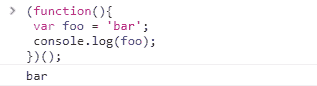

# 欢聚时代 2017 校招笔试题目（web 前端类）B 卷

## 1

下面一段程序，最后输出 i 的值是多少？(     )

```cpp
var i = 10;
for(var i = 0; i < 5; i++){
 i += 2;
}
console.log(i);
```

正确答案: D   你的答案: 空 (错误)

```cpp
10
```

```cpp
12
```

```cpp
5
```

```cpp
6
```

本题知识点

前端工程师 欢聚集团 2017

讨论

[Orange。](https://www.nowcoder.com/profile/608812)

js 没有块级作用域，for 循环里的 i = 0 会覆盖 i =10

发表于 2017-08-31 18:30:36

* * *

[欲言。](https://www.nowcoder.com/profile/6445044)

2019 前来挖坟~

```cpp
var a = 1;
var a = 2;
console.log(a); // 2

var b = 3;
var b;
console.log(b); // 3

var c = 1;
let c = 3;
// Uncaught SyntaxError: Identifier 'c' has already been declared
```

编辑于 2019-10-03 19:00:24

* * *

## 2

下面一段程序，最后输出 foo 的值是多少？(     )

```cpp
(function(){
 var foo = 'bar';
 console.log(foo);
})();
```

正确答案: D   你的答案: 空 (错误)

```cpp
程序报错
```

```cpp
undefined
```

```cpp
null
```

```cpp
bar
```

本题知识点

前端工程师 欢聚集团 2017

讨论

[Abners](https://www.nowcoder.com/profile/8130952)

这是匿名函数，就按照和平时的函数声明没有什么区别，这样定义函数的好处是不会泄露全局变量附上一张运行的结果：chrome

发表于 2018-03-19 15:06:49

* * *

[盘古先生](https://www.nowcoder.com/profile/5364151)

foo 变量被复制为字符串？或者字符？你们再仔细看看，这是不合法赋值

发表于 2017-09-30 12:06:50

* * *

[小**2018](https://www.nowcoder.com/profile/5355123)

bar 啊

发表于 2017-08-31 11:45:22

* * *

## 3

下面哪些不是 Javascript 的基础数据类型？

正确答案: C E F H J   你的答案: 空 (错误)

```cpp
Undefined
```

```cpp
Null
```

```cpp
Array
```

```cpp
String
```

```cpp
Function
```

```cpp
Date
```

```cpp
Number
```

```cpp
Object
```

```cpp
Boolean
```

```cpp
RegExp
```

本题知识点

前端工程师 欢聚集团 2017

讨论

[暮宿落花间](https://www.nowcoder.com/profile/3193197)

答案有错吧，Object 不是基本数据类型，和 Array 一样是引用类型啊

发表于 2017-08-31 13:33:19

* * *

[晓寒 yee](https://www.nowcoder.com/profile/323672407)

javascript 中有 5 中数据类型（也称为基本数据类型）：Undefined、Null、Boolean、Number 和 String,还有一种复杂数据类型——object,object 本质是由一组键值对组成的。

发表于 2019-07-29 18:20:28

* * *

## 4

下面对 CDN 表述错误的有那些？

正确答案: B D   你的答案: 空 (错误)

```cpp
CDN 是一种分布式网络存储
```

```cpp
CDN 服务器质量比程序服务器要好，所以才速度快
```

```cpp
可以使用 CDN 对抗 DDOS 攻击
```

```cpp
CDN 无法加速动态程序
```

本题知识点

前端工程师 欢聚集团 2017

讨论

[Month 丶](https://www.nowcoder.com/profile/7400867)

A:CDN 的全称是 Content Delivery Network，即内容分发网络，CDN 技术采取了分布式网络缓存结构，是一种分布式网络存储。B:错 C:集群抗攻击是 CDN 的特点之一。D:许多人认为 CDN 无法加速动态程序，只能加速静态程序。但其实 CDN 是可以加速动态程序的，只是通常没有人那么做。

发表于 2017-12-05 17:27:39

* * *

[Orange。](https://www.nowcoder.com/profile/608812)

CDN 的全称是 Content Delivery Network，即[内容分发网络](https://baike.baidu.com/item/%E5%86%85%E5%AE%B9%E5%88%86%E5%8F%91%E7%BD%91%E7%BB%9C)。  不是分布式网络存储。

发表于 2017-08-31 18:33:03

* * *

## 5

在 javascript 里，下列选项中不属于数组方法的是

正确答案: A   你的答案: 空 (错误)

```cpp
length()
```

```cpp
sort()
```

```cpp
concat()
```

```cpp
reverse()
```

本题知识点

前端工程师 欢聚集团 2017

讨论

[牛客 681863 号](https://www.nowcoder.com/profile/681863)

length 是属性不是方法

发表于 2017-09-08 08:43:53

* * *

[~一个人聆听、音乐](https://www.nowcoder.com/profile/6553169)

length  //是获取数组元素个数的属性 concat（） //连接两个或者更多的数组，并返回结果 sort（）  //对数组元素进行排序 reverse()  //对数组进行颠倒元素顺序

发表于 2017-11-05 11:55:23

* * *

## 6

[“1", "2", "3"].map(parseInt)的执行结果是？

正确答案: D   你的答案: 空 (错误)

```cpp
["1", "2", "3"]
```

```cpp
[1, 2, 3]
```

```cpp
[0, 1, 2]
```

```cpp
其他
```

本题知识点

前端工程师 欢聚集团 2017

讨论

[SSShen.☺☺☺](https://www.nowcoder.com/profile/4407951)

```cpp

	["1","2","3"].map(parseInt);

	// 你可能觉的会是[1, 2, 3]

	// 但实际的结果是 [1, NaN, NaN]

	// 通常使用 parseInt 时,只需要传递一个参数.但实际上,parseInt 可以有两个参数.第二个参数是进制数.可以通过语句"alert(parseInt.length)===2"来验证.

	// map 方法在调用 callback 函数时,会给它传递三个参数:当前正在遍历的元素, 元素索引, 原数组本身.

	// 第三个参数 parseInt 会忽视, 但第二个参数不会,也就是说,parseInt 把传过来的索引值当成进制数来使用.从而返回了 NaN.

	/*

	//应该使用如下的用户函数 returnInt

	function returnInt(element){

	 return parseInt(element,10);

	}

	["1", "2", "3"].map(returnInt);

	// 返回[1,2,3]

	*/

```

发表于 2017-09-04 16:35:54

* * *

[阿胜 4K](https://www.nowcoder.com/profile/8887390)

```cpp
parseInt("1", 0);
parseInt("2", 1);
parseInt("3", 2);

parseInt(string, radix); // 把左边的按照 radix 进制, 转成数
var new_array = arr.map(parseInt); // 根据 map 函数的用法等价与下面这样
parseInt(currentValue, index, array); // 对应于原题相当于这样
parseInt("1", 0, ["1", "2", "3"]);
parseInt("2", 1, ["1", "2", "3"]);
parseInt("3", 2, ["1", "2", "3"]);
// 而我们根据 parseInt 函数的语法, 得知最后一个参数将直接被忽略
// 于是原题, 相当于这样
parseInt("1", 0); // 这是特例, 按照 0 进制转成数, 直接得本身
parseInt("2", 1); // 直接 NaN, 因为计数的进制至少也是 2 进制
parseInt("3", 2); // 也是 NaN, 右边参数是 2, 大家千万不要理解成
// 把 10 进制的 3 转成 2 进制是多少? No, 大错特错.

// 正确的理解是, 右边参数是 2, 函数会认为左边的字符串参数是由 0, 1
// 等组成的 2 进制数, 结果发现出现了 3, 无法转换, 结果就是 NaN
// 像这样才能正常输出 console.log(parseInt("10", 2)); // 2
```

[mdn parseInt()](https://developer.mozilla.org/en-US/docs/Web/JavaScript/Reference/Global_Objects/parseInt)
[mdn Array.prototype.map()](https://developer.mozilla.org/en-US/docs/Web/JavaScript/Reference/Global_Objects/Array/map)

编辑于 2017-09-11 15:40:03

* * *

[暮宿落花间](https://www.nowcoder.com/profile/3193197)

map 有三个参数 val, index, arrparseInt 要两个参数，所以执行的是 parseInt(val, index)

发表于 2017-08-31 11:35:37

* * *

## 7

下面代码执行后，foo.x 的值是 ？(     )

```cpp
var foo = {n: 1};
var bar = foo;
foo.x = foo = {n: 2};
```

正确答案: D   你的答案: 空 (错误)

```cpp
1
```

```cpp
2
```

```cpp
程序报错
```

```cpp
其他
```

本题知识点

前端工程师 欢聚集团 2017

讨论

[无ˇ戏](https://www.nowcoder.com/profile/8644090)

赋值是从右到左的，但不要被绕晕了， 其实很简单，从运算符优先级来考虑

```cpp
a.x = a = {n:2};
```

.运算优先于=赋值运算，因此此处赋值可理解为

1.  声明 a 对象中的 x 属性，用于赋值，此时 b 指向 a，同时拥有未赋值的 x 属性
2.  对 a 对象赋值，此时变量名 a 改变指向到对象{n:2}
3.  对步骤 1 中 x 属性，也即 a 原指向对象的 x 属性，也即 b 指向对象的 x 属性赋值

赋值结果：

```cpp
a => {n: 2}
b => {n: 1, x: {n: 2 } }
```

[`segmentfault.com/q/1010000002637728`](https://segmentfault.com/q/1010000002637728) [xelz](https://segmentfault.com/u/xelz)的答案

编辑于 2017-09-13 22:20:32

* * *

[风萧萧梦也潇潇](https://www.nowcoder.com/profile/3048579)

```cpp
var foo = {n: 1};
var bar = foo;
foo.x = foo = {n: 2};
//foo.x 的值为 undefined
//foo 的值为{n:2}
//bar 的值为{n:1,x:{n:2}}
```

我来解释一下为什么 foo.x 的值为 undefined。首先 foo={n:2}的意思大家都懂，foo 赋值为{n:2}，那前面的 foo.x 哪？要知道在运行第三行代码之前，foo 和 bar 指向相同的对象（即{n:1}），也就是说在第三行进行属性赋值的对象是原来的{n:1}，而非后来完成赋值的 foo，所以也就没构成 foo 包含 foo.x，foo.x 又指向 foo 的环。

编辑于 2017-09-07 20:43:10

* * *

[Orange。](https://www.nowcoder.com/profile/608812)

1,2 行 foo 和 bar 都指向对象{n: 1}3 行先讲 foo 指向对象{n: 2},再把 foo 的值赋给 foo.x 就是把对象{n: 2}的引用赋给 foo.x 对象{n: 2}的引用是存在的，但是没有初始化，所以是 undefined

发表于 2017-08-31 18:39:40

* * *

## 8

关于 SVG 和 CANVAS，下面陈述正确的有?

正确答案: D F   你的答案: 空 (错误)

```cpp
SVG 做动画性能要优于 CANVAS
```

```cpp
CANVAS 做动画性能要优于 SVG
```

```cpp
SVG 产生的 DOM 数量比 CANVAS 要少
```

```cpp
CANVAS 产生的 DOM 数量比 SVG 要少
```

```cpp
CANVAS 可以使用 CSS 设置动画样式
```

```cpp
SVG 可以使用 CSS 设置动画样式
```

本题知识点

前端工程师 欢聚集团 2017 CSS

讨论

[雪月风花](https://www.nowcoder.com/profile/5551520)

 SVG 与 Canvas 的区别
     SVG
         不依赖分辨率
         支持事件绑定
         大型渲染区域的程序(例如百度地图)
         不能用来实现网页游戏
    Canvas
         依赖分辨率
         不支持事件绑定
         最合适网页游戏
         保存为".jpg"格式的图片

发表于 2017-10-03 14:21:59

* * *

[牛客 594283 号](https://www.nowcoder.com/profile/594283)

成功避开所有正确答案

发表于 2017-09-04 10:47:53

* * *

[bong_Ju](https://www.nowcoder.com/profile/2371308)

SVG SVG 是一种使用 XML 描述 2D 图形的语言。 SVG 基于 XML，这意味着 SVG DOM 中的每个元素都是可用的。您可以为某个元素附加 JavaScript 事件处理器。 在 SVG 中，每个被绘制的图形均被视为对象。如果 SVG 对象的属性发生变化，那么浏览器能够自动重现图形。 Canvas Canvas 通过 JavaScript 来绘制 2D 图形。 Canvas 是逐像素进行渲染的。 在 canvas 中，一旦图形被绘制完成，它就不会继续得到浏览器的关注。如果其位置发生变化，那么整个场景也需要重新绘制，包括任何或许已被图形覆盖的对象。 Canvas 与 SVG 的比较 下表列出了 canvas 与 SVG 之间的一些不同之处。 Canvas 依赖分辨率 不支持事件处理器 弱的文本渲染能力 能够以 .png 或 .jpg 格式保存结果图像 最适合图像密集型的游戏，其中的许多对象会被频繁重绘 SVG 不依赖分辨率 支持事件处理器 最适合带有大型渲染区域的应用程序（比如谷歌地图） 复杂度高会减慢渲染速度（任何过度使用 DOM 的应用都不快） 不适合游戏应用

编辑于 2017-09-04 16:46:14

* * *

## 9

下述可正确注释 html 代码的有？

正确答案: C   你的答案: 空 (错误)

```cpp
// <div></div>
```

```cpp
# <div></div>
```

```cpp
<!-- <div></div> -->
```

```cpp
/* <div></div> */
```

本题知识点

前端工程师 欢聚集团 2017 HTML

讨论

[🐑201710251044789](https://www.nowcoder.com/profile/2192705)

css 用

```cpp
/* <div></div> */
```

js 用

```cpp
// <div></div>
```

html 用

```cpp
<!-- <div></div> -->
```

发表于 2017-12-01 23:14:51

* * *

[卷不动](https://www.nowcoder.com/profile/443525402)

```cpp
<!--  -->是 HTML 的注释标签,使用 < 和 > 是符合 HTML 标签语法规则的。 /* */是 CSS 的注释标签
/* */（注释代码块）、//（注释单行）是 JS 的注释标签。
```

发表于 2021-08-02 22:08:57

* * *

[RNGYusy](https://www.nowcoder.com/profile/584895771)

多选题，，，解析的时候变不定项是啥意思。。。

发表于 2021-07-28 08:51:16

* * *

## 10

下述片段中，el 指向的 dom 是？ (     )

```cpp
html:
<div id=”foo”>
<p id=”foo”></p>
</div>
javascript:
var el = document.getElementById('foo');
```

正确答案: C   你的答案: 空 (错误)

```cpp
<div id=”foo”></div>
```

```cpp
<p id=”foo”></p>
```

```cpp
null
```

本题知识点

前端工程师 欢聚集团 2017 HTML

讨论

[吉](https://www.nowcoder.com/profile/510754)

你以为这道题考察 id 选择问题吗？呵呵哒，考察的是双引号是中文还是英文书写的！！！不信你试试！坑爹题目！

```cpp
<!DOCTYPE html>
<html>
<head>
    <title></title>

</head>
<body>

<!-- <div id="foo">
<p id="foo"></p>
</div> -->

<div id=”foo”>
<p id=”foo”></p>
</div>

<script type="text/javascript">
        var el = document.getElementById('foo');
        console.log(el);
    </script>
</body>
</html>
```

编辑于 2017-09-17 11:31:16

* * *

[高桥凉茶](https://www.nowcoder.com/profile/805006241)

？？？？？？？？？？？？？？？？？？？？？我人裂开了这个引号

发表于 2020-10-13 16:35:05

* * *

[椰岛椰树](https://www.nowcoder.com/profile/9495630)

我 console 出来是 null

发表于 2017-09-09 11:00:49

* * *

## 11

前端页面分别由哪三层构成？

你的答案

本题知识点

前端工程师 欢聚集团 2017

讨论

[.1139](https://www.nowcoder.com/profile/6948791)

html css js 还有比我更简单的答案么

发表于 2017-09-06 08:43:17

* * *

[九年义务教育已毕业](https://www.nowcoder.com/profile/293695668)

所谓的 MVC 结构

发表于 2018-10-11 16:08:57

* * *

[吉](https://www.nowcoder.com/profile/510754)

估计是送分题吧

发表于 2017-09-17 11:33:01

* * *

## 12

用 CSSHack 写出 IE6、7、8 下的 width:10px？

你的答案

本题知识点

前端工程师 欢聚集团 2017

讨论

[蠢蠢的](https://www.nowcoder.com/profile/8079848)

IE6：_width:10px;IE7:*width:10px;IE8:width:10px\9;

发表于 2017-09-05 14:10:49

* * *

[欲言。](https://www.nowcoder.com/profile/6445044)

2019 了用 PostCSS 了我还需要记忆这些 hack 方法吗?

发表于 2019-10-03 19:36:23

* * *

[岛马实况](https://www.nowcoder.com/profile/1726264)

\9： IE6 IE7 IE8

*： IE6 IE7

_： IE6

*+： IE7 所以直接 IE6: _width: 10px;IE7: +width: 10px;IE8:   width: 10px/9;

发表于 2018-06-09 10:44:47

* * *

## 13

设置 CSS 属性 float 的值为（ ） 时可取消元素的浮动。

你的答案

本题知识点

前端工程师 欢聚集团 2017

讨论

[布拉德·皮蛋](https://www.nowcoder.com/profile/1450806)

none

发表于 2017-09-10 10:01:47

* * *

## 14

内联元素和块元素的区别是 （ ） 。

你的答案

本题知识点

前端工程师 欢聚集团 2017

讨论

[石壹笑](https://www.nowcoder.com/profile/2851715)

```cpp
块级元素会独占一行,默认情况下,其宽度自动填满其父元素宽度.

  行内元素不会独占一行,相邻的行内元素会排列在同一行里,直到一行排不下,才会换行,其宽度随元素的内容而变化.　另外

  块级元素可以设置 width,height 属性.行内元素设置 width,height 属性无效，它的长度高度主要根据内容决定.

  块级元素即使设置了宽度,仍然是独占一行.

  块级元素可以设置 margin 和 padding 属性.

  行内元素的 margin 和 padding 属性,水平方向的 padding-left,padding-right,margin-left,margin-right 都产生边距效果,但竖直方向的 padding-top,padding-bottom,margin-top,margin-bottom 却不 会产生边距效果.

  块级元素对应于 display:block

  行内元素对应于 display:inline
```

发表于 2017-09-01 17:51:51

* * *

[岛马实况](https://www.nowcoder.com/profile/1726264)

块级元素(block)特性：

*   总是独占一行，表现为另起一行开始，而且其后的元素也必须另起一行显示;
*   宽度(width)、高度(height)、内边距(padding)和外边距(margin)都可控制;

内联元素(inline)特性：

*   和相邻的内联元素在同一行;
*   宽度(width)、高度(height)不可改变，就是里面文字或图片的大小;
*   内联元素的 margin-left / margin-right 及 padding-left / padding-rigtht 是可以控制的，所以可以通过这 4 个属性来控制内联元素的**宽度**。
*   内联元素的内部也可以放块级元素标签，而且内部的块级元素标签会撑大外部的内联标签，所以可以通过放块元素来控制内联元素的高度

发表于 2018-06-09 10:49:10

* * *

## 15

在页面的 head 标签内，使用可以让移动设备的页面宽度等于设备的宽度 。

你的答案

本题知识点

前端工程师 欢聚集团 2017

讨论

[Orange。](https://www.nowcoder.com/profile/608812)

```cpp
<meta  name="viewport"  content="width=device-width"/>
```

发表于 2017-08-31 18:52:38

* * *

[岛马实况](https://www.nowcoder.com/profile/1726264)

```cpp
<meta name="viewport" content="width=device-width, initial-scale=1" />
```

发表于 2018-06-09 10:50:57

* * *

## 16

请写出获取客户端系统当前时间时间戳的代码：_（ ） 。

你的答案

本题知识点

前端工程师 欢聚集团 2017

讨论

[牛币](https://www.nowcoder.com/profile/6374653)

```cpp
Date.now() || new Date().getTime()
```

发表于 2017-09-13 09:36:05

* * *

[岛马实况](https://www.nowcoder.com/profile/1726264)

```cpp
Date.now() || new Date().getTime();
```

发表于 2018-06-09 10:51:58

* * *

[废弃账号](https://www.nowcoder.com/profile/5848479)

1.    Date.now()2.    new Date().getTime()3.    +new Date()

编辑于 2018-04-20 14:27:30

* * *

## 17

使用 （ ） 可以将 JSON 格式的数据转换为字符串格式。

你的答案

本题知识点

前端工程师 欢聚集团 2017

讨论

[让我笑](https://www.nowcoder.com/profile/3386505)

```cpp
JSON.stringify
```

发表于 2017-09-17 14:13:55

* * *

## 18

圆角的 CSS3 代码是： （ ） 。

你的答案

本题知识点

前端工程师 欢聚集团 2017

讨论

[肖炎](https://www.nowcoder.com/profile/9518143)

border-radius:100%;

发表于 2017-09-28 10:58:53

* * *

[让我笑](https://www.nowcoder.com/profile/3386505)

```cpp
border-radius=50%
```

发表于 2017-09-17 14:16:15

* * *

## 19

Gecko、Webkit、Tridentr 的私有样式前缀分别是 _（ ）_。

你的答案

本题知识点

前端工程师 欢聚集团 2017

讨论

[liyn](https://www.nowcoder.com/profile/7372466)

-moz，-webkit，-ms

发表于 2017-09-07 07:19:09

* * *

## 20

请写出一个立即调用的匿名函数 _（ ）_。

你的答案

本题知识点

前端工程师 欢聚集团 2017

讨论

[肖炎](https://www.nowcoder.com/profile/9518143)

(function(){alert("立即调用的匿名函数")})()

发表于 2017-09-28 11:00:40

* * *

[张柱华](https://www.nowcoder.com/profile/5558690)

(function(){ })()

发表于 2017-10-27 11:14:28

* * *

[让我笑](https://www.nowcoder.com/profile/3386505)

```cpp
(function(){console.log(1)})() 
```

发表于 2017-09-17 14:20:26

* * *

## 21

用 CSS 分别定义 IE6、7、8 的 width 属性，使其在 IE6 下的值为 10px，IE7 为 20px，IE8 为 30px？

你的答案

本题知识点

前端工程师 欢聚集团 2017

讨论

[蠢蠢的](https://www.nowcoder.com/profile/8079848)

{width:30px\9;*width:20px;_width:10px;}对么？

发表于 2017-09-05 14:16:18

* * *

[张柱华](https://www.nowcoder.com/profile/5558690)

 { width: 30px\9; +width: 20px; _width: 10px; }

发表于 2017-10-27 11:14:17

* * *

[一只大恐龙](https://www.nowcoder.com/profile/8124467)

width:30px\9;*width:20px;_width:10px;

发表于 2017-09-06 09:24:45

* * *

## 22

px、em、rem 的区别是什么？

你的答案

本题知识点

前端工程师 欢聚集团 2017

讨论

[肖炎](https://www.nowcoder.com/profile/9518143)

px:像素，绝对大小。逻辑像素 em:当前父元素字体的大小 rem:相对于 body，html 最顶层字体大小

发表于 2017-09-28 11:02:51

* * *

[张柱华](https://www.nowcoder.com/profile/5558690)

px 的值是固定的。
 em 的值不是固定的，em 会继承父级元素的字体大小，并按值进行倍率计算。 
 rem 和 em 的计算方法一致，但是 rem 会从 html 节点继承，rem 是 root em 的缩写。[`blog.csdn.net/liyangbai/article/details/77917378`](http://blog.csdn.net/liyangbai/article/details/77917378) 

发表于 2017-10-27 11:15:36

* * *

## 23

从视觉上隐藏一个 dom 元素，既不考虑隐藏后是否占位，说说你所知道的所有方法。

你的答案

本题知识点

前端工程师 欢聚集团 2017

讨论

[石壹笑](https://www.nowcoder.com/profile/2851715)

1、display:none;2、visibility: hidden;3、width:0;height:0;4、position:absolute;top:-200%;(left:-200%)5、opacity:06、clip-path:polygon(0,0,0,0,0,0,0,0)

编辑于 2017-09-17 14:32:24

* * *

[岛马实况](https://www.nowcoder.com/profile/1726264)

1.  display: none;
2.  visibility: hidden;
3.  width: 0;height: 0;
4.  position: absolute;  top: -999px;
5.  opacity: 0;  filter:alpha(opacity=0);
6.  clip-path: polygon(0 0,0 0,0 0,0 0);

发表于 2018-06-09 11:03:29

* * *

[喵呜～这里是蓝星球嘛？](https://www.nowcoder.com/profile/7257393)

1\. display:none2.visibility: hidden3.opacity: 04.z-index: -99995.width:0; height: 0;6.position:.....

发表于 2018-02-28 18:01:57

* * *

## 24

有如下一段 css 和 html 结构，最终#box 的宽度和高度分别是多少？

Html 部分：

```cpp
<div id="box"></div>
```

CSS 部分：

```cpp
#box { width: 100px; height: 50px; margin: 5px 2px 3px; padding:
  3px 2px 1px; border: 3px solid #000; }
```

你的答案

本题知识点

前端工程师 欢聚集团 2017

讨论

[Orange。](https://www.nowcoder.com/profile/608812)

```cpp
#box { 
  width: 100px; 
  height: 50px; 
  margin: 5px 2px 3px 2px; /*左边距自动补全为右边距*/
  padding:3px 2px 1px 2px; /*左边距自动补全为右边距*/
  border: 3px solid #000; 
}
```

IE 盒子模型宽度 100+2+2=104px ,盒子模型高度 50+5+3=58px ;元素实际宽度（不包含 margin）100px,实际高度 50pxw3c 盒子模型宽度 100+2+2+3+3+2+2=114px ,盒子模型高度 50+5+3+3+3+3+1=68px ;元素实际宽度 100+3+3+2+2=110px,实际高度 50+3+3+3+1=60px

编辑于 2017-08-31 19:38:24

* * *

[牛客 6440059 号](https://www.nowcoder.com/profile/6440059)

宽度：width100px+padding2px*2+border3px*2=110px 高度：height50px+paddingtop3px+paddingbottom1px+border3px*2=60px

发表于 2017-12-16 14:44:28

* * *

[张柱华](https://www.nowcoder.com/profile/5558690)

不包括 margin

发表于 2017-10-27 11:20:03

* * *

## 25

说说你所知道解决跨域问题的方案，越多越好。

你的答案

本题知识点

前端工程师 欢聚集团 2017

讨论

[HelloHello233](https://www.nowcoder.com/profile/5754127)

[`www.cnblogs.com/hellohello/p/7511922.html`](http://www.cnblogs.com/hellohello/p/7511922.html)

发表于 2017-09-17 13:46:00

* * *

[石壹笑](https://www.nowcoder.com/profile/2851715)

JSONPCORS 通过修改 document.domain 来跨子域使用 window.name 来进行跨域使用 HTML5 中新引进的 window.postMessage 方法来跨域传送数据

发表于 2017-09-01 18:15:12

* * *

## 26

请写出一个让元素旋转一周的动画关键帧。

你的答案

本题知识点

前端工程师 欢聚集团 2017

讨论

[肖炎](https://www.nowcoder.com/profile/9518143)

```cpp
<div id="rotate"></div>
@keyframes rotate{
0%{

```
transform:rotate(0deg)
```cpp

}

100%{

transform:rotate(360deg)}}

#rotata { 

animation:

```
rotate 2s linear 
```cpp

}
```

发表于 2017-09-28 11:14:24

* * *

[Orange。](https://www.nowcoder.com/profile/608812)

```cpp
<!DOCTYPE html>
<html lang="en">
<head>
    <meta charset="UTF-8">
    <title>旋转帧</title>
</head>
<style type="text/css">
    .box{
        width: 200px;
        height: 200px;
        background-color: red;
        border-top: 5px solid black;
        animation:myfirst 5s;  
    }
    @keyframes myfirst
    {
        from {transform: rotate(0deg);}
        to {transform: rotate(360deg);}
    }
</style>
<body>
<div class="box"></div>   
</body>
</html>
```

发表于 2017-08-31 19:07:38

* * *

## 27

如果有以下数组（[0,2,3,4,4,0,2]），需要去重，请写出如何实现

你的答案

本题知识点

前端工程师 欢聚集团 2017

讨论

[ZAZA2121221](https://www.nowcoder.com/profile/8598229)

function test(arr){    var res = [];
    for(var i=0;i<arr.length;i++){        if(res.indexOf(arr[i] !==-1)){            continue;
        }
        res.push(arr[i]);
    }
    return res;
]

发表于 2017-09-28 20:11:55

* * *

[肖炎](https://www.nowcoder.com/profile/9518143)

let set1=new Set ([0,2,3,4,4,0,2]);[...set];

发表于 2017-09-28 11:16:38

* * *

[李啊李](https://www.nowcoder.com/profile/2292869)

[...new Set([0,2,3,4,4,0,2])]

发表于 2017-09-21 00:13:36

* * *

## 28

使用快速排序算法，对[3,23,66,32,2,77,45,87,64,34,33]进行由小到大的排序。

你的答案

本题知识点

前端工程师 欢聚集团 2017

讨论

[Orange。](https://www.nowcoder.com/profile/608812)

```cpp
function quickSort(arr){
    if(arr.length<=1){
        return arr;
    }
    var pivotIndex = Math.floor(arr.length/2);
    var pivot = arr.splice(pivotIndex,1)[0];
    var left = [],
        right = [];
    arr.forEach(function(item){
        if(item < pivot){
            left.push(item);
        }else{
            right.push(item);
        }
    });
    return quickSort(left).concat([pivot], quickSort(right));
}
console.log(quickSort([3,23,66,32,2,77,45,87,64,34,33]));
//[ 2, 3, 23, 32, 33, 34, 45, 64, 66, 77, 87 ]
```

发表于 2017-08-31 19:09:02

* * *

[欲言。](https://www.nowcoder.com/profile/6445044)

```cpp
function quickSort (arr) {
    if (arr.length <= 1) return arr;

    const mid = arr.splice(0, 1)[0];

    const left = [];
    const right = [];

    arr.forEach(item => {
        item < mid ? left.push(item) : right.push(item);
    });

    return [...quickSort(left), mid, ...quickSort(right)];
}
```

编辑于 2019-10-03 20:06:43

* * *

[Donnalyn](https://www.nowcoder.com/profile/1920662)

var  arr = [3,23,66,32,2,77,45,87,64,34,33];
arr.sort(function(a,b){if(a>b){return 1;}if(a<b){return -1}});

发表于 2018-09-06 20:05:40

* * *