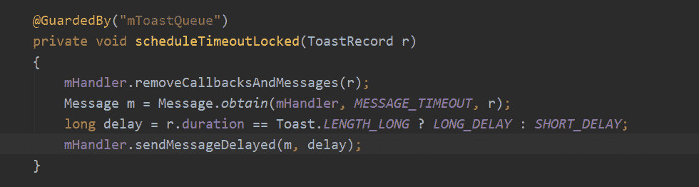

# 欢聚时代 2017 校招笔试题目（Android 工程师类）B 卷

## 1

使用 AIDL 完成远程 service 方法调用下列说法不正确的是

正确答案: A   你的答案: 空 (错误)

```cpp
aidl 对应的接口名称不能与 aidl 文件名相同
```

```cpp
aidl 的文件的内容类似 java 代码
```

```cpp
创建一个 Service（服务），在服务的 onBind(Intent intent)方法中返回实现了 aidl 接口的对象
```

```cpp
aidl 对应的接口的方法前面不能加访问权限修饰符
```

本题知识点

安卓工程师 欢聚集团 2017

## 2

在多个应用中读取共享存储数据时，需要用到 query()方法，这是哪个对象的方法

正确答案: A   你的答案: 空 (错误)

```cpp
ContentResolver
```

```cpp
ContentProvider
```

```cpp
Cursor
```

```cpp
SQLiteHelper
```

本题知识点

安卓工程师 欢聚集团 2017

## 3

下列哪些语句关于内存回收的说明是正确的?

正确答案: B   你的答案: 空 (错误)

```cpp
程序员必须创建一个线程来释放内存
```

```cpp
内存回收程序负责释放无用内存
```

```cpp
内存回收程序允许程序员直接释放内存
```

```cpp
内存回收程序可以在指定的时间释放内存对象
```

本题知识点

安卓工程师 欢聚集团 2017

## 4

下列有关一个 Java 文件的叙述，正确的是？

正确答案: B   你的答案: 空 (错误)

```cpp
可以有 2 个以上 package 语句
```

```cpp
可以有 2 个以上 import 语句
```

```cpp
可以有 2 个以上 public 类
```

```cpp
只能有 1 个类定义
```

本题知识点

安卓工程师 欢聚集团 2017

讨论

[罗罗罗罗罗](https://www.nowcoder.com/profile/4021649)

B
解析：一个 java 文件中，package 语句只能有一个，而且必须是第一行。一个 java 文件中，可以有多个 import 语句。
一个 java 文件中可以有多个类，但是只能有一个类是 public 类。（ps：若有一个类是 public 类，那么 java 文件的名字必须与这个 public 类的名字相同；若没有 public 类，则与其中一个类名相同即可。）

发表于 2017-09-17 16:28:48

* * *

## 5

在如下所示的类 Test 中，共有（   ）个构造方法。

```cpp
public class Test
 {
 private int x;
 public Test(){
 x=35;
 }
 public void Test(double f){
 this.x=(int)f;
 }
 public Test(String s){}
 }
```

正确答案: C   你的答案: 空 (错误)

```cpp
0
```

```cpp
1
```

```cpp
2
```

```cpp
3
```

本题知识点

安卓工程师 欢聚集团 2017

讨论

[大路条条](https://www.nowcoder.com/profile/2970580)

public  void  Test(double  f)是迷惑项  他是普通方法  不是构造方法

发表于 2017-09-02 12:50:03

* * *

## 6

下面关于 final 变量描述错误的是

正确答案: C   你的答案: 空 (错误)

```cpp
final 修饰的原生类型变量可以安全的在多线程环境下进行共享，不需要额外的同步开销
```

```cpp
接口中声明的所有变量本身是 final 的
```

```cpp
JVM 和 Java 应用不会缓存 final 变量
```

```cpp
可以向声明为 final 的集合对象增加，删除或者改变内容
```

本题知识点

安卓工程师 欢聚集团 2017

讨论

[哈哈哈呵呵呵](https://www.nowcoder.com/profile/9179217)

final 关键字提高了性能。JVM 和 Java 应用都会缓存 final 变量。 final 变量可以安全的在多线程环境下进行共享，而不需要额外的同步开销。 使用 final 关键字，JVM 会对方法、变量及类进行优化。

发表于 2017-09-06 09:23:09

* * *

[咸鱼吧，后浪！](https://www.nowcoder.com/profile/1365895)

> final 关键字提高了性能。JVM 和 Java 应用都会缓存 final 变量。 final 变量可以安全的在多线程环境下进行共享，而不需要额外的同步开销。 使用 final 关键字，JVM 会对方法、变量及类进行优化。

发表于 2017-09-16 14:44:18

* * *

## 7

以下哪个类型是基本数据类型

正确答案: A   你的答案: 空 (错误)

```cpp
byte
```

```cpp
String
```

```cpp
Integer
```

```cpp
Float
```

本题知识点

安卓工程师 欢聚集团 2017

讨论

[ytroom](https://www.nowcoder.com/profile/3029895)

A 数据类型分为 primitive type(基本类型) 和 reference type(引用类型)基本类型包括:    1.byte short int long    2.float double    3.char    4.boolean 引用类型包括    数组,对象的引用等等 

发表于 2017-09-11 22:22:01

* * *

[QuewangLiu](https://www.nowcoder.com/profile/419323)

A 基本数据类型包括数值类型和字符类型，BCD 都是类

发表于 2017-09-06 20:58:06

* * *

[crimsonSmash](https://www.nowcoder.com/profile/9409751)

选 B
原始数据类型
a.number 数字类型
b.string 字符串类型
c.boolean 布尔类型
d.null 空值类型
e.underfined 未定义类型
f.object 对象类型

发表于 2017-08-31 22:29:21

* * *

## 8

阅读代码回答运行结果

```cpp
public classMainActivity extends Activity implements OnClickListener
 {
 private Button mBtnLogin = (Button) findViewById(R.id.btn_login);
 private TextView mTextViewUser;
 @Override
 protected void onCreate(BundlesavedInstanceState)
 {
 super.onCreate(savedInstanceState);
 setContentView(R.layout.activity_main);
 mTextViewUser = (TextView) findViewById(R.id.textview_user);
 mBtnLogin.setOnClickListener(this);
 new Thread()
 {
 @Override
 public void run()
 {
 mTextViewUser.setText(10);
 }
 }.start();
 }
 @Override
 public void onClick(View v)
 {
 mTextViewUser.setText(20);
 }
 }
```

正确答案: C   你的答案: 空 (错误)

```cpp
Resources$NotFoundException
```

```cpp
ViewRootImpl$CalledFromWrongThreadException
```

```cpp
NullPointerException
```

```cpp
运行正常，mTextViewUser 组件上显示内容为 10
```

本题知识点

安卓工程师 欢聚集团 2017

讨论

[喃喃自语](https://www.nowcoder.com/profile/7690280)

哈哈哈哈哈 fvb 在最上面

发表于 2017-09-05 02:53:14

* * *

## 9

使用 Toast 提示时,关于提示时长,下面说法正确的是

正确答案: A   你的答案: 空 (错误)

```cpp
显示时长默认只有 2 种设置
```

```cpp
可以自定义显示时长
```

```cpp
传入 30 时,提示会显示 30 秒钟
```

```cpp
当自定义显示时长时,比如传入 30,程序会抛出异常
```

本题知识点

安卓工程师 欢聚集团 2017

讨论

[米小饭♡](https://www.nowcoder.com/profile/216164006)

从源码中可以看出，仅指定为 Toast.LENGTH_LONG 的时候为 LONG_DELAY, 否则为 SHORT_DELAY,因此不会抛出异常也无法指定时长

发表于 2018-08-05 13:00:13

* * *

[RKGG 爱吃鱼](https://www.nowcoder.com/profile/8686443)

现在自定义时间好像没有作用，目前默认的只有 long、short 两种

发表于 2017-10-12 15:32:10

* * *

[判断题](https://www.nowcoder.com/profile/6085587)

以前可以自定义时长，现在只有原来的两种

发表于 2017-09-06 07:48:13

* * *

## 10

哪个关键字可以对对象加互斥锁？

正确答案: B   你的答案: 空 (错误)

```cpp
transient
```

```cpp
synchronized
```

```cpp
serialize
```

```cpp
volatile
```

本题知识点

安卓工程师 欢聚集团 2017

讨论

[牛客最菜](https://www.nowcoder.com/profile/2365703)

**transient** 关键字用于在类序列化时，有些属性不想序列化到制定目的时添加。  transient     只能修饰变量，不能修饰方法和类，被 transient 修饰的变量不能序列化**synchronized **同步锁，保证同一时间只有一个线程能访问共享资源。**serialize 序列化**
**volatile  **程度较轻的的 synchronized，锁的两种特性是互斥和可见性，volatile 之具有可见性

发表于 2018-02-13 21:28:53

* * *

## 11

算法的时间复杂度是指

正确答案: C   你的答案: 空 (错误)

```cpp
执行算法程序所需要的时间
```

```cpp
算法程序的长度
```

```cpp
算法执行过程中所需要的基本运算次数
```

```cpp
算法程序中的指令条数
```

本题知识点

安卓工程师 欢聚集团 2017

## 12

产生系统死锁的原因可能是由于

正确答案: C   你的答案: 空 (错误)

```cpp
进程释放资源
```

```cpp
一个进程进入死循环
```

```cpp
多个进程竞争资源出现了循环等待
```

```cpp
多个进程竞争共享型设备
```

本题知识点

安卓工程师 欢聚集团 2017

讨论

[伯安 2_](https://www.nowcoder.com/profile/826429)

可能导致死锁的四个必要条件有 循环等待，互斥，占有并等待，非剥夺。进程释放资源不会导致死锁，排除 A 选项，而进程自己进入死循环只能产生饥饿，饥饿可能由一个进程导致，而死锁一定要有 2 个或 2 个以上的进程才会导致。排除 B 选项，设备分配方式分为 独立分配方式， 共享方式 ，虚拟方式，共享设备适合于独立分配方式和共享分配方式，独立分配方式容易引发死锁，共享设备允许多个进程申请使用，故不会造成死锁

发表于 2019-08-13 17:13:04

* * *

[乌索普长鼻子](https://www.nowcoder.com/profile/4816421)

若系统中存在多个进程，它们中的每一个进程都占用了某种资源而又都在等待其中另一个进程所占用的资源，那么这种等待永远都不能结束，就称为系统出现了“死锁”。

发表于 2018-01-16 16:15:07

* * *

## 13

关于 AlertDialog 描述错误的是

正确答案: D   你的答案: 空 (错误)

```cpp
show()方法只显示对话框
```

```cpp
AlertDialog.Builder 的 create() 和 show()方法都返回 AlertDialog 对象
```

```cpp
AlertDialog 不能直接用 new 关键字构建对象,而必须使用其内部类 Builder
```

```cpp
create()方法创建并显示对话框
```

本题知识点

安卓工程师 欢聚集团 2017

讨论

[hahec](https://www.nowcoder.com/profile/3050648)

```cpp
5.1.1 的源码
Creates a AlertDialog with the arguments supplied to this builder and Dialog.show()'s the dialog. 
990
991        public AlertDialog show() {
992            AlertDialog dialog = create();
993            dialog.show();
994            return dialog;
995        }
996    }
997    
998} 
```

发表于 2017-09-25 17:12:55

* * *

[小么小二郎耶](https://www.nowcoder.com/profile/3139667)

A 应该也不对，show 既可以创建也可以显示

发表于 2017-09-13 15:35:34

* * *

## 14

下列说法正确的是

正确答案: A   你的答案: 空 (错误)

```cpp
JAVA 程序的 main 方法必须写在类里面
```

```cpp
JAVA 程序中可以有多个 main 方法
```

```cpp
JAVA 程序中类名必须与文件名一样
```

```cpp
JAVA 程序的 main 方法中如果只有一条语句，可以不用{}(大括号)括起来
```

本题知识点

安卓工程师 欢聚集团 2017

讨论

[杯风阵阵](https://www.nowcoder.com/profile/188510417)

该文件中被 public 修饰的类必须与文件名相同

发表于 2020-06-05 22:12:17

* * *

## 15

类声明中，声明一个类不能再被继承的关键字是

正确答案: D   你的答案: 空 (错误)

```cpp
static
```

```cpp
public
```

```cpp
abstract
```

```cpp
final
```

本题知识点

安卓工程师 欢聚集团 2017

## 16

 以下程序的运行结果是

```cpp
public class Increment{
 public static void main(String args[]) {
 int a;
 a = 6;
 System.out.print(a);
 System.out.print(a++);
 System.out.print(a);
 }
 }
```

正确答案: B   你的答案: 空 (错误)

```cpp
666
```

```cpp
667
```

```cpp
677
```

```cpp
676
```

本题知识点

安卓工程师 欢聚集团 2017

## 17

下列选项中关于 Java 中 super 关键字的说法正确的是

正确答案: A   你的答案: 空 (错误)

```cpp
super 关键字是在子类对象内部指代其父类对象的引用
```

```cpp
super 关键字不仅可以指代子类的直接父类，还可以指代父类的父类
```

```cpp
子类通过 super 关键字只能调用父类的方法，而不能调用父类的属性
```

```cpp
子类通过 super 关键字只能调用父类的属性，而不能调用父类的方法
```

本题知识点

安卓工程师 欢聚集团 2017

讨论

[夜静自然凉](https://www.nowcoder.com/profile/8178782)

java 中的 super 关键词 super 代表子类对象中的父类特征，代表的是直接父类的特征 super 可以访问父类的成员变量，成员方法和构造方法当子类总存在与父类中相同的属性和方法时，可以使用 super 来访问父类中的属性和方法在子类构造方法中可以使用 super 调用父类的构造方法。由于子类构造方法默认调用父类的无参构造方法，当父类没有无参构造方法时，可以使用 super 关键词来调用父类的有参构造方法。

发表于 2017-10-01 13:23:22

* * *

## 18

给定以下 JAVA 代码，这段代码编译运行后输出的结果是（   ）。

```cpp
public class Test {
 public static int aMethod(int i) throws Exception {
 try{
 return i/10;
 }catch(Exception ex){
 throw new Exception ("exception in a aMothod");
 }finally{
 System.out.print("finally");
 }
 }
 public static void main(String [] args) {
 try{
 aMethod(0);
 }catch(Exception ex){
 System.out.print("exception in main");
 }
 System.out.print("finished");
 }
 ｝
```

正确答案: B   你的答案: 空 (错误)

```cpp
finallyexception in mainfinished
```

```cpp
finallyfinished
```

```cpp
exception in mainfinally
```

```cpp
finallyexception in mainfinished
```

本题知识点

安卓工程师 欢聚集团 2017

讨论

[newtrek](https://www.nowcoder.com/profile/6061675)

正常执行，无异常

发表于 2017-09-02 11:59:56

* * *

## 19

如何放掉一个指定对象占据的内存空间？

正确答案: D   你的答案: 空 (错误)

```cpp
调用 free()方法
```

```cpp
代用 system.gc()方法
```

```cpp
赋值给该项对象的引用为 null
```

```cpp
程序员无法明确强制垃圾回收器回收某个对象
```

本题知识点

安卓工程师 欢聚集团 2017

## 20

算法的空间复杂度是指

正确答案: D   你的答案: 空 (错误)

```cpp
算法程序的长度
```

```cpp
算法程序中的指令条数
```

```cpp
算法程序所占的存储空间
```

```cpp
算法执行过程中所需要的存储空间
```

本题知识点

安卓工程师 欢聚集团 2017

## 21

堆的形状是一棵

正确答案: A   你的答案: 空 (错误)

```cpp
完全二叉树
```

```cpp
满二叉树
```

```cpp
二叉排序树
```

```cpp
平衡二叉树
```

本题知识点

安卓工程师 欢聚集团 2017

讨论

[天道酬勤！！！](https://www.nowcoder.com/profile/3329367)

数据结构知识

发表于 2017-09-09 21:28:38

* * *

## 22

结构化程序设计由三种基本结构组成，下面哪个不属于这三种基本结构之一（）

正确答案: B   你的答案: 空 (错误)

```cpp
顺序结构
```

```cpp
环形结构
```

```cpp
选择结构
```

```cpp
循环结构
```

本题知识点

安卓工程师 欢聚集团 2017 C 语言

讨论

[芥末味的黑白](https://www.nowcoder.com/profile/828452599)

环形结构不属于结构化程序三种基本结构

发表于 2020-09-10 15:01:58

* * *

## 23

排序方法中，从未排序序列中依次取出元素与已排序序列（初始时为空） 中的元素进行比较，将其放入已排序序列的正确位置上的方法，称为（ ）。

正确答案: C   你的答案: 空 (错误)

```cpp
希尔排序
```

```cpp
冒泡排序
```

```cpp
插入排序
```

```cpp
选择排序
```

本题知识点

安卓工程师 欢聚集团 2017

## 24

下列关于数据持久化的描述正确的有

正确答案: B D   你的答案: 空 (错误)

```cpp
在内存中缓存多个 Bitmap 对象是一种数据持久化方法
```

```cpp
SQLite 数据库文件可以保存在 SD 卡中
```

```cpp
ContentProvider 的主要目的是为了将 Android 应用的数据持久化
```

```cpp
数据持久化就是将内存的数据保存到外存
```

本题知识点

安卓工程师 欢聚集团 2017

## 25

遇到下列哪种情况时需要把进程移到前台?

正确答案: A B C D   你的答案: 空 (错误)

```cpp
进程正在运行一个与用户交互的 Activity ，它的 onResume()方法被调用
```

```cpp
进程有一正在运行的 BroadcastReceiver，它的 onReceive()方法正在执行
```

```cpp
进程有一个 Service，并且在 Service 的某个回调函数（onCreate()、onStart()、或 onDestroy()）内有正在执行的代码
```

```cpp
进程有一个 Service，该 Service 对应的 Activity 正在与用户交互
```

本题知识点

安卓工程师 欢聚集团 2017

## 26

android 中使用 SQLiteOpenHelper 这个辅助类时，可以生成一个数据库，并可以对数据库进行管理的方法可以是?

正确答案: A B   你的答案: 空 (错误)

```cpp
getWriteableDatabase()
```

```cpp
getReadableDatabase()
```

```cpp
getDatabase()
```

```cpp
getAbleDatabase()
```

本题知识点

安卓工程师 欢聚集团 2017

讨论

[虾米 201711091117927](https://www.nowcoder.com/profile/5207127)

在 Android 中，使用 SQLiteOpenHelper 对象时可以通过 getReadableDatabase()和 getWriteableDatabase()来获取对象操作数据库

发表于 2018-08-25 16:47:21

* * *

## 27

使用 SimpleAdapter 作为 ListView 的适配器，行布局中支持下列哪些组件？

正确答案: A C D   你的答案: 空 (错误)

```cpp
TextView
```

```cpp
ProgressBar
```

```cpp
CompoundButton
```

```cpp
ImageView
```

本题知识点

安卓工程师 欢聚集团 2017

## 28

下面关于 Android 中定义 style 和 theme 的描述正确的是？

正确答案: A B D   你的答案: 空 (错误)

```cpp
都可以减少重复属性设置
```

```cpp
style 可以作用在 Activity 上
```

```cpp
Theme 类可以继承
```

```cpp
一个 TextView 的 style 中定义了 textColor 属性，TextView 本身也设置 textColor 属性，那么 TextView 本身定义的优先级较高
```

本题知识点

安卓工程师 欢聚集团 2017

讨论

[杯风阵阵](https://www.nowcoder.com/profile/188510417)

这个是在 style 里面用 parent 属性来指定的，所以就没有继承

发表于 2020-06-05 22:35:57

* * *

[HudsonAndroid](https://www.nowcoder.com/profile/6897411)

theme 不可以继承吗？？

发表于 2017-09-18 11:23:10

* * *

## 29

以下关于对象序列化描述正确的是

正确答案: C D   你的答案: 空 (错误)

```cpp
使用 FileOutputStream 可以将对象进行传输
```

```cpp
使用 PrintWriter 可以将对象进行传输
```

```cpp
使用 ObjectOutputStream 类完成对象存储，使用 ObjectInputStream 类完成对象读取
```

```cpp
对象序列化的所属类需要实现 Serializable 接口
```

本题知识点

安卓工程师 欢聚集团 2017

讨论

[大路条条](https://www.nowcoder.com/profile/2970580)

```cpp
FileOutputStream 和 PrintWriter 不能序列化对象，一般用来输出文件和字符串。
ObjectOutputStream  显然有 Object 打头
对象序列化的所属类需要实现 Serializable 接口
```

发表于 2017-09-02 13:01:26

* * *

## 30

关于 ImageView 的设置，正确的是？

正确答案: B C D   你的答案: 空 (错误)

```cpp
tint 必须是颜色值（如#rgb）
```

```cpp
scaleType：设置图片的填充方式
```

```cpp
adjustViewBounds：调整边框时是否保持可绘制对象的宽高比
```

```cpp
用 src 来设置要展示的图片
```

本题知识点

安卓工程师 欢聚集团 2017

讨论

[喃喃自语](https://www.nowcoder.com/profile/7690280)

tint 还能是什么？

发表于 2017-09-05 02:58:19

* * *

## 31

什么是泛型中的限定通配符和非限定通配符 ?

你的答案

本题知识点

安卓工程师 欢聚集团 2017

讨论

[咸鱼吧，后浪！](https://www.nowcoder.com/profile/1365895)

> 限定通配符包括两种：
> 1. 表示类型的上界，格式为：<？ extends T>，即类型必须为 T 类型或者 T 子类
> 2. 表示类型的下界，格式为：<？ super T>，即类型必须为 T 类型或者 T 的父类
> 
> 非限定通配符：类型为<T>,可以用任意类型来替代。

发表于 2017-09-16 14:52:53

* * *

## 32

android:gravity 与 android:layout_gravity 的区别

你的答案

本题知识点

安卓工程师 欢聚集团 2017

讨论

[newtrek](https://www.nowcoder.com/profile/6061675)

相同点：1.都有控制对齐方式的功能 2.属性值都有：RIGHT，LEFT，CENTER 不同点：1.作用对象不同：android:gravity 是设置控件里内容的位置，如比如 EditText 设置 android:gravity="center”使 EditText 的文字在 EditText 组件中居中显示；android:layout_gravity 是控件本身的位置，也就是使控件本身在父容器控件里的对齐位置

发表于 2017-09-15 18:19:04

* * *

[减肥一个月也不会变成小田切让](https://www.nowcoder.com/profile/7662098)

android:gravity 是自己内部控件相对于自己的位置 android:layout_gravity 是自己相对于父容器的位置

发表于 2018-08-10 09:37:05

* * *

[🐮🐴不](https://www.nowcoder.com/profile/6368736)

android:gravity，是在外部的关系 android:layout_gravity 是与内部的关系 

发表于 2018-01-23 14:53:19

* * *

## 33

描述一个完整的 Android activity lifecycle

你的答案

本题知识点

安卓工程师 欢聚集团 2017

讨论

[newtrek](https://www.nowcoder.com/profile/6061675)

正常情况下的一种情形：打开一个界面，然后返回退出界面此界面的生命周期先后会经历这些：onCreate():Activity 创建时回调，一般在里面做一些初始化操作，比如 setContentView（）设置布局，控件成员对象初始化等；onStart()：表明 Activity 正在启动，activity 已处于可见状态，但是还没有处于前台显示状态，就是用户还不能在此 Activity 进行交互。onResume():Activity 前台可见，可以进行交互 onPause():暂定，一般在 Activity 被半遮盖前调用 onStop():表明整个 Activity 被停止或被完全覆盖 onDestroy():Activity 销毁前调用

发表于 2017-09-15 18:28:03

* * *

## 34

读入一个有 n 个数的整形数组，并给出一个和值 sum，判断是否存在两个数字使得它们的和为 sum

本题知识点

数学 安卓工程师 欢聚集团 2017

讨论

[元气の悟空](https://www.nowcoder.com/profile/392974)

```cpp
#include<stdio.h>
#include<map>
using namespace std;
int main(){
    int n,i,sum,a[1005];
    map<int,int> book;
    for(scanf("%d%d",&n,&sum),i=0;i<n;i++)
        scanf("%d",&a[i]),book[a[i]]=i;
    for(i=0;i<n;i++)
        if(book.count(sum-a[i])) break;
    i==n?printf("false\n"):printf("%d %d\n",i,book[sum-a[i]]);
}

```

发表于 2017-10-30 12:33:55

* * *

[牛客 298596143 号](https://www.nowcoder.com/profile/298596143)

```cpp
importjava.util.Scanner;
importjava.util.ArrayList;
publicclassMain{
    publicstaticvoidmain(String[] args){
        Scanner s = newScanner(System.in);
        String arr = s.nextLine();
        intn = s.nextInt();
        intsum = s.nextInt();
        System.out.println(arr);
        String[] arr2 = arr.split(" ");
        int[] ar = newint[n];
        for(inti=0;i<n;i++){
            ar[i] = Integer.parseInt(arr2[i]);
        }
        f(n,sum,ar);
    }
    publicstaticvoidf(intn,intsum,int[] ar){
        intfirst=ar[0],last=0,time=0,found=0,index1=0,index2=0;
        ArrayList<Integer> min = newArrayList<>();
        while(found!=1&&time!=n){
            time++;
            for(inti=-1;i<n-1;i++){
                if(first>ar[i+1]&&!min.contains(ar[i+1])){
                    first = ar[i+1];
                    min.add(first);
                    index1 = i+1;
                }
            }
            last = sum - first;
            for(inti=0;i<n;i++){
                if(last == ar[i]){
                    found = 1;
                    index2 = i;
                    break;
                }
            }
        }
        System.out.print(index1+"  "+index2);
    }
}
```

发表于 2020-05-30 21:30:05

* * *

[中环天桥写代码，一行五块](https://www.nowcoder.com/profile/386896500)

```cpp
import java.util.*;
public class Main{
    public static void main(String []args){
        Scanner in=new Scanner(System.in);
        int n=in.nextInt();
        int sum=in.nextInt();
        /*n=6, sum=6
        2 1 7 8 5 4    满足的有（2，4）（1，5）的下标
        这时不能输出（1，4），而应该输出（0，5）
        所以该情况下不能找到一个满足的就退出，应该加多个比较，
        因此还是要遍历整个数据集的，除非找到了第一个数下标是 0；
        时间 O(N)  空间 O(N)
        */
        Map<Integer,Integer> map=new HashMap<>();
        int pre=Integer.MAX_VALUE;
        int next=-1;
        for(int i=0;i<n;i++){
            int temp=in.nextInt();
            if(map.containsKey(sum-temp)){
                int val=map.get(sum-temp);
                if(val<pre){
                    pre=val;
                    next=i;
                    if(pre==0)
                        break;
                }
            }else
                map.put(temp,i);
        }
        if(next==-1) System.out.print("false");
        else System.out.print(pre+" "+next);
    }
}
```

发表于 2020-05-14 23:39:22

* * *

## 35

输入一个排好序的整数数组，找到指定目标数的开始和结束位置。如果指定的数字不在数组中，则输出 [-1,-1]。例如，输入数组为[5, 7, 7, 8, 8, 10]， 目标数为 8, 输出[3, 4].本题会人工判题，要求时间复杂度 O(logn)

本题知识点

数组 安卓工程师 欢聚集团 2017

讨论

[元气の悟空](https://www.nowcoder.com/profile/392974)

```cpp
#include<algorithm>
#include<stdio.h>
using namespace std;
int a[100005],n,i,target,l,r;
int main(){
    for(scanf("%d%d",&n,&target),i=0;i<n;i++) scanf("%d",&a[i]);
    int w=lower_bound(a,a+n,target)-a;
    if(w>=n||a[w]!=target) printf("[-1,-1]\n");
    else{
        for(l=0,r=n-1;l+1<r;){
            int mid=l+(r-l)/2;
            if(a[mid]<=target) l=mid;
            else r=mid;
        }
        printf("[%d,%d]\n",w,a[r]==target?r:l);
    }
}

```

发表于 2017-10-31 12:46:13

* * *

[指间梦](https://www.nowcoder.com/profile/183172554)

```cpp
import java.io.BufferedReader;
import java.io.InputStreamReader;
import java.io.IOException;
public class Main{
    public static void main(String[] args) throws IOException{
        BufferedReader br=new BufferedReader(new InputStreamReader(System.in));
        String[] line1=br.readLine().split(" ");
        int n=Integer.parseInt(line1[0]);
        int target=Integer.parseInt(line1[1]);
        String[] line2=br.readLine().split(" ");
        int[] nums=new int[n];
        for(int i=0;i<n;i++){
            nums[i]=Integer.parseInt(line2[i]);
        }
        int i=0,j=n-1;
        //这里是找到小于等于 target 的最大数
        while(i<j){
            int mid=(i+j+1)/2;
            if(nums[mid]<=target){
                i=mid;
            }else{
                j=mid-1;
            }
        }
        int l=0,h=n-1;
        //大于等于 target 的最小数
        while(l<h){
            int mid=(l+h)/2;
            if(nums[mid]>=target){
                h=mid;
            }else{
                l=mid+1;
            }
        }
        if(nums[i]!=target){
            System.out.println("[-1,-1]");
        }else{
            System.out.println("["+l+","+i+"]");
        }
    }
}
```

改进后的二分查找，找到小于等于 target 的最大数（上界），大于等于 target 的最小数（下界），注意最后还要检查是否存在

发表于 2019-08-20 19:16:11

* * *

[职业浪子 _](https://www.nowcoder.com/profile/7831395)

写的有点乱，就是用三次折半排序，复杂度为 logn+2log（n/2）import java.util.Scanner;public class Main {    public static void main(String[] args) {        Scanner scanner = new Scanner(System.in);        int n = scanner.nextInt();        int sum = scanner.nextInt();        int nums[] = new int[n];        boolean flag = false;        for (int i = 0; i < n; i++) {            nums[i] = scanner.nextInt();        }        int Index;        int secondIndex = 0;        int firstIndex = 0;        Index = zheban(nums,sum,0,nums.length-1);        if(Index!=-1){            flag=true;            firstIndex = zheban1(nums,sum,0,Index);            secondIndex = zheban2(nums,sum,Index,nums.length-1);        }        System.out.println(flag?"["+firstIndex+","+secondIndex+"]":"[-1,-1]");    }    public static int zheban(int[] nums, int sum, int begin, int end){        if(begin<=end) {            int index = (end + begin) / 2;            if (nums[index] == sum) {                return index;            } else if (nums[index] < sum) {                return zheban(nums, sum, index + 1, end);            } else {                return zheban(nums, sum, begin, index - 1);            }        }else {            return -1;        }    }    public static int zheban1(int[] nums, int sum, int begin, int end){        if(begin<=end) {            int index = (end + begin) / 2;            if ((index > 0 && nums[index - 1] != sum && nums[index] == sum)||(index==0&&nums[index]==sum)) {                return index;            } else if (nums[index] == sum) {                return zheban1(nums, sum, begin, index - 1);            } else {                return zheban1(nums, sum, index + 1, end);            }        }        return end;    }    public static int zheban2(int[] nums, int sum, int begin, int end) {        if (begin < end) {            int index = (end + begin) / 2;            if ((index + 1 < nums.length && nums[index + 1] != sum && nums[index] == sum||(index==nums.length-1&&nums[index]==sum))) {                return index;            } else if (nums[index] == sum) {                return zheban2(nums, sum, index + 1, end);            } else {                return zheban2(nums, sum, begin, index - 1);            }        }return begin;    }}

发表于 2017-08-31 22:23:38

* * *