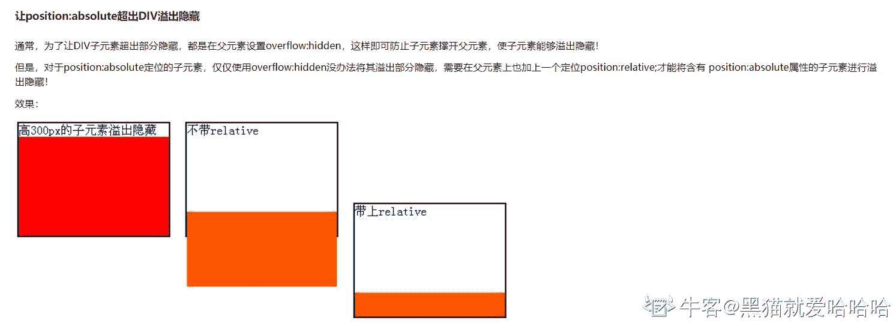
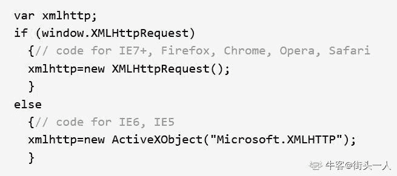

# 欢聚时代 2017 校招笔试题目（PHP 工程师类）B 卷

## 1

以下哪个 CSS 属性能让一个标签超过它的父节点时隐藏不显示

正确答案: B   你的答案: 空 (错误)

```cpp
Display
```

```cpp
overflow
```

```cpp
hidden
```

```cpp
clear
```

本题知识点

PHP 工程师 欢聚集团 2017 CSS

讨论

[别卷啦！](https://www.nowcoder.com/profile/610837318)

**转自**[`www.cnblogs.com/cheney-cai/p/5949752.html`](https://www.cnblogs.com/cheney-cai/p/5949752.html)

编辑于 2021-01-12 10:09:01

* * *

[听问](https://www.nowcoder.com/profile/572950704)

overflow 是属性名，hidden 是属性值

发表于 2020-08-14 13:30:39

* * *

[潘国东](https://www.nowcoder.com/profile/366163873)

题目语义不详

发表于 2022-03-10 12:45:00

* * *

## 2

以下那个 css 的属性可以让 div 显示高于其它标签(既可以覆盖了其它标签)

正确答案: A   你的答案: 空 (错误)

```cpp
z-index
```

```cpp
display
```

```cpp
vertical-align
```

```cpp
opacity
```

本题知识点

PHP 工程师 欢聚集团 2017 CSS

讨论

[WXMcomeon](https://www.nowcoder.com/profile/662652834)

z-index 属性指定一个元素的堆叠顺序 vertical-align 属性设置一个元素的垂直对齐方式。display 属性设置元素如何显示。 opacity 设置透明度

发表于 2020-09-17 15:55:40

* * *

[燃烧黎明](https://www.nowcoder.com/profile/567164937)

逗我呢？z-index 不是只有在脱离文档流的元素中使用才可能有效果嘛？

发表于 2020-08-18 23:47:54

* * *

## 3

以下 js 中那个语句能使页面跳转

正确答案: A   你的答案: 空 (错误)

```cpp
window.location .href = “url”;
```

```cpp
window.header = “url”;
```

```cpp
window.go = “url”;
```

```cpp
window. redirect = “url”;
```

本题知识点

PHP 工程师 欢聚集团 2017

## 4

以下哪个选项能在 ie 创建一个 ajax 所需的对象:

正确答案: B   你的答案: 空 (错误)

```cpp
Var ajax = new httpxml();
```

```cpp
Var ajax = new XMLHttpRequest();
```

```cpp
Var ajax = new ActiveXObject("Microsoft.XMLHTTP");
```

```cpp
Var ajax = new Microsoft.XMLHTTP();
```

本题知识点

PHP 工程师 欢聚集团 2017

讨论

[街头一人](https://www.nowcoder.com/profile/571570408)

C 吧。
根据 W3school 的 api 文档：对于 IE7 以上的版本通过 new XMLHttpRequest()创建；IE5,IE6 通过 new ActiveXObject("Microsoft.XMLHTTP")创建。  

发表于 2020-07-27 16:10:26

* * *

[么得感情的 Robot](https://www.nowcoder.com/profile/9582890)

ie5,6 下选 cie6 以上不存在兼容性问题题目不严谨

发表于 2017-10-13 22:08:53

* * *

[★筱怪★](https://www.nowcoder.com/profile/5856915)

IE 怎么可能，应该是 C 吧？

发表于 2017-10-13 10:23:33

* * *

## 5

在 js 中产生当前日期的方法是？

正确答案: C   你的答案: 空 (错误)

```cpp
Now()
```

```cpp
Date()
```

```cpp
new Date()
```

```cpp
new Now()
```

本题知识点

PHP 工程师 欢聚集团 2017

讨论

[将军写代码](https://www.nowcoder.com/profile/9705201)

Now()是 mysql 中的 Date()是 PHP 中的和 mysql 中的 new Date()是 js 中的

发表于 2017-12-17 15:02:05

* * *

## 6

下面 ____ 属于语言结构，不属于函数

正确答案: A   你的答案: 空 (错误)

```cpp
echo
```

```cpp
print
```

```cpp
print_r
```

```cpp
var_dump E. exit   F．die    G．include   H. require
```

本题知识点

PHP 工程师 欢聚集团 2017

讨论

[牛客网彭于晏](https://www.nowcoder.com/profile/5627740)

什么鬼，这些选项都正确啊

发表于 2017-09-02 00:19:06

* * *

## 7

下面哪个不是魔术方法？

正确答案: D   你的答案: 空 (错误)

```cpp
__get()
```

```cpp
__construct()
```

```cpp
__call()
```

```cpp
__delete()
```

本题知识点

PHP 工程师 欢聚集团 2017

## 8

下面哪个函数可是实现将 array(‘b’=>’abcd’, ’a’=>’bcda’, ’c’=>’cdab’)排序成 array(‘a’=>’bcda’, ‘b’=>’abcd’, ‘c’=>’cdab’)？

正确答案: D   你的答案: 空 (错误)

```cpp
asort()
```

```cpp
rsort()
```

```cpp
sort()
```

```cpp
ksort()
```

本题知识点

PHP 工程师 欢聚集团 2017

讨论

[将军写代码](https://www.nowcoder.com/profile/9705201)

sort() 方法用于对数组的元素进行排序; asort() 函数对关联数组按照键值进行升序排序。

ksort() 函数对关联数组按照键名进行升序排序。rsort()对数组 中的元素按字母进行降序排序 

发表于 2017-12-17 15:12:32

* * *

## 9

下面哪个语句能输出结果: 345

正确答案: A   你的答案: 空 (错误)

```cpp
echo  '3',  '45';
```

```cpp
$a = 45;  print(3.'$a');
```

```cpp
$a = $b = 345;   var_dump($a);
```

```cpp
以上答案都不正确。
```

本题知识点

PHP 工程师 欢聚集团 2017

讨论

[将军写代码](https://www.nowcoder.com/profile/9705201)

A：输出 345；B：syntax error, unexpected ''$a''；C：输出 int(345);选 A

发表于 2017-12-17 14:58:02

* * *

## 10

一次上传多个文件，name 字段分别是 file1，file2，file3，怎么取到第一个文件的原始文件名？

正确答案: A   你的答案: 空 (错误)

```cpp
$_FILES['file1']['name']
```

```cpp
$_FILES['file1']['tmp_name']
```

```cpp
$_FILES['name']['file1']
```

```cpp
$_FILES['tmp_name']['file1']
```

本题知识点

PHP 工程师 欢聚集团 2017

讨论

[么得感情的 Robot](https://www.nowcoder.com/profile/9582890)

```cpp
tmp_name 是临时目录中的文件名
```

发表于 2017-10-08 23:10:31

* * *

## 11

以下程序的输出结果是 ？

正确答案: D   你的答案: 空 (错误)

```cpp
Hello duowan!
```

```cpp
duowan!
```

```cpp
没有输出结果
```

```cpp
Hello
```

本题知识点

PHP 工程师 欢聚集团 2017 C++

讨论

[橙木](https://www.nowcoder.com/profile/559088196)

运气也是实力的一部分类型题？

发表于 2020-10-13 12:13:16

* * *

[★筱怪★](https://www.nowcoder.com/profile/5856915)

如果选项有空我就选～

发表于 2017-10-13 10:24:13

* * *

[奔跑か依旧是我](https://www.nowcoder.com/profile/3107097)

题目不完整

发表于 2017-09-06 00:26:34

* * *

## 12

以下哪个函数能打开一个文件并对它进行读写操作

正确答案: B   你的答案: 空 (错误)

```cpp
file
```

```cpp
fopen
```

```cpp
fread
```

```cpp
file_get_contents
```

本题知识点

PHP 工程师 欢聚集团 2017

讨论

[★筱怪★](https://www.nowcoder.com/profile/5856915)

后面加一个同时进行读写有问题吧？需要另一些函数吧？

发表于 2017-10-13 10:25:24

* * *

## 13

用 PHP 查询 MySQL，数据使用 UTF-8 编码，需要设置 ______

正确答案: C   你的答案: 空 (错误)

```cpp
mysqli_query($connection, "SET NAMES 'UTF8'");
```

```cpp
mysql_query($connection, "SET NAMES 'UTF8'");
```

```cpp
mysqli_set_charset($connection , 'UTF8');
```

```cpp
mysql_set_charset($connection , 'UTF8');
```

本题知识点

PHP 工程师 欢聚集团 2017

讨论

[mark_php](https://www.nowcoder.com/profile/38262677)

Cmysql 扩展在 php7 之后已经移除了 mysql_set_charset('UTF8'，$connection );

发表于 2021-04-13 18:07:20

* * *

## 14

有下列 PHP 语句段， 若要输出”false” ，$a 应该是 ______ <?php  if ($a)  print "true";else print "false";    ?>

正确答案: A   你的答案: 空 (错误)

```cpp
“0”
```

```cpp
10
```

```cpp
–3
```

```cpp
“true”
```

本题知识点

PHP 工程师 欢聚集团 2017

讨论

[mark_php](https://www.nowcoder.com/profile/38262677)

A 几种 alse 的情况“”“0”0null

发表于 2021-04-13 18:13:03

* * *

[奔跑か依旧是我](https://www.nowcoder.com/profile/3107097)

题目不完整

发表于 2017-09-06 00:27:46

* * *

## 15

在字符串变量 $str 中查找 hello 字符串，查找到了输出 ok，请问下面哪个表达式是正确的？

正确答案: D   你的答案: 空 (错误)

```cpp
if (strpos($str, 'hello') != 0) echo 'ok';
```

```cpp
if (strpos($str, 'hello') != -1) echo 'ok';
```

```cpp
if (strpos($str, 'hello')) echo 'ok';
```

```cpp
if (strpos($str, 'hello') !== false) echo 'ok';
```

本题知识点

PHP 工程师 欢聚集团 2017

讨论

[牛客网彭于晏](https://www.nowcoder.com/profile/5627740)

C 不正确是因为存在'hello'出现在 0 位置的情况

发表于 2017-09-02 00:20:06

* * *

[藏不住的寂寞](https://www.nowcoder.com/profile/4093684)

strpos() 查找字符串在另一个字符串第一次出现的位置

发表于 2017-09-05 22:21:37

* * *

## 16

执行程序段的输出为（）

```cpp
void print() {
    int a = 2;
    printf("%d", a);
}
```

正确答案: A   你的答案: 空 (错误)

```cpp
2
```

```cpp
-2
```

```cpp
0
```

```cpp
运行错误
```

本题知识点

PHP 工程师 欢聚集团 2017 C 语言

讨论

[蔡智勇](https://www.nowcoder.com/profile/218087618)

题里写了，这是一个程序段

发表于 2020-11-18 08:40:12

* * *

[奔跑か依旧是我](https://www.nowcoder.com/profile/3107097)

题目不完整

发表于 2017-09-06 00:28:40

* * *

[MaCter](https://www.nowcoder.com/profile/657947041)

题目说了这是一个程序段代码。

发表于 2021-12-11 09:29:20

* * *

## 17

若有 18 个元素的有序表存放在一维数组 A[19]中，第一个元素放 A[1]中，现进行二分查找，则查找 A［3］的比较序列的下标依次为？

正确答案: D   你的答案: 空 (错误)

```cpp
1，2，3
```

```cpp
9，5，2，3
```

```cpp
9，5，3
```

```cpp
9，4，2，3
```

本题知识点

PHP 工程师 欢聚集团 2017

讨论

[陈维杰](https://www.nowcoder.com/profile/3686902)

这有歧义啊，都说了下标是 1 开始了，肯定最开始的 low 是 1 啦

发表于 2017-09-15 14:27:28

* * *

## 18

十进制数 15 对应的二进制数是？

正确答案: A   你的答案: 空 (错误)

```cpp
1111
```

```cpp
1110
```

```cpp
1010
```

```cpp
1100
```

本题知识点

PHP 工程师 欢聚集团 2017

## 19

文件传输协议（FTP ）使用的是什么样的服务？

正确答案: C   你的答案: 空 (错误)

```cpp
ICMP 服务
```

```cpp
UDP 服务
```

```cpp
TCP 服务
```

```cpp
IGMP 服务
```

本题知识点

PHP 工程师 欢聚集团 2017

## 20

一个汉字使用多少个字节表示？

正确答案: D   你的答案: 空 (错误)

```cpp
1 个
```

```cpp
2 个
```

```cpp
3 个
```

```cpp
跟具体编码有关
```

本题知识点

PHP 工程师 欢聚集团 2017

## 21

用链接方式存储的队列，在进行插入运算时？

正确答案: D   你的答案: 空 (错误)

```cpp
仅修改头指针
```

```cpp
头、尾指针都要修改
```

```cpp
仅修改尾指针
```

```cpp
头、尾指针可能都要修改
```

本题知识点

PHP 工程师 欢聚集团 2017

## 22

在 IE 浏览器地址栏输入”http://www.yy.com”中，http 代表的是？

正确答案: A   你的答案: 空 (错误)

```cpp
协议
```

```cpp
主机
```

```cpp
地址
```

```cpp
资源
```

本题知识点

PHP 工程师 欢聚集团 2017

## 23

mysql_insert_id()函数的作用是

正确答案: B   你的答案: 空 (错误)

```cpp
查看下一次插入记录时的 ID 号
```

```cpp
查看刚刚插入过的自动增长 ID 值
```

```cpp
查看一共做过多少次 insert 操作
```

```cpp
查看一共有多少条记录
```

本题知识点

PHP 工程师 欢聚集团 2017

讨论

[派大星的圣诞礼物](https://www.nowcoder.com/profile/1486225)

B mysql_insert_id() 函数返回上一步 INSERT 操作产生的 ID。如果上一查询没有产生 AUTO_INCREMENT 的 ID，则 mysql_insert_id() 返回 0。 

发表于 2017-09-16 17:40:35

* * *

## 24

以下代码执行结果是

<?php

mysql_connect("localhost","root","")

$result = mysql_query("select id,namefrom tb1");

while($row =mysql_fetch_array($result,MYSQL_ASSOC))

{echo "ID:" . $row[0] ."Name:" . $row[];}

?>

正确答案: A   你的答案: 空 (错误)

```cpp
报错
```

```cpp
只打印第一条记录
```

```cpp
循环换行打印全部记录
```

```cpp
无任何结果
```

本题知识点

PHP 工程师 欢聚集团 2017

讨论

[百亿少女的梦](https://www.nowcoder.com/profile/468018687)

没有连接数据库

发表于 2019-07-21 09:39:34

* * *

[奔跑か依旧是我](https://www.nowcoder.com/profile/3107097)

题目不完整

发表于 2017-09-06 00:29:54

* * *

## 25

语句 for($k=0;$k=1;$k++);和语句 for($k=0;$k==1;$k++);执行的次数分别是:

正确答案: A   你的答案: 空 (错误)

```cpp
无限和 0
```

```cpp
0 和无限
```

```cpp
都是无限
```

```cpp
都是 0
```

本题知识点

PHP 工程师 欢聚集团 2017

## 26

下边代码中，index.php 如何得到 form 传递的 email 的值?

正确答案: B D   你的答案: 空 (错误)

```cpp
$_GET['email']
```

```cpp
$_POST['email']
```

```cpp
$_SESSION['text’]
```

```cpp
$_REQUEST['email']
```

```cpp
$_POST['text']
```

本题知识点

PHP 工程师 欢聚集团 2017

讨论

[★筱怪★](https://www.nowcoder.com/profile/5856915)

form 的 method 可以是 get 呀，╮(╯_╰)╭

发表于 2017-10-13 10:29:38

* * *

[mark_php](https://www.nowcoder.com/profile/38262677)

A B Dform 提交应该也可以用 get 类型

发表于 2021-04-13 18:16:48

* * *

[翁咏霖](https://www.nowcoder.com/profile/8039594)

传递 mail 的输入框 name 不能叫 text 吗

发表于 2017-10-27 23:24:51

* * *

## 27

下面哪些选项可以实现让用户通过表单提交的引号前加上反斜杆

正确答案: A B C   你的答案: 空 (错误)

```cpp
magic_quotes_gpc=On
```

```cpp
mysql_escape_string
```

```cpp
addslashes
```

```cpp
htmlspecialchars
```

```cpp
Htmlentities
```

本题知识点

PHP 工程师 欢聚集团 2017

## 28

以下哪个 HTTP 头与缓存无关

正确答案: C   你的答案: 空 (错误)

```cpp
Last Modified
```

```cpp
Expires
```

```cpp
Connection
```

```cpp
Etag
```

本题知识点

PHP 工程师 欢聚集团 2017

讨论

[我想我是疯了](https://www.nowcoder.com/profile/694217643)

HTTP1.1 Connection 默认值为 keep-alive，意思为保持 TCP 连接

发表于 2020-03-21 02:31:58

* * *

## 29

下面哪一个是假 _________

正确答案: C   你的答案: 空 (错误)

```cpp
0 == "0"
```

```cpp
false == "0"
```

```cpp
"" == "0"
```

```cpp
"" == 0
```

本题知识点

PHP 工程师 欢聚集团 2017 C++

讨论

[你快乐吗](https://www.nowcoder.com/profile/5271388)

不说具体语言就是耍流氓

发表于 2020-08-16 19:19:57

* * *

[牛客 305499541 号](https://www.nowcoder.com/profile/305499541)

答案不对吧，d 如果为真的话，联合选项 a 和 d 可以得到“”==0==“0”不就得到 c 为真了？

编辑于 2020-09-04 00:00:32

* * *

[已注销](https://www.nowcoder.com/profile/216129010)

C++全是 0

发表于 2020-08-28 22:08:29

* * *

## 30

下面哪一个不是 PHP 内置的常量

正确答案: C   你的答案: 空 (错误)

```cpp
__FILE__
```

```cpp
__FUNCTION__
```

```cpp
__VERSION__
```

```cpp
__METHOD__
```

本题知识点

PHP 工程师 欢聚集团 2017

讨论

[★筱怪★](https://www.nowcoder.com/profile/5856915)

method 明明是的～╮(╯_╰)╭

发表于 2017-10-13 10:34:10

* * *

[牛客网彭于晏](https://www.nowcoder.com/profile/5627740)

__METHOD__ 是内置常量，只有 C 不是[`www.php.net/manual/zh/language.constants.predefined.php`](http://www.php.net/manual/zh/language.constants.predefined.php)

发表于 2017-09-02 00:22:57

* * *

## 31

2015 年的前三个月依次分别有（）天，（）天，和（）天（请输入阿拉伯数字）

你的答案

本题知识点

PHP 工程师 欢聚集团 2017

讨论

[jraai](https://www.nowcoder.com/profile/5796946)

```cpp
<?php
echo cal_days_in_month(CAL_GREGORIAN,1,2015).'<br/>';
echo cal_days_in_month(CAL_GREGORIAN,2,2015).'<br/>';
echo cal_days_in_month(CAL_GREGORIAN,3,2015).'<br/>';
```

发表于 2017-08-31 19:50:59

* * *

## 32

有一张用户表(user)和订单表（order），表结构如下图，请按条件编写 SQL 语句。 用户表 user uid username money 1 张三 190 2 李四 210 3 王五 175 订单表 order order_id uid product_id 1 1 10 2 1 11 3 2 10 4 2 11 5 2 10 (1)查询购买订单最多的用户名（username）； (2)查询没有购买过订单的用户（如 王五）；

你的答案

本题知识点

PHP 工程师 欢聚集团 2017

讨论

[牛客网彭于晏](https://www.nowcoder.com/profile/5627740)

1\. 子查询

```cpp
SELECT username FROM user WHERE uid=(SELECT uid FROM `order` GROUP BY uid ORDER BY COUNT(1) DESC LIMIT 1 )
```

2\. 求两表的差集

```cpp
SELECT username FROM user LEFT JOIN `order` ON user.uid=`order`.uid WHERE `order`.uid IS NULL
```

发表于 2017-09-01 23:59:35

* * *

[石壹笑](https://www.nowcoder.com/profile/2851715)

不联表查询 1、a: select uid,count(uid) as u_total from order  group by uid order by u_total desc  limit 1; // 拿到 uidb: select username from user where uid = ? //2、a:select uid from order  group by uid;b: select username from user where uid = ? //联表查询 1、select user.username ,count(order.uid) as u_total from user right join order on user.uid = order.uid group by order.uid order by u_total desc limit  1;2、select username from user left join order_test on user.uid = order.uid  where order.order_id is null ;如有其他办法，请各位大佬赐教  🍟

发表于 2017-09-01 15:32:25

* * *

## 33

请说出以下 Javascript 的运行结果. var test = 1; var demo = (function(a){ var test = 2; test++; return a++; })(test); alert(test); alert(demo);

你的答案

本题知识点

PHP 工程师 欢聚集团 2017

讨论

[jraai](https://www.nowcoder.com/profile/5796946)

弹出两次 1

发表于 2017-08-31 20:11:59

* * *

## 34

用 MVC 模式写一个最简单的“hello world”程序。

你的答案

本题知识点

PHP 工程师 欢聚集团 2017

讨论

[牛客网彭于晏](https://www.nowcoder.com/profile/5627740)

indexModel.php

```cpp
<?php
class indexModel
{
    public function getData(){
         return "hello world";
     }
} 
```

indexView.php

```cpp
<?php
class indexView
{
    public function display($data){
        echo $data;
    }
}

```

indexController.php

```cpp
<?php
require 'indexModel.php';
require 'indexView.php';
class indexController
{
    public function index(){
        $model = new indexModel();
        $view = new indexView();
        $view->display($model->getData()); 
    }
}
```

发表于 2017-09-02 00:05:18

* * *

[jraai](https://www.nowcoder.com/profile/5796946)

public class HomeController:controller{    piblic ActionResult index{        viewBag.message = 'hello world';
        return view();
    }
}

发表于 2017-08-31 20:20:16

* * *

## 35

表单中 get 与 post 提交方法的区别?

你的答案

本题知识点

PHP 工程师 欢聚集团 2017

讨论

[牛客网彭于晏](https://www.nowcoder.com/profile/5627740)

1\.  语义不同 get 用于请求信息，post 用于提交信息。2\. 在 HTTP 请求中的位置不同 get 参数位于 http 请求 header 中的 path 中，post 参数位于 http 请求 body 中。3\. 参数的大小限制不同 get 参数的大小限制与浏览器有关，一般限制为 2k；post 可以提交信息的大小与服务器配置有关，可以配置较大，用于文件传输。4\. 编码方式上的区别 get 参数统一使用 url 编码，而 post 请求的参数可以使用 application/x-www-form-urlencoded、multipart/form-data、application/json、text/xml 多种方式 5\. 安全性上的区别 get 参数可以通过 url 之间看到，post 参数作为 http 请求的 body，相对更加安全一些，尤其是在使用 https 时的安全性差别更大。

发表于 2017-09-02 00:14:29

* * *

[石壹笑](https://www.nowcoder.com/profile/2851715)

```cpp
1.POST 是向服务器传递数据；GET 是从服务器上获取数据。

    2.POST 是通过 HTTP POST 机制将表单内各个字段及其内容放置在 html header 内一起传送到 action 属性所指的 url 地址。

      用户看不到这个过程；GET 是把参数数据队列加到提交表单 action 属性所指的 url 中，值和表单内各个字段一一对应，在 url 中可以看到。

    3.对于 GET 方式，服务器端用 Request.QueryString 获取变量的值；对于 POST 方式，服务器端用 Request.Form 获取提交数据。

    4.POST 传送的数据量较大，一般默认为不受限制。但理论上，IIS4 中最大量为 80KB，IIS5 中为 100KB；GET 传递的数据量较小，不能大于 2KB。

    5.POST 安全性较高；GET 安全性非常低，但是执行效率却比 POST 方法好。

    6.在做数据添加、修改或删除时，建议用 POST 方式；而在做数据查询时，建议用 GET 方式。

    7.对于机密信息的数、发送包含未知字符的用户输入时，建议采用 POST 数据提交方式。
```

发表于 2017-09-01 15:48:00

* * *

[jraai](https://www.nowcoder.com/profile/5796946)

答：1、Get 是用来从服务器上获得数据，而 Post 是用来向服务器上传递数据。

```cpp
2、Get 将表单中数据的按照 variable=value 的形式，添加到 action 所指向的 URL 后面，并且两者使用“?”连接，而各个变量之间使用“&”连接；Post 是将表单中的数据放在 form 的数据体中，按照变量和值相对应的方式，传递到 action 所指向 URL。
3、Get 是不安全的，因为在传输过程，数据被放在请求的 URL 中，而如今现有的很多服务器、***服务器或者用户***都会将请求 URL 记录到日志文件中，然后放在某个地方，这样就可能会有一些隐私的信息被第三方看到。另外，用户也可以在浏览器上直接看到提交的数据，一些系统内部消息将会一同显示在用户面前。Post 的所有操作对用户来说都是不可见的。
4、Get 传输的数据量小，这主要是因为受 URL 长度限制；而 Post 可以传输大量的数据，所以在上传文件只能使用 Post（当然还有一个原因，将在后面的提到）。
5、Get 限制 Form 表单的数据集的值必须为 ASCII 字符；而 Post 支持整个 ISO10646 字符集。
6、Get 是 Form 的默认方法。
```

发表于 2017-08-31 20:23:45

* * *

## 36

写一个 PHP 函数，实现数字金额转换为中文大写金额。

你的答案

本题知识点

PHP 工程师 欢聚集团 2017

讨论

[牛客 9354619 号](https://www.nowcoder.com/profile/9354619)

```cpp
<?php
/**
 * 转换大写金额
 * $num 数字类型
 */
function inttod($num)
{
    //判断$num 是否存在
    if (!$num) return '零圆';
    //保留小数点后两位
    $num = round($num, 2);
    //将浮点转换为整数
    $tem_num = $num * 100;
    //判断数字长度
    $tem_num_len = strlen($tem_num);
    if ($tem_num_len > 14) {
        return '数字太大了吧，有这么大的金钱吗';
    }
    //大写数字
    $dint = array('零', '壹', '贰', '叁', '肆', '伍', '陆', '柒', '捌', '玖');
    //大写金额单位
    $danwei = array('仟', '佰', '拾', '亿', '仟', '佰', '拾', '万', '仟', '佰', '拾', '圆');
    $danwei1 = array('角', '分');
    //空的变量用来保存转换字符串
    $daxie = '';
    //分割数字，区分圆角分
    list($left_num, $right_num) = explode('.', $num);
    //计算单位长度
    $danwei_len = count($danwei);
    //计算分割后的字符串长度
    $left_num_len = strlen($left_num);
    $right_num_len = strlen($right_num);
    //循环计算亿万元等
    for ($i = 0; $i < $left_num_len; $i++) {
        //循环单个文字
        $key_ = substr($left_num, $i, 1);
        //判断数字不等于 0 或数字等于 0 与金额单位为亿、万、圆，就返回完整单位的字符串
        if ($key_ !== '0' || ($key_ == '0' && ($danwei[$danwei_len - $left_num_len + $i] == '亿' || $danwei[$danwei_len - $left_num_len + $i] == '万' || $danwei[$danwei_len - $left_num_len + $i] == '圆'))) {
            $daxie = $daxie . $dint[$key_] . $danwei[$danwei_len - $left_num_len + $i];
        } else {
            //否则就不含单位
            $daxie = $daxie . $dint[$key_];
        }
    }
    //循环计算角分
    for ($i = 0; $i < $right_num_len; $i++) {
        $key_ = substr($right_num, $i, 1);
        if ($key_ > 0) {
            $daxie = $daxie . $dint[$key_] . $danwei1[$i];
        }
    }
    //计算转换后的长度
    $daxie_len = strlen($daxie);
    //设置文字切片从 0 开始，utf-8 汉字占 3 个字符
    $j = 0;
    while ($daxie_len > 0) {
        //每次切片两个汉字
        $str = substr($daxie, $j, 6);
        //判断切片后的文字不等于零万、零圆、零亿、零零
        if ($str == '零万' || $str == '零圆' || $str == '零亿' || $str == '零零') {
            //重新切片
            $left = substr($daxie, 0, $j);
            $right = substr($daxie, $j + 3);
            $daxie = $left . $right;
        }
        $j += 3;
        $daxie_len -= 3;
    }
    return '人民币' . $daxie . '整';
}

$result = inttod(99090909090.19);
var_dump($result);
```

发表于 2021-09-03 23:10:36

* * *

[jraai](https://www.nowcoder.com/profile/5796946)

function cny($ns) {
    static $cnums=array("零","壹","贰","叁","肆","伍","陆","柒","捌","玖"),
        $cnyunits=array("圆","角","分"),
        $grees=array("拾","佰","仟","万","拾","佰","仟","亿");
    list($ns1,$ns2)=explode(".",$ns,2);
    $ns2=array_filter(array($ns2[1],$ns2[0]));
    $ret=array_merge($ns2,array(implode("",_cny_map_unit(str_split($ns1),$grees)),""));
    $ret=implode("",array_reverse(_cny_map_unit($ret,$cnyunits)));
    return str_replace(array_keys($cnums),$cnums,$ret);

```cpp
}
```

发表于 2017-08-31 20:26:09

* * *