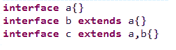

# 欢聚时代 2017 校招笔试题目（JAVA 基础类）C 卷

## 1

以下运行结果哪个是正确的： ( )

```cpp
class A{
public String show(D d){return ("AD");}
public String show(A a){return ("AA");}
}

class B extends A{
public String show(B b){return ("BB");}
public String show(A a){return ("BA");}
}

class C extends B{}

class D extends B{}

public class Test{

    public static void main(String[] args) {
        A a = new A();
        B b = new B();
        C c = new C();
        D d = new D();
        System.out.println(a.show(b)+"-"+a.show(c)+"-"+a.show(d)+"-"+b.show(a)+"-"+b.show(c)+"-"+b.show(d));
    }
}
```

正确答案: C   你的答案: 空 (错误)

```cpp
AD-AA-AD-BA-BB-AD
```

```cpp
AA-AD-AD-BA-BB-AD
```

```cpp
AA-AA-AD-BA-BB-AD
```

```cpp
AA-AA-AD-BA-BA-AD
```

本题知识点

Java 工程师 欢聚集团 2017

讨论

[victor_](https://www.nowcoder.com/profile/9673955)

对象 a 有两个重载的 show 方法，分别是 Show（D d），Show（A a）；对象 b 有三个重载的 show 方法，分别是 Show（B b），Show（A a）以及 show（D d）（相当于，因为 B 继承了 A，所以有了 Show（D d）和 Show（A a）），但是 B 又重写了 show（A a）方法，并新增了方法重载方法 Show（B b）；因此当调用 b.show(a)时是调用的自己重写过的方法 show（A a），当调用 b.show(d)时直接调用从父类 A 继承来的方法。

a.show(b) 相当于对象 a 调用自己的方法 show(A a)，因为 b 是 A 类型，而不是 D 类型的；

a.show(c) 相当于对象 a 调用自己的方法 show(A a)，因为 c 是 B 类型，即 A 类型，而不是 D 类型；

a.show(d) 相当于对象 a 调用自己的方法 show(D d)，因为 d 是 D 类型的；

b.show(a) 相当于对象 b 调用自己的方法 show(A a)，因为 a 是 A 类型的；

b.show(c) 相当于对象 b 调用自己的方法 show(B b)，因为 c 是 B 类型的；

b.show(d) 相当于对象 b 调用父类 A 的方法 show(D d)总结一下就是，子类先找自己的方法，如果有就直接调用，若没有，则检查继承自父类的方法。

发表于 2017-09-08 17:52:07

* * *

[空空以空空](https://www.nowcoder.com/profile/479441)

参考楼上的解答，我也说一下自己的理解；继承具有传递性，A 是 B 的父类，B 是 C 和 D 的父类。所以 B 就继承了 A 的所有非私有方法和属性。当子类和父类拥有相同的方法时，子类就会覆盖掉父类的方法，代码运行时总会执行子类的那个方法。当我们定义一个 class 的时候，我们实际上就定义了一种数据类型。判断一个变量是否是某个类型可以用 instanceof 判断

```cpp
boolean res1;
boolean res2;
res1 = b instanceof A;//true
res2 = b instanceof B;//true
```

所以 b 还是 A 类型的
下面分析一下代码

```cpp
public class Test{

    public static void main(String[] args) {
        A a =new A();
        B b =new B();
        C c =new C();
        D d =new D();  /********对象 a 调用自己的方法******/
        a.show(b);//b 是 A 类型的，相当于 a.show(A b)
        a.show(c);//c 是 B 类型的，B 又继承自 A，所以 c 也是 A 类型的,相当于 a.show(A c)
        a.show(d);//A 类本来就有 show(D d),所以就执行了 show(D,d);
   /********对象 b 调用自己的方法******/
        b.show(a);
        b.show(c);
   /********对象 b 调用了父类的方法 show(D d)******/
        b.show(d);
    }
}
```

参考：[`www.liaoxuefeng.com/wiki/001374738125095c955c1e6d8bb493182103fac9270762a000/001386820044406b227b3e751cc4d5190420d17a2dc6353000`](https://www.liaoxuefeng.com/wiki/001374738125095c955c1e6d8bb493182103fac9270762a000/001386820044406b227b3e751cc4d5190420d17a2dc6353000)

编辑于 2017-09-06 19:51:25

* * *

[我是如此相信](https://www.nowcoder.com/profile/7988004)

静态分配和动态分配

发表于 2019-03-25 15:49:28

* * *

## 2

以下对继承的描述错误的是

正确答案: C   你的答案: 空 (错误)

```cpp
Java 中的继承存在着传递性
```

```cpp
父类更具有通用性，子类更具体
```

```cpp
定义为 finally 的类可以被继承
```

```cpp
当实例化子类时会递归调用父类中的构造方法
```

本题知识点

Java 工程师 欢聚集团 2017

讨论

[親愛的破小孩](https://www.nowcoder.com/profile/5304840)

首先写错了 final 为 finally，并且定义为 final 的类不能被继承

发表于 2017-08-31 13:35:39

* * *

[夜静自然凉](https://www.nowcoder.com/profile/8178782)

java 中的继承 review 继承使用 extends 关键词 java 中继承的特点：java 中的类只能单继承，但可以多重继承，因此继承具备传递性继承中的父类：父类由一系列具有相同属性和方法的类“抽象”而得继承中的子类：子类除了拥有从父类中继承的属性和方法外，还可以有自己特有的属性和方法，当父类的方法，不能满足子类的需求时，子类可以通过重写的方式，完成对原有方法的功能扩展或修改因此，父类更通用，子类更具体。继承的好处：实现代码的复用哪些能继承？子类可以继承父类的成员变量，成员方法哪些不能被继承？构造方法不能被继承 final 修饰的类不能被继承

发表于 2017-10-01 15:46:28

* * *

[Hutonm](https://www.nowcoder.com/profile/6517610)

**final 类不能被继承，没有子类。**
**final 方法不能被子类的方法覆盖。**
**final 成员变量表示常量，只能被赋值一次，赋值后值不再改变。**

发表于 2017-09-09 11:55:30

* * *

## 3

在同一包下，以下说法正确的是

正确答案: A B C D   你的答案: 空 (错误)

```cpp
super.方法（）可以调用父类的所有非私有方法
```

```cpp
super（）可以调用父类的所有非私有构造函数
```

```cpp
super.属性可以调用父类的所有非私有属性
```

```cpp
this 和 super 关键字可以出现在同一个构造函数中
```

本题知识点

Java 工程师 欢聚集团 2017

讨论

[裴小强](https://www.nowcoder.com/profile/2575877)

4D 也是对的吧
public class Student extends Person {

    String name;
    public Student(String name){
       ***super***();
        ***this***.name=name;
    }
}

编辑于 2017-08-30 19:09:22

* * *

[这？](https://www.nowcoder.com/profile/9918942)

这个题不严谨啊，应该是 super()和 this()不能出现在同一个构造函数中。B 中，super()又没有参数，万一父类是有参构造函数呢？？？？

发表于 2017-08-30 22:34:44

* * *

[2FA0](https://www.nowcoder.com/profile/6103754)

abc 选项是不是都忽略了如果父类和子类不在同一个包下边，但是函数又是 default 的情况了吧，这问题很大吧

发表于 2017-09-03 11:15:19

* * *

## 4

以下对重载描述错误的是

正确答案: B   你的答案: 空 (错误)

```cpp
方法重载只能发生在一个类的内部
```

```cpp
构造方法能重载，但静态方法不能重载
```

```cpp
重载要求方法名相同，参数列表不同
```

```cpp
方法的返回值类型不是区分方法重载的条件
```

本题知识点

Java 工程师 欢聚集团 2017 Java 工程师 欢聚集团 2017

讨论

[山衔寒漪](https://www.nowcoder.com/profile/4593622)

静态方法可以重载

发表于 2017-09-01 17:05:09

* * *

[不停奔跑的蜗牛](https://www.nowcoder.com/profile/4150853)

```cpp
package statickeyword;
//get 方法是一个静态方法，重载并没有出现问题啊！
public class StaticDemo {     public static void get(){         System.out.println("get1");     }          public static void get(int a) {         System.out.println("get2 "+a);              }
}

```

发表于 2017-09-26 14:45:36

* * *

[冷暧](https://www.nowcoder.com/profile/2362215)

```cpp
int  a(){
System,out.println("有返回")；
}
void a(){
System,out.println("就是没有返回值")； }
然后再 main 里面调用 a();你觉得 jvm 会给你输出什么；
```

编辑于 2017-09-03 21:30:21

* * *

## 5

以下对接口描述错误的有

正确答案: D   你的答案: 空 (错误)

```cpp
接口没有提供构造方法
```

```cpp
接口中的方法默认使用 public、abstract 修饰
```

```cpp
接口中的属性默认使用 public、static、final 修饰
```

```cpp
接口不允许多继承
```

本题知识点

Java 工程师 欢聚集团 2017 Java 工程师 欢聚集团 2017

讨论

[化羽成风](https://www.nowcoder.com/profile/9793993)



发表于 2017-09-11 18:30:46

* * *

[简相杰](https://www.nowcoder.com/profile/8442454)

interface 可以多继承 interface。class 只能单继承 class，但可以多实现 interfaceabstract 具有类的特性。可以多 implement interface 只能单 extends class 或者 abstract 希望大家改正

发表于 2017-09-04 21:36:38

* * *

[牛客 2525060 号](https://www.nowcoder.com/profile/2525060)

接口是实现，可以实现多个接口

发表于 2017-08-31 02:15:11

* * *

## 6

以下关于内存管理描述错误的是

正确答案: D   你的答案: 空 (错误)

```cpp
基本数据类型的变量、对象的引用及函数调用的现场保存都使用内存栈空间
```

```cpp
通过 new 关键字和构造器创建的对象放在堆空间，类信息、常量、静态变量放在方法区
```

```cpp
计数器是唯一一个没有规定任何 OutOfMemoryError 情况的区域
```

```cpp
直接内存的分配不会受到 Java 堆大小的限制，所以不会抛 OutOfMemoryError 异常
```

本题知识点

Java 工程师 欢聚集团 2017

讨论

[Smile_Hjj](https://www.nowcoder.com/profile/5588952)

*   OutOfMemoryError 异常 

    *   程序计数器：无
    *   Java 虚拟机栈： 如果虚拟机栈可扩展，扩展时无法申请到足够内存
    *   本地方法栈：与 Java 虚拟机栈相同
    *   Java 堆：堆中没有内存完成实例分配，并且堆无法再进行扩展
    *   方法区（运行时常量池）：方法区无法满足内存分配需求（常量池无法申请到内存）
    *   直接内存：内存区域总和大于物理内存总和
*   StackOverflowError 异常 

    *   程序计数器：无
    *   Java 虚拟机栈：线程请求的栈深度大于虚拟机所允许的深度
    *   本地方法栈：与 Java 虚拟机栈相同
    *   Java 堆：无
    *   方法区：无
    *   直接内存：无
    *   **直接内存**（Direct Memory）并不是虚拟机运行时数据区的一部分，也不是 Java 虚拟机规范中定义的内存区域，但是这部分内存也被频繁地使用，而且也可能导致 OutOfMemoryError 异常出现，所以我们放到这里一起讲解。

              在 JDK 1.4 中新加入了 NIO（New Input/Output）类，引入了一种基于通道（Channel）与缓冲区（Buffer）的 I/O 方式，它可以使用 Native 函数库直接分配堆外内存，然后通过一个存储在 Java 堆里面的 DirectByteBuffer 对象作为这块内存的引用进行操作。这样能在一些场景中显著提高性能，因为避免了在 Java 堆和 Native 堆中来回复制数据。

              显然，本机直接内存的分配不会受到 Java 堆大小的限制，但是，既然是内存，则肯定还是会受到本机总内存（包括 RAM 及 SWAP 区或者分页文件）的大小及处理器寻址空间的限制。服务器管理员配置虚拟机参数时，一般会根据实际内存设置-Xmx 等参数信息，但经常会忽略掉直接内存，使得各个内存区域的总和大于物理内存限制（包括物理上的和操作系统级的限制），从而导致动态扩展时出现 OutOfMemoryError 异常。

发表于 2017-09-06 15:09:18

* * *

[嘤嘤怪.](https://www.nowcoder.com/profile/4887286)

```cpp
直接内存的分配不会受到 Java 堆大小的限制，但是会受到机器本身内存大小的限制，超过本机最大内存的时候还是会抛 oom
```

发表于 2017-08-30 16:32:27

* * *

[Lvan•Wong](https://www.nowcoder.com/profile/270615737)

《深入理解 java 虚拟机》第二章 39-44 程序计数器：很小的内存，可以看做当前线程执行的字节码的行号指示器。分支、跳转、循环、线程恢复都需要它。**线程私有，唯一一个 java 虚拟机规范中没有可能出现 OutOfMemoryError 情况的区域（执行 Native 方法，计数器的值为空）****虚拟机栈：两种情况的异常：****1、线程请求深度大于虚拟机允许的深度——>StackOverflowError;****2、虚拟机动态拓展，无法申请到足够的内存——>**OutOfMemoryError******线程私有****本地方法栈：****同上，区别是：******虚拟机栈——》虚拟机执行 java 方法服务（字节码文件——>加载解析初始化）********本地方法栈——》执行的是 native 方法服务******java 堆：****内存共享
如果堆没有内存完成实例分配，也没办法拓展，OutOfMemoryError****** **运行时常量池和方法区****内存共享，方法区放的是：类信息、常量、静态变量、即时编译器编译后的代码等数据****为何放一起？Java7 以后**运行时常量池就是方法区的一部分，当无法满足分配需求，就会抛出；**OutOfMemoryError********还有一个直接内存，jdk1.4 引入的基于通道与缓冲区的 IO****存在的意义：提高工作效率****eg：native 堆执行的时候需要函数库，这块的函数库可以直接分配堆外内存，然后通过一个存储在 java 堆的一个流对象引用这块内存操作，避免了**native 堆和 java 堆数据来回复制****这块的内存是在不是 java 虚拟机规范中定义，不会受到 java 堆大小的限制，但是内存，还是会受到本机的总内存影响，动态拓展有可能出现 OutOfMenoryError。（注意，我们平时会设置-Xmx 等信息，这些不会影响到直接内存，要设置直接内存可以从物理的和操作系统层面限制）

编辑于 2020-08-26 13:39:19

* * *

## 7

关于以下方法调用描述正确的是：

```cpp
private static final List<String> list = new ArrayList<>();
public static String test(String j){
    int i = 1, s = 1, f = 1, a = 1, b = 1,c = 1,d = 1,e = 1;
    list.add(new String("11111111111111111111111111111"));
    return test(s+i+f+a+b+c+d+e+"");
}
```

正确答案: B D   你的答案: 空 (错误)

```cpp
一定会发生” OutOfMemoryError: Java heap space”
```

```cpp
一定会发生” StackOverflowError”
```

```cpp
一定会发生” OutOfMemoryError: Java heap space 与 StackOverflowError”
```

```cpp
当发生内存溢出错误时不需要用 try…catch 来捕获，需检查代码及 jvm 参数配置的合理性
```

本题知识点

Java 工程师 欢聚集团 2017

讨论

[弘静](https://www.nowcoder.com/profile/1985638)

代码执行结果就这样，栈溢出。我个人的理解是调用栈的增长比内存的消耗更快，更消耗内存。

发表于 2017-09-02 15:54:33

* * *

[Smile_Hjj](https://www.nowcoder.com/profile/5588952)

      **java.lang.Error**: An Error is a subclass of Throwable that indicates serious problems that a reasonable application should not try to catch. Most such errors are abnormal conditions. 即：Error 是 Throwable 的子类，用于标记严重错误。**合理的应用程序不应该去 try/catch 这种错误。绝大多数的错误都是非正常的，就根本不该出现的。** 
    **java.lang.Exception**: The class Exception and its subclasses are a form of Throwable that indicates conditions that a reasonable application might want to catch. 即 Exception 是 Throwable 的一种形式的子类，用于指示一种合理的程序想去 catch 的条件。**即它仅仅是一种程序运行条件，而非严重错误，并且鼓励用户程序去 catch 它。**

发表于 2017-09-06 15:43:44

* * *

[小马嘟嘟骑](https://www.nowcoder.com/profile/9160619)

递归时没有退出条件会发生栈溢出。然后这题 D 也是对的吧？

发表于 2017-08-30 18:15:07

* * *

## 8

下列关于堆内存管理描述错误的是

正确答案: A   你的答案: 空 (错误)

```cpp
堆内存分为年轻代、老年代、持久代，持久代内存溢出为 OutOfMemoryError: Java heap space
```

```cpp
当 Eden 区满，再创建对象，会触发年轻代 GC，不能回收的对象会放到 To Survivor 区
```

```cpp
年轻代的 To Survivor 满了或里面的对象足够 Old（超过 XX:MaxTenuringThreshold），则这些对象被 copy 到老年代
```

```cpp
当 Old 区被放满的之后，进行 Full GC，Full GC 后，若 Survivor 及 old 区仍然无法存放从 Eden 复制过来的部分对象，则出现 OOM 错误
```

本题知识点

Java 工程师 欢聚集团 2017

讨论

[Fanxiaolin](https://www.nowcoder.com/profile/8025188)

给你们三个地址链接，耐心仔细看，你就所有有关这些 java 内存的题目都会了！1.我自己写的一篇博客，希望对你们有帮助：[`blog.csdn.net/xiaolinnulidushu/article/details/87205709`](https://blog.csdn.net/xiaolinnulidushu/article/details/87205709)2.[`www.cnblogs.com/gw811/archive/2012/10/19/2730258.html`](http://www.cnblogs.com/gw811/archive/2012/10/19/2730258.html)3.[`www.importnew.com/14630.html`](http://www.importnew.com/14630.html)不用谢，点赞就好

编辑于 2019-02-23 14:36:21

* * *

[Smile_Hjj](https://www.nowcoder.com/profile/5588952)

内存申请过程

1.  JVM 会试图为相关 Java 对象在 Eden 中初始化一块内存区域；
2.  当 Eden 空间足够时，内存申请结束。否则到下一步；
3.  JVM 试图释放在 Eden 中所有不活跃的对象（minor collection），释放后若 Eden 空间仍然不足以放入新对象，则试图将部分 Eden 中活跃对象放入 Survivor 区；
4.  Survivor 区被用来作为 Eden 及 old 的中间交换区域，当 OLD 区空间足够时，Survivor 区的对象会被移到 Old 区，否则会被保留在 Survivor 区；
5.  当 old 区空间不够时，JVM 会在 old 区进行 major collection；
6.  完全垃圾收集后，若 Survivor 及 old 区仍然无法存放从 Eden 复制过来的部分对象，导致 JVM 无法在 Eden 区为新对象创建内存区域，则出现"Out of memory 错误"。

发表于 2017-09-06 16:45:59

* * *

[a676610050](https://www.nowcoder.com/profile/5850617)

永久代也会 OOM,不过永久代的是：java.lang.OutOfMemoryError: PermGen space

发表于 2017-09-01 13:29:41

* * *

## 9

以下关于异常的描述错误的是

正确答案: C   你的答案: 空 (错误)

```cpp
RuntimeException：可以不使用 try...catch 进行处理，但是如果有异常产生，则异常将由 JVM 进行处理
```

```cpp
finally 语句块是不管有没有出现异常都要执行的内容
```

```cpp
throw 关键字可以在方法上声明该方法要抛出的异常
```

```cpp
try 是用于检测被包住的语句块是否出现异常，如果有异常，则抛出异常，并执行 catch 语句
```

本题知识点

Java 工程师 欢聚集团 2017

讨论

[萧特特](https://www.nowcoder.com/profile/4912593)

关键字是 throws

发表于 2017-08-30 21:56:53

* * *

[interfaceone](https://www.nowcoder.com/profile/473717)

throws 声明
throw 动作

发表于 2017-10-31 19:54:02

* * *

[GigaDrillBreak](https://www.nowcoder.com/profile/981022901)

有点问题，finally 执行的条件是进入 try 并且 jvm 运行，当我在进入 try 之前出了异常，是不会进入 finally 中的。

发表于 2019-05-18 18:56:18

* * *

## 10

以下代码输出结果是：

```cpp
public class Demo {
    public static void main(String[] args) {
      try {
        System.out.println("try-");
        int[] a = new int[0];
        a[0] = 1;
        System.out.println(a[0]+”-”);
       return;
     } catch (Exception e) {
       System.out.println("catch-");
     } finally {
       System.out.println("finally");
     }
   }
}
```

正确答案: D   你的答案: 空 (错误)

```cpp
try-1-catch-finally
```

```cpp
try-1-finally
```

```cpp
try-1-catch
```

```cpp
try-catch-finally
```

本题知识点

Java 工程师 欢聚集团 2017

讨论

[蒲公英的约定 8](https://www.nowcoder.com/profile/3563885)

因为数组的长度定义为 0，接下来又给数组进行赋值，所以会抛异常，执行 catch，finally

发表于 2017-09-01 00:20:44

* * *

[CYRTO](https://www.nowcoder.com/profile/4367012)

ArrayIndexOutOfBoundsException 是 Exception 类 下的子类，第 6 行发生该异常被捕获，try 块以后的语句不在执行。不会输出 a[0]+”-”，finally 块里的语句不管是否有异常，都会被执行。

发表于 2017-09-01 14:17:01

* * *

[JonTang](https://www.nowcoder.com/profile/1173781)

粗心啊，没看到定义数组大小为 0，会抛出异常。

发表于 2018-08-21 17:16:59

* * *

## 11

找出以下关于 float 的不正确的声明

正确答案: B   你的答案: 空 (错误)

```cpp
float foo=-1;
```

```cpp
float foo=1.0;
```

```cpp
float foo=2.02f;
```

```cpp
float foo=0x0123;
```

本题知识点

Java 工程师 欢聚集团 2017 Java 工程师 欢聚集团 2017

讨论

[这？](https://www.nowcoder.com/profile/9918942)

1.0 默认是 double 型。正确是 1.0f

发表于 2017-08-30 22:40:42

* * *

[fsdfsd](https://www.nowcoder.com/profile/9097671)

```cpp
float a = 1;这里的 1 是整形，当赋值给一个 float 时，存在一个隐式转换，不损失精度。
float a = 1f;1f 就是 float 类型的。
如果你这样定义 f
float f = 1.0; 
肯定会出错。 因为 1.0 默认是 double 类型的。double 范围比 float 大。会损失精度
float f = 1.0f;  这才是正确的
```

发表于 2017-09-03 11:24:26

* * *

[菜鸟腾飞](https://www.nowcoder.com/profile/8242197)

浮点型默认是 double 类型，如果要指明 float 后面添加 f F

发表于 2017-09-09 16:15:36

* * *

## 12

以下哪个是 Java 线程 Thread 启动的方法

正确答案: C   你的答案: 空 (错误)

```cpp
run()
```

```cpp
execute()
```

```cpp
start()
```

```cpp
go()
```

本题知识点

Java 工程师 欢聚集团 2017 Java 工程师 欢聚集团 2017

讨论

[里暮色](https://www.nowcoder.com/profile/6067871)

run 不能启动？run 启动的线程只是在主线程中循序执行吧

编辑于 2017-09-01 11:20:33

* * *

[Smile_Hjj](https://www.nowcoder.com/profile/5588952)

run() 不开启线程，仅仅是对象调用方法。start() 开启线程，并让 jvm 调用 run()在开启的线程中执行

发表于 2017-09-06 16:53:30

* * *

## 13

可以让多个线程顺序执行的方法是

正确答案: D   你的答案: 空 (错误)

```cpp
sleep()
```

```cpp
wait()
```

```cpp
interrupt()
```

```cpp
join()
```

本题知识点

Java 工程师 欢聚集团 2017 Java 工程师 欢聚集团 2017

讨论

[LuckilyStar](https://www.nowcoder.com/profile/9019079)

**sleep()**

使当前线程（即调用该方法的线程）暂停执行一段时间，让其他线程有机会继续执行，但它并不释放对象锁。也就是说如果有 synchronized 同步快，其他线程仍然不能访问共享数据。注意该方法要捕捉异常。

例如有两个线程同时执行(没有 synchronized)一个线程优先级为 MAX_PRIORITY，另一个为 MIN_PRIORITY，如果没有 Sleep()方法，只有高优先级的线程执行完毕后，低优先级的线程才能够执行；但是高优先级的线程 sleep(500)后，低优先级就有机会执行了。

总之，sleep()可以使低优先级的线程得到执行的机会，当然也可以让同优先级、高优先级的线程有执行的机会。

**2、join()**

join()方法使调用该方法的线程在此之前执行完毕，也就是等待该方法的线程执行完毕后再往下继续执行。注意该方法也需要捕捉异常。

**3、yield()**

该方法与 sleep()类似，只是不能由用户指定暂停多长时间，并且 yield（）方法只能让同优先级的线程有执行的机会。

发表于 2017-08-30 16:33:47

* * *

## 14

下面那些类不是线程安全的

正确答案: D   你的答案: 空 (错误)

```cpp
HashTable
```

```cpp
ConcurrentHashMap
```

```cpp
StringBuffer
```

```cpp
HashMap
```

本题知识点

Java 工程师 欢聚集团 2017 Java 工程师 欢聚集团 2017

讨论

[铃儿想叮当](https://www.nowcoder.com/profile/9498681)

StringBuffer 为什么是线程安全的？

发表于 2017-10-15 17:18:58

* * *

[梦境迷离](https://www.nowcoder.com/profile/759736)

推荐
ConcurrentHashMap 代替 hashtable  前者使用 CAS 【比较 and 交换】
其实可以看出 JDK1.8 版本的 ConcurrentHashMap 的数据结构已经接近 HashMap，相对而言，ConcurrentHashMap 只是增加了同步的操作来控制并发  
从 JDK1.7 版本的 ReentrantLock+Segment+HashEntry，到 JDK1.8 版本中 synchronized+CAS+HashEntry+红黑树,相对而言，总结如下思考： 
JDK1.8 的实现降低锁的粒度，JDK1.7 版本锁的粒度是基于 Segment 的，包含多个 HashEntry，而 JDK1.8 锁的粒度就是 HashEntry（首节点） 
JDK1.8 版本的数据结构变得更加简单，使得操作也更加清晰流畅，因为已经使用 synchronized 来进行同步，所以不需要分段锁的概念，也就不需要 Segment 这种数据结构了，由于粒度的降低，实现的复杂度也增加了 
JDK1.8 使用红黑树来优化链表，基于长度很长的链表的遍历是一个很漫长的过程，而红黑树的遍历效率是很快的，代替一定阈值的链表，这样形成一个最佳拍档 
JDK1.8 为什么使用内置锁 synchronized 来代替重入锁 ReentrantLock，我觉得有以下几点： 
因为粒度降低了，在相对而言的低粒度加锁方式，synchronized 并不比 ReentrantLock 差，在粗粒度加锁中 ReentrantLock 可能通过 Condition 来控制各个低粒度的边界，更加的灵活，而在低粒度中，Condition 的优势就没有了 
JVM 的开发团队从来都没有放弃 synchronized，而且基于 JVM 的 synchronized 优化空间更大，使用内嵌的关键字比使用 API 更加自然 
在大量的数据操作下，对于 JVM 的内存压力，基于 API 的 ReentrantLock 会开销更多的内存，虽然不是瓶颈，但是也是一个选择依据 

编辑于 2018-02-27 16:07:19

* * *

[Smile_Hjj](https://www.nowcoder.com/profile/5588952)

**ConcurrentHashMap****的锁分段技术**

HashTable 容器在竞争激烈的并发环境下表现出效率低下的原因，是因为所有访问 HashTable 的线程都必须竞争同一把锁，那假如容器里有多把锁，每一把锁用于锁容器其中一部分数据，那么当多线程访问容器里不同数据段的数据时，线程间就不会存在锁竞争，从而可以有效的提高并发访问效率，这就是 ConcurrentHashMap 所使用的锁分段技术，首先将数据分成一段一段的存储，然后给每一段数据配一把锁，当一个线程占用锁访问其中一个段数据的时候，其他段的数据也能被其他线程访问。

发表于 2017-09-06 17:07:18

* * *

## 15

在一个数据集合中，经常需要做数据查找的操作(不考虑线程安全)，请问使用哪个数据结构最合适：

正确答案: C   你的答案: 空 (错误)

```cpp
HashTable
```

```cpp
LinkedList
```

```cpp
HashMap
```

```cpp
ConcurrentHashMap
```

本题知识点

Java 工程师 欢聚集团 2017

讨论

[阿呆 45](https://www.nowcoder.com/profile/9869053)

我老师曾经说过:叫我们永远记住 hashmap 是最快的查询方法没有之一！

发表于 2017-09-26 17:59:48

* * *

[李林林学长](https://www.nowcoder.com/profile/574172)

Hashmap 是一个最常用的 Map,它根据键的 HashCode 值存储数据,根据键可以直接获取它的值，具有很快的访问速度，遍历时，取得数据的顺序是完全随机的。HashMap 最多只允许一条记录的键为 Null;允许多条记录的值为 Null;HashMap 不支持线程的同步，即任一时刻可以有多个线程同时写 HashMap;可能会导致数据的不一致。如果需要同步，可以用 Collections 的 synchronizedMap 方法使 HashMap 具有同步的能力，或者使用 ConcurrentHashMap。
Hashtable 与 HashMap 类似,它继承自 Dictionary 类，不同的是:它不允许记录的键或者值为空;它支持线程的同步，即任一时刻只有一个线程能写 Hashtable,因此也导致了 Hashtable 在写入时会比较慢。

发表于 2017-09-03 14:24:45

* * *

[迷茫的漂](https://www.nowcoder.com/profile/1417764)

可以参照 个人整理的博客，面试中常见的集合：
[`blog.csdn.net/striveb/article/details/82593768`](https://blog.csdn.net/striveb/article/details/82593768)

发表于 2018-09-14 15:04:46

* * *

## 16

下面循环 Map，错误的是

正确答案: B   你的答案: 空 (错误)

```cpp
for (Map.Entry<Object, Object> entry : map.entrySet()){}
```

```cpp
while(map.hasNext()){}
```

```cpp
for (Object key : map.keySet()){}
```

```cpp
for (Object value : map.values()){}
```

本题知识点

Java 工程师 欢聚集团 2017

讨论

[山衔寒漪](https://www.nowcoder.com/profile/4593622)

hasNext（）是 Iterator 的= = 。。

发表于 2017-09-01 17:12:05

* * *

[helloworld…](https://www.nowcoder.com/profile/6199195)

[Set](http://tool.oschina.net/uploads/apidocs/jdk_7u4/java/util/Set.html)<[K](http://tool.oschina.net/uploads/apidocs/jdk_7u4/java/util/Map.html)> keySet()-->Returns a [Set](http://tool.oschina.net/uploads/apidocs/jdk_7u4/java/util/Set.html) view of the keys contained in this map. [Set](http://tool.oschina.net/uploads/apidocs/jdk_7u4/java/util/Set.html)<[Map.Entry](http://tool.oschina.net/uploads/apidocs/jdk_7u4/java/util/Map.Entry.html)<[K](http://tool.oschina.net/uploads/apidocs/jdk_7u4/java/util/Map.html),[V](http://tool.oschina.net/uploads/apidocs/jdk_7u4/java/util/Map.html)>> entrySet()-->Returns a [Set](http://tool.oschina.net/uploads/apidocs/jdk_7u4/java/util/Set.html) view of the mappings contained in this map. [Collection](http://tool.oschina.net/uploads/apidocs/jdk_7u4/java/util/Collection.html)<[V](http://tool.oschina.net/uploads/apidocs/jdk_7u4/java/util/Map.html)> values()-->Returns a [Collection](http://tool.oschina.net/uploads/apidocs/jdk_7u4/java/util/Collection.html) view of the values contained in this map. MAP 中没有这个方法-->hasNext()

```cpp
参考：http://tool.oschina.net/apidocs/apidoc?api=jdk_7u4
```

编辑于 2017-08-31 17:22:45

* * *

[大智爱吃鱼](https://www.nowcoder.com/profile/822717)

因为 Map 里面不包含迭代器

发表于 2017-09-03 15:49:01

* * *

## 17

下面说法正确的是

正确答案: D   你的答案: 空 (错误)

```cpp
LinkedList 是使用了链表结果，特点是查找效率高
```

```cpp
在高并发，多线程的情况下要使用高效率 HashMap
```

```cpp
ArrayList 是一个动态数组能自动扩展，所以设置初始长度没必要
```

```cpp
Set 集合内元素不能重复，使用 equals()来判断元素是否相等
```

本题知识点

Java 工程师 欢聚集团 2017

讨论

[傻不拉几的小傻瓜](https://www.nowcoder.com/profile/7856076)

我就想知道 c 为什么错了

发表于 2017-09-17 15:56:23

* * *

[maoger](https://www.nowcoder.com/profile/8532495)

看了半天，原来 D 选项的“使用 equals()来判断元素是否相等”，是指存入元素时判断 set 中是否已经含有该元素。。。我还以为是 contains 的意思呢。。看来还是语文没学好。。

发表于 2017-09-05 21:25:10

* * *

[我是一只小老虎](https://www.nowcoder.com/profile/5739512)

hashmap 不是线程安全的。

发表于 2017-09-11 10:16:33

* * *

## 18

关于 ArrayList，以下说法错误的是

正确答案: B   你的答案: 空 (错误)

```cpp
ArrayList 是容量可变的集合
```

```cpp
ArrayList 是线程安全的集合
```

```cpp
ArrayList 的元素是有序的
```

```cpp
ArrayList 可以存储重复的元素
```

本题知识点

Java 工程师 欢聚集团 2017

讨论

[阿里开发小哥](https://www.nowcoder.com/profile/1943603)

```cpp
List 接口下面有两个实现，一个是 ArrayList，一个是 Vector。ArrayList 不是线程安全的，Vector 是线程安全的（实现有 synchronized 关键字）。
```

发表于 2017-09-01 17:32:47

* * *

[yan_zhao](https://www.nowcoder.com/profile/9717519)

ArrayList 是按照你插入的顺序来存储元素的。

发表于 2018-04-28 01:06:19

* * *

[SFISH](https://www.nowcoder.com/profile/5225341)

ArrayList 为什么是有序的？

发表于 2018-04-24 08:50:45

* * *

## 19

有关于反射说法错误的是

正确答案: D   你的答案: 空 (错误)

```cpp
使用 Class.forName("com.yy.xxx")方法获取类
```

```cpp
class.newInstance()实例化一个对象
```

```cpp
class.getDeclaredMethods()获取方法列表
```

```cpp
method.invoke(obj, args)不能执行私有方法
```

本题知识点

Java 工程师 欢聚集团 2017

讨论

[菜鸟腾飞](https://www.nowcoder.com/profile/8242197)

反射技术使整个类的所有属性方法完***露，所以无论是不是 private 修饰都可以获取，但是这都连续好几回这种情况了

发表于 2017-09-09 16:19:10

* * *

[红警专家](https://www.nowcoder.com/profile/4503546)

这里考察的是反射的知识点。method.invoke(obj ,args)与是否能执行私有方法没有直接关系，首先获取方法列表时候用 getDeclaredMethods()是会获取所有方法（公***私有的），使用 getmethod 只会获得公共方法。如果用 getmethod 获取了但想获取私有方法，可以使用 method.setAccessible(true)是执行暴力破解，不建议使用，破坏代码的封装性！

发表于 2017-09-20 19:44:35

* * *

[我是一只小老虎](https://www.nowcoder.com/profile/5739512)

执行私有方法时需要先调用 method.setAccessible(true);

发表于 2017-09-11 10:33:52

* * *

## 20

下面说法错误的是

正确答案: A   你的答案: 空 (错误)

```cpp
通过代理 Proxy.xxx（）来执行被代理类的方法
```

```cpp
java 动态代理一般是用来做切面编程的，在被代理类的方法执行前后加入一些代码
```

```cpp
动态代理中是通过反射的来执行被代理类的方法
```

```cpp
java 动态代理的代理类需要继承 InvocationHandler 接口
```

本题知识点

Java 工程师 欢聚集团 2017 Java 工程师 欢聚集团 2017

讨论

[指尖凉 hsz](https://www.nowcoder.com/profile/4365542)

D 不应该是实现接口吗，之前做过一题类继承接口就是错的

发表于 2017-09-01 22:39:01

* * *

[Smile_Hjj](https://www.nowcoder.com/profile/5588952)

```cpp
A:
public interface Subject   
{ public void doSomething();   
} public class RealSubject implements Subject   
{ public void doSomething()   
  {   
    System.out.println( "call doSomething()" );   
  }   
} public class ProxyHandler implements InvocationHandler   
{ private Object proxied; public ProxyHandler( Object proxied )   
  { this.proxied = proxied;   
  } public Object invoke( Object proxy, Method method, Object[] args ) throws Throwable   
  { //在转调具体目标对象之前，可以执行一些功能处理 //转调具体目标对象的方法 return method.invoke( proxied, args); //在转调具体目标对象之后，可以执行一些功能处理 }    
} 

测试代码： import java.lang.reflect.InvocationHandler; 
```

```cpp
import java.lang.reflect.Method; import java.lang.reflect.Proxy; import sun.misc.ProxyGenerator; import java.io.*; public class DynamicProxy   
{ public static void main( String args[] )   
  {   
    RealSubject real = new RealSubject();   
    Subject proxySubject = (Subject)Proxy.newProxyInstance(Subject.class.getClassLoader(), new Class[]{Subject.class}, new ProxyHandler(real));

    proxySubject.doSomething(); //执行被***类的方法；而 Proxy.newProxyInstance()方法用于得到这个接口的实例 //write proxySubject class binary data to file  createProxyClassFile();   
  } public static void createProxyClassFile()   
  {   
    String name = "ProxySubject"; byte[] data = ProxyGenerator.generateProxyClass( name, new Class[] { Subject.class } ); try {   
      FileOutputStream out = new FileOutputStream( name + ".class" );   
      out.write( data );   
      out.close();   
    } catch( Exception e )   
    {   
      e.printStackTrace();   
    }   
  }   
} 
```

D: 称述错误，应该是  java 动态***的***类需要继承 InvocationHandler 接口

发表于 2017-09-06 19:04:46

* * *

[橙小白](https://www.nowcoder.com/profile/5330600)

看不懂这题

发表于 2017-10-11 19:51:35

* * *

## 21

现分别有一个通过 socket 发送文件的客户端以及一个通过 socket 接收文件的服务端：
a) 客户端从/tmp/src.data 文件中读取文件内容，通过网络 socket 将文件内容发给服务端
b) 服务端监听 10000 端口，当 10000 端口接收到客户端连接请求时，从连接读取文件内容，并写入/tmp/dst.data 中

1\. 试写出客户端和服务端的具体实现代码（15 分）
2\. 如果客户端需要知道服务端已经完全接收到所有文件数据并成功写入/tmp/dst.data，有何实现方式？请说出你的思路（5 分）

你的答案

本题知识点

Java 工程师 欢聚集团 2017

讨论

[RoyEricson](https://www.nowcoder.com/profile/2354801)

```cpp
//使用非阻塞式 IO（NIO）通信实现客户端服务端通信
//使用 Junit4 测试
public class TestNonBlockingIO {

    //客户端
    @Test
    public void client()throws IOException{
        //1.获取通道，打开文件
        SocketChannel sChannel = SocketChannel.open(new InetSocketAddress("127.0.0.1",10000));
        FileInputStream fis = new FileInputStream("/tmp/src.data");
```

```cpp
        //2.切换非阻塞模式
        sChannel.configureBlocking(false);

        //3.分配指定大小缓冲区
        ByteBuffer buf = ByteBuffer.allocate(1024);

        //4.发送数据给服务端
        byte[] bytes = new byte[1024]; 
        while(fis.read(bytes)!=-1){
            buf.put(bytes);
            buf.flip();
            sChannel.write(buf);
            buf.clear();
        }

        //5.关闭通道
        sChannel.close();
    }

    //服务端
    @Test
    public void server()throws IOException{
        //1.获取通道和输出文件
        ServerSocketChannel ssChannel = ServerSocketChannel.open();
        FileOutputStream fis = new FileOuputStream("/tmp/dst.data");
```

```cpp
        //2.切换非阻塞模式
        ssChannel.configureBlocking(false);

        //3.绑定连接
        ssChannel.bind(new InetSocketAddress(10000));

        //4.获取选择器
        Selector selector = Selector.open();

        //5.将通道注册到选择器上，并指定监听事件
        ssChannel.register(selector, SelectionKey.OP_ACCEPT);

        //6.轮询式获取选择器的准备就绪事件
        while(selector.select() > 0){
            //7.获取当前选择器中所有注册的选择键（已就绪的监听事件）
            Iterator<SelectionKey> iterator = selector.selectedKeys().iterator();
            //8.获取准备就绪的事件
            while(iterator.hasNext()){
                SelectionKey sk = iterator.next();
                //9.判断什么事件准备就绪
                if (sk.isAcceptable()){
                    //10.获取客户端连接
                    SocketChannel sChannel = ssChannel.accept();
                    //11.切换非阻塞模式
                    sChannel.configureBlocking(false);
                    //12.将该通道注册到选择器上
                    sChannel.register(selector,SelectionKey.OP_READ);
                }else if(sk.isReadable()){//读就绪
                    //13.获取当前选择器上读就绪状态的通道
                    SocketChannel sChannel = (SocketChannel) sk.channel();

                    //14.读取数据
                    ByteBuffer buf = ByteBuffer.allocate(1024);

                    int len = 0;
                    while ((len=sChannel.read(buf))>0){
                        buf.flip();
                        fis.write(buf,0,len); 
                        buf.clear();
                    }
                }
                //15.取消选择键
                iterator.remove();
            }
        }

    }
}

/*
* 如果客户端需要知道服务端已经完全接收到所有文件数据并成功写入/tmp/dst.data
* 可以在服务端接收完成后开启服务端的 SocketChannel，用 ByteBuffer 往客户端 put 数据。
* 客户端的 SocketChannel 收到数据后即可知道服务端已经成功接收
*/

```

发表于 2017-09-07 20:37:33

* * *

[maoger](https://www.nowcoder.com/profile/8532495)

我靠，真要考我这题就炸了。。

发表于 2017-09-05 21:26:30

* * *

[faker-huang](https://www.nowcoder.com/profile/8517838)

```cpp

            发表于 2017-11-17 21:14:12

        22
        在业务开发中，为业务接口类中的方法处理前后添加相同的前置处理动作以及后置处理动作是很常见的场景。典型场景如：处理方法前添加日志记录，进行鉴权，记录方法处理时间等。试写出解决上述场景的具体代码，具体要求如下（20 分）：
 1) 可以对任意业务接口的方法进行增强，添加执行方法的前后置逻辑
 2) 不修改原有业务接口以及其具体实现类
 3) 前后置逻辑可以按需动态地进行选择，如：可以只添加日志记录和进行鉴权，也可以只记录方法处理时间等
 4) 根据你的设计，写出上述三个典型场景中至少一个的具体实现

 参考的业务接口类定义及其实现（其他接口类定义不一一列出）：

```
public interface MyBusiness {
 void xxx1(String msg);
 void xxx2(int value);
 }
 public class MyBusinessImpl implements MyBusiness {
 public void xxx1(String msg) {
 System.out.println(msg);
 }
 public void xxx2(int value) {
 System.out.println(value);
 }
 }
```cpp

    你的答案

本题知识点

                                                            Java 工程师 
                                                欢聚集团 
                                                2017 

讨论

[小小肉包子](https://www.nowcoder.com/profile/9036595)

                                                                    这真的是校招的题吗？？？？？？？？？？？我一脸懵逼啊！！！！！！！

发表于 2018-04-29 15:11:22

* * *

[RoyEricson](https://www.nowcoder.com/profile/2354801)

```
//使用 JDK 的动态***动态地生成方法的前后置逻辑
//1.测试***实例

	public**class** MyProxyTest{

	  public static void main(String[] args){

	      MyBusiness myBusiness = new MyBusinessImpl(); //被***的类 

```cpp

	      MyBusiness myBusinessProxy = (MyBusiness) Proxy.newProxyInstance(this.getClass().getClassLoader(), 

	                                                                                                        new Class<?>[] = {MyBusiness.class}, 

	                                                                                                        new InvocationHandler(myBusiness));//生成***实例 

	    myBusinessProxy.xxx1("要传入的 msg"); 

	  myBusinessProxy.xxx2(123); 

```

	}

	 }

	//2.自定义***逻辑 

	public class XXXInvocationHandler implements InvocationHandler{ 

	    MyBusiness target;//被***对象

	    public XXXInvocationHandler (MyBusiness myBusiness){ 

	this.target = myBusiness; 

	        } 

	        @Override

	        invoke(Object target, Method method){ 

	            if(method.getName().equals("xxx1")){ 

	                    //1.在***对象的方法 xxx1 执行前加入前置代码逻辑 

	                    method.invoke(target); 

	                    //2.在***对象的方法 xxx2 执行前加入后置代码逻辑 

	            }else if(method.getName().equals("xxx2")){ 

	                    //1.在***对象的方法 xxx2 执行前加入前置代码逻辑 

	                    method.invoke(target); 

	                    //2.在***对象的方法 xxx2 执行前加入后置代码逻辑 

	            } 

	        }

	} 

```cpp

发表于 2017-09-07 21:09:55

* * *

[万卷不倦](https://www.nowcoder.com/profile/1646177)

发表于 2017-09-20 08:55:47

* * *

## 23

        随机生成 20 个不重复的小写字母并进行排序，排序方式为倒序。

你的答案

本题知识点

                                                            Java 工程师 
                                                欢聚集团 
                                                2017 

讨论

[小勤哥](https://www.nowcoder.com/profile/6132128)

```
package Test;

import java.util.Arrays;
import java.util.LinkedList;
import java.util.List;
import java.util.Random;

/**
 * 
 * @author hhj
 *
 */
public class RandomNum {

    public static void main(String[] args) {

        //保存 0 到 26
        List<Integer> cl = new LinkedList<>();
        for (int i = 0; i < 26; i++) {
            cl.add(i);
        }

        Random r = new Random();

        //20 个随机数
        int sum = 20;
        char[] result = new char[sum];

        //生成 20 个随机数
        for (int i = 0; i < sum; i++) {
            int index = r.nextInt(cl.size());
            result[i] = (char)((int)cl.get(index)+97);
            //直接删除掉已经存在的
            cl.remove(index);
        }

        //转为正序
        Arrays.sort(result);

        //转逆序
        for (int i = 0; i < result.length/2; i++) {
            char temp = result[i];
            result[i] = result[result.length-1-i];
            result[result.length-1-i] = temp;
        }

        //打印输出
        for (int i = 0; i < result.length; i++) {
            System.out.println(result[i]);
        }
    }

}

```cpp

发表于 2017-09-13 17:22:31

* * *

[RoyEricson](https://www.nowcoder.com/profile/2354801)

```
import java.util.*;
public class Test{
    public static void main(String[] args){
        Random r = new Random();
        List<Integer> ls = new LinkedList<>();
        for(int i=0;i<20;i++){
            int randomNum = r.nextInt(122)%26 + 97;//随机生成 a-z 小写字母的 ASCII 码
            if(ls.contains(randomNum)){
                i--;
                continue;
            }
            ls.add(randomNum);
        }
       Collections.sort(ls);//排序
       Collections.reverse(ls);//翻转倒序
        for(Integer i:ls){
             System.out.print((char)(int)i+" ");//打印出结果

        }
        System.out.println();
    }
}
```cpp

编辑于 2017-09-08 16:10:58

* * *

[一座孤岛](https://www.nowcoder.com/profile/2568310)

```
package yy.random20char;

import java.util.Comparator;
import java.util.Random;
import java.util.Set;
import java.util.TreeSet;

public class Random20Char {

    static Character getRandomChar() {
        Random random = new Random();
        return (char) ('a' + random.nextInt(26));
    }

    public static void main(String[] args) {
        Set<Character> chars = new TreeSet<>(new Comparator<Character>() {
            @Override
            public int compare(Character o1, Character o2) {
                if (o1 > o2) {
                    return -1;
                } else if (o1 < o2) {
                    return 1;
                }
                return 0;
            }
        });
        while (chars.size() < 20) {
            chars.add(getRandomChar());
        }
        System.out.println(chars);
    }
}

```cpp

发表于 2018-02-28 14:40:55

* * *

```