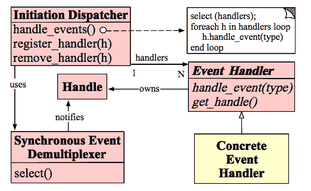

# 欢聚时代 2017 校招笔试题目（C 基础类）C 卷

## 1

同机房不同机器之间使用 ping 命令得到平均 rtt 与下面哪个值最接近

正确答案: D   你的答案: 空 (错误)

```cpp
50 ms
```

```cpp
5 ms
```

```cpp
0.5 ms
```

```cpp
0.05 ms
```

本题知识点

C++工程师 欢聚集团 2017

讨论

[我也支持](https://www.nowcoder.com/profile/6206174)

```cpp
我在北京
ping 本机 <1ms
ping baidu 5ms
ping taobao 20ms
ping qq     40ms
```

发表于 2017-09-01 10:59:12

* * *

[rppp](https://www.nowcoder.com/profile/9542322)

ping 主机：0.01msping 同机房：0.1msping 同城：1ms

发表于 2017-09-12 21:59:19

* * *

[Violette_](https://www.nowcoder.com/profile/7367451)

RTT，是指 Round-Trip Time，往返时延。ping 本机： 0.01ms ping 同机房机器： 0.1ms ping 同城机器： 1ms ping 不同城机器 

发表于 2017-08-31 14:48:17

* * *

## 2

64 位系统下有 `char ** p[4];` 请问 `sizeof p` 的值是多少

正确答案: C   你的答案: 空 (错误)

```cpp
8
```

```cpp
16
```

```cpp
32
```

```cpp
64
```

本题知识点

C++工程师 欢聚集团 2017 C++

讨论

[陕西吴彦祖](https://www.nowcoder.com/profile/2921659)

p 是个数组，所以 sizeof(p) 返回数组的占用大小，64 位情况下【char **p[4] 】 表示 【char** 数组】 返回 4 * 8 = 32【char *(*p)[4] 】 表示 【指向 char* 数组的指针】 返回 8【char (**p)[4] 】 表示 【指向 char 数组的指针的指针】 返回 8

发表于 2017-09-08 14:31:12

* * *

[51Hz](https://www.nowcoder.com/profile/541081)

先看个简单的 sizeof(a[10])：返回的是一个指针的大小，32 位下应该是 4int a[10],sizeof(a)：返回的是元素占用空间的大小，32 位下应该是 4*10=40；本题中 char **p[4]，p 是指向指针的指针，数组中存放的是指针。64 位下一个指针占 8 位，则 sizeof(p)返回的是元素占用空间的大小，4*8=32\.

发表于 2017-09-06 18:09:17

* * *

[sc 北海](https://www.nowcoder.com/profile/381605140)

p 是一个数组，存放了 4 个二维指针，4*8

发表于 2021-08-03 16:44:21

* * *

## 3

下面哪个方法不能直接支持负载均衡

正确答案: B   你的答案: 空 (错误)

```cpp
DNS
```

```cpp
NIC Bonding broadcast model
```

```cpp
LVS
```

```cpp
nginx upstream
```

本题知识点

C++工程师 欢聚集团 2017

讨论

[来自风平浪静的明天](https://www.nowcoder.com/profile/1085870)

A C D 选项都是服务器端 B 选项 NIC 其实是 网络适配器也就是网卡 是客户端 一看就和其他三个选项不一样 所以选 B 另外 C 和 D 都是负载均衡技术 DNS 也可以负载均衡

发表于 2017-09-04 10:18:47

* * *

## 4

关于下面代码的说法正确的是（）

```cpp
extern "C" {
    void foo(int) { }
}
```

正确答案: B   你的答案: 空 (错误)

```cpp
"C" 代表 c 语言
```

```cpp
这段代码应于在 c++语言代码中
```

```cpp
这段代码告诉 c++调用者这是一段 C 代码
```

```cpp
用 nm 查看，foo 实际被命名为类似风格 `__Z4fooi`
```

本题知识点

C++工程师 欢聚集团 2017 C++ C 语言

讨论

[青鸟 WD](https://www.nowcoder.com/profile/9992599)

**extern "C"指令中的 C，表示的一种编译和连接规约，而不是一种语言。C 表示符合 C 语言的编译和连接规约的任何语言，如 Fortran、assembler 等。**

发表于 2017-09-17 10:35:30

* * *

[萌新 fighting](https://www.nowcoder.com/profile/895689)

我来说下选项 D。我们用 nm 命令查看汇编代码，由 GNU C++汇编生成的改编后的函数名规则如下：每个改编后的函数名（除了 main 函数）以 2 个下划线（__）开始，后跟字母 Z、一个数值和函数名在跟着形参列表的编码(没有形参就不用了)。字母 Z 后的数值表示函数名称中字符的个数。例如，函数

```cpp
int donothing(char a, int b, float &c, double &d)
```

在它的函数名中有 9 个字符，所以改编后名字的前缀是 __Z9。然后，接着跟着函数名，后跟有它的形参列表的编码。在函数 donothing 的形参列表中 char 表示为 c， int 表示为 i, float &表示为 Rf， double &表示为 Rd。所以最终汇编形成的函数名为：

```cpp
__Z9donothingciRfRd
```

说到这里大家就知道为什么 d 是错的了。其实这个改编后的函数名就是函数签名，当发生函数重载时，编译器根据这个来区分该调用哪个函数。注意函数签名没有包括返回类型，所以如果 2 个函数只是返回类型不一样，函数签名一样，编译器还是无法区分就会发生报错啦。

编辑于 2021-01-09 19:31:21

* * *

[SingleXuu](https://www.nowcoder.com/profile/1160384)

C++在编译的时候为了解决函数多态的问题，会将函数名和参数联合起来生成一个中间的函数名称，这个‘C’就代表不要给我生成中间的函数名称，按照 C 语言的编译来

发表于 2017-11-18 20:41:27

* * *

## 5

下面对于友元函数描述正确的是

正确答案: C   你的答案: 空 (错误)

```cpp
友元函数的实现必须在类的内部定义
```

```cpp
友元函数是类的成员函数
```

```cpp
友元函数破坏了类的封装性和隐藏性
```

```cpp
友元函数不能访问类的私有成员
```

本题知识点

C++工程师 欢聚集团 2017 C++工程师 欢聚集团 2017

讨论

[青鸟 WD](https://www.nowcoder.com/profile/9992599)

友元函数没有 this 指针**2.1.1** 要访问非 static 成员时，需要对象做参数； **2.1.2** 要访问 static 成员或全局变量时，则不需要对象做参数；

**2.1.3 **如果做参数的对象是全局对象，则不需要对象做参数； 因为友元函数是类外的函数，所以它的声明可以放在类的私有段或公有段且没有区别。 可以直接调用友元函数，不需要通过对象或指针 **友元类** 可以声明为公有私有均可，常写为私有(把类看成一个变量) 声明类 A 是类 B 的友元类，则类 B 即可访问类 A 的所有成员，私有成员等

发表于 2017-09-17 10:55:50

* * *

[点滴快乐](https://www.nowcoder.com/profile/5634458)

友元函数的优点：能够提高效率，减少系统开销。1.在实现类之间数据共享时，例如类 A 中的函数要访问类 B 中的成员，那么类 A 中该函数就是类 B 的友元函数。2.运算符重载的某些场合需要使用友元。友元函数的缺点：友元函数破坏了封装机制，应该尽量不使用友元函数。

发表于 2017-09-05 14:30:06

* * *

## 6

请问对一个排好序的数组用二分法进行查找，时间复杂度为

正确答案: C   你的答案: 空 (错误)

```cpp
O(1)
```

```cpp
O(n)
```

```cpp
O(logn)
```

```cpp
O(nlogn)
```

本题知识点

C++工程师 欢聚集团 2017

讨论

[Mysticer](https://www.nowcoder.com/profile/771039)

二分查找:n,n/2，n/4…令 n/2*k=1\. 得 k=log2n（以 2 为为底的对数）

发表于 2017-09-12 12:02:42

* * *

## 7

下面关于 HTTP 状态码的说法哪个是正确的

正确答案: C   你的答案: 空 (错误)

```cpp
403 Forbidden, 这是一个服务器错误
```

```cpp
401 Unauthorized, 这是一个服务器错误
```

```cpp
404 Not Found, 这是一个客户端错误
```

```cpp
400 Bad Request, 这是一个服务器错误
```

本题知识点

C++工程师 欢聚集团 2017

讨论

[北路十三号](https://www.nowcoder.com/profile/2773166)

1**  信息，服务器收到请求，需要请求者继续执行操作 2**  成功，操作被成功接收并处理 3**  重定向，需要进一步的操作以完成请求 4**  客户端错误，请求包含语法错误或无法完成请求 5**  服务器错误，服务器在处理请求的过程中发生了错误

发表于 2017-08-31 10:45:45

* * *

[咿呀 0](https://www.nowcoder.com/profile/913039)

| 400 | Bad Request | 客户端请求的语法错误，服务器无法理解 |
| 401 | Unauthorized | 请求要求用户的身份认证 |
| 402 | Payment Required | 保留，将来使用 |
| 403 | Forbidden | 服务器理解请求客户端的请求，但是拒绝执行此请求 |
| 404 | Not Found | 服务器无法根据客户端的请求找到资源（网页）。通过此代码，网站设计人员可设置"您所请求的资源无法找到"的个性页面 |
| 405 | Method Not Allowed | 客户端请求中的方法被禁止 |

发表于 2017-08-31 14:41:43

* * *

## 8

linux 下使用 write 函数发送网络数据，函数返回 n(n>0),下面哪个说法正确

正确答案: A   你的答案: 空 (错误)

```cpp
本地已经发送 n 个字节到系统缓冲
```

```cpp
对端已经收到 n 个字节
```

```cpp
本地已经发送 n 个字节到网络
```

```cpp
本地发送失败
```

本题知识点

C++工程师 欢聚集团 2017 C++工程师 欢聚集团 2017

讨论

[及时行乐 z](https://www.nowcoder.com/profile/7818261)

TCP 发送方式：1.先写入 n 个数据到系统缓冲区 2.若写入的数据大于缓冲区大小，则 write 会阻塞或失败。3.直到接收到对方的确认号，系统才会把缓冲区的对应数据删除，然后通知应用程序缓冲区可用。UDP 发送方式：UDP 是以报文的形式发送的，若有一个完整的报文则立即发送，不需要对方回应，所以发送后数据就会被删除，不需要缓冲区。

发表于 2017-09-01 20:48:52

* * *

## 9

以下关于字节序描述正确的是

正确答案: B C D   你的答案: 空 (错误)

```cpp
网络字节序是 Little  endian
```

```cpp
网络字节序是 Big endian
```

```cpp
intel x86 系统是 Little endian
```

```cpp
htonl 是将无符号长整型从本机转换为网络字节序
```

本题知识点

C++工程师 欢聚集团 2017

讨论

[咿呀 0](https://www.nowcoder.com/profile/913039)

D 选项 htonl()把无符号长整形转换为网络字节序啊。

发表于 2017-08-31 14:43:44

* * *

[叶子、树与风的故事](https://www.nowcoder.com/profile/9699297)

htonl 从主机字节序转换为网络字节序 ntjol 从网络字节序转换为主机字节序网络字节序是大端 X86 是小端

发表于 2018-09-13 20:04:22

* * *

[轩辕剑](https://www.nowcoder.com/profile/4452710)

主机字节序：

就是自己的主机内部，内存中数据的处理方式，可以分为两种：

大端字节序（big-endian）：按照内存的增长方向，高位数据存储于低位内存中

小端字节序（little-endian）：按照内存的增长方向，高位数据存储于低位内存中 htonl()将主机数转换成无符号长整型的网络字节顺序。本函数将一个 32 位数从主机字节顺序转换成网络字节顺序。

编辑于 2017-09-08 10:42:48

* * *

## 10

以下关于性能指标描述正确的是

正确答案: C D   你的答案: 空 (错误)

```cpp
L1 cache reference : 20 ns
```

```cpp
L2 cache reference : 50 ns
```

```cpp
Main memory reference : 100 ns
```

```cpp
Mutex lock/unlock : 250,000 ns
```

本题知识点

C++工程师 欢聚集团 2017

讨论

[C/C++yanhaijiao](https://www.nowcoder.com/profile/6829475)

[`blog.csdn.net/adcxf/article/details/6313543`](http://blog.csdn.net/adcxf/article/details/6313543)

发表于 2017-09-01 16:45:44

* * *

[叶子、树与风的故事](https://www.nowcoder.com/profile/9699297)

完全不懂

发表于 2018-09-13 20:04:55

* * *

[青鸟 WD](https://www.nowcoder.com/profile/9992599)

| L1 *** reference 读取 CPU 的一级缓存 | 0.5 ns |
| Branch mispredict(转移、分支预测) | 5 ns |
| L2 *** reference 读取 CPU 的二级缓存 | 7 ns |
| Mutex lock/unlock 互斥锁\解锁 | 100 ns |
| Main memory reference 读取内存数据 | 100 ns |
| Compress 1K bytes with Zippy 1k 字节压缩 | 10,000 ns |
| Send 2K bytes over 1 Gbps network 在 1Gbps 的网络上发送 2k 字节 | 20,000 ns |
| Read 1 MB sequentially from memory 从内存顺序读取 1MB | 250,000 ns |
| Round trip within same datacenter 从一个数据中心往返一次，ping 一下 | 500,000 ns |
| Disk seek  磁盘搜索 | 10,000,000 ns |
| Read 1 MB sequentially from network 从网络上顺序读取 1 兆的数据 | 10,000,000 ns |
| Read 1 MB sequentially from disk 从磁盘里面读出 1MB | 30,000,000 ns |
| Send packet CA->Netherlands->CA 一个包的一次远程访问 | 150,000,000 ns  |

发表于 2017-09-17 11:19:29

* * *

## 11

关于下面代码，哪些描述是错误的（）

```cpp
std::vector<char> v{'1', '2', '3', '4'};
// A
v.push_back('5');
// B
```

正确答案: A B C D   你的答案: 空 (错误)

```cpp
*v.end() == '4'
```

```cpp
A 和 B 位置 v.capacity() 一定大于 v.size()
```

```cpp
如果 A 位置 v.size()与 v.capacity()分别是 4,4，那么 B 位置是 5,5
```

```cpp
如果 A 位置 v.size()与 v.capacity()分别是 4,4，A 位置&v[0]等于 B 位置的&v[0]
```

本题知识点

C++工程师 欢聚集团 2017 C++ C 语言

讨论

[咿呀 0](https://www.nowcoder.com/profile/913039)

D 选项，如果 size 超过了预先分配的 capacity，会重新分配一块增大了的内存(可能增加了原先的一半)，，把数据复制到新地址，释放旧地址，所以起点可能会不一样。

发表于 2017-08-31 14:52:54

* * *

[Sticker 咿呀 0](https://www.nowcoder.com/profile/6145035)

正确答案的确是 A,B,C,DA，vector push_back 操作会在数据最后添加元素，所以*v.end() == '4'B，vector 大小，初始化时指定多大就是多大 C，vector 会根据初始化的值，指定大小，后面 push_back 会调整 vector 数组大小 D ，如同 “[咿呀 0](https://www.nowcoder.com/profile/913039)”所解释的那样

发表于 2017-09-07 22:45:07

* * *

[叶赫那拉坤](https://www.nowcoder.com/profile/1392392)

B 选项，数学意义上讲 v.capacity()应该是一定大于等于 v.size().

发表于 2017-09-02 08:33:20

* * *

## 12

关于 volatile 的描述哪些错误的

正确答案: A B C D   你的答案: 空 (错误)

```cpp
能保证原子性（Atomicity）
```

```cpp
能保证顺序性（Ordering）
```

```cpp
能保证 volatile x=1 的原子性
```

```cpp
能用来进行多线程同步
```

本题知识点

C++工程师 欢聚集团 2017

讨论

[用户 2995727937](https://www.nowcoder.com/profile/2682718)

volatile 不能保证程序执行的原子性以及只能一定程度上保证有序性（能禁止指令重排序），但是这里只能保证 volatile 所修饰的变量之前的程序不会在该变量之后执行，该变量之后的代码不会在变量之前执行。明确的说，volatile 跟多线程无关，它不是一种同步手段，用它来实现线程安全是错的。

编辑于 2017-09-15 10:03:02

* * *

## 13

面向对象的设计原则，下面哪些是正确的

正确答案: A B C   你的答案: 空 (错误)

```cpp
SRP（单一职责原则）就一个类而言，应该仅有一个引起它变化的原因
```

```cpp
OCP（开闭原则）软件实体应该是可以扩展的，但是不可以修改
```

```cpp
DIP（依赖倒置原则）抽象不应该依赖于细节，细节应该依赖于抽象
```

```cpp
LSP（Liskov 替换原则）基类型必须能够替换掉它们的子类型
```

本题知识点

C++工程师 欢聚集团 2017

讨论

[找故事里的那个人](https://www.nowcoder.com/profile/772441)

面向对象的七种设计原则：1.SRP：Single responsibility principle   单一职责原则又称单一功能原则，核心：解耦和增强内聚性（高内聚，低耦合）2.开闭原则（OCP：Open Closed Principle）核心：对扩展开放，对修改关闭。即在设计一个模块的时候，应当使这个模块可以在不被修改的前提下被扩展。
3.里氏替换原则（LSP：Liskov Substitution Principle）核心：1.在任何父类出现的地方都可以用他的子类来替代（子类应当可以替换父类并出现在父类能够出现的任何地方）子类必须完全实现父类的方法。在类中调用其他类是务必要使用父类或接口，如果不能使用父类或接口，则说明类的设计已经违背了 LSP 原则。2.子类可以有自己的个性。子类当然可以有自己的行为和外观了，也就是方法和属性。3.覆盖或实现父类的方法时输入参数可以被放大。即子类可以重载父类的方法，但输入参数应比父类方法中的大，这样在子类代替父类的时候，调用的仍然是父类的方法。即以子类中方法的前置条件必须与超类中被覆盖的方法的前置条件相同或者更宽松。4.覆盖或实现父类的方法时输出结果可以被缩小。4.依赖倒转原则(DIP：Dependence Inversion Principle) 别名：依赖倒置原则或依赖反转原则。核心：要依赖于抽象，不要依赖于具体的实现。（1）.高层模块不应该依赖低层模块，两者都应该依赖其抽象（抽象类或接口）
（2）.抽象不应该依赖细节（具体实现）
（3）.细节（具体实现）应该依赖抽象。5.原则五：接口分离原则(ISP：Interface Segregation Principle) 核心思想：不应该强迫客户程序依赖他们不需要使用的方法。接口分离原则的意思就是：一个接口不需要提供太多的行为，一个接口应该只提供一种对外的功能，不应该把所有的操作都封装到一个接口当中.分离接口的两种实现方法：1.使用委托分离接口。（Separation through Delegation）2.使用多重继承分离接口。（Separation through Multiple Inheritance）6.合成复用原则（CRP：Composite Reuse Principle）核心思想：尽量使用对象组合，而不是继承来达到复用的目的。该原则就是在一个新的对象里面使用一些已有的对象，使之成为新对象的一部分：新的对象通过向这些对象的委派达到复用已有功能的目的。复用的种类：1.继承 2.合成聚合.注：在复用时应优先考虑使用合成聚合而不是继承 7.迪米特原则（LOD：Law of Demeter）又叫最少知识原则，核心思想：一个对象应当对其他对象有尽可能少的了解,不和陌生人说话。（类间解耦，低耦合）意思就是降低各个对象之间的耦合，提高系统的可维护性；在模块之间只通过接口来通信，而不理会模块的内部工作原理，可以使各个模块的耦合成都降到最低，促进软件的复用。注：1.在类的划分上，应该创建有弱耦合的类；2.在类的结构设计上，每一个类都应当尽量降低成员的访问权限；3.在类的设计上，只要有可能，一个类应当设计成不变；4.在对其他类的引用上，一个对象对其它对象的引用应当降到最低；5.尽量降低类的访问权限；6.谨慎使用序列化功能；7.不要暴露类成员，而应该提供相应的访问器(属性)。

发表于 2017-09-16 14:10:37

* * *

[叶赫那拉坤](https://www.nowcoder.com/profile/1392392)

D 选项，里氏替换原则，应该是父类出现的地方都可以用子类替代

发表于 2017-09-02 08:38:01

* * *

[青鸟 WD](https://www.nowcoder.com/profile/9992599)

单一职责原则 SRP：解耦和增强内聚性（高内聚，低耦合），专注于单一的功能
开闭原则 OCP：对扩展开放，对修改关闭
里氏替换原则 LSP：在任何父类出现的地方都可以用他的子类来替代
依赖倒转原则 DIP：要依赖于抽象，不要依赖于具体的实现，抽象不应该依赖细节，细节（具体实现）应该依赖抽象。
接口分离原则 ISP：一个接口应该只提供一种对外的功能
合成复用原则 CRP: 尽量使用对象组合，而不是继承来达到复用的目的。
迪米特原则 LOD：一个对象应当对其他对象有尽可能少的了解,不和陌生人说话

发表于 2017-09-17 11:39:19

* * *

## 14

有定义如下，
```cpp
  const char *p1 = "hello";
  char *const p2 = new char[12]{'h', 'e', 'l', 'l', 'o'};
```

正确答案: A D   你的答案: 空 (错误)

```cpp
p1++;
```

```cpp
p2++;
```

```cpp
p1 = '-';
```

```cpp
*(p2+1) = '-';
```

本题知识点

C++工程师 欢聚集团 2017 C++ C 语言

讨论

[Moody..未来可期](https://www.nowcoder.com/profile/247953307)

const 离谁更近就修饰谁。

*   const char *p1 中 const 修饰 char，表示 p1 所指向的内容为常量，不可改变，但指针 p1 本身可以改变；
*   char *const p2，const 修饰 p2，表示指针 p2 是一个常量，不可改变，但 p2 所指向的内容可以改变；

编辑于 2021-03-03 16:24:07

* * *

[牛起来 66](https://www.nowcoder.com/profile/1489658)

题目估摸着在问，下列哪些操作是正确的

发表于 2017-08-31 17:11:18

* * *

[猪有 Feel](https://www.nowcoder.com/profile/1995209)

p1 内容不能变 p2 指向不能变

发表于 2017-09-10 19:47:01

* * *

## 15

下面关于缓存的说法哪些正确

正确答案: A C D   你的答案: 空 (错误)

```cpp
缓存经常用来减少磁盘读压力
```

```cpp
在大数据系统中，数据的写入量越大更新越频繁，缓存越有价值
```

```cpp
对应用做性能测试时有时需要避免缓存生效
```

```cpp
硬盘也可以用来做缓存
```

本题知识点

C++工程师 欢聚集团 2017

讨论

[殷帅](https://www.nowcoder.com/profile/5428142)

硬盘缓存，很强势！

发表于 2017-09-10 20:13:02

* * *

[黄汉韬](https://www.nowcoder.com/profile/7252447)

有人可以解释一下 B 选项为什么错了吗？

发表于 2017-11-10 21:33:38

* * *

## 16

下面关于 reactor 模式的一些说法哪些是正确的

正确答案: D   你的答案: 空 (错误)

```cpp
reactor 利用多线程来支持多个连接
```

```cpp
reactor 中有阻塞 io 调用也不会影响并发性
```

```cpp
reactor 是异步的
```

```cpp
reactor 是非阻塞的
```

本题知识点

C++工程师 欢聚集团 2017

讨论

[黄汉韬](https://www.nowcoder.com/profile/7252447)

[`daimojingdeyu.iteye.com/blog/828696`](http://daimojingdeyu.iteye.com/blog/828696)

发表于 2017-11-10 21:40:05

* * *

[找故事里的那个人](https://www.nowcoder.com/profile/772441)

reactor 模式：reactor 设计模式，是一种基于事件驱动的设计模式。Reactor 框架是 ACE 各个框架中最基础的一个框架，其他框架都或多或少地用到了 Reactor 框架。 
      在事件驱动的应用中，将一个或多个客户的服务请求分离（demultiplex）和调度（dispatch）给应用程序。在事件驱动的应用中，同步地、有序地处理同时接收的多个服务请求。 
      reactor 模式与外观模式有点像。不过，观察者模式与单个事件源关联，而反应器模式则与多个事件源关联 。当一个主体发生改变时，所有依属体都得到通知优点：   1）响应快，不必为单个同步时间所阻塞，虽然 Reactor 本身依然是同步的； 
       2）编程相对简单，可以最大程度的避免复杂的多线程及同步问题，并且避免了多线程/进程的切换开销； 
       3）可扩展性，可以方便的通过增加 Reactor 实例个数来充分利用 CPU 资源； 
       4）可复用性，reactor 框架本身与具体事件处理逻辑无关，具有很高的复用性；
缺点： 1）相比传统的简单模型，Reactor 增加了一定的复杂性，因而有一定的门槛，并且不易于调试。 
      2）Reactor 模式需要底层的 Synchronous Event Demultiplexer 支持，比如 Java 中的 Selector 支持，操作系统的 select 系统调用支持，如果要自己实现 Synchronous Event Demultiplexer 可能不会有那么高效。 
      3） Reactor 模式在 IO 读写数据时还是在同一个线程中实现的，即使使用多个 Reactor 机制的情况下，那些共享一个 Reactor 的 Channel 如果出现一个长时间的数据读写，会影响这个 Reactor 中其他 Channel 的相应时间，比如在大文件传输时，IO 操作就会影响其他 Client 的相应时间，因而对这种操作，使用传统的 Thread-Per-Connection 或许是一个更好的选择，或则此时使用 Proactor 模式。
架构图如下：                                  

发表于 2017-09-16 14:14:48

* * *

## 17

试说明 bitmap/popcnt/bloom filter 的异同及常用的场景

你的答案

本题知识点

C++工程师 欢聚集团 2017

讨论

[吸着雾霾准备补考](https://www.nowcoder.com/profile/6244177)

Bitmap 正如其名，就是一块内存，内存是一个一个连续的位图，每一个位通过 0、1 代表一个元素的有无。比如数字为 N 的数字对应到 Bitmap 就是第 N/8 个 byte 的字节，和第 N%8 个 01 位，这么映射。所以通过检测对应的 bit 位即可知道数据在不在集合内，而且能保证正确。  BloomFilter，是由 Howard Bloom 在 1970 年提出的二进制向量数据结构，适合与比 Bitmap 更多量的数据，布隆过滤器（Bloom Filter）是 1970 年由布隆提出的。它实际上是一个很长的二进制向量和一系列随机映射函数。布隆过滤器可以用于检索一个元素是否在一个集合中。它的优点是空间效率和查询时间都远远超过一般的算法，缺点是有一定的误识别率和删除困难。  popcnt 是“population count”的缩写，该操作一般翻译为“位 1 计数”，即统计有多少个“为 1 的位”。例如，十六进制数“FF”，它有 8 个为 1 的位，即“popcnt(0xFF) = 8”。popcnt 主要应用在密码学与通信安全，例如计算汉明重量（Hamming weight）。

发表于 2017-09-15 17:32:29

* * *

## 18

试说明 AVL/2-3tree/RBTree 之间的关系、各自的特性

你的答案

本题知识点

C++工程师 欢聚集团 2017

讨论

[吸着雾霾准备补考](https://www.nowcoder.com/profile/6244177)

AVL 树中，一个非常重要的概念为平衡因子（Balance factor），对于任意节点 x ，其平衡因子定义为该节点右子树和左子树高度差，即 bf（x）=h（x-right）-h（x-left）。带有平衡因子 1、0 或 -1 的节点被认为是平衡的。带有平衡因子 -2 或 2 的节点被认为是不平衡的，并需要重新平衡这个树。平衡因子可以直接存储在每个节点中，或从可能存储在节点中的子树高度计算出来。一种二进制搜索树，其成本保证是对数的。 我们的树木有近乎完美的平衡，高度保证不超过 2 lg N.2-3 搜索树。 获得我们需要保证搜索树平衡的灵活性的主要步骤是允许我们树中的节点拥有多个密钥。定义。 一个 2-3 搜索树是树，要么是空的，或者：  具有一个键（和关联值）和两个链接的 2 节点，具有较小键的 2-3 个搜索树的左侧链接，以及具有较大键的 2-3 个搜索树的右侧链接  具有两个键（和相关联的值）和三个链接的 3 节点，具有较小键的 2-3 个搜索树的左链接，具有节点的键和右边的键之间的 2-3 个搜索树的中间链接 链接到 2-3 个搜索树与较大的键。一个完美平衡的 2-3 搜索树（或 2-3 棵树），其空链接距离根距离相同。AVL 树用高度来识别树的平衡程度，而红黑树则是用颜色来识别树的平衡。红黑树使用红色或者黑色来标识一个结点，一棵合法的树必须满足如下规则：（1）树根是黑色的；（2）空结点是黑色的；（3）红色的父节点不能有红色的孩子结点（4）从树根到所有叶子（空结点）的黑色结点的数目必须是相等的，从树根到叶子结点的黑色结点的数目称为树的黑高度（所有的子树也同样是一棵红黑树）。

发表于 2017-09-15 17:32:07

* * *

## 19

试说明 c++对关于空指针 0/NULL/nullptr 三者的演变

你的答案

本题知识点

C++工程师 欢聚集团 2017

讨论

[牛妹啊](https://www.nowcoder.com/profile/8729039)

对于指针类型的变量，在声明的时候我们一般会给一个初始化的值。否则很容易引起指针悬挂，成为用户程序的错误根源。典型的初始化指针是将其指向一个“空”的位置，比如 0.由于大多数计算机系统不允许用户程序写地址为 0 的内存空间，那么我们对指针所指地址赋值，那么运行时会导致程序退出。通常的指针初始化为：int * my_ptr = 0;或者使用 NULLint* my_ptr = NULL;一般情况下，NULL 是一个宏定义。在传统的 c 头文件（stddef.h）里我们可以找到相关的代码#undef NULL#if defined(__cplusplus)#define NULL 0#else#define NULL ((void*)0)#endif 可以看到，NULL 可能被定义为 0，或者 char*。但是使用的时候回出现 0 的二义性：void f(char* c){};void f(int i){};f(0);f(NULL);上面定义了两个函数，参数分别是指针和整形，但是调用函数时，参数是 NULL 的调用是 f(int i)。这就是 0 和 NULL 引起的二义性。为了解决这个问题，提出了新的关键字 nullptr，可以直接了当的表明，我这是空指针！！调用 f(nullptr)的时候，就会调用指针参数的函数。详细解释参考《深入理解 C++11 新特性解析与应用》P220

编辑于 2017-08-30 17:53:43

* * *

## 20

试说明 reactor 模式，并给出类图

你的答案

本题知识点

C++工程师 欢聚集团 2017

## 21

哈希表碰撞攻击后会退化成什么数据结构，试说明攻击的基本原理

你的答案

本题知识点

C++工程师 欢聚集团 2017

讨论

[吸着雾霾准备补考](https://www.nowcoder.com/profile/6244177)

哈希表碰撞攻击就是通过精心构造数据，使得所有数据全部碰撞，人为将哈希表变成一个退化的单链表，此时哈希表各种操作的时间均提升了一个数量级，因此会消耗大量 CPU 资源，导致系统无法快速响应请求，从而达到拒绝服务攻击（DoS）的目的。

可以看到，进行哈希碰撞攻击的前提是哈希算法特别容易找出碰撞，如果是 MD5 或者 SHA1 那基本就没戏了，幸运的是（也可以说不幸的是）大多数[编程语言](http://blog.jobbole.com/tag/%E7%BC%96%E7%A8%8B%E8%AF%AD%E8%A8%80/)使用的哈希算法都十分简单（这是为了效率考虑），因此可以不费吹灰之力之力构造出攻击数据。

发表于 2017-09-15 17:36:58

* * *

## 22

有一个分布式系统，开发者想利用 mysql 双主模式通过内置的自增索引为基础来实现一个全局唯一 id 生成服务，试说明方案与要点

你的答案

本题知识点

C++工程师 欢聚集团 2017

讨论

[青苹果侠客](https://www.nowcoder.com/profile/187346)

思路一：专门一个数据库，记录当前的 MaxId 值，插入记录时来取这个 MaxId，然后自增 1 后插入。缺点是存在单点瓶颈。思路二：让第一个数据库起始 id 为 1，每次插入自增步长为 2，第二个数据库起始 id 为 2，自增步长同样为 2。这样一个生成奇数 id，一个是偶数 id，不会重复。

发表于 2017-10-17 12:17:07

* * *

## 23

LFN（long fat network）是什么，会带来哪些问题，如何解决这些问题

你的答案

本题知识点

C++工程师 欢聚集团 2017

讨论

[我也支持](https://www.nowcoder.com/profile/6206174)

高带宽和高时延网络情况，这种网络通常称之为**长肥网络(Long Fat Network, LFN)**，也称之为**高带宽时延乘积网络(High-Bandwidth-Delay-Product Network，BDP)**。带宽时延乘积(BDP)通常表示网络通道的容量，也就是能够在网络中缓冲的数据量，显然带宽增大一倍或者时延增大一倍都会使得通道的容量加倍。**当这个乘积变得越来越大时，TCP 的局限性及开始暴露出来。**一个 100Mbps 的网络，如果时延是 100ms，那么 BDP 为 100,000,000*0.1/8=1,250,000 字节=1220.7K，如果是 1Gbps 的网络时延为 100ms，那么 BDP 为 12207K 左右，如果 TCP 跑在这种网络上，那么效率是非常低的。从 TCP 的首部中我们可以看到 TCP 利用 16 位来表示接收窗口 rwnd 大小，16 位能表示的最大值是 65535，由于 TCP 的发送窗口是取拥塞窗口 cwnd 和对端的接收窗口 rwnd 两者之间的最小值，那么显然发送窗口最大只能到 65535(以字节为单位)，显然该值与我们上述的网络 BDP 相差得太远，那么**TCP 就只能发送一阵数据然后就等待 ACK，极端下去就有点像“停等协议”了。这样 TCP 就无法充分利用网络带宽，浪费带宽现象严重。**

发表于 2017-09-01 14:54:41

* * *

[吸着雾霾准备补考](https://www.nowcoder.com/profile/6244177)

长肥管道带来的一些问题：（1）长肥管的带宽延时积很大, TCP 头部的窗口大小字段只能最多声明 65535(2¹⁶)字节大小的窗口, 因此不能充分利用网络, 由此提出了窗口扩***项以声明更大的窗口（2）由于长肥管的延时较高, 出现丢包的情况会使得管道枯竭(即网络通信速度急剧下降), 快重传快恢复算法就是用以削弱这一问题的影响, SACK 选项也有使用.（3）为了提高长肥管的吞吐量, 长肥管一般声明很大的窗口值, 而这样不利于 RTT 的测量(因为 TCP 只有一个 RTT 计时器, 启动 RTT 计时的数据在没有被 ACK 前, TCP 无法进行下一次 RTT 的测量, 而由于发送延时一般大于传播延时, 所以 TCP 往往是发送完一个窗口的数据计算一次 RTT), 所以需要引入时间戳选项提高测试 RTT 的频率.（4）由于长肥管的发送速度非常快, 所以导致很短时间内数据的序号就会重复(在 gigabit 网络只需要 34 秒就会出现序号重复). 因此引入 PAWS 算法应对这种情况.

发表于 2017-09-15 19:39:35

* * *

## 24

实现单链表的逆转函数，输入一个链表，反转链表后，返回翻转之后的链表。

本题知识点

链表 *模拟 C++工程师 欢聚集团 2017* *讨论

[xiao_niu_](https://www.nowcoder.com/profile/1825271)

```cpp
classSolution {
public:
    ListNode* ReverseList(ListNode* pHead) {
        ListNode* temp = pHead;
        ListNode* pre = NULL;
        while(temp != NULL){
            temp = pHead->next;
            pHead->next = pre;
            pre = pHead;
            pHead = temp;           
        }
        return pre;
    }
};
```

编辑于 2017-09-21 20:37:11

* * *

[baymaxhuang](https://www.nowcoder.com/profile/7360502)

```cpp
public class Solution {
    public ListNode ReverseList(ListNode head) {
        if(head == null) {
            return null;
        }
        ListNode node = head.next;
        head.next = null;
        while(node != null) {
            ListNode nextNode = node.next;
            node.next = head;
            head = node;
            node = nextNode;
        }
        return head;
    }
} 
```

发表于 2017-09-04 22:42:10

* * *

[叶赫那拉坤](https://www.nowcoder.com/profile/1392392)

剑指 offer 原题 classSolution {public:    ListNode* ReverseList(ListNode* pHead) {        ListNode* newHead=nullptr;        ListNode* current=pHead;        ListNode* pre=nullptr;        while(current){            ListNode* next=current->next;            if(next==nullptr){                newHead=current;            }            current->next=pre;            pre=current;            current=next;        }        returnnewHead;    }};

发表于 2017-09-02 09:28:44

* * **