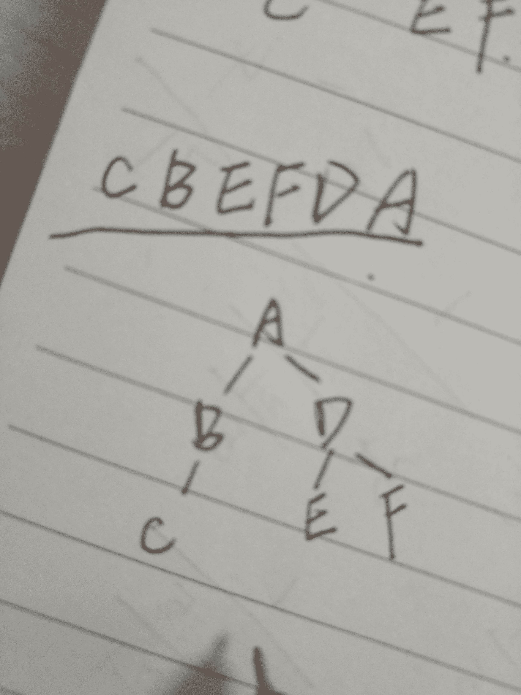
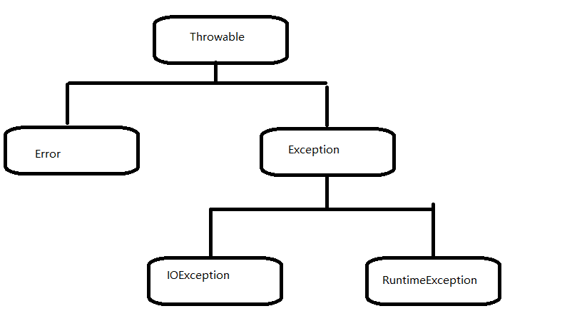
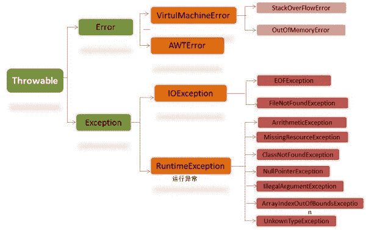

# 欢聚时代 2017 校招笔试题目（Android 工程师类）C 卷

## 1

 以下程序的运行结果是

```cpp
public class Increment{
 public static void main(String args[]) {
 int a;
 a = 6;
 System.out.print(a);
 System.out.print(a++);
 System.out.print(a);
 }
 }
```

正确答案: B   你的答案: 空 (错误)

```cpp
666
```

```cpp
667
```

```cpp
677
```

```cpp
676
```

本题知识点

安卓工程师 欢聚集团 2017

讨论

[日月王其](https://www.nowcoder.com/profile/806667955)

为什么是 C 不是 B,想不通

发表于 2018-09-07 17:34:15

* * *

## 2

关于类的描叙正确的是

正确答案: B   你的答案: 空 (错误)

```cpp
在类中定义的变量称为类的成员变量，在别的类中可以直接使用
```

```cpp
局部变量的作用范围仅仅在定义它的方法内，或者是在定义它的控制流块中
```

```cpp
使用别的类的方法仅仅需要引用方法的名字即可
```

```cpp
只要没有定义不带参数的构造函数，JVM 都会为类生成一个默认构造函数
```

本题知识点

安卓工程师 欢聚集团 2017

讨论

[前来打酱油的](https://www.nowcoder.com/profile/5757430)

D 看错了……如果有其他构造函数存在就不需要了……

发表于 2017-09-22 15:45:11

* * *

## 3

下列选项中关于 Java 中 super 关键字的说法正确的是

正确答案: A   你的答案: 空 (错误)

```cpp
super 关键字是在子类对象内部指代其父类对象的引用
```

```cpp
super 关键字不仅可以指代子类的直接父类，还可以指代父类的父类
```

```cpp
子类通过 super 关键字只能调用父类的方法，而不能调用父类的属性
```

```cpp
子类通过 super 关键字只能调用父类的属性，而不能调用父类的方法
```

本题知识点

安卓工程师 欢聚集团 2017

讨论

[夜静自然凉](https://www.nowcoder.com/profile/8178782)

**java 中的 super 关键词****super 关键词代表子类对象的父类特征，并且只能指代他的直接父类****在子类中通过 super 可以访问：****父类的成员变量，成员方法，构造方法****当子类中存在与父类相同的成员变量或成员方法时，由于子类的优先级较高，可以通过 super 关键词来访问父类中的属性和方法****子类中可以通过 super 调用父类的构造方法，但必须写在构造方法的第一行****子类中的构造方法默认调用的是父类的无参构造方法，因此当父类中没有无参构造方法时：****可以通过 super 关键词在子类的构造方法中调用父类的有参构造方法****也可以调用本类中其他调用了父类构造方法的其他构造方法，从而间接的调用父类的有参构造方法**还有听说 super 不是引用，不知道是不是对的。有知道的大神可以讲讲，我不是很明白

编辑于 2017-10-01 12:53:00

* * *

[牛客 288493 号](https://www.nowcoder.com/profile/288493)

```cpp
super 关键字是在子类对象内部指代其父类对象的引用，子类通过 super 关键字既可以调用父类的方法，也可以调用父类的属性。
但是在调用父类构造方法时要用 super(...);
```

发表于 2017-09-01 09:30:57

* * *

## 4

关于 String、StringBuilder 以及 StringBuffer，描述错误的是

正确答案: C   你的答案: 空 (错误)

```cpp
对 String 对象的任何改变都不影响到原对象，相关的任何 change 操作都会生成新的对象
```

```cpp
StringBuffer 是线程安全
```

```cpp
StringBuilder 是线程安全
```

```cpp
可以修改 StringBuilder 和 StringBuffer 的内容
```

本题知识点

安卓工程师 欢聚集团 2017

讨论

[从此。海比天蓝](https://www.nowcoder.com/profile/2309906)

StringBuffer:

```cpp
public synchronized StringBuffer replace(int start, int end, String str);
public synchronized String substring(int start);
public synchronized StringBuffer insert(int offset, Object obj);

```

StringBuilder:

```cpp
public StringBuilder replace(int start, int end, String str);
public StringBuilder append(Object obj);
public StringBuilder insert(int index, char[] str, int offset,int len)
```

StringBuffer 是线程安全，所有跟字符串对象操作有关的操作就加了同步锁 StringBuilder 是非线程安全的，但是单线程环境下访问操作就比 StringBuffer 更高效

发表于 2017-09-09 09:55:33

* * *

[黑色 Aquarius](https://www.nowcoder.com/profile/2981767)

String 每次进行赋值的时候都是创建了一个新对象，因为 String 字符串在底层就是静态 char 数组。而 StringBuilder，StringBuffer 底层是动态 char 数组且初始有一定长度，可改变（添加）新字符

发表于 2017-09-09 14:58:00

* * *

## 5

Java.Thread 的方法 resume()负责重新开始被以下哪个方法中断的线程的执行

正确答案: D   你的答案: 空 (错误)

```cpp
stop
```

```cpp
sleep
```

```cpp
wait
```

```cpp
suspend
```

本题知识点

安卓工程师 欢聚集团 2017

讨论

[从此。海比天蓝](https://www.nowcoder.com/profile/2309906)

resume 文档解释：This method exists solely for use withsuspend, which has been deprecated because it is deadlock-prone.

发表于 2017-09-09 09:58:41

* * *

## 6

如何放掉一个指定对象占据的内存空间？

正确答案: D   你的答案: 空 (错误)

```cpp
调用 free()方法
```

```cpp
代用 system.gc()方法
```

```cpp
赋值给该项对象的引用为 null
```

```cpp
程序员无法明确强制垃圾回收器回收某个对象
```

本题知识点

安卓工程师 欢聚集团 2017

讨论

[咸鱼吧，后浪！](https://www.nowcoder.com/profile/1365895)

> *   A：free()是 c 语言中的内存释放函数
>     同样的类似 delete，则是 c++中释放申请的内存空间用的
> *   B：system.gc()是让系统执行一次垃圾回收，但是在这个过程是无法明确指定系统去回收哪个对象的
> *   C:给对象赋值 null 之后，该对象不一定会被回收，

虚拟机对可回收对象的判定采用的是可达性分析算法，分析对象到 GC Roots 之间是否存在引用链，当即使在不存在引用链，即对象不可达的情况下，对象仍然有办法存活下来，对象在进行可达性分析后发现没有与 GC Roots 相连的引用链，则会对对象筛选，检查对象是否重写了 finalize（），若重写了并在方法中将该对象关联到了引用链，则对象可能存活下来

具体可参考《深入理解 Java 虚拟机》一书第三章

发表于 2017-09-05 21:44:57

* * *

## 7

关于 HashMap 与 HashTable，以下说法错误的是

正确答案: B   你的答案: 空 (错误)

```cpp
两者都是用 key-value 方式获取数据
```

```cpp
Hashtable 允许 null 值作为 key 和 value，而 HashMap 不可以
```

```cpp
HashMap 不是同步的，而 Hashtable 是同步的
```

```cpp
迭代 HashMap 采用快速失败机制，而 Hashtable 不是
```

本题知识点

安卓工程师 欢聚集团 2017

讨论

[笋笋鲸🐳](https://www.nowcoder.com/profile/2776979)

HashMap 和 Hashtable 都实现了 Map 接口，但决定用哪一个之前先要弄清楚它们之间的分别。主要的区别有：线程安全性，同步(synchronization)，以及速度。HashMap 几乎可以等价于 Hashtable，除了 HashMap 是非 synchronized 的，并可以接受 null(HashMap 可以接受为 null 的键值(key)和值(value)，而 Hashtable 则不行)。HashMap 是非 synchronized，而 Hashtable 是 synchronized，这意味着 Hashtable 是线程安全的，多个线程可以共享一个 Hashtable；而如果没有正确的同步的话，多个线程是不能共享 HashMap 的。另一个区别是 HashMap 的迭代器(Iterator)是 fail-fast 迭代器，而 Hashtable 的 enumerator 迭代器不是 fail-fast 的。所以当有其它线程改变了 HashMap 的结构（增加或者移除元素），将会抛出 ConcurrentModificationException，但迭代器本身的 remove()方法移除元素则不会抛出 ConcurrentModificationException 异常。但这并不是一个一定发生的行为，要看 JVM。这条同样也是 Enumeration 和 Iterator 的区别。  由于 Hashtable 是线程安全的也是 synchronized，所以在单线程环境下它比 HashMap 要慢。如果你不需要同步，只需要单一线程，那么使用 HashMap 性能要好过 Hashtable。

发表于 2017-09-07 13:03:09

* * *

[李林茂](https://www.nowcoder.com/profile/4820257)

快速失败机制应该就是快速报错，即 fail-fast（这个概念在 Thinking in Java Fourth Edition 中文版的 P517）。指的是，程序在对 collection 进行迭代时，某个线程对该 collection 在结构上对其做了修改，这时迭代器就会抛出 ConcurrentModificationException 异常信息，从而产生 fail-fast。

发表于 2017-09-04 23:20:00

* * *

[喃喃自语](https://www.nowcoder.com/profile/7690280)

什么是快速失败机制？

发表于 2017-08-31 19:22:57

* * *

## 8

算法的空间复杂度是指

正确答案: D   你的答案: 空 (错误)

```cpp
算法程序的长度
```

```cpp
算法程序中的指令条数
```

```cpp
算法程序所占的存储空间
```

```cpp
算法执行过程中所需要的存储空间
```

本题知识点

安卓工程师 欢聚集团 2017

讨论

[喃喃自语](https://www.nowcoder.com/profile/7690280)

算法的指令条数是时间复杂度。

发表于 2017-08-31 19:24:26

* * *

## 9

二叉树是非线性数据结构，所以

正确答案: D   你的答案: 空 (错误)

```cpp
它不能用顺序存储结构存储
```

```cpp
它不能用链式存储结构存储
```

```cpp
顺序存储结构和链式存储结构都不能使用
```

```cpp
顺序存储结构和链式存储结构都能存储
```

本题知识点

安卓工程师 欢聚集团 2017

讨论

[Barving](https://www.nowcoder.com/profile/9862465)

我可能不想说

发表于 2017-09-08 23:43:17

* * *

## 10

堆的形状是一棵

正确答案: A   你的答案: 空 (错误)

```cpp
完全二叉树
```

```cpp
满二叉树
```

```cpp
二叉排序树
```

```cpp
平衡二叉树
```

本题知识点

安卓工程师 欢聚集团 2017

讨论

[咸鱼吧，后浪！](https://www.nowcoder.com/profile/1365895)

来自：[`www.nowcoder.com/questionTerminal/03d7b6b75ad1445f8ca5592efb09dc45`](https://www.nowcoder.com/questionTerminal/03d7b6b75ad1445f8ca5592efb09dc45)

> 1.完全二叉树（深度为 k ，有 n 个结点的二叉树当且仅当其每一个结点都与深度为 k 的满二叉树中编号从 1 至 n 的结点一一对应时，称为完全二叉树。）
> 2.满二叉树（堆不保证节点的个数正好能构成满二叉树）
> 3.二叉排序树（最小堆只保证父节点比孩子节点小，并不是二叉排序树）
> 4.平衡二叉树（二叉平衡树肯定是一颗二叉排序树，堆不是二叉排序树）

发表于 2017-09-16 11:03:38

* * *

[Barving](https://www.nowcoder.com/profile/9862465)

咋没人说呢

发表于 2017-09-08 23:43:50

* * *

## 11

死锁”问题的讨论是针对（ ）的

正确答案: D   你的答案: 空 (错误)

```cpp
某个进程申请系统中不存在的资源
```

```cpp
某个进程申请资源数超过了系统拥有的最大资源数
```

```cpp
硬件故障
```

```cpp
多个并发进程竞争独占型资源
```

本题知识点

安卓工程师 欢聚集团 2017

## 12

结构化程序设计由三种基本结构组成，下面哪个不属于这三种基本结构之一

正确答案: B   你的答案: 空 (错误)

```cpp
顺序结构
```

```cpp
环形结构
```

```cpp
选择结构
```

```cpp
循环结构
```

本题知识点

安卓工程师 欢聚集团 2017

## 13

一棵二叉树的前序遍历是 ABCDEF，中序遍历结果是 CBAEDF，则后序遍历的结果为

正确答案: A   你的答案: 空 (错误)

```cpp
CBEFDA
```

```cpp
FEDCBA
```

```cpp
CBEDFA
```

```cpp
不定
```

本题知识点

安卓工程师 欢聚集团 2017

讨论

[creaylei](https://www.nowcoder.com/profile/7797366)

A

发表于 2017-09-06 10:27:02

* * *

[Bossy](https://www.nowcoder.com/profile/4400991)

答案选 A；前序遍历是 ABCDEF，所以根节点是 A；中序遍历结果是 CBAEDF，所以根节点左子树 CB，右子树 EDF；此时看根节点左子树 CB，在前序遍历是先 B 后 C，所以 C 是 B 的子节点；看根节点右子树 EDF，在前序遍历是 DEF，D 为 E 和 F 的父节点，中序遍历 EDF，所以 E 为左子树，F 为右子树。所以，可以得到，该二叉树结构如下：
所以得到二叉树的后序遍历是 CBEFBA.

发表于 2017-10-18 15:37:42

* * *

## 14

排序方法中，从未排序序列中依次取出元素与已排序序列（初始时为空） 中的元素进行比较，将其放入已排序序列的正确位置上的方法，称为（ ）。

正确答案: C   你的答案: 空 (错误)

```cpp
希尔排序
```

```cpp
冒泡排序
```

```cpp
插入排序
```

```cpp
选择排序
```

本题知识点

安卓工程师 欢聚集团 2017

## 15

以下对重载描述错误的

正确答案: B   你的答案: 空 (错误)

```cpp
方法重载只能发生在一个类的内部
```

```cpp
构造方法不能重载
```

```cpp
重载要求方法名相同，参数列表不同
```

```cpp
方法的返回值类型不是区分方法重载的条件
```

本题知识点

安卓工程师 欢聚集团 2017

讨论

[夜静自然凉](https://www.nowcoder.com/profile/8178782)

方法的重载：方法重载的定义：同一个类或与他的派生类中，方法名相同，而参数列表不同的方法。其中参数列表不同指的是参数的类型，数量，类型的顺序这三种至少有一种不同。方法重载与下列无关：与返回值类型无关；与访问修饰符无关方法的重写：方法的重写的定义：在继承关系的子类中，定义一个与父类相同的方法判断是否重写的方式：在方法之前加上@ Overri de 方法重写的特点：在继承关系的子类中重写父类的方法重写的方法必须方法名相同，参数列表也相同重写的方法的返回值类型应该与父类中被重写方法的返回值类型相同或是他的子类类型重写的方法的访问权限应该与父类中被重写方法的访问权限相同或高于它的访问权限重写的方法不能抛出比父类更加宽泛的异常方法重写的注意事项：构造方法不能被重写，不要问为什么？因为构造方法名必须和类名相同 private 修饰的成员方法不能被重写 static 修饰的方法不能被重写 final 修饰的方法不能被重写

编辑于 2017-10-01 01:48:12

* * *

[9028_qqq](https://www.nowcoder.com/profile/125866061)

重载：发生在同一个类中，方法名相同，参数类型、个数或顺序不同，其中，返回值类型不同其他相同不是重载。

发表于 2020-10-06 10:55:25

* * *

## 16

以下程序运行结果是（ ）

```cpp
public class Test extends Father{
 private String name=”test”;
 public static void main(String[] args){
 Test test = new Test();
 System.out.println(test.getName());
 }
 }
 class Father{
 private String name=”father”;
 public String getName() {
 return name;
 }
 }
```

正确答案: A   你的答案: 空 (错误)

```cpp
father
```

```cpp
test
```

```cpp
编译出错
```

```cpp
运行出错，无输出
```

本题知识点

安卓工程师 欢聚集团 2017

讨论

[贾荣川](https://www.nowcoder.com/profile/3764328)

子类没有重写父类方法，就不能访问子类私有变量

发表于 2017-09-24 18:51:12

* * *

[efficience](https://www.nowcoder.com/profile/4267108)

我是这样想的（答案是对的，但不知道想法对不对），子类继承了父类，如果子类中的方法想访问父类中的变量，似乎是不容易的（可以调用父类中的方法间接访问）。但是父类中方法想访问子类的变量似乎是不可能。

发表于 2017-09-19 11:16:03

* * *

## 17

以下对异常的描述不正确的有

正确答案: C   你的答案: 空 (错误)

```cpp
异常分为 Error 和 Exception
```

```cpp
Throwable 是所有异常类的父类
```

```cpp
Exception 是所有异常类父类
```

```cpp
Exception 包括 RuntimeException 和 RuntimeException 之外的异常
```

本题知识点

安卓工程师 欢聚集团 2017

讨论

[从此。海比天蓝](https://www.nowcoder.com/profile/2309906)

所有的异常都是由 Throwable 继承而来

发表于 2017-09-05 16:23:49

* * *

[咸鱼吧，后浪！](https://www.nowcoder.com/profile/1365895)

来自：深入理解 java 异常处理机制



发表于 2017-09-16 11:06:45

* * *

## 18

以下 try/catch/finally 描述不正确的有

正确答案: D   你的答案: 空 (错误)

```cpp
 try 块不可以省略
```

```cpp
可以使用多重 catch 块
```

```cpp
finally 块可以省略
```

```cpp
catch 块和 finally 块可以同时省略
```

本题知识点

安卓工程师 欢聚集团 2017

## 19

以下对自定义异常描述正确的是

正确答案: C   你的答案: 空 (错误)

```cpp
自定义异常必须继承 Exception
```

```cpp
自定义异常可以继承自 Error
```

```cpp
自定义异常可以更加明确定位异常出错的位置和给出详细出错信息
```

```cpp
程序中已经提供了丰富的异常类，使用自定义异常没有意义
```

本题知识点

安卓工程师 欢聚集团 2017

讨论

[Anotherniukewang](https://www.nowcoder.com/profile/800909)

自定义异常可以不继承 exception

发表于 2017-09-02 17:36:35

* * *

## 20

以下对 TCP 和 UDP 描述正确的是

正确答案: D   你的答案: 空 (错误)

```cpp
TCP 不能提供数据的可靠性
```

```cpp
UDP 能够保证数据库的可靠性
```

```cpp
TCP 数据传输效率高于 UDP
```

```cpp
UDP 数据传输效率高于 TCP
```

本题知识点

安卓工程师 欢聚集团 2017

讨论

[费于](https://www.nowcoder.com/profile/2322429)

TCP 有三次握手、四次握手；UDP 没有握手定则，无法确认数据传输开始跟结束，因为没有握手所以效率快一点，但是不可靠。

编辑于 2017-10-25 16:13:05

* * *

[凌霄♂](https://www.nowcoder.com/profile/5198104)

tcp 有三次握手，所以效率略低于 udp

发表于 2017-10-25 11:05:05

* * *

## 21

在 Java 中，()类提供定位本地文件系统，对文件或目录及其属性进行基本操作。

正确答案: D   你的答案: 空 (错误)

```cpp
FileInputStream
```

```cpp
FileReader
```

```cpp
FileWriter
```

```cpp
File
```

本题知识点

安卓工程师 欢聚集团 2017

## 22

Java 中的集合类包括 ArrayList、LinkedList、HashMap 等类，下列关于集合类描述错误的是

正确答案: C   你的答案: 空 (错误)

```cpp
ArrayList 和 LinkedList 均实现了 List 接口
```

```cpp
ArrayList 的访问速度比 LinkedList 快
```

```cpp
添加和删除元素时，ArrayList 的表现更好
```

```cpp
HashMap 实现 Map 接口，它允许任何类型的键和值对象，并允许将 null 用作键或值
```

本题知识点

安卓工程师 欢聚集团 2017

讨论

[会飞就看见了](https://www.nowcoder.com/profile/1470584)

选 c

发表于 2017-09-18 10:43:34

* * *

## 23

下列哪些情况下系统会弹出 Froce Close 对话框

正确答案: B C   你的答案: 空 (错误)

```cpp
应用运行时，Main 线程进行了耗时操作
```

```cpp
应用运行时抛出了 OutOfMemoryError
```

```cpp
应用运行时抛出了 RuntimeException
```

```cpp
应用运行时，用户操作过于频繁
```

本题知识点

安卓工程师 欢聚集团 2017

讨论

[syd。。。。](https://www.nowcoder.com/profile/6756471)

ANR，程序没有响应，有可能程序会再次响应

例子：

```cpp
  应用运行时，Main 线程进行了耗时操作
```

```cpp

```
  应用运行时，用户操作过于频繁
```cpp

```

Force close：程序抛出异常，会强制退出

例子：

```cpp
  应用运行时抛出了 OutOfMemoryError，

```
  应用运行时抛出了 RuntimeException
```cpp

```

发表于 2017-09-01 15:33:32

* * *

## 24

关于 Android Service 生命周期的 onCreate()和 onStart()说法正确的是?

正确答案: A D   你的答案: 空 (错误)

```cpp
当第一次启动的时候先后调用 onCreate()和 onStart()方法
```

```cpp
当第一次启动的时候只会调用 onCreate()方法
```

```cpp
如果 service 已经启动，将先后调用 onCreate()和 onStart()方法
```

```cpp
如果 service 已经启动，只会执行 onStart()方法，不在执行 onCreate()方法
```

本题知识点

安卓工程师 欢聚集团 2017

讨论

[致姗姗来迟的 offer](https://www.nowcoder.com/profile/338434)

第一次启动时不应该也是要调用 onStart（）方法吗？

发表于 2017-09-07 21:04:22

* * *

[Anotherniukewang](https://www.nowcoder.com/profile/800909)

第一次启动时只会调用 oncreate

发表于 2017-09-02 17:37:26

* * *

[牛客 288493 号](https://www.nowcoder.com/profile/288493)

答案是错的

发表于 2017-09-01 10:10:16

* * *

## 25

在 android 中使用 Menu 时可能需要重写的方法有?

正确答案: A C   你的答案: 空 (错误)

```cpp
onCreateOptionsMenu()
```

```cpp
onCreateMenu()
```

```cpp
onOptionsItemSelected()
```

```cpp
onItemSelected()
```

本题知识点

安卓工程师 欢聚集团 2017

讨论

[syd。。。。](https://www.nowcoder.com/profile/6756471)

1.  public class MainActivity extends Activity {  

3.  @Override  
4.  protected void onCreate(Bundle savedInstanceState) {  
5.  super.onCreate(savedInstanceState);  
6.  setContentView(R.layout.activity_main);  
7.  }  

9.  @Override  
10.  public boolean onCreateOptionsMenu(Menu menu) {  
11.  // Inflate the menu; this adds items to the action bar if it is present.  
12.  getMenuInflater().inflate(R.menu.activity_main, menu);  
13.  return true;  
14.  }  

16.  @Override  
17.  public boolean onOptionsItemSelected(MenuItem item) {  
18.  // TODO Auto-generated method stub  
19.  switch(item.getItemId()){  
20.  case R.id.menu_about:             
21.  Toast.makeText(MainActivity.this, ""+"关于", Toast.LENGTH_SHORT).show();  
22.  break;  
23.  case R.id.menu_settings:  

25.  Toast.makeText(MainActivity.this, ""+"设置", Toast.LENGTH_SHORT).show();  
26.  break;  
27.  case R.id.menu_quit:  

29.  Toast.makeText(MainActivity.this, ""+"退出", Toast.LENGTH_SHORT).show();  
30.  break;  
31.  default:  
32.  break;  
33.  }  
34.  //         Toast.makeText(MainActivity.this, ""+item.getItemId(), Toast.LENGTH_SHORT).show();  

36.  return super.onOptionsItemSelected(item);  
37.  }  

发表于 2017-09-01 15:22:53

* * *

## 26

下列关于数据持久化的描述正确的有

正确答案: B D   你的答案: 空 (错误)

```cpp
在内存中缓存多个 Bitmap 对象是一种数据持久化方法
```

```cpp
SQLite 数据库文件可以保存在 SD 卡中
```

```cpp
ContentProvider 的主要目的是为了将 Android 应用的数据持久化
```

```cpp
数据持久化就是将内存的数据保存到外存
```

本题知识点

安卓工程师 欢聚集团 2017

讨论

[咸鱼吧，后浪！](https://www.nowcoder.com/profile/1365895)

来源：Android 数据持久化技术（即数据存储方式）

* * *

在讨论数据持久化技术之前我们先了解几个概念？

> **什么是瞬时数据：**存储在内存当中，有可能会因为程序的关闭或其他原因导致内存被收回而丢失的数据。
> 
> **为什么采用数据持久化技术：**为了保证关键数据在程序退出时不被丢失。
> 
> **什么是数据持久化技术：**将内存中的瞬时数据保存到存储设备中，保证手机在关机的情况下数据仍然不会丢失。
> 
> **安卓提供了三种方式用于简单的数据持久化功能：**
> 
> 1.  文件储存；
> 2.  SharedPreference 存储；
> 3.  SQLite 数据库储存。

* * *

> 1\. 为什么用 ContentProvider？ 
> 
> 1.1  Android 提供的持久化数据中，包括文件存储、SharedPreferences 存储以及 sql 数据库存储都只能在当前应用程序中访问，其他程序无法访问当前程序中的数据。所以出现了内容提供器 ContentProvider 1.2 ContentProvider 系 Android 四大组件之一，主要用于程序间的数据共享，它提供了一套机制，允许一个程序访问另一个程序中的数据同时还能保证数据的安全性，是 Android 跨程序共享数据的标准方式。 1.3 和 sql 的实现差别： 1.3.1 ContentProvider 屏蔽了数据存储的细节,内部实现透明化,用户只需关心 uri 即可(是否匹配)；而 sql 数据库访问用户需要知道数据表的详情 1.3.2  ContentProvider 能实现不同 app 的数据共享；sql  只能是自己程序才能访问 1.3.3  Contentprovider 可以增删本地的文件,xml 等信息

编辑于 2017-09-18 10:48:22

* * *

[笋笋鲸🐳](https://www.nowcoder.com/profile/2776979)

Content Provider 主要用于在**不同的应用程序之间（因而是完成 IPC 的一种）实现数据共享的功能**，它提供了一套完整的机制，允许一个程序访问另一个程序中的数据，同时还能保证被访数据的安全性。目前，使用 ContentProvider 是 Android 实现**跨程序共享数据**的标准方式,因为它提供了**统一的数据访问方式**

发表于 2017-09-07 17:04:08

* * *

## 27

android 中使用 SQLiteOpenHelper 这个辅助类时，可以生成一个数据库，并可以对数据库进行管理的方法可以是?

正确答案: A B   你的答案: 空 (错误)

```cpp
getWriteableDatabase()
```

```cpp
getReadableDatabase()
```

```cpp
getDatabase()
```

```cpp
getAbleDatabase()
```

本题知识点

安卓工程师 欢聚集团 2017

## 28

下面关于 Android 中定义 style 和 theme 的描述正确的是？

正确答案: A B C D   你的答案: 空 (错误)

```cpp
都可以减少重复属性设置
```

```cpp
style 可以作用在 Activity 上
```

```cpp
Theme 类可以继承
```

```cpp
一个 TextView 的 style 中定义了 textColor 属性，TextView 本身也设置 textColor 属性，那么 TextView 本身定义的优先级较高
```

本题知识点

安卓工程师 欢聚集团 2017

讨论

[咸鱼吧，后浪！](https://www.nowcoder.com/profile/1365895)

*   B: 官方文档定义如下

    > `A style is a collection of properties that specify the look and format for a View or window，A theme is a style applied to an entire Activity or application 所以 B 对`

*   C:

    > 出题人所说能不能继承指的是 Theme 这个类的不可继承吧，强调的是类为 final 所以不能继承。
    > 而在 XML 里头使用 parent 来指明父 Theme 这种不属于类的继承。 也算是有歧义的题目了，因为不知道“继承”是指类的这种狭义的继承还是后者那种广义的继承。

*   D:

    > XML 解析方式为:
    > 遇到 parent 之后之后就去 parent 里头解析，然后如此递归，解析完各级的父 XML 之后，再回到子 XML 解析。然后后解析的 XML 元素覆盖前面解析的同名 XML 元素，就是模拟了类的继承啦 所以 D 是对的，因为子覆盖父

编辑于 2017-09-05 21:30:56

* * *

[凌霄♂](https://www.nowcoder.com/profile/5198104)

醉了，同样的题，不同的答案，theme 类是被 final 修饰的，不能被继承

发表于 2017-10-25 11:07:51

* * *

[Anotherniukewang](https://www.nowcoder.com/profile/800909)

style 可以作用在 activity 上 view 自己的属性值优先级高于 style

发表于 2017-09-02 17:38:34

* * *

## 29

为什么要用 ContentProvider?它和 sql 的实现上有什么差别?

你的答案

本题知识点

安卓工程师 欢聚集团 2017

讨论

[不吃猫的鱼](https://www.nowcoder.com/profile/4222994)

ContentProvider 实现了不同 APP 之间数据共享，ContentProvider 为其他应用程序提供了访问本应用程序的接口，其他应用程序可以通过 ContentResolver 来操作 ContentProvider 提供的数据，同时 ContentProvider 保证了被访数据的安全性，用户只需要关心操作数据的 uri 就可以了。sql 也有增删改查的方法，单 sql 只能操作本应用下的数据库。

发表于 2017-09-13 16:20:24

* * *

[九里 BNine](https://www.nowcoder.com/profile/2593782)

  ContentProvider 出现的原因是为了数据共享，它和 sql 主要区别为它可以自定义共享的文件的暴露，sql 不具备设置共享数据的权限。

发表于 2018-05-05 15:11:18

* * *

## 30

SQLite 支持事务吗?添加删除如何提高性能?

你的答案

本题知识点

安卓工程师 欢聚集团 2017

讨论

[享受人生 201806140911863](https://www.nowcoder.com/profile/427252116)

支持事务

发表于 2020-08-03 07:18:22

* * *

## 31

请解释下在单线程模型中 Message、Handler、Message Queue、Looper 之间的关系。

你的答案

本题知识点

安卓工程师 欢聚集团 2017

讨论

[严乐](https://www.nowcoder.com/profile/655059)

应该是多线程模型吧，而不是单线程。。。

发表于 2017-08-31 18:19:40

* * *

## 32

输入一组未排序的整数，找出其中最长的连续数字的长度。例如输入为[3,1,2,5,7,4,8,9] ，其中连续的数据为 1,2,3,4,5，长度为 5 。要求算法时间复杂度为 O(n).本题会人工判卷,请严格按照复杂度完成算法。

本题知识点

队列 *数组 动态规划 安卓工程师 欢聚集团 2017* *讨论

[ChirstyL](https://www.nowcoder.com/profile/559857901)

运行时间：10ms
超过 100.00%用 Java 提交的代码占用内存：9276KB
超过 50.00%用 Java 提交的代码
import java.io.BufferedReader;
import java.io.InputStreamReader;
import java.io.IOException;
import java.util.Set;
import java.util.HashSet;
public class Main{

    public static void main(String[] args) throws IOException{
        BufferedReader sc= new BufferedReader(new InputStreamReader(System.in));
        String input = sc.readLine();
        input = input.substring(1,input.length()-1);
        String[] inputData = input.split(",");
        int n = inputData.length;
        int[] matrix = new int[n];

        int[] fuzhu = new int [32];
        Set<Integer> set= new HashSet<>();

        for(int i = 0; i<n;i++){
            matrix[i] = Integer.parseInt(inputData[i]);
            set.add(matrix[i]);
        }

        for(int i =0; i<32;i++){
            fuzhu[i]=-1;
        }

        for(Integer num : set){
            fuzhu[num]=1;
        }

        int maxLen = 0;
        int len = 0;
        for(int i = 0 ;i<32;i++){
            if(fuzhu[i]>0){
                len++;
                maxLen = Math.max(maxLen,len);
            }
            else{
                len = 0;

            }
        }

        System.out.println(maxLen);
    }
}

发表于 2021-03-19 22:59:06

* * *

[拿不到 offer 的咸鱼](https://www.nowcoder.com/profile/8577982)

```cpp
import java.util.HashSet;
import java.util.Scanner;

public class Main {

    public static int getMaxCount(String []nums){
        HashSet<Integer> data = new HashSet<>();
        int min = Integer.MAX_VALUE;
        int max = Integer.MIN_VALUE;
        for(int i=0;i<nums.length;i++){
            int input = Integer.valueOf(nums[i]);
            data.add(input);
            if(input<min){
                min = input;
            }
            if(input>max){
                max = input;
            }
        }
        int count = 1;
        int maxCount = 1;
        for(int i = min+1;i<=max;i++){
            if(data.contains(i)){
                count++;
                if(count>maxCount){
                    maxCount = count;
                }
            }else{
                count = 0;
            }
        }
        return maxCount;
    }
    public static void main(String[] args) {
        Scanner sc = new Scanner(System.in);
        String inputData = sc.nextLine();
        inputData = inputData.substring(1,inputData.length()-1);//去括号
        String nums[] = inputData.split(",");
        System.out.println(getMaxCount(nums));
    }
}
```

输入还特喵带括号。。。

编辑于 2017-09-03 00:23:36

* * *

[Yanzongyuan](https://www.nowcoder.com/profile/801066705)

#include <iostream>#include<queue>
#include<vector>
#include<sstream>
#include<string>

using namespace std;

int main()
{
    //越小的优先级越高
    priority_queue<int,vector<int>,greater<int>> q;

    string str1;
    getline(cin,str1);

    stringstream ss(str1);
    char x;
    int num = 0;
    while(ss>>x)
    {
        if(x == ']')
            break;
        ss>>num;
        q.push(num);
    }
    //开始查找连续的数据，优先队列已经给里面的数据进行了排序
    int maxlen = 0;
    int len = 1;
    int size = q.size();
    for(int i= 0; i < size; i++)
    {
        int temp = q.top();
        q.pop();
        //说明是连续的
        if(q.top() - temp == 1)
            len++;
        else
        {
            len = 1;
        }

        maxlen = max(maxlen , len);
    }

    cout << maxlen << endl;

}

发表于 2021-07-08 14:58:45

* * *

## 33

输入一个排好序的整数数组，找到指定目标数的开始和结束位置。如果指定的数字不在数组中，则输出 [-1,-1]。例如，输入数组为[5, 7, 7, 8, 8, 10]， 目标数为 8, 输出[3, 4].本题会人工判题，要求时间复杂度 O(logn)

本题知识点

数组 安卓工程师 欢聚集团 2017

讨论

[为了工作](https://www.nowcoder.com/profile/1019059)

1.  因为题目要求时间复杂度是 O(logn)，故不能用简单的遍历方式查找，需要使用二分查找的方式。注意：这里在用二分查找法找到目标数字后，不能使用从该位置逐一往前或往后判断值是否仍然是目标数的“线性探测”方法做，因为可能会有以下一种情况：输入数组的所有元素值都是目标数，这样的话用二分+线性探测的方式的复杂度是 O(n)。
2.  这道题主要考察的点是二分的使用、是否对边界情况考虑周全。
3.  以下是**java**实现的代码，有详细注释(所以看着好像很长，但原理很简单)

```cpp
import java.util.Scanner;
public class Main {
    public static void main(String[] args) {
        Scanner scanner = new Scanner(System.in);
        int n = scanner.nextInt();
        int target = scanner.nextInt();
        scanner.nextLine();
        int[] arr = new int[n];
        for (int i = 0; i < n; i++) {
            arr[i] = scanner.nextInt();
        }
        // begin 和 end 分别为数组的起始和结束位置
        int begin = 0;
        int end = n - 1;
        // beginFoundLocation 记录找到的目标值第一次出现的地方
        int beginFoundLocation = -1;
        // endFoundLocation 记录找到的目标值最后一次出现的地方
        int endFoundLocation = -1;
        endFoundLocation = findLastLocation(begin, end, arr, target);
        beginFoundLocation = findFirstLocation(begin, end, arr, target);
        System.out.println("[" + beginFoundLocation + "," + endFoundLocation + "]");
    }
    // 在 arr 数组的 begin 到 end 的范围内，寻找 target 第一次出现的位置
    public static int findFirstLocation(int begin, int end, int[] arr, int target) {
        // 记录中间点的位置及其值
        int middle = 0;
        int middleValue = arr[0];
        while (begin <= end) {
            middle = begin + (end - begin) / 2;
            middleValue = arr[middle];
            /*    
             * 二分查找：当中间位置点的值比 target 要小的时候就将寻找的起始位置（begin）设置为中间位置的下一个位置，
             * 当中间位置点的值比 target 要大的时候就将寻找的终止位置（end）设为中间位置的下一个位置 */
            /*
             * 注意：当中间位置的点的值正好是 target 的时候，需要看该位置的前一个位置点的值是否也为 target，这就分为以下
             * 三种情况
             * 1.可能此时中间位置已经是 0，也就是指向了数组的
             * 第一个元素，它没有前一个位置点，说明 target 第一次出现的位置就是 0
             * 2.中间位置不是 0，而且中间位置的前一个位置的值也是 target，则继续用二分法在前面查找 target
             * （注：这里不能用线性探测的方法，因为当输入数组元素值全部正好是 target 的时候，就成了遍历整个数组前半段，
             * 同理找最后 target 出现的位置也不能用线性探测法）。
             * 3.中间位置不是 0，而且中间位置的前一个位置的值不是 target，则正好该中间位置就是 target 第一次出现的位置，
             * 返回就好了。
             */
            if (middleValue < target) {
                begin = middle + 1;
            } else if (middleValue > target) {
                end = end - 1;
            } else if (middle > 0 && arr[middle - 1] == target) {
                end = middle - 1;
            } else if (middle > 0 && arr[middle - 1] != target) {
                return middle;
            } else if (middle == 0) {// 这里需要判定下，因为会有 begin=end=0 的情况，会死循环。
                return 0;
            }
        }
        // 当循环条件不满足的时候，可能是找到了 target 第一次出现的位置，也可能是 target 根本不在数组中
        if (arr[middle] != target) {
            return -1;
        } else {
            return middle;
        }
    }
    // 寻找 target 最后出现的位置，具体原理和寻找最初出现的位置相似
    public static int findLastLocation(int begin, int end, int[] arr, int target) {
        int middle = 0;
        int middleValue = arr[0];
        int lastArr = arr.length - 1;
        while (begin <= end) {
            middle = begin + (end - begin) / 2;
            middleValue = arr[middle];
            if (middleValue < target) {
                begin = middle + 1;
            } else if (middleValue > target) {
                end = end - 1;
            } else if (middle < lastArr && arr[middle + 1] == target) {
                begin = middle + 1;
            } else if (middle < lastArr && arr[middle + 1] != target) {
                return middle;
            } else if (middle == lastArr) {// 同样是为了防止死循环，需要判断下
                return lastArr;
            }
        }
        if (arr[middle] != target) {
            return -1;
        } else {
            return middle;
        }
    }
}
```

编辑于 2017-09-29 15:40:58

* * *

[牛客 298596143 号](https://www.nowcoder.com/profile/298596143)

import java.util.Scanner;

public class Test{
public static void main(String[] args){
    Scanner scanner = new Scanner(System.in);
    String a = scanner.nextLine();
    a = a.substring(1,a.length()-1);
    String[] b = a.split(",");
    int target = scanner.nextInt();
    int[] c = new int[b.length];
    for(int i=0;i<b.length;i++) {
        c[i] = Integer.valueOf(b[i]);
    }
    first(target,c);
}

static void first(int target,int[] c) {
    int n = c.length;
    int start = 0,end = n-1;
    int first=0,last=0;
    int mid = (n-1)/2,midvalue = c[mid];
    while(start<end) {
        if(target<midvalue) {
            end = mid-1;
            mid = end/2;
            midvalue = c[mid];
        }else if(target>midvalue) {
            start = mid+1;
            mid = (end + start)/2;
            midvalue = c[mid];
        }else {
            first = mid; last = mid;
            for(int i=mid;i>=start;i--) {
                if(c[i-1]!=target) {
                    first = i;
                    start = end;
                    break;
                }
            }
            for(int i=mid;i<=end;i++) {
                if(c[i+1]!=target) {
                    last = i;
                    start = end;
                    break;
                }
            }
         }
}
System.out.print(first+"      "+last);
}
}

编辑于 2020-05-30 14:23:44

* * *

[一直加油鸭](https://www.nowcoder.com/profile/3283266)

leetcode 34 题

```cpp

	import java.util.*;
public class Main{
    public static void main(String[] args){
        Scanner scan = new Scanner(System.in);
        int n = scan.nextInt();
        int target = scan.nextInt();
        scan.nextLine();
        int[] nums = new int[n];
        for(int i=0; i<n; i++){
            nums[i] = scan.nextInt();
        }
        System.out.println("["+searchRange(nums,target)[0]+","+searchRange(nums,target)[1]+"]");
    }
    public static int[] searchRange(int[] nums, int target) {
        int[] ans = {-1,-1};
        if(nums == null || nums.length == 0) return ans;
        int low = 0, high = nums.length-1;
        if(low == high && nums[0] == target) return new int[] {0,0};
        while(low < high){
            int mid = low + (high-low)/2;
            if(nums[mid] < target){
                low = mid + 1;
            }else{
                high = mid;
            }
            if(low == high && nums[low] == target){
                ans[0] = low;
            }
        }
        low = 0; high = nums.length-1;
        while(low < high){
            int mid = low + (high-low+1)/2;
            if(nums[mid] > target){
                high = mid - 1;
            }else{
                low = mid;
            }
            if(low == high && nums[low] == target){
                ans[1] = low;
            }
        }
        return ans;
    }
}

```

编辑于 2018-03-20 10:45:28

* * *</iostream>*