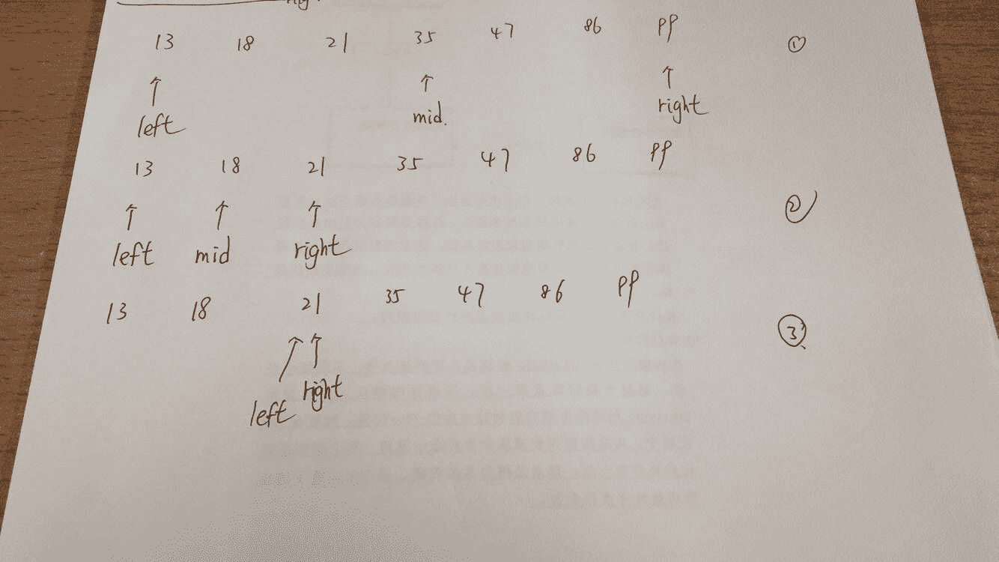
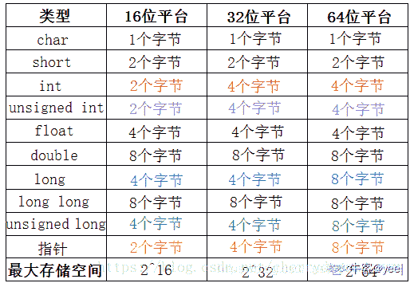
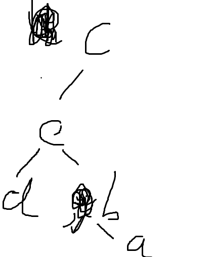

# 欢聚时代 2017 校招笔试题目（iOS 工程师类）C 卷

## 1

以下数据结构属于非线性数据结构的是

正确答案: B   你的答案: 空 (错误)

```cpp
队列
```

```cpp
二叉树
```

```cpp
栈
```

```cpp
数组
```

本题知识点

iOS 工程师 欢聚集团 2017 iOS 工程师 欢聚集团 2017

讨论

[shiyan 娃娃](https://www.nowcoder.com/profile/612398)

队列，栈，数组都属于线性结构，二叉树属于非线性结构。

发表于 2017-08-31 17:48:07

* * *

## 2

关于链表，下面说法错误的是

正确答案: B   你的答案: 空 (错误)

```cpp
不必事先估计存储空间
```

```cpp
可随机访问任一元素
```

```cpp
插入删除不需要移动元素
```

```cpp
所需空间与线性表长度成正比
```

本题知识点

iOS 工程师 欢聚集团 2017 iOS 工程师 欢聚集团 2017

讨论

[Pro_tected](https://www.nowcoder.com/profile/198873920)

A.采用动态存储分配，不会造成内存浪费和溢出。

B. 不能随机访问，查找时要从头指针开始遍历

C. 插入、删除时，只要找到对应前驱结点，修改指针即可，无需移动元素

D. 需要用额外空间存储线性表的关系，存储密度小

编辑于 2020-02-05 21:59:08

* * *

[shiyan 娃娃](https://www.nowcoder.com/profile/612398)

顺序表可随机访问任一元素，而链表不能。链表访问结点必须要从头结点开始，并不是可以随机访问任一元素。链表无需事先估计存储空间大小切所需空间郁存储元素成正比。链表插入、删除不需要移动元素。链表所需空间与线性表长度成正比。

发表于 2017-08-31 17:53:21

* * *

## 3

以下四种排序算法中，平均情况下时间复杂度最高的是

正确答案: C   你的答案: 空 (错误)

```cpp
堆排序
```

```cpp
快速排序
```

```cpp
选择排序
```

```cpp
归并排序
```

本题知识点

iOS 工程师 欢聚集团 2017

讨论

[shiyan 娃娃](https://www.nowcoder.com/profile/612398)

时间复杂度如下：
堆排序：O（nlog2n）（注意：2 表示的是底数）快速排序：O（nlog2n）（注意：2 表示的是底数）归并排序：O（nlog2n）（注意：2 表示的是底数）选择排序：O（n2）（注意：2 表示的是平方）

编辑于 2017-08-31 17:58:36

* * *

## 4

在一个具有 n 个顶点的无向图中，要连通全部顶点至少需要多少条边？

正确答案: C   你的答案: 空 (错误)

```cpp
n
```

```cpp
n+1
```

```cpp
n-1
```

```cpp
n/2
```

本题知识点

iOS 工程师 欢聚集团 2017

讨论

[阿诺 41](https://www.nowcoder.com/profile/8089149)

一个具有 n 个顶点的最小连通图的边数是 n-1。

发表于 2017-09-17 11:34:04

* * *

## 5

将长度为 n 的有序单链表 LA 与长度为 m 的有序单链表 LB 合并为一条有序的单链表 LC，算法的时间复杂度为

正确答案: D   你的答案: 空 (错误)

```cpp
O(1)
```

```cpp
O(n)
```

```cpp
O(m)
```

```cpp
O(m+n)
```

本题知识点

iOS 工程师 欢聚集团 2017

讨论

[Kaztha](https://www.nowcoder.com/profile/4986155)

有序合并、在合并的时候为了保证有序需要遍历两条链表。

发表于 2017-09-11 16:50:21

* * *

[shiyan 娃娃](https://www.nowcoder.com/profile/612398)

在链表链接时，要遍历到链表的尾指针，这个遍历的过程需要消耗时间。

发表于 2017-08-31 18:01:45

* * *

## 6

设有序表中的元素为(13，18，21，35，47，86，99)，则在其中利用二分法查找值为 21 的元素需要经过多少次比较。

正确答案: C   你的答案: 空 (错误)

```cpp
1
```

```cpp
2
```

```cpp
3
```

```cpp
4
```

本题知识点

iOS 工程师 欢聚集团 2017

讨论

[shiyan 娃娃](https://www.nowcoder.com/profile/612398)



发表于 2017-08-31 18:10:38

* * *

## 7

设某棵二叉树的前序遍历序列为 ABDGFCE，中序遍历序列为：GDFBAEC，则其后序遍历序列为

正确答案: B   你的答案: 空 (错误)

```cpp
BDGFCEA
```

```cpp
GFDBECA
```

```cpp
GFDBCEA
```

```cpp
BDGFECA
```

本题知识点

iOS 工程师 欢聚集团 2017

讨论

[丿皮卡丘皮](https://www.nowcoder.com/profile/2654590)

1.首先，根据先序遍历的特点，我们知道根节点为 A

2.其次观察中序遍历 GDFBAEC,其中 root 节点 A 左侧的 GDFB 必定是 root 的左子树，A 右侧的 EC 必定是 root 的右子树

3.同理，观察 root 节点左子树,先序为 BDGF,中序为 GDFB,可知 B 为左子树的根节点。

4.同理，观察 root 节点右子树,先序为 CE,中序为 EC,可知 C 为右子树的根节点。

5.以上为一个递归的过程。先找到当前树的根节点，然后划分为左子树，右子树，然后进入左子树重复上面的过程，然后进入右子树重复上面的过程。最后就可以还原一棵树了。

即，此题后续遍历序列为 GFDBECA

发表于 2018-05-24 21:23:26

* * *

## 8

设栈的输入序列是 M，N，P，Q,则以下哪个选项不可能是其出栈序列？

正确答案: D   你的答案: 空 (错误)

```cpp
M，N，Q，P
```

```cpp
N，M，P，Q
```

```cpp
M，Q，P，N
```

```cpp
Q，P，M，N
```

本题知识点

iOS 工程师 欢聚集团 2017

讨论

[ZeroOnet](https://www.nowcoder.com/profile/3134792)

题设并不是说输入序列必须一次全部入栈，因为这样出栈序列的顺序是唯一的。这里的意思是说保证压栈的序列顺序是固定的，而只要栈中有元素就可以出栈。如此，来对于输入系列进行分析：选项 A.    M 进 M 出 N 进 N 出 P 进 Q 进 Q 出 P 出；选项 B.    M 进 N 进 N 出 M 出 P 进 P 出 Q 进 Q 出；选项 C.    M 进 M 出 N 进 P 进 Q 进 Q 出 P 出 N 出；选项 D.    不满足栈的特性，M 与 N 位置应互换。

发表于 2017-09-27 18:17:12

* * *

## 9

二进制数 110010 转换成十六进制数是

正确答案: B   你的答案: 空 (错误)

```cpp
0x42
```

```cpp
0x32
```

```cpp
0xCA
```

```cpp
0xC2
```

本题知识点

iOS 工程师 欢聚集团 2017 iOS 工程师 欢聚集团 2017

讨论

[悠悠 0227](https://www.nowcoder.com/profile/290762924)

分拆数字为 0011 对应 16 进制的 3 0010 对应 16 进制的 2 组合一下就是 32 加上前缀 ox，就是 ox32

发表于 2019-08-13 15:49:40

* * *

[阿诺 41](https://www.nowcoder.com/profile/8089149)

二进制：    0011 001016 进制：0x      3      2

发表于 2017-09-17 11:37:13

* * *

## 10

以下程序的输出结果是（ ）

```cpp
#include <stdio.h>
int main() {
    unsigned char a = 235;
    unsigned char b = ~a;
    unsigned char c = b >> 1;
    printf(“%d”, c);
};
```

正确答案: D   你的答案: 空 (错误)

```cpp
6
```

```cpp
2
```

```cpp
4
```

```cpp
10
```

本题知识点

iOS 工程师 欢聚集团 2017 C 语言

讨论

[steam_fight](https://www.nowcoder.com/profile/657092030)

将 10 进制转换为 2 进制，a=1110 1011; b=~a=0001 0100; c=b>>1=0000 1010。最后转成 10 进制就是 c=10

发表于 2020-09-28 13:56:46

* * *

[勾陈一.](https://www.nowcoder.com/profile/744252839)

私以为这个题目不是简单地考察十进制转二进制再做取反移位的操作，这样的操作，势必要用到草稿纸（不用草稿纸也行，但脑算还是容易错的），这个题直接从二进制的角度出发进行解析，如下。(255)[10] = (1111 1111)[2]，意思是，unsigned char 型的变量对应最大的十进制数是 255，用 255-235=20，记住这个 20，用进制转换的步骤对比着解析，(235)[10 ]= (1110 1011)[2] ，然后对 235 进行取反，即(0001 0100)[2 ]= 20，也就是说，取反的这一步，b = ~a 就可以直接通过熟悉的十进制运算直接得出 20，第三步，对 b 右移一位，c = b >> 1 ，在二进制的运算中，左移右移，对应十进制的关系就是乘 2 或除以 2，左移一位是乘 2，右移一位是除以 2，所以这一步，20 / 2 = 10。 拓展一个例子，假如 255 - a 得到的是一个奇数，假设是 21，那很简单，右移一位，就是除以 2，而且是整除，余数 1 直接不要就可以了。总结下这个题目，我认为看似是考察十进制与二进制之间的转换以及基本运算，但实际是在考察是否掌握二进制运算与十进制之间相互对应的实质，也就是说，理解与掌握了这个本质，这个题目是完全可以通过简单的口算解决的，不需要动草稿纸，毕竟是个选择题嘛~

发表于 2021-10-28 20:16:39

* * *

[阿诺 41](https://www.nowcoder.com/profile/8089149)

～按位取反；>>右移，相当于➗2

发表于 2017-09-17 11:38:02

* * *

## 11

在 64 位系统中，下面代码段的输出为（）

```cpp
struct Student {
    int a;
    char b;
    char c;
    long d;
};
int main() {
    printf("%lu", sizeof(struct Student));
}
```

正确答案: B   你的答案: 空 (错误)

```cpp
20
```

```cpp
16
```

```cpp
12
```

```cpp
24
```

本题知识点

iOS 工程师 欢聚集团 2017 C 语言

讨论

[yee|](https://www.nowcoder.com/profile/164263137)

找到结构体内最长的字节类型 long  8  结构体的字节大小一定是 8 的倍数 进行内存对齐 int 4+两 char 1 占一个 8 剩下位置不够塞 long 在补一个 8 结构体字节大小就为 16 另外结构体内有 char a[10]; int i;这种 以 int 的长度 4 对齐 不是 10 数组只是叠加在一起不影响对齐 a[10]分成到三个 4 字节内存 加上 int i 则结构体字节大小为 16

发表于 2021-10-17 21:59:13

* * *

[牛客 629395155 号](https://www.nowcoder.com/profile/629395155)

64 位系统里，long 是 8 字节

发表于 2020-08-27 22:25:15

* * *

[牛客 733976669 号](https://www.nowcoder.com/profile/733976669)

char 型各补齐两字节刚好对齐 4+2+2+8

编辑于 2021-04-14 17:38:34

* * *

## 12

以下哪种情况下会出现死锁

正确答案: A   你的答案: 空 (错误)

```cpp
两个线程因竞争资源而相互等待对方释放已占有的资源
```

```cpp
有多个线程同时执行同一个任务
```

```cpp
主线程执行同步的网络请求，长时间没有返回
```

```cpp
资源数大大小于线程数或线程同时申请的资源数大大超过资源总数
```

本题知识点

iOS 工程师 欢聚集团 2017 iOS 工程师 欢聚集团 2017

讨论

[阿诺 41](https://www.nowcoder.com/profile/8089149)

死锁是指两个或两个以上的进程在执行过程中，由于竞争资源或者由于彼此通信而造成的一种阻塞的现象，若无外力作用，它们都将无法推进下去。此时称系统处于死锁状态或系统产生了死锁，这些永远在互相等待的进程称为死锁进程。

发表于 2017-09-17 11:40:53

* * *

## 13

如果某一进程获得除 CPU 以外的所有所需运行资源，经调度，分配 CPU 给它，该进程将进入什么状态?

正确答案: B   你的答案: 空 (错误)

```cpp
就绪状态
```

```cpp
运行状态
```

```cpp
阻塞状态
```

```cpp
活动状态
```

本题知识点

iOS 工程师 欢聚集团 2017

讨论

[shiyan 娃娃](https://www.nowcoder.com/profile/612398)

运行中的进程可以处在运行、就绪和等待三种状态之一。进程若已获得除 CPU 以外的所有运行所需资源，此时申请 CPU 的得不到满足，应该依然处于就绪状态：正在运行的进程，因为某种原因而暂停，此时处于阻塞状态(也称等待状态、挂起状态)；进程获得除 CPU 以外的所有所需运行资源，并分配 CPU 给它，该进程将进入运行状态。

发表于 2017-09-01 08:36:43

* * *

## 14

下列关于线程的叙述中，正确的是

正确答案: B   你的答案: 空 (错误)

```cpp
每个线程有自己独立的地址空间
```

```cpp
线程包含 CPU 现场，是系统独立调度和分派的基本单位
```

```cpp
每个进程只能有一个线程
```

```cpp
线程之间的通信必须使用系统调用
```

本题知识点

iOS 工程师 欢聚集团 2017 iOS 工程师 欢聚集团 2017

讨论

[阿诺 41](https://www.nowcoder.com/profile/8089149)

```cpp
 多进程下，每个进程都有自己的独立地址空间，进程间的数据空间也相互独立，彼此通信以专门的通信方式进行。而多线程下，同一进程内的线程共享进程的地址空间
```

发表于 2017-09-17 11:42:56

* * *

[shine 高小小](https://www.nowcoder.com/profile/3465147)

A、在多线程下，同一进程的线程共享进程的地址空间 B、进程是一个资源分配的基本单位，也是一个独立运行和调度的基本单位。而线程的属性：独立调度和分派的基本单位

发表于 2017-10-12 14:41:39

* * *

## 15

进程 A 和进程 B 通过共享缓冲区协作完成数据处理，进程 A 负 责产生数据并放入缓冲区，进程 B 从缓冲区读数据并输出。进程 A 和进程 B 之间的制约关系是

正确答案: A   你的答案: 空 (错误)

```cpp
同步关系
```

```cpp
互斥关系
```

```cpp
互斥和同步关系
```

```cpp
无关系
```

本题知识点

iOS 工程师 欢聚集团 2017

讨论

[shiyan 娃娃](https://www.nowcoder.com/profile/612398)

```cpp
相交进程之间的关系主要有两种，同步与互斥。所谓互斥，是指散步在不同进程之间的若干程序片断，当某个进程运行其中一个程序片段时，其它进程就不能运行它 们之中的任一程序片段，只能等到该进程运行完这个程序片段后才可以运行。所谓同步，是指散步在不同进程之间的若干程序片断，它们的运行必须严格按照规定的 某种先后次序来运行，这种先后次序依赖于要完成的特定的任务。
　　显然，同步是一种更为复杂的互斥，而互斥是一种特殊的同步。
　　也就是说互斥是两个线程之间不可以同时运行，他们会相互排斥，必须等待一个线程运行完毕，另一个才能运行，而同步也是不能同时运行，但他是必须要安照某种次序来运行相应的线程（也是一种互斥）！
　　总结：互斥：是指某一资源同时只允许一个访问者对其进行访问，具有唯一性和排它性。但互斥无法限制访问者对资源的访问顺序，即访问是无序的。
　　同步：是指在互斥的基础上（大多数情况），通过其它机制实现访问者对资源的有序访问。在大多数情况下，同步已经实现了互斥，特别是所有写入资源的情况必定是互斥的。少数情况是指可以允许多个访问者同时访问资源。
```

发表于 2017-09-02 11:36:38

* * *

## 16

用户程序发出磁盘 IO 请求后，系统的正确处理流程是

正确答案: B   你的答案: 空 (错误)

```cpp
用户程序->系统调用->中断处理->设备驱动
```

```cpp
用户程序->系统调用->设备驱动->中断处理
```

```cpp
用户程序->设备驱动->系统调用->中断处理
```

```cpp
用户程序->设备驱动->中断处理->系统调用
```

本题知识点

iOS 工程师 欢聚集团 2017 iOS 工程师 欢聚集团 2017

讨论

[shiyan 娃娃](https://www.nowcoder.com/profile/612398)

用户程序发出磁盘 I/O 请求后，系统的处理顺序：用户程序-系统调用-设备驱动-中断处理。

发表于 2017-09-02 12:02:50

* * *

## 17

若进程 P 一旦被唤醒就能投入运行，则系统可能是

正确答案: B   你的答案: 空 (错误)

```cpp
非抢占式调度方式，进程 P 的优先级最高
```

```cpp
抢占式调度方式，P 的优先级高于当前运行的进程
```

```cpp
就绪队列为空队列
```

```cpp
抢占式调度方式，就绪队列上的所有进程的优先级皆比 P 低
```

本题知识点

iOS 工程师 欢聚集团 2017 iOS 工程师 欢聚集团 2017

讨论

[stalary](https://www.nowcoder.com/profile/4599751)

非抢占的调度策略在线程运行优先级一般时用到，而对于高优先级的线程调度则多采用抢占式的调度策略

发表于 2017-10-15 09:19:59

* * *

[dear_deer1025](https://www.nowcoder.com/profile/782116841)

A.首先是为抢占式调度才会在有进程在执行时中断该进程立即执行目标进程。B.就绪队列所有进程优先级比 P 低，但执行中的进程优先级高的话，也依旧先执行当前进程，结束后才会执行 P。C.其次即使当就绪队列为空，当前也有可能有正在执行的进程。

发表于 2021-06-05 17:32:46

* * *

## 18

以下哪种不属于进程间通信的方式

正确答案: A   你的答案: 空 (错误)

```cpp
全局变量
```

```cpp
消息队列
```

```cpp
共享内存
```

```cpp
Socket
```

本题知识点

iOS 工程师 欢聚集团 2017

讨论

[shiyan 娃娃](https://www.nowcoder.com/profile/612398)

进程间通信方式：管道（pipe）有名管道（named pipe）信号量（semophore）消息队列（message queue）信号（signal）共享内存（shared memory）套接字（socket）

发表于 2017-09-02 12:12:42

* * *

## 19

面向对象程序设计的设计思想不包括

正确答案: B   你的答案: 空 (错误)

```cpp
封装
```

```cpp
接口
```

```cpp
多态
```

```cpp
继承
```

本题知识点

iOS 工程师 欢聚集团 2017 iOS 工程师 欢聚集团 2017

讨论

[阿诺 41](https://www.nowcoder.com/profile/8089149)

继承，封装，多态是面向对象的三大特点。

发表于 2017-09-17 11:45:00

* * *

## 20

Objective-C 定义一个类所要用到的指令是

正确答案: A   你的答案: 空 (错误)

```cpp
@interface
```

```cpp
@class
```

```cpp
@protocol
```

```cpp
@implementation
```

本题知识点

iOS 工程师 欢聚集团 2017 iOS 工程师 欢聚集团 2017

## 21

假设把整数关键字 K Hash 到有 N 个槽的散列表,以下哪些散列函数比较合适（ ）。

正确答案: B   你的答案: 空 (错误)

```cpp
H(k) = k/N
```

```cpp
H(k) = k mod N
```

```cpp
H(k) = 1
```

```cpp
H(k) = (k + Random(N)) mod N,其中 Random(N)返回 0 到 N-1 的整数
```

本题知识点

iOS 工程师 欢聚集团 2017 iOS 工程师 欢聚集团 2017

## 22

二叉树是非线性数据结构，所以（ ）。

正确答案: C   你的答案: 空 (错误)

```cpp
它不能用顺序存储结构存储
```

```cpp
它不能用链式存储结构存储
```

```cpp
顺序存储结构和链式存储结构都能存储
```

```cpp
顺序存储结构和链式存储结构都不能使用
```

本题知识点

iOS 工程师 欢聚集团 2017

讨论

[就叫小梁](https://www.nowcoder.com/profile/508323454)

二叉树的存储本质就是存储在一个数组里面，因此用顺序存储和链式存储都可以完成相应的操作

发表于 2019-12-30 19:40:21

* * *

## 23

算法的时间复杂度是指（ ）。

正确答案: C   你的答案: 空 (错误)

```cpp
执行算法程序所需要的时间
```

```cpp
算法程序的长度
```

```cpp
算法执行过程中所需要的基本运算次数
```

```cpp
算法程序中的指令条数
```

本题知识点

iOS 工程师 欢聚集团 2017 iOS 工程师 欢聚集团 2017

## 24

已知二叉树后序遍历序列是 dabec，中序遍历序列是 debac，它的前序遍历序列是 ( )

正确答案: A   你的答案: 空 (错误)

```cpp
cedba
```

```cpp
acbed
```

```cpp
decab
```

```cpp
deabc
```

本题知识点

iOS 工程师 欢聚集团 2017

讨论

[Spectre_](https://www.nowcoder.com/profile/492439051)

A

发表于 2019-10-15 23:53:27

* * *

[felix_duan](https://www.nowcoder.com/profile/4735853)

选 A，根据后序遍历确定根结点，在根据中序遍历确定左右子树

发表于 2018-02-07 15:57:21

* * *

[对象不存在的怨念同学](https://www.nowcoder.com/profile/9910623)



发表于 2017-12-03 22:46:42

* * *

## 25

栈和队列的共同点是（ ）。

正确答案: C   你的答案: 空 (错误)

```cpp
都是先进先出
```

```cpp
都是先进后出
```

```cpp
只允许在端点处插入和删除元素
```

```cpp
没有共同点
```

本题知识点

iOS 工程师 欢聚集团 2017 iOS 工程师 欢聚集团 2017

讨论

[shiyan 娃娃](https://www.nowcoder.com/profile/612398)

栈和队列：
共同点：都是只允许在端点处插入和删除元素的[数据结构](http://lib.csdn.net/base/datastructure)；

不同点：栈是仅在栈顶进行访问，遵循后进先出的原则（LIFO）；队列是在队尾插入数据，在队头删除数据（FIFO）。

发表于 2017-09-02 12:15:06

* * *

## 26

下面关于线程管理错误的是 ( )

正确答案: B   你的答案: 空 (错误)

```cpp
GCD 所用的开销要比 NSThread 大
```

```cpp
可以在子线程中修改 UI 元素
```

```cpp
NSOperationQueue 是比 NSthread 更高层的封装
```

```cpp
GCD 可以根据不同优先级分配线程
```

本题知识点

iOS 工程师 欢聚集团 2017 iOS 工程师 欢聚集团 2017

讨论

[阿诺 41](https://www.nowcoder.com/profile/8089149)

UI 元素只能在主线程中修改

发表于 2017-08-30 19:21:43

* * *

[shiyan 娃娃](https://www.nowcoder.com/profile/612398)

UI 元素只能在主线程中修改，不能在子线程中修改。GCD 所用的开销比 NSThread 大。GCD 可以根据不同的优先级来对线程进行分配。NSOperationQueue 是比 NSThread 更高级的封装。

发表于 2017-09-02 12:18:49

* * *

## 27

使用 imageNamed 方法创建 UIImage 对象时，与普通的 init 方法有什么区别？ ( )

正确答案: C   你的答案: 空 (错误)

```cpp
没有区别，只是为了方便
```

```cpp
imageNamed 方法只是创建了一个指针，没有分配其他内存
```

```cpp
imageNamed 方法将图片加载到内存中后不再释放
```

```cpp
imageNamed 方法将使用完图片后立即释放
```

本题知识点

iOS 工程师 欢聚集团 2017 iOS 工程师 欢聚集团 2017

## 28

在 UIKit 中，frame 与 bounds 的区别是 ( )

正确答案: C   你的答案: 空 (错误)

```cpp
frame 是 bounds 的别名
```

```cpp
frame 是 bounds 的继承类
```

```cpp
frame 的参考系是父视图坐标，bounds 的参考系是自身的坐标
```

```cpp
frame 的参考系是自身坐标，bounds 的参考系是父视图的坐标
```

本题知识点

iOS 工程师 欢聚集团 2017 iOS 工程师 欢聚集团 2017

讨论

[shiyan 娃娃](https://www.nowcoder.com/profile/612398)

frame 的参考系是父视图的坐标；bounds 的参考系是自身的坐标。

发表于 2017-09-02 12:21:04

* * *

## 29

下面那个方法可以比较两个 NSString *str1, *str2 的异同 ( )

正确答案: B   你的答案: 空 (错误)

```cpp
if(str1 = str2) xxx ;
```

```cpp
if([str1 isEqualToString:str2]) xxx ;
```

```cpp
if(str1 && str2) xxx ;
```

```cpp
if([str1 length] == [str2 length]) xxx;
```

本题知识点

iOS 工程师 欢聚集团 2017

## 30

下面的代码会有什么问题？ （ ）

```cpp
typedef void(^Block)(void);
 @interface Foo()
 @property(nonatomic,strong) Block completion;
 @end
 @implementation Foo
 - (void)cookWithCompletion:(Block)completion
 {
 _completion = ^(void) {
 [self done];
 };
 [self cook];
 if (_completion) {
 _completion();
 }
 }
 - (void)cook
 {
 }
 - (void)done
 {
 }
 @end
```

正确答案: D   你的答案: 空 (错误)

```cpp
出现死循环
```

```cpp
编译不通过
```

```cpp
运行时出现 crash
```

```cpp
有内存泄漏
```

本题知识点

iOS 工程师 欢聚集团 2017

## 31

下面的代码问题在哪？ (  )

```cpp
@implementation xxx
 …
 …
 - (void)setVar:(int)i {
 self.var = i;
 }
```

正确答案: B   你的答案: 空 (错误)

```cpp
应该将 var synthesize
```

```cpp
调用会出现死循环
```

```cpp
正常
```

```cpp
返回值错误
```

本题知识点

iOS 工程师 欢聚集团 2017

## 32

以下代码 1 和代码 2 分别运行在 main thread 中运行会发生什么 (  )

代码 1

```cpp
dispatch_sync(dispatch_get_main_queue(), ^{
 doSomethingA()
 });
```

代码 2

```cpp
dispatch_async(dispatch_get_main_queue(), ^{
 doSomethingB()
 });
```

正确答案: C   你的答案: 空 (错误)

```cpp
dispatch_sync 正常工作阻塞主线程执行 doSomethingA，dispatch_async 正常工作异步执行 doSomethingB
```

```cpp
dispatch_sync 正常工作阻塞主线程执行 doSomethingA，dispatch_async 发生重入执行导致 crash
```

```cpp
dispatch_sync 发生重入导致 crash，dispatch_async 正常工作异步执行 doSomethingB
```

```cpp
dispatch_sync 发生重入导致 crash，dispatch_async 发生重入执行导致 crash
```

本题知识点

iOS 工程师 欢聚集团 2017

## 33

需要在手动管理内存分配和释放的 Xcode 项目中引入和编译用 ARC 风格编写的文件，需要在文件的 Compiler Flags 上添加参数：（ ）

正确答案: C   你的答案: 空 (错误)

```cpp
-shared
```

```cpp
-fno-objc-arc
```

```cpp
-fobjc-arc
```

```cpp
-dynamic
```

本题知识点

iOS 工程师 欢聚集团 2017

## 34

下面关于 Objective-C 内存管理的描述错误的是 ( )

正确答案: A   你的答案: 空 (错误)

```cpp
当使用 ARC 来管理内存时，代码中不可以出现 autorelease
```

```cpp
autoreleasepool 在 drain 的时候会释放在其中分配的对象
```

```cpp
当使用 ARC 来管理内存时，在线程中大量分配对象而不用 autoreleasepool 则可能会造成内存泄露
```

```cpp
在使用 ARC 的项目中不能使用 NSZone
```

本题知识点

iOS 工程师 欢聚集团 2017

## 35

下面代码的作用是让 doSomeThing 函数每隔 1 秒被调用 1 次。请问哪里有问题 ()

```cpp
NSTimer *myTimer = [NSTimer timerWithTimeInterval:1.0 target:self
selector:@selector(doSomeThing:)  userInfo:nil repeats:YES]; 
 [myTimer fire]
```

正确答案: A   你的答案: 空 (错误)

```cpp
没有将 timer 加入 runloop
```

```cpp
doSomeThing 缺少参数
```

```cpp
忘记传递数据给 userInfo
```

```cpp
myTimer 对象未通过[[myTimer alloc] init]方法初始化
```

本题知识点

iOS 工程师 欢聚集团 2017

## 36

下面关于#import 和#include 的描述正确的是 ( )

正确答案: A   你的答案: 空 (错误)

```cpp
#import 是 #include 的替代指令，防止重复引用
```

```cpp
#import 和 #include 不可以混合使用
```

```cpp
#import 只用于引用 Objective-C 的文件， #include 只用于引用 C 和 C++的文件
```

```cpp
#import 和 #include 的使用效果完全相同
```

本题知识点

iOS 工程师 欢聚集团 2017 C++

讨论

[Alex_RL](https://www.nowcoder.com/profile/870286187)

1\. 一般来说，导入 objective c 的头文件时用#import，包含 c/c++头文件时用#include，不是只能用于一种导入。

2\. #import 确定一个文件只能被导入一次,防止重复引用，这使你在递归包含中不会出现问题。

    所以，#import 比起#include 的好处就是不会引起交叉编译。

发表于 2020-10-14 21:18:53

* * *

[🏄原来我也可以✨](https://www.nowcoder.com/profile/5163296)

1\. 一般来说，导入 objective c 的头文件时用#import，包含 c/c++头文件时用#include，不是只能用于一种导入。 2\. #import 确定一个文件只能被导入一次,防止重复引用，这使你在递归包含中不会出现问题。 所以，#import 比起#include 的好处就是不会引起交叉编译。

发表于 2020-11-28 12:34:03

* * *

[晓之铭](https://www.nowcoder.com/profile/537625741)

#import 确定一个文件只能被导入一次

发表于 2021-03-25 08:27:46

* * *

## 37

一个类的 delegate（代理）的作用不正确的是 ( )

正确答案: D   你的答案: 空 (错误)

```cpp
delegate 中的函数在其他类中实现
```

```cpp
主要用于不同类型的对象之间一对一传递消息
```

```cpp
没有指派则不会触发
```

```cpp
可以一个对象的 delegate 指派给多个其他类型的对象
```

本题知识点

iOS 工程师 欢聚集团 2017

## 38

执行下面语句：

```cpp
int a[4] = { 0 };
for(int i=0;i<4;++i){
    if(i&1){
        a[i]=1;
    }
}
```

则 a 数组中的值为（）

正确答案: C   你的答案: 空 (错误)

```cpp
1 1 0 1
```

```cpp
1 0 0 1
```

```cpp
0 1 0 1
```

```cpp
1 1 1 1
```

本题知识点

欢聚集团 2017 C++ C 语言

讨论

[花师傅](https://www.nowcoder.com/profile/298331861)

判断奇偶，奇数为 1

发表于 2021-03-15 19:33:48

* * *

[小牛牛在刷题](https://www.nowcoder.com/profile/427327890)

位运算 0&1 =0 1&1=1 2&1=0x10&0x01=0 3&1=0x11&0x01=0x11

发表于 2020-08-14 18:35:09

* * *

[小小马大](https://www.nowcoder.com/profile/231352144)

for 循环的执行顺序用如下表达式：

```cpp
for(expression1;expression2;expression3)
 {
    expression4;
}
```

1）第一次循环，即初始化循环。

首先执行表达式 expression1（一般为初始化语句）；
再执行 expression2（一般为条件判断语句），判断 expression1 是否符合 expression2 的条件；
如果符合，则执行 expression4，否则，停止执行；最后执行 expression3。
2）第 N（N>=2）次循环

首先执行 expression2，判断在 expression3 是否符合在 expression2 要求；
如果符合，则继续执行在 expression4，否则，停止执行。最后执行在 expression3。
如此往复，直至 expression3 不满足在 expression2 条件是为止。
本题执行顺序为：

1.  i=0; => 0&1 = 0; => a[0]=0;
2.  i=1; => 1&1 = 1; => a[1]=1;
3.  i=2; => 2&1 = 0x10 & 0x01 = 0; => a[2]=0;
4.  i=3; => 3&1 = 0x11 & 0x01 = 0x11; => a[3]=0;

发表于 2020-11-14 12:15:43

* * *

## 39

若有以下定义，说法错误的是（）

```cpp
int a = 100, *p = &a;
```

正确答案: D   你的答案: 空 (错误)

```cpp
声明变量 p，其中*表示 p 是一个指针变量
```

```cpp
变量 p 经初始化，获得变量 a 的地址
```

```cpp
变量 p 只可以指向一个整形数据
```

```cpp
变量 p 的值为 100
```

本题知识点

欢聚集团 2017 C++ C 语言

讨论

[阿诺 41](https://www.nowcoder.com/profile/8089149)

变量 p 的值为地址，*p 才为 100

发表于 2017-09-17 15:18:06

* * *

[Perfume🐷2019](https://www.nowcoder.com/profile/212925046)

A 选项错误。应该是定义一个指针变量，因为定义也是声明，但声明不是定义

c 选项错误。变量 p 可以指向一个整形变量，指向整形指针变量要用二重指针

d 选项中，p 指向的变量的值才是 100，p 的值是 a 的地址

个人觉得 b 是正确的

发表于 2020-08-11 21:31:18

* * *

## 40

以下代码运行后的输出结果是 （  ）

```cpp
#import "Foo.h"
 @interface Foo()
 @end
 @implementation Foo
 - (BOOL)isEqual:(Foo*)object
 {
 return object.fooId == self.fooId;
 }
 @end
 ....
 - (void)main
 NSMutableArray* array = [NSMutableArray array];
 Foo* foo1 = [[Foo alloc] init];
 foo1.fooId = 1;
 [array addObject:foo1];
 Foo* foo2 = [[Foo alloc] init];
 foo2.fooId = 3;
 [array addObject:foo2];
 Foo* foo3 = [[Foo alloc] init];
 foo3.fooId = 1;
 NSLog(@"%d %d %d", [array containsObject:foo1],[array
containsObject:foo2],[array containsObject:foo3]);
 }
```

正确答案: C   你的答案: 空 (错误)

```cpp
1 0 1
```

```cpp
1 1 0
```

```cpp
1 1 1
```

```cpp
变量 p 的值为 100
```

本题知识点

iOS 工程师 欢聚集团 2017

## 41

请编程实现一个整型数组的归并排序。本题会人工判断,请严格按照题目描述完成

本题知识点

分治 排序 *数组 iOS 工程师 欢聚集团 2017* *讨论

[剩一口](https://www.nowcoder.com/profile/601345)

这个输入给你 100 分

发表于 2017-08-30 21:32:03

* * *

[元气の悟空](https://www.nowcoder.com/profile/392974)

```cpp
#include<iostream>
#include<string>
#include<sstream>
#include<stdlib.h>
using namespace std;
int a[100005],n=0,i;
void mergeSort(int,int);
int main(){
    string in,x;
    //freopen("input.txt","r",stdin);
    getline(cin,in);
    stringstream ss(in);
    while(ss>>x){
        int dig=0,i,flag=0;
        for(i=0;i<x.length();i++)
            if('0'<=x[i]&&x[i]<='9') dig=dig*10+(x[i]-'0');
            else if(x[i]=='-') flag=1;
        a[n++]=(flag?-dig:dig);    
    }
    mergeSort(0,n-1);
    for(printf("["),i=0;i<n;i++) printf("%d%s",a[i],i==n-1?"]":", ");
}
void mergeSort(int l,int r){
    if(l>=r) return;
    int mid=l+(r-l)/2;
    mergeSort(l,mid),mergeSort(mid+1,r);
    int *tmp=(int *)malloc(sizeof(int)*(r-l+1)),c=0,i,j;
    for(i=l,j=mid+1;i<=mid||j<=r;)
        if(i>mid||j<=r&&a[i]>a[j]) tmp[c++]=a[j++];
        else tmp[c++]=a[i++];
    for(i=0,j=l;i<c;i++) a[j++]=tmp[i];
}

```

发表于 2017-11-01 10:15:08

* * *

[X_Run](https://www.nowcoder.com/profile/340372369)

a=list(map(int,input().strip('[').strip(']').split(',')))
print(sorted(a))

发表于 2021-09-03 21:06:48

* * *

## 42

判断两个字符串是否互为旋转,即能否逆置一个字符串得到另外一个字符串。 例如：给定 str1＝ "HUANJU" 和 str2 = "UJNAUH"，返回 1， 给定 str1 = "HUANJU" 和 str2 = "ACBD"，返回 0\. 函数原型：int isRevertStr(const char *str1,const char *str2);

本题知识点

字符串 *贪心 模拟 iOS 工程师 欢聚集团 2017* *讨论

[华科平凡](https://www.nowcoder.com/profile/4939096)

做了一下，发现这道题是真的有问题，到底是翻转字符串还是旋转字符串？？？

发表于 2017-09-05 21:40:17

* * *

[一只猪啊](https://www.nowcoder.com/profile/468307873)

```cpp
public class Main{

    public static void main(String args[]){
          Scanner scanner=new Scanner(System.in);
        String s=scanner.nextLine();
       // System.out.println(s.substring(1, s.length() - 1));
        String newStr = s.substring(1, s.length() - 1);
        String[] strings = newStr.split(" ");
        StringBuffer sb = new StringBuffer();
     //   System.out.println(strings[0].charAt(strings[0].length() - 1));
        for (int i = 0; i < strings[0].length(); i++) {
            sb.append(strings[0].charAt(strings[0].length() - i - 1));
        }
      //  System.out.println(sb.toString());
        System.out.println(sb.toString().equals(strings[1]) ? 1  :0);

    }
}
```

发表于 2021-11-29 16:01:25

* * *

[牛客 377646584 号](https://www.nowcoder.com/profile/377646584)

A,B = input().replace('[', '').replace(']', '').split()
C = 2
def dft(A,B):
    if A==B:
        print(0)
    elif A==B[::-1]:
        print(1)
    else:
        df(A, B)
def df(A,B):
    for i in range(len(A)):
        if (A[:i] == B[len(A)-i:] and A[i:]==B[:len(A)-i]):
            print(1)
            exit()#break 是退出这一层，exit 是退出整个程序
    print(0)
dft(A,B)      

发表于 2021-05-17 10:50:18

* * *

## 43

给定一个整形数组 intArray，和一个整形数（记为 sum），sum 是 intArray 中某两个元素的和，请将这两个元素找出来，以数组的方式返回这两个元素的下标。要求高效，用 C/C++语言实现 函数原型：vector <int>twoSum(vector<int>& nums, int target)</int></int>

本题知识点

数组 查找 *iOS 工程师 欢聚集团 2017* *讨论

[元气の悟空](https://www.nowcoder.com/profile/392974)

```cpp
#include<stdio.h>
#include<map>
using namespace std;
map<int,int> book;
int a[100005],n,i,target,s,e,flag;
int main(){
    for(scanf("%d%d",&n,&target),i=0;i<n;i++) 
        scanf("%d",a+i),book[a[i]]=i;
    for(i=0;i<n;i++)
        if(book.count(target-a[i])){
            flag=1; break;
        }
    if(flag) printf("%d %d\n",i,book[target-a[i]]);
    else printf("false\n");
}

```

发表于 2017-11-11 21:46:03

* * *

[晚安丶胖不啦叽](https://www.nowcoder.com/profile/804204)

```cpp
#include<iostream>
#include<vector>
using namespace std;

int getIndex(int n, int sum) {
	vector<int> nums(n);
	for (int x = 0; x < n; ++x) {
		cin >> nums[x];
	}
	int i = 0;
	int j = nums.size() - 1;
	bool solve = false;
	while (i < j) {
		if (nums[i] + nums[j] == sum) {
			cout << i << " " << j << endl;
			solve = true;
			return 0;
		}
		if (nums[i] + nums[j] < sum) {
			i++;
		}
		if (nums[i] + nums[j] > sum) {
			j--;
		}
	}
	if (!solve) {
		cout << "false" << endl;
	}
	nums.clear();
	return 0;
}
int main() {
	int n, sum;
	while (cin >> n >> sum) {
		getIndex(n, sum);
	}
	return 0;
}

```

发表于 2017-08-30 12:48:44

* * *

## 44

多线程同步和互斥有几种实现方法，都是什么？

你的答案

本题知识点

iOS 工程师 欢聚集团 2017***