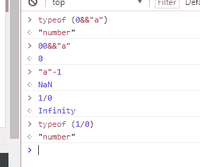
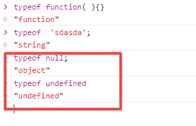

# 欢聚时代 2017 校招笔试题目（web 前端类）C 卷

## 1

使用了"use strict"后，以下哪些描述错误

正确答案: A B C   你的答案: 空 (错误)

```cpp
"use strict";
var x = 17;
with (obj) {
  		x;
}
//会报 obj 未定义的错误
```

```cpp
"use strict";
var x;
	delete x;
//运行正常
```

```cpp
function f(a){
		"use strict";
		a = 42;
   		return a==arguments[0];
}
f(5); //运行结果为 true
```

```cpp
function f(str){
"use strict";
    	return eval(str);
}
f(‘alert(1)’);
//运行正常，弹窗 1 的对话框
```

本题知识点

前端工程师 欢聚集团 2017

讨论

[春天再战](https://www.nowcoder.com/profile/3477549)

A：严格模式下禁止使用 with 语句，因为 with 语句无法在编译时就确定，属性到底归属哪个对象。B：严格模式下无法删除变量。只有 configurable 设置为 true 的对象属性，才能被删除。C：严格模式下 arguments 不再追踪参数的变化，在函数内部，参数 a 被重新赋值为 42，但 arguments[0]仍然为 5。详见：[`www.ruanyifeng.com/blog/2013/01/javascript_strict_mode.html`](http://www.ruanyifeng.com/blog/2013/01/javascript_strict_mode.html)

发表于 2017-08-31 12:17:26

* * *

[不瘦下去不改名字](https://www.nowcoder.com/profile/773225715)

    严格模式：禁止未定义就使用的变量禁止使用 with 严格模式下无法删除变量。只有 configurable 设置为 true 的对象属性，才能被删除。

发表于 2019-08-10 14:40:43

* * *

[myBoy](https://www.nowcoder.com/profile/329609)

应该是 bcd 吧

发表于 2017-08-30 19:40:16

* * *

## 2

以下输出结果为 true 的有

正确答案: A B C   你的答案: 空 (错误)

```cpp
’’==false
```

```cpp
’’==0
```

```cpp
’’==[]
```

```cpp
’’=={}
```

本题知识点

前端工程师 欢聚集团 2017

讨论

[Aleen_Cheung](https://www.nowcoder.com/profile/9588466)

可以参考这篇 JS 操作数隐式类型转换（[`segmentfault.com/a/1190000006161381`](https://segmentfault.com/a/1190000006161381)），JS 在做==运算时会将操作数转换为 Number 类型之后再操作，而' '，false，0，[]都能转换为为数字类型 0，而{}却转换不了，转换后为 NaN,而 NaN 做任何运算返回都是 false

发表于 2017-09-04 14:07:30

* * *

[Orange。](https://www.nowcoder.com/profile/608812)

执行类型转换的规则如下：如果一个运算数是 Boolean 值，在检查相等性之前，把它转换成数字值。false 转换成 0，true 为 1。如果一个运算数是字符串，另一个是数字，在检查相等性之前，要尝试把字符串转换成数字。如果一个运算数是对象，另一个是字符串，在检查相等性之前，要尝试把对象转换成字符串。如果一个运算数是对象，另一个是数字，在检查相等性之前，要尝试把对象转换成数字。

发表于 2017-08-31 14:41:01

* * *

[暮宿落花间](https://www.nowcoder.com/profile/3193197)

== 会将两边的值进行转换， [] => [].toString() => '' 所以 [] == ''

发表于 2017-08-31 11:29:31

* * *

## 3

以下代码执行的结果是（）

```cpp
var a = 0;
function b(c) {
 console.log(a);
 var a = 1;
 arguments[0] = 2;
 console.log(c);
 console.log(a);
}
b(3);
console.log(a);
```

正确答案: A   你的答案: 空 (错误)

```cpp
undefined,2,1,0
```

```cpp
1,2,2,0
```

```cpp
undefined,3,1,0
```

```cpp
undefined,3,2,0
```

本题知识点

前端工程师 欢聚集团 2017

讨论

[Dmmmmmmmmmm](https://www.nowcoder.com/profile/5432376)

原代码相当于：

```cpp
var a = 0;
function b(c) {
 var a;          //声明提前
 console.log(a);
 a = 1;
 c = 2;       //非严格模式，arguments 追踪参数变化
 console.log(c);
 console.log(a);
}
b(3);
console.log(a);

```

发表于 2017-09-05 11:50:00

* * *

[bong_Ju](https://www.nowcoder.com/profile/2371308)

var a = 0; function b(c) { console.log(a);//函数声明提升 var a = 1; arguments[0] = 2;//不是严格模式，可以跟踪改变参数 c 的值 console.log(c); console.log(a); } b(3); console.log(a);

编辑于 2017-09-04 09:18:21

* * *

[不瘦下去不改名字](https://www.nowcoder.com/profile/773225715)

```cpp
非严格模式，arguments 追踪参数变化
```

发表于 2019-08-10 14:45:47

* * *

## 4

以下代码的执行后将输出（）

```cpp
var a = 0;
var obj = {
 a:'obj',
 b:function(a){
 setTimeout(function(){
 console.log(this.a);
 },1000)
 }
}
obj.b(1);
```

正确答案: C   你的答案: 空 (错误)

```cpp
undefined
```

```cpp
’obj’
```

```cpp
0
```

```cpp
1
```

本题知识点

前端工程师 欢聚集团 2017

讨论

[song&](https://www.nowcoder.com/profile/6294324)

setTimeout 中所执行函数中的 this，永远指向 window！！注意是要**延迟执行的函数中的 this**哦！！

发表于 2017-08-31 11:34:13

* * *

[阿胜 4K](https://www.nowcoder.com/profile/8887390)

```cpp
setTimeout(console.log(this), 1000); // window
```

有是一个坑.
非严格模式指向 window,
严格模式指向 undefined

编辑于 2017-09-11 15:02:48

* * *

[916343510。](https://www.nowcoder.com/profile/8035436)

这里的 this 指的是 window 

发表于 2017-08-30 20:46:13

* * *

## 5

以下运算结果不是 number 类型的是

正确答案: D   你的答案: 空 (错误)

```cpp
"a"-1
```

```cpp
1/0
```

```cpp
0 && "a"
```

```cpp
new Number(1)
```

本题知识点

前端工程师 欢聚集团 2017

讨论

[二大爷 ol](https://www.nowcoder.com/profile/3110042)

以下为运行情况：var a = 'a'-1;
console.log(a,typeof a);       //NaN "number"
var b = 1/0;
console.log(b,typeof b);      //Infinity "number"
var c = 0 && 'a';
console.log(c,typeof c);      //0 "number"
var d =new Number(1);
console.log(d,typeof d);    //Number {[[PrimitiveValue]]: 1} "object"
五种简单数据类型为：Undefined/Null/Boolean/Number/String;一种复杂数据类型为：Object。其中 Number 数据类型除了包含普通的数值外，还包含超出范围的值 Infinity 和非数值 NaN。A.   'a'-1  为 NaN；
B.   1/0     为 Infinity，   0/0 返回 NaN， 正数/0 返回 Infinity，负数/0 返回-Infinity;C.   0 && “a"    为 0，&&为短路操作，且如果有一个操作数不是布尔值，则结果就不一定返回布尔值。 a && b,如果 a 能转换成 false，则返回 a。D.   new Number(1)   为基本包装类型的对象。故答案为 D。

编辑于 2017-11-08 12:32:18

* * *

[Dmmmmmmmmmm](https://www.nowcoder.com/profile/5432376)

"a"-1 结果为 NaN，但是 typeof NaN === ‘number’1/0 结果为 Infinity，但是 typeof Infinity === ‘number’0 && “a” 结果为 1，是 number 类型 new Number(1) 产生的是对象类型数据

发表于 2017-09-05 11:58:55

* * *

[916343510。](https://www.nowcoder.com/profile/8035436)



发表于 2017-08-30 20:48:17

* * *

## 6

[“1", "2", "3"].map(parseInt)的执行结果是？

正确答案: D   你的答案: 空 (错误)

```cpp
["1", "2", "3"]
```

```cpp
[1, 2, 3]
```

```cpp
[0, 1, 2]
```

```cpp
其他
```

本题知识点

前端工程师 欢聚集团 2017

讨论

[SSShen.☺☺☺](https://www.nowcoder.com/profile/4407951)

```cpp

	["1","2","3"].map(parseInt);

	// 你可能觉的会是[1, 2, 3]

	// 但实际的结果是 [1, NaN, NaN]

	// 通常使用 parseInt 时,只需要传递一个参数.但实际上,parseInt 可以有两个参数.第二个参数是进制数.可以通过语句"alert(parseInt.length)===2"来验证.

	// map 方法在调用 callback 函数时,会给它传递三个参数:当前正在遍历的元素, 元素索引, 原数组本身.

	// 第三个参数 parseInt 会忽视, 但第二个参数不会,也就是说,parseInt 把传过来的索引值当成进制数来使用.从而返回了 NaN.

	/*

	//应该使用如下的用户函数 returnInt

	function returnInt(element){

	 return parseInt(element,10);

	}

	["1", "2", "3"].map(returnInt);

	// 返回[1,2,3]

	*/

```

发表于 2017-09-04 16:35:54

* * *

[阿胜 4K](https://www.nowcoder.com/profile/8887390)

```cpp
parseInt("1", 0);
parseInt("2", 1);
parseInt("3", 2);

parseInt(string, radix); // 把左边的按照 radix 进制, 转成数
var new_array = arr.map(parseInt); // 根据 map 函数的用法等价与下面这样
parseInt(currentValue, index, array); // 对应于原题相当于这样
parseInt("1", 0, ["1", "2", "3"]);
parseInt("2", 1, ["1", "2", "3"]);
parseInt("3", 2, ["1", "2", "3"]);
// 而我们根据 parseInt 函数的语法, 得知最后一个参数将直接被忽略
// 于是原题, 相当于这样
parseInt("1", 0); // 这是特例, 按照 0 进制转成数, 直接得本身
parseInt("2", 1); // 直接 NaN, 因为计数的进制至少也是 2 进制
parseInt("3", 2); // 也是 NaN, 右边参数是 2, 大家千万不要理解成
// 把 10 进制的 3 转成 2 进制是多少? No, 大错特错.

// 正确的理解是, 右边参数是 2, 函数会认为左边的字符串参数是由 0, 1
// 等组成的 2 进制数, 结果发现出现了 3, 无法转换, 结果就是 NaN
// 像这样才能正常输出 console.log(parseInt("10", 2)); // 2
```

[mdn parseInt()](https://developer.mozilla.org/en-US/docs/Web/JavaScript/Reference/Global_Objects/parseInt)
[mdn Array.prototype.map()](https://developer.mozilla.org/en-US/docs/Web/JavaScript/Reference/Global_Objects/Array/map)

编辑于 2017-09-11 15:40:03

* * *

[暮宿落花间](https://www.nowcoder.com/profile/3193197)

map 有三个参数 val, index, arrparseInt 要两个参数，所以执行的是 parseInt(val, index)

发表于 2017-08-31 11:35:37

* * *

## 7

下面代码执行后，foo.x 的值是 ？(     )

```cpp
var foo = {n: 1};
var bar = foo;
foo.x = foo = {n: 2};
```

正确答案: D   你的答案: 空 (错误)

```cpp
1
```

```cpp
2
```

```cpp
程序报错
```

```cpp
其他
```

本题知识点

前端工程师 欢聚集团 2017

讨论

[无ˇ戏](https://www.nowcoder.com/profile/8644090)

赋值是从右到左的，但不要被绕晕了， 其实很简单，从运算符优先级来考虑

```cpp
a.x = a = {n:2};
```

.运算优先于=赋值运算，因此此处赋值可理解为

1.  声明 a 对象中的 x 属性，用于赋值，此时 b 指向 a，同时拥有未赋值的 x 属性
2.  对 a 对象赋值，此时变量名 a 改变指向到对象{n:2}
3.  对步骤 1 中 x 属性，也即 a 原指向对象的 x 属性，也即 b 指向对象的 x 属性赋值

赋值结果：

```cpp
a => {n: 2}
b => {n: 1, x: {n: 2 } }
```

[`segmentfault.com/q/1010000002637728`](https://segmentfault.com/q/1010000002637728) [xelz](https://segmentfault.com/u/xelz)的答案

编辑于 2017-09-13 22:20:32

* * *

[风萧萧梦也潇潇](https://www.nowcoder.com/profile/3048579)

```cpp
var foo = {n: 1};
var bar = foo;
foo.x = foo = {n: 2};
//foo.x 的值为 undefined
//foo 的值为{n:2}
//bar 的值为{n:1,x:{n:2}}
```

我来解释一下为什么 foo.x 的值为 undefined。首先 foo={n:2}的意思大家都懂，foo 赋值为{n:2}，那前面的 foo.x 哪？要知道在运行第三行代码之前，foo 和 bar 指向相同的对象（即{n:1}），也就是说在第三行进行属性赋值的对象是原来的{n:1}，而非后来完成赋值的 foo，所以也就没构成 foo 包含 foo.x，foo.x 又指向 foo 的环。

编辑于 2017-09-07 20:43:10

* * *

[Orange。](https://www.nowcoder.com/profile/608812)

1,2 行 foo 和 bar 都指向对象{n: 1}3 行先讲 foo 指向对象{n: 2},再把 foo 的值赋给 foo.x 就是把对象{n: 2}的引用赋给 foo.x 对象{n: 2}的引用是存在的，但是没有初始化，所以是 undefined

发表于 2017-08-31 18:39:40

* * *

## 8

关于 SVG 和 CANVAS，下面陈述正确的有?

正确答案: D F   你的答案: 空 (错误)

```cpp
SVG 做动画性能要优于 CANVAS
```

```cpp
CANVAS 做动画性能要优于 SVG
```

```cpp
SVG 产生的 DOM 数量比 CANVAS 要少
```

```cpp
CANVAS 产生的 DOM 数量比 SVG 要少
```

```cpp
CANVAS 可以使用 CSS 设置动画样式
```

```cpp
SVG 可以使用 CSS 设置动画样式
```

本题知识点

前端工程师 欢聚集团 2017 CSS

讨论

[雪月风花](https://www.nowcoder.com/profile/5551520)

 SVG 与 Canvas 的区别
     SVG
         不依赖分辨率
         支持事件绑定
         大型渲染区域的程序(例如百度地图)
         不能用来实现网页游戏
    Canvas
         依赖分辨率
         不支持事件绑定
         最合适网页游戏
         保存为".jpg"格式的图片

发表于 2017-10-03 14:21:59

* * *

[牛客 594283 号](https://www.nowcoder.com/profile/594283)

成功避开所有正确答案

发表于 2017-09-04 10:47:53

* * *

[bong_Ju](https://www.nowcoder.com/profile/2371308)

SVG SVG 是一种使用 XML 描述 2D 图形的语言。 SVG 基于 XML，这意味着 SVG DOM 中的每个元素都是可用的。您可以为某个元素附加 JavaScript 事件处理器。 在 SVG 中，每个被绘制的图形均被视为对象。如果 SVG 对象的属性发生变化，那么浏览器能够自动重现图形。 Canvas Canvas 通过 JavaScript 来绘制 2D 图形。 Canvas 是逐像素进行渲染的。 在 canvas 中，一旦图形被绘制完成，它就不会继续得到浏览器的关注。如果其位置发生变化，那么整个场景也需要重新绘制，包括任何或许已被图形覆盖的对象。 Canvas 与 SVG 的比较 下表列出了 canvas 与 SVG 之间的一些不同之处。 Canvas 依赖分辨率 不支持事件处理器 弱的文本渲染能力 能够以 .png 或 .jpg 格式保存结果图像 最适合图像密集型的游戏，其中的许多对象会被频繁重绘 SVG 不依赖分辨率 支持事件处理器 最适合带有大型渲染区域的应用程序（比如谷歌地图） 复杂度高会减慢渲染速度（任何过度使用 DOM 的应用都不快） 不适合游戏应用

编辑于 2017-09-04 16:46:14

* * *

## 9

下述可正确注释 html 代码的有？

正确答案: C   你的答案: 空 (错误)

```cpp
// <div></div>
```

```cpp
# <div></div>
```

```cpp
<!-- <div></div> -->
```

```cpp
/* <div></div> */
```

本题知识点

前端工程师 欢聚集团 2017 HTML

讨论

[🐑201710251044789](https://www.nowcoder.com/profile/2192705)

css 用

```cpp
/* <div></div> */
```

js 用

```cpp
// <div></div>
```

html 用

```cpp
<!-- <div></div> -->
```

发表于 2017-12-01 23:14:51

* * *

[卷不动](https://www.nowcoder.com/profile/443525402)

```cpp
<!--  -->是 HTML 的注释标签,使用 < 和 > 是符合 HTML 标签语法规则的。 /* */是 CSS 的注释标签
/* */（注释代码块）、//（注释单行）是 JS 的注释标签。
```

发表于 2021-08-02 22:08:57

* * *

[RNGYusy](https://www.nowcoder.com/profile/584895771)

多选题，，，解析的时候变不定项是啥意思。。。

发表于 2021-07-28 08:51:16

* * *

## 10

下述片段中，el 指向的 dom 是？ (     )

```cpp
html:
<div id=”foo”>
<p id=”foo”></p>
</div>
javascript:
var el = document.getElementById('foo');
```

正确答案: C   你的答案: 空 (错误)

```cpp
<div id=”foo”></div>
```

```cpp
<p id=”foo”></p>
```

```cpp
null
```

本题知识点

前端工程师 欢聚集团 2017 HTML

讨论

[吉](https://www.nowcoder.com/profile/510754)

你以为这道题考察 id 选择问题吗？呵呵哒，考察的是双引号是中文还是英文书写的！！！不信你试试！坑爹题目！

```cpp
<!DOCTYPE html>
<html>
<head>
    <title></title>

</head>
<body>

<!-- <div id="foo">
<p id="foo"></p>
</div> -->

<div id=”foo”>
<p id=”foo”></p>
</div>

<script type="text/javascript">
        var el = document.getElementById('foo');
        console.log(el);
    </script>
</body>
</html>
```

编辑于 2017-09-17 11:31:16

* * *

[高桥凉茶](https://www.nowcoder.com/profile/805006241)

？？？？？？？？？？？？？？？？？？？？？我人裂开了这个引号

发表于 2020-10-13 16:35:05

* * *

[椰岛椰树](https://www.nowcoder.com/profile/9495630)

我 console 出来是 null

发表于 2017-09-09 11:00:49

* * *

## 11

typeof function( ){} 输出的是 1 。

你的答案 (错误)

1 参考答案 (1) "function"

本题知识点

前端工程师 欢聚集团 2017

讨论

[雪月风花](https://www.nowcoder.com/profile/5551520)

我就是来提醒这两个的区别的

发表于 2017-10-03 14:30:14

* * *

[K111](https://www.nowcoder.com/profile/3682008)

我犹豫了很久，最终写下了双引号。。。

发表于 2017-09-03 15:43:27

* * *

[liyn](https://www.nowcoder.com/profile/7372466)

“function”

发表于 2017-09-05 10:53:43

* * *

## 12

在 ES6 中提供了 _1_ 用于二进制的操作。

你的答案 (错误)

1 参考答案 (1) ArrayBuffer、TypeArray、DataView

本题知识点

前端工程师 欢聚集团 2017

讨论

[前端 dog](https://www.nowcoder.com/profile/1782486)

Typed Array 主要由下面几个类构成：ArrayBuffer: 连续的内存缓冲区，用于实际储存各种类型的数组数据[Typed Array View 类](http://www.khronos.org/registry/typedarray/specs/latest/#7)：比如 Int32Array、Uint8Array、Float32Array 等，表示一个特定类型的数组 DataView: 工具类，提供 getUint8、setFloat32 等工具方法修改 ArrayBuffer 不同位置的数据值

发表于 2017-09-06 11:10:41

* * *

[liyn](https://www.nowcoder.com/profile/7372466)

ArrayBuffer、TypedArray、DataView

发表于 2017-09-05 11:03:47

* * *

[走过路过见过记得](https://www.nowcoder.com/profile/2702149)

[`developer.mozilla.org/en-US/docs/Web/JavaScript/Reference/Global_Objects`](https://developer.mozilla.org/en-US/docs/Web/JavaScript/Reference/Global_Objects)

发表于 2017-09-04 14:38:05

* * *

## 13

请写出 HTML5 新增的布局标签 1

你的答案 (错误)

1 参考答案 (1) header、hgroup、nav、aside、section、article、footer、figure、menu

本题知识点

前端工程师 欢聚集团 2017

讨论

[SiuwingWoo](https://www.nowcoder.com/profile/6996371)

所有主流浏览器不支持 menu

发表于 2017-09-06 18:18:21

* * *

## 14

请使用 CSS3 画出一个线性渐变，渐变的方向是从右上角到左下角，起点颜色是从白色到黑色，请写出标准的写法 1

你的答案 (错误)

1 参考答案 (1) background:linear-gradient(to bottom left)

本题知识点

前端工程师 欢聚集团 2017

讨论

[暮宿落花间](https://www.nowcoder.com/profile/3193197)

正确答案应该是 background: linear-gradient(to bottom left, #fff, #000)

发表于 2017-08-31 11:39:02

* * *

[qweasd](https://www.nowcoder.com/profile/8050741)

 background:linear-gradient(225deg,white,black); 这样不行吗

发表于 2017-12-06 14:02:44

* * *

[李 kun](https://www.nowcoder.com/profile/6388272)

background:linear-gradient(to bottom left,#fff,#000)

发表于 2017-10-06 16:54:20

* * *

## 15

Doctype 严格模式与混杂模式的区别在哪里?

你的答案

本题知识点

前端工程师 欢聚集团 2017

讨论

[Rcyan](https://www.nowcoder.com/profile/2823659)

解析方式不同严格模式：按照 w3c 标注解析渲染页面，以浏览器支持的最高标准运作。（如果页面上有完整的 dtd 声明则是严格模式）混杂模式：页面以宽松的向后兼容的方式显示。（即可实现 IE5.5 以下版本浏览器的渲染方式）

发表于 2017-09-10 17:24:31

* * *

[Orange。](https://www.nowcoder.com/profile/608812)

严格模式：又称标准模式，是指浏览器按照 W3C 标准解析代码。混杂模式：又称怪异模式或兼容模式，是指浏览器用自己的方式解析代码。

发表于 2017-08-31 20:30:56

* * *

[学习学习学习](https://www.nowcoder.com/profile/4461395)

1）、<!DOCTYPE> 声明位于文档中的最前面，处于 <html> 标签之前。告知浏览器以何种模式来渲染文档。

2）、严格模式的排版和 JS 运作模式是 以该浏览器支持的最高标准运行。

3）、在混杂模式中，页面以宽松的向后兼容的方式显示。模拟老式浏览器的行为以防止站点无法工作。

4）、DOCTYPE 不存在或格式不正确会导致文档以混杂模式呈现。

严格模式主要有以下限制：

```cpp
变量必须声明后再使用

函数的参数不能有同名属性，否则报错

不能使用 with 语句

不能对只读属性赋值，否则报错

不能使用前缀 0 表示八进制数，否则报错

不能删除不可删除的属性，否则报错

不能删除变量 delete prop，会报错，只能删除属性 delete global[prop]

eval 不会在它的外层作用域引入变量

eval 和 arguments 不能被重新赋值

arguments 不会自动反映函数参数的变化

不能使用 arguments.callee

不能使用 arguments.caller

禁止 this 指向全局对象

不能使用 fn.caller 和 fn.arguments 获取函数调用的堆栈

		增加了保留字（比如 protected、static 和 interface）

			设立”严格模式”的目的，主要有以下几个：

*   消除 Javascript 语法的一些不合理、不严谨之处，减少一些怪异行为;

*   消除代码运行的一些不安全之处，保证代码运行的安全；

*   提高编译器效率，增加运行速度；

*   为未来新版本的 Javascript 做好铺垫。

```

发表于 2017-09-01 12:19:16

* * *

## 16

null 和 undefined 的区别，null == undefined 的结果是？

你的答案

本题知识点

前端工程师 欢聚集团 2017

讨论

[学习学习学习](https://www.nowcoder.com/profile/4461395)

结果是 true！null 是一个表示”无”的对象，转为数值时为 0；undefined 是一个表示”无”的原始值，转为数值时为 NaN。

当声明的变量还未被初始化时，变量的默认值为 undefined。

null 用来表示尚未存在的对象，常用来表示函数企图返回一个不存在的对象。

undefined 表示”缺少值”，就是此处应该有一个值，但是还没有定义。典型用法是：

```cpp
（1）变量被声明了，但没有赋值时，就等于 undefined。

（2) 调用函数时，应该提供的参数没有提供，该参数等于 undefined。

（3）对象没有赋值的属性，该属性的值为 undefined。

（4）函数没有返回值时，默认返回 undefined。
```

null 表示”没有对象”，即该处不应该有值。典型用法是：

```cpp
（1） 作为函数的参数，表示该函数的参数不是对象。

（2） 作为对象原型链的终点。
```

发表于 2017-09-01 12:22:37

* * *

[比 u 币 u 币 u](https://www.nowcoder.com/profile/1275318)

[`www.ruanyifeng.com/blog/2014/03/undefined-vs-null.html`](http://www.ruanyifeng.com/blog/2014/03/undefined-vs-null.html)

发表于 2017-09-13 09:55:12

* * *

[九月初十月底](https://www.nowcoder.com/profile/5438780)

null 表示一个“无”的对象，转化为数值时为 0；undefin 表示一个“无”的原始值，转化为数值时为 NaN;目前的用法：1、null 表示“没有对象”，即该处不应该有值。null 典型用法：（1）作为函数的参数，表示该函数的参数不是对象。（2）作为原型链的终点。2、undefined 表示“缺少值”，即该处应该有一个值。undefined 的典型用法：（1）变量被声明了，不过没有赋值；var i;i    //undefined(2)调用函数时，应该提供的参数没有提供；function f(x){console.log(x)}f()    //undefined(3) 对象没有赋值的属性；var o=new Object();o.p    //undefined(4)函数没有返回值时；var x=f();x    //undefined

发表于 2018-05-02 21:08:46

* * *

## 17

background-position:top left,其中 top，left 对应的 css 盒子模型中的哪个矩形框的左上角，可以修改它的默认值吗？如果可以如何修改

你的答案

本题知识点

前端工程师 欢聚集团 2017

讨论

[肖炎](https://www.nowcoder.com/profile/9518143)

对应于 padding-box，可以通过 background-origin:content-box | padding-box | border-box

发表于 2017-09-05 12:46:24

* * *

[Rcyan](https://www.nowcoder.com/profile/2823659)

1.对应 border（边框）矩形的左上角。2.可以。使用 background-origin.background-origin:border-box | padding-box | content-box.padding-box：背景图下相对于内边距定位。border-box：背景图像从边框开始显示。content-box：背景图像从内容开始显示。

发表于 2017-09-10 17:49:04

* * *

[让我笑](https://www.nowcoder.com/profile/3386505)

对应为 padding 可以通过 backgroun-origin 来改变，如 background-origin：content-box 

发表于 2017-09-10 13:25:19

* * *

## 18

css 属性 float 的属性值有哪些，描述它们的作用

你的答案

本题知识点

前端工程师 欢聚集团 2017

讨论

[学习学习学习](https://www.nowcoder.com/profile/4461395)

| left | 元素向左浮动。 |
| right | 元素向右浮动。 |
| none | 默认值。元素不浮动，并会显示在其在文本中出现的位置。 |
| inherit | 规定应该从父元素继承 float 属性的值。 |

发表于 2017-09-01 12:35:23

* * *

[LINK9016](https://www.nowcoder.com/profile/7746207)

left、right

发表于 2017-10-25 18:53:18

* * *

[古兮！怪哉](https://www.nowcoder.com/profile/8705211)

none, left, right。float 会使元素脱离原文档流，从而破坏原来的布局。

发表于 2017-09-02 20:57:55

* * *

## 19

sass 是什么？它有哪些好处和坏处？

你的答案

本题知识点

前端工程师 欢聚集团 2017

讨论

[newcold](https://www.nowcoder.com/profile/8336104)

好处：提高 css 编写速度模块化方便管理提高可读性，更容易维护坏处：容易嵌套太多，影响页面性能调试难度增加

编辑于 2018-03-20 08:53:37

* * *

[╮兜灬児╮](https://www.nowcoder.com/profile/1062498)

sass-css 预处理器；缺点：简单来说 CSS 预处理器语言较 CSS 玩法变得更高级了，但同时降低了自己对最终代码的控制力。更致命的是提高了门槛，首先是上手门槛，其次是维护门槛，再来是团队整体水平和规范的门槛。这也造成了初学学习成本的昂贵。优点：用一种专门的编程语言，为 CSS 增加了一些编程的特性，将 CSS 作为目标生成文件，然后开发者就只要使用这种语言进行编码工作。通俗的说，CSS 预处理器用一种专门的编程语言，进行 Web 页面样式设计，然后再编译成正常的 CSS 文件，以供项目使用。CSS 预处理器为 CSS 增加一些编程的特性，无需考虑浏览器的兼容性问题，例如你可以在 CSS 中使用变量、简单的逻辑程序、函数等等在编程语言中的一些基本特性，可以让你的 CSS 更加简洁、适应性更强、可读性更佳，更易于代码的维护等诸多好处。

发表于 2017-09-07 10:58:00

* * *

[LINK9016](https://www.nowcoder.com/profile/7746207)

编译 css 的一种工具

发表于 2017-10-25 18:53:46

* * *

## 20

```cpp
function fun(n,o){
console.log(o);
return {
fun:function(m){
return fun(m,n);
}
}
}
var a = 
  fun(0).fun(1);a.fun(2);a.fun(3);
var b =
  fun(0).fun(1).fun(2).fun(3);
var c =
  fun(0);c.fun(1);c.fun(2);c.fun(3);
```

三行 a,b,c 的输出分别是什么？

你的答案

本题知识点

前端工程师 欢聚集团 2017

讨论

[油炸热咖啡 wayne](https://www.nowcoder.com/profile/8473222)

return 返回的对象的 fun 属性对应一个新建的函数对象，这个函数对象将形成一个闭包作用域，使其能够访问外层函数的变量 n 及外层函数 fun，为了使得 fun 函数与 fun 属性混淆，将上述代码可改写成，

```cpp
function fun1(n,o) {
    console.log(o);
    return {
         fun: function(m) {
             return fun1(m,n);
          }
    }
}
var a = fun1(0).fun(1); a.fun(2);a.fun(3); 
var b = fun1(0).fun(1).fun(2).fun(3);
var c = fun1(0);c.fun(1);c.fun(2);c.fun(3);

```

var a = fun1(0),(此为 c 的第一项，var c = fun1(0))执行之后往回的是一个有 fun 属性的对象，此时 n = 0,o 为定义，故为 undefined，console.log(0),输出 undefined;var a = fun1(0).fun(1),返回的是函数 fun1(1,0);o = 0,n = 1;执行 console.log(o),输出 0，同时返回含有 fun 属性的对象，此时 o = 0,m = 1,n =1;执行 a.fun(2),类似于上述步骤，m = 2,n = 1;fun1(2,1),console.log(o),输出 1，执行 a.fun(3),执行此步骤时，其中的 a = fun1(0).fun(1),所以 n = 1;m = 3；console.log(o),输出 1var c = fun1(0);执行之后返回的是一个有 fun 属性的对象，此时 n = 0; o 为 undefined；之后执行 c.fun(1),c.fun(2),c.fun(3)和 a.fun(2),a.fun(3)原理类似，均输出 0var b = fun1(0).fun(1).fun(2).fun(3);此时返回的对象中，n 的值是不断变化的，故为 undefined 0 1 2 最后结果输出：undefined 0 1 1undefined 0 1 2 undefined 0 0 0 

发表于 2017-09-04 16:01:31

* * *

[沾沾君](https://www.nowcoder.com/profile/4130704)

两个点：所有声明的匿名函数都是一个新的函数 return 中的闭包会存储父作用域的变量值（这也是基本上闭包实际中的作用）。则：每一次 log 的 o 都是上次保留的 n，也就是上次传的参数。

发表于 2017-09-26 11:17:58

* * *

[喵呜～这里是蓝星球嘛？](https://www.nowcoder.com/profile/7257393)

函数柯里化+闭包

发表于 2018-02-28 17:53:16

* * *

## 21

ECMAScript 和 javaScript 的关系

你的答案

本题知识点

前端工程师 欢聚集团 2017

讨论

[学习学习学习](https://www.nowcoder.com/profile/4461395)

ECMAScript 是 JavaScript 的规范，JavaScript 是 ECMAScript 的实现。

发表于 2017-09-01 12:45:56

* * *

[gooooodstock](https://www.nowcoder.com/profile/4057007)

根据红宝书第一章小结答复：js 是一种专为与网页交互而设计的脚本语言，由下列三个不同部分组成：核心 ECMAScript，提供核心语言功能；文档对象模型（DOM），提供访问和操作网页内容的方法和接口；浏览器对象模型（BOM），提供与浏览器交互的方法和接口。JavaScript 包括了核心 ECMAScript。可以理解为：ECMAScript 是 js 的一部分。

发表于 2017-09-02 17:22:40

* * *

[韡~](https://www.nowcoder.com/profile/6306811)

ECMAScript 是 JavaScript 的规范，JavaScript 是具体实现

发表于 2017-11-13 16:37:02

* * *

## 22

那些操作会造成内存泄漏？

你的答案

本题知识点

前端工程师 欢聚集团 2017

讨论

[Maizi93](https://www.nowcoder.com/profile/1952608)

会造成内存泄漏的操作：1、闭包引起的内存泄漏；2、意外的全局变量引起的内存泄漏；3、没有清理的 DOM 元素引起的内存泄漏；4、被遗忘的定时器或者回调函数；5、子元素存在引用引起的内存泄漏；

发表于 2017-09-06 22:27:31

* * *

[学习学习学习](https://www.nowcoder.com/profile/4461395)

```cpp
内存泄漏指任何对象在您不再拥有或需要它之后仍然存在。

setTimeout 的第一个参数使用字符串而非函数的话，会引发内存泄漏。

闭包、没有清理的 Dom 元素引用、控制台日志、循环（在两个对象彼此引用且彼此保留时，就会产生一个循环）
```

发表于 2017-09-01 12:49:03

* * *

[newcold](https://www.nowcoder.com/profile/8336104)

常见的内存溢出：- 不再需要用到一个函数后，它的定时器没有停止 clearTimeout()- 一个 DOM 被删除前，没有解绑事件- 一个 DOM 被删除前，对它的引用没有手动清除掉
- 临时创建的 DOM 没有被手动清除掉- 闭包没有管理好内存泄漏：一段内存用完了，我们已经不需要它了。但是它没有被释放掉（引用），所以这部分内存不能被重新利用，这部分内存就被浪费掉了。就像垃圾堆积占用了空间一样。垃圾回收机制：JavaScript 的垃圾回收机制依据的是引用计数，如果引用计数降为 0，它就会被自动回收。所以，避免内存泄漏、利用好垃圾回收机制的做法是：如果我们不需要一个东西，就要先把对于它的各种**引用**都摘除掉。反之，如果我们不再需要用到一个东西或者想把它删掉，如果不先把对它的**引用**摘除掉，就会造成内存泄露。

编辑于 2018-03-20 10:33:37

* * *

## 23

你是否了解或使用过 MVC 框架，简单陈述下你对 MVC 的理解

你的答案

本题知识点

前端工程师 欢聚集团 2017

讨论

[Maizi93](https://www.nowcoder.com/profile/1952608)

MVC 是一种使用 MVC（Model View Controller 模型-视图-控制器）设计创建 Web 应用程序的模式：

*   Model（模型）表示应用程序核心（比如数据库记录列表）；
*   View（视图）显示数据（数据库记录）；
*   Controller（控制器）处理输入（写入数据库记录）；

优点：

*   MVC 分层有助于管理复杂的应用程序；
*   MVC 分层同时也简化了分组开发；
*   MVC 模式的这三个部分的职责非常明确，而且相互分离，因此每个部分都可以独立的改变而不影响其他部分，从而大大提高了应用的灵活性和重用性；

发表于 2017-09-06 22:34:52

* * *

[LINK9016](https://www.nowcoder.com/profile/7746207)

数据模型--视图层---控制层

发表于 2017-10-25 19:01:11

* * *

[古兮！怪哉](https://www.nowcoder.com/profile/8705211)

MVC 实际上是将开发严格划分为三大块，M 代表 model，V 代表 view，C 代表 control，使得开发过程更加方便，结构更加清晰

发表于 2017-09-02 21:14:13

* * *

## 24

你遇到过比较深刻一个技术上的难题是什么，你又是如何解决的？

你的答案

本题知识点

前端工程师 欢聚集团 2017

讨论

[大内密探零零发](https://www.nowcoder.com/profile/5389738)

图片和文本框在同一级居中对其

发表于 2017-11-08 14:22:42

* * *

## 25

求 10000 以内 3 和 5 的倍数和，写出 JavaScript 实现函数

你的答案

本题知识点

前端工程师 欢聚集团 2017

讨论

[九月初十月底](https://www.nowcoder.com/profile/5438780)

```cpp
function sum(val){
    var he=0; 
    for(var i=0;i<val;i++){
    if(i%3==0&&i%5==0){
    he+=i
        }
    }
    return he;
} 
sum(10000);
```

发表于 2018-05-08 17:39:49

* * *

[古兮！怪哉](https://www.nowcoder.com/profile/8705211)

```cpp
function sum(n){
    var res=0;
    for(var i=1; i<=10000; i++){
        if(i%3==0 || i%5==0 || i%==0){
            res+=i;
        }
    }
    return res;
}
```

发表于 2017-09-02 21:20:12

* * *

[欲言。](https://www.nowcoder.com/profile/6445044)

二叉树先序递归遍历

```cpp
function step(x = 1, y = 1) {
    const sum = Math.pow(3, x) * Math.pow(5, y);

    if (sum > 10000) return [];

    let res = [];

    res.push(sum);

    res = res.concat(step(x + 1, y));

    res = res.concat(step(x, y + 1));

    return res;
}

```

编辑于 2019-10-03 23:26:09

* * *

## 26

请编写一个 JavaScript 函数，实现清除数据中重复的元素

你的答案

本题知识点

前端工程师 欢聚集团 2017

讨论

[随遇而安~~~](https://www.nowcoder.com/profile/8452436)

function noRepeate(arr){return Array.from(new Set(arr));}

发表于 2017-09-06 20:42:49

* * *

[牛客 8316782 号](https://www.nowcoder.com/profile/8316782)

```cpp
function removeDuplicateItems(arr) {
    return arr.reduce(function(lit,v){
           if(lit.indexOf(v)==-1)
                lit.push(v);
            return lit;
    },[]);
}
```

发表于 2017-09-10 16:14:54

* * *

[诺维阿鑫](https://www.nowcoder.com/profile/4654779)

function clearRepeatt(arr){

     var a=[];
     for(var i=0;i<arr.length;i++)
     {
      if(!a[arr[i]]){ a[arr[i]]=true}
      else if(a[arr[i]]==true){
         var start=arr.indexOf(arr[i])
           arr.splice(start,1);
       };

      }
   return arr;

}
clearRepeatt([1,1,2,3,5,5,9]);

发表于 2018-08-26 16:10:58

* * *

## 27

用纯 css 实现某个元素的双边框效果，边框大小都为 5，如图


你的答案

本题知识点

前端工程师 欢聚集团 2017

讨论

[Orange。](https://www.nowcoder.com/profile/608812)

```cpp
<!DOCTYPE html>
<html lang="en">
<head>
    <meta charset="UTF-8">
    <title>双边框效果</title>
    <style>
        .box{
            width: 100px;
            height: 100px;
            background-color: green;
            font-size: 50px;
            text-align: center;
            line-height: 100px;
            border: 5px solid red;
            outline: 5px solid black;
        }

    </style>
</head>
<body>
    <div class="box"></div>
</body>
</html>
```

编辑于 2017-08-31 20:37:06

* * *

[小迷糊~🐭](https://www.nowcoder.com/profile/8337701)

也可以用 before after。

```cpp
.s{
width:20px;
height:20px;
background-color:green;
color:#000;
line-height:20px;
text-align:center;
border:5px solid red;
position:relative;
margin: 5px;
}
.s::before{
content: '';
width:40px;
height:40px;
background-color:#000;
position:absolute;
top:0;
left:-10px;
right:0;
bottom:0;
margin: auto;
z-index:-1;
}

```

当然 outline 跟 box-shadow 方便很多

发表于 2018-01-05 16:22:05

* * *

[巅峰斌](https://www.nowcoder.com/profile/5222678)

为什么不能直接用 padding？.parent{    padding: 5px;
    background-color:red;
    border: 5px solid black;
}

发表于 2018-01-22 23:53:20

* * *

## 28

请用 html 和 css 实现以下效果（移动设备），要求①三个圆形 icon 大小为 80px，固定不变，②被三个圆形 icon 划分的四个间距相等，③黑色背景需要占满移动设备的宽度


你的答案

本题知识点

前端工程师 欢聚集团 2017

讨论

[不完美卡卡](https://www.nowcoder.com/profile/4516985)

.box{
        width: 100%;
        height: 100px;
        background: black;
    }
    .box ul{
        width: 100%;
        height: 100%;
        display: flex;
        align-items: center;
    }
    .box ul li{
        width: 80px;
        height: 80px;
        border-radius: 100%;
        background: #fff;
        margin-left: calc((100% - 240px)/4);
    }<div class="box">
    <ul>
        <li></li>
        <li></li>
        <li></li>
    </ul>
</div>

发表于 2018-04-09 16:30:17

* * *

[包子是好包子](https://www.nowcoder.com/profile/9170153)

```cpp
<!DOCTYPE html>
<html>
<head>
    <meta charset="UTF-8">
    <meta name="viewport" content="width=device-width,initial-scale=1.0">
    <title>Title</title>
    <style>
      *{
        margin:0;
        padding:0;
      }
      .container{
        width:100%;
        height:100px;
        background:#000;    
        posotion:relative;

      }
      .item{
        width:80px;
        height:80px;
        border-radius:50%;
        background:#fff;
        position:absolute;
        top:10px;
      }
      .item1{
        left:calc(25% - 60px);
      }
      .item2{
        left:calc(50% - 40px);
      }
      .item3{
       left:calc(75% - 20px);
      }
    </style>
</head>
<body>
<div class="container">
    <div class="item item1">
    </div>
    <div class="item item2">
    </div>
    <div class="item item3">
    </div>
</div>
</body>
</html>
```

发表于 2018-09-06 13:27:33

* * *

[善终](https://www.nowcoder.com/profile/8524774)

```cpp
<!DOCTYPE html>
<html lang="en">
<head>
    <meta charset="UTF-8">
    <title>Title</title>
</head>
<body>
<div class="main">
    <div class="icon">
    </div>
    <div class="icon">
    </div>
    <div class="icon">
    </div>
</div>
</body>
</html>
<style>
    .main{
        width: 100%;
        height: 100px;
        display: flex;
        justify-content: space-evenly;
        align-items: center;
        background: black;
    }
    .icon{
        width: 80px;
        height:80px;
        border-radius: 50%;
        background: white;
        flex: 0 1 auto;
    }
</style> 
```

编辑于 2017-12-07 15:20:16

* * *