# 趋势科技 2016 校招 C++工程师笔试试卷 B 卷

## 1

给出一个二叉树,用一个函数确定是否有一条从根节点到叶子节点的路径，这个路径上所有节点的值加在一起等于给定的 sum 的值。函数声明 hasPathSum 已经给出，写出程序设计思路并且实现该函数。尽量提供多种实现方法。

```cpp
/**
* 二叉树节点定义如下：
* struct TreeNode {
*     int val;
*     TreeNode *left;
*     TreeNode *right;
*     TreeNode(int x) : val(x), left(NULL), right(NULL) {}
* };
*/
bool hasPathSum(TreeNode *root, int sum) {
}
```

示例：

```cpp
给定的二叉树和 sum = 22,
5
/ \
4   8
/   / \
11  13  4
/  \      \
7    2      1
```

返回值是 ture, 即存在一条 root-to-leaf 的路径 5->4->11->2 节点值相加等于 22

你的答案

本题知识点

树 C++工程师 趋势科技 2016

讨论

[rs 勿忘初心](https://www.nowcoder.com/profile/7491640)

```cpp
//剑指 offer 原题
//注意是根结点到叶子结点，不要把情况想复杂了。
bool hasPathSum（TreeNode *root，int sum）
{ 
   vector<int> vec;            //表示单条路径
   vector<vector<int> > trace;   //所有满足条件的路径和的集合
   int currentSum=0;      //路径和，初始为 0
   hasPathCore(root,vec,trace,currentSum,sum);
   if(trace.empty())   //如果 trace 为空，说明没有满足条件的路径
       return false;
   else
       return true;
}

void hasPathCore(TreeNode *root,vector<int> &vec,vector<vector<int> > &trace,int currentSum,int sum)
{
   if(root==NULL)
        return;
   currentSum+=root->val;
   vec.push_back(root->val);
   bool flag=((root->left==NULL)&&(root->right==NULL));
   if(currentSum==sum&&flag)
        trace.push_back(vec);
   if(root->left!=NULL)
        hasPathCore(root->left,vec,trace,currentSum,sum);  
   if(root->right!=NULL)
        hasPathCore(root->right,vec,trace,currentSum,sum);
   vec.pop_back();
 }
```

编辑于 2017-09-05 17:02:17

* * *

[菜菜鸟](https://www.nowcoder.com/profile/6787662)

```cpp

	bool hasPathSum(TreeNode *root, intsum) {

	    if(root == NULL)

	        return false;

	    if(root->val == sum)

	        return true;

	    return (hasPathSum(root->left, sum-root->val) ||

	            hasPathSum(root->right, sum-root->val));

	}

```

发表于 2017-09-18 22:34:13

* * *

[flxyq](https://www.nowcoder.com/profile/7493658)

| bool hasPathSum(TreeNode *root, int sum) {if(root==NULL)return null;if(root->left==NULL&&root->right==NULL&&sum-root->val==0)return true;return hasPathSum(root->left,sum-root->val) &#124;&#124; hasPathSum(root->right,sum-root->right);} |

编辑于 2017-09-08 18:51:43

* * *

## 2

请编写一个函数将字符串 s2 添加到字符串 s1 的末端，函数不受 s1、s2 空间大小的限制。可以利用常用字符串函数 strlen,strcpy,strcat,strcmp,strstr 实现。常用字符串函数简单描述:strlen(char *str) : 求字符串长度。strcpy(char *dest, char *src) : 把 src 拷贝到 dest。strcat(char *dest, char *src) : 把 src 连接到 dest 后面。strcmp(char *s1, char *s2) : 按照各个字符（ascii）比较 s1 和 s2，相等则返回 0，否则返回 ascii 相减的结果。strstr(char *s1, char *s2) : 在 s1 中查找 s2，返回找到的位置，若找不到则返回 NULL。

你的答案

本题知识点

C++ C++工程师 趋势科技 2016

讨论

[rs 勿忘初心](https://www.nowcoder.com/profile/7491640)

```cpp

	char* append(char*str1,char*str2)

	{

	char* temp;

	int length=strlen(str1)+strlen(str2);     //计算 str1 与 str2 总共的和

	temp=new char[length+1];        //申请一段足够容下 str1 和 str2 的字符串空间

	strcpy(temp,str1);           //先将 str1 复制到字符指针 temp 指向的内存的起始位置

	strcat(temp,str2);      //再将 str2 链接到 str1 的位置

	return temp;

	}

```

编辑于 2017-09-06 09:49:05

* * *

[________ 佛系少女](https://www.nowcoder.com/profile/6152681)

如果这是面试，最好还是要判空指针的。

发表于 2017-11-07 09:18:05

* * *

[小龙过江](https://www.nowcoder.com/profile/1757475)

#include<iostream>using namespace std;char* strCat(char* s1,char *s2){int len1 = strlen(s1);int len2 = strlen(s2);int len = len1 + len2 + 1;char* s = new char[len];strcpy(s, s1);strcat(s, s2);return s;}int main(){char* s1 = "hello ";char* s2 = "windows";char* s;s=strCat(s1, s2);cout << s << endl;return 0;}

发表于 2017-09-08 11:47:36

* * *

## 3

下面程序一共会在屏幕上输出多少个“-” ？1

```cpp
#include<iostream>
#include<stdio.h>
#include<sys/types.h>
#include<unistd.h>
using namespace std;
int main( )
{
    int i;
    for(i = 0; i < 2; i++)
    {
        cout<<"-\n";
        fork( );
        cout <<"-\n";
    }
    cout << endl;
    return 1;
}
```

你的答案 (错误)

1 参考答案 (1) 9

本题知识点

C++ C++工程师 趋势科技 2016

讨论

[rs 勿忘初心](https://www.nowcoder.com/profile/7491640)

      计算机程序设计中的分叉函数。返回值： 若成功调用一次则返回两个值，子进程返回 0，[父进程](https://baike.baidu.com/item/%E7%88%B6%E8%BF%9B%E7%A8%8B)返回子进程标记；否则，出错返回-1。      fork 函数将运行着的程序分成 2 个（几乎）完全一样的进程，每个进程都启动一个从代码的同一位置开始执行的线程。这两个进程中的线程继续执行，就像是两个用户同时启动了该应用程序的两个副本。第一次第一个 cout 输出**一个**"-"。然后 fork 函数将运行的程序分成两个（几乎）完全一样的进程**。**第一次第二个 cout 输出**两个**“-”。第二次第一个 cou 还是输出**两个**“-”。然后 fork 函数将运行的两个程序分成四个（几乎）完全一样的进程。第二次第二个 cou 输出**四个**“-”。所以总共输出的“-”个数为 count=1+2+2+4=9

发表于 2017-09-05 17:14:53

* * *

[V587 的小虫子](https://www.nowcoder.com/profile/8814203)

先输出 1 个，再分裂成进程 1 和进程 2 分别输出一个，第一轮输出三个。 第二轮进程 1 和进程 2 分别输出一个，此时五个，再分别分裂出一个进程 3 和进程 4，四个进程分别再输出一个，结果一共九个。

发表于 2017-10-17 21:07:39

* * *

[ctgu-邓亚鹏](https://www.nowcoder.com/profile/4139412)

一共 9 次，顶一楼的观点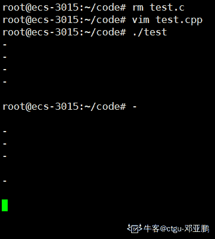

发表于 2019-08-07 16:15:33

* * *

## 4

读下面程序，请给出 test（ ）函数的返回值。1

```cpp
int test( )
{
    int k=0;
    char c='A';
    do{
        switch (c++)
        {
            case 'A': k++; break;
            case 'B': k--;
            case 'C': k+=2; break;
            case 'D': k=k%2; break;
            case 'E': k=k*10; break;
            default: k=k/3;
        }
        k++;
    }while(c<'G');
    return k;
}
```

你的答案 (错误)

1 参考答案 (1) 8

本题知识点

C++ C++工程师 趋势科技 2016

讨论

[我也支持](https://www.nowcoder.com/profile/6206174)

```cpp
A   2 
B   4
C   7
D   2
E   21
F   8
细心
```

编辑于 2017-09-06 19:53:57

* * *

[魔女 8](https://www.nowcoder.com/profile/7583768)

大意了，，，算出来 7 忘记加一

发表于 2017-09-11 10:52:28

* * *

[rs 勿忘初心](https://www.nowcoder.com/profile/7491640)

c 和 k 的变化为：**（注意是先由 c 的原始值得到 k，然后 c 再执行 c++）**c：                          k：A                             0B                             2   （c 为 A 时，先 swith 里面执行 k++，swith 外执行 k++）C                             2   （c 为 B 时，先 swith 里面执行 k--，swith 外执行 k++，所以 k 值不变）D                             5   （c 为 C 时，先 swith 里面执行 k+=2，swith 外执行 k++）E                             2    （c 为 D 时，先 swith 里面执行 k%=2，swith 外执行 k++）F                             21  （c 为 E 时，先 swith 里面执行 k*=10，swith 外执行 k++）G                            8    （c 为 F 时，先 swith 里面执行 k/=10，**swith 外执行 k++**）最后粗心，激动算出了最后结果忘记了 k++，正确答案应该是 8。

发表于 2017-09-05 17:23:43

* * *

## 5

该段代码的输出结果是？ 1

```cpp
#include<iostream>
using namespace std;
int nest(int i)
{
    if (i < 0 )
        return 0;
    else if (i == 0)
        return 1;
    else
        return nest(i-1) + nest(i-2) + i;
}
int main( )
{
    cout << nest(7)<< endl;
    return 1;
}
```

你的答案 (错误)

1 参考答案 (1) 100

本题知识点

C++ C++工程师 趋势科技 2016

讨论

[我也支持](https://www.nowcoder.com/profile/6206174)

```cpp
从底向上更快
nest(0)=1 
nest(1)=2
nest(2)=5 
nest(3)=10 
nest(4)=19 
nest(5)=34 
nest(6)=59 
nest(7)=100 
```

发表于 2017-09-06 19:36:44

* * *

[rs 勿忘初心](https://www.nowcoder.com/profile/7491640)

递归，其实不用把所有的结果依次算出来，如下图，虚线是不需要重复计算的，每一个结点的值只需要计算一次，下一次直接用就行了。需要注意的是需要加上结点本身自己的值，比如计算结点 3 时，其值等于：nest(3)=nest(2)+nest(1)+3(结点本身的值)。其他结点也是一样，从题目 return  nest(i-1) + nest(i-2) + i 最后的 i 可以看到。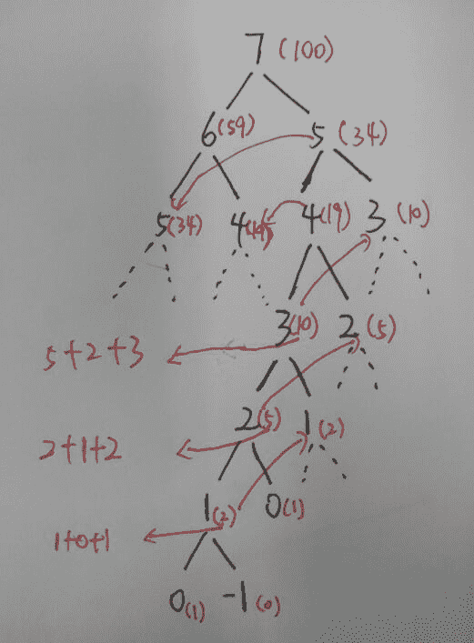

编辑于 2017-10-12 09:31:28

* * *

[粥里有勺糖](https://www.nowcoder.com/profile/9131023)

100

发表于 2017-12-08 09:27:33

* * *

## 6

如果一个类 class A{}没有构造函数定义，那么当这个类的 Objects 被创建时会发生什么？（    ）

正确答案: C   你的答案: 空 (错误)

```cpp
编译器产生错误
```

```cpp
运行时会产生错误
```

```cpp
编译器会为这个类提供默认构造函数去创建 Objects
```

```cpp
以上都不对
```

本题知识点

C++ C++工程师 趋势科技 2016

讨论

[李正浩大魔王](https://www.nowcoder.com/profile/4876759)

深入探索 C++对象模型   第 40 页：

> 对于 Class X，如果没有用户声明的构造函数，那么会有一个默认的构造函数被隐式声明出来，这个声明出来的默认构造函数是一个 trivial 的 constructor。

只有在下面四种情况下声明的构造函数才是 Non-trivial 的：**1、带有默认构造函数的成员类对象。****2、带有默认构造函数的基类。****3、带有虚函数的类。****4、带有虚基类。**这个声明出来的构造函数是一个 trivial 的构造函数，只是为了能够通过编译（**其实啥正事都不干那种**）。所以你不能说没有合成一个构造函数，应该说上面 4 种情况下，编译器合成的是 non-trivial 的构造函数，它们是干了一些实际工作的（比如初始化虚函数表，调用成员的构造函数等）。个人理解，欢迎指正

发表于 2018-09-22 09:11:17

* * *

[敲代码，从我做起](https://www.nowcoder.com/profile/3056943)

这道题答案应该有问题吧，包括后面默认生成的有哪些函数那道题，深入理解 c++对象模型那本书明确指出像这种不含有虚函数，不从基类派生以及没有抽象数据成员的类默认是不生成构造函数和虚函数等函数的，此时 A a;创建对象并没有调用构造函数，而是把它当做基本类型看待执行的 char 类型的初始化。

发表于 2017-10-14 21:44:55

* * *

[lllxxxkkk](https://www.nowcoder.com/profile/8378038)

不应该是在四种情况下编译器才会生成默认构造函数么。。。

发表于 2017-09-06 11:12:17

* * *

## 7

将域名转换为 IP 地址是由(     )服务器完成？

正确答案: C   你的答案: 空 (错误)

```cpp
WINS
```

```cpp
DHCP
```

```cpp
DNS
```

```cpp
IIS
```

本题知识点

网络基础 C++工程师 趋势科技 2016

讨论

[cuteximi](https://www.nowcoder.com/profile/8803171)

WINS 实现的是 ip 地址和计算机名称的映射，他集中管理计算机名称和 IP 地址，作用范围是内网。 DNS 实现的是 IP 地址与域名的映射，范围是整个互联网。 IIS 是互联网信息服务，是微软公司提供的基于 Windows 的互联网基础服务 DHCP 动态主机配置协议，局域网的网络协议，使用 udp 协议工作，主要用途:集中地管理，分配 IP 地址，使得网络中的主机动态的获取 IP 地址，Gateway 地址，dns 服务器地址等信息

编辑于 2017-09-25 16:15:33

* * *

[风 2011612](https://www.nowcoder.com/profile/4086472)

C，域名服务器

发表于 2017-09-05 11:58:22

* * *

[牛客-120 抢救中心](https://www.nowcoder.com/profile/6165623)

C

发表于 2018-08-03 16:55:33

* * *

## 8

下面协议中用于 WWW 传输控制的是？ （    ）

正确答案: C   你的答案: 空 (错误)

```cpp
URL
```

```cpp
SMTP
```

```cpp
HTTP
```

```cpp
HTML
```

本题知识点

网络基础 C++工程师 趋势科技 2016

讨论

[Evan 丶.](https://www.nowcoder.com/profile/6090029)

URL（Uniform/Universal Resource Locator 的缩写，统一资源定位符）是对可以从互联网上得到的资源的位置和访问方法的一种简洁的表示，是互联网上标准资源的地址。 SMTP（Simple Mail Transfer Protocol）即简单邮件传输协议,它是一组用于由源地址到目的地址传送邮件的规则，由它来控制信件的中转方式。SMTP 协议属于 TCP/IP 协议簇，它帮助每台计算机在发送或中转信件时找到下一个目的地。 超文本传输协议（HTTP，HyperText Transfer Protocol)是互联网上应用最为广泛的一种网络协议。所有的 WWW 文件都必须遵守这个标准。设计 HTTP 最初的目的是为了提供一种发布和接收 HTML 页面的方法。 HTML 超级文本标记语言是标准通用标记语言下的一个应用，也是一种规范，一种标准，它通过标记符号来标记要显示的网页中的各个部分。网页文件本身是一种文本文件，通过在文本文件中添加标记符，可以告诉浏览器如何显示其中的内容

编辑于 2017-10-07 10:50:49

* * *

[干 IT 的农民工](https://www.nowcoder.com/profile/3838321)

c

发表于 2017-10-07 12:33:37

* * *

[呼呼呼呼呼 123](https://www.nowcoder.com/profile/8055882)

C

发表于 2018-03-16 10:44:01

* * *

## 9

缺省的 Linux 系统中，从后台启动进程，应在命令的结尾加上哪个符号？ （    ）

正确答案: B   你的答案: 空 (错误)

```cpp
@
```

```cpp
&
```

```cpp
^
```

```cpp
$
```

本题知识点

Linux C++工程师 趋势科技 2016

讨论

[他比烟花寂寞](https://www.nowcoder.com/profile/7363367)

后台运行可以有两种方式： 1.命令前加 nohup # nohup  *.sh 2.命令后加& #  *.sh &

发表于 2019-06-28 07:47:33

* * *

[天晴了,便是无语.](https://www.nowcoder.com/profile/1511374)

题目的意思应该是将程序放在后台执行,不占据 terminal 中断,我差点理解成把程序从后台调回前台这个过程.那应该就是选择 B 了;

发表于 2017-09-30 22:07:29

* * *

[Lambert-Liu 阳](https://www.nowcoder.com/profile/718334942)

B，后台运行

发表于 2018-07-30 13:33:01

* * *

## 10

阅读下面代码：

```cpp
class B
{
public:
   virtual void Fun(){}
};
class D: public B
{
public:
   void Fun(){}
};
D dd;
B* pb = &dd;
D* pd = &dd;
pb->Fun();
pd->Fun();
```

上述例程调用的 Fun 函数顺序为（）

正确答案: C   你的答案: 空 (错误)

```cpp
B::Fun, D::Fun
```

```cpp
B::Fun, B::Fun
```

```cpp
D::Fun, D::Fun
```

```cpp
D::Fun, B::Fun
```

本题知识点

C++ C++工程师 趋势科技 2016 C 语言

讨论

[牛柳柳柳](https://www.nowcoder.com/profile/7883751)

这个题目出的好！本题考察两个知识点：一、赋值兼容：        1.子类对象可以赋值给父类对象
        2.子类对象可以初始化父类对象
        3.父类指针可以指向子类对象
        4.父类引用可以引用子类对象二、子类重写父类 这两个知识点也就是解释多态的关键本题中，根据兼容性原则：**当父类指针（引用）指向子类对象时，子类对象退化成父类对象，只能访问父类中定义的成员**如果 B 对象没有 virtual 修饰的话，B* pb = &dd; dd 就会**退化为父类对象**，pd 就只能访问父类的成员 B::Fun()。但是又 virtual 修饰的话，就会展现多态行为，会根据**实际指针指向**的对象判断函数的调用。pb 和 pd 都指向子类对象，所以调用 D::Fun()。

发表于 2018-08-10 14:17:54

* * *

[溯忆](https://www.nowcoder.com/profile/792302)

基类 B 定义一个虚函数 Fun，派生类 D 继承基类并对 Fun 函数进行了覆盖，因此基类指针调用派生类函数 Fun，返回的是派生类的函数

发表于 2017-12-15 17:26:12

* * *

[reborne](https://www.nowcoder.com/profile/132514564)

子类中的父类虚函数的同名同参函数貌似会隐式声明为 virtual 所以这题就是多态中父类指针指向派生类对象的动态绑定问题。

编辑于 2019-07-26 20:11:22

* * *

## 11

如果定义如下类：class Empty{}请选择编译器为之生成的函数有哪些？ （    ）1.Empty() { … }2.Empty(const Empty& rhs){ … }3.Empty& operator=(const Empty& rhs) { … }4.~Empty() { … }

正确答案: B   你的答案: 空 (错误)

```cpp
124
```

```cpp
1234
```

```cpp
123
```

```cpp
14
```

本题知识点

C++ C++工程师 趋势科技 2016

讨论

[夏至 2020](https://www.nowcoder.com/profile/8723555)

```cpp
class Empty  
{  
  public:  
    Empty();                            //缺省构造函数  
    Empty(const Empty &rhs);            //拷贝构造函数  
    ~Empty();                           //析构函数   
    Empty& operator=(const Empty &rhs); //赋值运算符  
    Empty* operator&();                 //取址运算符  
    const Empty* operator&() const;     //取址运算符(const 版本)  
};  

```

发表于 2017-09-29 22:25:13

* * *

[大彤 888](https://www.nowcoder.com/profile/5016644)

《Effective C++》条款 05**声明一个空类之后，编译器就会自动的为他声明一个 copy 构造函数，一个 copy assignment 操作符和一个析构函数。****此外如果没有声明任何构造函数，编译器也会自动声明一个 default 构造函数。所有这些函数都是 public 且 inline 的。**

编辑于 2017-09-21 15:54:29

* * *

[敲代码，从我做起](https://www.nowcoder.com/profile/3056943)

这道题的答案是错误的，正确的答案应该是没有任何函数被生成，《深入理解 c++对象模型》中讲到，如果一个类不是派生类，也没有抽象数据成员和虚函数，那该类称之为“无意义的”，这样的类的拷贝初始化等等都像基本类型一样，如果给他默认生成构造函数等反而会降低效率。有如下运行效果佐证：不添加构造函数时：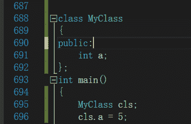
其汇编代码如下：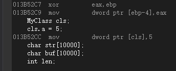可以看到 MyClass cls;语句并没有执行任何额外的指令，也就是说没有生成默认构造函数。以下代码添加了构造函数：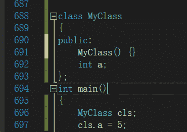
相应的汇编代码如下：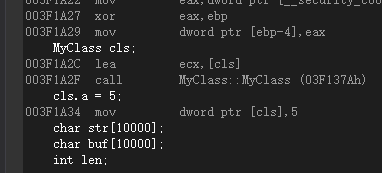
可以看到这里调用了构造函数。所以你不显示地添加构造函数，在这种情况下是不会给你自动生成构造函数的，析构函数、拷贝构造和赋值运算符也一样。

编辑于 2017-10-14 22:01:23

* * *

## 12

下面程序的输出是？（    ）

```cpp
int main(void)
{
enum team { my , your = 9 , his , her = his + 3};
printf("%d %d %d %d\n",my , your , his , her);
return 0;
}
```

正确答案: A   你的答案: 空 (错误)

```cpp
0     9    10   13
```

```cpp
8     9    11   13
```

```cpp
8     9    10   13
```

```cpp
0     9    12   9
```

本题知识点

C++ C++工程师 趋势科技 2016

讨论

[不死大金刚](https://www.nowcoder.com/profile/5839035)

第一个枚举成员的默认值为整型的 0，后续枚举成员的值在前一个成员上加 1。枚举型是预处理指令#define 的替代。

发表于 2017-09-07 10:02:59

* * *

[易军高](https://www.nowcoder.com/profile/4726053)

1、两个或多个枚举常量可以具有相同的值；2、当没有为枚举常量指定值时，它的值比前一个常量的值大 1（第一个枚举常量的值默认为 0）；3、枚举常量遵循 C 语言的作用域规则。

发表于 2017-11-08 22:10:15

* * *

[一心只想养老](https://www.nowcoder.com/profile/6674227)

第一个默认就为 0，除非有赋值了，第二个有赋值，不影响第一个的默认值！！！记住了，跟后面的值没关系

发表于 2019-04-09 16:55:29

* * *

## 13

以下表达式选择结果是？（    ）

```cpp
std::string str1("trend");
std::string str2("micro");
std::string& strs = str1;
std::string* ptrs = &str1;
strs = str2;
ptrs = &str2;
```

正确答案: A   你的答案: 空 (错误)

```cpp
strs = micro, * ptrs = micro
```

```cpp
strs = micro, * ptrs = trend
```

```cpp
strs = trend, * ptrs = micro
```

```cpp
strs = trend, * ptrs = trend
```

本题知识点

C++ C++工程师 趋势科技 2016

讨论

[稳稳滴幸福](https://www.nowcoder.com/profile/1070488)

声明变量 strs 为 str1 的引用，即 strs 是 str1 的别名，并不需要另外开辟内存单元来存放 strs 的值。strs 和 str1 占内存中的同一个存储单元，它们具有同一地址。注意：（1）引用不是一种独立的数据类型，对引用只有声明，没有定义。（必须先定义一个变量，然后声明对该变量建立一个引用）（2）声明一个引用时，必须同时使之初始化，及声明它代表哪一个变量。（3）在声明一个引用后，不能再使之作为另一变量的引用。      int a1 a2;      int &b = a1;      int &b = a2; //错误，不能把 b 又变成 a2 的引用      b = a2；     //可以，因为 b 作为 a1 的引用，b 就和 a1 一致，故相当于 a1 = a2；（4）不能建立引用数组，不能作为数组元素的别名（5）不能建立引用的引用。        int a = 3;        int &b = a;        int &c = b;  // 不能建立引用的引用        int * p = b;  //不能建立指向引用的指针（6）可以取引用的地址（如已声明 b 是 a 的引用，则&b 就是变量 a 的地址&a）        int *pt;        pt = &b; // 把变量 a 的地址赋值给指针变量 pt（7）在声明了引用后，在使用它的时候不带&，而只引用引用的名字（如 b，而不是&b）。

发表于 2017-09-13 16:32:18

* * *

[Areyouok?](https://www.nowcoder.com/profile/3767571)

strs = str2 并不是把引用指向 str2。由于 strs 相当于 str1, 该句会调用赋值构造函数将 str2 赋值给 str1

发表于 2019-07-10 17:36:55

* * *

[我也支持](https://www.nowcoder.com/profile/6206174)

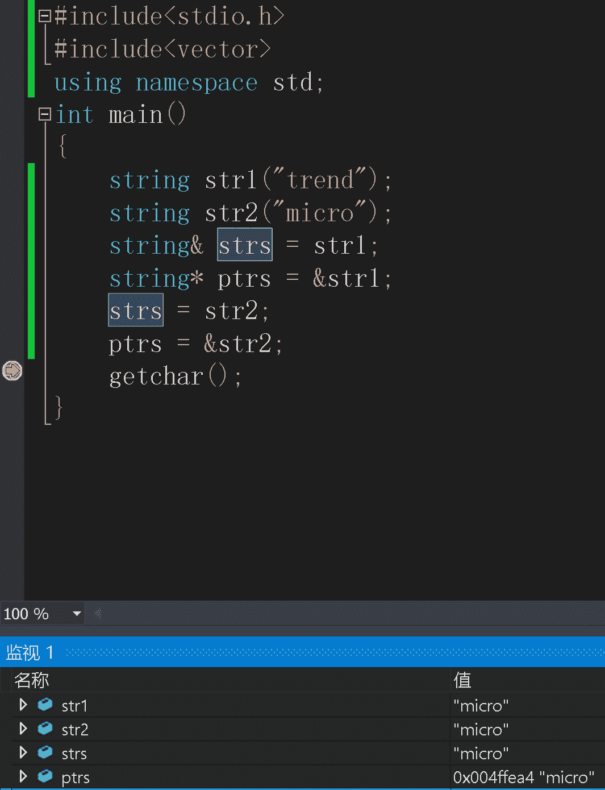

发表于 2017-09-06 19:32:43

* * *

## 14

请选择正确的数字填充：某缓存系统采用 LRU（近期最少使用算法）淘汰算法，假定缓存容量为 4，并且初始为空，那么在顺序访问以下数据项的时候 1,5,1,3,2,4,1,2 出现缓存命中的次数是 __。最后缓存中即将准备淘汰的数据项是（    ）

正确答案: C   你的答案: 空 (错误)

```cpp
2, 2
```

```cpp
3, 2
```

```cpp
3, 3
```

```cpp
3, 4
```

本题知识点

操作系统 C++工程师 趋势科技 2016

讨论

[血刃夕落](https://www.nowcoder.com/profile/8932684)

11，55，1   （命中 1）5，1，35，1，3，21，3，2，4   （出 5）3，2，4，1   （命中 1）3，4，1，2   （下一次出 3）（命中 2）命中 3 次 最后一次 3 被淘汰

发表于 2017-09-20 21:13:13

* * *

[0](https://www.nowcoder.com/profile/4847242)

1*1 5*1*5            hit1 5 3*1 5 3 2*1 4*3 21*4 3 2 hit1 4 3 2*    hit

编辑于 2017-09-07 18:25:40

* * *

[JaN.](https://www.nowcoder.com/profile/985901)

C

发表于 2018-03-06 11:55:26

* * *

## 15

请选择表达式 '0' + 1 的结果（本题数值均为十进制）（）

正确答案: D   你的答案: 空 (错误)

```cpp
2
```

```cpp
31
```

```cpp
32
```

```cpp
49
```

本题知识点

C++工程师 趋势科技 2016 C 语言

讨论

[Bytee](https://www.nowcoder.com/profile/6006840)

0 的 ASCII 码为 48

发表于 2017-09-11 11:25:25

* * *

[sty0223](https://www.nowcoder.com/profile/7157319)

不查 ascii 表真记不住。。。

发表于 2017-09-09 08:37:17

* * *

[求 offer 砸中](https://www.nowcoder.com/profile/1840996)

记得 1 的 ASCII 码值是 31H，忘了转成十进制了，大意失荆州啊

发表于 2017-09-24 21:09:24

* * *

## 16

有关多线程，多进程的描述错误的是？（    ）

正确答案: D   你的答案: 空 (错误)

```cpp
子进程获得父进程的数据空间，堆和栈的复制品
```

```cpp
线程可以与同进程的其他线程共享数据，但是它拥有自己的栈空间且拥有独立的执行序列
```

```cpp
线程执行开销小，但是不利于资源管理和保护
```

```cpp
进程是 CPU 调度和分派的基本单位。
```

本题知识点

操作系统 C++工程师 趋势科技 2016

讨论

[shuowoailimengting](https://www.nowcoder.com/profile/8119311)

```cpp
线程是 CPU 调度和分派的基本单位。 进程是操作系统的基本单位。
```

发表于 2017-09-07 16:30:22

* * *

[caixiongg](https://www.nowcoder.com/profile/5433275)

选 D，进程是操作系统分配资源的基本单位，线程是 cpu 调度的基本单位

发表于 2017-09-22 20:34:33

* * *

[沂飔](https://www.nowcoder.com/profile/8705712)

```cpp
D 选项：线程是 CPU 调度和分派的基本单位。 进程是操作系统的基本单位。
```

发表于 2017-09-05 17:14:44

* * *

## 17

分时系统中，当用户数目为 100 时，为保证响应时间不超过 2s，此时的时间片最大应该为？（    ）

正确答案: B   你的答案: 空 (错误)

```cpp
10ms
```

```cpp
20ms
```

```cpp
100ms
```

```cpp
200ms
```

本题知识点

操作系统 C++工程师 趋势科技 2016

讨论

[420 攻城狮](https://www.nowcoder.com/profile/2344231)

根据分时定义，2s 内这 100 个用户进程都要被执行，所以是(2s/100),但时间片的单位为毫秒，所以 2*10³/100=20ms

发表于 2018-05-06 17:05:08

* * *

[0xbadc0de](https://www.nowcoder.com/profile/3251312)

进程调度的消耗喂狗了嘛？😂

发表于 2017-09-06 09:01:15

* * *

[一心只想养老](https://www.nowcoder.com/profile/6674227)

2 秒内 100 个用户都要响应，所以 2s/100=2000ms/100=20ms

发表于 2019-04-09 17:04:07

* * *

## 18

设有语句  char a = '\72';，则关于变量 a 的说法正确的是（）

正确答案: C   你的答案: 空 (错误)

```cpp
包含 2 个字符
```

```cpp
说明不合法
```

```cpp
包含 1 个字符
```

```cpp
包含 3 个字符
```

本题知识点

C++ C++工程师 趋势科技 2016 C 语言

讨论

[胡萝卜汤泡饭](https://www.nowcoder.com/profile/5297804)

```cpp
\为转义字符，\72 转义为一个八进制数 72，也就是十进制数的 58
赋值给 a，a 就是一个 ascii 码为 58 的字符。
```

发表于 2018-03-06 11:12:49

* * *

[Er_myy](https://www.nowcoder.com/profile/9152370)

所有转义字符都算作一个字符，如下表特殊的\ooo 三位八进制和\xff 表示 16 进制（x 是符号不算在内）

| \a | 响铃(BEL) |  |
| \b | 退格(BS) ，将当前位置移到前一列 |  |
| \f | 换页(FF)，将当前位置移到下页开头 |  |
| \n | 换行(LF) ，将当前位置移到下一行开头 |  |
| \r | 回车(CR) ，将当前位置移到本行开头 |  |
| \t | 水平制表(HT) （跳到下一个 TAB 位置） |  |
| \v | 垂直制表(VT) |  |
| \\ | 代表一个反斜线字符''\' |  |
| \' | 代表一个单引号（撇号）字符 |  |
| \" | 代表一个双引号字符 |  |
| \? | 代表一个问号 |   |
| \0 | 空字符(NULL) |  |
| \ooo | 1 到 3 位八进制数所代表的任意字符 |  |
| \xff | 1 到 2 位十六进制所代表的任意字符 |  |

发表于 2017-09-08 20:15:27

* * *

[红师傅的牛逼](https://www.nowcoder.com/profile/4586624)

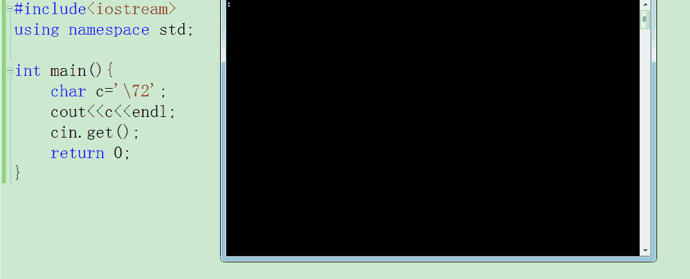

发表于 2017-09-07 16:28:00

* * *

## 19

以下哪项不属于 STL container（）

正确答案: D   你的答案: 空 (错误)

```cpp
stack
```

```cpp
queue
```

```cpp
multimap
```

```cpp
string
```

本题知识点

C++ C++工程师 趋势科技 2016 C 语言

讨论

[warpar](https://www.nowcoder.com/profile/1756076)

STL container 分为两大类：

序列容器：[动态数组](http://www.so.com/s?q=%E5%8A%A8%E6%80%81%E6%95%B0%E7%BB%84&ie=utf-8&src=internal_wenda_recommend_text)[vector](http://www.so.com/s?q=vector&ie=utf-8&src=internal_wenda_recommend_text)，[双端队列](http://www.so.com/s?q=%E5%8F%8C%E7%AB%AF%E9%98%9F%E5%88%97&ie=utf-8&src=internal_wenda_recommend_text)deque（本质是动态数组加索引），[链表](http://www.so.com/s?q=%E9%93%BE%E8%A1%A8&ie=utf-8&src=internal_wenda_recommend_text)list。关联容器：set，[map](http://www.so.com/s?q=map&ie=utf-8&src=internal_wenda_recommend_text)，multiset，multimap，bitset（叫 bit_array 更合适）。
容器适配器：stack，[queue](http://www.so.com/s?q=queue&ie=utf-8&src=internal_wenda_recommend_text)，priority_queue。

发表于 2017-09-06 08:42:39

* * *

[j-217](https://www.nowcoder.com/profile/998919092)

题目有问题 c++ primer 5th 介绍的顺序容器 vector, deque, list, forward_list, array, string 而 stack, queue 属于容器适配器

编辑于 2020-02-16 21:30:49

* * *

[Geng1995](https://www.nowcoder.com/profile/327761991)

Primer C++中文第五版 292 页，string 是顺序容器类型。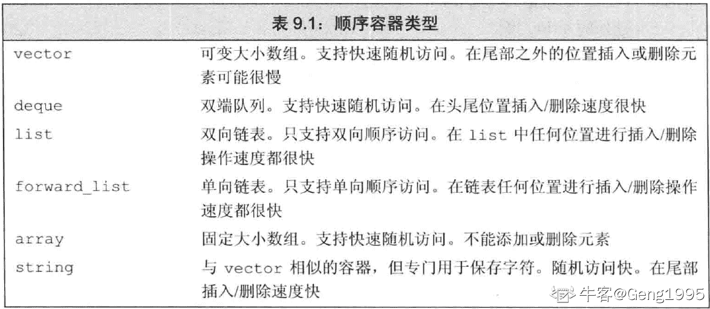

发表于 2020-06-01 21:03:53

* * *

## 20

以下表达式选择结果是（）

```cpp
int a = 0;
int b = (a=-1) ? 2:3;
int c = (a=0) ? 2:3;
```

正确答案: C   你的答案: 空 (错误)

```cpp
b=2, c=2
```

```cpp
b=3, c=3
```

```cpp
b=2, c=3
```

```cpp
b=3, c=2
```

本题知识点

C++ C++工程师 趋势科技 2016 C 语言

讨论

[woeM](https://www.nowcoder.com/profile/4085226)

a=-1,表达式的值为-1，非零，为真，故 b=2;a=0,表达式的值为，为零，为假，故 c=3;

发表于 2017-09-07 12:35:52

* * *

[d_chao](https://www.nowcoder.com/profile/2882954)

死坑死坑，把=看成==不止我一个吧？

发表于 2019-01-07 15:10:58

* * *

[Solace_7](https://www.nowcoder.com/profile/8826099)

其中 a=-1,a=0 均为赋值，-1 赋给 a，不为零，为真，故 b=2.同理，0 赋给 a,为假，故 c=3\.若将 23 行改为 a==-1,a==0;则为比较，此时 a 为 0，不等于-1，为假，则 b=3,同理 c=2;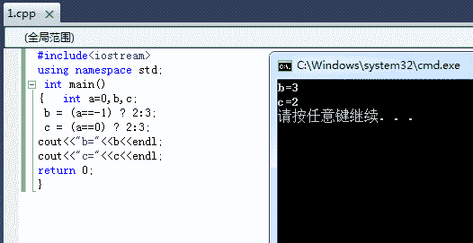
第二种如上；

发表于 2017-09-07 11:34:52

* * *

## 21

多个进程怎样共享一个监听端口？（    ）

正确答案: C   你的答案: 空 (错误)

```cpp
每个进程都使用 SO_REUSEADDR 选项，然后绑定同一个端口
```

```cpp
每个进程分别绑定一次即可
```

```cpp
使用 fork 共享
```

```cpp
只有最后一个绑定端口的进程才能收到数据
```

本题知识点

操作系统 C++工程师 趋势科技 2016

讨论

[liu583685](https://www.nowcoder.com/profile/5219768)

fock 函数会复制父进程中的所有数据，当然也包括监听套接字。

发表于 2017-09-05 19:53:19

* * *

[牛客 185544](https://www.nowcoder.com/profile/1857544)

SO_REUSEADDR 是 setsockopt 的参数，使端口被释放后立即可以再使用。

发表于 2018-03-05 09:22:43

* * *

[surperdan](https://www.nowcoder.com/profile/8102445)

fock 函数会复制父进程中的所有数据，当然也包括监听套接字。

发表于 2017-09-21 17:01:50

* * *

## 22

从二叉排序树中查找一个元素时，其时间复杂度一般为（   ）。

正确答案: C   你的答案: 空 (错误)

```cpp
O(n)
```

```cpp
O(1)
```

```cpp
O(log2n)
```

```cpp
O(n2)
```

本题知识点

树 C++工程师 趋势科技 2016

讨论

[胖嘟嘟雷仔](https://www.nowcoder.com/profile/2802519)

就是树的高度

发表于 2017-09-08 18:31:26

* * *

[牛客 386445453 号](https://www.nowcoder.com/profile/386445453)

n 个结点的二叉树是高度为 log2n+1  所以查找是

发表于 2021-12-13 19:55:51

* * *

[a1exlism](https://www.nowcoder.com/profile/6143525)

平局查找长度 O(Logan) 最差为 O(n)

发表于 2018-11-30 07:33:19

* * *

## 23

（    ）命令可以查看视图的创建语句 ？

正确答案: B   你的答案: 空 (错误)

```cpp
SHOW VIEW
```

```cpp
SHOW CREATE VIEW
```

```cpp
SELECT VIEW
```

```cpp
DISPLAY VIEW
```

本题知识点

数据库 C++工程师 趋势科技 2016

讨论

[CANG@](https://www.nowcoder.com/profile/7623980)

show create view view_name;

发表于 2017-09-26 16:10:17

* * *

[fighting--](https://www.nowcoder.com/profile/9367783)

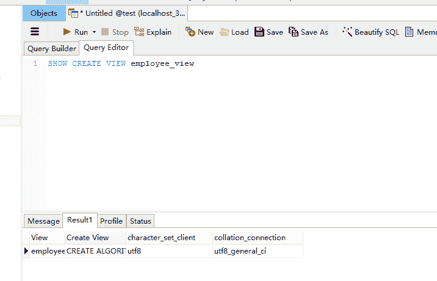mysql 里面  show create view view_name

发表于 2018-06-11 09:42:02

* * *

[一心只想养老](https://www.nowcoder.com/profile/6674227)

查看视图？创建视图？边创建边查看？

发表于 2019-04-09 17:22:03

* * *

## 24

对于 int *pa[5];的描述，正确的是（）

正确答案: A   你的答案: 空 (错误)

```cpp
pa 是一个具有 5 个元素的指针数组，每个元素是一个 int 类型的指针；
```

```cpp
pa[5]表示某个数组的第 5 个元素的值；
```

```cpp
pa 是一个指向数组的指针，所指向的数组是 5 个 int 类型的元素；
```

```cpp
pa 是一个指向某个数组中第 5 个元素的指针，该元素是 int 类型的变量；
```

本题知识点

C++ C++工程师 趋势科技 2016 C 语言

讨论

[codeTNT](https://www.nowcoder.com/profile/6235153)

看定义记得注意优先级，int *pa[5]，首先[]优先级比*高，所以 pa 与[]先结合，pa[5]表明 pa 是一个数组，大小是 5，既然知道 pa 是数组了，接下来就是确认数组元素了，int*表明数组元素是指针;int（*p）[5]，首先()优先级比[]高，所以 pa 先与*结合，*pa 表明 pa 是一个指针，既然知道 pa 是指针，接下来确认指针指向的数据类型，int [5]表明指针指向大小为 5 的 int 型数组。

发表于 2017-09-14 17:42:01

* * *

[走位崴了脚](https://www.nowcoder.com/profile/4695029)

眼瞎了，pa[5]越界了

发表于 2018-03-19 09:17:46

* * *

[岁月静好 2020](https://www.nowcoder.com/profile/420779789)

int *pa[5]，首先[]优先级比*高，所以 pa 与[]先结合，pa[5]表明 pa 是一个数组，大小是 5，既然知道 pa 是数组了，接下来就是确认数组元素了，int*表明数组元素是指针; int（*p）[5]，首先()优先级比[]高，所以 pa 先与*结合，*pa 表明 pa 是一个指针，既然知道 pa 是指针，接下来确认指针指向的数据类型，int [5]表明指针指向大小为 5 的 int 型数组。

发表于 2019-04-14 10:19:34

* * *

## 25

关于纯虚函数，下列表述正确的是？（    ）

正确答案: B   你的答案: 空 (错误)

```cpp
派生类必须实现基类的纯虚函数
```

```cpp
纯虚函数的声明总是以“=0”结束
```

```cpp
纯虚函数是给出实现版本（即无函数体定义）的虚函数
```

```cpp
含有纯虚函数的类一定是派生类
```

本题知识点

C++ C++工程师 趋势科技 2016

讨论

[是萌萌的前辈呀](https://www.nowcoder.com/profile/649256)

**解释一下 A 吧，其它几个没什么好说的。**含有纯虚函数的类是抽象类，对于继承这样的类的类（派生类）来说，如果派生类实现了基类的纯虚函数，则派生类可以实例化。若派生类没有实现该纯虚函数，则该派生类也是抽象类，即不能实例化。**综上所述，派生类不一定非得要实现基类的纯虚函数。**

发表于 2017-09-12 21:29:08

* * *

[ai_](https://www.nowcoder.com/profile/458988)

(a), 派生类不一定需要实现，只要需要派生类的实现 object 的时候才需要实现。(c), 纯虚函数是需要在该类下不实现而在派生类中实现的函数(d), 含有纯虚函数的类一定是基类，需要派生类来实现其虚函数的功能

发表于 2017-09-12 15:58:43

* * *

[赵高](https://www.nowcoder.com/profile/123710675)

啊，不应该是总用分号结尾吗

发表于 2020-10-19 16:33:18

* * *