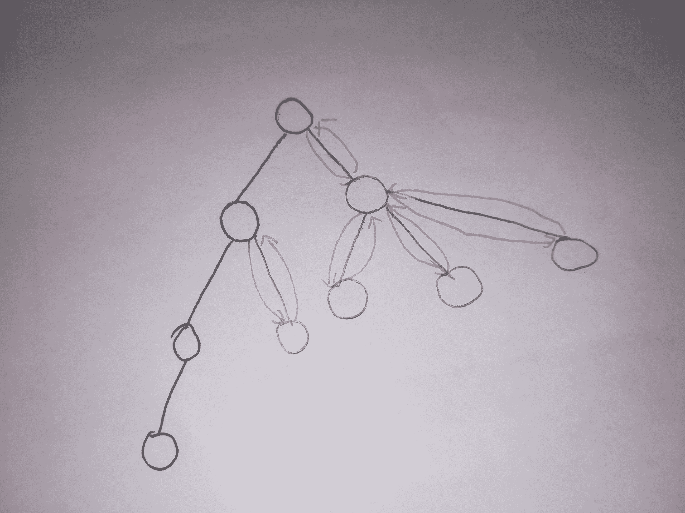
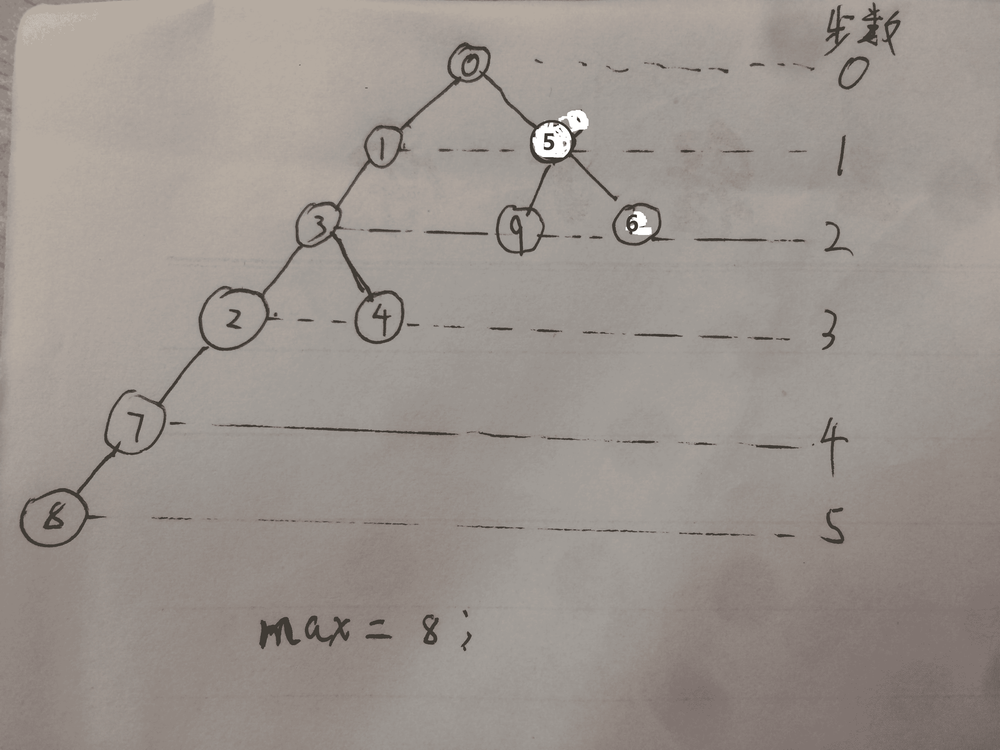
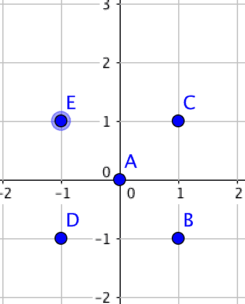

# 网易 2018 校园招聘编程题真题集合

## 1

小易准备去魔法王国采购魔法神器,购买魔法神器需要使用魔法币,但是小易现在一枚魔法币都没有,但是小易有两台魔法机器可以通过投入 x(x 可以为 0)个魔法币产生更多的魔法币。
魔法机器 1:如果投入 x 个魔法币,魔法机器会将其变为 2x+1 个魔法币
魔法机器 2:如果投入 x 个魔法币,魔法机器会将其变为 2x+2 个魔法币
小易采购魔法神器总共需要 n 个魔法币,所以小易只能通过两台魔法机器产生恰好 n 个魔法币,小易需要你帮他设计一个投入方案使他最后恰好拥有 n 个魔法币。

本题知识点

Java 工程师 C++工程师 安卓工程师 iOS 工程师 运维工程师 前端工程师 算法工程师 PHP 工程师 网易 数学 贪心 模拟 golang 工程师 测试工程师 2018

讨论

[buaaqlyj](https://www.nowcoder.com/profile/5025378)

魔法机器 1 只能产生奇数，魔法机器 2 只能产生偶数。

从 n 不断按奇偶倒推回 0 就可以了。

```cpp
import java.util.Scanner;

public class Main {
    public static void main(String[] args) {
        Scanner in = new Scanner(System.in);
        while (in.hasNext()) {
            int coinCount = in.nextInt();
            StringBuilder sb = new StringBuilder();
            while (coinCount > 0) {
                if (coinCount % 2 == 0) {
                    //偶数
                    coinCount = (coinCount - 2) / 2;
                    sb.append("2");
                } else {
                    //奇数
                    coinCount = (coinCount - 1) / 2;
                    sb.append("1");
                }
            }
            System.out.println(sb.reverse().toString());
        }
    }
}
```

编辑于 2017-09-09 22:56:30

* * *

[郑耀钧](https://www.nowcoder.com/profile/341687)

水题，求 x 经过若干次 f(x) = 2x + c 的变换恰好到 n ，显然次数不超过 log(n) + 1 = 32 次；而 c = 1 || 2 使得每次 n' 具有奇偶特征，直接递归出来。

```cpp
#include <stdio.h>

int n;

void read() {
    scanf("%d", &n);
}

void magic(int n) {
    if (n <= 0) return;
    if (n & 1) {
        magic((n - 1) / 2);
        putchar('1');
    } else {
        magic((n - 2) / 2);
        putchar('2');
    }
}

void work() {
    magic(n);
    putchar('\n');
}

int main() {
    read();
    work();
    return 0;
}
```

编辑于 2017-09-22 18:14:37

* * *

[王姑娘](https://www.nowcoder.com/profile/7844479)

#include<iostream>
#include <vector>
#include<string>
#include <algorithm> 
using namespace std;
int main()
{
    int n;
    cin >> n;
    string str;

    while (n != 0)
    {
        if (n % 2)
        {
            n = (n - 1) / 2;
            str=str + '1';

        }
        else
        {
            n = (n-2) / 2;
            str = str + '2';
        }
    }
    reverse(str.begin(), str.end());
    cout << str<<endl;
}

```cpp

            发表于 2017-09-17 21:27:41

        2
        为了得到一个数的"相反数",我们将这个数的数字顺序颠倒,然后再加上原先的数得到"相反数"。例如,为了得到 1325 的"相反数",首先我们将该数的数字顺序颠倒,我们得到 5231,之后再加上原先的数,我们得到 5231+1325=6556.如果颠倒之后的数字有前缀零,前缀零将会被忽略。例如 n = 100, 颠倒之后是 1.

            本题知识点

                                                            Java 工程师 
                                                C++工程师 
                                                安卓工程师 
                                                iOS 工程师 
                                                运维工程师 
                                                前端工程师 
                                                算法工程师 
                                                PHP 工程师 
                                                网易 
                                                模拟 
                                                字符串 *数学 
                                                栈 *golang 工程师 
                                                测试工程师 
                                                2018**  **讨论

[华科平凡](https://www.nowcoder.com/profile/4939096)

python solution:

```
a=input()
print(int(a)+int(a[::-1])) 
```cpp

发表于 2017-10-11 14:57:46

* * *

[梦想成为技术帝的技术宅](https://www.nowcoder.com/profile/4785219)

```
import java.util.Scanner;
public class Main {
	public static void main(String[] args) {
		Scanner sc = new Scanner(System.in);
		String s = sc.next();
		System.out.println(Integer.parseInt(new StringBuilder(s).reverse().toString())+Integer.parseInt(s));
		sc.close();
	}
}

```cpp

编辑于 2017-09-14 15:11:48

* * *

[郑耀钧](https://www.nowcoder.com/profile/341687)

                                                                      水题。。。 

```
#include <stdio.h>

int n;

void read() {
    scanf("%d", &n);
}

int reverse(int n) {
    int res = 0;
    while (n) {
        res = res * 10 + n % 10;
        n /= 10;
    }
    return res;
}

void work() {
    printf("%d\n", n + reverse(n));
}

int main() {
    read();
    work();
    return 0;
}
```cpp

编辑于 2017-09-12 18:11:57

* * *

## 3

        一个由小写字母组成的字符串可以看成一些同一字母的最大碎片组成的。例如,"aaabbaaac"是由下面碎片组成的:'aaa','bb','c'。牛牛现在给定一个字符串,请你帮助计算这个字符串的所有碎片的平均长度是多少。

本题知识点

                                                            Java 工程师 
                                                C++工程师 
                                                安卓工程师 
                                                iOS 工程师 
                                                运维工程师 
                                                前端工程师 
                                                算法工程师 
                                                PHP 工程师 
                                                网易 
                                                字符串 *贪心 
                                                模拟 
                                                golang 工程师 
                                                测试工程师 
                                                2018*  *讨论

[郑耀钧](https://www.nowcoder.com/profile/341687)

                                                                      所有块的**总长度就是字符串的长度**，数一下有多少块就行了。 

```
#include <stdio.h>

char str[55];

void read() {
    scanf("%s", str);
}

void work() {
    int cnt = 1, i;
    for (i = 1; str[i]; ++i) {
        if (str[i] != str[i-1]) {
            ++cnt;
        }
    }
    double res = (double)(i) / cnt;
    printf("%.2lf\n", res);
}

int main() {
    read();
    work();
    return 0;
}
```cpp

编辑于 2017-09-13 03:26:54

* * *

[八千鸟](https://www.nowcoder.com/profile/3042863)

                                                                      只需一行 
   思路，用字符串长度除以去重字符串长度。去重用正则 

```
var readline = require('readline');
const rl = readline.createInterface({
    input: process.stdin,
    output: process.stdout,
    terminal: false
});
rl.on('line', function(line) {
    console.log((line.length / line.replace(/(.)\1+/g, "$1").length).toFixed(2));
});
```cpp

编辑于 2017-09-12 14:53:23

* * *

[Communism985](https://www.nowcoder.com/profile/9113645)

首先我感觉这题描述有问题,求碎片的平均长度应该去掉字符串中重复的碎片，按这道题的输出描述它的意思就是求:(字符串的总长度)/(相同字母团构成的字符串的个数)。

```
public static void main(String[] args) {
    Scanner sc = new Scanner(System.in);
    while (sc.hasNext()) {
        String s = sc.next();
        float len = s.length();//总长
        int count = 1;//个数至少为一个
        for (int i = 0; i < len - 1; i++) {
            if (s.charAt(i) != s.charAt(i + 1)) {
                count++;
            }
        }
        System.out.println(len / count);
    }
} 
```cpp

编辑于 2018-03-12 15:03:00

* * *

## 4

        魔法王国一共有 n 个城市,编号为 0~n-1 号,n 个城市之间的道路连接起来恰好构成一棵树。
 小易现在在 0 号城市,每次行动小易会从当前所在的城市走到与其相邻的一个城市,小易最多能行动 L 次。
 如果小易到达过某个城市就视为小易游历过这个城市了,小易现在要制定好的旅游计划使他能游历最多的城市,请你帮他计算一下他最多能游历过多少个城市(注意 0 号城市已经游历了,游历过的城市不重复计算)。

本题知识点

                                                            Java 工程师 
                                                C++工程师 
                                                安卓工程师 
                                                iOS 工程师 
                                                运维工程师 
                                                前端工程师 
                                                算法工程师 
                                                PHP 工程师 
                                                网易 
                                                贪心 
                                                动态规划 
                                                树 
                                                golang 工程师 
                                                测试工程师 
                                                2018 

讨论

[越努力-越幸运](https://www.nowcoder.com/profile/335227)

                                                                      只要找到最长的一条路径就好，只要保证最长路径只走一次，多余的步数再去访问其他节点，就能计算能够访问的最多节点数。 
   (1) 如果允许走的步数 L 小于等于最长路径，那么就直接只在最长路径上走，这样可以不重复地走完，步数为走过的边数 count，经过的点数为 count+1 
   (2) 如果允许走的步数 L 大于最长路径，那么需要走其他的分支，一旦经过，至少每条边走两次，并且只要两次就能完成读取点，所以其他路径上的点数为(L-maxDepth)/2，maxDepth 为树的深度，也就是最长路径上的边数。此时经过的点数为 maxDepth+(L-maxDepth)/2+1，如果点数大于 n，则输出 n，否则直接输出总点数。  
     

   附代码： 

```
import java.util.Scanner;

public class Main{
    public static void main(String[] args) {
        Scanner scan = new Scanner(System.in);
        int n = scan.nextInt(), L = scan.nextInt();
        int parent[] = new int[n];
        int depth[] = new int[n];
        int maxDepth = 0;
        for (int i = 1; i < n; i++) {
            parent[i] = scan.nextInt();
            depth[i] = depth[parent[i]] + 1;
            if (depth[i] > maxDepth)
                maxDepth = depth[i];
        }
        scan.close();
        int count = 0;
        if (maxDepth >= L)
            count = L;
        else
            count = (L - maxDepth) / 2 + maxDepth;
        if(count >= n - 1)
            count = n - 1;
        System.out.println(count + 1);
    }
}
```cpp

编辑于 2017-09-22 22:35:28

* * *

[郑耀钧](https://www.nowcoder.com/profile/341687)

                                                                      原本以为是树上 dp ，其实是贪心。 

   画个图可以知道，可把 parent[i] 当作 (i+1) 的**父亲节点**（因为 parent[i] 是可以重复的）。之前看漏了 parent[i] 的范围限制了父节点标号比子节点小 这个条件，我用了 链式前向星 来建图。 

   建好图之后，就可以从树根扩散出每个节点所在最长树链的长度，选出最长的一条树链，记其长度为 maxLen 。 

   分类讨论： 

*   若 L ≤ maxLen ，显而易见得结果；    

*   若 L > maxLen ，意味着可以往回走，要知道**越短的树链往回走的代价越低**。如果从末端往回走，消耗的代价非常高，最坏情况是较短的树链都连接在最远的树根上，整条最长链都要回走；如果已经知道最终步数会有剩余，则可以**先消耗富余的步数****走短链**，最后才走最长链；    

*   继续对 rest = L - maxLen 进行讨论：   

    *   若树链上存在某个节点拥有另一条子链，其长度 x 必定小于或等于该祖先到原链末端的长度，**考察****树链上每个节点到叶子的一条最短子链**：     

        *   当 x > rest/2 可以在中途预先用掉 rest 步而不影响要走的 maxLen 最长链，可达城市增加 rest/2 个；            

        *   当 x ≤ rest/2 可以在中途预先用掉 2x 步而不影响要走的 maxLen 最长链，可达城市增加 x 个；           

    *   若所有的 x 总和 sum(x) ≤ rest/2 说明富余的步数足够把最短链到次最长链都走一遍，可达城市为全部 n 个。             

    *   本小节讨论可知 rest/2 决定了能多走的城市数量，总共能走 min(n, 1 + rest/2 + maxLen) 个城市。       

```
#include <stdio.h>
#include <string.h>

#define MAXN 55
#define MAXM 55

inline void getMax(int& n, int x) {
    n < x && (n = x);
}

inline void getMin(int& n, int x) {
    n > x && (n = x);
}

struct Edge {
    int to;
    int next;
} edge[MAXM];

int cnt;
int head[MAXN], len[MAXN];

void init() {
    memset(head, 0xff, sizeof(head));
}

void addEdge(int u, int v) {
    edge[cnt].to = v;
    edge[cnt].next = head[u];
    head[u] = cnt++;
}

int n, L;

void read() {
    int parent;
    scanf("%d%d", &n, &L);
    for (int i = 1; i < n; ++i) {
        scanf("%d", &parent);
        addEdge(parent, i);
    }
}

void walk(int u) {
    for (int i = head[u]; ~i; i = edge[i].next) {
        len[edge[i].to] = len[u] + 1;
        walk(edge[i].to);
    }
}

void work() {
    walk(0);
    int maxLen = 0;
    for (int i = 0; i < n; ++i) {
        getMax(maxLen, len[i]);
    }
    if (L <= maxLen) {
        printf("%d\n", L + 1);
    } else {
        int res = n;
        getMin(res, maxLen + (L - maxLen) / 2 + 1);
        printf("%d\n", res);
    }
}

int main() {
    init();
    read();
    work();
    return 0;
}
```cpp

编辑于 2017-09-16 19:22:11

* * *

[未之未央丿](https://www.nowcoder.com/profile/6204814)

> 没看见有 java 语言，我这里添加一个。 思路和一楼基本一致，我的代码建树的过程可以更优化一些。
>  测试用例：
>  10 10
>  0 3 1 3 0 5 2 7 5
>  建树后，运行完 getstep(City city)、检索玩得到 max 方法后，图的形状和对应的步数。如下图。
>  
>  代码：

```
import java.util.ArrayList;
import java.util.Scanner;
/**
 * 个人博客 [www.mynight.top](http://www.mynight.top) ，欢迎光顾
 * 魔法王国
 */
public class MagicCity {
    static int x = 0;
    public static void main(String[] args) {
        Scanner in = new Scanner(System.in);
        int n = in.nextInt();
        int L = in.nextInt();
        City[] citys = new City[n];//从 0 开始到 n 均为城市
        for(int i=1;i<n;i++)//计数从 1 开始，自动+1
        {
            int tmp = in.nextInt();//i 城市的上一个城市为 tmp，tmp 下属城市包含 i
            if(citys[i]==null) citys[i] = new City();
            if(citys[tmp]==null) citys[tmp] = new City();
            citys[i].pre = citys[tmp];
            citys[tmp].list.add(citys[i]);
        }
            getstep(citys[0]);//将每个结点的 step 标记。
        int max = 0;//记录最常的那条链表
        for (int i=0;i<citys.length;i++)
        {
            if(citys[i].step>max)max = citys[i].step;
        }
        if(max>=L){//判断 L 是否能走到最常的链表处
            System.out.println(L+1);
            return;
        }
        //如果走完 max 长度后，还有剩余的步数。
        int rest = (L-max)/2;//最多还能走的步数（包括返回）
        //可以很容易的证明，剩下未走过的城市，每多游玩一个城市，就需要花费两步。
        int x = n-max-1;//剩下未走过的城市个数
        if(rest>=x)
            System.out.println(n);
        else{
            System.out.println(max+1+rest);
        }
    }
    private static void getstep(City city)
    {
        for (int i=0;i<city.list.size();i++)
        {
            city.list.get(i).step = city.step+1;
            getstep(city.list.get(i));
        }
    }
    static class City{
        int step;
        City pre;
        ArrayList list = new ArrayList();
    }
}
```cpp

编辑于 2017-09-15 17:34:04

* * *

## 5

        小易有一个长度为 N 的正整数数列 A = {A[1], A[2], A[3]..., A[N]}。
牛博士给小易出了一个难题:

对数列 A 进行重新排列,使数列 A 满足所有的 A[i] * Ai + 1 都是 4 的倍数。
小易现在需要判断一个数列是否可以重排之后满足牛博士的要求。

本题知识点

                                                            Java 工程师 
                                                C++工程师 
                                                安卓工程师 
                                                iOS 工程师 
                                                运维工程师 
                                                前端工程师 
                                                算法工程师 
                                                PHP 工程师 
                                                网易 
                                                数学 
                                                贪心 
                                                动态规划 
                                                数组 
                                                golang 工程师 
                                                测试工程师 
                                                2018 

讨论

[郑耀钧](https://www.nowcoder.com/profile/341687)

  分类讨论下。 

*   显然，任意数和 4 的倍数相乘，其结果仍是 4 的倍数；    

*   显然，若存在任意数量 2 的倍数，两两之间乘起来就是 4 的倍数；    

*   如果存在一个数不是 2 的倍数，即它是一个奇数：   

    *   放在 2 的倍数旁边，一定不符合要求；        

    *   放在 4 的倍数旁边，相乘结果仍是 4 的倍数。       

   因此符合要求的排列分两种情况： 

1.  存在 2 的倍数，所有 2 的倍数相邻排列，需要一个 4 的倍数连接剩下的数，奇数最多和 4 的倍数数量相等，要求 countMod4 >= countOdd      

2.  没有 2 的倍数，原本放 2 的倍数一端可以改放一个奇数，countMod4 >= countOdd - 1     

```
#include <stdio.h>

int n;
int arr[100100];

int countMod4, countMod2;

void read() {
    countMod4 = 0;
    countMod2 = 0;
    scanf("%d", &n);
    for (int i = 0; i < n; ++i) {
        scanf("%d", arr + i);
        if (arr[i] % 4 == 0) {
            ++countMod4;
        } else if (arr[i] % 2 == 0) {
            ++countMod2;
        }
    }
}

void work() {
    int countOdd = n - countMod4 - countMod2;
    if ((n == 1 && countMod4) || countMod4 >= countOdd - !countMod2) {
        puts("Yes");
    } else {
        puts("No");
    }
}

int main() {
    int t;
    scanf("%d", &t);
    while (t--) {
        read();
        work();
    }
    return 0;
}
```cpp

编辑于 2017-09-13 00:35:38

* * *

[@janny@](https://www.nowcoder.com/profile/9533828)

```

```cpp
//寻找可以被 4 和不可以被 2 整除的数的个数
//一个不可以被 4 和 2 整除的数周围必须有 2 个可以被 4 整除的数，除了第一个
//那么对于每一个 n1 都必须有一个属于它的 n4，如果没有 n2，那第一个 n1 可以和第 2 个共有一个
//所以就是 n4>=n1||(n2==0&&n4>=n1-1)
```

#include<iostream>
using namespace std;
int main(){
    int n;
    int l;
    int num;
    int n1,n4;
    while(cin>>n){
        for(int i = 0;i<n;i++){
            cin>>l;
            n1 = 0;
            n4 = 0;
            for(int j = 0;j<l;j++){
                cin>>num;
                if(num%4==0)
                    n4++;
                else if(num%2!=0)
                    n1++;
            }
            if(n4>=n1||(n4>=n1-1&&(n4+n1)==l))
                cout<<"Yes"<<endl;
            else
                cout<<"No"<<endl;

        }
    }
    return 0;
}
```cpp

编辑于 2017-09-10 22:00:24

* * *

[yekongle123](https://www.nowcoder.com/profile/2251535)

                                                                    分类讨论下。  

*   显然，任意数和 4 的倍数相乘，其结果仍是 4 的倍数；    

*   显然，若存在任意数量 2 的倍数，两两之间乘起来就是 4 的倍数；    

*   如果存在一个数不是 2 的倍数，即它是一个奇数：   

    *   放在 2 的倍数旁边，一定不符合要求；        

    *   放在 4 的倍数旁边，相乘结果仍是 4 的倍数。       

   因此符合要求的排列分两种情况： 

1.  存在 2 的倍数，所有 2 的倍数相邻排列，需要一个 4 的倍数连接剩下的数，奇数最多和 4 的倍数数量相等，要求 mod4_num >= odd      

2.  没有 2 的倍数，原本放 2 的倍数一端可以改放一个奇数，mod4_num >= odd - 1     

```
import java.util.Scanner;
public class Main {    
    public static void  main(String[] args){
        Scanner in = new Scanner(System.in);
        //ArrayList<String> list = new ArrayList<String>();
        while(in.hasNext()){
            int t = in.nextInt();
            for(int i = 0;i<t;i++){
                int n = in.nextInt();
                int a[] = new int[n];
                for(int j = 0;j<n;j++){
                    a[j] = in.nextInt();
                }    
                int mod4_num=0 , mod2_num=0,odd=0;
                for(int k = 0;k<a.length;k++){
                    if(a[k] % 4 ==0){
                        mod4_num++;
                    }else if(a[k] % 2 ==0){
                        mod2_num++;
                    }else{
                        odd++;
                    }
                }
                if(mod2_num > 0){
                    if(mod4_num >= odd){
                        System.out.println("Yes");
                    }else{
                        System.out.println("No");
                    }
                }else{
                    if(mod4_num >=(odd-1)){
                        System.out.println("Yes");
                    }else{
                        System.out.println("No");
                    }
                }
            }
        }

    }
}

```cpp

编辑于 2017-10-08 00:33:01

* * *

## 6

        一个合法的括号匹配序列被定义为:
 1\. 空串""是合法的括号序列
 2\. 如果"X"和"Y"是合法的序列,那么"XY"也是一个合法的括号序列
 3\. 如果"X"是一个合法的序列,那么"(X)"也是一个合法的括号序列
 4\. 每个合法的括号序列都可以由上面的规则生成
 例如"", "()", "()()()", "(()())", "(((()))"都是合法的。
 从一个字符串 S 中移除零个或者多个字符得到的序列称为 S 的子序列。
 例如"abcde"的子序列有"abe","","abcde"等。
 定义 LCS(S,T)为字符串 S 和字符串 T 最长公共子序列的长度,即一个最长的序列 W 既是 S 的子序列也是 T 的子序列的长度。
 小易给出一个合法的括号匹配序列 s,小易希望你能找出具有以下特征的括号序列 t:
 1、t 跟 s 不同,但是长度相同
 2、t 也是一个合法的括号匹配序列
 3、LCS(s, t)是满足上述两个条件的 t 中最大的
 因为这样的 t 可能存在多个,小易需要你计算出满足条件的 t 有多少个。

 如样例所示: s = "(())()",跟字符串 s 长度相同的合法括号匹配序列有:
 "()(())", "((()))", "()()()", "(()())",其中 LCS( "(())()", "()(())" )为 4,其他三个都为 5,所以输出 3.

本题知识点

                                                            Java 工程师 
                                                C++工程师 
                                                安卓工程师 
                                                iOS 工程师 
                                                运维工程师 
                                                前端工程师 
                                                算法工程师 
                                                PHP 工程师 
                                                网易 
                                                字符串 *贪心 
                                                栈 *穷举 
                                                哈希 *golang 工程师 
                                                测试工程师 
                                                2018***  ***讨论

[郑耀钧](https://www.nowcoder.com/profile/341687)

                                                                      ~~根据题意，当且仅当修改距离为 1 时 LCS 最大。很容易证明对于两种基本序列 (()) 和 ()() 都有距离为 1 的合法修改。~~  

   ~~原本想的是对每个左括号，跟每个右括号替换，判断合法后累计。~~  
   ~~后来发现会漏掉一些情况，那就暴力得干脆一点，把每个符号插入到任意位置，判合法，去重，累计。~~  

   更新：我后来想了下，上面的叙述有问题。 
   根据题意，要想使得 LCS 最大，删去任意一个字符即可获得 LCS = |s| - 1 ，再把该字符插到与原来不同的任意位置可以维持原长度，而不影响 LCS 的计算。 

   因此最暴力的做法是枚举每个字符，把它插入到任意位置，判合法，去重，累计。 

   优化 1 ：插入是插到指定位置的字符之前，如果插入的字符和该位置的字符相同，则插入后还是原字符串，可以跳过这种情况。否则最后的结果要 - 1 。 
   优化 2 ：左右两边一定是左右括号，不用移动它们。但字符却可以插到它们的后面。 

   判合法：实际上就是括号匹配的平衡性。在这里，如果我们**从前到后遍历**，左括号可以暂时多于右括号，但不可以少于，因为能够闭合右括号的左括号都在左边了。每次成功闭合一对括号把数量 - 1 ，得到负数说明不平衡。 

```
#include <stdio.h>
#include <algorithm>
#include <string>
#include <set>

using namespace std;

char str[55];

void read() {
    scanf("%s", str);
}

bool test(const string& s) {
    int cnt = 0;
    for (int i = 0; s[i]; ++i) {
        s[i] == '(' ? ++cnt : --cnt;
        if (cnt < 0) {
            return false;
        }
    }
    return true;
}

void work() {
    set<string> record;
    for (int i = 1; str[i+1]; ++i) {
        string tmp(str);
        tmp.erase(i, 1);
        for (int j = 1; str[j]; ++j) {
            if (str[i] == str[j]) continue;
            string s(tmp);
            s.insert(j, 1, str[i]);
            if (test(s)) {
                record.insert(s);
            }
        }
    }
    printf("%lu\n", record.size());
}

int main() {
    read();
    work();
    return 0;
}
```cpp

编辑于 2017-09-22 18:26:04

* * *

[JacobGo！](https://www.nowcoder.com/profile/6196880)

```
package go.jacob.day911;

import java.util.HashSet;
import java.util.Scanner;
import java.util.Set;

/*
 * 答案参考@郑耀钧
 * 
 * 我原本的思路是：先找出某个括号字符串的左右合法的全排序字符串
 * 然后用动态规划构造找到最大子串方法 LCS，最后做统计
 * 不过很遗憾，这个方法超时了。所以参考了@郑耀钧 的解法，如下
 * 
 * 根据题意，当且仅当修改距离为 1 时 LCS 最大。
 * 很容易证明对于两种基本序列 (()) 和 ()() 都有距离为 1 的合法修改。
 * 原本想的是对每个左括号，跟每个右括号替换，判断合法后累计。
 * 后来发现会漏掉一些情况，那就暴力得干脆一点，把每个符号插入到任意位置，
 * 判合法，去重，累计。
 */
public class Demo2 {
	private static Set<String> set = new HashSet<String>();
	static int count = 0;

	public static void main(String[] args) {
		Scanner sc = new Scanner(System.in);
		String str = sc.next();
		getSequence(str);
		System.out.println(set.size() - 1);
		sc.close();

	}

	private static void getSequence(String str) {
		for (int i = 0; i < str.length(); i++) {
			StringBuilder sb = new StringBuilder(str);
			char c = str.charAt(i);
			sb.deleteCharAt(i);
			for (int j = 0; j < str.length(); j++) {
				sb.insert(j, c);
				if (isLegal(sb.toString())) {
					set.add(sb.toString());
				}
				sb.deleteCharAt(j);
			}
		}
	}

	private static boolean isLegal(String s) {
		int left = s.length() / 2, right = s.length() / 2;
		for (int i = 0; i < s.length(); i++) {
			if (s.charAt(i) == '(')
				left--;
			else
				right--;
			if (right < left)
				return false;
		}
		return true;
	}
}

```cpp

编辑于 2017-09-11 15:03:16

* * *

[霍七](https://www.nowcoder.com/profile/1903667)

语言：C++ 运行时间： 4 ms 占用内存：376K 状态：答案正确
思路参考[@夭寿啦要没 Offer 啦](https://www.nowcoder.com/profile/341687)
使用 hash 表记录符合的串，即可不用判重。
本套 8 道题的 C++代码已挂到了我的 GitHub([`github.com/shiqitao/NowCoder-Solutions`](https://github.com/shiqitao/NowCoder-Solutions))

```
#include <iostream>
#include <string>
#include <map>
using namespace std;
int len;
bool ifLegal(string str);
int main()
{
    string s; cin >> s;
    len = s.size();
    map<string, int> hash;
    for (int i = 0; i < len; i++) {
        string temp = s.substr(0, i) + s.substr(i + 1, len - i - 1);
        for (int j = 0; j < len; j++) {
            string t = temp.substr(0, j) + s[i] + temp.substr(j, len - 1 - j);
            if (t != s && ifLegal(t)) hash[t] = 0;
        }
    }
    cout << hash.size();
    return 0;
}
bool ifLegal(string str)
{
    int n = 0;
    for (int i = 0; i < len; i++) {
        if (str[i] == '(') n++;
        else n--;
        if (n < 0) return false;
    }
    return true;
} 
```cpp

发表于 2017-10-10 10:38:24

* * *

## 7

        小 Q 和牛博士合唱一首歌曲,这首歌曲由 n 个音调组成,每个音调由一个正整数表示。
 对于每个音调要么由小 Q 演唱要么由牛博士演唱,对于一系列音调演唱的难度等于所有相邻音调变化幅度之和, 例如一个音调序列是 8, 8, 13, 12, 那么它的难度等于|8 - 8| + |13 - 8| + |12 - 13| = 6(其中||表示绝对值)。
 现在要对把这 n 个音调分配给小 Q 或牛博士,让他们演唱的难度之和最小,请你算算最小的难度和是多少。
 如样例所示: 小 Q 选择演唱{5, 6}难度为 1, 牛博士选择演唱{1, 2, 1}难度为 2,难度之和为 3,这一个是最小难度和的方案了。

本题知识点

                                                            Java 工程师 
                                                C++工程师 
                                                安卓工程师 
                                                iOS 工程师 
                                                运维工程师 
                                                前端工程师 
                                                算法工程师 
                                                PHP 工程师 
                                                网易 
                                                动态规划 
                                                golang 工程师 
                                                测试工程师 
                                                2018 

讨论

[啊打头的名字会排在前面](https://www.nowcoder.com/profile/1539080)

                                                                      子问题的话还是 dp[i][j] 表示两个人唱的最后两个音符的位置是 i 和 j。其中（j>i） 
   研究 dp[i][j]的转移方程： 
   如果 i+1==j; 比如 dp[3][4]那么，其可以到达它的状态有{dp[0][3]，dp[1][3]，dp[2][3]，还有一种情况是 3 的前面全是由一个人唱的}，计算这些前置状态+本次决策的收益并进行比较。 
   如果 i+1!=j; 说明这个状态只能由 dp[i][j-1]达到，比如 dp[3][5] 它的前状态一定是 dp[3][4] 

```
import java.util.Scanner;
import java.lang.Math;
public class Main {
    public static void main(String args[]) {
        Scanner sc = new Scanner(System.in);
        int n = sc.nextInt();
        int[] data = new int[n];
        for (int i=0;i<n;i++){
            data[i]=sc.nextInt();
        }

        int[][] dp = new int[n][n];
        for (int i=0;i<n;i++){
            for (int j=i+1;j<n;j++){
                if (j==i+1){
                    if (i==0){
                        dp[i][j] = 0;
                    }else{
                        int result = Integer.MAX_VALUE;
                        for (int z=0;z<i;z++){
                            int current_result = dp[z][i] + Math.abs(data[j]-data[z]);
                            result = current_result<result?current_result:result;
                        }
                        int result_all_A = 0;
                        for (int z=1;z<j;z++){
                            result_all_A = result_all_A + Math.abs(data[z]-data[z-1]);
                        }
                        dp[i][j] = (result_all_A<result)?result_all_A:result;
                    }
                }else{
                    dp[i][j] = dp[i][j-1]+Math.abs(data[j]-data[j-1]);
                }
            }
        }
        int final_result = Integer.MAX_VALUE;
        for (int i=0;i<n-1;i++){
            final_result = dp[i][n-1]<final_result?dp[i][n-1]:final_result;
        }
        System.out.println(final_result);
    }
}
```cpp

编辑于 2017-09-13 14:33:52

* * *

[buaaqlyj](https://www.nowcoder.com/profile/5025378)

  动态规划题 

1.  dp[i][j]（永远有 i > j）表示某一个人最近唱的音为第 i 个，另一个人最近唱的是第 j 个时最小的难度    

2.  由于只由一个人唱完肯定不是最优解。因此先在一个 for 循环内确定以下两种情况的初值
     dp[i][0]：第二个人唱第一个音，第一个人唱后面所有音
     dp[i][i-1]：第一个人唱最近的一个音，第二个人唱前面所有音    

3.  dp[i][j]转移方程
     每当交换唱歌次序，两人最近一次唱的音符一定是相邻的，所以底下分相邻和不相邻讨论：
     (1). 当 j == i - 1，即交换唱歌次序，dp[i][i-1]时，表明第一个人上一个音可能在第 k 个音（0 <= k < i-1）,由唱了最近的第 i 个，第二个人仍然留在第 i-1 个音。
     dp[i][i-1] = 对所有 k 求 min(dp[i-1][k] + abs(arr[i] - arr[k]) ) 其中（0 <= k < i-1）
     (2). 当 j < i - 1，即不交换唱歌次序时，只可能由唱到 i-1 音符的人续唱
     dp[i][j] = dp[i-1][j] + abs(arr[i] - arr[i-1])   

4.  最后求出所有 dp[len-1][]里的最小值即为全局最优解   

```
import java.util.Scanner;
public class Main {
    public static void main(String[] args) {
        Scanner in = new Scanner(System.in);
        while (in.hasNext()) {
            int len = in.nextInt();
            int[] arr = new int[len];
            for (int i = 0; i < len; ++i) {
                arr[i] = in.nextInt();
            }
            if (len < 3) {
                System.out.println("0");
            } else {
                int[][] dp = new int[len][len];
                int[] acc = new int[len];
                dp[0][0] = 0 - Math.abs(arr[1] - arr[0]);
                for (int i = 1; i < len; ++i) {
                    acc[i] = acc[i - 1] + Math.abs(arr[i] - arr[i - 1]);
                    dp[i][i - 1] = acc[i - 1];
                    for (int j = 0; j < i - 1; ++j) {
                        dp[i][j] = dp[i - 1][j] + acc[i] - acc[i - 1];
                        dp[i][i - 1] = Math.min(dp[i][i - 1], dp[i - 1][j] + Math.abs(arr[i] - arr[j]));
                    }
                }
                int min = Integer.MAX_VALUE;
                for (int j = 0; j < len - 1; ++j) {
                    min = Math.min(min, dp[len - 1][j]);
                }
                System.out.println(min);
            }
        }
    }
}
```cpp

编辑于 2017-09-12 21:03:31

* * *

[郑耀钧](https://www.nowcoder.com/profile/341687)

                                                                      **两种方法** 
   正推的话，容易想到一个人继续演唱或换人演唱的时候发生状态转移： 

*   可先设 dp[i][j] 表示当前小 Q 唱到第 i 个音调，牛博士唱到第 j 个音调的难度和；    

*   不妨设当前 i > j ：   

    *   若 i - 1 == j 则发生换人，由于不知道上一次 i 唱到哪里，状态由 min{ dp[k][j] + abs(v[i] - v[k]) }, k < j 转移来；        

    *   若 i - 1 > j 则表示当前是从 i - 1 唱到 i 的，没有换人，状态由 dp[i-1][j] + abs(v[i] - v[i-1]) 累加；       

*   不妨设 dp[i][j] 表示当前演唱到第 i 个，上一个人演唱到第 j 个，则状态转移方程为
     dp[i][j] = dp[i-1][j] + abs(v[i] - v[i-1]), j < i - 1
     dp[i][i -1] = min{ dp[i-1][k] + abs(v[i] - v[k]) }, k < i - 1    

*   初始情况是若当前有 i 个音调，可以让一个人只唱第一个或最后一个音调，剩下的音调都由另一个人唱：
     dp[i][0] = dp[i-1][0] + abs(v[i] - v[i-1]), i ≥ 2
     dp[i][i-1] = dp[i-1][i-2] + abs(v[i-1] - v[i-2]), i ≥ 2   

   反推： 

*   设 dp[i][j] 表示从当前小 Q 唱到第 i + 1 个音调，牛博士唱到第 j + 1 个音调开始，直到所有音调演唱完的难度和；边界情况 i = 0 或 j = 0 表示一个人还没开始唱；    

*   容易知道下一个音调 next = max{ i, j } ，若让小 Q 唱下一个音调，会得到 abs(v[next] - v[i]) 的贡献；若让牛博士唱会得到 abs(v[next] - v[j]) 的贡献；    

*   状态转移方程
     dp[i][j] = min{ dp[next][j] + abs(v[next] - v[i]), dp[i][next] + abs(v[next] - v[j]) }, i ≠ j < n   

   正推代码： 

```
#include <stdio.h>
#include <stdlib.h>

typedef long long llong;

inline void getMin(llong& n, llong x) {
    n > x && (n = x);
}

#define MAXN 2020

int n;
int v[MAXN], cost[MAXN];

void read() {
    scanf("%d%d", &n, v);
    for (int i = 1; i < n; ++i) {
        scanf("%d", v + i);
        cost[i] = abs(v[i] - v[i - 1]);
    }
}

llong dp[MAXN][MAXN];

void work() {
    llong res = (1ll << 63) - 1;
    for (int i = 2; i < n; ++i) {
    //    dp[i][0] = dp[i - 1][0] + cost[i];
        dp[i][i - 1] = dp[i - 1][i - 2] + cost[i - 1];
    }
    for (int i = 2; i < n; ++i) {
        for (int j = 0; j < i - 1; ++j) {
            dp[i][j] = dp[i - 1][j] + cost[i];
            getMin(dp[i][i - 1], dp[i - 1][j] + abs(v[i] - v[j]));
        }
    }
    for (int i = 0; i < n - 1; ++i) {
        getMin(res, dp[n - 1][i]);
    }
    printf("%lld\n", res);
}

int main() {
    read();
    work();
    return 0;
}
```cpp

   反推要做一些改动： 

```
using std::max;
using std::min;

int n, v[MAXN];

void read() {
    scanf("%d", &n);
    for (int i = 1; i <= n; ++i) {
        scanf("%d", v + i);
    }
}

int cost(int a, int b) {
    return a && b ? abs(v[a] - v[b]) : 0;
}
```cpp

   反推的记忆化递推搜索： 

```
llong solve(int i, int j) {
    int next = max(i, j) + 1;
    if (next == n + 1) {
        return 0;
    }
    if (!~dp[i][j]) {
        dp[i][j] = min(solve(next, j) + cost(next, i), solve(i, next) + cost(next, j));
    }
    return dp[i][j];
}

void work() {
    memset(dp, 0xff, sizeof(dp));
    llong res = solve(0, 0);
    printf("%lld\n", res);
}
```cpp

   或者用循环，更简单： 

```
void work() {
    for (int i = n - 1; i >= 0; --i) {
        for (int j = n - 1; j >= 0; --j) {
            int next = max(i, j) + 1;
            dp[i][j] = min(dp[next][j] + cost(next, i), dp[i][next] + cost(next, j));
        }
    }
    printf("%lld\n", dp[0][0]);
}
```cpp

编辑于 2017-10-11 22:20:04

* * *

## 8

        小易正在玩一款新出的射击游戏,这个射击游戏在一个二维平面进行,小易在坐标原点(0,0),平面上有 n 只怪物,每个怪物有所在的坐标(x[i], y[i])。小易进行一次射击会把 x 轴和 y 轴上(包含坐标原点)的怪物一次性消灭。
 小易是这个游戏的 VIP 玩家,他拥有两项特权操作:
 1、让平面内的所有怪物同时向任意同一方向移动任意同一距离
 2、让平面内的所有怪物同时对于小易(0,0)旋转任意同一角度
 小易要进行一次射击。小易在进行射击前,可以使用这两项特权操作任意次。
   小易想知道在他射击的时候最多可以同时消灭多少只怪物,请你帮帮小易。 

   如样例所示: 
   

   所有点对于坐标原点(0,0)顺时针或者逆时针旋转 45°,可以让所有点都在坐标轴上,所以 5 个怪物都可以消灭。 

本题知识点

                                                            Java 工程师 
                                                C++工程师 
                                                安卓工程师 
                                                iOS 工程师 
                                                运维工程师 
                                                前端工程师 
                                                算法工程师 
                                                PHP 工程师 
                                                网易 
                                                模拟 
                                                数学 
                                                穷举 
                                                golang 工程师 
                                                测试工程师 
                                                2018 

讨论

[littlebee](https://www.nowcoder.com/profile/3258085)

                                                                      四个 for 循环。每个 for 循环选取一个点（判断该点不同于前面的点），前三个点要求不共线。 
       前两个点 A,B 通过第一条直线； 
           第三个点 C 通过另一条直线； 
               第四个 for 循环，对于剩下的 n-3 个点，判断是否落在这两条直线上。如果有 AD 与 AB 平行，则落在第一条直线上；如果有 CD 与 AB 垂直，则落在第二条直线上。 
               第四个 for 循环结束，可以知道这两条直线能穿过最多几个点，每次更新最大值。

   所有循环结束，输出最终的最大值即可。 
   计算斜率来判断平行和垂直，即 dx1 * dy2 == dy1 *dx2。 

发表于 2017-09-10 20:50:12

* * *

[越努力-越幸运](https://www.nowcoder.com/profile/335227)

                                                                      根据楼上说的四个 for 循环思路写的代码，已通过 

```
import java.util.Scanner;

public class Main {
    public static void main(String[] args) {
        Scanner scan = new Scanner(System.in);
        int n = scan.nextInt();
        int x[] = new int[n];
        int y[] = new int[n];
        for (int i = 0; i < n; i++)
            x[i] = scan.nextInt();
        for (int i = 0; i < n; i++)
            y[i] = scan.nextInt();
        scan.close();
        int maxShoot = 0;//在坐标轴上的点
        if (n < 4)
            maxShoot = n;
        for (int i = 0; i < n; i++) {
            for (int j = i + 1; j < n; j++) {
                int X1 = x[j] - x[i];
                int Y1 = y[j] - y[i];
                for (int k = 0; k < n; k++) {
                    if (k == i || k == j)
                        continue;
                    int count = 3;
                    for (int l = 0; l < n; l++) {
                        if (l == i || l == j || l == k)
                            continue;
                        int X2 = x[l] - x[k];
                        int Y2 = y[l] - y[k];
                        int X3 = x[l] - x[i];
                        int Y3 = y[l] - y[i];
                        if (X1 * X2 + Y1 * Y2 == 0 || X1 * Y3 == X3 * Y1)
                            count++;
                    }
                    if (count > maxShoot)
                        maxShoot = count;
                }
            }
        }
        System.out.println(maxShoot);
    }
}

```cpp

发表于 2017-09-19 18:54:29

* * *

[linanwx](https://www.nowcoder.com/profile/6107328)

分析

题目等价于，找一个十字架能够尽可能多的覆盖所有节点。
考虑到一根线至少能够覆盖到两个点，再加一根垂直于这条线至少能够覆盖 3 个点，在此基础上进行遍历。对任意三个点，我们选择其中两个点做一条直线(三种情况)，对于第三个点，我们做一条垂线到这条直线上。这样的十字架已经经过了三个点。对于剩下的点，我们判断是否在这个十字架上。要判断是否在十字架上，首先判断是否和第一条直线在同一条直线上。否则，判断这个点和第三个点所构成的直线是否和第二条直线垂直。
当点数小于等于 3 个点，则可以把所有点都覆盖到。

```
#include <vector>
#include <iostream>
#include <algorithm>

using namespace std;

struct point{
    int x = 0;
    int y = 0;
};

bool is_sameline(point p1, point p2, point p3){
    return ((p1.x - p2.x) * (p2.y - p3.y) - (p2.x - p3.x) * (p1.y - p2.y)) == 0;
}

bool is_vertical(point p1, point p2){
    return (p1.x * p2.x + p1.y * p2.y) == 0;
}

bool is_vertical(point p1, point p2, point p3, point p4){
    point v1, v2;
    v1.x = p1.x - p2.x;
    v1.y = p1.y - p2.y;
    v2.x = p3.x - p4.x;
    v2.y = p3.y - p4.y;
    return is_vertical(v1, v2);
}

int main()
{
    int n, ret = 0;
    cin >> n;
    point inputs[n];
    for (int i = 0; i < n; i++)
        cin >> inputs[i].x;
    for (int i = 0; i < n; i++)
        cin >> inputs[i].y;
    if (n < 4)
    {
        cout << n << endl;
        return 0;
    };
    vector<int> select = {1, 1, 1};
    for (int i = 0; i < n - 3; i++)
        select.push_back(0);
    do
    {
        vector<point> shizi;
        for (int i = 0; i < n; i++)
        {
            if (select[i])
            {
                shizi.push_back(inputs[i]);
            }
        }
        vector<vector<point>> status;
        status.push_back({shizi[0], shizi[1], shizi[2]});
        status.push_back({shizi[0], shizi[2], shizi[1]});
        status.push_back({shizi[1], shizi[2], shizi[0]});
        for (auto points : status)
        {
            int count = 0;
            for (int i = 0; i < n; i++)
            {
                if (!select[i])
                {
                    if (is_sameline(points[0], points[1], inputs[i]))
                        count++;
                    if (is_vertical(points[0], points[1], points[2], inputs[i]))
                        count++;
                }
            }
            ret = max(ret, count);

        }
    } while (prev_permutation(select.begin(), select.end()));
    cout << ret + 3 << endl;
    return 0;
} 
```cpp

发表于 2018-01-22 21:50:14

* * ******* 
```