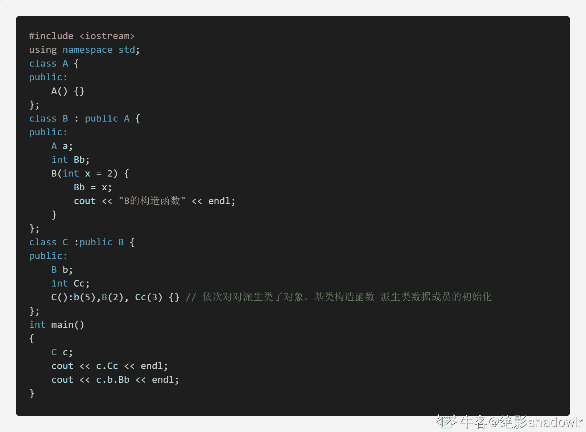
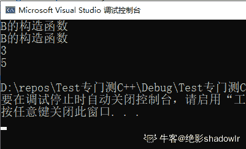

# 欢聚时代 2018 校招笔试题-语音算法工程师 A 卷

## 1

下列的各类函数中， ___________ 不是类的成员函数。

正确答案: C   你的答案: 空 (错误)

```cpp
构造函数
```

```cpp
析构函数
```

```cpp
友元函数
```

```cpp
拷贝初始化构造函数
```

本题知识点

算法工程师 欢聚集团 2018 C++

讨论

[牛客小丑 C](https://www.nowcoder.com/profile/410104169)

个人理解，打个比喻，友元函数就是这个类的好基友，可以无话不聊(该类中的任意属性成员都可被访问)，但是，不能被派生类继承的。简单理解，你可以管你父亲叫做爸爸，但是父亲的好基友，你总不能叫他爸爸吧？哈哈哈，友元函数就是这么一个东西~

发表于 2021-04-04 16:10:06

* * *

[牛客 692174749 号](https://www.nowcoder.com/profile/692174749)

友元函数不是类的成员函数，但是可以访问类的私有成员

发表于 2020-09-04 11:54:50

* * *

## 2

作用域运算符“::”的功能是 ________________

正确答案: D   你的答案: 空 (错误)

```cpp
标识作用域的级别的
```

```cpp
指出作用域的范围的     
```

```cpp
给定作用域的大小的
```

```cpp
标识成员是属于哪个类的
```

本题知识点

算法工程师 欢聚集团 2018

## 3

_________________ 是析构函数的特征。

正确答案: A   你的答案: 空 (错误)

```cpp
一个类中只能定义一个析构函数
```

```cpp
析构函数名与类名不同
```

```cpp
析构函数的定义只能在类体内
```

```cpp
析构函数可以有一个或多个参数
```

本题知识点

算法工程师 欢聚集团 2018

## 4

关于 new 运算符的下列描述中，____________ 是错的。

正确答案: D   你的答案: 空 (错误)

```cpp
它可以用来动态创建对象和对象数组  
```

```cpp
使用它创建的对象或对象数组可以使用运算符 delete 删除
```

```cpp
使用它创建对象时要调用构造函数  
```

```cpp
使用它创建对象数组时必须指定初始值
```

本题知识点

算法工程师 欢聚集团 2018

## 5

下列对派生类的描述中， _______________ 是错的。

正确答案: D   你的答案: 空 (错误)

```cpp
一个派生类可以作另一派生类的基类
```

```cpp
派生类至少有一个基类
```

```cpp
派生类的成员除了它自己的成员外，还包含了它的基类的成员
```

```cpp
派生类中继承的基类成员的访问权限到派生类中保持不变
```

本题知识点

算法工程师 欢聚集团 2018 C++

讨论

[19961226](https://www.nowcoder.com/profile/2152511)

应该是 MAX 吧。这是我在网上找的。1\. public 继承方式
基类中所有 public 成员在派生类中为 public 属性；
        基类中所有 protected 成员在派生类中为 protected 属性；
        基类中所有 private 成员在派生类中不能使用。 2\. protected 继承方式
        基类中的所有 public 成员在派生类中为 protected 属性；
        基类中的所有 protected 成员在派生类中为 protected 属性；
        基类中的所有 private 成员在派生类中不能使用。
3\. private 继承方式
        基类中的所有 public 成员在派生类中均为 private 属性；
        基类中的所有 protected 成员在派生类中均为 private 属性；
        基类中的所有 private 成员在派生类中不能使用。
————————————————
版权声明：本文为 CSDN 博主「自由如风呼呼呼」的原创文章，遵循 CC 4.0 BY-SA 版权协议，转载请附上原文出处链接及本声明。
原文链接：[`blog.csdn.net/weixin_44363885/article/details/97278666`](https://blog.csdn.net/weixin_44363885/article/details/97278666) 

发表于 2021-08-10 09:11:58

* * *

[***战君](https://www.nowcoder.com/profile/608883551)

基类成员变量访问权限=Min〔基类中的访问权限，继承方式〕

发表于 2020-08-10 21:18:28

* * *

## 6

派生类的构造函数的成员初始化列表中，不能包含 _________

正确答案: D   你的答案: 空 (错误)

```cpp
基类的构造函数    
```

```cpp
派生类中子对象的初始化
```

```cpp
派生类中一般数据成员的初始化
```

```cpp
基类的子对象初始化
```

本题知识点

算法工程师 欢聚集团 2018 C++

讨论

[绝影 shadowlr](https://www.nowcoder.com/profile/711576544)

*   **本题答案 D**

*   在 vc 上测试，依次初始化派生类子对象、调用基类构造函数、派生类中一般数据成员的初始化
    对于基类子对象初始化会报错
    
    

发表于 2020-10-10 19:37:22

* * *

[＿AlieZ](https://www.nowcoder.com/profile/9961148)

楼上的代码应该需要改一下，c++是不允许派生类构造的时候使用间接基类的构造函数的。可以改成另一个单独的类 Temp。假设 A 中有子对象 Temp atemp; B 中有子对象 Temp btemp;那么在 B 的成员初始化列表中写 atemp()的话，编译器会提示 B 中没有这个成员。。个人理解是，派生类能够调用基类的构造函数。但是类的成员初始化都由自己的构造函数来完成，而不要其他派生体系中的类来干涉。你可以通过调用基类构造函数来给基类成员初始化，但是不能直接对基类成员初始化。

发表于 2020-12-06 16:12:08

* * *

[ZLMRX](https://www.nowcoder.com/profile/865499733)

请问基类子对象和派生类子对象是什么意思？？有人解答一下吗？？

发表于 2021-10-27 12:13:59

* * *

## 7

下列函数中，_______________ 不能重载。

正确答案: C   你的答案: 空 (错误)

```cpp
成员函数    
```

```cpp
非成员函数
```

```cpp
析构函数
```

```cpp
构造函数
```

本题知识点

算法工程师 欢聚集团 2018 C++

讨论

[杉杉来啦](https://www.nowcoder.com/profile/243827773)

析构函数  无参无返回值无类型  与重载相矛盾   **什么是函数重载（what）？**

**函数重载是指在****同一作用域内****，可以有一组具有****相同函数名****，****不同参数列表****的函数，这组函数被称为重载函数**。重载函数通常用来命名一组功能相似的函数，这样做减少了函数名的数量，避免了名字空间的污染，对于程序的可读性有很大的好处。

发表于 2020-08-15 10:04:54

* * *

[林山一笑](https://www.nowcoder.com/profile/71176329)

重载函数是同名不同参数的

```cpp
构造函数一般都需要重写的。
一个类里面构造一般都是需要重载的。
而成员函数，在它的派生类里面，如果不满意父类的方法，一般就是重写。
而非成员的函数，我们一般是利用形参的类型和个数不同来重载它们

```

发表于 2020-08-09 00:09:15

* * *

[牛客 889459430 号](https://www.nowcoder.com/profile/889459430)

构造函数一般都需要重写的。 一个类里面构造一般都是需要重载的。 而成员函数，在它的派生类里面，如果不满意父类的方法，一般就是重写。 而非成员的函数，我们一般是利用形参的类型和个数不同来重载它们

发表于 2021-06-27 14:37:38

* * *

## 8

对静态成员的不正确描述是 ___________

正确答案: C   你的答案: 空 (错误)

```cpp
静态成员不属于对象，是类的共享成员
```

```cpp
静态数据成员要在类外定义和初始化
```

```cpp
静态成员函数拥有 this 指针
```

```cpp
非静态成员函数也可以操作静态数据成员
```

本题知识点

算法工程师 欢聚集团 2018 C++

讨论

[牛客小丑 C](https://www.nowcoder.com/profile/410104169)

静态就不属于任一对象的，而 this 就是指对象的啥~所以 c 就不对了~这样子理解不知道合适不合适~

发表于 2020-12-26 08:25:42

* * *

[UnKnown-Error](https://www.nowcoder.com/profile/745444137)

静态数据成员要在类内声明 ，类外定义和初始化

发表于 2020-10-18 18:24:23

* * *

[丸子球球](https://www.nowcoder.com/profile/592870647)

这道题不太严谨,因为能在类中初始化的成员还有静态常量成员。

发表于 2021-03-26 10:56:50

* * *

## 9

假设 A 为抽象类，下列声明 ____________ 是正确的。

正确答案: B   你的答案: 空 (错误)

```cpp
A fun(int);      
```

```cpp
A *p;
```

```cpp
int fun(A);  
```

```cpp
A Obj;
```

本题知识点

算法工程师 欢聚集团 2018

讨论

[牛客 952082657 号](https://www.nowcoder.com/profile/952082657)

1\. 抽象类只能作为基类来派生新类使用，不能建立抽象类对象 2\. 抽象类不能实例化对象，只能作为接口使用 3\. 抽象类不能用作参数类型、函数返回类型或显式转换的类型 4\. 可以定义指向抽象类的指针和引用，此指针可以指向它的派生类，进而实现多态性

发表于 2020-08-28 17:19:17

* * *

## 10

要求打开文件 d:file.dat，可写入数据，正确的语句是 ___________

正确答案: D   你的答案: 空 (错误)

```cpp
ifstream infile(“d:file.dat”, ios::in);
```

```cpp
ifstream infile(“d:\\file.dat”, ios::in);
```

```cpp
ofstream infile(“d:file.dat”, ios::out);
```

```cpp
fstream infile(“d:\\file.dat”, ios::in| ios::out);
```

本题知识点

算法工程师 欢聚集团 2018 C++

讨论

[叫我小张就行啦](https://www.nowcoder.com/profile/420013769)

in 是读入内存，out 内存输出

发表于 2021-08-13 23:57:03

* * *

[keepyixiao](https://www.nowcoder.com/profile/397917669)

为啥 C 不可以

发表于 2021-09-29 15:23:33

* * *

[还不是很牛](https://www.nowcoder.com/profile/525874165)

ofstream 写数据;istream 读数据;fstream 可读可写。

发表于 2020-12-05 20:25:45

* * *

## 11

如果已定义了一个 C++类 CMyList 并有以下语句：CMyList list(3);以下说法正确的是 _______。

正确答案: B   你的答案: 空 (错误)

```cpp
该语句会创建一个 CMyList 类的 3 个对象；
```

```cpp
必须为类 CMyList 定义一个构造函数；
```

```cpp
必须为类 CMyList 定义一个析构函数；
```

```cpp
必须定义函数 CMyList list(int)；
```

本题知识点

算法工程师 欢聚集团 2018 C++

讨论

[牛客职导官方账号](https://www.nowcoder.com/profile/897353)

【正确答案】B
【解析】语句   查看全部)

编辑于 2021-11-18 08:21:53

* * *

[丸子球球](https://www.nowcoder.com/profile/592870647)

D 不是必须要定义函数 CMyList list(int)；也可以定义函数 CMyList list(float)之类的能隐式转换的函数 发表于 2021-03-26 08:47:26

* * *

[liuzhen007](https://www.nowcoder.com/profile/873052646)

答案 A，注意是小括号，不是中括号。答案 B，所谓的“必须为类 CMyList 定义一个构造函数”，其实际含义是为类 CMyList 定义一个带一个整型参数的构造函数，因为默认构造函数是不带参数的。不单独额外定义构造函数，编译会报错。

发表于 2021-03-07 08:39:22

* * *

## 12

在下列关于 C++函数的叙述中，正确的是 _________

正确答案: C   你的答案: 空 (错误)

```cpp
每个函数至少要有一个参数
```

```cpp
每个函数都必须返回一个值
```

```cpp
函数在被调用之前必须先声明
```

```cpp
函数不能自己调用自己
```

本题知识点

算法工程师 欢聚集团 2018

讨论

[路人のhehe](https://www.nowcoder.com/profile/2562288)

选 C。A：可以没有参数。B：可以没有返回值。D：可以递归调用自己。

发表于 2017-11-19 21:22:20

* * *

## 13

下面对静态数据成员的描述中，正确的是 ________

正确答案: D   你的答案: 空 (错误)

```cpp
静态数据成员可以在类体内进行初始化
```

```cpp
静态数据成员不可以被类的对象调用
```

```cpp
静态数据成员不受 private 控制符的作用
```

```cpp
静态数据成员可以直接用类名调用
```

本题知识点

算法工程师 欢聚集团 2018

## 14

下面关于算法的说法，正确的是 _________。

正确答案: D   你的答案: 空 (错误)

```cpp
算法的时间复杂度一般与算法的空间复杂度成正比
```

```cpp
解决某问题的算法可能有多种，但肯定采用相同的数据结构
```

```cpp
算法的可行性是指算法的指令不能有二义性
```

```cpp
同一个算法，实现语言的级别越高，执行效率就越低
```

本题知识点

算法工程师 欢聚集团 2018

## 15

若某表最常用的操作是在最后一个结点之后插入一个结点或删除最后一个结点，则采用 ______ 存储方式最节省运算时间。

正确答案: D   你的答案: 空 (错误)

```cpp
单链表
```

```cpp
给出表头指针的单循环链表
```

```cpp
双链表
```

```cpp
带头结点的双循环链表
```

本题知识点

算法工程师 欢聚集团 2018

## 16

栈的特点是 _______，队列的特点是 _________。

正确答案: C   你的答案: 空 (错误)

```cpp
先进先出 ，先进后出
```

```cpp
先进先出 ，先进先出
```

```cpp
先进后出，先进先出
```

```cpp
先进后出，先进后出
```

本题知识点

算法工程师 欢聚集团 2018

讨论

[路人のhehe](https://www.nowcoder.com/profile/2562288)

C。 这是栈和队列的基本特点。

发表于 2017-11-19 21:23:19

* * *

## 17

从未排序序列中挑选元素，并将其依次放入已排序序列（初始时为空）的一端，这种排序方法称为 ________

正确答案: C   你的答案: 空 (错误)

```cpp
插入排序
```

```cpp
归并排序
```

```cpp
选择排序
```

```cpp
快速排序
```

本题知识点

算法工程师 欢聚集团 2018

## 18

语音的四要素是音长，音强，1 和音质，它们可从时域波形上反映出来。其中音长特性：音长 2，说话速度必然慢；音长 3，说话速度必然快。音强的大小是由于声源的 4 大小来决定

你的答案 (错误)

1234 参考答案 (1) 音高
(2) 长
(3) 短
(4) 震动幅度

本题知识点

算法工程师 欢聚集团 2018

## 19

如果过零率 1，语音信号就是清音。如果过零率 2，语音信号就是浊音。一个音节由 3 和 4 构成

你的答案 (错误)

1234 参考答案 (1) 高
(2) 低
(3) 元音
(4) 辅音

本题知识点

算法工程师 欢聚集团 2018

## 20

对语音信号进行压缩编码的基本依据是语音信号的 1 和人的听觉感知机理

你的答案 (错误)

1 参考答案 (1) 冗余度

本题知识点

算法工程师 欢聚集团 2018

## 21

一个完整的语音信号数字模型可以用 12 和 3 的级联来表示

你的答案 (错误)

123 参考答案 (1) 激励模型
(2) 声道模型
(3) 辐射模型

本题知识点

算法工程师 欢聚集团 2018

## 22

一个箱子里有 16 个红色气球和 14 个黄色气球，从中取出两个气球并增加一个气球作为一次操作。
如果取出的气球颜色相同，则增加一个红色气球；
如果取出的气球颜色不同，则增加一个黄色气球。
已知这样的 27 次操作之后箱子里还有几个红色气球，几个黄色气球，为什么？

你的答案

本题知识点

算法工程师 欢聚集团 2018

讨论

[黑色灬的天ˇ](https://www.nowcoder.com/profile/3653222)

一二条件可以综合成一个结论 每次取完 黄色气球的数量一定还是偶数 30 个气球 每次少一个  27 次之后剩下 3 个  那么可能 0 黄 3 红 2 黄 1 红  

发表于 2017-11-14 18:44:27

* * *

## 23

小 Y 一家人要过河，过河一定要有小船，小 Y 全家都会划船。假设现在只有一条小船，小船最多承载两个人。小 Y 过河需要 1min，小 Y 的姐姐过河需要 3min，小 Y 的爷爷过河需要 12min，小 Y 的爸爸过河需要 6min，小 Y 的妈妈过河需要 8min，请问小 Y 一家人如何在 30min 内过河？（本题 10 分）

你的答案

本题知识点

算法工程师 欢聚集团 2018

## 24

什么是共振峰?

你的答案

本题知识点

算法工程师 欢聚集团 2018

## 25

FIR 滤波器和 IIR 滤波器的区别和优缺点

你的答案

本题知识点

算法工程师 欢聚集团 2018

## 26

简述复倒谱和倒谱的特点和关系

你的答案

本题知识点

算法工程师 欢聚集团 2018

## 27

算法：对一已排序的数组，编程实现二分查找算法，函数声明如下 int bin_search(const int* datas, int len, int key)；**输入描述：**数组, 待查找元素**输出描述：**元素所在数组 index**输入样例：**12 20 33 49 51 67, 33**输出样例：**2（注：不能使用本地 IDE）

你的答案

本题知识点

算法工程师 欢聚集团 2018

讨论

[路人のhehe](https://www.nowcoder.com/profile/2562288)

```cpp
int bin_search(const int* datas, int len, int key)
{
    int starts = 0;
    int ends = len - 1;
    int middle = int((ends + starts) / 2);
    while(starts <= ends)
    {
        if(datas[middle] == key)
        {
            return middle;
        }
        else if(datas[middle] > key)
        {
            ends = middle - 1;
        }
        else
        {
            starts = middle + 1;
        }
        middle = int((ends + starts) / 2);
    }
    return -1;
}

```

发表于 2017-11-19 21:43:09

* * *