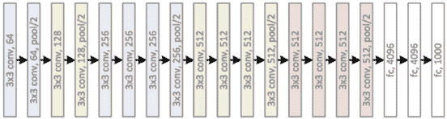
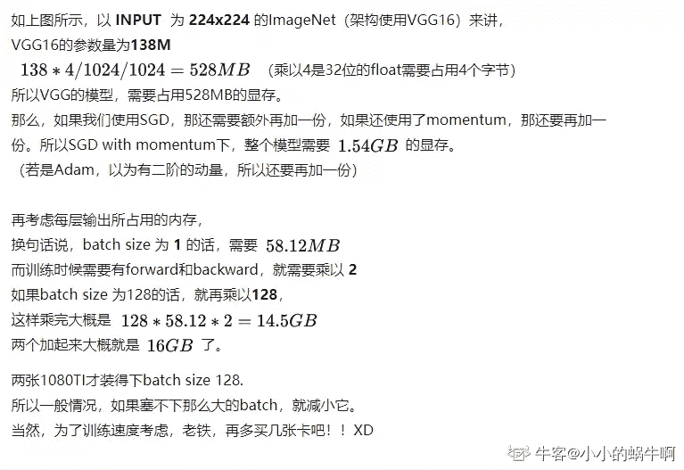
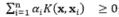
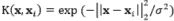

# 欢聚时代 2018 校招笔试题-图像算法工程师（深度学习）A 卷

## 1

测试集中 1000 个样本，600 个是 A 类，400 个 B 类，模型预测结果 700 个判断为 A 类，其中正确的有 500 个，300 个判断为 B 类，其中正确的有 200 个。请计算 B 类的准确率(Precision)和召回率(Recall).

你的答案

本题知识点

算法工程师 欢聚集团 2018 运维工程师

讨论

[斑马斑马``](https://www.nowcoder.com/profile/1903531)

TP（真正例）=200，FP（假正例）=100，FN（假反例）=200，TN（真反例）=500 准确率 P=TP/(TP+FP)=200/300=2/3 召回率 R=TP/(TP+FN)=200/400=1/2so...给的答案是 A 类的，答案有误。

编辑于 2018-01-16 00:07:41

* * *

[我只是弱鸡](https://www.nowcoder.com/profile/4158405)

准确率 Precision:指的是检测出的正样本中中有多少是真的正样本；召回率 Recall:对所有正样本，分类器正确识别了多少；Precision=200/300=0.67Recall=200/400=0.5

发表于 2018-04-16 14:28:45

* * *

[求一个 offer！！](https://www.nowcoder.com/profile/4779533)

准确率 2/3,召回率  1/2， 答案给的是 a 类的吧

发表于 2017-11-15 11:28:37

* * *

## 2

简述：A)训练模型时，如果样本类别不均衡，有什么办法解决? B)如何判断模型是否过拟合? C)对于神经网络模型有哪些常用方法解决过拟合问题?

你的答案

本题知识点

算法工程师 欢聚集团 2018 运维工程师

讨论

[七月恋堇](https://www.nowcoder.com/profile/8845796)

A）

1.上采样（over-sample）；

2.下采样（under-sample）；

3.smote 方法；

4.调整机器学习算法；

 B)利用学习曲线

当训练集和测试集的误差收敛但却很高时，为高偏差。 
左上角的偏差很高，训练集和验证集的准确率都很低，很可能是欠拟合。 
我们可以增加模型参数，比如，构建更多的特征，减小正则项。 
此时通过增加数据量是不起作用的。

当训练集和测试集的误差之间有大的差距时，为高方差。 
当训练集的准确率比其他独立数据集上的测试结果的准确率要高时，一般都是过拟合。 
右上角方差很高，训练集和验证集的准确率相差太多，应该是过拟合。 

C）我们可以增大训练集，降低模型复杂度，增大正则项，或者通过特征选择减少特征数。

发表于 2018-06-03 14:58:58

* * *

[Isio](https://www.nowcoder.com/profile/375421664)

针对 B 问题：利用 Tensorboard 绘制的学习曲线进行判断。
根据 train loss 曲线以及 test loss 曲线可知：
1.train loss 不断下降，test loss 趋于不变，网络必过拟合。
2.train loss 不断下降，test loss 不断上升，网络必过拟合。
3.train loss 趋于不变，test loss 不断上升，网络必过拟合。

发表于 2019-06-04 15:50:29

* * *

[zhxing](https://www.nowcoder.com/profile/5160179)

A. 1.  是否看而已增加样本，增加数据集。2\. 如果多的那一类真的样本比较多，可以尝试进行随机抽样，使两者基本处于同一个数量级上。3\. 对少的样本进行过采样，或者进行一些仿射变换之类的做法来增加样本数量。4\. 对模型加入额外的惩罚项来平衡类别不平衡。B.  训练集和测试集准确率较高，但是在新的数据集上准确率和测试集相差太大。C.  解决过拟合：1.  增加训练两本，可以有效减少过拟合。2.  dropout，随机失活的方法可以认为是每次对原图进行的随机采样，本质上还是增加了训练样本，很有用。3.  减少模型复杂度，模型太复杂，对损失要求太高，都容易出现过拟合。这里一般采用的是正则化的方法来乘法模型复杂度。

发表于 2018-07-13 14:55:15

* * *

## 3

简述：A)神经网络节点的激活函数作用是什么? B)Sigmoid, relu 和 softmax 激活函数表达式是什么? C)各自的作用优缺点是什么？

你的答案

本题知识点

算法工程师 欢聚集团 2018 运维工程师

讨论

[Isio](https://www.nowcoder.com/profile/375421664)

C 题目的补充答案：1.Sigmoid 函数：优点：把输入的连续实值变换为 0 和 1 之间的连续输出。非常大的负数输出为 0，非常大的正数输出为 1。
缺点 1：深度神经网络中，梯度反向传递时，出现梯度爆炸或梯度消失，其中梯度爆炸发生概率非常小，梯度消失发生概率比较大。
原因：Sigmoid 函数的导数如图所示，当初始化神经网络的权值为 [0,1] 之间的随机值时，由反向传播算法的数学推导可知，梯度从后向前传播时每传递一层梯度值都会减小为原来的 0.25 倍，如果神经网络隐层特别多，那么梯度在穿过多层后将会趋于 0，即出现梯度消失现象；当网络权值初始化为 (1,+∞) 区间内的值时，前面的层比后面的层梯度变化更快（指数级），则会出现梯度爆炸情况。缺点 2：解析式中含有幂运算，计算机求解时较为耗时。对于大规模深度网络，这会较大地增加训练的时间成本。2.ReLU 函数：优点：1）解决了梯度消失的问题 (在正区间)
2）计算速度非常快（只需判断输入是否大于 0）
3）收敛速度远快于 Sigmoid
4）增强网络稀疏性（负区间均为零，即节点不被训练）
缺点：Dead ReLU Problem，即某些神经元可能永远不会被激活，导致相应的参数永远不能被更新。
原因：(1) 很差的参数初始化情况（这种情况比较少见）
(2)学习率太高导致在训练过程中参数更新幅度太大，使网络进入上述状态。
3.Softmax 函数：优点：1）使得输入大的值更大，小的更小，增强了区分对比度，学习效率更高
2）softmax 是连续可导的，消除了拐点
3）输出归一化，方便计算基于概率的 loss 注：Softmax 是 Sigmoid 的推广，二分类时，Sigmoid 与 Softmax 相同。

发表于 2019-06-04 16:42:16

* * *

[一只小卡](https://www.nowcoder.com/profile/482998714)

激活函数为神经网络引入非线性因素，加强模型的预测能力。若所有隐藏层都使用线性函数作为激活函数，其作用和没有隐藏层没有区别。

发表于 2019-08-15 16:56:56

* * *

## 4

给定多层全连接神经网络，每层均有 n 个节点，输出层为第 L 层，标签是 y，损失函数为均方误差。网络的第 l 层( l∈{1,2,…,L-1,L} )的第 j 个节点的输入用 x[j]^(l )来表示，输出用 a[j]^(l )来表示，激励函数为 f(x)。A)请写出损失函数 C 的表达式；B)请推导采用 SGD 训练，学习率为η时，第 L-1 层第 i 个节点与输出层第 j 个节点的连接权重 w[ji]^((L-1) )的更新量 w[ji]^((L-1))

你的答案

本题知识点

算法工程师 欢聚集团 2018 运维工程师

讨论

[牛客 1659416](https://www.nowcoder.com/profile/6422446)

关于 B)的参考答案，第三个等式是不是少了个负号

发表于 2018-03-21 12:03:59

* * *

## 5

请计算 VGG19 的模型大小与计算量大小（输入 RGB 图片大小为 224x224）；并指出对其进行模型压缩的思路，模型结构如图所示：


你的答案

本题知识点

算法工程师 欢聚集团 2018 运维工程师

讨论

[我只是弱鸡](https://www.nowcoder.com/profile/4158405)

VGG-19 模型大小：>500M,参数数量*（参数占用字节大小）                 计算量：...模型压缩思路：图像压缩一半，卷积通道数扩大一倍。

发表于 2018-04-16 15:56:19

* * *

[中移张伟](https://www.nowcoder.com/profile/969209624)

参考这张图。**模型大小****=****参数个数 * float32 所占字节数(也就是 4)  /1024 /1024  = XXX** **MB****内存占用 = h*w*c*batch_size(训练时要乘上)  + **模型大小****

发表于 2019-09-09 23:13:17

* * *

[棒棒的！](https://www.nowcoder.com/profile/469477965)

模型压缩的思路：可以采用 SqueezeNet：SqueezeNet 包括 3 点网络结构设计策略：
**策略 1.将 3x3 卷积核替换为 1x1 卷积核。**
这一策略很好理解，因为 1 个 1x1 卷积核的参数是 3x3 卷积核参数的 1/9，这一改动理论上可以将模型尺寸压缩 9 倍。
**策略 2.减小输入到 3x3 卷积核的输入通道数。**
我们知道，对于一个采用 3x3 卷积核的卷积层，该层所有卷积参数的数量（不考虑偏置）为：P=N×C×3×3 式中，N 是卷积核的数量，也即输出通道数，C 是输入通道数。
因此，为了保证减小网络参数，不仅仅需要减少 3x3 卷积核的数量，还需减少输入到 3x3 卷积核的输入通道数量，即式中 C 的数量。
**策略 3.尽可能的将降采样放在网络后面的层中。**
在卷积神经网络中，每层输出的特征图（feature map）是否下采样是由卷积层的步长或者池化层决定的。而一个重要的观点是：分辨率越大的特征图（延迟降采样）可以带来更高的分类精度，而这一观点从直觉上也可以很好理解，因为分辨率越大的输入能够提供的信息就越多。
上述三个策略中，前两个策略都是针对如何降低参数数量而设计的，最后一个旨在最大化网络精度。

发表于 2020-06-20 11:18:57

* * *

## 6

实现一个卷积层的 forward 函数，输入 map 的 shape 为[w, h, ci]，卷积核 shape 为[k,k,ci,co], padding 大小为 p 的 zero-padding，stride 为 1，可以使用 C++/Python/Matlab 语言。

你的答案

本题知识点

算法工程师 欢聚集团 2018 运维工程师

讨论

[你好，阳光 201803211123427](https://www.nowcoder.com/profile/5611573)

```cpp
import numpy as np
def cnn_forward(layer_in, conv_filter, pad, stride=1):
"""implement forward computation of a CNN layer"""
    w, h, ci = layer_in.shape
    k, k, _, co = conv_filter.shape
    padded_layer = np.pad(layer_in, ((pad,), (pad,), (0,)), 'constant', constant_values=(0,))
    w_out = 1 + (w+2*pad-k)//stride
    h_out = 1 + (h+2*pad-k)//stride
    out = np.zeros((w_out, h_out, co))
    # 对每个输出空间位置(i,j)和每个深度列 k
    for i in range(w_out):
        for j in range(h_out):
            layer_in_mask = padded_layer[i*stride:i*stride+k, j*stride:j*stride+k, :]
            for k in range(co):
                out[i, j, k] = np.sum(layer_in_mask*conv_filter[:,:,:,k])
    return out
​ 
```

编辑于 2018-09-13 23:26:51

* * *

[qtSunnylove](https://www.nowcoder.com/profile/6080410)

怎么都没有人解答啊，求解答啊啊啊

发表于 2018-04-14 14:53:30

* * *

## 7

      The decision function of support vector machine f(x) can be expressed as f(x)=1, if ; otherwise f(x)=0\. x is a test sample whose dimensionality is d, and {x[i]} are support vectors automatically selected from the training set. K(x,x[i]) is the kernel function to measure the similarity between x and x[i]. In this problem, we assume . Show that this support vector machine can be implemented with a 3-layer neural network. Show the network structure, weights, and nonlinear activation functions at each layer. 

你的答案

本题知识点

算法工程师 欢聚集团 2018 运维工程师