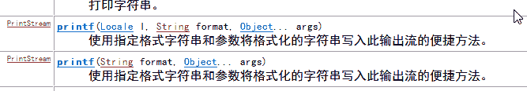
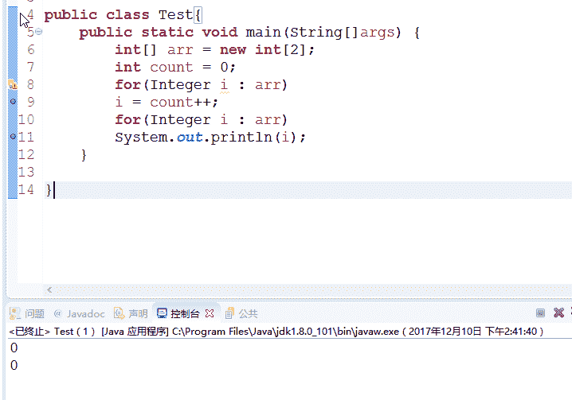

# 搜狐畅游 2018 游戏开发工程师（Java）非游戏基础题部分笔试试卷

## 1

以下关于异常的说法正确的是：

正确答案: D   你的答案: 空 (错误)

```cpp
一旦出现异常，程序运行就终止了
```

```cpp
如果一个方法申明将抛出某个异常，它就必须真的抛出那个异常
```

```cpp
在 catch 子句中匹配异常是一种精确匹配
```

```cpp
可能抛出系统异常的方法是不需要申明异常的
```

本题知识点

游戏研发工程师 Java 工程师 搜狐畅游 2018

讨论

[就想有个靠谱工作](https://www.nowcoder.com/profile/8197082)

A 异常可以被 catch 之后处理，程序依旧在运行 B throws 只是表明这个方法可能出现异常，而不是绝对 C catch 中可以匹配它子类中的异常

发表于 2018-04-01 14:04:36

* * *

[瘦子的外表](https://www.nowcoder.com/profile/1233851)

runtimeexception

发表于 2017-11-26 23:52:03

* * *

## 2

给定如下 Java 代码，编译运行的结果是（）
LinkedList list=new LinkedList();
list.add("A");
list.add(0,"B");
String s=(String)list.get(1);
System.out.println(s);

正确答案: C   你的答案: 空 (错误)

```cpp
编译时发生错误
```

```cpp
运行时引发异常
```

```cpp
正确运行，输出：A
```

```cpp
正确运行，输出：B
```

本题知识点

游戏研发工程师 Java 工程师 搜狐畅游 2018

讨论

[jranzjm](https://www.nowcoder.com/profile/9624625)

因为 LinkedList.add（index,element）方法里面采用的是类似于数组插入的方法：如果有元素，则其后面的元素索引+1

add

```cpp
public void add(int index, E element)
```

在此列表中指定的位置插入指定的元素。移动当前在该位置处的元素（如果有），所有后续元素都向右移（在其索引中添加 1）。**指定者：** 接口 List<E>中的 add**覆盖：** 类 AbstractSequentialList<E>中的 add**参数：** index- 要在其中插入指定元素的索引 element- 要插入的元素**抛出：** IndexOutOfBoundsException- 如果索引超出范围 (index < 0 || index > size())以上来自 JDK 1.6 API

发表于 2017-12-01 15:24:39

* * *

[编程的渣渣啊啊啊](https://www.nowcoder.com/profile/8501721)

list.add(idx,element)//可以在指定位置插入元素

发表于 2018-04-07 11:40:49

* * *

## 3

下列叙述中正确的是( )

正确答案: A   你的答案: 空 (错误)

```cpp
Java 语言的标识符是区分大小写的
```

```cpp
源文件名与 public 类名可以不相同
```

```cpp
源文件扩展名为.jar
```

```cpp
源文件中 public 类的数目不限
```

本题知识点

游戏研发工程师 Java 工程师 搜狐畅游 2018

## 4

下列属于合法的 Java 标识符是( )

正确答案: A   你的答案: 空 (错误)

```cpp
_cat
```

```cpp
5books
```

```cpp
+static
```

```cpp
-3.14159
```

本题知识点

游戏研发工程师 Java 工程师 搜狐畅游 2018

讨论

[shijiacheng](https://www.nowcoder.com/profile/179663)

1\.  标识符可以由字母、数字、下划线（_）、美元符（$）组成，但不能包含 @、%、空格等其它特殊字符，不能以数字开头。譬如：123name 就是不合法滴

 2\.  标识符不能是 Java 关键字和保留字（ Java 预留的关键字，以后的升级版本中有可能作为关键字），但可以包含关键字和保留字。如：不可以使用 void 作为标识符，但是 Myvoid 可以

 3\.  标识符是严格区分大小写的。

 4\.  标识符的命名最好能反映出其作用，做到见名知意。

发表于 2018-01-22 23:16:49

* * *

## 5

在 Java 中所有类的根类是( )

正确答案: A   你的答案: 空 (错误)

```cpp
java.lang.Object
```

```cpp
java.lang.Class
```

```cpp
java.applet.Applet
```

```cpp
java.awt.Frame
```

本题知识点

游戏研发工程师 Java 工程师 搜狐畅游 2018

讨论

[就想有个靠谱工作](https://www.nowcoder.com/profile/8197082)

万物皆对象，Class 也是 Object 的子类 class A (extends Object) 

发表于 2018-04-01 14:06:53

* * *

## 6

在 Java 中用 Package 语句说明一个包时，该包的层次结构必须是( )

正确答案: A   你的答案: 空 (错误)

```cpp
与文件的结构相同
```

```cpp
与文件目录的层次相同
```

```cpp
与文件类型相同
```

```cpp
与文件大小相同
```

本题知识点

游戏研发工程师 Java 工程师 搜狐畅游 2018

讨论

[编程的渣渣啊啊啊](https://www.nowcoder.com/profile/8501721)

A 和 B 有啥区别？

发表于 2018-04-07 11:41:35

* * *

[Accepts](https://www.nowcoder.com/profile/863671)

看不懂题目。。

发表于 2017-11-25 10:47:53

* * *

[阿弦](https://www.nowcoder.com/profile/7740356)

```cpp
一般来说，之所以用的包的概念就是为了能够很好的管理文件 所以你定义的包就要以你工程文件整体的命名关联起来，具体命名没有要求，你的要求就是文件结构的要求了，但是包要小写

另外开发中，文件的存储结构要和包的结构一样是因为这样便于查找文件所在目录；
```

编辑于 2018-01-23 10:02:47

* * *

## 7

在读字符文件 Employee.dat 时可以使用该文件作为参数的类是( )。

正确答案: D   你的答案: 空 (错误)

```cpp
BufferReader
```

```cpp
DatalnputStream
```

```cpp
DataOutoutStream
```

```cpp
FileInputStream
```

本题知识点

游戏研发工程师 Java 工程师 搜狐畅游 2018

讨论

[风车先生](https://www.nowcoder.com/profile/4841044)

从文本文件读字符到程序时，有一个编码的过程。这里的文件不是纯文本文件，可能会编码不成功，用字符流可能会读取不成功，而字节流可以读取一切文件包括这个.bat 文件

发表于 2018-03-16 22:42:41

* * *

[唯有梦想不可辜负](https://www.nowcoder.com/profile/173410236)

.dat 文件并不是一种严格的文件格式。并不能单纯的以为就是字符型文件或者字节型文件。如果选 A 的话，是采用字符流的读取方式，可能会导致读取失败。 这个题目不应该单纯关注文件的类型，还要注重它是一个文件。所以 D 是相对合适的。

发表于 2021-09-11 08:41:56

* * *

[牛客 114880997 号](https://www.nowcoder.com/profile/114880997)

题目还特意表示字符文件，干扰我。

发表于 2019-10-18 20:02:09

* * *

## 8

在 Java 中能实现多重继承效果的方式是( )。

正确答案: C   你的答案: 空 (错误)

```cpp
内部类
```

```cpp
适配器
```

```cpp
接口
```

```cpp
同步
```

本题知识点

游戏研发工程师 Java 工程师 搜狐畅游 2018

讨论

[小企鹅不在家](https://www.nowcoder.com/profile/3629847)

感觉这个题不是很严谨。 内部类也可以为 java 实现多继承提供解决方案吧。 菜鸟一枚 求大神指点

发表于 2017-12-18 15:36:09

* * *

[bukun](https://www.nowcoder.com/profile/514169517)

A 可以吧

发表于 2020-09-28 21:55:00

* * *

[痴情狼](https://www.nowcoder.com/profile/3369873)

Java 中不支持多继承，也就是不能存在一个子类继承多个父类的情况，当然你会问这是为什么呢.因为这会造成子类中某些方法或者变量的不确定性。
为了弥补 java 中采用单继承所带来的不足，Java 出现了接口这个概念，接口可以很好的避免这个问题的出现。
Java 中通过多实现接口的方式去解决类之间无法多继承的问题。

发表于 2017-12-18 17:25:42

* * *

## 9

下列方法中可以用来创建一个新线程的是( )。

正确答案: C   你的答案: 空 (错误)

```cpp
实现 java.lang.Runnable 接口并重写 start()方法
```

```cpp
实现 java.iang.Runnable 接口并重写 run()方法
```

```cpp
继承 java.lang.Thread 类并重写 run()方法
```

```cpp
继承 java.lang.Thread 类并重写 start()方法
```

本题知识点

游戏研发工程师 Java 工程师 搜狐畅游 2018

讨论

[_while(true)](https://www.nowcoder.com/profile/7788911)

如果 B 选项不写错字母的话也是正确答案。

发表于 2018-01-02 21:14:28

* * *

[shijiacheng](https://www.nowcoder.com/profile/179663)

继承 java.lang.Thread 类或者直接实现 Runnable 接口来重写 run()方法实现线程。

发表于 2018-01-22 23:20:38

* * *

[愤怒的老皮蛋](https://www.nowcoder.com/profile/4314695)

这个 B 的错误真心不容易发现。。。

发表于 2018-02-22 20:46:45

* * *

## 10

下列关于线程优先级的说法中正确的是( )。

正确答案: C   你的答案: 空 (错误)

```cpp
线程的优先级是不能改变的
```

```cpp
线程的优先级是在创建线程时设置的
```

```cpp
在创建线程后的任何时候都可以设置
```

```cpp
B 和 C
```

本题知识点

游戏研发工程师 Java 工程师 搜狐畅游 2018

讨论

[叶@](https://www.nowcoder.com/profile/5955207)

yield()可以暂时让出 cpu 让其他线程运行

发表于 2017-12-23 09:30:18

* * *

[小白子](https://www.nowcoder.com/profile/3803663)

JAVA 语言中线程的优先级是用一个介于 MIN_PRIORITY 和 MAX_PRIORITY 之间的整数来表示的。可以在创建线程后的任何时刻修改线程的优先级。

发表于 2018-06-07 12:48:47

* * *

## 11

下列说法不正确的是（）

正确答案: C   你的答案: 空 (错误)

```cpp
每个 Servlet 在 JVM 中只有一个实例
```

```cpp
容器对于每个 HTTP Request 会使用一个线程处理
```

```cpp
Servlet 是线程安全对象
```

```cpp
JSP 会编译成 Servlet
```

本题知识点

游戏研发工程师 Java 工程师 搜狐畅游 2018

讨论

[shijiacheng](https://www.nowcoder.com/profile/179663)

当 Tomcat 接收到 Client 的 HTTP 请求时，Tomcat 从线程池中取出一个线程，之后找到该请求对应的 Servlet 对象并进行初始化，之后调用 service()方法。要注意的是每一个 Servlet 对象再 Tomcat 容器中只有一个实例对象，即是单例模式。如果多个 HTTP 请求请求的是同一个 Servlet，那么着两个 HTTP 请求对应的线程将并发调用 Servlet 的 service()方法。

发表于 2018-01-22 23:22:27

* * *

## 12

下列 JavaScript 代码的输出结果（）
var foo = "11"+2-"1";
console.log(foo);

正确答案: A   你的答案: 空 (错误)

```cpp
111
```

```cpp
12
```

```cpp
JavaScript 报错
```

```cpp
都不对
```

本题知识点

游戏研发工程师 Java 工程师 搜狐畅游 2018

讨论

[shijiacheng](https://www.nowcoder.com/profile/179663)

上述代码中的"11"+2 结果是 112，type 是 string，但是-“1”，使得 foo 转化成数字类型进行运算了。

发表于 2018-01-22 23:23:41

* * *

## 13

与 document.getElementById("myHeader")具有同样效果的 jQuery 选择器是（）

正确答案: C   你的答案: 空 (错误)

```cpp
$(&quot;myHeader&quot;)
```

```cpp
$(&quot;.myHeader&quot;)
```

```cpp
$(&quot;#myHeader&quot;)
```

```cpp
都不正确
```

本题知识点

游戏研发工程师 Java 工程师 搜狐畅游 2018

讨论

[杨良](https://www.nowcoder.com/profile/1741406)

quot 就是双引号吧

发表于 2018-05-09 22:59:51

* * *

## 14

下面哪个 CSS 属性会使 DOM 脱离文档流（）

正确答案: A   你的答案: 空 (错误)

```cpp
position: absolute;
```

```cpp
position: relative;
```

```cpp
position: static;
```

```cpp
都不对
```

本题知识点

游戏研发工程师 Java 工程师 搜狐畅游 2018

讨论

[孤城℡](https://www.nowcoder.com/profile/4974825)

position 的值为 absolute,fixed 的元素脱离文档流，static,relative 没有脱离文档流

发表于 2018-03-06 20:27:22

* * *

## 15

以下程序的运行结果为 ( )
public class Test extends Thread {
@Override
public void run() {
try {
Thread.sleep(1000);
} catch (InterruptedException e) {
e.printStackTrace();
}
System.out.print("run");
}

public static void main(String[] args) {
Test example = new Test();
example.run();
System.out.print("main");
}
}

正确答案: B   你的答案: 空 (错误)

```cpp
不能确定
```

```cpp
runmain
```

```cpp
mainrun
```

```cpp
main
```

```cpp
run
```

本题知识点

游戏研发工程师 Java 工程师 搜狐畅游 2018

讨论

[XWCI](https://www.nowcoder.com/profile/449754423)

被坑了，example.run();调用的是 run()，不是 start()，所以只有一个主线程，Thread.sleep(1000)让主线程休眠了。

发表于 2018-11-08 10:23:54

* * *

[唯有梦想不可辜负](https://www.nowcoder.com/profile/173410236)

这题调用的是.run()方法，没有调用.start()，所以还是一个单线程程序，从上到下依次执行。

发表于 2021-09-11 08:51:45

* * *

## 16

以下程序的运行结果为 ( )
public class HelloChangyou {
public static synchronized void main(String[] args) {
Thread t = new Thread() {
public void run() {
changyou();
}
};
t.run();
System.out.print("Hello");
}

static synchronized void changyou() {
System.out.print("ChangYou");
}
}

正确答案: C   你的答案: 空 (错误)

```cpp
不能确定
```

```cpp
HelloChangYou
```

```cpp
ChangYouHello
```

```cpp
Hello
```

本题知识点

游戏研发工程师 Java 工程师 搜狐畅游 2018

讨论

[硝烟漫过十八岁](https://www.nowcoder.com/profile/9274857)

锁的重入，只有在重入后的执行完才会退出，类似于递归的调用

发表于 2018-04-06 22:35:25

* * *

## 17

请问下面关于与 wait()一起使用的方法 notify()的各种陈述，哪个正确？

正确答案: B   你的答案: 空 (错误)

```cpp
多个线程同时等待某个条件，则只有等待时间最长的哪个线程被通知
```

```cpp
多个线程同时等待某条件，则没有办法预测哪个线程被通知
```

```cpp
notify()方法，在任何方法中都能调用
```

```cpp
notify()方法只能从 while 循环中调用
```

本题知识点

游戏研发工程师 Java 工程师 搜狐畅游 2018

## 18

以下属于非关系型数据库的有？

正确答案: D   你的答案: 空 (错误)

```cpp
MySQL
```

```cpp
SQLLite
```

```cpp
Access
```

```cpp
MongoDB
```

本题知识点

游戏研发工程师 Java 工程师 搜狐畅游 2018

讨论

[陨陌 555](https://www.nowcoder.com/profile/6413719)

常见的关系型数据库有 oracle,sql server,MySQL,SyBase,DB2,Access 只记了这么多。

发表于 2018-06-26 10:48:06

* * *

## 19

JDBC 中，用于表示数据库连接的对象是？

正确答案: B   你的答案: 空 (错误)

```cpp
Statement
```

```cpp
Connection
```

```cpp
DriverManager
```

```cpp
PreparedStatement
```

本题知识点

游戏研发工程师 Java 工程师 搜狐畅游 2018

讨论

[嘟嘟 1123](https://www.nowcoder.com/profile/550244705)

连接数据库，返回连接对象 Connection conn=driver.connect（url，properties）

发表于 2019-03-28 21:29:51

* * *

## 20

数据库中建立索引的目的？

正确答案: B   你的答案: 空 (错误)

```cpp
加快写入速度
```

```cpp
加快查询速度
```

```cpp
加快删除速度
```

```cpp
降低存储数据空间
```

本题知识点

游戏研发工程师 Java 工程师 搜狐畅游 2018

讨论

[唯有梦想不可辜负](https://www.nowcoder.com/profile/173410236)

索引的底层结构是 b-树，可以提高查询效率。

发表于 2021-09-11 08:53:30

* * *

## 21

下面代码中，在 if 处填写什么代码，可以使得输出结果为：changyou ？public static void main(String[] args) {
  if (          ){  //填写条件
      System.out.print("chang");
  } else {
      System.out.print("you");
  }
}

你的答案

本题知识点

游戏研发工程师 Java 工程师 搜狐畅游 2018

讨论

[shijiacheng](https://www.nowcoder.com/profile/179663)

System.out.printf("%s","chang").equals("temp")

发表于 2018-01-21 15:14:59

* * *

[경☞](https://www.nowcoder.com/profile/4684927)

true

发表于 2018-05-23 16:35:46

* * *

[jranzjm](https://www.nowcoder.com/profile/9624625)

printf 方法有返回值

发表于 2017-12-10 14:40:32

* * *

## 22

以下代码会输出什么结果
Integer[] arr = new Integer[2];
int count = 0;
for(Integer i : arr)
i = count++;
for(Integer i : arr)
System.out.println(i);

你的答案

本题知识点

游戏研发工程师 Java 工程师 搜狐畅游 2018

讨论

[jranzjm](https://www.nowcoder.com/profile/9624625)

如果是基本数据类型，就会在数组中赋值为默认值，比如这道题的 Integer[]改成 int[]，就会输出 0 0，
如果是包装类，默认值是 Null

编辑于 2017-12-10 14:37:50

* * *

[唯有梦想不可辜负](https://www.nowcoder.com/profile/173410236)

for 循环或者 foreach 作用域只在循环体内。

发表于 2021-09-11 08:57:14

* * *

[编程的渣渣啊啊啊](https://www.nowcoder.com/profile/8501721)

这里 Integer 数组没赋初值，所以是 null，并且以后也没法赋 int 型变量但是初始化的时候可以赋 int 变量。

发表于 2018-04-07 11:53:47

* * *

## 23

数据分页,对于指定的页数和每页的元素个数，返回该页应该显示的数据（数据分页从 0 页开始）。

本题知识点

模拟 游戏研发工程师 Java 工程师 搜狐畅游 2018

讨论

[shijiacheng](https://www.nowcoder.com/profile/179663)

```cpp
import java.util.Scanner;

/**
 * 搜狐畅游 2018 游戏开发工程师（Java）非游戏基础题部分笔试
 * 数据分页,对于指定的页数和每页的元素个数，返回该页应该显示的数据。
 * 输入描述:
 * 第一行输入数据个数，第二行全部数据，第三行输入页数，第四行输入每页最大数据个数
 * 输出描述:
 * 输出该页应该显示的数据，超出范围请输出'超过分页范围'
 * 输入例子 1:
 * 6
 * 1 2 3 4 5 6
 * 1
 * 2
 * 输出例子 1:
 * 3
 * 4
 *
 * @author shijiacheng
 */
public class Main {
    public static void main(String[] args){
        Scanner sc = new Scanner(System.in);
        int n = sc.nextInt();//数据个数 n
        int[] array = new int[n];//全部数据 array
        for (int i = 0; i < n; i++) {
            array[i] = sc.nextInt();
        }
        int page = sc.nextInt();//输入的页数,从 0 开始
        int count = sc.nextInt();//每页的最大数据数

        int totalPage = n / count;
        if (n % count > 0){
            totalPage = totalPage+1;
        }
        if (totalPage-1<page){
            System.out.println("超过分页范围");
        }else if (totalPage-1 == page){
            for (int i = page*count; i < n; i++) {
                System.out.println(array[i]);
            }

        }else {
            for (int i = page*count; i < (page+1)*count; i++) {
                System.out.println(array[i]);
            }
        }
    }
} 
```

发表于 2018-01-22 23:26:44

* * *

[马什么梅呀](https://www.nowcoder.com/profile/8787913)

很坑：第一页其实是第二页

```cpp
//数据分页说明
#include<bits/stdc++.h>
using namespace std;
int main()
{     int num,i,j,page,maxp;     int data[1000];     while(scanf("%d",&num)!=EOF){         memset(data,0,sizeof(data));         for(i=0;i<num;i++){             scanf("%d",&data[i]);         }         scanf("%d",&page);         scanf("%d",&maxp);         int a = (num/maxp)*maxp;         int b = num-a;//b=0 或者 b>0          int c,d;         page++;         c = maxp*(page-1);         d = maxp*page;         if(b==0 && page<=a){             for(i=c;i<d && i<num;i++){                 printf("%d\n",data[i]);             }         }else if(b>0 && page<=a+1){             for(i=c;i<d && i<num;i++){                 printf("%d\n",data[i]);             }         }else{             cout<< "超过分页范围" <<endl;          }     }     return 0;
 } 

```

发表于 2018-08-07 13:12:57

* * *

[我的 Offer 呢！](https://www.nowcoder.com/profile/3988956)

```cpp

	import java.util.ArrayList;
import java.util.Arrays;
import java.util.List;
import java.util.Scanner;

public class Paginator {
    public static void main(String[] args) {

        Scanner sc = new Scanner(System.in);
        while (sc.hasNext()) {
            int n = sc.nextInt();
            int[] data = new int[n];
            for (int i = 0; i < data.length; ++i) {
                data[i] = sc.nextInt();
            }
            int pageNo = sc.nextInt();
            int countPerpage = sc.nextInt();
            int minimum = (pageNo) * (countPerpage) + 1;
            int maximum = (pageNo + 1) * (countPerpage);
            Arrays.sort(data);
            int leftIndex = Arrays.binarySearch(data, minimum);
            int rightIndex = Arrays.binarySearch(data, maximum);
            if (leftIndex < 0) {
                leftIndex = -leftIndex - 1;
            }
            if (rightIndex < 0) {
                rightIndex = -rightIndex - 2;
            }
            List<Integer> list = new ArrayList<>();
            for (int i = leftIndex; i <= rightIndex; ++i) {
                System.out.println(data[i]);
            }
            if (list.size() > 0)
                for (Integer e : list) {
                    System.out.println(e.intValue());
                }
            else {
                System.out.println("超过分页范围");
            }

        }
    }
}

```

编辑于 2018-03-21 17:02:03

* * *