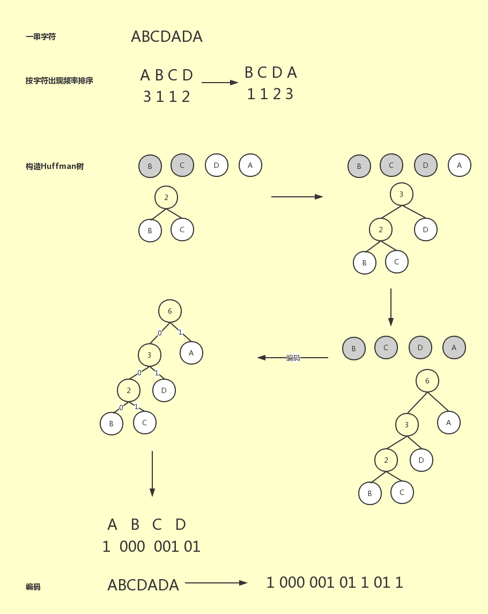

# 爱奇艺 2018 秋季校招 Android 工程师（第一场）

## 1

下面代码输出的结果为:

```cpp
import java.util.ArrayList;
import java.util.Collections;
import java.util.List;
public class Test{
    public static void main(String[] args) {
        List<Student> students = new ArrayList<Student>();
        students.add(new Student(10));
        students.add(new Student(18));
        students.add(new Student(15));
        Collections.sort(students);
        System.out.print(students.get(1).age);
    }
}
class Student implements Comparable<Student> {
    Integer age;
    public Student(Integer age) { this.age = age;
    }
    public int compareTo(Student s) {
        return s.age.compareTo(this.age);
    }
}
```

正确答案: A   你的答案: 空 (错误)

```cpp
15
```

```cpp
10
```

```cpp
18
```

```cpp
编译失败
```

本题知识点

安卓工程师 爱奇艺 2018

讨论

[shijiacheng](https://www.nowcoder.com/profile/179663)

按年龄排序

发表于 2018-01-20 15:15:17

* * *

[WWWWWW201809212108865](https://www.nowcoder.com/profile/885191181)

get(1)而不是 get(0)

发表于 2019-03-06 11:43:10

* * *

## 2

在 Linux 系统中哪个程序是特定的时间上安排特定的作业或者程序的运行？

正确答案: D   你的答案: 空 (错误)

```cpp
vi
```

```cpp
Outlook
```

```cpp
Scheduler
```

```cpp
cron
```

本题知识点

安卓工程师 爱奇艺 2018

讨论

[人生几何 1](https://www.nowcoder.com/profile/4372022)

```cpp
crontab -e ，然后，输入 *  */1 * * * 这个是每隔一个小时，执行一次。。。
crontab 每次执行，只能是每隔一段时间(但是间隔时间都是相同的），或者在某个时刻

```

发表于 2017-12-19 21:45:39

* * *

## 3

一个提供 NAT 服务的路由器在转发一个源 IP 地址为 10.0.0.1、目的 IP 地址为 131.12.1.1 的 IP 分组时，可能重写的 IP 分组首部字段是Ⅰ.TTLⅡ.片偏移量Ⅲ.源 IP 地址Ⅳ.目的 IP 地址

正确答案: C   你的答案: 空 (错误)

```cpp
仅Ⅰ
```

```cpp
仅 I、Ⅱ
```

```cpp
仅Ⅰ、Ⅱ、III
```

```cpp
Ⅰ、Ⅱ、Ⅲ、Ⅳ
```

本题知识点

安卓工程师 爱奇艺 2018

## 4

下列关于 Android 目录结构说明错误的是

正确答案: D   你的答案: 空 (错误)

```cpp
assest 下主要存放资源文件,如字体库,db 库等
```

```cpp
anim 下主要存放一些以 XML 方式存在的动画源文件
```

```cpp
values 下可以放诸如 string,attrs,style 等各种属性,样式文件
```

```cpp
drawable 有很多个文件夹,根据手机屏幕密度依次增高,对应的图片文件夹分别是 drawable-mdpi, drawable-ldpi, drawable-hdpi, drawable-xhdpi, drawable-xxhdpi
```

本题知识点

安卓工程师 爱奇艺 2018

讨论

[shijiacheng](https://www.nowcoder.com/profile/179663)

drawable-hdpi 对应 DPI 为 240

drawable-ldpi 对应 DPI 为 120

drawable-mdpi 对应 DPI 为 160

drawable-xhdpi 对应 DPI 为 320

发表于 2018-01-20 15:17:54

* * *

## 5

关于 Android 手势分发顺序下列正确的是

正确答案: A   你的答案: 空 (错误)

```cpp
dispatchTouchEvent→onInterceptTouchEvent→onTouchEvent
```

```cpp
dispatchTouchEvent→onTouchEvent→onInterceptTouchEvent
```

```cpp
onInterceptTouchEvent→dispatchTouchEvent→onTouchEvent
```

```cpp
onTouchEvent→onInterceptTouchEvent→dispatchTouchEvent
```

本题知识点

安卓工程师 爱奇艺 2018

讨论

[庸人方自扰](https://www.nowcoder.com/profile/9767556)

C，首先调用 onInterceptTouchEvent，若不进行拦截，则调用 dispatchTouchEvent 将点击事件分发给子 view，子 view 重写 onTouchEvent 消费事件

发表于 2018-04-16 15:18:08

* * *

## 6

线程是 Android 中经常用到的场景,一般都是继承 Runnable 然后实现 run 方法,当开启线程时,调用以下哪个方法,就会自动执行 run 方法?

正确答案: B   你的答案: 空 (错误)

```cpp
doRun()
```

```cpp
start();
```

```cpp
doAction();
```

```cpp
doStart();
```

本题知识点

安卓工程师 爱奇艺 2018

## 7

现定义如下三个类，

```cpp
public class A{
    private static A a = new A();
    private A(){};
    public static A getA(){
        return a;
    }
}
public class B{
    private static B b = null;
    private B(){};
    public static B getB(){
        b = new B();
        return b;
    }
}
public class C{
    private static C c = null;
    static{
        c = new C();
    }
    private C(){};
    public static C getC(){
        return c;
    }
}
```

请问属于单例模式的类是？（）

正确答案: D   你的答案: 空 (错误)

```cpp
classA 和 classB
```

```cpp
classB 和 classC
```

```cpp
只有 classA
```

```cpp
classA 和 classC
```

本题知识点

安卓工程师 爱奇艺 2018

## 8

对于字符串"ABCDADA"的二进制哈夫曼编码有多少位?

正确答案: C   你的答案: 空 (错误)

```cpp
11
```

```cpp
12
```

```cpp
13
```

```cpp
14
```

本题知识点

安卓工程师 爱奇艺 2018

讨论

[vickyZhang.](https://www.nowcoder.com/profile/4874810)

2 和 D 的权值是 7 不是 6

发表于 2019-02-22 14:49:47

* * *

[YoungJi](https://www.nowcoder.com/profile/2564970)



发表于 2018-04-07 14:45:50

* * *

## 9

下面关于选择排序说法正确的是()

正确答案: D   你的答案: 空 (错误)

```cpp
每扫描一遍数组，需要多次交换
```

```cpp
选择排序是稳定的排序方法,因为时间复杂度是固定的 O（n²）
```

```cpp
选择排序排序速度一般要比冒泡排序快
```

```cpp
空间复杂度为 O（1）
```

本题知识点

安卓工程师 爱奇艺 2018

## 10

在 UML 建模中，下列哪个 UML 的图一般用于描述软件系统的需求()

正确答案: C   你的答案: 空 (错误)

```cpp
状态图
```

```cpp
协作图
```

```cpp
用例图
```

```cpp
顺序图
```

本题知识点

安卓工程师 爱奇艺 2018

## 11

牛牛有一些排成一行的正方形。每个正方形已经被染成红色或者绿色。牛牛现在可以选择任意一个正方形然后用这两种颜色的任意一种进行染色,这个正方形的颜色将会被覆盖。牛牛的目标是在完成染色之后,每个红色 R 都比每个绿色 G 距离最左侧近。牛牛想知道他最少需要涂染几个正方形。
如样例所示: s = RGRGR
我们涂染之后变成 RRRGG 满足要求了,涂染的个数为 2,没有比这个更好的涂染方案。

本题知识点

动态规划 贪心 字符串 *穷举 安卓工程师 爱奇艺 2018* *讨论

[shijiacheng](https://www.nowcoder.com/profile/179663)

```cpp
import java.util.Scanner;

/**
 * 红和绿
 * 牛牛有一些排成一行的正方形。每个正方形已经被染成红色或者绿色。牛牛现在可以选择任意一个正方形
 * 然后用这两种颜色的任意一种进行染色,这个正方形的颜色将会被覆盖。牛牛的目标是在完成染色之后,每
 * 个红色 R 都比每个绿色 G 距离最左侧近。牛牛想知道他最少需要涂染几个正方形。
 * 如样例所示: s = RGRGR
 * 我们涂染之后变成 RRRGG 满足要求了,涂染的个数为 2,没有比这个更好的涂染方案。
 * 输入描述:
 * 输入包括一个字符串 s,字符串 s 长度 length(1 ≤ length ≤ 50),其中只包括'R'或者'G',分别表示红色和绿色。
 * 输出描述:
 * 输出一个整数,表示牛牛最少需要涂染的正方形数量
 * 输入例子 1:
 * RGRGR
 * 输出例子 1:
 * 2
 *
 * @author shijiacheng
 */
public class RedAndGreen {
    public static void main(String[] args){

        Scanner sc = new Scanner(System.in);
        String s = sc.nextLine();
        char[] chars = s.toCharArray();

        int count = chars.length;
        for (int i = 0; i < chars.length; i++) {

            int temp = 0;
            for (int j = 0; j < i; j++) {
                if (chars[j]!='R'){
                    temp++;
                }
            }
            for (int j = i; j < chars.length; j++) {
                if (chars[j]!='G'){
                    temp++;
                }
            }
            count = Math.min(count,temp);
        }
        System.out.println(count);

    }
} 
```

发表于 2018-01-20 15:19:44

* * *

[肖瑶 201803161234651](https://www.nowcoder.com/profile/1550813)

importjava.util.Scanner;publicclassMain {    publicstaticvoidmain(String[] args) {        Scanner mscanner = newScanner(System.in);        String s = mscanner.nextLine();        intRnum=0;        intindex =0;        intlength = s.length()-1;        for(inti =length ;i>=0;i--){            if(s.charAt(i)=='R'){                index = i;                break;            }        }        for(intj=0;j<index;j++){            if(s.charAt(j)=='G'){                Rnum++;            }        }        System.out.println(Rnum);    }}不知道为什么，他给的结果 GGGGRRR，需要三次，但是很明显是四次啊，思路就是先从后面知道最尾端的 R，确定 index，只需要将 0~index 之前字符串的 G 变为 R 即可。

发表于 2018-03-31 15:22:39

* * *

## 12

牛牛手中有三根木棍,长度分别是 a,b,c。牛牛可以把任一一根木棍长度削短,牛牛的目标是让这三根木棍构成一个三角形,并且牛牛还希望这个三角形的周长越大越好。

本题知识点

贪心 数学 穷举 安卓工程师 爱奇艺 2018

讨论

[-chips](https://www.nowcoder.com/profile/888702082)

思路：两边之和大于第三边 a+b>c? 输出三数之和: 将 c 截至(a+b)-1，再相加

```cpp
import java.util.Scanner;
import java.util.Arrays;
public class Main {
    public static void main(String[] args) {
        Scanner in = new Scanner(System.in);
        int[] inArray = new int[3];
        for (int i=0; i<3; i++) {
            inArray[i] = in.nextInt();
        }
        Arrays.sort(inArray);
        int ***all = inArray[0]+inArray[1];
        System.out.println(***all>inArray[2]? ***all+inArray[2]: 2****all-1);
    }  
}
```

发表于 2019-12-01 14:32:25

* * *

[馬鹿野郎](https://www.nowcoder.com/profile/641506953)

```cpp
import java.util.ArrayList;
import java.util.Collections;
import java.util.Scanner;

public class Main {
    public static void main(String[] args){

        Scanner sc = new Scanner(System.in);
        while(sc.hasNext()){
            int res = 0;
            ArrayList<Integer> list = new ArrayList<>();
            for(int i=0; i<3; i++)
                list.add(sc.nextInt());
            Collections.sort(list);
            int a = list.get(2);
            int b = list.get(1);
            int c = list.get(0);
            for(int i=a; i>=0; i++){
                for(int j=b; j>=0; j++){
                    for(int k=c; k>=0; k++){
                        if(b+c>a){
                            res = Math.max(res, a+b+c);
                        }
                    }
                }
            }
            System.out.println(res);
        }
    }
}

```

发表于 2019-04-09 16:29:27

* * *

## 13

一个合法的括号匹配序列有以下定义:
1、空串""是一个合法的括号匹配序列
2、如果"X"和"Y"都是合法的括号匹配序列,"XY"也是一个合法的括号匹配序列
3、如果"X"是一个合法的括号匹配序列,那么"(X)"也是一个合法的括号匹配序列
4、每个合法的括号序列都可以由以上规则生成。
例如: "","()","()()","((()))"都是合法的括号序列
对于一个合法的括号序列我们又有以下定义它的深度:
1、空串""的深度是 0
2、如果字符串"X"的深度是 x,字符串"Y"的深度是 y,那么字符串"XY"的深度为 max(x,y) 3、如果"X"的深度是 x,那么字符串"(X)"的深度是 x+1
例如: "()()()"的深度是 1,"((()))"的深度是 3。牛牛现在给你一个合法的括号序列,需要你计算出其深度。

本题知识点

栈 *字符串 *递归 穷举 安卓工程师 爱奇艺 2018** **讨论

[shijiacheng](https://www.nowcoder.com/profile/179663)

```cpp
import java.util.Scanner;

/**
 * 括号匹配深度
 * 一个合法的括号匹配序列有以下定义:
 * 1、空串""是一个合法的括号匹配序列
 * 2、如果"X"和"Y"都是合法的括号匹配序列,"XY"也是一个合法的括号匹配序列
 * 3、如果"X"是一个合法的括号匹配序列,那么"(X)"也是一个合法的括号匹配序列
 * 4、每个合法的括号序列都可以由以上规则生成。
 * 例如: "","()","()()","((()))"都是合法的括号序列
 * 对于一个合法的括号序列我们又有以下定义它的深度:
 * 1、空串""的深度是 0
 * 2、如果字符串"X"的深度是 x,字符串"Y"的深度是 y,那么字符串"XY"的深度为 max(x,y)
 * 3、如果"X"的深度是 x,那么字符串"(X)"的深度是 x+1
 * 例如: "()()()"的深度是 1,"((()))"的深度是 3。牛牛现在给你一个合法的括号序列,需要你计算出其深度。
 * 输入描述:
 * 输入包括一个合法的括号序列 s,s 长度 length(2 ≤ length ≤ 50),序列中只包含'('和')'。
 * 输出描述:
 * 输出一个正整数,即这个序列的深度。
 * 示例 1
 * 输入
 * (())
 * 输出
 * 2
 *
 * @author shijiacheng
 */
public class BracketMatchingDepth {
    public static void main(String[] args) {
        Scanner sc = new Scanner(System.in);
        String s = sc.nextLine();
        char[] chars = s.toCharArray();
        int depth = 0;
        int maxDepth = 0;

        for (int i = 0; i < chars.length; i++) {
            if (chars[i] == '(') {
                depth++;
                maxDepth = Math.max(maxDepth, depth);
            } else {
                depth--;
            }
        }

        System.out.println(maxDepth);
    }
} 
```

发表于 2018-01-20 15:20:39

* * ****