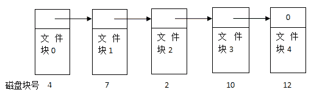

# 爱奇艺 2018 秋季校招 C 工程师（第三场）

## 1

请选择下列程序的执行结果（）

```cpp
#include<iostream>
using namespace std;
class A{    
	public:   
	void f(){
	    cout<<"A::f()";
	}
};
class B: public A{    
	public:        
		void f(){
			cout<<"B::f()";
	        };
};
int main(){  
	B b;
	b.f();  
}
```

正确答案: D   你的答案: 空 (错误)

```cpp
A::f()；B::f() 都不可能
```

```cpp
A::f()；B::f() 都有可能
```

```cpp
A::f()
```

```cpp
B::f()
```

本题知识点

C++工程师 爱奇艺 2018 C++ C 语言

讨论

[牛奋斗](https://www.nowcoder.com/profile/622194525)

这里的 B 类中的 f()是 A 类中 f()的重定义，重定义也称之为隐藏。子类重新定义父类中有相同名称的非虚函数（参数列表可以不同）。发生在继承中

发表于 2021-03-20 16:45:20

* * *

[羊小羊跑丫跑](https://www.nowcoder.com/profile/493776282)

‘：’右边表示这个函数和类这个作用域下的方法。主函数创建了 B 的对象，调用了 f 的方法，相当于执行了 B，A 这个函数被重载了，跟上一个 A 函数没关系

发表于 2020-08-21 17:12:23

* * *

## 2

什么命令不可以查看 mysql 数据库中 user 表的表结构()

正确答案: D   你的答案: 空 (错误)

```cpp
show create table user
```

```cpp
describe user
```

```cpp
desc user
```

```cpp
show columns for user
```

本题知识点

C++工程师 爱奇艺 2018

讨论

[hey,20180424](https://www.nowcoder.com/profile/5886477)

这个正确的应该是 show columns **from** user 其他三个都正确

发表于 2018-10-08 19:59:35

* * *

## 3

在 HTML 中,表示页面背景的是 A ."<body bgcolor=>"B. "<body bkcolor =>"C. "<body agcolor =>"D. "<body color=>"

正确答案: A   你的答案: 空 (错误)

```cpp
A
```

```cpp
B
```

```cpp
C
```

```cpp
D
```

本题知识点

爱奇艺 2018 HTML

讨论

[无关风月 l](https://www.nowcoder.com/profile/237704379)

bgcolor 是 background 的缩写，在 html5 中已经弃用，但是根据题意只能选他，其他都是错误的

发表于 2021-03-19 16:00:14

* * *

[树莓味的猫](https://www.nowcoder.com/profile/687784652)

以为没有 bgcolor 了，误选

发表于 2021-11-16 08:45:06

* * *

## 4

以下函数调用错误的是（）
void func(int iArg = 0, char cArg = 'a', string sArg = "hello", int *ipArg = NULL);

正确答案: D   你的答案: 空 (错误)

```cpp
func(1);
```

```cpp
func(1,'h',&quot;hehe&quot;,NULL);
```

```cpp
func(1,'n',&quot;hehe&quot;);
```

```cpp
func(1,&quot;nihao&quot;);
```

本题知识点

C++工程师 爱奇艺 2018 C 语言

讨论

[进阶中的牛客人](https://www.nowcoder.com/profile/450066322)

各个选项不太明白。。。。哎

发表于 2021-05-07 15:07:07

* * *

[mrmasterstroke](https://www.nowcoder.com/profile/993225372)

BCD 显示错误，**&quot;**是 HTML 代码中的引号，B 正确的显示应为

```cpp
func(1,'h','hehe',NULL);

```

D 错误原因：函数定义的形参为（变量，字符，字符串，指针），D 中第二个位置的实参'nihao'是字符串，第二个位置不能定义字符串实参，应定义字符实参

编辑于 2022-03-01 15:24:42

* * *

[牛客 378375069 号](https://www.nowcoder.com/profile/378375069)

hehe"是什么鬼

发表于 2022-01-05 11:04:52

* * *

## 5

某文件系统采用链接存储方式，文件 A 在磁盘中存放的情况如图所示。
若该文件所在的目录文件已经在内存中，要读取文件块 2，需要访问磁盘的次数为

正确答案: C   你的答案: 空 (错误)

```cpp
1 次
```

```cpp
2 次
```

```cpp
3 次
```

```cpp
4 次
```

本题知识点

C++工程师 爱奇艺 2018

## 6

以下哪种排序算法在最坏情况下的时间复杂度最小？

正确答案: C   你的答案: 空 (错误)

```cpp
冒泡排序
```

```cpp
选择排序
```

```cpp
归并排序
```

```cpp
插入排序
```

本题知识点

C++工程师 爱奇艺 2018

## 7

两台主机 A 和 B 已建立了 TCP 连接，A 始终以 MSS=1KB 大小的段发送数据，并一直有数据发送；B 每收到一个数据段都会发出一个接收窗口为 9KB 的确认段。若 A 在 T 时刻发生超时时拥塞窗口为 8KB，则从 T 时刻起，不再发生超时的情况下，经过 10 个 RTT 后，A 的发送窗口是 （）

正确答案: B   你的答案: 空 (错误)

```cpp
8KB
```

```cpp
9KB
```

```cpp
10KB
```

```cpp
11KB
```

本题知识点

C++工程师 爱奇艺 2018

## 8

设栈 S 初始状态为空。元素 1,2,3,4,5,6 依次通过栈 S，若出栈的顺序为 4,6,5,3,2,1，则栈 S 的容量至少应该为？

正确答案: C   你的答案: 空 (错误)

```cpp
3
```

```cpp
4
```

```cpp
5
```

```cpp
6
```

本题知识点

C++工程师 爱奇艺 2018

讨论

[hello201903261057737](https://www.nowcoder.com/profile/628070715)

1-4 进，4 个位置 4 出，5、6 进，5 个位置 6 出，5 出，3-1 出最多用到 5 个位置

发表于 2019-03-28 21:53:41

* * *

## 9

在 Linux 系统中，因为某些原因造成了一些进程变成孤儿进程，那么这些孤儿进程会被以下哪一个系统进程接管？

正确答案: B   你的答案: 空 (错误)

```cpp
sshd
```

```cpp
init
```

```cpp
top
```

```cpp
syslogd
```

本题知识点

C++工程师 爱奇艺 2018

## 10

在 Linux 系统下，下列哪个命令可以查看曾经登录到此系统的用户清单?

正确答案: B   你的答案: 空 (错误)

```cpp
ps
```

```cpp
last
```

```cpp
lastcomm
```

```cpp
accton
```

本题知识点

C++工程师 爱奇艺 2018

## 11

牛牛有 4 根木棍,长度分别为 a,b,c,d。羊羊家提供改变木棍长度的服务,如果牛牛支付一个硬币就可以让一根木棍的长度加一或者减一。牛牛需要用这四根木棍拼凑一个正方形出来,牛牛最少需要支付多少硬币才能让这四根木棍拼凑出正方形。

本题知识点

贪心 数学 排序 *穷举 C++工程师 爱奇艺 2018* *讨论

[hey,20180424](https://www.nowcoder.com/profile/5886477)

初中数学题里面求绝对值的改编。 简单举个例子，有 4 个同学找个地方集合，位置分别在数轴上的 1，4，7 ，10\. 应该找哪个位置呢，只要是 4-7 之间（包含 4-7）的都可以，画个数轴一连接，图像很清楚。因为其他区域都会有重复范围，所以总和会变大。然后再想，如果有重复值有没有影响，答案是没有，可以举个例子试试。所以代码就很容易了，利用数组的 sort 功能，把输入的四个值进行排序，都去第二个或者第三个点即可（第一个点的下标为 0 一定注意！），用 sort 的时间复杂度是 O( nlogn )  所以整个算法的时间复杂度也是 O( nlogn ) 代码如下 #include<iostream>#include<cmath>#include<algorithm>using namespace std;int main() {
    int len[4] = {};
    for (int i = 0; i < 4; ++i) {
        cin >>len[i] ;
    }
    sort(len, len + 4);
    int count = 0;
    for (int i = 0; i < 4; ++i)
        count += abs(len[i] - len[2]);
    cout << count << endl;
    return 0;
}

发表于 2018-10-08 20:07:27

* * *

[神拳小江南 _ 南七](https://www.nowcoder.com/profile/2872795)

简单的计算题，算出 4 个数中其中一个数与其他 3 个数距离，得出最小的那个就是距离之和就是答案

发表于 2018-03-28 09:50:25

* * *

## 12

一个完整的括号字符串定义规则如下:
1、空字符串是完整的。
2、如果 s 是完整的字符串，那么(s)也是完整的。
3、如果 s 和 t 是完整的字符串，将它们连接起来形成的 st 也是完整的。
例如，"(()())", ""和"(())()"是完整的括号字符串，"())(", "()(" 和 ")"是不完整的括号字符串。
牛牛有一个括号字符串 s,现在需要在其中任意位置尽量少地添加括号,将其转化为一个完整的括号字符串。请问牛牛至少需要添加多少个括号。

本题知识点

字符串 *贪心 栈 *模拟 C++工程师 爱奇艺 2018** **讨论

[mu_luo](https://www.nowcoder.com/profile/718022807)

就挺简单的

```cpp
#include <iostream>
using namespace std;
int main() {
    char c;
    int left = 0, right = 0;
    while (cin >> c) {
        if (c == '(')
            left++;
        else if (c == ')') {
            if (left > 0)
            left--;
            else right++;
        }

    }
    cout << left + right;
    return 0;

}
```

发表于 2021-07-31 19:08:21

* * *

[huanghj](https://www.nowcoder.com/profile/7958937)

```cpp

	//遇到匹配的就出栈，剩下的即为需要匹配的

	#include <iostream>

	#include <stack>

	#include <string>

	usingnamespacestd;

	intmain(){

	    stack<char> s;

	    string str;

	    cin>>str;

	    intn=str.size();

	    for(inti=0;i<n;++i){

	        if(s.empty())

	            s.push(str[i]);

	        elseif(s.top()=='('&&str[i]==')')

	            s.pop();

	        else

	            s.push(str[i]);

	    }

	    cout<<s.size()<<endl;

	    return0;

	}

```

发表于 2018-01-07 16:34:48

* * *

[zjwzjw369](https://www.nowcoder.com/profile/397140)

```cpp

	#include<iostream>

	#include<vector>

	#include<algorithm>

	#include<cmath>

	#include<stack>

	usingnamespacestd;

	intmain(){

	    string s;

	    cin>>s;

	    stack<char> sk;

	    intans=0;

	    for(inti=0;i<s.length();++i){

	        if(s[i]=='('){

	            sk.push(s[i]);

	        }else{

	            if(!sk.empty()){

	                sk.pop();

	                ans+=2;

	            }

	        }

	    }

	    cout<<s.length()-ans<<endl;

	    return0;

	}

```

先找配置的括号，然后总长度减去匹配括号的长度就是结果。

发表于 2017-12-16 18:08:12

* * *

## 13

牛牛选择了一个正整数 X,然后把它写在黑板上。然后每一天他会擦掉当前数字的最后一位,直到他擦掉所有数位。 在整个过程中,牛牛会把所有在黑板上出现过的数字记录下来,然后求出他们的总和 sum.
例如 X = 509, 在黑板上出现过的数字依次是 509, 50, 5, 他们的和就是 564.
牛牛现在给出一个 sum,牛牛想让你求出一个正整数 X 经过上述过程的结果是 sum.

本题知识点

模拟 数学 贪心 C++工程师 爱奇艺 2018

讨论

[hey,20180424](https://www.nowcoder.com/profile/5886477)

思路是反向推，数 number 有 n 位，除以 n 个 1 得到的是最前面那位，比如 564 是 3 位，就是除以 111,564 / 111 = 5 ，所以 X 的第一位是 5， 564 - 5*111 = 99 / 11 =0， 所以 X 的第二位是 0， 9 - 0*11=99 / 1 =9 ，所以第三位是 9\.理由是 如果正着算 是 509+509/10+509/100=564，用数学最简单的通分一写就明白了。然后考虑什么时候没有对应的 X 值，就是最后一位剩下的是超过 9 的数，比如 565，自己按上面的步骤写一下就懂了。下面附上代码，菜鸟写的 不好请见谅。#include<iostream>#include<cmath>
using namespace std;
typedef long long ll;

int getDigit(ll num) {
    int digit = 0;
    while (num > 0) {
        digit++;
        num /= 10;
    }
    return digit;
}
ll nOne(int digit) {
    ll num=0;
    for (int i = 0; i < digit; ++i) {
        num += ll(pow(10, i)); 
        //这里一定要加上 long long 的强制转换 否则 1e+17 会有偏差
    }
    return num;
}
int main() {
    ll num;
    cin >> num;
    int digit = getDigit(num);
    int *pNum = new int[digit];
    for (int i = 0; i < digit; ++i) {
        ll digitOne = nOne(digit - i);
        pNum[i] = num / digitOne;
        if (pNum[i] > 9 ) {
            cout << -1 << endl;
            return 0;
        }
        num -= pNum[i] * digitOne;
    }
    for (int i = 0; i < digit; ++i)
        cout << pNum[i];
    cout << endl;
}

发表于 2018-10-08 19:58:34

* * *

[倔强小柱子☀](https://www.nowcoder.com/profile/596605537)

```cpp
import java.util.Scanner;

public class Main {
    public static void main(String[] args) {
        Scanner sc = new Scanner(System.in);
        long X = sc.nextLong();
        int length=String.valueOf(X).length();
        long a=fun(length,X);
        long b=fun(length-1,X);
        if(a==-1&&b==-1)
            System.out.println(-1);
        else if(a!=-1)
            System.out.println(a);
        else if(b!=-1)
            System.out.println(b);
    }

    /**
     * 获得长度为 length，每一位都为 num 的数字
     * @param length
     * @param num
     * @return
     */
    public static long get_num(int length,int num){
        long ans=0;
        for(int i=1;i<=length;i++){
            ans=ans*10+num;
        }
        return ans;
    }
    public static long fun(int length,long X){
        long ans=0;
        for(int j=length;j>0;j--){
            for(int k=9;k>=0;k--){
                if(X>=get_num(j,k)){
                    X-=get_num(j,k);
                    ans=ans*10+k;
                    break;
                }
            }
        }
        return X==0?ans:-1;
    }

}
```

通过全部用例

发表于 2022-03-22 16:58:12

* * *

[蔡路政](https://www.nowcoder.com/profile/686233448)

// 1_ 最后一位.cpp: 定义控制台应用程序的入口点。
//

#include<iostream>

using namespace std;

long long solve(long long num) {
    long long len = 0, one = 0, copyNum = num;
    while (copyNum) {
        len++;
        one = one * 10 + 1;
        copyNum /= 10;
    }

    long long ans = 0;
    while (len && one) {
        long long temp = num / one;
        if (temp > 9) {
            return -1;
        }
        ans = ans * 10 + temp;

        num -= temp * one;
        one /= 10;
        len--;
    }
    return ans;
}

int main()
{
    long long num;
    cin >> num;
    long long ans = solve(num);
    cout << ans;
    system("Pause");
    return 0;
}

发表于 2018-10-08 21:47:24

* * ****