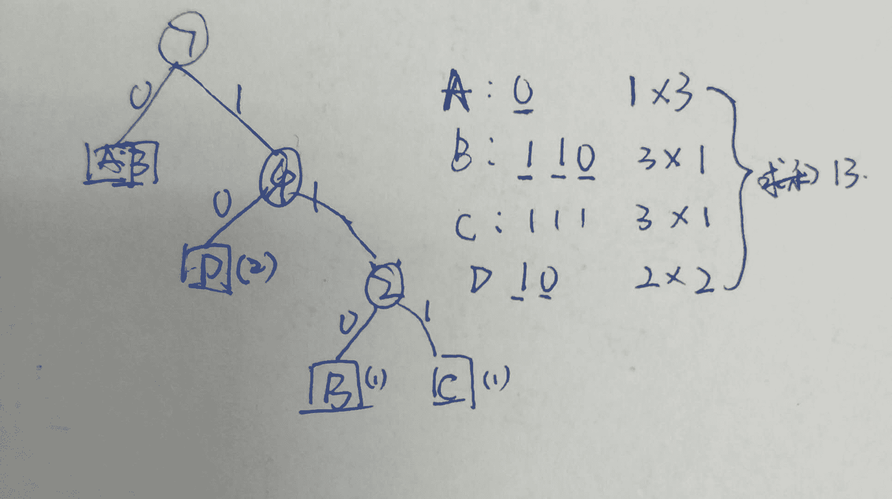

# 爱奇艺 2018 秋季校招 C 工程师（第一场）

## 1

当分配给一个进程的页面数增加时，页故障数可能增大也可能变小，下述算法符合这种情况的是

正确答案: A   你的答案: 空 (错误)

```cpp
FIFO 算法
```

```cpp
LRU 算法
```

```cpp
Clock 算法
```

```cpp
LFU 算法
```

本题知识点

C++工程师 爱奇艺 2018

讨论

[里予](https://www.nowcoder.com/profile/8152355)

  此题的题意是：在页面置换算法中，哪一种算法随着给定页面数的增加，缺页中断次数有可能还会增加或者减小。FiFo 算法就是先进先出，最先调入的页面，在页面数满，并且发生缺页时，就置换出最早调入的。LRu 算法就是替换最长未使用的页面。clock 算法是 lru 算法的优化。

发表于 2018-09-14 10:47:21

* * *

[hey,20180424](https://www.nowcoder.com/profile/5886477)

这个题之前牛客网也有，看到有一个说法是这是 FIFO 算法独有的 Belady 异常现象，也就是如果对一个进程未分配他所要求的全部页面，有时就会出现分配的页面增多但缺页率反而提高的异常现象。因为 FIFO 算法的置换特征与进程访问内存的动态特征是矛盾的，置换出的页面并没有不被访问的特点，只是按照先进先出的原则。

发表于 2018-10-06 19:27:15

* * *

## 2

在 Linux 系统中哪个程序是特定的时间上安排特定的作业或者程序的运行？

正确答案: D   你的答案: 空 (错误)

```cpp
vi
```

```cpp
Outlook
```

```cpp
Scheduler
```

```cpp
cron
```

本题知识点

C++工程师 爱奇艺 2018

讨论

[Tsy_](https://www.nowcoder.com/profile/3026978)

da, 文档编辑 b， 邮件 c ， 好像是 io 调度 d，计划任务的守护进程

发表于 2018-01-12 15:12:13

* * *

## 3

下面代码的输出结果是什么 (      )

```cpp
#include <iostream>
using namespace std;
class A
{   
    public: void virtual f() 
    {       
        cout << "A" << " ";
    }
};
class B : public A
{   
    public: void virtual f()
    {       
        cout << "B" << " ";
    }
};
int main(){
    A *pa = new A();
    pa->f();
    B *pb=(B *)pa;
    pb->f();    
    delete pa, pb;
    pa=new B();
    pa->f();
    pb=(B *)pa;
    pb->f();
    return 0;
}
```

正确答案: C   你的答案: 空 (错误)

```cpp
A A B A
```

```cpp
A B B A
```

```cpp
A A B B
```

```cpp
A A A B
```

本题知识点

C++工程师 爱奇艺 2018 C++

讨论

[Deep_Blue](https://www.nowcoder.com/profile/6794293)

始终记住一点， 当类中含有虚函数的时候，创建该类的对象时，该对象的首地址即为虚函数表的地址，无论对该对象进行怎样的类型转换，该对象都只能访问自己的虚函数表

发表于 2018-09-15 09:10:02

* * *

[我要成为牛豪](https://www.nowcoder.com/profile/674866964)

前半半部分创建了一个 A 对象，无论指针怎么来回弄，指针类型表示可以“访问的量”（读取多大的数据罢了）对象是没变的

发表于 2020-11-05 17:22:54

* * *

[N 百香果](https://www.nowcoder.com/profile/417800485)

如果使用指向对象的引用或指针来调用虚方法，程序将使用为对象类型定义的方法，而不使用为引用或指针类型定义的方法。

发表于 2020-10-13 10:59:51

* * *

## 4

一个提供 NAT 服务的路由器在转发一个源 IP 地址为 10.0.0.1、目的 IP 地址为 131.12.1.1 的 IP 分组时，可能重写的 IP 分组首部字段是Ⅰ.TTLⅡ.片偏移量Ⅲ.源 IP 地址Ⅳ.目的 IP 地址

正确答案: C   你的答案: 空 (错误)

```cpp
仅Ⅰ
```

```cpp
仅 I、Ⅱ
```

```cpp
仅Ⅰ、Ⅱ、III
```

```cpp
Ⅰ、Ⅱ、Ⅲ、Ⅳ
```

本题知识点

C++工程师 爱奇艺 2018

讨论

[里予](https://www.nowcoder.com/profile/8152355)

 答案是：TTL、片偏移量和源 IP 地址。

    在路由器的分组转发过程中，间接转发时，源 IP 地址随着路由器的变化在不停变化，生存时间（TTL）每跳过一个路由器减 1，片偏移量和偏移标志、首部检验和也可能发生变化。但目的 IP 地址始终不会变化。

发表于 2018-09-14 10:49:53

* * *

## 5

sql 中，可以用来替换 DISTINCT 的语句是（ ）

正确答案: B   你的答案: 空 (错误)

```cpp
ORDER BY
```

```cpp
GROUP BY
```

```cpp
DESC
```

```cpp
HAVING
```

本题知识点

C++工程师 爱奇艺 2018

讨论

[里予](https://www.nowcoder.com/profile/8152355)

 答案是：GROUP BY

DISTINCT 关键字是去重的意思。 

select 姓名 from 表名 group by 姓名 = select distinct 姓名 from 表名

发表于 2018-09-14 10:55:15

* * *

## 6

在 32 位计算机中，下面输出是多少（  ）

```cpp
#include <iostream>
using namespace std;
typedef enum
{
	Char ,
	Short,
	Int,
	Double,
	Float,
}TEST_TYPE;
int main() {
	TEST_TYPE val;
	cout<< sizeof(val)<<endl;
        return 0;
}
```

正确答案: B   你的答案: 空 (错误)

```cpp
5
```

```cpp
4
```

```cpp
8
```

```cpp
12
```

本题知识点

C++工程师 爱奇艺 2018 C++

讨论

[里予](https://www.nowcoder.com/profile/8152355)

 struct 结构体变量大小等于结构体中的各个成员变量所占内存大小总和，union 共用体变量大小等于共用体结构中占用内存最大的成员的内存大小。

首先先明白概念：
数据类型，指固定内存大小的别名，如 int 类型为 4 个字节内存。
变量，一段连续存储空间的别名。这段连续存储空间的大小，即变量的大小，由定义该变量的数据类型决定，即该数据类型代表的固定内存大小。数据类型，是变量的模板。

应用到枚举上：
枚举类型，指一个被命名的整型常数的集合。即枚举类型，本质上是一组常数的集合体，只是这些常数有各自的命名。枚举类型，是一种用户自定义数据类型。
枚举变量，由枚举类型定义的变量。枚举变量的大小，即枚举类型所占内存的大小。由于枚举变量的赋值，一次只能存放枚举结构中的某个常数。所以枚举变量的大小，实质是常数所占内存空间的大小（常数为 int 类型，当前主流的编译器中一般是 32 位机器和 64 位机器中 int 型都是 4 个字节），枚举类型所占内存大小也是这样。
另外，可以用编译器内置的指示符 sizeof，计算出枚举变量（或枚举类型）的大小进行验证。

发表于 2018-09-14 11:13:11

* * *

[hey,20180424](https://www.nowcoder.com/profile/5886477)

这里的陷阱是 枚举列表里的 char, int, float 都只是枚举变量名，实际上系统默认给枚举类型的都会隐式的转为 int 值，所以会输出 4\. 如果改一下代码， TEST_TYPE val = Double; cout<<sizeof(val)<<endl<<val<<endl;会输出 4（即枚举类型 int 的字节数）和 3 （val 本身的值，因为赋值从 0 开始，Float 是 3）

发表于 2018-10-06 19:40:56

* * *

[梦醒时夜续](https://www.nowcoder.com/profile/3698129)

枚举类型，本质上是一组常数的集合体，由于枚举变量的赋值，一次只能存放枚举结构中的某个常数。所以枚举变量的大小，实质是常数所占内存空间的大小（常数为 int 类型，当前主流的编译器中一般是 32 位机器和 64 位机器中 int 型都是 4 个字节）

发表于 2017-12-08 09:39:17

* * *

## 7

以下程序中，当输入 6 个字符后，容器的当前大小(size)是多少（）

```cpp
int main()
{
    vector<char> vec;
    vec.reserve(1024);
    string tmp;
    cin >> tmp;
    string::iterator it = tmp.begin();
    for(; it!=tmp.end(); it++)
    {
	vec.push_back(*it);
    }
    vec.resize(vec.size() +vec.size()/2);
    return 0;
}
```

正确答案: B   你的答案: 空 (错误)

```cpp
6
```

```cpp
9
```

```cpp
1024
```

```cpp
1536
```

本题知识点

C++工程师 爱奇艺 2018 C++

讨论

[Battlefiled](https://www.nowcoder.com/profile/3592610)

来自于百度知道:resize()，设置大小（size）;reserve()，设置容量（capacity）;
size()是分配容器的内存大小，而 capacity()只是设置容器容量大小，但并没有真正分配内存。
打个比方：正在建造的一辆公交车，车里面可以设置 40 个座椅（reserve(40);），这是它的容量，但并不是说它里面就有了 40 个座椅，只能说明这部车内部空间大小可以放得下 40 张座椅而已。而车里面安装了 40 个座椅(resize(40);)，这个时候车里面才真正有了 40 个座椅，这些座椅就可以使用了。

发表于 2018-09-15 09:48:18

* * *

[hey,20180424](https://www.nowcoder.com/profile/5886477)

这个题需要注意的就是 reserve 和 resize 这两个函数的作用，reserve 改变的是容量 capacity，resize 改变的是 size，所以一开始设置了容量为 1024，这时新创建的 vec 的 size 是 0，当输入 6 个字符后，capacity=1024,size=6, 后来 resize 变成了 1.5 倍，所以是 9

发表于 2018-10-06 20:36:29

* * *

## 8

对于字符串"ABCDADA"的二进制哈夫曼编码有多少位?

正确答案: C   你的答案: 空 (错误)

```cpp
11
```

```cpp
12
```

```cpp
13
```

```cpp
14
```

本题知识点

C++工程师 爱奇艺 2018

讨论

[牛客 7426272 号](https://www.nowcoder.com/profile/7426272)

频率 A:3 B:1 C:1 D:2

发表于 2018-04-19 11:13:36

* * *

[里予](https://www.nowcoder.com/profile/8152355)

构造哈夫曼树的过程：第一步：按权重从小到大排序。
第二步：选最小两个数画出一个树之后一直重复第一、第二步：排序然后取两个最小值。实际就是一个递归过程一般的，设需要编码的字符集为{d1,d2,…,dn}，各个字符在电文中出现的次数或频率集合为{w1,w2,…,wn}，以 d1,d2,…dn 作为叶子结点，以 w1,w2,…wn 作为相应叶子结点的权值来构造一棵赫夫曼树。规定赫夫曼树的左分支代表 0，右分支代表 1，则从根节点到叶子节点所经过的路径分支组成的 0 和 1 的序列便为该结点对应字符的编码，这就是赫夫曼编码。哈夫曼编码的过程：按照出现频率从小到大排序选择最小两个数画出一个树之后一直重复第一、第二步：排序然后取两个最小值。实际就是一个递归过程将权值左分支改为 0，右分支改为 1 后的哈夫曼树。

发表于 2018-09-14 11:41:43

* * *

[梦醒时夜续](https://www.nowcoder.com/profile/3698129)

A 的频率为 3/7，B 的频率为 1/7，C 的频率为 2/7，D 的频率为 2/7，利用哈夫曼算法构造哈夫曼树，得到 A 的编码为 1，B 的编码为 00，C 的编码为 010，D 的编码为 111，所以最终编码长度为 13 位

发表于 2017-12-08 09:42:26

* * *

## 9

下面关于选择排序说法正确的是()

正确答案: D   你的答案: 空 (错误)

```cpp
每扫描一遍数组，需要多次交换
```

```cpp
选择排序是稳定的排序方法,因为时间复杂度是固定的 O（n²）
```

```cpp
选择排序排序速度一般要比冒泡排序快
```

```cpp
空间复杂度为 O（1）
```

本题知识点

C++工程师 爱奇艺 2018

讨论

[diwuyer](https://www.nowcoder.com/profile/911706559)

选 d 啊

编辑于 2018-09-14 21:44:06

* * *

[里予](https://www.nowcoder.com/profile/8152355)

选择排序：比如在一个长度为 N 的无序数组中，在第一趟遍历 N 个数据，找出其中最小的数值与第一个元素交换，第二趟遍历剩下的 N-1 个数据，找出其中最小的数值与第二个元素交换......第 N-1 趟遍历剩下的 2 个数据，找出其中最小的数值与第 N-1 个元素交换，至此选择排序完成。
平均时间复杂度：O(n²)

空间复杂度：O(1)  (用于交换和记录索引)

稳定性：不稳定 （比如序列【5， 5， 3】第一趟就将第一个[5]与[3]交换，导致第一个 5 挪动到第二个 5 后面）

发表于 2018-09-14 20:34:34

* * *

## 10

牛牛有一些排成一行的正方形。每个正方形已经被染成红色或者绿色。牛牛现在可以选择任意一个正方形然后用这两种颜色的任意一种进行染色，这个正方形的颜色将会被覆盖。牛牛的目标是在完成染色之后，每个红色 R 都比每个绿色 G 距离最左侧近。牛牛想知道他最少需要涂染几个正方形。
如样例所示: s = RGRGR
我们涂染之后变成 RRRGG 或 RRRRR 就满足要求了，涂染的个数都为 2，没有涂染个数更少的方案了。

本题知识点

动态规划 贪心 字符串 *穷举 C++工程师 爱奇艺 2018* *讨论

[为什么不问问神奇海螺呢](https://www.nowcoder.com/profile/6527132)

= = 快结束的时候灵光一闪，好 zz 直接枚举前面有多少个'R'就完事了= =O(50*50)

```cpp
#include <bits/stdc++.h>
using namespace std;
typedef long long ll;

string s;

int work(string t){
    int ans=0;
    for(int i=0;i<(int)t.size();i++){
        if(s[i]!=t[i])  ans++;
    }
    return ans;
}

int main(void){
    cin >> s;
    int ans=INT_MAX;
    for(int cntR=0;cntR<=(int)s.size();cntR++){
        string t="";
        for(int i=1;i<=cntR;i++) t+='R';
        for(int i=1;i<=(int)s.size()-cntR;i++) t+='G';
        ans=min(ans,work(t));
    }
    cout << ans << endl;

    return 0;
}

```

发表于 2018-11-21 20:06:54

* * *

[hey,20180424](https://www.nowcoder.com/profile/5886477)

这个题感觉比后面两个要难想一点，是看了一下网上的解法，自己实现的。大体思路是 设置两个数组分别代表每一位上的左和右需要做多少改变，比如 RGRGR 中的最中间的 R 其实如果左边都是 R 右边都是 G 那这个位置上是 R 还是 G 是无所谓的，那么 left[2]和 right[2]都是 1，也就是等于在第二位（左边从 0 开始计数）时，左边需要改动 1 位，右边也需要改动 1 位，那么这个位置就需要改动 1+1=2 位，分别算出每一位上左右两边需要改动之和，找和的最小值即可。下面附上代码 菜鸟写的 不好请见谅。 #include<iostream>
#include<string>
using namespace std;

int main() {
    string s;
    cin >> s;
    int len = s.size();
    int* left = new int[len];
    int* right = new int[len];
    left[0] = right[len-1] = 0;
    for (int i = 1; i <= len-1; ++i) 
        left[i] = left[i - 1] + (s[i - 1] == 'G' ? 1 : 0);
    for (int i = len - 2; i >= 0; --i)
        right[i] = right[i + 1] + (s[i + 1] == 'R' ? 1 : 0);
    int min=100000000;
    for (int i = 0; i < len; ++i) {
        int sum = left[i] + right[i];
        if (sum < min)
            min = sum;
    }
    cout << min << endl;
    return 0;
}

发表于 2018-10-06 22:05:52

* * *

[牛客 616241267 号](https://www.nowcoder.com/profile/616241267)

```cpp
int main() {
    string s;
    cin >> s;

    int green = 0, red = 0;

    for (char c : s) {
        if (c == 'R') red++;
    }

    int count = red;

    for (char c : s) {
        if (c == 'R') red--;
        else green++;
        count = min(count, red + green);
    }

    cout << count;

    return 0;
}
```

发表于 2022-03-11 20:44:12

* * *

## 11

牛牛养了 n 只奶牛,牛牛想给每只奶牛编号,这样就可以轻而易举地分辨它们了。 每个奶牛对于数字都有自己的喜好,第 i 只奶牛想要一个 1 和 x[i]之间的整数(其中包含 1 和 x[i])。
牛牛需要满足所有奶牛的喜好,请帮助牛牛计算牛牛有多少种给奶牛编号的方法,输出符合要求的编号方法总数。

本题知识点

贪心 排序 *数学 C++工程师 爱奇艺 2018* *讨论

[黄汉韬](https://www.nowcoder.com/profile/7252447)

```cpp
#include <bits/stdc++.h>

using namespace std;

int main(int argc, char const *argv[])
{
    int cow_nums;
    cin >> cow_nums;
    int x[cow_nums];
    for (int i = 0; i < cow_nums; ++i) {
        cin >> x[i];
    }

    sort(x, x + cow_nums);

    long long res = 1;

    for (int i = 0; i < cow_nums; ++i) {
        res *= (x[i] - i);
        res %= 1000000007;
    }

    cout << res;
} 
```

发表于 2017-12-03 14:18:14

* * *

[阿汤酱](https://www.nowcoder.com/profile/160347976)

```cpp
#include <iostream>
#include <vector>

using namespace std;

int main(){
    int num_niu;
    unsigned long long num_name = 1;
    vector<int> niu;
    int temp1;
    cin >> num_niu;
    for(int i = 0; i<num_niu; i++){
        int temp;
        cin >> temp;
        niu.push_back(temp);
    }
    for(int i = 0; i < niu.size(); i++)
        for(int j = i; j < niu.size(); j++){
            if(niu[i] > niu[j]){ temp1 = niu[j]; niu[j] = niu[i];
                               niu[i] = temp1;}
        }
    int flag = 0;
    for (int i = 0; i < niu.size(); i++){
        if (i == 0) num_name *= niu[i];
        else num_name *= (niu[i] - (++flag));
        num_name %= 1000000007;            //最终死在这步上，不能最后取模，会溢出
    }
    cout << num_name;
    return 0;
}

```

编辑于 2018-10-06 11:00:57

* * *

[里予](https://www.nowcoder.com/profile/8152355)

#include <iostream>#include<vector>
#include<algorithm>

using namespace std;

int main()
{
    int n;
    while(cin >> n)
    {
        vector<int> vec(n, 0);
        for(int i=0; i<n; ++i)
            cin >> vec[i];
        sort(vec.begin(), vec.end());
        long long sum = 1;
        for(int i=0; i<n; ++i)
        {
            sum *= (vec[i]-i);
            sum %= 1000000007;
        }
        cout << sum << endl;
    }
    return 0;
}

编辑于 2018-09-14 21:58:23

* * *

## 12

如果一个数字满足以下条件,我们就称它为奇异数:
1、这个数字至少有两位
2、这个数的最低两位是相同的
比如: 1488 是一个奇异数,而 3、112 不是。
牛牛现在给出一个一个区间[L,R],让你计算出在区间内有多少个奇异数

本题知识点

模拟 数学 动态规划 C++工程师 爱奇艺 2018

讨论

[a254476321](https://www.nowcoder.com/profile/9800803)

```cpp
//利用 0 ~ R 之间的数量与 0 ~ L-1 之间的数量做差 
/* 
    0 ~ n 之间的数量比较容易算， 
    n/100*10 ： 比如说 1314，就是 1300 之前的奇异数的个数，
    n%100/11+1 : 就是上面的 14 以内的奇异数的个数，
    这样算的话其实 0 也算，不过在做减法的时候消掉了
*/
#include<stdio.h>
int main()
{
    long L, R;
    scanf("%ld%ld", &L, &R);
    printf("%ld", (R / 100 - L / 100) * 10 + R % 100 / 11 - (L - 1) % 100 / 11);
      //前面的 L 忘记减 1，可能没测试那个的用例所以 AC 了.(比如[100,100])
    return 0;
}

```

编辑于 2017-12-07 16:48:13

* * *

[hey,20180424](https://www.nowcoder.com/profile/5886477)

在网上看到了一种思路觉得不错，自己实现了一下，与君共勉。可以把区间 [L,R] 看成 [1,R] - [1, L-1]  算从 1 开始的区间是比较容易的，算出来一减就行了。#include<iostream>
using namespace std;

long long totalNum(long long num) {
    long long result=0;
    if (num < 11)
        return result;
    else if (num < 100)
        return num / 11;
    else
    {
        //int small = num % 100;
        //long long large = num / 100;
        //result += large * 10 - 1;
        //result += small / 11 + 1;
        //return result;        //上面的是为了让大家看懂，实现的时候一行代码就可以了
        return (num / 100 * 10 - 1) + (num % 100 / 11 + 1);
    }
}
int main() {
    long long left, right;
    cin >> left >> right;
    long long leftNum = totalNum(left-1);
    long long rightNum = totalNum(right);
    cout << rightNum - leftNum << endl;
    return 0;

}

发表于 2018-10-06 21:25:50

* * *

[为什么不问问神奇海螺呢](https://www.nowcoder.com/profile/6527132)

提供一种数位 DP 的做法吧。

```cpp

	#include <bits/stdc++.h>

	usingnamespacestd;

	typedeflonglongll;

	constintMAX_N=2e5+5;

	ll dp[30][10];

	inta[30];

	intres[30];

	ll n,m;

	inttpos;

	ll dfs(intpos,intpre,boollead,boollimit){///最高位,前一位,前导零,是否限制

	    if(pos==-1){

	//        if(tpos==3&&res[1]==0&&res[0]==0&&res[2]==1)   cout <<"GOOD" << endl;

	        intcnt0=0;

	        for(inti=tpos-1;i>=0;i--){

	            if(res[i]==0) cnt0++;

	            else   break;

	        }

	//        for(int i=tpos-1;i>=0;i--)    printf("%d",res[i]);

	//        cout << endl;

	//        cout << "cnt0="<<cnt0 << endl;

	//        cout <<"tpos-cnt0="<<tpos-cnt0<<endl;

	//        cout <<"*********"<<endl;

	        if(tpos-cnt0<2) return0;

	        return(res[0]==res[1]);

	    }

	    if(!limit && !lead && dp[pos][pre]!=-1) returndp[pos][pre];

	    intup=limit?a[pos]:9;

	    ll ans=0;

	    for(inti=0;i<=up;i++){

	//        if(pos==tpos&&i==0) continue;

	//        if(tpos==3&&pos==0&&i==0 &&res[1]==0&& res[2]==1)   cout <<"GOOD" << endl;

	        res[pos]=i;

	        ans+=dfs(pos-1,i,lead&&i==0,limit&&i==a[pos]);

	    }

	    if(!limit && !lead) dp[pos][pre]=ans;

	    returnans;

	}

	ll solve(ll t){

	    if(t<=10)    return0;

	    intpos=0;

	    while(t){

	        a[pos++]=t%10;

	        t/=10;

	    }

	    tpos=pos;

	//    cout <<"pos=" << pos <<endl;

	    returndfs(pos-1,-500,true,true);

	    ///最高位,前一位,前导零,是否限制

	}

	intmain(void){

	    cin>>n>>m;

	//    cin >> m ;

	//cout << n <<" "<<m<<endl;

	    memset(dp,-1,sizeof(dp));

	//    cout << solve(m) << endl;

	//    cout << solve(n-1) << endl;

	    printf("%lld\n",solve(m)-solve(n-1));

```

发表于 2018-11-21 20:11:18

* * *

## 13

设置 tcp 的哪个 socket 参数会影响了 nagle 算法？

正确答案: D   你的答案: 空 (错误)

```cpp
TCP_MAXSEG
```

```cpp
TCP_KEEPALIVE
```

```cpp
TCP_SYNCNT
```

```cpp
TCP_NODELAY
```

本题知识点

C++工程师 爱奇艺 2018

讨论

[里予](https://www.nowcoder.com/profile/8152355)

TCP_NODELAY：默认情况下，发送数据采用 Negale 算法。这样虽然提高了网络吞吐量，但是实时性却降低了，在一些交互性很强的应用程序来说是不允许的，使用 TCP_NODELAY 选项可以禁止 Negale 算法。此时，应用程序向内核递交的每个数据包都会立即发送出去。需要注意的是，虽然禁止了 Negale 算法，但网络的传输仍然受到 TCP 确认延迟机制的影响。

发表于 2018-09-14 22:08:14

* * *</iostream>**