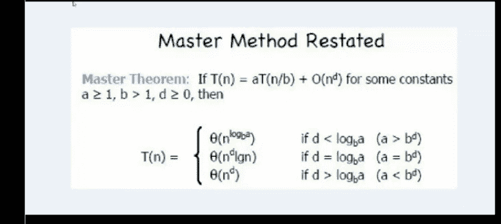

# 爱奇艺 2018 秋季校招 C 工程师（第二场）

## 1

下列 SQL 语句用法错误的是（      ）

正确答案: C   你的答案: 空 (错误)

```cpp
delete from table-name where null=null
```

```cpp
truncate table table-name
```

```cpp
alter table table-name add column id int
```

```cpp
select * from table-name where 3&gt;4
```

本题知识点

C++工程师 爱奇艺 2018

讨论

[周爱辉](https://www.nowcoder.com/profile/3788358)

这答案怎么可能是 C 呢。经常写 sql 脚本的表示很懵逼，特地拿 mariadb 试了下，表示这句话非常对。MariaDB [cdcasdb]> alter table card add column id2 int;
Query OK, 0 rows affected (0.31 sec)
Records: 0  Duplicates: 0  Warnings: 0

发表于 2017-12-12 22:30:56

* * *

[绅蓝](https://www.nowcoder.com/profile/1596072)

A 选项 null=null 是什么用法 应该是 delete from tablename where name is null 吧;

发表于 2019-02-25 09:23:45

* * *

## 2

有如下的函数定义：

```cpp
int Xfun(int *a, int n){
int x=*a;
for(int *pa=a+1; pa<a+n;pa++)
    if(*pa>x) 
        x=*pa;
    return x;
}
```

若执行了语句

int x[5]={23,46,78,55,16};
后，通过表达式 Xfun(x,5)调用该函数，则得到的返回值为（      ）

正确答案: B   你的答案: 空 (错误)

```cpp
55
```

```cpp
78
```

```cpp
23
```

```cpp
16
```

本题知识点

C++工程师 爱奇艺 2018

讨论

[牛客 7838654 号](https://www.nowcoder.com/profile/7838654)

这道题实际就是利用指针偏移来寻找数组的最大值

发表于 2017-12-13 23:22:14

* * *

## 3

在一个 C 类地址段内，需要将网络划分为 7 个子网，每个子网有 15 个主机，则将使用哪个子网掩码 （）

正确答案: A   你的答案: 空 (错误)

```cpp
255.255.255.224
```

```cpp
255.255.224
```

```cpp
255.255.255.240
```

```cpp
都不是
```

本题知识点

C++工程师 爱奇艺 2018

讨论

[绅蓝](https://www.nowcoder.com/profile/1596072)

A.划分 7 个子网，需要子网位 3 位，掩码是 255.255.255.1110 0000,也就是 255.255.255.224.0
每个子网最多主机数是 2⁵-2=30>15,足以容纳 15 个主机。

发表于 2019-02-25 09:14:46

* * *

## 4

以下选项中可能发生隐式类型转换的是（）

正确答案: B   你的答案: 空 (错误)

```cpp
long 到 int
```

```cpp
int 到 float
```

```cpp
int 到 char
```

```cpp
unsigned int 到 int
```

本题知识点

C++工程师 爱奇艺 2018

讨论

[为什么不问问神奇海螺呢](https://www.nowcoder.com/profile/6527132)

当小范围 → 大范围 就会发生隐式转换

发表于 2018-11-22 09:56:14

* * *

## 5

以下函数调用会选择哪个重载函数（）
func(1,2);

正确答案: B   你的答案: 空 (错误)

```cpp
int func(int a)
```

```cpp
int func(int a, char b);
```

```cpp
int func(int a, float b);
```

```cpp
int func(int a, char *b);
```

本题知识点

C++工程师 爱奇艺 2018

讨论

[为什么不问问神奇海螺呢](https://www.nowcoder.com/profile/6527132)

并非无意义。C++ Primer Plus（第六版中文版），P290 中写有，当遇到重载函数的时候，编译器如何选择？

*   完全匹配
*   提升转换(char,short → int,float→double)
*   标准转换(int → char , long → double)
*   用户定义的转换

发表于 2018-11-22 09:59:50

* * *

[周爱辉](https://www.nowcoder.com/profile/3788358)

这种题出的最没意义，完全取决于编译器。如果用 vs2017 编译，编译器直接编译不通过，不明确的调用。

发表于 2017-12-12 22:32:35

* * *

## 6

Linux 下哪个命令可以用于判断 host1 主机是否能够访问 host2 主机的端口

正确答案: C   你的答案: 空 (错误)

```cpp
ping
```

```cpp
ifconfig
```

```cpp
telnet
```

```cpp
netstat
```

本题知识点

C++工程师 爱奇艺 2018

讨论

[绅蓝](https://www.nowcoder.com/profile/1596072)

**ping 用来检查网络是否通畅或者网络连接速度的命令** 
**telnet 是用来探测指定 ip 是否开放指定端口**

发表于 2019-02-25 09:37:03

* * *

## 7

以下关于操作系统，说法错误的是（）

正确答案: B   你的答案: 空 (错误)

```cpp
用管程实现进程同步时，管程中的过程是不可中断的
```

```cpp
多道程序的执行失去了封闭性和再现性，因此多道程序系统不需要封闭性和再现性
```

```cpp
使用 SPOOLING 技术可以实现虚拟设备
```

```cpp
当 CPU 处于管态时，它可以执行计算机系统中的全部指令
```

本题知识点

C++工程师 爱奇艺 2018

讨论

[Ftion](https://www.nowcoder.com/profile/687263646)

C,
**封闭性：**指的是程序一但开始执行，其计算结果就取决于程序本身，不受外界因素影响。**可再现性：**是指当程序重复执行多次时，必将得到相同结果。**事实：**程序并发执行的时候可能失去封闭性和可再现性（即 一个多道程序可能具有封闭性和可再现性）任何程序都需要封闭性和可再性

发表于 2020-03-13 21:23:20

* * *

## 8

有一个算法的递推关系式为：T(n) = 9 T(n / 3) + n，则该算法的时间复杂度为（）(^符号是幂的意思)

正确答案: D   你的答案: 空 (错误)

```cpp
O(n³)
```

```cpp
O(nlogn)
```

```cpp
O(n)
```

```cpp
O(n²)
```

本题知识点

C++工程师 爱奇艺 2018

讨论

[guxinglei15](https://www.nowcoder.com/profile/7264682)



发表于 2018-03-19 00:41:53

* * *

## 9

由下面 5 个点:1,1,2,3,5 构成的哈夫曼树的带权路径长度为（）

正确答案: C   你的答案: 空 (错误)

```cpp
23
```

```cpp
24
```

```cpp
25
```

```cpp
26
```

本题知识点

C++工程师 爱奇艺 2018

讨论

[自从一股逆风袭来，我已能](https://www.nowcoder.com/profile/4946588)

树的带权路径长度=求和(叶子结点权值*对应层数) 根为第 0 层

发表于 2018-09-15 09:55:09

* * *

## 10

如果一个整数只能被 1 和自己整除,就称这个数是素数。
如果一个数正着反着都是一样,就称为这个数是回文数。例如:6, 66, 606, 6666
如果一个数字既是素数也是回文数,就称这个数是回文素数
牛牛现在给定一个区间[L, R],希望你能求出在这个区间内有多少个回文素数。

本题知识点

模拟 数学 穷举 C++工程师 爱奇艺 2018

讨论

[我要 offer 啊](https://www.nowcoder.com/profile/5484352)

求解答？为什么在本地可以通过，在牛客只能通过百分之 70\.  1,9 这个例子无法通过，但是本地是对的。#include<bits/stdc++.h>
using namespace std;

bool isshu(int n)
{
   if(n==1)
       return true;
    for(int i=2;i*i<=n;i++)
    {
        if(n%i==0)
            return false;

    }
    return true;
}
bool huiwen(int n)
{
   int newnum=0;
    int tem=n;
    while(n>0)
    {
        newnum=newnum*10+n%10;
        n=n/10;
    }
    return tem==newnum?true:false;
}

int main()
{
    int L,R;
    cin>>L>>R;
    int count=0;
    for(int i=L;i<=R;i++)
    {
        if(huiwen(i)&&isshu(i))
        {
         count++;
        }
    }
    cout<<count<<endl;

    return 0;
}

发表于 2018-08-15 21:02:25

* * *

[gk_0413](https://www.nowcoder.com/profile/5487801)

#include <iostream>#include <string>usingnamespacestd;boolis_hw(inti){        if(i<0|| (i!=0 &&i%10==0))            returnfalse;        intsum=0;        while(i>sum)        {            sum = sum*10+i%10;            i = i/10;        }        return(i==sum)||(i==sum/10);}boolis_ss(inti){    if(i==1)        returnfalse;    if(i==2)        returntrue;    for(intj=2;j<i-1;j++)    {        if(i%j==0)            returnfalse;        if(j==i)            returntrue;    }    return-1;}intmain (){    intL,R;    intnum(0);    cin>>L>>R;    for(inti=L;i<=R;i++)    {        if(is_hw(i))            if(is_ss(i))                {                num++;                }        continue;    }    cout<<num<<endl;    system("pause");}

发表于 2018-04-19 12:09:11

* * *

[牛客 6481049 号](https://www.nowcoder.com/profile/6481049)

```cpp
#include <iostream>
#include <string>
#include <sstream>
#include <math.h>

using namespace std;

inline bool isPrime(int n) {
    if(n <= 1)
        return false;
    int num = ::sqrt(n);
    for(int i = 2;i <= num;++i) {
        if(n % i == 0)
            return false;
    }
    return true;
}

inline bool isPlalindrome(int i) {
    string num_str;
    stringstream ss;
    ss << i;
    ss >> num_str;
    int len = num_str.size();
    for(int i = 0; i < len/2;++i) {
        if(num_str[i] != num_str[len - 1 - i])
            return false;
    }
    return true;
}

int getResult(int l,int r) {
    int count = 0;
    for(int i = l; i <= r;++i) {
        if(isPrime(i) && isPlalindrome(i)) {
            count++;
        }
    }
    return count;
}

int main() {
    int L,R;
    while(cin>>L>>R) {
        int count = getResult(L,R);
        cout<<count<<endl;
    }
}

```

编辑于 2018-04-13 19:49:02

* * *

## 11

牛牛和羊羊都很喜欢青草。今天他们决定玩青草游戏。
最初有一个装有 n 份青草的箱子,牛牛和羊羊依次进行,牛牛先开始。在每个回合中,每个玩家必须吃一些箱子中的青草,所吃的青草份数必须是 4 的 x 次幂,比如 1,4,16,64 等等。不能在箱子中吃到有效份数青草的玩家落败。假定牛牛和羊羊都是按照最佳方法进行游戏,请输出胜利者的名字。

本题知识点

模拟 数学 C++工程师 爱奇艺 2018

讨论

[ycybyby](https://www.nowcoder.com/profile/9014405)

[`blog.csdn.net/qq_28618765/article/details/78237081`](https://blog.csdn.net/qq_28618765/article/details/78237081)

发表于 2019-03-30 20:40:51

* * *

[为什么不问问神奇海螺呢](https://www.nowcoder.com/profile/6527132)

手写博弈树或者打 SG 函数表，找规律。原题在 HDU 上，2 的幂次

发表于 2018-11-22 10:03:25

* * *

[牛客 657454 号](https://www.nowcoder.com/profile/657454)

```cpp
//数学问题。。。
#include <iostream>
using namespace std;

int main()
{     int t;     cin >> t;     while (t--) {         int n;         cin >> n;         int f = n % 5;         switch (f) {         case 1:cout << "niu\n"; break;         case 2:cout << "yang\n"; break;         case 3:cout << "niu\n"; break;         case 4:cout << "niu\n"; break;         case 0:cout << "yang\n"; break;         }     }

}

```

发表于 2018-06-07 17:58:39

* * *

## 12

牛牛和羊羊非常无聊.他们有 n + m 个共同朋友,他们中有 n 个是无聊的,m 个是不无聊的。每个小时牛牛和羊羊随机选择两个不同的朋友 A 和 B.(如果存在多种可能的 pair(A, B),任意一个被选到的概率相同。),然后牛牛会和朋友 A 进行交谈,羊羊会和朋友 B 进行交谈。在交谈之后,如果被选择的朋友之前不是无聊会变得无聊。现在你需要计算让所有朋友变得无聊所需要的时间的期望值。

本题知识点

数学 C++工程师 爱奇艺 2018

## 13

若一颗二叉树的前序遍历为 a,b,c,d,后序遍历为 b,c,d,a,那么它的中序遍历为()

正确答案: E   你的答案: 空 (错误)

```cpp
b a c d
```

```cpp
b a d c
```

```cpp
a b c d
```

```cpp
a b d c
```

```cpp
不确定，因为不唯一
```

本题知识点

C++工程师 爱奇艺 2018

讨论

[牛客 _wilian](https://www.nowcoder.com/profile/8003775)

这里除了可以确定 a 是根节点之外，其他三个无法确定，bcd 中可以是 b 是 c 的左节点，c 是 d 的左节点；也可以是 b 是 d 的左节点，c 是 d 的右节点

发表于 2018-03-21 20:19:03

* * *

[mu_luo](https://www.nowcoder.com/profile/718022807)

我冥思苦想很久，着实觉得这根本不可能构造出一棵树。

[889\. 根据前序和后序遍历构造二叉树](https://leetcode-cn.com/problems/construct-binary-tree-from-preorder-and-postorder-traversal/)

测试用例：[1,2,3,4]
[2,3,4,1]

执行结果：执行出错 There should be at least one valid tree for the given input.这道题应该题错了好吧

发表于 2021-08-01 09:00:27

* * *