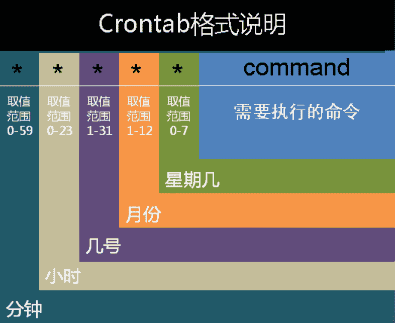

# 爱奇艺 2018 秋季校招 hadoop 工程师（第二场）

## 1

有个 exam 任务，打算采用 linux crontab，每 10 分钟运行一次，下面哪项正确？

正确答案: A   你的答案: 空 (错误)

```cpp
*/10 * * * * exam
```

```cpp
10/* * * * * exam
```

```cpp
* * */10 * * exam
```

```cpp
* */10 * * * exam
```

本题知识点

大数据开发工程师 爱奇艺 2018

讨论

[Mr_rsq](https://www.nowcoder.com/profile/9901318)

A：代表的是每隔 10 分钟运行一次 B：格式有误 C：每隔 10 天在那一天每分钟执行一次 D：每隔 10 小时在那一小时每分钟执行一次

发表于 2017-12-18 17:10:28

* * *

## 2

现有/root/testfile 文件，需要对该文件做一个 file 的软连接，下面正确的做法是

正确答案: A   你的答案: 空 (错误)

```cpp
ln -s /root/testfile file
```

```cpp
ln /root/testfile file
```

```cpp
ln -s file /root/testfile
```

```cpp
ln file /root/testfile
```

本题知识点

大数据开发工程师 爱奇艺 2018

讨论

[吴六一](https://www.nowcoder.com/profile/6606216)

源文件 到 目标文件

发表于 2021-07-29 09:14:22

* * *

## 3

以下关于 Hadoop 说法正确的是：

正确答案: C   你的答案: 空 (错误)

```cpp
Hadoop 支持数据的随机读写
```

```cpp
因为 HDFS 中采用了备份的机制， 所以不存在单点故障
```

```cpp
Hadoop 默认调度器策略为 FIFO
```

```cpp
NameNode 负责管理 metadata，client 端每次读写请求， NameNode 都需要从磁盘中读取或者写入 metadata 信息。
```

本题知识点

大数据开发工程师 爱奇艺 2018

讨论

[川 201805051052356](https://www.nowcoder.com/profile/2073430)

NameNode 不需要从磁盘读取 metadata，所有数据都在内存中，硬盘上的只是序列化的结果，只有每次 namenode 启动的时候才会读取。

发表于 2018-08-14 16:12:27

* * *

[CoffCode](https://www.nowcoder.com/profile/8314047)

Hadoop 默认调度器不是 Capacity Scheduler？

发表于 2020-11-12 20:46:13

* * *

## 4

以下函数调用会选择哪个重载函数（）
func(1,2);

正确答案: B   你的答案: 空 (错误)

```cpp
int func(int a)
```

```cpp
int func(int a, char b);
```

```cpp
int func(int a, float b);
```

```cpp
int func(int a, char *b);
```

本题知识点

大数据开发工程师 爱奇艺 2018

讨论

[牛客 819690348 号](https://www.nowcoder.com/profile/819690348)

为什么我的代码显示用的是 float？

发表于 2020-12-02 19:51:55

* * *

[不忘初心 6688](https://www.nowcoder.com/profile/519279307)

标准转换(int → char , long → double)

发表于 2019-09-02 16:31:52

* * *

## 5

以下哪个方法不是用于模型选择的

正确答案: D   你的答案: 空 (错误)

```cpp
交叉验证
```

```cpp
AIC
```

```cpp
BIC
```

```cpp
维特比算法
```

本题知识点

大数据开发工程师 爱奇艺 2018

## 6

关于以下目标函数说法错误的是：

 

正确答案: D   你的答案: 空 (错误)

```cpp
当λ为无穷大的时候， f(x)为线性函数
```

```cpp
当λ为 0， 则 f(x)为任意能完全拟合样本点的函数
```

```cpp
对于一般的λ而言，存在最优解，最优解为自然三次样条曲线（natural cubic spline）
```

```cpp
对于一般的λ而言， 存在最优解， f(x)为线性函数
```

本题知识点

大数据开发工程师 爱奇艺 2018

## 7

Linux 下哪个命令可以用于判断 host1 主机是否能够访问 host2 主机的端口

正确答案: C   你的答案: 空 (错误)

```cpp
ping
```

```cpp
ifconfig
```

```cpp
telnet
```

```cpp
netstat
```

本题知识点

大数据开发工程师 爱奇艺 2018

## 8

以下关于操作系统，说法错误的是（）

正确答案: B   你的答案: 空 (错误)

```cpp
用管程实现进程同步时，管程中的过程是不可中断的
```

```cpp
多道程序的执行失去了封闭性和再现性，因此多道程序系统不需要封闭性和再现性
```

```cpp
使用 SPOOLING 技术可以实现虚拟设备
```

```cpp
当 CPU 处于管态时，它可以执行计算机系统中的全部指令
```

本题知识点

大数据开发工程师 爱奇艺 2018

## 9

有一个算法的递推关系式为：T(n) = 9 T(n / 3) + n，则该算法的时间复杂度为（）(^符号是幂的意思)

正确答案: D   你的答案: 空 (错误)

```cpp
O(n³)
```

```cpp
O(nlogn)
```

```cpp
O(n)
```

```cpp
O(n²)
```

本题知识点

大数据开发工程师 爱奇艺 2018

## 10

由下面 5 个点:1,1,2,3,5 构成的哈夫曼树的带权路径长度为（）

正确答案: C   你的答案: 空 (错误)

```cpp
23
```

```cpp
24
```

```cpp
25
```

```cpp
26
```

本题知识点

大数据开发工程师 爱奇艺 2018

讨论

[五月烟雨](https://www.nowcoder.com/profile/536514070)

             根           1/  \1         根   **5**      2/    \2      根    **3**    3/  \3  根   **2**4/ \4**1  1**最终的树如上图，其权重从上依次往下为 1，2，3，4。5 所在的位置权重为 1，3 所在的权重为 2，2 所在的为 3，1 为 4。故最终结果为：1*4+1*4+2*3+3*2+5*1=25

发表于 2020-12-10 16:29:36

* * *

[Getter](https://www.nowcoder.com/profile/826649369)

```cpp
最终的树是：
           / \
          /\  5
         /\ 3
        /\ 2
       1 1
```

编辑于 2018-09-30 16:03:42

* * *

[月缘天星](https://www.nowcoder.com/profile/9438243)

1,1,2,3,52,2,3,54,3,57,512 带权路径长度=1*4+1*4+2*3+3*2+5*1=25

发表于 2017-12-08 20:21:21

* * *

## 11

牛牛和羊羊都很喜欢青草。今天他们决定玩青草游戏。
最初有一个装有 n 份青草的箱子,牛牛和羊羊依次进行,牛牛先开始。在每个回合中,每个玩家必须吃一些箱子中的青草,所吃的青草份数必须是 4 的 x 次幂,比如 1,4,16,64 等等。不能在箱子中吃到有效份数青草的玩家落败。假定牛牛和羊羊都是按照最佳方法进行游戏,请输出胜利者的名字。

本题知识点

模拟 数学 大数据开发工程师 爱奇艺 2018

讨论

[零葬](https://www.nowcoder.com/profile/75718849)

正常分析先枚举从 1 到 4 的情况

1.  牛牛直接吃了，niu
2.  牛牛吃一份草，羊羊吃了剩下的一份，yang
3.  牛牛吃一份草，羊羊也只能吃一份，剩下一份牛牛吃，niu
4.  牛牛吃 4 份草，niu

1~4 的时候只有 2 是羊羊赢，其他的都是牛牛赢，所以对于牛牛而言，如果此时有 n 份草摆在它面前，它可以从 1 开始尝试 n 以内的 4 的次幂：4,16,64,……。然后把剩下的草扔给羊羊，然后羊羊重复这个步骤。于是写了个递归版本如下：

```cpp
import java.io.BufferedReader;
import java.io.InputStreamReader;
import java.io.IOException;

public class Main {
    public static void main(String[] args) throws IOException {
        BufferedReader br = new BufferedReader(new InputStreamReader(System.in));
        int t = Integer.parseInt(br.readLine());
        for(int i = 0; i < t; i++){
            int n = Integer.parseInt(br.readLine());
            System.out.println(winner(n));
        }
    }

    private static String winner(int n) {
        if(n < 5) return n == 2? "yang": "niu";
        int base = 1;
        // 牛牛不断尝试 4 的次方
        while(base <= n){
            // 牛牛吃 base 份然后往下扔给羊羊
            if(winner(n - base).equals("yang")) return "niu";
            // 防止乘以 4 后溢出
            if(base > n / 4) break;
            base *= 4;
        }
        // 尝试了各种方案牛牛都没赢，则羊羊赢
        return "yang";
    }
}
```

结果第二个 case 上来就给我个上亿的数据量，直接导致栈溢出。没办法，只能用骚操作——打表法，先尝试一下 1~50 的情况，打印出了如下结果 1:niu
2:yang
3:niu
4:niu
5:yang
6:niu
7:yang
8:niu
9:niu
10:yang
11:niu
12:yang
13:niu
14:niu
15:yang
16:niu
17:yang
18:niu
19:niu
20:yang
21:niu
22:yang
23:niu
24:niu
25:yang
26:niu
27:yang
28:niu
29:niu
30:yang
31:niu
32:yang
33:niu
34:niu
35:yang
36:niu
37:yang
38:niu
39:niu
40:yang
41:niu
42:yang
43:niu
44:niu
45:yang
46:niu
47:yang
48:niu
49:niu
50:yang
得到规律：每 5 个就是一组 niu,yang,niu,niu,yang。所以改出一个复杂度为 O(1)的算法

```cpp
import java.io.BufferedReader;
import java.io.InputStreamReader;
import java.io.IOException;

public class Main {
    public static void main(String[] args) throws IOException {
        BufferedReader br = new BufferedReader(new InputStreamReader(System.in));
        int t = Integer.parseInt(br.readLine());
        for(int i = 0; i < t; i++){
            int n = Integer.parseInt(br.readLine());
            System.out.println(winner(n));
        }
    }

    private static String winner(int n) {
        return (n % 5 == 0 || n % 5 == 2)? "yang": "niu";
    }
}
```

像这种输入一个整数，输出也是一个整数的题目。左神表示大概 3~4 成的题目可以用这种方式找规律，刚开始不要纠结它的数学原理，只要这样暴力出来能 AC，再去通过数学的方式解释这个策略。

编辑于 2021-12-10 11:50:35

* * *

## 12

牛牛和羊羊非常无聊.他们有 n + m 个共同朋友,他们中有 n 个是无聊的,m 个是不无聊的。每个小时牛牛和羊羊随机选择两个不同的朋友 A 和 B.(如果存在多种可能的 pair(A, B),任意一个被选到的概率相同。),然后牛牛会和朋友 A 进行交谈,羊羊会和朋友 B 进行交谈。在交谈之后,如果被选择的朋友之前不是无聊会变得无聊。现在你需要计算让所有朋友变得无聊所需要的时间的期望值。

本题知识点

数学 大数据开发工程师 爱奇艺 2018

## 13

牛牛得到一个长度为 n 的整数序列 V,牛牛定义一段连续子序列的幸运值为这段子序列中最大值和次大值的异或值(次大值是严格的次大)。牛牛现在需要求出序列 V 的所有连续子序列中幸运值最大是多少。请你帮帮牛牛吧。

本题知识点

排序 *贪心 数组 分治 大数据开发工程师 爱奇艺 2018* *讨论

[xtims](https://www.nowcoder.com/profile/5277804)

针对每一个数，将其看作某连续子序列的次大值，这样就搜索了所有的可能性。找到最近的前后两个比其大的数作为最大值，求异或值。

```cpp
#include<iostream>
#include<vector>
#include<algorithm>
using namespace std;
vector<int> num;

int main()
{
    int n;
    cin>>n;
    for(int i=0;i<n;++i)
    {
        int tmp;
        cin>>tmp;
        num.push_back(tmp);
    }
    int res = 0;
    for(int i=0;i<n;++i)
    {
        for(int j=i-1;j>=0;--j)
        {
            //找到就 break，因为 num[i]作为次大值
            if(num[j] > num[i])
            {
                res = max(res,num[j]^num[i]);
                break;
            }
        }
        for(int j=i+1;j<n;++j)
        {
            if(num[j] > num[i])
            {
                res = max(res,num[j]^num[i]);
                break;
            }
        }
    }
    cout<<res<<endl;
    return 0;
}
```

编辑于 2019-08-27 22:00:38

* * *

[xxLilyxxZ](https://www.nowcoder.com/profile/1073498)

```cpp
#include <iostream>
(720)#include <stack>
#include <vector>
using namespace std;
stack<int> stk;
int LuckyOne(vector<int>& data,int n){
	int len=n;
	int maxv=0,tmp;
	for(int i=0;i<n;i++){
		if(stk.empty())
			stk.push(data[i]);
		else{
			int top;
			while(!stk.empty()&&(top=stk.top())){
				tmp=top^data[i];
				if(maxv<tmp)
					maxv=tmp;
				if(top>data[i])
					break;
				else
					stk.pop();
			}
			stk.push(data[i]);
		}
	}
	return maxv;
}
int main(){
	int n;
	cin>>n;
	vector<int> data(n,0);
	for(int i=0;i<n;i++)
		cin>>data[i];
	cout<<LuckyOne(data,n)<<endl;
}
```

发表于 2020-03-03 11:13:09

* * *

[重洋](https://www.nowcoder.com/profile/543034449)

```cpp
import java.util.*;

public class Main {

	public static void main(String[] args){
		Scanner sc = new Scanner(System.in);
        int n = sc.nextInt();
        int[] a=new int[n];
        for(int i=0;i<n;i++)
            a[i]=sc.nextInt();
        int max=0;
        int temp;
        for(int i=0;i<n;i++)
        {
            for(int j=i-1;j>=0;j--)
                if(a[j]>=a[i])
                {
                    temp=a[i]^a[j];
                    max=max>temp?max:temp;
                    break;
                }
            for(int j=i+1;j<n;j++)
                if(a[j]>=a[i])
                {
                    temp=a[i]^a[j];
                    max=max>temp?max:temp;
                    break;
                }
        }
        System.out.println(max);
	}

}

```

发表于 2019-08-30 23:34:43

* * *

## 14

Hadoop 的两大核心组成部分是什么？简要说明两大核心的体系结构？

你的答案

本题知识点

大数据开发工程师 爱奇艺 2018

讨论

[Mowar](https://www.nowcoder.com/profile/9730423)

hdfs:分布文件存储系统，有效的解决了分布式平台下文件分割问题；mapreduce 算法框架，为并行计算提供了可能。

发表于 2018-10-11 20:21:17

* * *

[陈苏航](https://www.nowcoder.com/profile/636134617)

t67t

发表于 2018-10-12 08:12:14

* * **