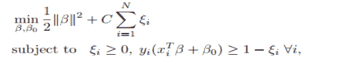

# 爱奇艺 2018 秋季校招 hadoop 工程师（第一场）

## 1

当分配给一个进程的页面数增加时，页故障数可能增大也可能变小，下述算法符合这种情况的是

正确答案: A   你的答案: 空 (错误)

```cpp
FIFO 算法
```

```cpp
LRU 算法
```

```cpp
Clock 算法
```

```cpp
LFU 算法
```

本题知识点

大数据开发工程师 爱奇艺 2018

讨论

[时柒 201911070951861](https://www.nowcoder.com/profile/646938309)

FIFo 为先进先出队列

发表于 2019-11-17 09:58:44

* * *

## 2

在深度学习网络中， 以下哪种技术不是主要用来做网络正则化的（提升模型泛化能力）

正确答案: D   你的答案: 空 (错误)

```cpp
dropout
```

```cpp
参数共享
```

```cpp
Early stopping
```

```cpp
Pooling
```

本题知识点

爱奇艺 2018 算法工程师

讨论

[亓国文](https://www.nowcoder.com/profile/2253660)

答案是 B，答案 D 是为了提升泛华能力的。在卷积神经网络中 conv 层是获取图像的特征点，而有事具有类似特征的图片的特征点的位置可能会有偏差，利用 pooling 层可以解决这个问题

编辑于 2018-04-04 23:10:21

* * *

[酱酱 20181026164121](https://www.nowcoder.com/profile/542229935)

可笑。应试教育又开始染指深度学习了？在招聘过程当中的笔试，原因是招聘主管不懂技术，只好让内部的工程师出试题。而内部工程师为了显摆技术，就把自己 N 年当中遇到过的奇葩问题让应聘者回答，而当年该工程师也许是花一个下午才解决了的。这是种不公平。招聘中应该鄙视笔试。

发表于 2018-10-26 16:46:43

* * *

## 3

查看系统内存如下：
    [@server ~]# free -g
    total used free shared buffers cached
    Mem: 15 5 9 0 0 2
    -/+ buffers/cache: 3 12
    Swap: 0 0 0
那么程序实际可使用内存有多少:

正确答案: C   你的答案: 空 (错误)

```cpp
9G
```

```cpp
11G
```

```cpp
12G
```

```cpp
21G
```

本题知识点

大数据开发工程师 爱奇艺 2018

讨论

[烟华。](https://www.nowcoder.com/profile/4618015)

15-5+2

发表于 2018-09-01 16:20:55

* * *

## 4

执行脚本 test.sh，将标准输出重定向到日志 logfile，错误输出重定向到 logerr 中，以下正确的是：

正确答案: A   你的答案: 空 (错误)

```cpp
sh test.sh 1&gt; logfile 2&gt; logerr
```

```cpp
sh test.sh 1&gt; logerr 2&gt; logfile
```

```cpp
sh test.sh &gt; logfile &gt; logerr
```

```cpp
sh test.sh 1&gt; logfile &gt; logerr
```

本题知识点

大数据开发工程师 爱奇艺 2018

讨论

[www_helloworld_cn](https://www.nowcoder.com/profile/8715563)

选 A
在 shell 中，每个进程都和三个系统文件相关联：标准输入 stdin，标准输出 stdout 和标准错误 stderr，三个系统文件的文件描述符分别为 0，1 和 2。
实际上， > 就相当于 1> 也就是重定向标准输出，不包括标准错误。通过 2>，就是标准错误输出，想重定向标准错误到文件中，则可以使用 2> file。

发表于 2018-03-12 10:23:24

* * *

## 5

在 32 位计算机中，下面输出是多少（  ）

```cpp
#include <iostream>
using namespace std;
typedef enum
{
	Char ,
	Short,
	Int,
	Double,
	Float,
}TEST_TYPE;
int main() {
	TEST_TYPE val;
	cout<< sizeof(val)<<endl;
        return 0;
}
```

正确答案: B   你的答案: 空 (错误)

```cpp
5
```

```cpp
4
```

```cpp
8
```

```cpp
12
```

本题知识点

大数据开发工程师 爱奇艺 2018

讨论

[提拉米不姓苏](https://www.nowcoder.com/profile/969259752)

enum 只是定义了一个常量集合，里面没有"元素”，枚举类型是当做 Int 来存储的，所以枚举类型的 sizeof 为 4。

发表于 2019-07-11 20:23:54

* * *

## 6

关于 hadoop 中通信说法正确的是

正确答案: A   你的答案: 空 (错误)

```cpp
client 和 namenode 之间是通过 rpc 通信
```

```cpp
datanode 和 namenode 之间是通过 socket 通信
```

```cpp
client 和 datanode 之间是通过简单的 rpc 通信
```

```cpp
datanode 和 client 之间不用通信
```

本题知识点

大数据开发工程师 爱奇艺 2018

讨论

[LukeCrazy](https://www.nowcoder.com/profile/9155373)

namenode 与 client 和 datanode 都是通过 rpc 通信，而 client 与 datanode 间通过简单的 socket 通信

发表于 2018-09-13 13:31:14

* * *

[牛客 388215282 号](https://www.nowcoder.com/profile/388215282)

A

发表于 2021-01-12 18:57:57

* * *

[先生你好](https://www.nowcoder.com/profile/4580747)

A

发表于 2018-01-29 00:59:47

* * *

## 7

SVM 的以下两种模型表达是等价的， 则其中的正则化系数λ和 C 的关系为：

形式一：

 

形式二： 

正确答案: B   你的答案: 空 (错误)

```cpp
λ=C
```

```cpp
λ=1/C
```

```cpp
λ=C 的平方
```

本题知识点

大数据开发工程师 爱奇艺 2018

## 8

若前缀表达式为-+a*b-cd/ef，后缀表达式为 abcd-*+ef/-，那么对应二叉树的中序遍历序列是（）

正确答案: B   你的答案: 空 (错误)

```cpp
a+c*d-b-e/f
```

```cpp
a+b*c-d-e/f
```

```cpp
a+b*d-c-e/f
```

```cpp
a+e*c-d-b/f
```

本题知识点

大数据开发工程师 爱奇艺 2018

讨论

[文以天](https://www.nowcoder.com/profile/545969104)

B 

发表于 2018-09-18 19:37:18

* * *

## 9

下面关于选择排序说法正确的是()

正确答案: D   你的答案: 空 (错误)

```cpp
每扫描一遍数组，需要多次交换
```

```cpp
选择排序是稳定的排序方法,因为时间复杂度是固定的 O（n²）
```

```cpp
选择排序排序速度一般要比冒泡排序快
```

```cpp
空间复杂度为 O（1）
```

本题知识点

大数据开发工程师 爱奇艺 2018

## 10

一个合法的括号匹配序列有以下定义:
1、空串""是一个合法的括号匹配序列
2、如果"X"和"Y"都是合法的括号匹配序列,"XY"也是一个合法的括号匹配序列
3、如果"X"是一个合法的括号匹配序列,那么"(X)"也是一个合法的括号匹配序列
4、每个合法的括号序列都可以由以上规则生成。
例如: "","()","()()","((()))"都是合法的括号序列
对于一个合法的括号序列我们又有以下定义它的深度:
1、空串""的深度是 0
2、如果字符串"X"的深度是 x,字符串"Y"的深度是 y,那么字符串"XY"的深度为 max(x,y) 3、如果"X"的深度是 x,那么字符串"(X)"的深度是 x+1
例如: "()()()"的深度是 1,"((()))"的深度是 3。牛牛现在给你一个合法的括号序列,需要你计算出其深度。

本题知识点

栈 *字符串 *递归 穷举 大数据开发工程师 爱奇艺 2018** **讨论

[Carmon](https://www.nowcoder.com/profile/161824700)

```cpp
//简单的模拟题
//深度即当前未匹配的左括号‘（’的个数
#include<cstdio>
#include<iostream>
#include<cstring>
using namespace std;
int main()
{
    string s;
    cin>>s;
    int depth=0;                             //储存最大深度
    int tot=0;                               //储存当前深度
    for(int i=0;i<s.length();i++)
    {
        if(s[i]=='(') tot++;             //左括号则当前深度+1
        else tot--;                       //右括号则减一
        depth=max(depth,tot);            //取深度最大值
    }
    cout<<depth;
    return 0;
}

```

发表于 2018-09-11 17:30:15

* * *

[又笨又懒不想上课](https://www.nowcoder.com/profile/56178608)

```cpp
import java.util.*;
public class Main {
    public static void main(String args[]) {
        Scanner in = new Scanner(System.in);
        String s = in.nextLine().trim();
        char[] chs = s.toCharArray();
        int res = 1;
        int cur = 0;
        for(int i = 0; i < chs.length - 1; i++) {
            if(chs[i] == '(') ++cur;
            else --cur;
            res = Math.max(res,cur);
        }
        System.out.println(res);
    }
}
```

发表于 2021-05-26 18:44:34

* * *

[焦俞棋](https://www.nowcoder.com/profile/540390991)

```cpp
a = input()
arr,ans = [],0
for i in a:
    if i == '(':
        arr.append('(')
        ans = max(ans, len(arr))
    else:
        arr.pop(-1)
print(ans)
```

发表于 2021-03-03 18:11:31

* * *

## 11

牛牛养了 n 只奶牛,牛牛想给每只奶牛编号,这样就可以轻而易举地分辨它们了。 每个奶牛对于数字都有自己的喜好,第 i 只奶牛想要一个 1 和 x[i]之间的整数(其中包含 1 和 x[i])。
牛牛需要满足所有奶牛的喜好,请帮助牛牛计算牛牛有多少种给奶牛编号的方法,输出符合要求的编号方法总数。

本题知识点

贪心 排序 *数学 大数据开发工程师 爱奇艺 2018* *讨论

[原点 16](https://www.nowcoder.com/profile/2661920)

#include <stdio.h>#include <limits.h>#include <algorithm>#include <iostream>#include <vector>usingnamespacestd;intmain(void){    intn,m;    scanf("%d",&n);    inta[100];    for(inti=1;i<=n;i++)    {        scanf("%d",&a[i]);    }    sort(a+1,a+n+1);    longlongk=1;    for(inti=n;i>=1;i--)    {        k=k*(a[i]-i+1)%1000000007;    }    printf("%lld\n",k);    return0;}

发表于 2018-04-22 19:04:18

* * *

## 12

考虑定义在两正整数上的函数 SSR(平方根之和的平方):SSR(A, B) = (sqrt(A) + sqrt(B))²。牛牛对函数值为整数的情况很感兴趣。现在给定整数 n 和 m,请帮助牛牛计算有序对(A, B)的数量, 满足 1 ≤ A ≤ n, 1 ≤ B ≤ m 而且 SSR(A, B)是一个整数。

本题知识点

数学 大数据开发工程师 爱奇艺 2018

讨论

[张博 16](https://www.nowcoder.com/profile/1342607)

我也是 python 超时,用网上同样思路的 java 可以过

发表于 2018-10-02 23:17:28

* * *

[免税店](https://www.nowcoder.com/profile/859191204)

瞎写都能过测试用例，耗时并不是很严格。。。import java.util.*;import java.lang.Math;
public class Main{
    public static void main(String[] args)
    {
        Scanner sc=new Scanner(System.in);
        int n=Integer.parseInt(sc.next());
        int m=Integer.parseInt(sc.next());
        if(n>m)
        {
            int temp=m;
            m=n;
            n=temp;
        }
        int count=0;
        int sqrtCount=0;
        for(int i=1;i<=n;i++)
        {
            if(Math.sqrt(i)%1==0)
                sqrtCount++;
        }
        for(int i=1;i<=m;i++)
        {
            if(Math.sqrt(i)%1==0)
                count+=sqrtCount;
            else if(nextNum(i)<=n)
                {
                    int base=nextNum(i);
                    for(int j=1;j<=n;j++)
                       if((base*j*j)>n)
                           break;
                       else
                           count++;
                }
        }
        System.out.print(count);
    }

    public static int nextNum(int num)
    {
        int count=1;
        int temp=0;
        while((count*count)<=num)
        {
            if(num%(count*count)==0)
                temp=num/count/count;
            count++;
        }
        if(temp==0)
            return num;
        else
            return temp;
    }
}

发表于 2018-09-30 14:03:59

* * *

[十月加油](https://www.nowcoder.com/profile/55493493)

```cpp
 k=0
 for i in range(10):
     for j in range(10):
         if (i*j)**0.5==int((i*j)**0.5):
             print(i,j)
             k=k+1
             print(k)

            发表于 2018-09-29 20:49:59

        13
        设置 tcp 的哪个 socket 参数会影响了 nagle 算法？

    正确答案:
                                                                                   D
                       你的答案:

                  空
                             (错误)

```
TCP_MAXSEG
```cpp

```
TCP_KEEPALIVE
```cpp

```
TCP_SYNCNT
```cpp

```
TCP_NODELAY
```cpp

本题知识点

                                                            大数据开发工程师 
                                                爱奇艺 
                                                2018 

## 14

        简述 hadoop 实现 Join 的几种方法。

你的答案

本题知识点

                                                            大数据开发工程师 
                                                爱奇艺 
                                                2018 

讨论

[澹台灭明 201712241839719](https://www.nowcoder.com/profile/8411086)

                                                                      1、reduce side join; 
   2、map side join; 
   3、Semi join; 
   4、reduce side join + BloomFielter. 
   并非本人原创，只是搬运工而已。 
   博客链接：[`dongxicheng.org/mapreduce/hadoop-join-two-tables/`](http://dongxicheng.org/mapreduce/hadoop-join-two-tables/)  

发表于 2018-03-16 18:15:36

* * *

[盛夏光年....](https://www.nowcoder.com/profile/4091220)

                                                                      mapjoin 和 reducejoin? 

发表于 2018-01-16 11:35:14

* * *

```***