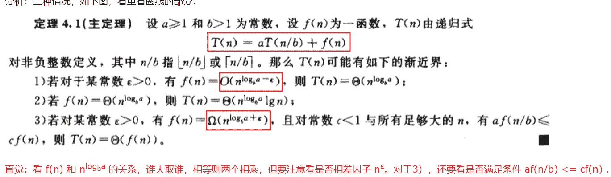

# 爱奇艺 2018 秋季校招 java 工程师（第二场）

## 1

下列 SQL 语句用法错误的是（      ）

正确答案: C   你的答案: 空 (错误)

```cpp
delete from table-name where null=null
```

```cpp
truncate table table-name
```

```cpp
alter table table-name add column id int
```

```cpp
select * from table-name where 3&gt;4
```

本题知识点

Java 工程师 爱奇艺 2018

讨论

[永往直前](https://www.nowcoder.com/profile/959319)

如果要添加新列，正确的语句为：alter table table-name add id int；不需要添加 column

发表于 2017-12-25 13:08:58

* * *

[我是如此相信](https://www.nowcoder.com/profile/7988004)

选项 C 没有问题的吧。。。

发表于 2019-03-03 15:44:07

* * *

[编程的渣渣啊啊啊](https://www.nowcoder.com/profile/8501721)

null = null 的写法对吗？不是 null is null？

发表于 2018-04-07 11:27:39

* * *

## 2

下面关于 B+树的叙述中，错误的是 ________。

正确答案: D   你的答案: 空 (错误)

```cpp
是多路平衡树
```

```cpp
可用于文件的索引结构
```

```cpp
可进行顺序查找
```

```cpp
关键字指向实际数据块
```

本题知识点

Java 工程师 爱奇艺 2018

讨论

[就想有个靠谱工作](https://www.nowcoder.com/profile/8197082)

C 为什么是对的？每个节点最后有指向同一层右边一个节点的指针，相当于链表，这样就可以顺序查找了

发表于 2018-04-02 15:58:11

* * *

[Swalker](https://www.nowcoder.com/profile/7993287)

对于关键字指向实际数据块选项：

B+树的内部结点并没有指向关键字具体信息的指针。因此其内部结点相对 B 树更小。如果把所有同一内部结点的关键字存放在同一盘块中，那么盘块所能容纳的关键字数量也越多。一次性读入内存中的需要查找的关键字也就越多。相对来说 IO 读写次数也就降低了。

由于非终结点并不是最终指向文件内容的结点，而只是叶子结点中关键字的索引。所以任何关键字的查找必须走一条从根结点到叶子结点的路。所有关键字查询的路径长度相同，导致每一个数据的查询效率相当。

举个例子，假设磁盘中的一个盘块容纳 16bytes，而一个关键字 2bytes，一个关键字具体信息指针 2bytes。一棵 9 阶 B-tree(一个结点最多 8 个关键字)的内部结点需要 2 个盘快。而 B+树内部结点只需要 1 个盘快。当需要把内部结点读入内存中的时候，B 树就比 B+树多一次盘块查找时间(在磁盘中就是盘片旋转的时间)。 B+树的查询效率更加稳定。
参考：[`zhidao.baidu.com/question/1735709998860279747.html`](https://zhidao.baidu.com/question/1735709998860279747.html)

发表于 2018-02-24 14:37:18

* * *

## 3

在一个 C 类地址段内，需要将网络划分为 7 个子网，每个子网有 15 个主机，则将使用哪个子网掩码 （）

正确答案: A   你的答案: 空 (错误)

```cpp
255.255.255.224
```

```cpp
255.255.224
```

```cpp
255.255.255.240
```

```cpp
都不是
```

本题知识点

Java 工程师 爱奇艺 2018

讨论

[COKID](https://www.nowcoder.com/profile/1862940)

IP 地址的结构是：网络号+主机号划分子网是从主机号中抽取几位进行子网划分，c 类地址前 24 位为网络号，假设为 192.168.123.XXX 子网掩码与 IP 地址按位与运算就能得到 ip 地址属于哪个子网了。假设你从运营商那里申请了一个 192.168.123 的 c 类地址用于公司的电脑，这样 192.168.123.0 到 192.168.123.255 在你就能任意使用在公司的电脑上。假设，外面来了一个数据是要给 192.168.123.123（11000000.10101000.01111011.01111011）这台主机的，于是用子网掩码 255.255.255.224（11111111.11111111.11111111.1110000）进行按位运算之后，因为任何数和 1 与就是它本身，所以我们可以得到结果，192.168.123.96 也就是说 123 那个 ip 在这个子网中。题目中说是要划分成 7 个子网也就是说最少在主机号中抽取 3 位作为子网号，剩下 8-3=5 位（2⁵）完全够 15 个主机用。C 不对的原因是 240（11110000）这样的话每个子网中理论上有 2⁴=16 台主机，可是全 0 或者全 1 的地址是不能使用的，子网中全 0 代表这个子网的全网络号是对外展示的，全 1 是用于子网中做广播用的。第一次解释，解释地可能不清楚，请参照计算机网络课本

发表于 2018-03-14 20:09:28

* * *

## 4

下面输入输出流中面向字符的流是？( )

正确答案: A   你的答案: 空 (错误)

```cpp
BufferedWriter
```

```cpp
FileInputStream
```

```cpp
ObjectOutputStream
```

```cpp
OutputStreamWriter
```

本题知识点

Java 工程师 爱奇艺 2018

讨论

[侯卿](https://www.nowcoder.com/profile/8037781)

明明就选 A。。D 是将字节流转为字符流方便操作，输入为字节流。

编辑于 2018-08-17 21:01:45

* * *

[就想有个靠谱工作](https://www.nowcoder.com/profile/8197082)

为什么 A 不对？？求解

发表于 2018-04-02 16:14:02

* * *

## 5

以下注解中哪一个表示类或方法已过时？（）

正确答案: C   你的答案: 空 (错误)

```cpp
@Override
```

```cpp
@Overtime
```

```cpp
@Deprecated
```

```cpp
@Retention
```

本题知识点

Java 工程师 爱奇艺 2018

讨论

[SmallStone](https://www.nowcoder.com/profile/1428782)

B 选项 java 中不存在这个注解 C 徐娘是用来表示 java 中过期的方法而 D 选项则是表示注解的生命周期，有可选参数

发表于 2018-04-21 15:34:42

* * *

## 6

Java 中实现 Runnable 的类的线程执行体应写在什么方法中？（）

正确答案: B   你的答案: 空 (错误)

```cpp
重写 start()
```

```cpp
重写 run()
```

```cpp
定义任意方法
```

```cpp
重写 begin()
```

本题知识点

Java 工程师 爱奇艺 2018

## 7

Linux 下哪个命令可以用于判断 host1 主机是否能够访问 host2 主机的端口

正确答案: C   你的答案: 空 (错误)

```cpp
ping
```

```cpp
ifconfig
```

```cpp
telnet
```

```cpp
netstat
```

本题知识点

Java 工程师 爱奇艺 2018

讨论

[就想有个靠谱工作](https://www.nowcoder.com/profile/8197082)

ping 是使用的 ICMP 协议，是 IP 层协议，但是端口是应用层的，所以它只能判断能够访问 ip，不能判断端口 ifconfig 是查看本机的网络设置，IP，子网掩码等 telnet 是应用层的，可以判端口访问情况 netstat 显示网络信息，如网络连接，路由表，接口状态

发表于 2018-04-02 16:05:19

* * *

[牛客 9792607 号](https://www.nowcoder.com/profile/9792607)

ping 是使用的 ICMP 协议，是 IP 层协议，但是端口是应用层的，所以它只能判断能够访问 ip，不能判断端口 ifconfig 是查看本机的网络设置，IP，子网掩码等 telnet 是应用层的，可以判端口访问情况，Telnet 是应用层的 ，可以判断端口的访问情况 

发表于 2019-02-25 16:07:46

* * *

[自从厌倦于追寻](https://www.nowcoder.com/profile/4042909)

用于判断 host1 主机是否能够访问 host2 主机的端口,应该是因为 ping 不是用来检测端口，所以答案是 telnet

发表于 2017-12-29 14:48:25

* * *

## 8

以下关于操作系统，说法错误的是（）

正确答案: B   你的答案: 空 (错误)

```cpp
用管程实现进程同步时，管程中的过程是不可中断的
```

```cpp
多道程序的执行失去了封闭性和再现性，因此多道程序系统不需要封闭性和再现性
```

```cpp
使用 SPOOLING 技术可以实现虚拟设备
```

```cpp
当 CPU 处于管态时，它可以执行计算机系统中的全部指令
```

本题知识点

Java 工程师 爱奇艺 2018

## 9

有一个算法的递推关系式为：T(n) = 9 T(n / 3) + n，则该算法的时间复杂度为（）(^符号是幂的意思)

正确答案: D   你的答案: 空 (错误)

```cpp
O(n³)
```

```cpp
O(nlogn)
```

```cpp
O(n)
```

```cpp
O(n²)
```

本题知识点

Java 工程师 爱奇艺 2018

讨论

[leozzy](https://www.nowcoder.com/profile/1588808)

master 公式

T(N) = a*T(N/b) + O(N^d)

估计递归问题复杂度的通式，只要复杂度符合以下公式，都可以套用此公式计算时间复杂度

例子：递归方式查找数组最大值 T(N) = 2*T(N/2) + O(1)

T(N)：样本量为 N 的情况下，时间复杂度
N：父问题的样本量
a：子问题发生的次数（父问题被拆分成了几个子问题，不需要考虑递归调用，只考虑单层的父子关系）
b：被拆成子问题，子问题的样本量（子问题所需要处理的样本量），比如 N 被拆分成两半，所以子问题样本量为 N/2
O(N^d)：剩余操作的时间复杂度，除去调用子过程之外，剩下问题所需要的代价（常规操作则为 O(1)）

1.  log(b,a) > d -> 复杂度为 O(N^log(b,a))
2.  log(b,a) = d -> 复杂度为 O(N^d * logN)
3.  log(b,a) < d -> 复杂度为 O(N^d)

发表于 2018-05-07 17:22:58

* * *

[牛客 9792607 号](https://www.nowcoder.com/profile/9792607)

使用的是 master 公式，T(N) = a*T(N/b) + O(N^d) 1.  log(b,a) > d -> 复杂度为 O(N^log(b,a))
2.  log(b,a) = d -> 复杂度为 O(N^d * logN)
3.  log(b,a) < d -> 复杂度为 O(N^d) 

发表于 2019-02-25 16:12:57

* * *

[就想有个靠谱工作](https://www.nowcoder.com/profile/8197082)



发表于 2018-04-02 16:18:25

* * *

## 10

Linux 系统下,用什么命令来查看系统进程?

正确答案: D   你的答案: 空 (错误)

```cpp
df
```

```cpp
ifconfig
```

```cpp
netstat
```

```cpp
ps
```

本题知识点

Java 工程师 爱奇艺 2018

讨论

[牛客 9792607 号](https://www.nowcoder.com/profile/9792607)

ps 即为 process 进程

发表于 2019-02-25 16:13:55

* * *

[HelloIverson](https://www.nowcoder.com/profile/5090292)

ps 即 process 进程

发表于 2018-04-19 18:06:46

* * *

[Swalker](https://www.nowcoder.com/profile/7993287)

df 命令的功能是用来检查 linux 服务器的文件系统的磁盘空间占用情况。可以利用该命令来获取硬盘被占用了多少空间，目前还剩下多少空间等信息。

发表于 2018-02-24 22:21:32

* * *

## 11

有一种有趣的字符串价值计算方式:统计字符串中每种字符出现的次数,然后求所有字符次数的平方和作为字符串的价值
例如: 字符串"abacaba",里面包括 4 个'a',2 个'b',1 个'c',于是这个字符串的价值为 4 * 4 + 2 * 2 + 1 * 1 = 21
牛牛有一个字符串 s,并且允许你从 s 中移除最多 k 个字符,你的目标是让得到的字符串的价值最小。

本题知识点

贪心 数学 字符串 *Java 工程师 爱奇艺 2018* *讨论

[刘禅挥泪斩孔明](https://www.nowcoder.com/profile/1263929)

```cpp
import java.util.Scanner;
public class Main {
  public static void main(String[] args) {
    Scanner sc = new Scanner(System.in);
    int[] freq = new int[26];
    int i, k, s=0;
    String input = sc.nextLine();
    k = sc.nextInt();
    for (i=0; i<input.length(); ++i)
      freq[(int)(input.charAt(i)-'a')]++;
    while (k-- != 0) {
      i = maxElement(freq);
      freq[i]--;
    }
    for (i=0; i<26; ++i)
      s += freq[i]*freq[i];
    System.out.println(s);
  }
  private static int maxElement(int[] array) {
    int i, maxIndex=0;
    for (i=1; i<array.length; ++i)
      maxIndex = array[i]>array[maxIndex] ? i : maxIndex;
    return maxIndex;
  }
}

```

发表于 2018-03-17 23:32:45

* * *

[为啥要起名字](https://www.nowcoder.com/profile/1833472)

try:
    while True:
        s=raw_input().strip()
        k=int(raw_input().strip())
        if k==len(s):
            print(0)
        dict1=dict()
        for i in range(len(s)):
            if s[i] not in dict1:
                dict1[s[i]]=1
            else:
                dict1[s[i]]+=1
        values=sorted(dict1.values())
        while k>0:
            values[-1]-=1
            values.sort()
            k-=1
        print(sum(list(map(lambda x:x*x,values))))
except:
    pass

发表于 2018-05-24 09:18:52

* * *

[子房](https://www.nowcoder.com/profile/8541890)

```cpp

	<?php

	$str= trim(fgets(STDIN));

	$number= trim(fgets(STDIN));

	$arr= array();

	for($i=0; $i< strlen($str); $i++) {

	 $arr[] = $str[$i];   

	}

	$newArr= array_count_values($arr);

	arsort($newArr);

	foreach($newArras$key=> $value) {

	    $result[] = $value;

	}

	$i=1;

	while( $i<= $number) {

	    $result[0] = max($result) -1;

	    $i++;

	    arsort($result);

	    $result= array_values($result);

	    //print_r($result);

	}

	$sum= 0;

	for($i=0; $i< count($result); $i++){

	 $sum= $sum+ $result[$i]*$result[$i];

	}

	echo$sum;

```

发表于 2018-08-25 18:40:18

* * *

## 12

牛牛和羊羊都很喜欢青草。今天他们决定玩青草游戏。
最初有一个装有 n 份青草的箱子,牛牛和羊羊依次进行,牛牛先开始。在每个回合中,每个玩家必须吃一些箱子中的青草,所吃的青草份数必须是 4 的 x 次幂,比如 1,4,16,64 等等。不能在箱子中吃到有效份数青草的玩家落败。假定牛牛和羊羊都是按照最佳方法进行游戏,请输出胜利者的名字。

本题知识点

模拟 数学 Java 工程师 爱奇艺 2018

讨论

[秋招结束](https://www.nowcoder.com/profile/596538)

```cpp
/**
我是看的别人的思路但是我并没有看懂为啥，这个题想考什么，找规律？
*/

importjava.util.Scanner;
```

```cpp

publicclassMain {

    publicstaticvoidmain(String[] args) {
        Scanner sc = newScanner(System.in);
        while(sc.hasNext()){
            intn = sc.nextInt();
            for(inti = 0; i < n ;i ++){
                intk = sc.nextInt();
                if(k % 5== 0|| k % 5== 2){
                    System.out.println("yang");
                }else{
                    System.out.println("niu");
                }
            }

        }
    }
```

```cpp
}
```

发表于 2018-08-31 13:00:10

* * *

## 13

牛牛和羊羊非常无聊.他们有 n + m 个共同朋友,他们中有 n 个是无聊的,m 个是不无聊的。每个小时牛牛和羊羊随机选择两个不同的朋友 A 和 B.(如果存在多种可能的 pair(A, B),任意一个被选到的概率相同。),然后牛牛会和朋友 A 进行交谈,羊羊会和朋友 B 进行交谈。在交谈之后,如果被选择的朋友之前不是无聊会变得无聊。现在你需要计算让所有朋友变得无聊所需要的时间的期望值。

本题知识点

数学 Java 工程师 爱奇艺 2018

讨论

[秋招结束](https://www.nowcoder.com/profile/596538)

```cpp

	/***

	*这个题完全就是数学题了吧。。。

	*/

	importjava.util.Scanner;

	publicclassMain {

	    publicstaticvoidmain(String[] args) {

	        Scanner scanner = newScanner(System.in);

	        while(scanner.hasNext()) {

	            intn = scanner.nextInt();

	            intm = scanner.nextInt();

	            float[] dp = newfloat[m + 1];

	            if(m == 0) {

	                System.out.println(0);

	                return;

	            }

	            if(m == 1) {

	                floatres = (n + 1) / 2.0f;  //和下面的不同，此处已知 m=1

	                String r = String.format("%.1f", res);

	                System.out.println(r);

	                return;

	            }

	            dp[1] = (n+ m) / 2.0f;  //注意此处

	            for(inti = 2; i <= m; i++) {

	                dp[i] = p1(m + n-i, i) + p2(m + n -i, i) * (dp[i-1] + 1) + p3(m + n -i, i) * (dp[i-2] + 1);

	            }

	            String r = String.format("%.1f", dp[m]);

	            System.out.println(r);

	        }

	    }

	    privatestaticfloatp1(intn, intm) {

	        intc1 = n * (n-1) / 2;

	        ints = (n + m) * (n + m -1) / 2;

	        floatres = c1 * 1.0f / (s - c1);

	        returnres;

	    }

	    privatestaticfloatp2(intn, intm) {

	        intc1 = n * (n-1) / 2;

	        intc2 = n * m;

	        ints = (n + m) * (n + m -1) / 2;

	        floatres = c2 * 1.0f / (s - c1);

	        returnres;

	    }

	    privatestaticfloatp3(intn, intm) {

	        intc1 = n * (n-1) / 2;

	        intc3 = m * (m  -1) / 2;

	        ints = (n + m) * (n + m -1) / 2;

	        floatres = c3 * 1.0f / (s - c1);

	        returnres;

	    }

	}

```

发表于 2018-08-31 13:01:27

* * **