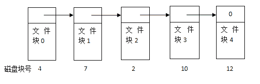

# 爱奇艺 2018 秋季校招测试工程师（第三场）

## 1

什么命令不可以查看 mysql 数据库中 user 表的表结构()

正确答案: D   你的答案: 空 (错误)

```cpp
show create table user
```

```cpp
describe user
```

```cpp
desc user
```

```cpp
show columns for user
```

本题知识点

测试工程师 爱奇艺 2018

讨论

[斗气化胸](https://www.nowcoder.com/profile/9595094)

show columns from 而不是 for

发表于 2018-04-18 16:41:40

* * *

[牛客 875547913 号](https://www.nowcoder.com/profile/875547913)

show create table table_name，查看表生成的 DDL；describle table_name，获取表结构信息 desc table_name，显示表结构，字段类型，主键，是否为空等属性，但不显示外键；show columns from table_name，显示表的列名。

发表于 2020-08-20 12:54:12

* * *

## 2

某文件系统采用链接存储方式，文件 A 在磁盘中存放的情况如图所示。
若该文件所在的目录文件已经在内存中，要读取文件块 2，需要访问磁盘的次数为

正确答案: C   你的答案: 空 (错误)

```cpp
1 次
```

```cpp
2 次
```

```cpp
3 次
```

```cpp
4 次
```

本题知识点

测试工程师 爱奇艺 2018

讨论

[牛客 104404957 号](https://www.nowcoder.com/profile/104404957)

文件系统采取链式存储，则说明只能顺序访问，所以要访问到文件块 2，必须先找到文件块 0 和文件块 1

发表于 2020-05-25 10:15:52

* * *

## 3

以下哪种排序算法在最坏情况下的时间复杂度最小？

正确答案: C   你的答案: 空 (错误)

```cpp
冒泡排序
```

```cpp
选择排序
```

```cpp
归并排序
```

```cpp
插入排序
```

本题知识点

测试工程师 爱奇艺 2018

讨论

[斗气化胸](https://www.nowcoder.com/profile/9595094)

其他三个都是 n2

发表于 2018-04-18 17:06:12

* * *

## 4

两台主机 A 和 B 已建立了 TCP 连接，A 始终以 MSS=1KB 大小的段发送数据，并一直有数据发送；B 每收到一个数据段都会发出一个接收窗口为 9KB 的确认段。若 A 在 T 时刻发生超时时拥塞窗口为 8KB，则从 T 时刻起，不再发生超时的情况下，经过 10 个 RTT 后，A 的发送窗口是 （）

正确答案: B   你的答案: 空 (错误)

```cpp
8KB
```

```cpp
9KB
```

```cpp
10KB
```

```cpp
11KB
```

本题知识点

测试工程师 爱奇艺 2018

讨论

[牛客 875547913 号](https://www.nowcoder.com/profile/875547913)

TCP 主要通过四个算法来进行拥塞控制：慢开始、拥塞避免、快重传、快恢复。cwnd 表示拥塞窗口，ssthresh 表示慢开始门限。T 时刻发生超时，令 ssthresh = cwnd / 2，然后重新进入慢开始，cwnd 初始值为 1。在慢开始过程中，当 cwnd < ssthresh 时，发送方发送报文并接收到确认后，cwnd 成倍增加，两次 RRT 后，cwnd = 4；当 cwnd >= ssthresh 时，进入拥塞避免，cwnd 每次加 1，不考虑接收方窗口大小的情况下完成八个 RRT 后，cwnd = 12；但接收端传回的是 9KB 的确认段，因此 cwnd 不能超过 9，所以最终为 9KB。

发表于 2020-08-20 13:20:12

* * *

## 5

设栈 S 初始状态为空。元素 1,2,3,4,5,6 依次通过栈 S，若出栈的顺序为 4,6,5,3,2,1，则栈 S 的容量至少应该为？

正确答案: C   你的答案: 空 (错误)

```cpp
3
```

```cpp
4
```

```cpp
5
```

```cpp
6
```

本题知识点

测试工程师 爱奇艺 2018

讨论

[中度清醒患者 orz](https://www.nowcoder.com/profile/5240976)

1234 先进栈，4 再出栈，56 进展栈，65321 分别出栈 所以容量至少能容纳 12356 这几个数字，最小为 5

发表于 2018-04-19 09:29:51

* * *

## 6

Linux 下，子进程将不会继承父进程的下列哪个东西?

正确答案: B   你的答案: 空 (错误)

```cpp
共享内存
```

```cpp
进程地址空间
```

```cpp
信号掩码
```

```cpp
已打开的文件描述符
```

本题知识点

测试工程师 爱奇艺 2018

讨论

[GrdT#](https://www.nowcoder.com/profile/9261897)

子进程继承父进程

用户号 UIDs 和用户组号 GIDs 
环境 Environment 
堆栈 
共享内存 
打开文件的描述符 
执行时关闭（Close-on-exec）标志 
信号（Signal）控制设定 
进程组号 
当前工作目录 
根目录 
文件方式创建屏蔽字 
资源限制 
控制终端

子进程独有

进程号 PID 
不同的父进程号 
自己的文件描述符和目录流的拷贝 
子进程不继承父进程的进程正文（text），数据和其他锁定内存（memory locks） 
不继承异步输入和输出

父进程和子进程拥有独立的地址空间和 PID 参数。

发表于 2018-07-06 10:25:11

* * *

[刘二少](https://www.nowcoder.com/profile/1016096)

B

发表于 2018-04-08 14:37:48

* * *

## 7

在软件开发中，经典的模型就是瀑布模型，下列关于瀑布模型的说法正确的是()

正确答案: B   你的答案: 空 (错误)

```cpp
瀑布模型具由于良好的灵活性
```

```cpp
瀑布模型采用结构化的分析与设计方法，将逻辑实现与物理实现分开
```

```cpp
瀑布模型的核心是按照软件开发的时间顺序将问题简化
```

```cpp
利用瀑布模型，如果发现问题则修改的代价很低
```

本题知识点

测试工程师 爱奇艺 2018

讨论

[GrdT#](https://www.nowcoder.com/profile/9261897)

瀑布模型的缺点有：     (1)、各阶段的划分完全固定，阶段之间产生了大量的文档，极大的增加了工作量。     (2)、由于开发模型是线性的，用户只有在整个过程完成以后才能看到效果，因而增加了开发的风险性
     (3)、通过过多的强制完成日期和里程碑来跟踪各个项目阶段
     (4)、瀑布模型最突出的阶段是不适应用户的需求的变更

发表于 2018-07-06 10:37:21

* * *

## 8

APP 系统测试阶段，不需要进行以下哪项测试？

正确答案: C   你的答案: 空 (错误)

```cpp
兼容性测试（IOS 与安卓两方能正常安装）
```

```cpp
根据屏幕尺寸正常显示页面
```

```cpp
全局数据结构是否有问题
```

```cpp
同时并发的性能测试
```

本题知识点

测试工程师 爱奇艺 2018

## 9

在验收测试阶段，不需要进行以下哪项测试？

正确答案: A   你的答案: 空 (错误)

```cpp
接口数据测试
```

```cpp
各功能点的确认测试
```

```cpp
用户文档资料验收
```

```cpp
兼容性测试
```

本题知识点

测试工程师 爱奇艺 2018

## 10

关于回归测试，以下哪项理解是正确的？

正确答案: B   你的答案: 空 (错误)

```cpp
回归测试总是放在最后一轮再测
```

```cpp
回归测试是伴随着下一轮测试的开始，验证前一轮 BUG 修复情况的确认
```

```cpp
改 BUG 时发生的需求变更，可以直接进行回归测试
```

本题知识点

测试工程师 爱奇艺 2018

## 11

牛牛的老师给出了一个区间的定义:对于 x ≤ y,[x, y]表示 x 到 y 之间(包括 x 和 y)的所有连续整数集合。例如[3,3] = {3}, [4,7] = {4,5,6,7}.牛牛现在有一个长度为 n 的递增序列,牛牛想知道需要多少个区间并起来等于这个序列。
例如:
{1,2,3,4,5,6,7,8,9,10}最少只需要[1,10]这一个区间
{1,3,5,6,7}最少只需要[1,1],[3,3],[5,7]这三个区间

本题知识点

贪心 数组 模拟 穷举 测试工程师 爱奇艺 2018

讨论

[GrdT#](https://www.nowcoder.com/profile/9261897)

```cpp

	import java.util.Scanner;

	public class Main{

	public static void main(String [] args) {

	Scanner sc = new Scanner(System.in);

	int n = sc.nextInt();

	int[] arr = new int[n];

	for(int i = 0;i<n;i++)

	arr[i] =sc.nextInt();

	int ans =1;

	for(int i =1;i<n;i++){

	if(arr[i]!=(arr[i-1]+1))

	ans ++;

	}

	if(n==0)

	ans=0;

	System.out.println(ans);

	}

	}

```

编辑于 2018-07-10 20:24:03

* * *

[l 违心派。](https://www.nowcoder.com/profile/7413164)

```cpp

	#define _CRT_SECURE_NO_WARNINGS

	#include <stdio.h>

	intmain()

	{

	    intn;

	    inta[50] = {0};

	    inti = 0;

	    intcount = 0;

	    scanf("%d", &n);

	    getchar();

	    for(;i <n;i++)

	    {

	        scanf("%d", &a[i]);

	    }

	    getchar();

	    for(i = 0;i < n-1;i++)

	    {

	        if(a[i]+1 != a[i+1])

	        {

	            ++count;

	        }

	    }

	    ++count;

	    printf("%d\n", count);

	    return0;

	}

```

发表于 2018-09-14 20:57:07

* * *

## 12

牛牛有一个由小写字母组成的字符串 s,在 s 中可能有一些字母重复出现。比如在"banana"中,字母'a'和字母'n'分别出现了三次和两次。
但是牛牛不喜欢重复。对于同一个字母,他只想保留第一次出现并删除掉后面出现的字母。请帮助牛牛完成对 s 的操作。

本题知识点

模拟 字符串 *测试工程师 爱奇艺 2018* *讨论

[元气の悟空](https://www.nowcoder.com/profile/392974)

```cpp
#include<iostream>
#include<string>
#include<map>
using namespace std;
int main(){
    string x,res="";
    map<char,int> book;
    int i;
    for(cin>>x,i=0;i<x.length();i++)
        if(!book.count(x[i])) res+=x[i],book[x[i]]=1;
    cout<<res;
}

```

发表于 2017-11-29 17:55:16

* * *

[黙瀚](https://www.nowcoder.com/profile/1773935)

```cpp
//比特位表示字母是否出现
import java.util.*;
public class Main{
    public static void main(String[] args){
        Scanner sc = new Scanner(System.in);
        String s = sc.nextLine();
        String res = "";
        int flag = 0;
        for(int i=0;i<s.length();i++){
            int temp = 1<<(s.charAt(i)-'a');
            if((temp&flag)==0) {//第一次出现
                res+=s.charAt(i);
                flag|=temp;
            }
        }
        System.out.print(res);
    }
}

```

发表于 2019-03-18 19:13:06

* * *

[华科平凡](https://www.nowcoder.com/profile/4939096)

python3 解法

使用集合来保存已经出现过的字母。

```cpp
string_set, res = set(), ""
for char in input():
    if char not in string_set:
        string_set.add(char)
        res += char
print(res)
```

发表于 2019-02-24 15:16:36

* * *

## 13

牛牛举办了一场数字游戏,有 n 个玩家参加这个游戏,游戏开始每个玩家选定一个数,然后将这个数写在纸上(十进制数,无前缀零),然后接下来对于每一个数字将其数位按照非递减顺序排列,得到新的数,新数的前缀零将被忽略。得到最大数字的玩家赢得这个游戏。

本题知识点

数学 贪心 数组 排序 *查找 *测试工程师 爱奇艺 2018** **讨论

[友人 A20190307212562](https://www.nowcoder.com/profile/568895334)

#include <iostream>#include <cstring>

using namespace std;

int main()
{
    int n;
    int res = -1;
    cin >> n;
    while (n--) {
        int x;
        int num[10];
        memset(num, 0, sizeof(num));
        cin >> x;
        while (x) {
            ++num[x%10];
            x /= 10;
        }
        int new_n = 0;
        for (int i = 1; i < 10; ++i) {
            //cout << i << " : " << num[i] << endl;
            for (int j = 0; j < num[i]; ++j) {
                new_n = new_n * 10 + i;
            }
        }
        if (new_n > res) res = new_n;
    }
    cout << res << endl;
}

发表于 2019-03-10 14:57:36

* * *

[SunShine201901](https://www.nowcoder.com/profile/389233498)

#include <stdio.h>#include<stdlib.h>
int cmp(const void *a ,const void* b)
{ return *(int *)a-*(int *)b; }
int main()
{
    int n,i,j,k,max=0,beishu=1;
    scanf("%d", &n);
    int x[50];
    int y[50][6]={0};//二维数组初始化

    for(i=0;i<n;i++)
    {
        scanf("%d",&x[i]);
        for(j=0;(j<6)&&(x[i]!=0);j++)
        {
            y[i][j]=x[i]%10;//y[i][j]获取到 x[i]的每一位数字
            x[i]=x[i]/10;
        }
        qsort(y[i],6,sizeof(int),cmp);//对 y[i][j]升序排列

        for(k=5;(k>=0)&&(y[i][k]!=0);k--)//对 y[i][j]去掉前缀 0 存入 x[i]
        {
            x[i]=x[i]+y[i][k]*beishu;
            beishu=beishu*10 ;
        }
        beishu=1;

        if(max<x[i])//获取 x[i]数组最大值
            max=x[i];
    }
 printf("%d\n",max);

    return 0;
}

发表于 2019-03-10 13:13:49

* * *</stdio.h></iostream>***