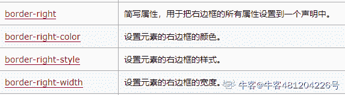

# 爱奇艺 2018 秋季校招前端工程师（第二场）

## 1

下面关于 B+树的叙述中，错误的是 ________。

正确答案: D   你的答案: 空 (错误)

```cpp
是多路平衡树
```

```cpp
可用于文件的索引结构
```

```cpp
可进行顺序查找
```

```cpp
关键字指向实际数据块
```

本题知识点

前端工程师 爱奇艺 2018

讨论

[fghfghggh](https://www.nowcoder.com/profile/5708802)

   B+的特性：

       1.所有关键字都出现在叶子结点的链表中（稠密索引），且链表中的关键字恰好

是有序的；

       2.不可能在非叶子结点命中；

       3.非叶子结点相当于是叶子结点的索引（稀疏索引），叶子结点相当于是存储

（关键字）数据的数据层；

       4.更适合文件索引系统；

发表于 2017-12-13 15:46:50

* * *

## 2

在设计模式中，应该优先使用()关系从而实现复用。

正确答案: A   你的答案: 空 (错误)

```cpp
委派
```

```cpp
继承
```

```cpp
创建
```

```cpp
都不对
```

本题知识点

前端工程师 爱奇艺 2018

讨论

[白柏泊 3333](https://www.nowcoder.com/profile/1023057)

我个人觉得继承不是比较好吗。我做错了

发表于 2017-12-20 19:21:13

* * *

## 3

写出如下代码弹出的结果:

```cpp
var m= 1, j = k = 0; 
function add(n) { 
    return n = n+1; 
} 
y = add(m); 
function add(n) { 
    return n = n + 3; 
} 
z = add(m); 
console.log(y + "," + z);
```

y 和 z 的最终结果为:

正确答案: B   你的答案: 空 (错误)

```cpp
2,4
```

```cpp
4,4
```

```cpp
2,2
```

```cpp
报异常
```

本题知识点

前端工程师 爱奇艺 2018

讨论

[littleZzz](https://www.nowcoder.com/profile/2832057)

y = add(m)z = add(m)y 和 z 的值为 add 之后的值，m 的值没有发生变化，因此 y, z 都是 4

发表于 2019-12-04 10:24:16

* * *

[菜就对了](https://www.nowcoder.com/profile/7054945)

1.js 允许函数重名，之后的函数覆盖之前的函数，与参数无关。 2.函数、变量的声明提前到顶部 第二个 add 覆盖第一个 add，m 又是全局变量

发表于 2018-04-26 16:43:46

* * *

[Month 丶](https://www.nowcoder.com/profile/7400867)

js 中没有函数覆盖 js 变量顶部提升 add 函数声明被提升到顶部 m 是全局变量所以 y 和 z 的结果都是 4

发表于 2017-11-29 17:02:58

* * *

## 4

在 CSS 语言中下列哪一项是「右边框」的语法？（ ）

正确答案: C   你的答案: 空 (错误)

```cpp
border-right-width:
```

```cpp
border-right-height:
```

```cpp
border-right:
```

```cpp
border-top-width:
```

本题知识点

前端工程师 爱奇艺 2018 CSS

讨论

[菜鸡小哥哥](https://www.nowcoder.com/profile/937313510)

右边框宽只属于右边框属性中的一种，不能代表右边框全部属性

发表于 2021-05-05 22:04:26

* * *

[牛客 481204226 号](https://www.nowcoder.com/profile/481204226)

所以 A 为什么不对？

发表于 2020-11-17 18:30:02

* * *

## 5

下面的代码输出的结果为:

```cpp
var n=2.toString();
console.log(typeof(n));
```

正确答案: D   你的答案: 空 (错误)

```cpp
number
```

```cpp
String
```

```cpp
object
```

```cpp
出错
```

本题知识点

前端工程师 爱奇艺 2018

讨论

[PrConstantin](https://www.nowcoder.com/profile/6541293)

一个常见的误解是数字的字面值（literal）不能当作对象使用。这是因为 JavaScript 解析器的一个错误， 它试图将点操作符解析为浮点数字面值的一部分。

```cpp
2.toString(); // 出错：SyntaxError 
```

有很多变通方法可以让数字的字面值看起来像对象。

```cpp
2..toString(); // 第二个点号可以正常解析
2 .toString(); // 注意点号前面的空格 
(2).toString(); // 2 先被计算 
```

出自：[`bonsaiden.github.io/JavaScript-Garden/zh/`](https://bonsaiden.github.io/JavaScript-Garden/zh/)

发表于 2017-11-30 17:19:49

* * *

## 6

Linux 下哪个命令可以用于判断 host1 主机是否能够访问 host2 主机的端口

正确答案: C   你的答案: 空 (错误)

```cpp
ping
```

```cpp
ifconfig
```

```cpp
telnet
```

```cpp
netstat
```

本题知识点

前端工程师 爱奇艺 2018

讨论

[白柏泊 3333](https://www.nowcoder.com/profile/1023057)

md，我 window 下一直是 ping

发表于 2017-12-20 19:22:50

* * *

## 7

有一个算法的递推关系式为：T(n) = 9 T(n / 3) + n，则该算法的时间复杂度为（）(^符号是幂的意思)

正确答案: D   你的答案: 空 (错误)

```cpp
O(n³)
```

```cpp
O(nlogn)
```

```cpp
O(n)
```

```cpp
O(n²)
```

本题知识点

前端工程师 爱奇艺 2018

讨论

[PrConstantin](https://www.nowcoder.com/profile/6541293)

[`blog.csdn.net/shanshanpt/article/details/8696955`](http://blog.csdn.net/shanshanpt/article/details/8696955)

发表于 2017-11-30 17:07:31

* * *

[littleZzz](https://www.nowcoder.com/profile/2832057)

1.T(n) = 4*T(n/2) + n 则是第一种情况 logba = 2,而 n = n¹，所以 1 < 2，所以为 O( n² )

2\. T(n) = 4*T(n/2) + n² 则是第二种情况，注意此处的 k=0 的，又 logba = 2,所以 2 = 2，所以为 O( n² * lgn )

3\. T(n) = 4*T(n/2)+ n³，则是第三情况，3 >2，所有结果是：O( f(n)) = O( n³ )

发表于 2019-12-04 10:27:55

* * *

## 8

Linux 系统下,用什么命令来查看系统进程?

正确答案: D   你的答案: 空 (错误)

```cpp
df
```

```cpp
ifconfig
```

```cpp
netstat
```

```cpp
ps
```

本题知识点

前端工程师 爱奇艺 2018

## 9

在下列标签中，哪个标签表示最小的标题？（）

正确答案: C   你的答案: 空 (错误)

```cpp
<title></title>
```

```cpp
<h1></h1>
```

```cpp
<h6></h6>
```

```cpp
<h7></h7>
```

本题知识点

前端工程师 爱奇艺 2018 HTML

讨论

[无火的余烬](https://www.nowcoder.com/profile/7870269)

标题标签一般是指 h1～h6，从 1 到 6 标题大小依次减小

发表于 2017-12-21 09:14:06

* * *

[程序猿桃子](https://www.nowcoder.com/profile/308152248)

没有 h7

发表于 2021-01-05 11:14:57

* * *

[无聊★刷刷](https://www.nowcoder.com/profile/875199633)

标题标签一般是 h1 到 h6 依次变小，没有 h7 标签

发表于 2021-04-24 22:45:49

* * *

## 10

下面哪些标签可以在 HTML 页面中插入 GIF 动画和 MP3 声音文件？（）

正确答案: D   你的答案: 空 (错误)

```cpp
<image>和<audio>
```

```cpp
<image>和<voice>
```

```cpp
和<voice>
```

```cpp
和<audio>
```

本题知识点

前端工程师 爱奇艺 2018 HTML

讨论

[鋠觞佰钰亰](https://www.nowcoder.com/profile/2814591)

img 标签与 image 控件的一点有意思的区别

在网页开发中，要显示一个图片，有两种选择：第一种是使用 HTML 直接支持的`img`标签，设置其`src`属性。第二种是使用`image`这个服务器控件，设置其`imageurl`属性。

在很多时候，他们都没有什么大的区别。我们通常都建议使用`Img`标签。

有一个时候，可能用 Image 控件能解决一个棘手的问题。因为 Img 标签不能识别`～`这个符号，通常这个符号都是代表网站根目录，img 标签只能使用相对路径引用图片。所以，在下面的情况下会有一点问题：

如果我们是在母版页中使用了一个图片，该母版页可能被很多页面用到，而且这些页面是分布在不同的文件夹的。那么，大家想想看，在不同的文件夹中的页面被显示出来的时候，当然会按照它这个文件夹的相对位置找那个图片，这样的话，除非每个文件夹里面都有那个图片，否则很多页面就看不到图片。

而用 Image 控件就能够解决这个问题

`<asp:Image ImageUrl=img/logo.gif" runat="server" CssClass="logo" />`

[参考连接](https://www.cnblogs.com/chenxizhang/archive/2008/11/25/1340906.html)

发表于 2020-12-22 09:38:12

* * *

[兰舟啵啵糖](https://www.nowcoder.com/profile/783963494)

- video(H5 新增)

作用：播放视频

<video>
    <source src="" type=""></source>
    <source src="" type=""></source>
</video>

- audio(H5 新增)

作用: 播放音频

<audio src=""></audio>
<audio>
    <source src="" type="">
</audio>

发表于 2021-08-17 15:20:03

* * *

[高高手](https://www.nowcoder.com/profile/566035028)

好像没有<voice>标签

发表于 2020-09-22 21:26:02

* * *

## 11

如果一个整数只能被 1 和自己整除,就称这个数是素数。
如果一个数正着反着都是一样,就称为这个数是回文数。例如:6, 66, 606, 6666
如果一个数字既是素数也是回文数,就称这个数是回文素数
牛牛现在给定一个区间[L, R],希望你能求出在这个区间内有多少个回文素数。

本题知识点

模拟 数学 穷举 前端工程师 爱奇艺 2018

讨论

[Tendō·Pein](https://www.nowcoder.com/profile/6291542)

```cpp
//可以先把 1000 以内所有回文素数求出来，
//写成一个数组去搜索，这样笔试时候绝对是最快的
#include<iostream>
#include<vector>
using namespace std;
bool IsPrime(int x)
{
    if (x == 0 || x == 1) return false;
    for (int i = 2; i <= x / 2; i++)
        if (x % i == 0)
            return false;
    return true;
}
bool IsRevrse(int x)
{
    int temp = 0,xs=x;
    while (x)
    {
        temp = (temp * 10 + x % 10);
        x = x / 10;
    }
    return xs == temp ? true : false;
}
int main()
{
    int l, r, cnt = 0;
    cin >> l >> r;
    for (int i = l; i <= r; i++)
        if (IsRevrse(i) && IsPrime(i))
            cnt++;
    cout << cnt << endl;
    return 0;
}
```

发表于 2019-03-11 14:28:37

* * *

[文剑木然](https://www.nowcoder.com/profile/2036655)

打表法。注意 1 不是素数

```cpp
t = [2, 3, 5, 7, 11, 101, 131, 151, 181, 191, 313, 353, 373, 383, 727, 757, 787, 797, 919, 929]
l, r = map(int, input().split())
print(len(list(filter(lambda i: l <= i <= r, t))))

```

编辑于 2019-03-18 10:24:46

* * *

[成程晨](https://www.nowcoder.com/profile/4101133)

```cpp
import java.util.*;
public class Main{
    public static void main(String[] args){
        try(Scanner in = new Scanner(System.in)){
            System.out.println(helper(in.nextInt(),in.nextInt()));
        }
    }
    public static int helper(int l,int r){
        int count = 0;
        if(l == 1) l++;//1 不是素数
        while(l <= r){
            if(isHuiWen(l) && isSu(l)) count++;
            l++;
        }
        return count;
    }
    public static boolean isSu(int num){
        int i = 2;
        while(i * i <= num){
            int j = num / i;
            if(j * i  == num) return false;
            i++;
        }
        return true;
    }
    public static boolean isHuiWen(int num){
        char[] cs = Integer.toString(num).toCharArray();
        int i = 0,j = cs.length - 1;
        while(i <= j){
            if(cs[i] != cs[j]) return false;
            i++;
            j--;
        }
        return true;
    }
}

```

发表于 2019-01-16 11:33:03

* * *

## 12

牛牛有一个长度为 n 的整数序列,牛牛想对这个序列进行重排为一个非严格升序序列。牛牛比较懒惰,他想移动尽量少的数就完成重排,请你帮他计算一下他最少需要移动多少个序列中的元素。(当一个元素不在它原来所在的位置,这个元素就是被移动了的)

本题知识点

贪心 数学 排序 *前端工程师 爱奇艺 2018* *讨论

[～mhui](https://www.nowcoder.com/profile/388501259)

1，两个数组 2，将其中一个数组进行排列 3，比较两个数组每个值的位置，不一样加 1

发表于 2019-02-12 16:59:49

* * *

[Tendō·Pein](https://www.nowcoder.com/profile/6291542)

```cpp
//题目说的不是很清楚，想问的是几个位置的数字变化
#include<iostream>
#include<algorithm>
#include<vector>
using namespace std;
int main()
{
    int num, x;
    cin >> num;
    vector<int> nums, temp;
    while (num--)
    {
        cin >> x;
        nums.push_back(x);
        temp.push_back(x);
    }
    sort(nums.begin(), nums.end());
    int cnt = 0;
    for (int i = 0; i < nums.size(); i++)
    {
        if (nums[i] != temp[i])
            cnt++;
    }
    cout << cnt << endl;
    return 0;
}
```

发表于 2019-03-11 13:54:26

* * *

[Mono_Chrome](https://www.nowcoder.com/profile/3233028)

```cpp
import java.util.Arrays;
import java.util.Scanner;

public class Main {

    public static void main(String[] args) {
        Scanner sc = new Scanner(System.in);
        int n = sc.nextInt();
        int[] arr = new int[n];
        int[] arrSorted = new int[n];
        int count = 0;
        for (int i = 0; i < n; i++) {
            int cur = sc.nextInt();
            arr[i] = cur;
            arrSorted[i] = cur;
        }
        Arrays.sort(arrSorted);
        for (int i = 0; i < n; i++) {
            if (arr[i] != arrSorted[i]) {
                count++;
            }
        }
        System.out.println(count);
    }
}
```

发表于 2019-06-17 17:40:13

* * *

## 13

有一种有趣的字符串价值计算方式:统计字符串中每种字符出现的次数,然后求所有字符次数的平方和作为字符串的价值
例如: 字符串"abacaba",里面包括 4 个'a',2 个'b',1 个'c',于是这个字符串的价值为 4 * 4 + 2 * 2 + 1 * 1 = 21
牛牛有一个字符串 s,并且允许你从 s 中移除最多 k 个字符,你的目标是让得到的字符串的价值最小。

本题知识点

贪心 数学 字符串 *前端工程师 爱奇艺 2018* *讨论

[华科平凡](https://www.nowcoder.com/profile/4939096)

python 解法

```cpp
from collections import Counter

string, k = input(), int(input())
arr = sorted(Counter(string).values())
for i in range(k):
    arr[-1] -= 1
    arr.sort()
print(sum(map(lambda c: c ** 2, arr)))
```

思路是**不断将出现最多次的字符数量减 1**。
最后将所有字符出现次数平方和加起来。

将出现次数最多的字符数量减 1 后，该字符数量可能不是最多的了，所以要作下`sort`操作，找到出现次数最多的那个。

发表于 2019-02-24 18:39:08

* * *

[Alejandro1](https://www.nowcoder.com/profile/820419792)

```cpp
#include<iostream>
#include<algorithm>

using namespace std;

int main() {
    string s;
    int k;
    cin >> s >> k;
    int alph[26] = {0};
    for (int i = 0; i < s.size(); i++) {
        alph[s[i] - 'a']++;
    }
    sort(alph, alph + 26);
    for (int i = 0; i < k; i++) {
        alph[25]--;
        sort(alph, alph + 26);
    }
    int value = 0;
    for (int i = 0; i < 26; i++) {
        value += alph[i] * alph[i];
    }
    cout << value << endl;
    return 0;
} 
```

发表于 2019-01-23 22:53:00

* * *

[成程晨](https://www.nowcoder.com/profile/4101133)

```cpp
import java.util.*;
public class Main{
    public static void main(String[] args){
        try(Scanner in = new Scanner(System.in)){
            System.out.println(helper(in.next(),in.nextInt()));
        }
    }
    public static int helper(String s,int k){
        char[] cs = s.toCharArray();
        int[] a = new int[26];
        for(char c:cs){
            a[c - 'a']++;
        }
        //不用自己造轮子系列
        PriorityQueue<Integer> pq = new PriorityQueue<>((o1,o2)->{
            return o2 - o1;
        });
        for(int num:a){
            if(num != 0) pq.add(num);
        }
        int i = 0;
        while(i < k){
            int num = pq.remove();
            pq.add(num - 1);
            i++;
        }
        int sum = 0;
        for(int num:pq){
            sum += num * num;
        }
        return sum;
    }
}

```

发表于 2019-01-15 22:26:49

* * ***</voice>