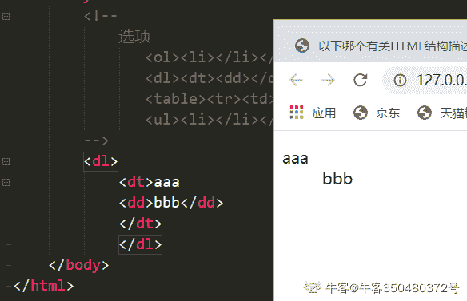

# 爱奇艺 2018 秋季校招前端工程师（第三场）

## 1

下面那个方法不属于 JavaScript 中的 Math 对象

正确答案: D   你的答案: 空 (错误)

```cpp
random()
```

```cpp
abs()
```

```cpp
pow()
```

```cpp
around()
```

本题知识点

前端工程师 爱奇艺 2018

讨论

[木槿 szk](https://www.nowcoder.com/profile/1315807)

max()最大值 min()最小值 abs()绝对值 random （）0-1 的随机数 floor （）向下取舍最接近的整数 ceil （） 向上取舍最接近的整数 round（） 四舍五入

发表于 2018-08-05 20:29:48

* * *

[冷彻](https://www.nowcoder.com/profile/6570296)

ba 指的是取随机数 c 使求次方

发表于 2017-12-08 21:21:55

* * *

[PrConstantin](https://www.nowcoder.com/profile/6541293)

[`developer.mozilla.org/zh-CN/docs/Web/JavaScript/Reference/Global_Objects/Math`](https://developer.mozilla.org/zh-CN/docs/Web/JavaScript/Reference/Global_Objects/Math)

发表于 2017-12-04 16:49:33

* * *

## 2

下面代码弹出的结果为:

```cpp
var obj = {m:10};
var obj2 = obj;
obj.a = obj2 = {n:20};
alert(obj.a);
alert(obj.m);
```

正确答案: B   你的答案: 空 (错误)

```cpp
undefined,10
```

```cpp
object,10
```

```cpp
20,20
```

```cpp
20,10
```

本题知识点

前端工程师 爱奇艺 2018

讨论

[PrConstantin](https://www.nowcoder.com/profile/6541293)

[`www.cnblogs.com/vajoy/p/3703859.html`](https://www.cnblogs.com/vajoy/p/3703859.html)

发表于 2017-12-04 16:49:03

* * *

[deefre](https://www.nowcoder.com/profile/36503303)

有一点要注意的，alert 不能表示 object，但 console 可以打印出来

发表于 2019-08-11 16:39:53

* * *

[叶泊沂](https://www.nowcoder.com/profile/892341240)

var a = {n:1}; var b = a; a.x = a = {n:2}; 最后这句 a.x = a = {n:2} 先执行 a.x，此时 a 和 b 均共享{n:1}的栈指针，于是{n:1}变为{n:1,x:undefined}； 接着执行 a = {n:2}，此时 a 不再和 b 共享同对象的指针而是指向新对象{n:2}。 下一步 a.x = a 是最关键的地方，关键之处在于这两个“a”已经是完全不一样的东西，前者（其实可以把它看成 b）指向{n:1,x:undefined}，后者指向{n:2}。 执行这一步，{n:1,x:undefined}这个对象（b 指向的对象）变为{n:1,x:a} 而 a 只是指向{n:2}。

发表于 2020-10-26 15:36:04

* * *

## 3

以下哪种排序算法在最坏情况下的时间复杂度最小？

正确答案: C   你的答案: 空 (错误)

```cpp
冒泡排序
```

```cpp
选择排序
```

```cpp
归并排序
```

```cpp
插入排序
```

本题知识点

前端工程师 爱奇艺 2018

讨论

[李镇强](https://www.nowcoder.com/profile/86259879)

**c**

> 归并时间复杂度 O(n*lgn)，其他 O(n*n)

发表于 2019-04-12 19:53:49

* * *

## 4

两台主机 A 和 B 已建立了 TCP 连接，A 始终以 MSS=1KB 大小的段发送数据，并一直有数据发送；B 每收到一个数据段都会发出一个接收窗口为 9KB 的确认段。若 A 在 T 时刻发生超时时拥塞窗口为 8KB，则从 T 时刻起，不再发生超时的情况下，经过 10 个 RTT 后，A 的发送窗口是 （）

正确答案: B   你的答案: 空 (错误)

```cpp
8KB
```

```cpp
9KB
```

```cpp
10KB
```

```cpp
11KB
```

本题知识点

前端工程师 爱奇艺 2018

讨论

[牛客 835998015 号](https://www.nowcoder.com/profile/835998015)

按拥塞窗口规则进行计算：当超时后，门限减半变为 4KB，拥塞窗口变为 1KB，两次 RTT 后，拥塞窗口变为 4KB，进入拥塞避免，每次+1KB；8 次 RTT 后，得到结果 12KB，但因为接收端传回 9KB 的确认，因此发送端窗口不能超过 9KB；因此选 B

发表于 2021-03-17 16:41:59

* * *

[水夏](https://www.nowcoder.com/profile/1264568)

参考：[`www.cnblogs.com/losbyday/p/5847041.html`](https://www.cnblogs.com/losbyday/p/5847041.html)A 在 T 时刻发生超时时拥塞窗口为 8KB，则慢开始门限值 ssthresh 变为 4KB(8KB 的一半)，并且拥塞窗口 cwnd 变为 1KB,采用指数增长，经过 2 个 RTT 后变为 4KB 达到慢开始门限值，然后采用慢开始算法，每经过 1 个 RTT 拥塞窗口加 1KB,再经过 8 个 RTT 达到 12KB.我觉得答案应该是 12KB 啊

发表于 2018-04-19 13:05:09

* * *

## 5

设栈 S 初始状态为空。元素 1,2,3,4,5,6 依次通过栈 S，若出栈的顺序为 4,6,5,3,2,1，则栈 S 的容量至少应该为？

正确答案: C   你的答案: 空 (错误)

```cpp
3
```

```cpp
4
```

```cpp
5
```

```cpp
6
```

本题知识点

前端工程师 爱奇艺 2018

讨论

[伪虾君](https://www.nowcoder.com/profile/2531478)

容量是指栈的长度...我以为是宽度...重要过程如下：1234  此时最小容量是 4
123   ->4out   此时最小容量是 4123   <-5in <-6 in 12356  此时最小容量是 5 之后就可以按照题目要求出了 12356   6->out  5->out  3->out 2->out 1->outnull

发表于 2017-11-28 14:36:32

* * *

## 6

在 Linux 系统下，下列哪个命令可以查看曾经登录到此系统的用户清单?

正确答案: B   你的答案: 空 (错误)

```cpp
ps
```

```cpp
last
```

```cpp
lastcomm
```

```cpp
accton
```

本题知识点

前端工程师 爱奇艺 2018

讨论

[](https://www.nowcoder.com/profile/5476356)

last 命令用于显示用户最近登录信息。单独执行 last 命令，它会读取/var/log/wtmp 的文件，并把该给文件的内容记录的登入系统的用户名单全部显示出来。

发表于 2018-04-18 10:57:45

* * *

## 7

在软件开发中，经典的模型就是瀑布模型，下列关于瀑布模型的说法正确的是()

正确答案: B   你的答案: 空 (错误)

```cpp
瀑布模型具由于良好的灵活性
```

```cpp
瀑布模型采用结构化的分析与设计方法，将逻辑实现与物理实现分开
```

```cpp
瀑布模型的核心是按照软件开发的时间顺序将问题简化
```

```cpp
利用瀑布模型，如果发现问题则修改的代价很低
```

本题知识点

前端工程师 爱奇艺 2018

讨论

[Serendipity96](https://www.nowcoder.com/profile/8396852)

瀑布模型核心思想

瀑布模型核心思想是按工序将问题化简，将功能的实现与设计分开，便于分工协作，即采用结构化的分析与设计方法将逻辑实现与物理实现分开。将软件生命周期划分为制定计划、需求分析、软件设计、程序编写、软件测试和运行维护等六个基本活动，并且规定了它们自上而下、相互衔接的固定次序，如同瀑布流水，逐级下落。

发表于 2018-08-25 16:46:59

* * *

## 8

以下哪个有关 HTML 结构描述是错误的?

正确答案: B   你的答案: 空 (错误)

```cpp
<ol><li></li></ol>
```

```cpp
<dl><dt><dd><dd></dt></dl>
```

```cpp
<table><tr><td></td></tr></table>
```

```cpp
<ul><li></li></ul>
```

本题知识点

前端工程师 爱奇艺 2018 HTML

讨论

[腾讯校园招聘](https://www.nowcoder.com/profile/7689099)

**<dl>
<dt>列表标题</dt>
<dd>列表内容</dd>
<dd>列表内容</dd>
...
</dl>**

发表于 2018-03-21 11:52:59

* * *

[牛客 350480372 号](https://www.nowcoder.com/profile/350480372)

就结果来说是能运行的，只能说是结构不严谨（俗称不舒服的代码结构）

发表于 2020-11-16 09:32:36

* * *

[jexica](https://www.nowcoder.com/profile/554037988)

描述列表

```cpp
<dl>
  <dt>Firefox</dt>
  <dd>
       一款浏览器
  </dd>
  <dt>Chrome</dt>
  <dd> 
        另一款浏览器
  </dd>
</dl>
```

发表于 2021-03-22 21:29:17

* * *

## 9

在下列标签中，哪个标签可以实现换行？

正确答案: B   你的答案: 空 (错误)

```cpp
<hr>
```

```cpp
<br>
```

```cpp
<blockquote>
```

```cpp
<li>
```

本题知识点

前端工程师 爱奇艺 2018 HTML

讨论

[牛客 395430506 号](https://www.nowcoder.com/profile/395430506)

我以为哪个标签可以插入换行标签

发表于 2021-03-01 15:43:34

* * *

[yellowCC](https://www.nowcoder.com/profile/582072853)

题目应该这样：哪个标签插入后可以换行

发表于 2021-09-23 08:19:20

* * *

[薇莳萝](https://www.nowcoder.com/profile/755143362)

这出的题哟～（啧啧）

发表于 2021-12-13 19:18:56

* * *

## 10

定义页面结构如下

```cpp
<html>
  <head></head>
  <body>
      <div id="bgcolor" class="bgcolor"></div>
</body>
</html>

```

下面哪个语法表示将整个页面背景色设置为红色?（）

正确答案: D   你的答案: 空 (错误)

```cpp
body{color: red}
```

```cpp
.bgcolor{width:1366px; height:768px; background-color:red;}
```

```cpp
#bgcolor{width:100%; height:100%; background-color:red}
```

```cpp
body{background-color:red}
```

本题知识点

前端工程师 爱奇艺 2018 HTML

讨论

[Emily1](https://www.nowcoder.com/profile/2080450)

c 选项不对，是因为高度是由内容撑开的，高度 100%;也只是内容撑开的的 100%；

发表于 2021-03-06 14:08:30

* * *

[加加油](https://www.nowcoder.com/profile/8578590)

选择器后面没有冒号吧？都不对

发表于 2018-08-20 13:34:58

* * *

[牛客 723257202 号](https://www.nowcoder.com/profile/723257202)

A. 设置 body 内容颜色

B. 宽高不适配所有电脑的浏览器

C. 定义宽高为 100%但是需要有内容撑开 代码里面无内容

D. 定义 body 整个页面为红色适配所有电脑的浏览器

发表于 2021-11-14 09:57:01

* * *

## 11

牛牛有 4 根木棍,长度分别为 a,b,c,d。羊羊家提供改变木棍长度的服务,如果牛牛支付一个硬币就可以让一根木棍的长度加一或者减一。牛牛需要用这四根木棍拼凑一个正方形出来,牛牛最少需要支付多少硬币才能让这四根木棍拼凑出正方形。

本题知识点

贪心 数学 排序 *穷举 前端工程师 爱奇艺 2018* *讨论

[华科平凡](https://www.nowcoder.com/profile/4939096)

python 两行解法

```cpp
arr = sorted(map(int, input().split()))
print(arr[3] + arr[2] - arr[1] - arr[0])
```

根据数学推导：

*   最长的那根木棍和最短的那根，最终要达到相同的长度，那么中间要进行 len(max) - len(min)次操作。
*   第二长的那根木棍和第二短的那根，最终要达到相同的长度，中间要进行 len(max2) - len(min2) 次操作。

所以总共要进行`len(max) + len(max2) - len(min2)- len(min)`次操作

发表于 2019-02-24 19:02:20

* * *

[Alejandro1](https://www.nowcoder.com/profile/820419792)

```cpp

	#include<iostream>
#include<algorithm>

	using namespace std;

	int main() {
    int arr[4];
    cin >> arr[0] >> arr[1] >> arr[2] >> arr[3];
    sort(arr, arr + 4);
    int sum = (arr[3] - arr[0]) + (arr[2] - arr[1]);
    cout << sum << endl;
    return 0;
}

```

编辑于 2019-01-24 00:19:00

* * *

[Liang2019](https://www.nowcoder.com/profile/564269527)

有四个数字，a, b, c, d,从小到大排序，假设边长定为 x，则需要改变的次数为
total = 
四个数，能构成五个区域，两端的不考虑，不做解释。

*   x 在 a 和 b 之间时，结果为 ,由于 ,x 取 b 最小，为

*   x 在 b 和 c 之间时，结果为 

*   x 在 c 和 d 之间时，结果为 ，由于 ,x 取 c 最小，为

    ```cpp
    import java.io.*;
    import java.util.Arrays;
    public class Main{

      public static void main(String[] args) throws Exception {
              BufferedReader br = new BufferedReader(new InputStreamReader(System.in));
              String line = null;
              while((line = br.readLine()) != null){
                  int[] a = new int[4];
                  String[] s = line.trim().split(" ");
                  for(int i=0;i<4;i++){
                      a[i] = Integer.parseInt(s[i]);
                  }
                  Arrays.sort(a);
                  int money = a[2]-a[0]+a[3]-a[1];
                  System.out.println(money);
              }
          }
    }
    ```

发表于 2019-07-22 20:43:42

* * *

## 12

牛牛的老师给出了一个区间的定义:对于 x ≤ y,[x, y]表示 x 到 y 之间(包括 x 和 y)的所有连续整数集合。例如[3,3] = {3}, [4,7] = {4,5,6,7}.牛牛现在有一个长度为 n 的递增序列,牛牛想知道需要多少个区间并起来等于这个序列。
例如:
{1,2,3,4,5,6,7,8,9,10}最少只需要[1,10]这一个区间
{1,3,5,6,7}最少只需要[1,1],[3,3],[5,7]这三个区间

本题知识点

贪心 数组 模拟 穷举 前端工程师 爱奇艺 2018

讨论

[华科平凡](https://www.nowcoder.com/profile/4939096)

python 解法

```cpp
n, arr = int(input()), list(map(int, input().split()))
res = 1
for i in range(1, n):
    if arr[i] - arr[i - 1] > 1:
        res += 1
print(res)
```

遍历数组，如果某一个数和前一个数的差大于 1，那么一定要开辟新的区间。等于 1 不做任何处理。

发表于 2019-02-24 19:06:42

* * *

[老骥伏枥志在千里](https://www.nowcoder.com/profile/712504970)

```cpp
import java.util.Scanner;
public class Main{
    public static void main(String[] args){
        Scanner sc=new Scanner(System.in);
        int n=sc.nextInt();
        int[] array=new int[n];
        int count=1;
        for(int i=0;i<n;i++){
            array[i]=sc.nextInt();
        }
        for(int i=1;i<n;i++){
            if(array[i-1]!=array[i]-1){
                count++;
            }
        }
        System.out.println(count);
    }
}

```

总的来说就是判断是否连续的，即 array[i]是否等于 array[i+1]-1,如果不是 count++

发表于 2019-03-20 17:32:20

* * *

[茶月猫](https://www.nowcoder.com/profile/313152308)

不需要把数据存储了，直接读进来进行相差是否为 1 的判断，就可以输出结果，空间复杂度为 o(1)

```cpp
#include <iostream>
usingnamespacestd;
intmain(void)
{
    intlen, temp, first;
    cin >> len;
    intcount = 1;
    cin >> first;
    for(inti = 0; i < len-1; i++)
    {
        cin >> temp;
        if(temp - first != 1)
        {
            count++;
        }
        first = temp;
    }
    cout << count << endl;
    return0;
}
```

编辑于 2019-04-23 11:54:57

* * *

## 13

牛牛举办了一场数字游戏,有 n 个玩家参加这个游戏,游戏开始每个玩家选定一个数,然后将这个数写在纸上(十进制数,无前缀零),然后接下来对于每一个数字将其数位按照非递减顺序排列,得到新的数,新数的前缀零将被忽略。得到最大数字的玩家赢得这个游戏。

本题知识点

数学 贪心 数组 排序 *查找 *前端工程师 爱奇艺 2018** **讨论

[元气の悟空](https://www.nowcoder.com/profile/392974)

```cpp
#include<stdlib.h>
#include<iostream>
#include<string>
#include<algorithm>
using namespace std;
int main(){
    int n,i,Max=-1;
    for(cin>>n,i=0;i<n;i++){
        string x;
        cin>>x,sort(x.begin(),x.end());
        Max=max(Max,atoi(x.c_str()));
    }
    printf("%d",Max);
}

```

发表于 2017-11-28 23:21:06

* * *

[华科平凡](https://www.nowcoder.com/profile/4939096)

python 两行

```cpp
a, b = input(), max(map(lambda c: int("".join(sorted(c))), input().split()))
print(b)
```

发表于 2019-02-24 19:22:51

* * *

[PrConstantin](https://www.nowcoder.com/profile/6541293)

Js 一行代码

```cpp
while(line=readline()){
    let line2=readline()
    function ans(line2) {
     return Math.max(...line2.split(' ').map((ele)=>{return parseInt(ele.split('').sort((a,b)=>{return a-b}).join('').replace(/\b(0+)/gi,""))})) 
    }
    print(ans(line2))
}

```

发表于 2017-12-04 17:52:01

* * ****