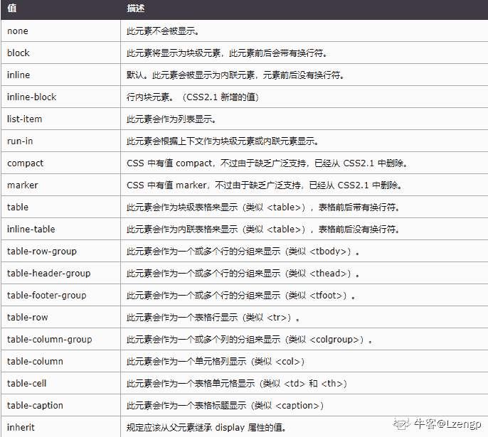
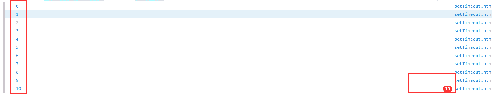
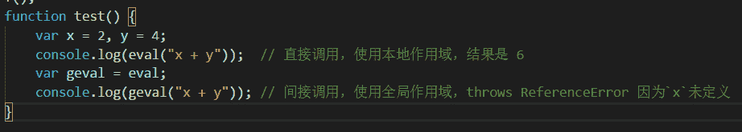
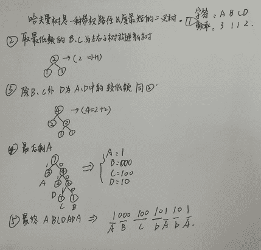
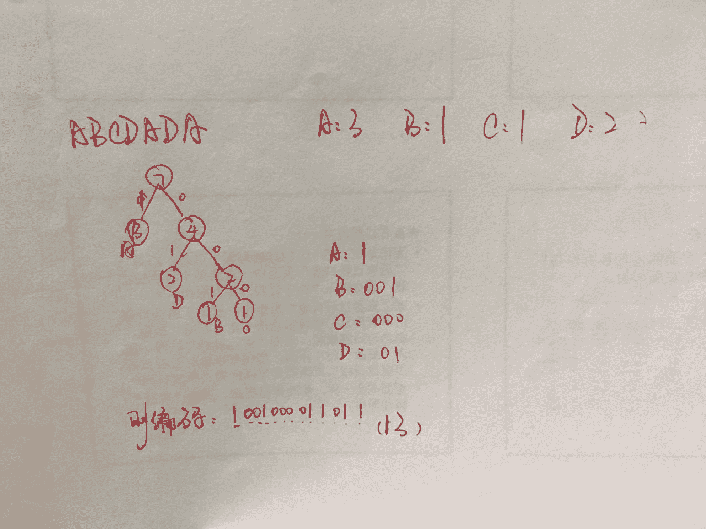
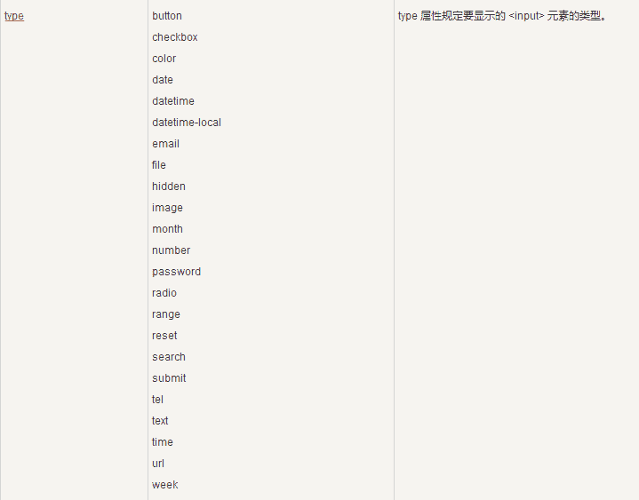

# 爱奇艺 2018 秋季校招前端工程师（第一场）

## 1

一个提供 NAT 服务的路由器在转发一个源 IP 地址为 10.0.0.1、目的 IP 地址为 131.12.1.1 的 IP 分组时，可能重写的 IP 分组首部字段是Ⅰ.TTLⅡ.片偏移量Ⅲ.源 IP 地址Ⅳ.目的 IP 地址

正确答案: C   你的答案: 空 (错误)

```cpp
仅Ⅰ
```

```cpp
仅 I、Ⅱ
```

```cpp
仅Ⅰ、Ⅱ、III
```

```cpp
Ⅰ、Ⅱ、Ⅲ、Ⅳ
```

本题知识点

前端工程师 爱奇艺 2018

## 2

查看系统内存如下：
    [@server ~]# free -g
    total used free shared buffers cached
    Mem: 15 5 9 0 0 2
    -/+ buffers/cache: 3 12
    Swap: 0 0 0
那么程序实际可使用内存有多少:

正确答案: C   你的答案: 空 (错误)

```cpp
9G
```

```cpp
11G
```

```cpp
12G
```

```cpp
21G
```

本题知识点

前端工程师 爱奇艺 2018

讨论

[小燕燕](https://www.nowcoder.com/profile/337290)

我不知道 9+2 为什么等于 12

发表于 2018-02-01 00:11:11

* * *

[王不留](https://www.nowcoder.com/profile/4783620)

**-/+ buffers/***d：表示物理内存的缓存统计**

(-buffers/***) used 内存数：3G(指的第一部分 Mem 行中的 used - buffers - ***d)
(+buffers/***) free 内存数: 12G(指的第一部分 Mem 行中的 free + buffers + ***d)

-buffers/***反映的是被程序实实在在吃掉的内存；(也就是 3G)
+buffers/***反映的是可以挪用的内存总数；(就是 12G)

发表于 2017-12-06 17:21:02

* * *

[。镖局千金](https://www.nowcoder.com/profile/5055649)

```cpp
第一行是从 OS 的角度来看，因为对于 OS，buffers/***d 都是属于被使用,其中包括:
内核（OS）使用+Application(X, oracle,etc)使用的+buffers+***d.
第三行所指的是从应用程序角度来看，对于应用程序来说，buffers/***d 是等于可用的，
因为 buffer/***d 是为了提高文件读取的性能，当应用程序需在用到内存的时候，buffer/***d 会很快地被回收。
```

发表于 2018-06-13 15:23:56

* * *

## 3

要用 CSS 隐藏一个 DIV，下面选项正确的是：

正确答案: A   你的答案: 空 (错误)

```cpp
display:none
```

```cpp
display:inline
```

```cpp
display:inherit
```

```cpp
display:block
```

本题知识点

前端工程师 爱奇艺 2018 CSS

讨论

[果粒橙加特仑苏](https://www.nowcoder.com/profile/525724499)

display:noneopacity:0visibility:hidden
三种方法均可隐藏元素。不同在于以下几点: **一、**空间占据**** display:none 的元素不会占据，但是设置 display:none 会引发回流和重绘 opacity:0 和 visibility:hidden 的元素会占据位置，但是改变这属性时只会触发重绘二、子元素继承 display:none 不会被子元素继承，但是父元素都不在了，子元素自然也就不会显示了。
visibility:hidden 会被子元素继承，可以通过设置子元素 visibility:visible 使子元素显示出
opacity: 0 也会被子元素继承，但是不能通过设置子元素 opacity: 0 使其重新显示

三、事件绑定

display:none 的元素都已经不再页面存在了，因此肯定也无法触发它上面绑定的事件；
visibility:hidden 元素上绑定的事件也无法触发；
opacity: 0 元素上面绑定的事件是可以触发的。

四、过渡动画

transition 对于 display 肯定是无效的，大家应该都知道；
transition 对于 visibility 也是无效的；
transition 对于 opacity 是有效.

发表于 2020-11-30 17:03:46

* * *

[Lzengp](https://www.nowcoder.com/profile/411725556)



发表于 2020-08-08 20:28:07

* * *

[不要放弃。](https://www.nowcoder.com/profile/5019985)

display:none 不显示也不占位

发表于 2017-11-30 21:24:28

* * *

## 4

下面的代码输出的结果为:

```cpp
for(var i = 0; i < 10; i++) {
    setTimeout(function() {
        console.log(i);
    }, 1000);
}
```

正确答案: B   你的答案: 空 (错误)

```cpp
0-9
```

```cpp
10 个 10
```

```cpp
10 个 9
```

```cpp
无限循环
```

本题知识点

前端工程师 爱奇艺 2018

讨论

[maxthon](https://www.nowcoder.com/profile/9462680)

javascript 中 setTimeout 的异步操作
举个栗子：
for(var i = 0； i <=10; i++) {

         setTimeout(function(){

              console.log(i);

         },1000);

}
调用 setTimeout 时，会把这个回调函数放入队列尾部，先去执行 setTimeout 下面的任务，于是每循环一次就插一个在队列尾，知道循环任务结束时，此时 i=10，然后在去执行 setTimeout 那个函数，队尾插了十个函数，所以执行十次，所以就为 10 个 10，可以写个小 demo 去尝试下：
<script>
      for(var i = 0; i <10; i++) {

         setTimeout(function(){
              console.log(i);
         },100);
         console.log(i);//为了看的清楚此处写一个任务；
   }
结果为： 

发表于 2017-12-05 16:53:10

* * *

[青絲](https://www.nowcoder.com/profile/2491874)

JavaScript 中 setTimeout 的异步

发表于 2017-11-29 19:57:11

* * *

## 5

下面代码输出的结果为?

```cpp
var a = 1;
function f(){
    var a = 2;
    var e = eval;
    e('console.log(a)');
}
f();
```

正确答案: C   你的答案: 空 (错误)

```cpp
无输出结果
```

```cpp
2
```

```cpp
1
```

```cpp
编译报错
```

本题知识点

前端工程师 爱奇艺 2018

讨论

[Month 丶](https://www.nowcoder.com/profile/7400867)

如果你间接的使用 eval(), 如通过一个引用来调用它而不是直接的调用 eval。 从[ECMAScript 5](http://www.ecma-international.org/ecma-262/5.1/#sec-10.4.2)起它工作在全局作用域而不是局部作用域中；这就意味着，例如，下面的代码的作用声明创建一个全局函数，并且 geval 中的这些代码在执行期间不能在被调用的作用域中访问局部变量。[`developer.mozilla.org/zh-CN/docs/Web/JavaScript/Reference/Global_Objects/eval`](https://developer.mozilla.org/zh-CN/docs/Web/JavaScript/Reference/Global_Objects/eval) 

编辑于 2017-11-28 20:09:51

* * *

[王不留](https://www.nowcoder.com/profile/4783620)

如果你间接的使用 eval(), 如通过一个引用来调用它而不是直接的调用 eval。 从 ECMAScript 5 起它工作在全局作用域而不是局部作用域中 如果你把 eval 赋值给 e，相当于把 window.eval 赋值给 e，这时 e 是全局作用域上的，执行的时候回去寻找全局域上的 a，所以是 1，如果你不复制，直接使用 eval('console.log(a)'),它默认是在本地函数作用域进行，所以是 2

发表于 2017-12-06 17:24:38

* * *

[33445](https://www.nowcoder.com/profile/6636329)

var a = 1;
function f(){
    var a = 2;
   eval( console.log(a));
}
f();//2 直接调用 evalvar a = 1;functionf(){    vara = 2;    var e = eval;    e('console.log(a)');}f(); //1  间接调用 eval

发表于 2018-08-16 10:45:16

* * *

## 6

对于字符串"ABCDADA"的二进制哈夫曼编码有多少位?

正确答案: C   你的答案: 空 (错误)

```cpp
11
```

```cpp
12
```

```cpp
13
```

```cpp
14
```

本题知识点

前端工程师 爱奇艺 2018

讨论

[月光下的小风铃](https://www.nowcoder.com/profile/588322)



发表于 2017-12-26 22:22:49

* * *

[牛客杰伦](https://www.nowcoder.com/profile/7698276)



发表于 2017-11-28 21:10:26

* * *

[TypeScript](https://www.nowcoder.com/profile/186989207)

大家可以参考一下这篇文章
[`www.cnblogs.com/luankun0214/p/4423648.html?utm_source=tuicool&utm_medium=referral`](https://www.cnblogs.com/luankun0214/p/4423648.html?utm_source=tuicool&utm_medium=referral)字符出现的频率即是对应的权重值, 并从根节点到叶节点 画出长度最短二叉树就是结果了

发表于 2018-09-13 12:31:24

* * *

## 7

下面关于选择排序说法正确的是()

正确答案: D   你的答案: 空 (错误)

```cpp
每扫描一遍数组，需要多次交换
```

```cpp
选择排序是稳定的排序方法,因为时间复杂度是固定的 O（n²）
```

```cpp
选择排序排序速度一般要比冒泡排序快
```

```cpp
空间复杂度为 O（1）
```

本题知识点

前端工程师 爱奇艺 2018

讨论

[蔚宸-xh](https://www.nowcoder.com/profile/5601962)

选择排序的空间复杂度，最优的情况下（已经有顺序）复杂度为：O(0) ；最差的情况下（全部元素都要重新排序）复杂度为：O(n );；平均的时间复杂度：O(1)

发表于 2018-02-27 16:54:27

* * *

[尘 158](https://www.nowcoder.com/profile/6836422)

答案有问题，正确答案 B

发表于 2017-12-10 00:24:46

* * *

## 8

在 UML 建模中，下列哪个 UML 的图一般用于描述软件系统的需求()

正确答案: C   你的答案: 空 (错误)

```cpp
状态图
```

```cpp
协作图
```

```cpp
用例图
```

```cpp
顺序图
```

本题知识点

前端工程师 爱奇艺 2018

讨论

[](https://www.nowcoder.com/profile/5476356)

用例图，展现了一组用例、参与者（actor）以及它们之间的关系。用例图从用户角度描述系统的静态使用情况，用于建立需求模型。

发表于 2018-04-18 09:08:34

* * *

## 9

在原生 JS 中，获取一个 DOM 节点的父节点，下面那个方法是正确的?

正确答案: B   你的答案: 空 (错误)

```cpp
element.parent
```

```cpp
element.parentNode
```

```cpp
element.parentNode()
```

```cpp
element.parent()
```

本题知识点

前端工程师 爱奇艺 2018

讨论

[Spongebobccccc](https://www.nowcoder.com/profile/559304908)

element.parentNode 属于 Node 父子节点的属性，不是方法详情参考：[`www.jianshu.com/p/f14bbfff257c`](https://www.jianshu.com/p/f14bbfff257c)

发表于 2019-04-25 16:40:47

* * *

## 10

下列标签中哪个表示一个文本区域？（）

正确答案: A   你的答案: 空 (错误)

```cpp
<textarea></textarea>
```

```cpp
<input type=”textarea”/>
```

```cpp
<input name=”textarea” type=”text”/>
```

```cpp
<textarea type=”textarea”></textarea>
```

本题知识点

前端工程师 爱奇艺 2018 HTML

讨论

[牛客 178799987 号](https://www.nowcoder.com/profile/178799987)

让我看看有多少因为 element input 组件选了 b 的

发表于 2021-03-16 19:39:40

* * *

[攻城尸吖](https://www.nowcoder.com/profile/825790346)



发表于 2018-08-28 23:02:26

* * *

[无聊★刷刷](https://www.nowcoder.com/profile/875199633)

type 是 input 的属性，其他的冰没有

发表于 2021-04-26 23:05:46

* * *

## 11

牛牛有一些排成一行的正方形。每个正方形已经被染成红色或者绿色。牛牛现在可以选择任意一个正方形然后用这两种颜色的任意一种进行染色,这个正方形的颜色将会被覆盖。牛牛的目标是在完成染色之后,每个红色 R 都比每个绿色 G 距离最左侧近。牛牛想知道他最少需要涂染几个正方形。
如样例所示: s = RGRGR
我们涂染之后变成 RRRGG 满足要求了,涂染的个数为 2,没有比这个更好的涂染方案。

本题知识点

动态规划 贪心 字符串 *穷举 前端工程师 爱奇艺 2018* *讨论

[越努力越幸运 518](https://www.nowcoder.com/profile/9307757)

```cpp
我觉得我的方法简单,看大家很多是遍历所有可能的分界点做的,说一下我的方法,只需要遍历一次数组,
在当前位置为 R 时有可能两种情况,一种是吧这个位置编程 G,另一种是吧前面的 G 全部变成 R.

时间复杂度 O(n),空间复杂度 O(1) 
#include<bits/stdc++.h>
using namespace std;

int main()
{
    std::ios::sync_with_stdio(false);
    string s;
    cin >> s;
    int len = s.size();// 获取字符串长度
    int gCount = 0;// 字符串中 G 字母的个数
    int count = 0; // 最小涂色次数
    for(int i = 0; i < len;i++)
    {
        if(s[i] == 'G')
        {
            gCount++;
        }else
        {
            count = min(gCount, count + 1);
        }

    }
    cout << count << endl;
    return 0;
}

```

发表于 2019-02-27 18:40:28

* * *

[文剑木然](https://www.nowcoder.com/profile/2036655)

DP。注意可以没有 R 或没有 G。

```cpp
s = input()
dp = [0] * (len(s) + 1)
dp[0] = s.count('R')
for i in range(len(s)):
    if s[i] == 'G':
        dp[i+1] = dp[i] + 1
    else:
        dp[i+1] = dp[i] - 1
print(min(dp))

```

发表于 2019-03-18 19:24:24

* * *

[～mhui](https://www.nowcoder.com/profile/388501259)

用枚举，以每一个点为起点，左边的 都是 R，右边的都是 G，记录每一次的次数，排序，得到最小的

发表于 2019-02-13 10:45:13

* * *

## 12

牛牛手中有三根木棍,长度分别是 a,b,c。牛牛可以把任意一根木棍长度削短,牛牛的目标是让这三根木棍构成一个三角形,并且牛牛还希望这个三角形的周长越大越好。

本题知识点

贪心 数学 穷举 前端工程师 爱奇艺 2018

讨论

[华科平凡](https://www.nowcoder.com/profile/4939096)

python 两行

```cpp
a, b, c = sorted(map(int, input().split()))
print(a + b + c if a + b > c else (a + b) * 2 - 1)
```

将三个边长排序，如果长度小的两边加起来大于最长的边，肯定可以组成三角形，
某则，最长的边就要进行切割，切割到`a + b - 1`, 此时周长为`a + b + a + b - 1 = ？？`

发表于 2019-02-24 19:17:00

* * *

[元气の悟空](https://www.nowcoder.com/profile/392974)

```cpp
#include<stdio.h>
#include<algorithm>
using namespace std;
int main(){
    int a[3],i;
    for(i=0;i<3;i++) scanf("%d",a+i);
    for(sort(a,a+3);a[2]>=a[0]+a[1];a[2]--);
    printf("%d",a[0]+a[1]+a[2]);
}

```

发表于 2017-11-29 13:34:28

* * *

[Mono_Chrome](https://www.nowcoder.com/profile/3233028)

```cpp
import java.util.Arrays;
import java.util.Scanner;

public class Main {

    public static void main(String[] args) {
        Scanner sc = new Scanner(System.in);
        int[] arr = new int[3];
        arr[0] = sc.nextInt();
        arr[1] = sc.nextInt();
        arr[2] = sc.nextInt();
        Arrays.sort(arr);
        while (arr[2] >= arr[0] + arr[1]) {
            arr[2]--;
        }
        System.out.println(arr[0] + arr[1] + arr[2]);
    }
}
```

发表于 2019-06-17 19:51:24

* * *

## 13

对于任意两个正整数 x 和 k,我们定义 repeat(x, k)为将 x 重复写 k 次形成的数,例如 repeat(1234, 3) = 123412341234,repeat(20,2) = 2020.
牛牛现在给出 4 个整数 x1, k1, x2, k2, 其中 v1 = (x1, k1), v2 = (x2, k2),请你来比较 v1 和 v2 的大小。

本题知识点

字符串 *数学 模拟 穷举 前端工程师 爱奇艺 2018* *讨论

[小陈也只是想要一个实习罢了](https://www.nowcoder.com/profile/136355733)

这题好像做过哎

```cpp
 #include<iostream>
#include<string>
using namespace std;
int main(){
    string str1,str2,out1,out2;
    int k1,k2;
    cin>>str1>>k1>>str2>>k2;
    if(str1.size()*k1<str2.size()*k2)
        cout<<"Less"<<endl;
    else if(str1.size()*k1>str2.size()*k2)
        cout<<"Greater"<<endl;
    else{
        for(int i=0;i<k1;i++)
            out1+=str1;
        for(int i=0;i<k2;i++)
            out2+=str2;
        if(out1==out2)
            cout<<"Equal"<<endl;
        else if(out1<out2)
            cout<<"Less"<<endl;
        else
            cout<<"Greater"<<endl;
    }
}
```

发表于 2019-03-06 23:16:54

* * *

[佳潇翔](https://www.nowcoder.com/profile/732655190)

```cpp
// 输入均为整数：
#include<iostream>
#include<vector>

using namespace std;

int countBits(int x){
    int bit = 1;
    while(x/10>0){
        bit++;
        x /= 10;
    }
    return bit;
}

int changeNum(int bit1, int bit2, int num){
    vector<int> v(bit2);
    for(int i=bit2-1; i>=0; i--){
        v[i] = num%10;
        num /= 10;
    }
    for(int i=0; i<bit1; i++){
        num = num*10 +v[i%bit2];
    }
    return num;
}

int main(){
    int x1,k1,x2,k2;
    cin >> x1 >> k1 >> x2 >> k2;
    int bit1 = countBits(x1);
    int bit2 = countBits(x2);
    if(bit1*k1 > bit2*k2){
        cout << "Greater" << endl;
    }
    else if(bit1*k1 < bit2*k2){
        cout << "Less" << endl;
    }
    else{
        if(bit1 > bit2){
            x2 = changeNum(bit1, bit2, x2);
        }
        else if(bit1 < bit2){
            x1 = changeNum(bit2, bit1, x1);
        }
        if(x1 > x2)
            cout << "Greater" << endl;
        else if(x1 < x2)
            cout << "Less" << endl;
        else
            cout << "Equal" << endl;
    }
    return 0;
}

//输入字符串的版本：
#include<iostream>
#include<string>

using namespace std;
int main(){
    string x1,x2;
    int k1,k2;
    cin >> x1 >> k1 >> x2 >> k2;
    int len1 = x1.length();
    int len2 = x2.length();
    if(len1*k1 > len2*k2){
        cout << "Greater" << endl;
    }
    else if(len1*k1 < len2*k2){
        cout << "Less" << endl;
    }
    else{
        if(len1 < len2){
            for(int i=len1; i<len2; i++){
                x1 += x1[i%len1];
            }
        }
        else if(len1 > len2){
            for(int i=len2; i<len1; i++){
                x2 += x2[i%len2];
            }
        }
        if(x1 > x2)
            cout << "Greater" << endl;
        else if(x1 < x2)
            cout << "Less" << endl;
        else
            cout << "Equal" << endl;
    }
    return 0;
}
```

编辑于 2019-04-09 22:50:21

* * *

[元气の悟空](https://www.nowcoder.com/profile/392974)

```cpp
import java.util.*;
import java.math.*;
public class Main {
    public static void main(String []args){
        Scanner in=new Scanner(System.in);
        String s1=in.next(),s2,a="",b="";
        int k1=in.nextInt(),k2,i;
        s2=in.next();k2=in.nextInt();
        for(i=0;i<k1;i++) a+=s1;
        for(i=0;i<k2;i++) b+=s2;
        BigInteger x=new BigInteger(a),y=new BigInteger(b);
        System.out.printf("%s",x.compareTo(y)>0?"Greater":x.compareTo(y)<0?"Less":"Equal");
    }
}

```

发表于 2017-11-28 19:31:43

* * ***