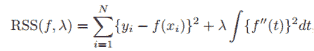
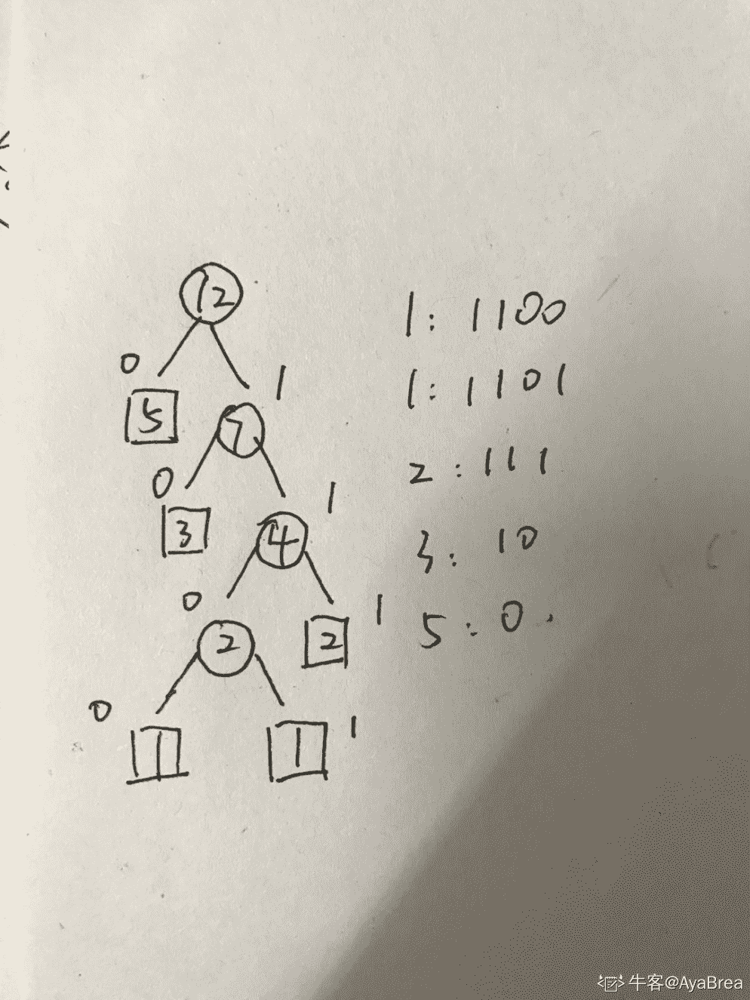
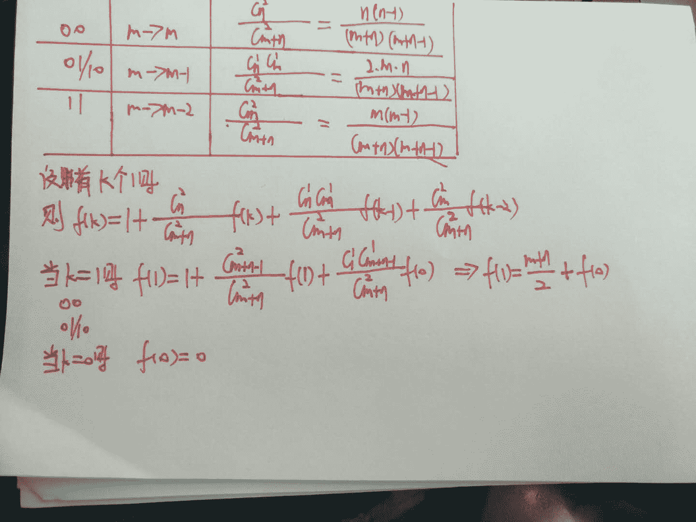

# 爱奇艺 2018 秋季校招算法工程师（第二场）

## 1

下面关于 B+树的叙述中，错误的是 ________。

正确答案: D   你的答案: 空 (错误)

```cpp
是多路平衡树
```

```cpp
可用于文件的索引结构
```

```cpp
可进行顺序查找
```

```cpp
关键字指向实际数据块
```

本题知识点

算法工程师 爱奇艺 2018

讨论

[脱离了高级趣味](https://www.nowcoder.com/profile/6764946)

B+树为多路平衡查找树，为了减少频繁 IO 读写的效率问题，用于文件，数据库索引通常 B+树上有两个指针，一个指向根节点，一个指向关键字最小的叶子结点。所以 B+树可以进行两种查找：一是从最小关键字起的顺序查找，另一种是从根节点进行随机查找。[`blog.sina.com.cn/s/blog_4e0c21cc01010itp.html`](http://blog.sina.com.cn/s/blog_4e0c21cc01010itp.html)
n 棵子树中含有 n 个关键字，每个关键字不保存数据只用来索引，所有数据都保存在叶子结点。[`baike.baidu.com/item/B%2B%E6%A0%91`](https://baike.baidu.com/item/B%2B%E6%A0%91)

发表于 2017-12-19 09:51:59

* * *

## 2

以下关于贝叶斯网络和马尔科夫网络说法正确的是

正确答案: A   你的答案: 空 (错误)

```cpp
贝叶斯网络是有向图， 而马尔科夫网络是无向图
```

```cpp
贝叶斯网络和马尔科夫网络都是无向图， 只是网络结构差别
```

```cpp
贝叶斯网络和马尔科夫网络都是有向图， 只是网络结构差别
```

```cpp
贝叶斯网络为无向图， 而马尔科夫网络是有向图
```

本题知识点

算法工程师 爱奇艺 2018

讨论

[脱离了高级趣味](https://www.nowcoder.com/profile/6764946)

贝叶斯网络通常是有向无环图，无环是指因果关系构不成环装。马尔科夫网络也叫马尔科夫随机场是无向图模型。[`blog.csdn.net/weilianyishi/article/details/46475251`](http://blog.csdn.net/weilianyishi/article/details/46475251)

发表于 2017-12-19 10:10:21

* * *

## 3

在设计模式中，应该优先使用()关系从而实现复用。

正确答案: A   你的答案: 空 (错误)

```cpp
委派
```

```cpp
继承
```

```cpp
创建
```

```cpp
都不对
```

本题知识点

算法工程师 爱奇艺 2018

## 4

在一个 C 类地址段内，需要将网络划分为 7 个子网，每个子网有 15 个主机，则将使用哪个子网掩码 （）

正确答案: A   你的答案: 空 (错误)

```cpp
255.255.255.224
```

```cpp
255.255.224
```

```cpp
255.255.255.240
```

```cpp
都不是
```

本题知识点

算法工程师 爱奇艺 2018

讨论

[霍七](https://www.nowcoder.com/profile/1903667)

本题选【A】子网可用主机数=2 的 N 次方-2，其中 N 是主机号位数。等分的子网数量=2 的 M 次方，其中 M 是子网号位数。
C 类网络 16 位网络号、16 位主机号。
等分只能等分为 2 的幂次方，这里分 8 个，8=2 的 3 次方，所以需要划分 3 位子网号。
所以划分的子网 27 位网络号、5 位主机号。
27 位掩码就是 11111111   11111111   11111111   11100000
也就是 255.255.255.224
子网可用主机=2 的 5 次方-2=30

发表于 2017-12-21 19:17:49

* * *

[编程的渣渣啊啊啊](https://www.nowcoder.com/profile/8501721)

子网数：2^N 主机数：2^M-2

发表于 2018-04-06 10:15:36

* * *

## 5

以下哪个方法不是用于模型选择的

正确答案: D   你的答案: 空 (错误)

```cpp
交叉验证
```

```cpp
AIC
```

```cpp
BIC
```

```cpp
维特比算法
```

本题知识点

算法工程师 爱奇艺 2018

讨论

[麻瓜工程师](https://www.nowcoder.com/profile/6931418)

选择 D, Viterbi 算法是基于动态规划在给定模型的情况下确定出模型的最佳组合的一种算法，在运行时需要借助一个给定的评判标准来来对所有的可能进行排序，并选择得分最高的。例如搭配隐马尔科夫模型（HMM）在给定语音信号的情况下确定音频对应的文本。其中，每一个不同的马尔科夫状态都是一个均值和方差不同的正态分布模型，通过 VIterbi-decoding 就可以确定出，当前音频数据， 在当前模型下，对应的最可能的单词是什么。

发表于 2018-07-03 17:34:09

* * *

[XiaQing](https://www.nowcoder.com/profile/7441537)

维特比算法是一种[动态规划](https://baike.baidu.com/item/%E5%8A%A8%E6%80%81%E8%A7%84%E5%88%92)算法用于寻找最有可能产生观测事件序列的-维特比路径-隐含状态序列，特别是在马尔可夫信息源上下文和隐马尔可夫模型中。术语“维特比路径”和“维特比算法”也被用于寻找观察结果最有可能解释相关的动态规划算法。例如在统计句法分析中动态规划算法可以被用于发现最可能的上下文无关的派生(解析)的字符串，有时被称为“维特比分析”

发表于 2018-07-03 15:51:23

* * *

## 6

关于以下目标函数说法错误的是：

 

正确答案: D   你的答案: 空 (错误)

```cpp
当λ为无穷大的时候， f(x)为线性函数
```

```cpp
当λ为 0， 则 f(x)为任意能完全拟合样本点的函数
```

```cpp
对于一般的λ而言，存在最优解，最优解为自然三次样条曲线（natural cubic spline）
```

```cpp
对于一般的λ而言， 存在最优解， f(x)为线性函数
```

本题知识点

算法工程师 爱奇艺 2018

## 7

Linux 下哪个命令可以用于判断 host1 主机是否能够访问 host2 主机的端口

正确答案: C   你的答案: 空 (错误)

```cpp
ping
```

```cpp
ifconfig
```

```cpp
telnet
```

```cpp
netstat
```

本题知识点

算法工程师 爱奇艺 2018

讨论

[编程的渣渣啊啊啊](https://www.nowcoder.com/profile/8501721)

ping 检查 ip 是否联通，不能检查端口 Telnet ip 端口号——判断端口访问情况

发表于 2018-04-06 10:18:43

* * *

## 8

以下关于操作系统，说法错误的是（）

正确答案: B   你的答案: 空 (错误)

```cpp
用管程实现进程同步时，管程中的过程是不可中断的
```

```cpp
多道程序的执行失去了封闭性和再现性，因此多道程序系统不需要封闭性和再现性
```

```cpp
使用 SPOOLING 技术可以实现虚拟设备
```

```cpp
当 CPU 处于管态时，它可以执行计算机系统中的全部指令
```

本题知识点

算法工程师 爱奇艺 2018

## 9

有一个算法的递推关系式为：T(n) = 9 T(n / 3) + n，则该算法的时间复杂度为（）(^符号是幂的意思)

正确答案: D   你的答案: 空 (错误)

```cpp
O(n³)
```

```cpp
O(nlogn)
```

```cpp
O(n)
```

```cpp
O(n²)
```

本题知识点

算法工程师 爱奇艺 2018

讨论

[霍七](https://www.nowcoder.com/profile/1903667)

本题选【D】T(n) = 9 T(n / 3) + nT(n) = O(9 ^ log(3,n)) T(n) = O(3 ^ 2log(3,n))T(n) = O(n²) 

发表于 2017-12-21 19:15:36

* * *

[wongbynn](https://www.nowcoder.com/profile/4086025)

【D】T(n) = 9 T(n / 3) + n，可知 nlogba=n2nlogb⁡a=n2 ，令ε取 1，显然满足 Master 定理第一条，可以得到 T(n) = θ(n ^ 2)。

发表于 2018-01-23 15:07:07

* * *

[杰 9999](https://www.nowcoder.com/profile/5089042)

答案对吗？各位

发表于 2017-12-18 12:35:03

* * *

## 10

由下面 5 个点:1,1,2,3,5 构成的哈夫曼树的带权路径长度为（）

正确答案: C   你的答案: 空 (错误)

```cpp
23
```

```cpp
24
```

```cpp
25
```

```cpp
26
```

本题知识点

算法工程师 爱奇艺 2018

讨论

[霍七](https://www.nowcoder.com/profile/1903667)

本题选【C】点    编码 1    11001    11012    1113    105    0 故哈夫曼树的带权路径长度为 1*4+1*4+2*3+3*2+5*1=25

发表于 2017-12-21 19:10:10

* * *

[AyaBrea](https://www.nowcoder.com/profile/622744744)



发表于 2019-09-07 19:39:42

* * *

## 11

牛牛和羊羊都很喜欢青草。今天他们决定玩青草游戏。
最初有一个装有 n 份青草的箱子,牛牛和羊羊依次进行,牛牛先开始。在每个回合中,每个玩家必须吃一些箱子中的青草,所吃的青草份数必须是 4 的 x 次幂,比如 1,4,16,64 等等。不能在箱子中吃到有效份数青草的玩家落败。假定牛牛和羊羊都是按照最佳方法进行游戏,请输出胜利者的名字。

本题知识点

模拟 数学 算法工程师 爱奇艺 2018

讨论

[华科平凡](https://www.nowcoder.com/profile/4939096)

python 两行

参考：

[`blog.csdn.net/huyahuioo/article/details/80081031`](https://blog.csdn.net/huyahuioo/article/details/80081031)

一通秀的飞起的分析之后，模 5 为 1，3，4 时牛牛赢，否则输。***神奇

```cpp
for _ in range(int(input())):
    print("niu" if int(input())%5 in [1,3,4] else 'yang')
```

发表于 2019-03-15 22:19:45

* * *

[元气の悟空](https://www.nowcoder.com/profile/392974)

```cpp
#include<stdio.h>
int dp[10],n,x,i,j;
int main(){
    for(i=1;i<10;i++){
        int flag=0;
        for(j=1;j<=i;j*=4)
            if(dp[i-j]==0) flag=1;
        dp[i]=flag;
    }
    for(scanf("%d",&n),i=0;i<n;i++)
        scanf("%d",&x),printf("%s\n",dp[x%10]?"niu":"yang");
}

```

发表于 2017-11-29 13:04:48

* * *

[零葬](https://www.nowcoder.com/profile/75718849)

这种题一般都是找规律最快，和 leetcode292 题 Nim 游戏类似 1.  当 N%5==1 或 N%5==4，牛牛都可以把草的数量变为 0，而羊羊面对 0 的草堆必输，因此牛牛必赢。 
2.  当 N%5==0，牛牛只能吃 1 或 4，因此牛牛吃完后，剩余的草量只能为 1 或 4，对于两种情况，羊羊都能在吃完之后使剩余数量为 0。*正好与第一种情况互补*，因此羊羊必赢。
3.  当 N%5==2，牛牛只能把草的数量变为 1 或者 3（2-4+5），此时他当然只能选择 3，如此羊羊可以选择吃 1 个草来使得 N==2，因此羊羊可以做到：使牛牛始终面临的草量都为 2，其中特殊情况即 2，因此羊羊必赢。
4.  当 N%5==3，牛牛可以吃 1 个草，使得羊羊面临 N%5==2 的情况，*正好与第三种情况互补*，因此牛牛必赢。

```cpp
import java.io.BufferedReader;
import java.io.InputStreamReader;
import java.io.IOException;

public class Main {
    public static void main(String[] args) throws IOException {
        BufferedReader br = new BufferedReader(new InputStreamReader(System.in));
        String strN;
        while((strN = br.readLine()) != null){
            int n = Integer.parseInt(strN);
            for(int i = 0; i < n; i++)
                solve(Integer.parseInt(br.readLine()));
        }
    }

    private static void solve(int num) {
        if(num % 5 == 0 || num % 5 == 2)
            System.out.println("yang");
        else
            System.out.println("niu");
    }
}
``` 

发表于 2020-11-05 11:23:03

* * *

## 12

牛牛和羊羊非常无聊.他们有 n + m 个共同朋友,他们中有 n 个是无聊的,m 个是不无聊的。每个小时牛牛和羊羊随机选择两个不同的朋友 A 和 B.(如果存在多种可能的 pair(A, B),任意一个被选到的概率相同。),然后牛牛会和朋友 A 进行交谈,羊羊会和朋友 B 进行交谈。在交谈之后,如果被选择的朋友之前不是无聊会变得无聊。现在你需要计算让所有朋友变得无聊所需要的时间的期望值。

本题知识点

数学 算法工程师 爱奇艺 2018

讨论

[泣血残阳](https://www.nowcoder.com/profile/6759318)

```cpp
#include <iostream>
#include <cstdio>
#include <string>
#include <vector>
#include <cmath>

using namespace std;

double roundk(double num, int k) {
    return round(num * pow(10, k)) / pow(10, k);
}

int main() {
    int n, m;
    scanf("%d%d", &n, &m);
    int s = n + m;
    double f0 = 0, f1 = s / 2.0;
    for(int k = 2; k <= m; k++) {
        double cur = s * (s - 1) / (1.0 * k * (2 * s - k - 1)) + 2 * (s - k) * 1.0 / (2 * s - k - 1) * f1 + (k - 1) * 1.0 / (2 * s - k - 1) * f0;
        f0 = f1;
        f1 = cur;
    }
    printf("%.1f\n", roundk(f1, 1));
    return 0;
}
```

本题考察递推公式，设总共有 s 个 0,1(s >= 2)，每次从其中随机选出 2 个，将这两个数中的 1 变成 0，试求平均多少次操作后，s 个数全部变成 0\.

当 s 个数中有 k 个 1 时，设平均需要 f(k)次操作使得 s 个数全部变成 0.一次操作后有 3 种可能性，即 k --> k, k --> k - 1, k --> k - 2.分别表示取出了 00， 01 或 10,11.这三种情况的概率分别为 C(s - k, 2)/C(s, 2), (s - k) * k / C(s, 2), C(k, 2)/C(s, 2). 由此可以得到 f(k)的递推公式.

f(k) = 1 + C(s - k, 2) / C(s, 2) *f(k) + (s - k)* k / C(s, 2) *f(k - 1) + C(k, 2) / C(s, 2)* f(k - 2)

化简此递推公式，即得到 k 到 k-1，k-2 的递推公式。当 k=1 时，是特殊情况，由分析可以得到 f(1) = f(0) + s / 2, f(0) = 0.综上得解.

编辑于 2018-02-24 13:42:34

* * *

[nbgao](https://www.nowcoder.com/profile/211289)

```cpp
#include <bits/stdc++.h>
using namespace std;

int main(){
    int n, m, s;
    scanf("%d%d", &n, &m);
    double f[m+1];
    s = n + m;
    double p = 1.0*s*(s-1)/2;
    for(int i=1;i<=m;i++){
        int x=i, y=s-i;
        double a = 1.0*y*(y-1)/2 / p;
        double b = 1.0*y*x / p;
        double c = 1.0*x*(x-1)/2 / p;
        f[i] += b*(f[i-1]+1);
        if(i>1)
            f[i] += c*(f[i-2]+1);
        f[i] += a;
        f[i] /= (1-a);
    }
    printf("%.1lf\n", f[m]);
    return 0;
}
```

发表于 2020-10-13 01:04:35

* * *

[v-space](https://www.nowcoder.com/profile/692836616)



发表于 2019-05-23 11:49:16

* * *

## 13

牛牛得到一个长度为 n 的整数序列 V,牛牛定义一段连续子序列的幸运值为这段子序列中最大值和次大值的异或值(次大值是严格的次大)。牛牛现在需要求出序列 V 的所有连续子序列中幸运值最大是多少。请你帮帮牛牛吧。

本题知识点

排序 *贪心 数组 分治 算法工程师 爱奇艺 2018* *讨论

[元气の悟空](https://www.nowcoder.com/profile/392974)

```cpp
#include<stdio.h>
#include<stack>
#include<algorithm>
using namespace std;
int main(){
    int n,i,res=0,x;
    stack<int> s;
    for(scanf("%d",&n),i=0;i<n;i++){
        scanf("%d",&x);
        while(s.size()&&s.top()<=x)
            res=max(res,x^s.top()),s.pop();
        if(s.size()) res=max(res,x^s.top());
        s.push(x);
    }
    printf("%d\n",res);
}

```

编辑于 2017-11-28 22:39:34

* * *

[乔碧萝殿下](https://www.nowcoder.com/profile/1416417)

```cpp
import java.util.Scanner;

public class Main{
    public static void main(String[] args){
        Scanner sc = new Scanner(System.in);
        int n = sc.nextInt();
        int[] arr = new int[n];
        for(int i = 0; i < n; i++) {
            arr[i] = sc.nextInt();
        }
        int max = Integer.MIN_VALUE;
        for(int j = 0; j < n; j++) {
            // 标志每个节点都为次最大值
            int secondIndex = arr[j];
                         // 向前找 找出最大值
            int first = 0;
            int firstMax = 0;
            int index1 = j;
            while(index1 != 0) {
                if(arr[index1 - 1] > arr[j]) {
                    first = arr[index1 - 1]; 
                    break;// 如果找到了就退出循环
                }
                index1--;
            }
            firstMax = first ^ secondIndex;
            max = Math.max(max, firstMax);

            // 向后找 找出最大值
            int second = 0;
            int secondMax = 0;
            int index2 = j;
            while(index2 != arr.length - 1) {
                if(arr[index2 + 1] > arr[j]) {
                    second = arr[index2 + 1];
                    break;// 如果找到了就退出循环
                }
                index2++;
            }
            secondMax =second ^ secondIndex;
            max = Math.max(secondMax, max);
        }
        System.out.println(max);
        sc.close();
    }
}

```

发表于 2019-03-19 17:19:04

* * *

[茶月猫](https://www.nowcoder.com/profile/313152308)

本回答单纯献给读不懂题目的小伙伴们看。因为题目描述，理解没到位，所以代码也写错了。题目中说的连续子序列，不是指单调递增或者递减啥的，而是保持该序列相对位置不变，里面的从任意某点开始到任意某点，都可以称作为连续子序列。测试样例分析：5 2 1 4 3 其中子序列 5,2 求出来异或为 7；子序列 4,3 求出来异或也为 7。这两种情况是异或最大的了，所以最后输出是 7\.

发表于 2019-04-24 23:02:00

* * **