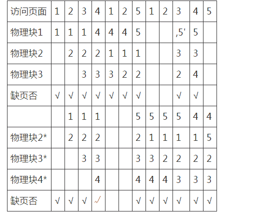
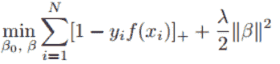
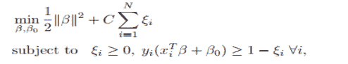
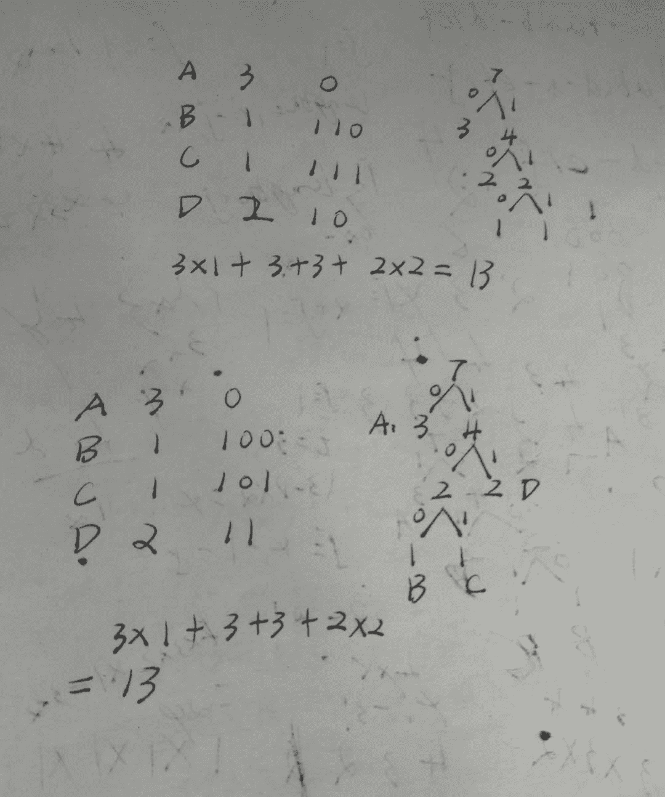

# 爱奇艺 2018 秋季校招算法工程师（第一场）

## 1

当分配给一个进程的页面数增加时，页故障数可能增大也可能变小，下述算法符合这种情况的是

正确答案: A   你的答案: 空 (错误)

```cpp
FIFO 算法
```

```cpp
LRU 算法
```

```cpp
Clock 算法
```

```cpp
LFU 算法
```

本题知识点

算法工程师 爱奇艺 2018

讨论

[爱吃青菜皮卷面的 byr](https://www.nowcoder.com/profile/1411365)

先进先出(FIFO)页面置换算法优先淘汰最早进入内存的页面，亦即在内存中驻留时间最久的页面。该算法实现简单，只需把调入内存的页面根据先后次序链接成队列，设置一个指针总指向最早的页面。但该算法与进程实际运行时的规律不适应，因为在进程中，有的页面经常被访问。

FIFO 算法还会产生当所分配的物理块数增大而页故障数不减反增的异常现象，这是由 Belady 于 1969 年发现，故称为 Belady 异常，如图 3-28 所示。只有 FIFO 算法可能出现 Belady 异常，而 LRU 和 OPT 算法永远不会出现 Belady 异常。缺页中断就是要访问的页不在主存，需要操作系统将其调入主存后再进行访问。在这个时候，被内存[映射](https://baike.baidu.com/item/%E6%98%A0%E5%B0%84)的文件实际上成了一个分页交换文件。
可以看出物理块为 3 的时候缺页次数为 9，增大为 4 的时候缺页数反而是 10

发表于 2017-11-28 15:44:46

* * *

## 2

一个提供 NAT 服务的路由器在转发一个源 IP 地址为 10.0.0.1、目的 IP 地址为 131.12.1.1 的 IP 分组时，可能重写的 IP 分组首部字段是Ⅰ.TTLⅡ.片偏移量Ⅲ.源 IP 地址Ⅳ.目的 IP 地址

正确答案: C   你的答案: 空 (错误)

```cpp
仅Ⅰ
```

```cpp
仅 I、Ⅱ
```

```cpp
仅Ⅰ、Ⅱ、III
```

```cpp
Ⅰ、Ⅱ、Ⅲ、Ⅳ
```

本题知识点

算法工程师 爱奇艺 2018

讨论

[巡](https://www.nowcoder.com/profile/2957108)

当有数据包传到路由器时，路由器首先将其的目的地址与路由表进行对比，如果是本地网络，将不会进行转发到外网络，而是直接转发给本地网内的目的主机；**但是如果目的地址经路由表对比，发现不是在本网中，**路由**就将改变源地址的 IP（原源地址的 Ip 地址改为了路由器的 IP 地址），**路由器将数据包转发到相应的端口，进行通信。

发表于 2017-12-05 22:01:08

* * *

[编程的渣渣啊啊啊](https://www.nowcoder.com/profile/8501721)

当分组在本网段时，直接转给本网段的目的地址；若不在本网段，则改变源 ip 地址为本路由 ip 地址，并转发到别的网段中去

发表于 2018-04-07 10:13:23

* * *

## 3

在深度学习网络中， 以下哪种技术不是主要用来做网络正则化的（提升模型泛化能力）

正确答案: D   你的答案: 空 (错误)

```cpp
dropout
```

```cpp
参数共享
```

```cpp
Early stopping
```

```cpp
Pooling
```

本题知识点

算法工程师 爱奇艺 2018

讨论

[chopin7776](https://www.nowcoder.com/profile/8020385)

参数共享是为了减少参数的数量，减少参数数量可以防止过拟合，因为参数很多的话，神经网络可以记住训练集上的输入和输出，这样的话模型在训练集上表现很好，在测试集上表现很差。

发表于 2017-12-02 18:31:28

* * *

[真的不帅](https://www.nowcoder.com/profile/6525586)

池化技术用于对卷积映射层的特征提取，有最大，最小，平均等等，仅作为特征提取的手段。 p.s 很久看了已经忘了，其实我做错了，然后才想起来。我选的是参数共享，因为我只记得参数共享可以降低网络复杂度～～

发表于 2017-12-01 14:36:43

* * *

[kupu](https://www.nowcoder.com/profile/710017941)

池化可以保留比较显著的特征，提升模型的畸变容忍能力

发表于 2019-03-01 15:12:12

* * *

## 4

[机器学习]以下不属于有监督的词义消歧方法的是

正确答案: D   你的答案: 空 (错误)

```cpp
Flip-Flop 算法
```

```cpp
贝叶斯分类器
```

```cpp
最大熵消歧
```

```cpp
基于词典的消歧
```

本题知识点

算法工程师 爱奇艺 2018

讨论

[霍七](https://www.nowcoder.com/profile/1903667)

        本题选【D】。        语义有歧义，主要是因为歧义词在不同的语境有不同的含义。消歧的任务就是根据上下文环境确定一个歧义词的确切含义。消歧的方法主要有以下三类：        （1）基于词典的词义消歧
        基于词典的词义消歧方法研究的早期代表工作是 Lesk 于 1986 的工作。给定某个待消解词及其上下文，该工作的思想是计算语义词典中各个词义的定义与上下文之间的覆盖度，选择覆盖度最大的作为待消解词在其上下文下的正确词义。但由于词典中词义的定义通常比较简洁，这使得与待消解词的上下文得到的覆盖度为０，造成消歧性能不高。        （2）有监督消歧        有监督的消歧方法使用词义标注语料来建立消歧模型，研究的重点在于特征的表示。有监督学习算法有很多种，而其中 NLP 常用的两个理论是【贝叶斯分类】和【信息论】，【最大熵消歧】也是一种有监督学习，而【Flip-Flop 算法】是一种基于信息论的算法。        （3）无监督消歧

发表于 2017-12-21 10:17:47

* * *

[小河沟大河沟](https://www.nowcoder.com/profile/773262)

- 看到词典，感觉会用到聚类算法，所以是无监督的

发表于 2017-12-19 16:11:32

* * *

[真的不帅](https://www.nowcoder.com/profile/6525586)

b c 很显然是监督反向传播算法，嗯，做错了，我不知道 flip-flop 是什么算法，谁可以告诉偶

发表于 2017-12-01 14:38:34

* * *

## 5

SVM 的以下两种模型表达是等价的， 则其中的正则化系数λ和 C 的关系为：

形式一：

 

形式二： 

正确答案: B   你的答案: 空 (错误)

```cpp
λ=C
```

```cpp
λ=1/C
```

```cpp
λ=C 的平方
```

本题知识点

算法工程师 爱奇艺 2018

讨论

[没烦恼 2](https://www.nowcoder.com/profile/9988153)

就是看损失函数两项的系数比例，式子 1 中，正则项比误差项为 lamda/2；式子 2 中正则项比误差项为 1/2C,两项相等，求出 lamda.C=1

发表于 2017-12-07 01:23:55

* * *

## 6

若前缀表达式为-+a*b-cd/ef，后缀表达式为 abcd-*+ef/-，那么对应二叉树的中序遍历序列是（）

正确答案: B   你的答案: 空 (错误)

```cpp
a+c*d-b-e/f
```

```cpp
a+b*c-d-e/f
```

```cpp
a+b*d-c-e/f
```

```cpp
a+e*c-d-b/f
```

本题知识点

算法工程师 爱奇艺 2018

讨论

[霍七](https://www.nowcoder.com/profile/1903667)

        前缀表达式和后缀表达式都是没有括号的【算术表达式】，注意区别于二叉树的前序遍历和后序遍历。本题的前缀表达式和后缀表达式对应的中缀表达式为：a+b*(c-d)-e/f。 

发表于 2017-12-21 10:23:03

* * *

[haihao1881](https://www.nowcoder.com/profile/2216580)

我知道的的由序列重建二叉树，都是需要中序列的；真不知道怎么由其他序列求中序列。。。

发表于 2017-12-06 17:39:32

* * *

[食堂在逃干饭王](https://www.nowcoder.com/profile/5786634)

从后缀表达式可以直接推出中序遍历了。

发表于 2021-02-15 15:56:13

* * *

## 7

对于字符串"ABCDADA"的二进制哈夫曼编码有多少位?

正确答案: C   你的答案: 空 (错误)

```cpp
11
```

```cpp
12
```

```cpp
13
```

```cpp
14
```

本题知识点

算法工程师 爱奇艺 2018

讨论

[牛客 1659416](https://www.nowcoder.com/profile/6422446)

是这么算吗？

发表于 2018-03-30 16:06:27

* * *

[霍七](https://www.nowcoder.com/profile/1903667)

本题选【C】
字符    频次    编码
A        3        1
B        1        000
C        1        001
D        2        01
二进制哈夫曼编码共 13 位。

编辑于 2017-12-21 10:32:42

* * *

[牛客 3134910 号](https://www.nowcoder.com/profile/3134910)

a 出现 3 次，b 出现 1 次…c，d 略 构建哈夫曼树，首先选择最小的两个次数，b，c ，然后选择 d，最后选择 a 构建哈夫曼树后，左侧节点是 0，右侧是 1。 a 1 b 000 c 001 d 01 计算可得 13

发表于 2017-12-04 17:18:35

* * *

## 8

下面关于选择排序说法正确的是()

正确答案: D   你的答案: 空 (错误)

```cpp
每扫描一遍数组，需要多次交换
```

```cpp
选择排序是稳定的排序方法,因为时间复杂度是固定的 O（n²）
```

```cpp
选择排序排序速度一般要比冒泡排序快
```

```cpp
空间复杂度为 O（1）
```

本题知识点

算法工程师 爱奇艺 2018

讨论

[霍七](https://www.nowcoder.com/profile/1903667)

        本题选【D】        选择排序（Selection sort）是一种简单直观的排序算法。        A. 选择排序的工作原理是每一次从待排序的数据元素中选出最小（或最大）的一个元素，存放在序列的起始位置，直到全部待排序的数据元素排完。所以每扫描一遍数组，只需要交换一次。        B. 选择排序是不稳定的排序方法（比如序列[5， 5， 3]第一次就将第一个[5]与[3]交换，导致第一个 5 挪动到第二个 5 后面）。        C. 选择排序排序速度一般要比冒泡排序慢。

发表于 2017-12-21 10:35:26

* * *

[是不是](https://www.nowcoder.com/profile/8808515)

额外的空间用来做交换

发表于 2017-12-14 15:46:38

* * *

## 9

在 UML 建模中，下列哪个 UML 的图一般用于描述软件系统的需求()

正确答案: C   你的答案: 空 (错误)

```cpp
状态图
```

```cpp
协作图
```

```cpp
用例图
```

```cpp
顺序图
```

本题知识点

算法工程师 爱奇艺 2018

讨论

[阿🍐的小🐱🐱](https://www.nowcoder.com/profile/152168190)

[`www.cnblogs.com/jiangds/p/6596595.html`](https://www.cnblogs.com/jiangds/p/6596595.html)

发表于 2019-07-03 10:09:43

* * *

[真的不帅](https://www.nowcoder.com/profile/6525586)

啊哈，我不会 uml

发表于 2017-12-01 14:39:10

* * *

## 10

一个合法的括号匹配序列有以下定义:
1、空串""是一个合法的括号匹配序列
2、如果"X"和"Y"都是合法的括号匹配序列,"XY"也是一个合法的括号匹配序列
3、如果"X"是一个合法的括号匹配序列,那么"(X)"也是一个合法的括号匹配序列
4、每个合法的括号序列都可以由以上规则生成。
例如: "","()","()()","((()))"都是合法的括号序列
对于一个合法的括号序列我们又有以下定义它的深度:
1、空串""的深度是 0
2、如果字符串"X"的深度是 x,字符串"Y"的深度是 y,那么字符串"XY"的深度为 max(x,y) 3、如果"X"的深度是 x,那么字符串"(X)"的深度是 x+1
例如: "()()()"的深度是 1,"((()))"的深度是 3。牛牛现在给你一个合法的括号序列,需要你计算出其深度。

本题知识点

栈 *字符串 *递归 穷举 算法工程师 爱奇艺 2018** **讨论

[华科平凡](https://www.nowcoder.com/profile/4939096)

python 解法

思路太简单了。
用一个中间数组保存左括号的数量，不断遍历字符串，碰到左括号就扔到这个数组里，碰到右括号就从数组里取出来一个左括号与之平衡掉。
在放入左括号时，每次都要计算数组的长度，其中最大的长度就是深度

```cpp
a = input()
arr, res = [], 0
for i in a:
    if i == "(":  # 如果为左括号，直接扔进 arr 数组
        arr.append("(")
        res = max(res, len(arr))
    else:  # 此时为右括号
        arr.pop(-1)
print(res) 
```

发表于 2019-03-02 14:28:55

* * *

[fixit](https://www.nowcoder.com/profile/5911630)

```cpp
s=raw_input()
if len(s)==0:
    print(0)
a=[]
max1=0
for i in s:
    if i=='(':
        a.append(i)
        max1=max(len(a),max1)
    else:
        a.pop()
print(max1)

```

发表于 2017-12-10 16:16:26

* * *

[霍七](https://www.nowcoder.com/profile/1903667)

本套 3 道题的 C++代码已挂到了我的 GitHub([`github.com/shiqitao/NowCoder-Solutions`](https://github.com/shiqitao/NowCoder-Solutions))，牛客网上的其他题目解答也在持续更新。

```cpp
#include <iostream>
#include <string>
#include <algorithm>
using namespace std;
int main()
{
    string sequence; cin >> sequence;
    int depth = 0, maxDepth = 0;
    for (int i = 0; i < sequence.length(); i++) {
        if (sequence[i] == '(') {
            depth++;
            maxDepth = max(maxDepth, depth);
        }
        else depth--;
    }
    cout << maxDepth << endl;
    return 0;
} 
```

发表于 2017-12-21 10:38:25

* * *

## 11

牛牛养了 n 只奶牛,牛牛想给每只奶牛编号,这样就可以轻而易举地分辨它们了。 每个奶牛对于数字都有自己的喜好,第 i 只奶牛想要一个 1 和 x[i]之间的整数(其中包含 1 和 x[i])。
牛牛需要满足所有奶牛的喜好,请帮助牛牛计算牛牛有多少种给奶牛编号的方法,输出符合要求的编号方法总数。

本题知识点

贪心 排序 *数学 算法工程师 爱奇艺 2018* *讨论

[向宇回桌](https://www.nowcoder.com/profile/520872)

把奶牛所希望的编号排个序，然后就是乘法原理了。比如 4 3 9 6， 排序为 3 4 6 9。第一个奶牛有 3 种取法，第二只奶牛有(4-1)种取法，第三头奶油有(6-2)种取法，第四匹奶牛就有 9-3 种取法。

```cpp
import java.util.*;

public class Main {
    private static final long MOD = 1000000007;
    public static void main(String[] args) {
        Scanner sc = new Scanner(System.in);
        int n = sc.nextInt();
        int[] nums = new int[n];
        for (int i=0; i!=n; i++) {
            nums[i] = sc.nextInt();
        }
        Arrays.sort(nums);
        long ans = 1;
        for (int i=0; i!=n; i++) {
            ans *= ((nums[i] - i) % MOD);
            ans %= MOD;
        }
        System.out.println(ans);
    }
}

```

发表于 2019-03-02 19:01:37

* * *

[牛客 1659416](https://www.nowcoder.com/profile/6422446)

先给 x[i]最小的奶牛(假设为 i1 )编号，共有 x[ i1 ]种编号方法，然后给 x[i]第二小的奶牛(假设为 i2 )编号，这时共有 x[i2]-1 种编号方法(因为 i1 已经先选走了 1 个编号)，接着给 x[i]第三小的奶牛(假设为 i3 )编号，此时共有 x[i3]-2 种编号方法(因为 i1 和 i2 已经选走了 2 个编号)...所以编号方法总数为  x[i1]*(x[i2]-1)*(x[i3]-2)*...*(x[in]-(n-1))。可以先对 x[i]按从小到大排好序，所以编号方法总数为 x[0]*(x[1]-1)*(x[2]-2)*...*(x[n-1]-(n-1))。

```cpp

	#include <iostream>

	#include <algorithm>

	using namespace std;

	long long mod=1000000007;

	int main()

	{

	    int n;

	    while( cin >> n )

	    {

	        int a[n];

	        for(int i=0; i<n; i++)

	            cin >> a[i];

	        sort(a,a+n);

	        long long counts=1;

	        for(int i=0; i<n; i++)

	        {

	            counts=((a[i]-i)*counts)%mod;

	        }

	        cout << counts << endl;

	    }

	}

```

编辑于 2018-03-30 17:57:08

* * *

[元气の悟空](https://www.nowcoder.com/profile/392974)

```cpp
#include<stdio.h>
#include<algorithm>
using namespace std;
int main(){
    int n,i,x,a[100];
    long long res=1,mod=1000000007;
    for(scanf("%d",&n),i=0;i<n;i++) scanf("%d",a+i);
    for(sort(a,a+n),i=0;i<n;i++) res=res%mod*(a[i]-i)%mod;
    printf("%lld",res);
}

```

发表于 2017-11-29 12:37:56

* * *

## 12

设置 tcp 的哪个 socket 参数会影响了 nagle 算法？

正确答案: D   你的答案: 空 (错误)

```cpp
TCP_MAXSEG
```

```cpp
TCP_KEEPALIVE
```

```cpp
TCP_SYNCNT
```

```cpp
TCP_NODELAY
```

本题知识点

算法工程师 爱奇艺 2018

讨论

[W-M.Jupiter](https://www.nowcoder.com/profile/7246366)

 TCP_NODELAY：默认情况下，发送数据采用 Negale 算法。这样虽然提高了网络吞吐量，但是实时性却降低了，在一些交互性很强的应用程序来说是不允许的，使用 TCP_NODELAY 选项可以禁止 Negale 算法。此时，应用程序向内核递交的每个数据包都会立即发送出去。需要注意的是，虽然禁止了 Negale 算法，但网络的传输仍然受到 TCP 确认延迟机制的影响。

发表于 2018-04-21 19:26:29

* * *

## 13

如果一个字符串 S 是由两个字符串 T 连接而成,即 S = T + T, 我们就称 S 叫做平方串,例如"","aabaab","xxxx"都是平方串.
牛牛现在有一个字符串 s,请你帮助牛牛从 s 中移除尽量少的字符,让剩下的字符串是一个平方串。换句话说,就是找出 s 的最长子序列并且这个子序列构成一个平方串。

本题知识点

字符串 *动态规划 算法工程师 爱奇艺 2018* *讨论

[程橙橙要码力全开](https://www.nowcoder.com/profile/5299831)

暴力方法，每个位置切一刀，字符串变成了两个部分，然后用动态规划求两个字符串的最长公共子序列，最后返回整体的最大值

```cpp

	#include<iostream>

	#include<string>

	usingnamespacestd;

	intMaxLength(string s,ints2)//从 s2 位置把字符串切开

	{

	    intc[50][50]={0};

	    if(s2 >= s.size())    return0;

	    intsize1 = s2, size2 = s.size() - s2; for(inti = 1; i <= size1; i++){

	        for(intj = 1; j <= size2; j++){

	            if(s[i - 1] == s[s2 + j - 1]){

	                c[i][j] = c[i - 1][j - 1] + 1;

	            }

	            else{

	                c[i][j] = max(c[i - 1][j], c[i][j - 1]);

	            }

	        }

	    }

	    returnc[size1][size2];

	}

	intmain()

	{

	    string str;

	    cin>>str;

	    intmax=0;

	    intsize=str.size();

	    for(inti=0;i<size;i++)

	    {

	        inttmp;

	        tmp=MaxLength(str,i);

	        if(tmp>max)

	            max=tmp;

	    }

	    cout<<2*max;

	    return0;

	}

```

编辑于 2017-11-28 13:08:33

* * *

[fixit](https://www.nowcoder.com/profile/5911630)

```cpp
def max1(s1,s2):
    lens=[[0]*(len(s2)+1) for _ in range(len(s1)+1)]
    for i in range(1,len(s1)+1):
        for j in range(1,len(s2)+1):
            if s1[i-1]==s2[j-1]:
                lens[i][j]=lens[i-1][j-1]+1 
            else:
                lens[i][j]=max(lens[i-1][j],lens[i][j-1])
    return lens[len(s1)][len(s2)]
s=raw_input()
max2=0
for i in range(1,len(s)):
    max2=max(max1(s[:i],s[i:]),max2)
print max2*2

```

发表于 2017-12-10 17:54:09

* * *

[酸辣粉不要辣 _](https://www.nowcoder.com/profile/804770773)

```cpp
s = input()
c = []
for index in range(1, len(s)):
    a = s[:index]
    b = s[index:]
    arr = [[0 for i in range(len(b) + 1)] for j in range(len(a) + 1)]
    num = 0
    for i in range(len(a)):
        for j in range(len(b)):
            if a[i] == b[j]:
                arr[i+1][j+1] = arr[i][j] + 1
                num = max(num, arr[i+1][j+1])
            else:
                arr[i+1][j+1] = max(arr[i+1][j], arr[i][j+1])
                num = max(num, arr[i+1][j+1])
    c.append(num)
print(max(c)*2)

```

动态规划求解最长公共子序列，将给定的字符串遍历截断为两部分，然后求得的最长公共子序列的长度的两倍就是我们需要的输出

发表于 2019-06-16 17:23:24

* * *****