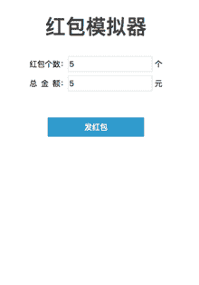
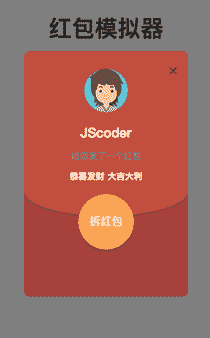
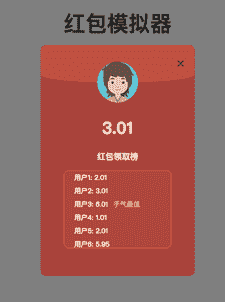
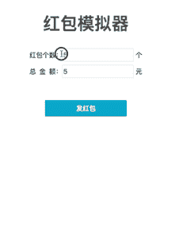

# 字节跳动 2018 校招前端方向（第四批）

## 1

以下函数用于将一颗二叉搜索树转换成一个有序的双向链表。要求不能创建任何新的节点，只能调整树种节点指针的指向。

如输入下图中左边的二叉搜索树，则输出转换后的排序双向链表：

      10

    /      \

   6      14

  /  \      /  \

4   8  12  16

转换成：

 4 <=> 6 <=> 8 <=> 10 <=> 12  <=> 14 <=> 16

请指出程序代码中错误的地方（问题不止一处，请尽量找出所有你认为错误的地方）： 

1  #include <stack>

2  using namespace std;

3

4  struct TreeNode {

5        int val;  

6        TreeNode *left, *right;  

7  };

8

9  TreeNode* Convert(TreeNode* root){  

10         if (root == NULL)  

11             return root;

12

13         TreeNode* listHead = NULL;

14         TreeNode* listLastNode = NULL;

15

16         stack<TreeNode*> s;

17         while(root){

18             while(root){

19                 root=root->left;

20                 s.push(root);

21             }

22             root=s.top();  

23             s.pop();

24             if (listHead == NULL){

25                 listHead = root;

26             }else{

27                 listLastNode->right = root;

28             }

29             listLastNode = root;

30             root= root->right;

31         }

32         return listHead;

33 }

你的答案

本题知识点

前端工程师 字节跳动 2018

讨论

[jmfang](https://www.nowcoder.com/profile/6802484)

[`blog.csdn.net/l_tudou/article/details/51753921`](http://blog.csdn.net/l_tudou/article/details/51753921)

发表于 2018-03-21 20:56:03

* * *

[toptupper 航](https://www.nowcoder.com/profile/108137697)

#include <bits>using namespace std;

TreeNode* Convert(TreeNode* root) {
    if(root == NULL)    return NULL;
    TreeNode* listHead = NULL;
    TreeNode* listLastHead = NULL;
    stack<TreeNode*> s;

    while(root || !s.empty()) {
        while(root) {
            s.push(root);
            root = root->left;
        }
        root = s.top();
        s.pop();
        if(listHead == NULL) {
            listHead = root;
        } else {
            listHead->left = listLastHead;
            listLastHead->right = listHead;
        }
        listLastHead = root;
        root = root->right;
    }
}

发表于 2021-03-07 15:58:21

* * *

[-koil___](https://www.nowcoder.com/profile/681646819)

```cpp
    TreeNode* Convert(TreeNode* root)
    {
        if(root==NULL)
            return NULL;
        TreeNode* listHead = NULL;
        TreeNode* listLastNode = NULL;
        stack<TreeNode*> s;
        while(root||!s.empty()){
            while(root){
                s.push(root);
                root=root->left;
            }
            root=s.top();  
            s.pop();
            root->left=listLastNode;
            if (listHead == NULL){
                listHead = root;
            }else{
                listLastNode->right = root;
            }
            listLastNode = root;
            root=root->right;
        }
        while(listHead&&listHead->left)
            listHead=listHead->left;
        return listHead;
    }
```

发表于 2019-08-21 00:10:05

* * *

## 2

设计一个红包生成的模拟器，要求实现如下功能设计： 图一: 开始页面 

图二: 生成过程页面

 

图三: 结果页面

 

图四: 整体效果(动态)



图五: 头像素材地址：

[`s3a.pstatp.com/cg_growth/resource/boilerplaimg/redpacket/avatar.png`](http://s3a.pstatp.com/cg_growth/resource/boilerplaimg/redpacket/avatar.png)

设计需求

1\. 页面上支持自定义红包输入的个数和金额，数值类型不能为空且必须大于 1，效果如图一所示

2\. 点击发送红包按钮，可以进入红包生成的 loading 页面，效果如图二所示，模态框的宽高为 300*450px，垂直居中页面，包含必要的头像和文案，拆红包按钮可以围绕中轴线做旋转动画

3\. 点击拆红包按钮后，会有一个向上的开红包的动画，根据前面输入的个数和金额生成红包获取列表，红包生成规则见附注。

4\. 金额最高的作为“手气最佳”进行标注，见图三中的领取榜单所示

5\. 从生成的红包列表中随机取出一个值作为你抢到的红包值，见图三中头像下的数字所示

6\. 点击右上角的关闭按钮，可以关闭弹框，同时清空领取榜单里的记录，方便下次重新生成

红包生成规则

1\. 红包的数值是随机的，并且数值的分布近似于正态分布。

2\. 所有人都能分到红包，不会出现红包数值为 0 的情况，额度在 0.01 和(剩余平均值*2)之间。

3\. 所有人的红包数值加起来等于支付的金额

4\. 整体效果参考动态图，可以根据自身能力的情况侧重完成所擅长的环节(css 页面，js 交互，生成逻辑等) 

你的答案

本题知识点

前端工程师 字节跳动 2018

讨论

[&miao~](https://www.nowcoder.com/profile/6902358)

<meta charset="utf-8">
<style>
.startWrapper {
  position: absolute;
  width: 300px;
  height: 200px;
  left: 50%;
  top: 20%;
  transform: translate(-50%, 0);
  text-align: center;
}
.formWrapper label{
  display: inline-block;
  width: 70px;
  text-align: center;
}
.money {
  letter-spacing: 5px;
}
.formWrapper button {
  margin-top: 10px;
  padding: 5px 0;
  background-color: #63B8FF;
  width: 140px;
  color: white;
}
.playWrapper {
  position: absolute;
  left: 0;
  top: 0;
  width: 100%;
  height: 100%;
  background-color: rgba(143,143,143,0.5);
  text-align: center;
  display: none;
}
.play {
  width: 300px;
  height: 450px;
  position: absolute;
  left: 50%;
  top: 50%;
  transform: translate(-50%, -50%);
  background-color: #B22222;
  opacity: 1;
  border-radius: 10px;
  overflow: hidden;
}
.info {
  position: relative;
  top: 40px;
}
.info img {
  border-radius: 35px;
}
.info article {
  font-size: 15px;
}
.info article h3, .info article h4 {
  color: white;
}
.info article h4:nth-of-type(1) {
  color: grey;
}
.play button[name=get] {
  width: 80px;
  height: 80px;
  border-radius: 40px;
  background-color: orange;
  position: relative;
  top: 40px;
  animation: myrotate 1s infinite;
}
@keyframes myrotate {
  0% {
    transform: rotateY(0deg)
  }
  100% {
    transform: rotateY(360deg)
  }
}
.slide {
  position: absolute;
  width: 100%;
  bottom: 150px;
  height: 600px;
  border-radius: 70px;
  background-color: #EE6A50;
  z-index: -1;
  transition: bottom 0.4s;
}
.resultWrapper {
  display: none;
  position: relative;
  top: 50px;
  color: white;
}
.result {
  position: relative;
  left: 50px;
  width: 200px;
  height: 180px;
  font-size: 10px;
  background-color: rgba(238,121,66,0.5);
  border-radius: 10px;
  text-align: left;
  box-sizing: border-box;
  padding-left: 10px;
}
.result span {
  white-space: pre-wrap;
}
.result p span:nth-of-type(3) {
  display: none;
  color: #EEC900;
}
.close {
  position: absolute;
  top: 10px;
  right: 20px;
  width: 20px;
  height: 20px;
  font-size: 15px;
  color: white;
  background-color: #EE6A50;
}
</style>
<body>
  <div class="startWrapper">
    <h2>红包模拟器</h2>
    <form class="formWrapper" action="#" method="post">
      <div>
        <label for="total">红包个数</label><input type="text" name="total" value="0" /><span>个</span>
      </div>
      <div>
        <label for="money" class="money">总金额</label><input type="text" name="money" value="0" /><span>元</span>
      </div>
      <button type="button" name="send">发红包</button>
    </form>
  </div>
  <div class="playWrapper">
    <section class="play">
      <section class="info">
        
        <article>
          <h3>JScoder</h3>
          <h4>给您发送了一个红包</h4>
          <h4>恭喜发财 大吉大利</h4>
        </article>
      </section>
      <div class="slide"></div>
      <button type="button" name="get">拆红包</button>
      <section class="resultWrapper">
        <h2>3.01</h2>
        <h5>红包领取榜</h5>
        <article class="result">
          <p><span>用户 1: </span><span></span><span>    手气最佳</span></p>
          <p><span>用户 2: </span><span></span><span>    手气最佳</span></p>
          <p><span>用户 3: </span><span></span><span>    手气最佳</span></p>
          <p><span>用户 4: </span><span></span><span>    手气最佳</span></p>
          <p><span>用户 5: </span><span></span><span>    手气最佳</span></p>
          <p><span>用户 6: </span><span></span><span>    手气最佳</span></p>
        </article>
      </section>
      <div class="close">
        <p>X</p>
      </div>
    </section>
  </div>
</body>
<script>

const button1 = document.querySelector("button[name=send]"),
      totalDom = document.querySelector("input[name=total]"),
      moneyDom = document.querySelector("input[name=money]"),
      startWrapper = document.querySelector(".startWrapper"),
      playWrapper = document.querySelector(".playWrapper")

let total, money, result = []
button1.onclick = function() {
  total = totalDom.value
  money = moneyDom.value
  startWrapper.style.display = 'none'
  playWrapper.style.display = "block"
  console.log(total, money)
}

const button2 = document.querySelector("button[name=get]"),
      slide = document.querySelector(".slide"),
      info = document.querySelector(".info article"),
      resultWrapper = document.querySelector(".resultWrapper"),
      users = [...document.querySelectorAll(".result p span:nth-of-type(2)")]
      bests = [...document.querySelectorAll(".result p span:nth-of-type(3)")]

button2.onclick = function() {
  slide.style.bottom = "370px"
  info.style.display = "none"
  button2.style.display = "none"
  resultWrapper.style.display = "block"

  write()
}

function write() {
  result = calculate(money, 0.01, money/2, total)
  let besti = 0, cur = 0
  users.forEach((d, i) => {
    d.textContent = result[i]
    if (d > cur)
    cur = d
    besti = i
  })

  bests[besti].style.display = "inline"
}

function calculate(total, min, max, length) {
  const result = []
  let restValue = total
  let restLength = length
  for (let i = 0; i < length - 1; i++) {
    restLength--

    const restMin = restLength * min
    const restMax = restLength * max

    const usable = restValue - restMin

    const minValue = Math.max(min, restValue - restMax)

    const limit = Math.min(usable - minValue, (max - minValue) * 2)

    result[i] = Math.min(max, minValue + Math.floor(limit * Math.random()))
    restValue -= result[i]
  }
  result[length - 1] = restValue.toFixed(2)

  return result
}

function reset() {
  startWrapper.style.display = ""
  playWrapper.style.display = "none"

  slide.style.bottom = "150px"
  info.style.display = ""
  button2.style.display = ""
  resultWrapper.style.display = "none"

  bests.forEach((d) => d.style.display = "none")
}

const close = document.querySelector(".close")
close.onclick = function() {
  reset()
}
</script>

发表于 2018-01-29 13:18:27

* * *

[Month 丶](https://www.nowcoder.com/profile/7400867)

<!DOCTYPE html><html><head><title>红包++</title><style>*{padding: 0px;margin: 0px;}.container{width: 300px;height: 450px;position: absolute;top:50%;margin-top:-225px;left: 50%;margin-left: -150px;overflow: hidden;border-radius: 10px;}.start{width: 300px;height: 450px;margin: auto;padding: 10px;}.start h1{text-align: center;margin: 20px 0;}label{width: 80px;display: block;}.box{display: flex;margin: 10px;}.button{margin: 30px;text-align: center;}.btn{background: #07A8CA;color: #fff;width: 120px;height: 30px;line-height: 30px;border: none;}/*红包*/.money{width: 300px;height: 450px;border-radius: 10px;display: none;margin: 0 auto;position: relative;background: #A8413C;}.top{height: 320px;border-radius: 10px 10px 15% 15%;border: 1px solid #BD503A;background-color: #BD503A;transition: all 0.5s;z-index: -1;}.touxiang{position: absolute;top:10%;width: 100%;left: 0;z-index: 99;text-align: center;color: #fff;}.touxiang img{border-radius: 50%;width: 100px;height: 100px;margin: auto;}.open{border-radius: 50%;background: #FAC550;color: #fff;width: 100px;height: 100px;position: absolute;top: 280px;left: 50%;margin-left: -50px;text-align: center;line-height: 100px;}.list{border-radius: 5px;background: #AE493B;color: #fff;width: 250px;position: absolute;top: 240px;left: 50%;margin-left: -125px;text-align: center;}.list li{margin: 0px!important;list-style-type: none;padding: 0;}@keyframes roa{from{ transform: rotateY(0deg)}to{transform: rotateY(360deg)}}.rotate{animation: roa 0.5s;}.slide{transform: translateY(-200px);transition: all 0.5s;}</style></head><body><div class="container"><div class="start"><h1>红包模拟器</h1><div class="box"><label for="num">红包个数</label><input type="text" id="num"><span>个</span></div><div class="box"><label for="sum">总金额</label><input type="text" id="sum"><span>元</span></div><div class="button"><button class="btn">发红包</button></div></div><div class="money"><div class="touxiang"><h2 id="nameAndMoney">Month</h2><p id="paihang">给您发了一个红包</p><p id="words">恭喜发财 大吉大利</p></div><div class="open">拆红包</div><div class="top">
</div></div></div><script>var send=document.getElementsByClassName('btn')[0];var startPage=document.getElementsByClassName('start')[0];var red=document.getElementsByClassName('money')[0];var num=0,sum=0;send.onclick=function(){num=document.getElementById('num').value;sum=document.getElementById('sum').value;startPage.style.display="none";red.style.display="block";}var open=document.getElementsByClassName('open')[0];open.onclick=function(){this.setAttribute("class","rotate open");setTimeout(function(){document.getElementsByClassName('top')[0].setAttribute("class","top slide");},500);setTimeout(function(){document.getElementById('nameAndMoney').innerHTML=sum;document.getElementById('paihang').innerHTML="红包领取榜";document.getElementById('words').style.display="none";var ul=document.createElement('ul');ul.setAttribute("class","list");document.getElementsByClassName('open')[0].style.display="none";var money=sum/num;var lis=[];for(var i=0;i<num;i++){var li=document.createElement('li');var x=i+1;li.innerHTML="用户"+x+": "+money+"";ul.appendChild(li);}document.getElementsByClassName('money')[0].appendChild(ul);},1000);}</script></body></html>

发表于 2018-01-11 21:01:43

* * *

[toptupper 航](https://www.nowcoder.com/profile/108137697)

```cpp
<!DOCTYPE html>
<html lang="en">

<head>
    <meta charset="UTF-8">
    <meta http-equiv="X-UA-Compatible" content="IE=edge">
    <meta name="viewport" content="width=device-width, initial-scale=1.0">
    <title>Document</title>
    <style>
        * {
            padding: 0;
            margin: 0;
            color: #444;
            text-align: center;
        }

        #app {
            width: 20em;
            height: 30em;
            padding: 2em 1em;
            margin: 10px;
        }

        .title {
            text-align: center;
            margin-bottom: 1em;
        }

        .name {
            display: inline-block;
            width: 4.5em;
            text-align: justify;
            text-align-last: justify;

        }

        .wrap {
            margin-bottom: .4em;
            font-size: 14px;
            text-shadow: 0 .04em .06em rgba(0, 0, 0, .3);
        }

        .name+input {
            margin-right: .3em;
            border: .02em solid rgba(0, 0, 0, .1);
            outline: none;
            padding: .3em .3em;
            height: 1.2em;
            width: 14em;
            border-radius: .2em;
            box-shadow: .05em .05em .05em rgba(0, 0, 0, .1);
            text-align: left;
        }

        .push-but {
            margin-top: 3em;
            border: 1px solid rgba(0, 0, 0, .1);
            padding: .6em 5em;
            color: white;
            background: rgb(46, 163, 199);
            border-radius: .2em;
            outline: none;
        }

        .red-packet {
            position: fixed;
            top: 6em;
            width: 20em;
            height: 30em;
            background: rgb(134, 46, 31);
            border-radius: .4em;
            overflow: hidden;
        }

        .top-background {
            position: absolute;
            top: 0;
            left: 50%;
            transform: translate(-50%);
            height: 20em;
            width: 20em;
            border-radius: .4em .4em 40% 40%/.4em .4em 10% 10%;
            background: rgb(182, 63, 42);
            box-shadow: 0 .15em .25em rgba(0, 0, 0, .2);
            z-index: -1;
            transition: top .5s;
        }

        .shade {
            position: fixed;
            left: 0;
            right: 0;
            top: 0;
            bottom: 0;
            background: rgba(0, 0, 0, .5);
        }

        .red-packet-wrap {
            width: 100%;
            height: 100%;
            padding: 2em 2em;
            box-sizing: border-box;
        }

        .close {
            position: absolute;
            top: 2%;
            right: 5%;
            font-size: 30px;
            font-weight: bolder;
            transform: rotate(45deg);
            color: rgba(22, 21, 21, 0.562);
        }

        .red-packet-wrap>img {
            border-radius: 50%;
            height: 5em;
            width: 5em;
        }

        .people-name {
            color: white;
            margin: .4em 0;
            font-size: 26px;
        }

        .loading-warp>.title {
            color: rgb(165, 140, 140);
            font-weight: bold;
            font-size: 15px;
            letter-spacing: .1em;
        }

        .loading-warp>.wish {
            color: white;
            font-weight: bold;
            font-size: 15px;
            white-space: pre;
            letter-spacing: .1em;
        }

        .icon-packet {
            position: absolute;
            top: 13.5em;
            left: 50%;
            transform: translateX(-50%);
            color: white;
            font-size: 20px;
            letter-spacing: .05em;
            width: 5em;
            line-height: 5em;
            border-radius: 50%;
            background: rgb(243, 154, 82);
            box-shadow: 0 .15em .25em rgba(0, 0, 0, .2);
            text-shadow: 0 .05em .25em rgba(0, 0, 0, .2);
            border: none;
        }

        @keyframes openRotate {
            to {
                transform: translateX(-50%) rotateY(360deg);
            }
        }

        .rotate {
            transition: transform 1s;
            transform-origin: center;
            animation: openRotate 1s 2;
        }

        .cur-money {
            color: #fff;
            font-size: 30px;
            margin: .8em 0;
        }

        .rank {
            color: #fff;
            letter-spacing: .05em;
            margin-bottom: .7em;
        }

        .rank-list {
            width: 15em;
            height: 13em;
            background: pink;
            margin: auto;
            border-radius: .5em;
            background: rgba(248, 233, 94, 0.1);
            border: .17em solid hsla(0, 100%, 100%, .1);
            padding: .1em 1em;
            box-sizing: border-box;
            font-size: 15px;
            overflow: auto;
        }

        .rank-list>p {
            color: #fff;
            text-align: left;
        }

        .lucky {
            display: inline-block;
            color: yellow;
            margin-left: 1em;
        }
    </style>
</head>

<body>
    <div id="app">
        <h1 class="title">红包模拟器</h1>

        <div class="wrap">
            <span class="name">红包个数:</span>
            <input type="text" id="packet-count" value="1">个
        </div>
        <div class="wrap">
            <span class="name">总金额:</span>
            <input type="text" id="packet-money" value="1">元
        </div>

        <button class="push-but">发红包</button>

        <!-- 红包部分 -->
        <div class="shade" style="display: none;"></div>
        <div class="red-packet" style="display: none;">
            <div class="top-background"></div>
            <div class="red-packet-wrap">
                <span class="close">+</span>
                
                <div class="loading-warp">
                    <p class="people-name">JScoder</p>
                    <p class="title">给你发了一个红包</p>
                    <p class="wish">恭喜发财 大吉大利</p>
                    <button class="icon-packet">拆红包</button>
                </div>
                <div class="packet-info" style="display: none;">
                    <p class="cur-money">3.01</p>
                    <p class="rank">红包领取榜</p>
                    <div class="rank-list">
                    </div>
                </div>
            </div>
        </div>
    </div>
    <script>
        // 打开红包页面
        let pushButDom = document.querySelector(".push-but");
        pushButDom.addEventListener("click", openThePop, false);

        // 关闭红包弹出页面
        let closeDom = document.querySelector(".close");
        closeDom.addEventListener("click", closeThePop, false);

        // 拆红包
        let iconPacketDom = document.querySelector('.icon-packet');
        iconPacketDom.addEventListener("click", openThePacket, false)

        // 关闭红包弹出页面方法
        function closeThePop() {
            let redPacketDom = document.querySelector(".red-packet");
            let shadeDom = document.querySelector(".shade");
            redPacketDom.style = "display:none";
            shadeDom.style = "display:none";
            init();
        }

        //打开红包页面方法
        function openThePop() {
            let redPacketDom = document.querySelector(".red-packet");
            let shadeDom = document.querySelector(".shade");
            let loadingWarpDom = document.querySelector('.loading-warp');
            redPacketDom.style = "display:visible";
            shadeDom.style = "display:visible";
            loadingWarpDom.style = "display:visible;"
        }

        // 拆红包方法
        function openThePacket() {
            let iconPacketDom = document.querySelector('.icon-packet');
            iconPacketDom.disabled = "disabled";

            iconPacketDom.className += ' rotate';
            setTimeout(showPacketInfo, 2000);
        }

        //显示红包内部信息
        function showPacketInfo() {
            let loadingWarpDom = document.querySelector('.loading-warp');
            let topBackgroundDom = document.querySelector('.top-background');
            let iconPacketDom = document.querySelector('.icon-packet');
            loadingWarpDom.style = "display:none;"
            topBackgroundDom.style = "top:-52%;"
            iconPacketDom.className = 'icon-packet';
            iconPacketDom.disabled = null;
            setTimeout(delayShow, 400);
        }

        //延迟显示内容方法
        function delayShow() {
            let packetInfoDom = document.querySelector('.packet-info');
            packetInfoDom.style = "display:visible;";
            getMoneyList();
        }

        //获得红包金额列表
        function getMoneyList() {
            let packetCount = document.querySelector('#packet-count');
            let packetMoney = document.querySelector('#packet-money');
            let allCount = packetCount.value;
            let allMoney = packetMoney.value;
            let moneyList = [];

            for (let i = 0, len = allCount; i < len - 1; i++) {
                let money = getMoneyItem(allCount, allMoney);
                allCount--;
                allMoney -= money;
                moneyList.push(money); console.log(allCount);
            }
            moneyList.push(Number(allMoney).toFixed(2));

            //获得该用户的金额
            let ownMoneyDom = document.querySelector(".cur-money");
            let index = Math.floor(Math.random() * moneyList.length);
            ownMoneyDom.innerHTML = moneyList[index];

            createMoneyNode(moneyList);
        }

        //获得单个用户领取金额
        function getMoneyItem(allCount, allMoney) {
            let avg = Number(allMoney) / Number(allCount);
            let money = (Math.random() * 2 * avg + 0.01).toFixed(2);

            return money;
        }

        // 创建红包列表节点并挂上去
        function createMoneyNode(moneyList) {
            let fragment = document.createDocumentFragment();
            let moneyListDom = document.querySelector('.rank-list');
            let luckyNode = document.createElement("span");
            let maxItem = Math.max(...moneyList);
            luckyNode.className = "lucky";
            luckyNode.innerHTML = "手气最佳";

            for (let i = 0; i < moneyList.length; i++) {
                let moneyNode = document.createElement("p");
                moneyNode.innerHTML = `用户${i + 1}：${moneyList[i]}`;
                fragment.appendChild(moneyNode);
                console.log(maxItem==moneyList[i]);
                if(maxItem == moneyList[i]) {
                    moneyNode.appendChild(luckyNode);
                }
            }

            moneyListDom.appendChild(fragment);
        }

        //初始化
        function init() {
            let packetCount = document.querySelector('#packet-count');
            let packetMoney = document.querySelector('#packet-money');
            let loadingWarpDom = document.querySelector('.loading-warp');
            let topBackgroundDom = document.querySelector('.top-background');
            let packetInfoDom = document.querySelector('.packet-info');
            let moneyListDom = document.querySelector('.rank-list');

            packetCount.value = 1;
            packetMoney.value = 1;
            loadingWarpDom.style = "display:none;"
            topBackgroundDom.style = "top:0;"
            packetInfoDom.style = "display:none;";
            moneyListDom.innerHTML = "";
        }
    </script>
</body>

</html>
```

发表于 2021-03-07 16:04:26

* * *

## 3

有三只球队，每只球队编号分别为球队 1，球队 2，球队 3，这三只球队一共需要进行 n 场比赛。现在已经踢完了 k 场比赛，每场比赛不能打平，踢赢一场比赛得一分，输了不得分不减分。已知球队 1 和球队 2 的比分相差 d1 分，球队 2 和球队 3 的比分相差 d2 分，每场比赛可以任意选择两只队伍进行。求如果打完最后的 (n-k) 场比赛，有没有可能三只球队的分数打平。

本题知识点

数学 贪心 前端工程师 字节跳动 2018

讨论

[jiarenyf](https://www.nowcoder.com/profile/397206)

```cpp
设三只队伍各赢了 x1、x2、x3 场，列如下方程（其中 a,b = ±1）：

x1 - x2 = a*d1
x2 - x3 = b*d2
x1 + x2 + x3 = k

可得解为：

x1 = (k + 2*a*d1 + 1*b*d2) / 3
x2 = (k - 1*a*d1 + 1*b*d2) / 3
x3 = (k - 1*a*d1 - 2*b*d2) / 3

将 a,b 遍历，再做如下筛选，即可得到各支队伍赢的场数：
not x.is_integer() or x < 0 or x > k

根据题意，再做简单判断即可得到最终答案，完整代码如下：

def temp(k, d1, d2):
    def helper(a, b):
        x1 = (k + 2*a*d1 + 1*b*d2) / 3
        x2 = (k - 1*a*d1 + 1*b*d2) / 3
        x3 = (k - 1*a*d1 - 2*b*d2) / 3
        return x1, x2, x3
    results = []
    for a in [1, -1]:
        for b in [1, -1]:
            x1, x2, x3 = helper(a, b)
            isOK = True
            for x in [x1, x2, x3]:
                if not x.is_integer() or x < 0 or x > k:
                    isOK = False
            if isOK:
                results.append((x1,x2,x3))
    return results

num = int(raw_input())
for i in xrange(num):
    line = raw_input()
    n, k, d1, d2 = map(float, line.strip().split())
    if n % 3 != 0:
        print 'no'
        continue
    results = temp(k, d1, d2)
    if len(results) == 0:
        print 'no'
        continue
    isOK = False
    for result in results:
        x = max(result)
        if x <= n / 3:
            isOK = True
            break
    if isOK:
        print 'yes'
    else:
        print 'no' 
```

编辑于 2017-12-26 20:52:11

* * *

[字节跳动内推|极速反馈](https://www.nowcoder.com/profile/4687752)

```cpp
function main(n, k, d1, d2) {

    var res = calcXYZ(k, d1, d2, 1, 1)
    if (test()) {
        return true
    }
    var res = calcXYZ(k, d1, d2, 1, -1)
    if (test()) {
        return true
    }
    var res = calcXYZ(k, d1, d2, -1, 1)
    if (test()) {
        return true
    }

    var res = calcXYZ(k, d1, d2, -1, -1)
    if (test()) {
        return true
    }
    return false

    function test() {
        if (res === false) return false
        var arr = [res.x, res.y, res.z]
        arr.sort(function(a, b) {
            return a - b
        })
        var min = arr[0]
        var mid = arr[1]
        var max = arr[2]

        var distance = max - min + max - mid
        var remain = n - k
        if ((remain - distance >= 0) && (remain - distance) % 3 === 0) {
            return true
        } else {
            return false
        }
    }
}

function calcXYZ(k, d1, d2, isXMoreThanY, isYMoreThanZ) {
    var x = y + isXMoreThanY * d1
    var y = (k + isYMoreThanZ * d2 - isXMoreThanY * d1) / 3
    var z = y - isYMoreThanZ * d2

    if (!isNotNegativeInteger(x) || !isNotNegativeInteger(x) || !isNotNegativeInteger(x)) {
        return false
    } else {
        return {
            x: x,
            y: y,
            z: z
        }
    }
}
//是否为非负整数 
function isNotNegativeInteger(num) {
    if (typeof(num) !== "number") return false
    if (num < 0) return false
    if (num % 1 !== 0) return false
    return true
}

var num = parseInt(readline())
for (var x = 0; x < num; x++) {
    var arr = readline().split(" ")
    for (var i = 0; i < arr.length; i++) {
        arr[i] = parseInt(arr[i])
    }
    var out = main(arr[0], arr[1], arr[2], arr[3])
    if (out) {
        console.log("yes")
    } else {
        console.log("no")
    }
}

```

发表于 2018-08-10 15:27:54

* * *

[unnino](https://www.nowcoder.com/profile/495462917)

```cpp

```
let t=parseInt(readline());
```cpp

for(let i=0;i<t;i++){

let result='no';

let [n,k,d1,d2]=readline().split(' ').map(x=>parseInt(x));//解构赋值的方式获得 n,k,d1,d2

//1,2,3 号球队的得分关系有 4 种情况，1>2>3,1>2<3,1<2>3,1<2<3,分别求 3 种情况下至少还要多少球才能打平

let c0=d1+d1+d2;//至少需要多少球才能打平

let e0=d1+d2+d2;//至少需要多少球才能打成现在的情况

let c1=d2>d1?d2+d2-d1:d1+d1-d2;

let e1=d1+d2;

let c2=d1+d2;

let e2=d2>d1?d2+d2-d1:d1+d1-d2;

let c3=d1+d2+d2;

let e3=d1+d1+d2;

let scoreNeed=[c0,c1,c2,c3];

let kAtLeast=[e0,e1,e2,e3];

let possibleCases=[];//4 种情况中可能出现的情况

for(let j=0;j<4;j++){

if(k>=kAtLeast[j]&&(k-kAtLeast[j])%3===0){

possibleCases.push(j);

}

}

for(let h of possibleCases){

if(n-k>=scoreNeed[h]&&(n-k-scoreNeed[h])%3===0){

result='yes';

break;

}

}

console.log(result);

}
```

编辑于 2019-03-10 21:44:28

* * *

## 4

有一个仅包含’a’和’b’两种字符的字符串 s，长度为 n，每次操作可以把一个字符做一次转换（把一个’a’设置为’b’，或者把一个’b’置成’a’)；但是操作的次数有上限 m，问在有限的操作数范围内，能够得到最大连续的相同字符的子串的长度是多少。

本题知识点

字符串 *贪心 前端工程师 字节跳动 2018* *讨论

[unnino](https://www.nowcoder.com/profile/495462917)

```cpp
let [n,m]=readline().split(' ').map(i=>parseInt(i));
let str=readline();
let aPositions=[];//所有 a 出现的位置，下面类似
let bPositions=[];
for(let i=0;i<str.length;i++){
    if(str[i]==='a'){aPositions.push(i);}
    else{bPositions.push(i);}//字符串里只能有 a 和 b
}
let result;//准备储存结果
for(let i of [0,1]){
    let arr;
    if(i===0){arr=aPositions;}//考虑把找最长的 b 的子串
    else{arr=bPositions;}//考虑找最长的 a 的子串
    if(m>=arr.length){//这种情况下可以把所有字符全变成 a 或 b
        result=str.length;
        break;
    }
    for(let i=1;i<arr.length-m;i++){
        let temp=arr[i+m]-arr[i-1]-1;
        result=result>temp?result:temp;
    }
    result=result>arr[m]?result:arr[m];//从第一个字符开始去
    let toEnd=str.length-1-arr[arr.length-1-m];//到最后一个字符
    result=result>toEnd?result:toEnd;
}
console.log(result);
```

发表于 2019-03-10 21:45:22

* * *

[Kavelaa](https://www.nowcoder.com/profile/382488100)

有一个地方一直没想通，看了 unnino 的代码之后豁然开朗。其实这道题可以形象为补破桥，你可以把 a 看成桥板（此时 b 就代表这个桥板空了），也可以把 b 看成桥板。但你不可能一边补桥一边拆桥对吧，因此我只可能不停地将 b 转化为 a 或者将 a 转化为 b 才能得到最长的桥，这是第一步。然后我们需要补最长的一座桥，这里我就开始纠结了，我怎么知道我怎么补才能补出来最长的呢？但是我一直没有往下细想，没有把整个桥模型想清晰，所以我就卡在这里了。其实问题很简单，不要死抓最长不放，这样你始终会想找一个最佳起点，我们并不是真的补桥只有一次机会，我们在写代码，所以直接遍历所有可能性，因为这个模型很简单，就是一个一维的线，所以从线的开端往末端遍历就行了，最后自然就选择出来最长的了。所以最终解，就是定义一个变量储存最大值，然后跟最新得出的值进行比较，选更大的保存即可，最后该变量就是最大的长度。

编辑于 2019-03-11 22:35:04

* * *

[iiHeys](https://www.nowcoder.com/profile/8449012)

```cpp
#include <bits/stdc++.h>
using namespace std;

const int maxn = 5e4 + 5;
char y;
int A[maxn], n, K;
string s;

int longestOnes(int K, int x) {
    int ans = 0, cnt = 0, idx = 0;

    for(int i = 0; i < n; i++) {
        if(A[i] == x) cnt++;
        else if(K > 0) {
            K--;
            cnt++;
        }
        else {
            while(A[idx] == x && idx < n) {
                idx++;
                cnt--;
            }
            idx++;
        }
        ans = max(ans, cnt);
    }
    return ans;
}

int main() {
    cin >> n >> K >> s;
    for(int i = 0; i < n; i++) A[i] = (s[i] == 'a' ? 1 : 0);
    cout << max(longestOnes(K, 1), longestOnes(K, 0)) << endl;
    return 0;
}
```

编辑于 2019-05-03 22:09:35

* * **</bits>