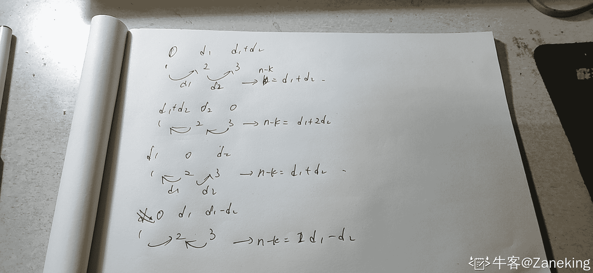

# 字节跳动 2018 校招算法方向（第四批）

## 1

以下函数用于将一颗二叉搜索树转换成一个有序的双向链表。要求不能创建任何新的节点，只能调整树种节点指针的指向。

如输入下图中左边的二叉搜索树，则输出转换后的排序双向链表：

      10

    /      \

   6      14

  /  \      /  \

4   8  12  16

转换成：

 4 <=> 6 <=> 8 <=> 10 <=> 12  <=> 14 <=> 16

请指出程序代码中错误的地方（问题不止一处，请尽量找出所有你认为错误的地方）： 

1  #include <stack>

2  using namespace std;

3

4  struct TreeNode {

5        int val;  

6        TreeNode *left, *right;  

7  };

8

9  TreeNode* Convert(TreeNode* root){  

10         if (root == NULL)  

11             return root;

12

13         TreeNode* listHead = NULL;

14         TreeNode* listLastNode = NULL;

15

16         stack<TreeNode*> s;

17         while(root){

18             while(root){

19                 root=root->left;

20                 s.push(root);

21             }

22             root=s.top();  

23             s.pop();

24             if (listHead == NULL){

25                 listHead = root;

26             }else{

27                 listLastNode->right = root;

28             }

29             listLastNode = root;

30             root= root->right;

31         }

32         return listHead;

33 }

你的答案

本题知识点

算法工程师 字节跳动 2018

讨论

[创始元灵](https://www.nowcoder.com/profile/220889961)

#include <stack>

using namespace std;

struct TreeNode {

        int val;  

        TreeNode *left, *right;  

};

TreeNode* Convert(TreeNode* root)
{
    if (root == NULL)
        return root;
    TreeNode* listHead = NULL;
    TreeNode* listLastNode = NULL;
    stack<TreeNode*> s;
+  while(root||s.empty()==0)
    {
        while(root)
        {
+          s.push(root);
            root=root->left;-           *s.push(root);*        }
        root=s.top();
        s.pop();
        if (listHead == NULL)
        {
            listHead = root;
+          listLastNode = listHead;
        }
        else
        {
            listLastNode->right = root;
+          root->left = listLastNode;
+          listLastNode = listLastNode->right;
        }-       *listLastNode = root;*        root= root->right;
    }
    return listHead;
}

发表于 2019-07-12 18:55:38

* * *

[kyla](https://www.nowcoder.com/profile/2147125)

```cpp

```
第 17 行，应该改成 while(s or root):；
第 25 行，后面应该增加一句 listLastNode = listHead；
第 27 行后面应该增加 

```cpp
prenode =  ListLastNode
ListLastNode =  ListLastNode.right
ListLastNode.left = prenode
```

第 29 行，应该删除。

```cpp

```

发表于 2018-08-07 21:13:07

* * *

[牛客 419778412 号](https://www.nowcoder.com/profile/419778412)

17  while(s.empty() or root)

19 s.push(root)
20  root = root->left#插入 27 行后
root->left = listLastNode   30 行 加入判断语句 if(root->right)
    root = root->right

发表于 2020-01-06 19:45:09

* * *

## 2

对于广告投放引擎， 广告库索引服务是基础服务，每次广告请求会从广告索引中找出匹配的广告创意列表。假设每一次请求会携带 地域、运营商、设备机型、网络接入方式 等信息，每个广告策略都可以设置 地域、运营商、设备机型、网络接入方式 的投放定向（即只能投放到定向匹配的请求， 比如只投放特定地域）。每个广告策略下包含 N(N>=1)个广告创意。设计一个广告库索引模块， 需要支持以下几点：

       1.    支持多线程广告请求可以快速的找到匹配的所有广告创意

       2.    支持广告库数据的热更新

       3.    支持十万级广告策略，百万级广告创意

       4.    支持高并发请求

请给出广告库索引服务整体系统设计以及所使用到的数据结构设计；

你的答案

本题知识点

算法工程师 字节跳动 2018

## 3

有三只球队，每只球队编号分别为球队 1，球队 2，球队 3，这三只球队一共需要进行 n 场比赛。现在已经踢完了 k 场比赛，每场比赛不能打平，踢赢一场比赛得一分，输了不得分不减分。已知球队 1 和球队 2 的比分相差 d1 分，球队 2 和球队 3 的比分相差 d2 分，每场比赛可以任意选择两只队伍进行。求如果打完最后的 (n-k) 场比赛，有没有可能三只球队的分数打平。

本题知识点

数学 贪心 算法工程师 字节跳动 2018

讨论

[泣血残阳](https://www.nowcoder.com/profile/6759318)

这道题其实是一个线性方程组求解问题。设 k 场比赛的三只球队的得分分别为 x1,x2,x3.设此后 n - k 场比赛的三只球队得分分别为 t1,t2,t3.

那么可以得到以下方程：
|x1 - x2| = d1
|x2 - x3| = d2
x1 + x2 + x3 = k
t1 + t2 + t3 = n - k
x1 + t1 = x2 + t2 = x3 + t3
显然以上共有 6 个线性无关的方程，可以将 6 个未知量分别解出，得到
x1 = (k - (2*d1 + d2)) / 3
x2 = (k - (d2 - d1)) / 3
x3 = (k + (d1 + 2*d2)) / 3
t1 = (n - k + (2*d1 + d2)) / 3
t2 = (n - k + (d2 - d1)) / 3
t3 = (n - k - (d1 + 2*d2)) / 3
其中 d1,d2 分别取正负号，总共可能存在 4 组解。分别验证这四组解中，是否有使得各个未知量均为非负整数的解，若存在，则有可行解。

发表于 2018-02-21 11:25:45

* * *

[3VVV](https://www.nowcoder.com/profile/108994419)

思路：这道题不需要解什么线性方程组，对于每一组测试用例，设 k 次对应的比分为：x+/-d1, x, x+/-d2, ***生 4 种情况，利用三者之和为 k 解出 x, 这 4 种只要有一种满足：max(x+/-d1, x, x+/-d2)<=n/3, 且 mod(n,3)=0,则 yes,否则 else.#include<iostream>
#include<algorithm>
using namespace std;

int main() {
    int t;
    long int n,k,d1,d2;
    cin>>t;
    for (int i=0; i<t; ++i) {
        cin>>n>>k>>d1>>d2;
        bool flag = false;
        long int tp; //  不是 long int 会溢出
        if (n%3==0) {
           if ((k-d1-d2)%3==0) {
               tp = (k-d1-d2)/3;
               if (tp+d1<=n/3 && tp+d2<=n/3) {cout<<"yes"<<endl; flag=true; continue;}
           }
           if((k-d1+d2)%3==0) {
               tp = (k-d1+d2)/3;
               if (tp>=d2 && tp+d1<=n/3) {cout<<"yes"<<endl; flag=true; continue;}
           }
           if((k+d1-d2)%3==0) {
               tp = (k+d1-d2)/3;
               if (tp+d2<=n/3 && tp>=d1) {cout<<"yes"<<endl; flag=true; continue;}
           }
           if((k+d1+d2)%3==0) {
               tp = (k+d1+d2)/3;
               if (tp>=d1 && tp>=d2 && tp<=n/3) {cout<<"yes"<<endl; flag=true; continue;}
           } 
        }
        if (!flag) {
            cout<<"no"<<endl;
        }
    }
    return 0;
}

发表于 2018-09-20 16:45:30

* * *

[Zaneking](https://www.nowcoder.com/profile/544940433)

#include<iostream>#include<cmath>
using namespace std;
int main()
{
    long long t;
    cin>>t;
    while(t--)
    {
        long long n,k,d1,d2;
        cin>>n>>k>>d1>>d2;
        if(k-(2*d1+d2)==0 || (k-(2*d1+d2)>0 && (k-(2*d1+d2))%3==0))
        {
            if(((((n-k)-d2-(d1+d2))%3)==0) && ((((n-k)-d2-(d1+d2)))>=0))
            {
                cout<<"yes"<<endl;
            }
            else
            {
                cout<<"no"<<endl;
            }
        }
        else if(k-(d1+d2)==0 || (k-(d1+d2)>0 && (k-(d1+d2))%3==0))
        {
            if(((((n-k)-max(d1,d2)-abs(d1-d2))%3)==0) && ((((n-k)-max(d1,d2)-abs(d1-d2)))>=0))
            {
                cout<<"yes"<<endl;
            }
            else
            {
                cout<<"no"<<endl;
            }
        }
        else if(k-(d1+2*d2)==0  || (k-(d1+2*d2)>0 && (k-(d1+2*d2))%3==0))
        {
            if(((((n-k)-d1-(d1+d2))%3)==0) && ((((n-k)-d1-(d1+d2)))>=0))
            {
                cout<<"yes"<<endl;
            }
            else
            {
                cout<<"no"<<endl;
            }
        }
        else if(k-(2*d1-d2)==0 || (k-(2*d1-d2)>0 && (k-(2*d1-d2))%3==0))
        {
            if(((((n-k)-(d1+d2))%3)==0) && ((((n-k)-(d1+d2)))>=0))
            {
                cout<<"yes"<<endl;
            }
            else
            {
                cout<<"no"<<endl;
            }
        }
        else
        {
            cout<<"no"<<endl;
        }
    }
}

发表于 2022-02-09 20:24:58

* * *

## 4

有一个仅包含’a’和’b’两种字符的字符串 s，长度为 n，每次操作可以把一个字符做一次转换（把一个’a’设置为’b’，或者把一个’b’置成’a’)；但是操作的次数有上限 m，问在有限的操作数范围内，能够得到最大连续的相同字符的子串的长度是多少。

本题知识点

字符串 *贪心 算法工程师 字节跳动 2018* *讨论

[牛客 1659416](https://www.nowcoder.com/profile/6422446)

以第 i 个字符为起点向右走分别记录 a 和 b 出现的次数直到 a 和 b 出现的次数都大于 m 时停止，这时走的长度即为以第 i 个字符为起点的字符串在至多 m 次变换下能够获得的最大连续子串的长度。遍历全部 n 个字符，更新最大的长度即可。

```cpp

	#include <iostream>

	#include <string>

	#include <algorithm>

	usingnamespacestd;

	intmain()

	{

	    intn,m;

	    while(cin>>n>>m)

	    {

	        string str;

	        cin>>str;

	        if(n<=2*m+1)

	            cout << n << endl;

	        else

	        {

	            intl=0;

	            inta=0,b=0;

	            intright=0;

	            for(inti=0; i<n-2*m-1; i++)

	            {

	                if(i>0)

	                {

	                    if(str[i-1]=='a')

	                    {

	                        a--;

	                    }

	                    else

	                    {

	                        b--;

	                    }

	                }

	                for(intj=right; j<n; j++)

	                {

	                    if(str[j]=='a')

	                        a++;

	                    else

	                        b++;

	                    if(j-i+1>2*m+1)

	                    {

	                        if(a>m && b>m)

	                        {

	                            if(j-i>l)

	                                l=j-i;

	                            right=j+1;

	                            break;

	                        }

	                    }

	                }

	            }

	            cout << l << endl;

	        }

	    }

	    return0;

	}

```

发表于 2018-03-24 22:48:18

* * *

[泣血残阳](https://www.nowcoder.com/profile/6759318)

使用 two pointer 策略可以求解，首先从起点位置，取得最多进行 n 次变换得到的连续 a 串，然后每次删除头部的一次变换，再在尾部添加一次变换，注意添加尾部的变换后，需要将其后相邻的连续 a 串计数。

发表于 2018-02-21 11:28:40

* * *

[牛客 8046156 号](https://www.nowcoder.com/profile/8046156)

```cpp
#解析：https://blog.csdn.net/weixin_42001089/article/details/87114410
n,m = [int(e) for e in input().split()]
Str = input()
result = 0
a_count = 0
b_count = 0
q = []
for e in Str:
    if e=='a':
        a_count+=1
    if e=='b':
        b_count+=1
    if a_count>m and b_count>m:
        if e=='a':
            while True:
                if q[0]=='a':
                    q.pop(0)
                    break
                q.pop(0)
                b_count-=1
            a_count-=1
        else :
            while True:
                if q[0]=='b':
                    q.pop(0)
                    break
                q.pop(0)
                a_count-=1
            b_count-=1
    q.append(e)
    result = max(result,len(q))
print(result)

```

发表于 2019-02-18 13:34:25

* * *

## 5

存在 n+1 个房间，每个房间依次为房间 1 2 3...i，每个房间都存在一个传送门，i 房间的传送门可以把人传送到房间 pi(1<=pi<=i),现在路人甲从房间 1 开始出发(当前房间 1 即第一次访问)，每次移动他有两种移动策略：
    A. 如果访问过当前房间 i 偶数次，那么下一次移动到房间 i+1；
    B. 如果访问过当前房间 i 奇数次，那么移动到房间 pi；
现在路人甲想知道移动到房间 n+1 一共需要多少次移动；

本题知识点

动态规划 数组 算法工程师 字节跳动 2018

讨论

[牛客 8046156 号](https://www.nowcoder.com/profile/8046156)

```cpp
#解析：https://blog.csdn.net/weixin_42001089/article/details/87114410
n = int(input())
home = [int(e)-1 for e in input().split()]
dp = [0 for _ in range(n+1)]
dp[1] = 2
for i in range(2,n+1):
    dp[i] = 2*dp[i-1] - dp[home[i-1]]+2
print(dp[n]%1000000007)

```

发表于 2019-02-18 12:34:02

* * *

[小杨希望能跨越](https://www.nowcoder.com/profile/989192101)

分享一个更符合人类思考方式的解法：状态机模型 dp[i][偶] 表示以偶数次到达房间 i 的最小步长 dp[i][奇] 表示以奇数次到达房间 i 的最小步长 dp[i][奇] = dp[i - 1][偶] + 1 这个是很容易想到的，到达 i - 1 最小步长加一即为以奇数次状态到达 i 的最小步长 dp[i][偶] = dp[i][奇] + 重复子问题时间这里很直观，想偶数次到达 i 必须先奇数次到达，然后被传送到过去，之后的重复子问题是唯一需要思考的点重复子问题 = 1 + dp[i - 1][偶] + 1 - dp[x][奇]第一个 1 是从 i 走一步回到之前某个位置 x，显然，被传送回去之后需要再次达到 dp[i - 1][偶]的状态走一步到达 目标房间 i , 这个子问题是的答案是计算过的，但是起始的状态是 dp[x][奇]，因此要把这部分消耗减去。（之所以是 dp[x][奇] 而不是 dp[x][偶] 是因为传送门只会往前跳，若想访问 i ，到达 i 时前面的房间必然被访问了偶数次， 否则无法前进，因此下次到达的是奇数状态）整理： dp[i][奇] = dp[i - 1][偶] + 1dp[i][偶] = 2dp[i][奇] + 1 - dp[x][奇] 初始化: dp[1][奇] = 0， dp[1][偶] = 1 返回：dp[n + 1][奇]

```cpp
def helper(nums, n):
    dp = [[0, 0] for _ in range(n + 2)]
    dp[1][0] = 1
    dp[1][1] = 0
    for i in range(2, n + 2):
        dp[i][1] = dp[i - 1][0] + 1
        if i == n + 1:
            break    
        dp[i][0] = 2 * dp[i][1] + 1 - dp[nums[i - 1]][1]

    return dp[n + 1][1] % 1000000007

n = int(input())
home = list(map(int, input().strip().split()))
print(helper(home, n))

```

发表于 2022-02-20 13:15:57

* * *

[牛客 1659416](https://www.nowcoder.com/profile/6422446)

dp[i]表示从 1 开始出发到 i 需要移动的次数，则 dp[i]=dp[i-1]+f(i-1,i)=dp[i-1]+1+f(p[i-1],i-1)+1=dp[i-1]+1+ ( dp[i-1]-dp[ p[i-1] ] ) +1；其中 f( j , i )表示当前访问过 j 奇数次后从  j 出发到 i 需要移动的次数，就等于当前访问过 j 1 次后从 j 出发到 i 需要移动的次数，因此，由 dp[i]=dp[j]+f( j , i)可得 f( j , i)=dp[i]-dp[j]；

```cpp

	#include <iostream>

	usingnamespacestd;

	longlongconstm=1000000007;

	intmain()

	{

	    intn;

	    while(cin>>n)

	    {

	        intp[n+1];

	        p[0]=0;

	        for(inti=1; i<=n; i++)

	            cin>>p[i];

	        longlongdp[n+1];

	        for(inti=0; i<=n; i++)

	        {

	            dp[i]=0;

	        }

	        dp[2]=2;

	        for(inti=3; i<=n; i++)

	        {

	            dp[i]=(dp[i-1]+1+dp[i-1]-dp[p[i-1]]+1)%m;

	        }

	        cout << ((dp[n]+1+dp[n]-dp[p[n]]+1)%m+m)%m << endl;

	    }

	}

```

发表于 2018-03-29 17:25:40

* * **