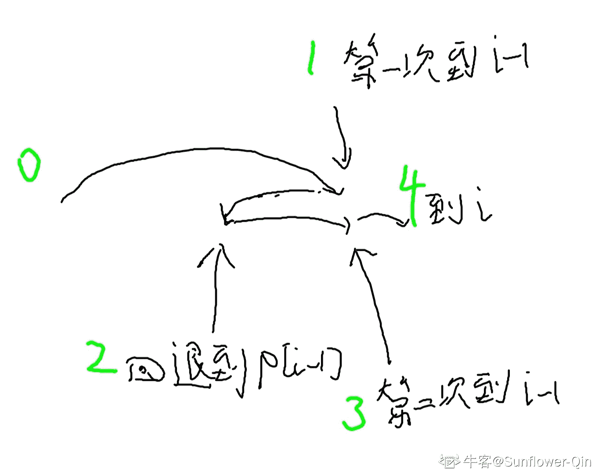

# 字节跳动 2018 校招后端方向（第四批）

## 1

以下函数用于将一颗二叉搜索树转换成一个有序的双向链表。要求不能创建任何新的节点，只能调整树种节点指针的指向。

如输入下图中左边的二叉搜索树，则输出转换后的排序双向链表：

      10

    /      \

   6      14

  /  \      /  \

4   8  12  16

转换成：

 4 <=> 6 <=> 8 <=> 10 <=> 12  <=> 14 <=> 16

请指出程序代码中错误的地方（问题不止一处，请尽量找出所有你认为错误的地方）： 

1  #include <stack>

2  using namespace std;

3

4  struct TreeNode {

5        int val;  

6        TreeNode *left, *right;  

7  };

8

9  TreeNode* Convert(TreeNode* root){  

10         if (root == NULL)  

11             return root;

12

13         TreeNode* listHead = NULL;

14         TreeNode* listLastNode = NULL;

15

16         stack<TreeNode*> s;

17         while(root){

18             while(root){

19                 root=root->left;

20                 s.push(root);

21             }

22             root=s.top();  

23             s.pop();

24             if (listHead == NULL){

25                 listHead = root;

26             }else{

27                 listLastNode->right = root;

28             }

29             listLastNode = root;

30             root= root->right;

31         }

32         return listHead;

33 }

你的答案

本题知识点

C++工程师 Java 工程师 字节跳动 2018

讨论

[+87](https://www.nowcoder.com/profile/5390414)

TreeNode* Convert(TreeNode* root)
{
    if (root == NULL)
        return root;
    TreeNode* listHead = NULL;
    TreeNode* listLastNode = NULL;
    stack<TreeNode*> s;
    while(root||!s.empty())
    {
        while(root!=NULL)
        {
            s.push(root);
            root=root->left;
        }
        root=s.top();
        s.pop();
        if (listHead == NULL)
        {
            listHead = root;
        }
        else
        {
            listLastNode->right = root;
            root->left=listLastNode;
        }
        listLastNode = root;
        root= root->right;
    }
    return listHead;

}

发表于 2018-03-18 16:22:47

* * *

[OTGOTG](https://www.nowcoder.com/profile/406083278)

24             if (listHead == NULL){

25                 listHead = root;加一句 listHead.left = NULL32         return listHead; 前加一句 listLastNode.next = NULL; 发表于 2019-09-13 15:15:02

* * *

[Σ(っ°Д°;)っ好口怕](https://www.nowcoder.com/profile/1239631)

17 行 while 循环的条件修改为 root || s.size() != 019 行跟 20 行调换 27 行下面添加 root->left = listLastNode;

发表于 2019-09-13 10:57:35

* * *

## 2

对于广告投放引擎， 广告库索引服务是基础服务，每次广告请求会从广告索引中找出匹配的广告创意列表。假设每一次请求会携带 地域、运营商、设备机型、网络接入方式 等信息，每个广告策略都可以设置 地域、运营商、设备机型、网络接入方式 的投放定向（即只能投放到定向匹配的请求， 比如只投放特定地域）。每个广告策略下包含 N(N>=1)个广告创意。设计一个广告库索引模块， 需要支持以下几点：

       1.    支持多线程广告请求可以快速的找到匹配的所有广告创意

       2.    支持广告库数据的热更新

       3.    支持十万级广告策略，百万级广告创意

       4.    支持高并发请求

请给出广告库索引服务整体系统设计以及所使用到的数据结构设计；

你的答案

本题知识点

C++工程师 Java 工程师 字节跳动 2018

讨论

[#ff00ff](https://www.nowcoder.com/profile/9896589)

[`blog.csdn.net/tigermee/article/details/51115167`](https://blog.csdn.net/tigermee/article/details/51115167)

发表于 2018-03-23 10:56:56

* * *

[OTGOTG](https://www.nowcoder.com/profile/406083278)

这个是读多写少的场景，并且不要求更新了信息后，立刻就被读到信息。所以数据可以都放在内存中，每次更新，更新完磁盘信息后，再更新内存中的信息，以保证如果持久化失败，那么内存中的信息没有变化。并且这样子，宕机后，从磁盘加载，也可以拿到最新的信息，在用户那里来看，不会出现回退——即前几分钟读到了更新的广告信息，后面又读到了旧的信息。这里假设“地域”的取值空间是固定的，并且数量不多，少于 128 个，比如“华南、华北”之类。比如“华南”对应于"0x04”，“华北”对应于“0x1”，”华中“对应于”0x2“，每个地区占一个特定的比特。运营商、设备机型、网络接入方式也如同这个一样编码。如果对于多个地域都 OK、那么就是 多个地域的编码 or 起来，比如 0x01 | 0x02 | 0x04 = 0x7。然后我们给建立 128 个索引，比如 地域编码中，“第 2 个 bit 为 1 的策略” 为一个 index 、”第 3 个 bit 为 1 的策略“ 是另一个 index，这些 index 索引所有匹配的内容，以此类推。对于 有某些策略 其编码有多个 bit 为 1，那么这个策略就被多个 index 索引 。这样就可以 O(1)的获得 某个地域 的所有广告创意。对于”运营商、设备机型、网络接入方式“ 也依次这样做，然后把 获得的 4 个 创意 set 做 交集，就得到了目标的创意

发表于 2019-09-13 15:42:10

* * *

[elfafa](https://www.nowcoder.com/profile/660152597)

检索模块主要解决相关性问题。首先，根据广告主设定的定向条件筛选出本次请求能否返回的广告；然后，按多种定向策略筛选出与本次请求最相关的若干个广告。

发表于 2019-03-15 21:01:51

* * *

## 3

有三只球队，每只球队编号分别为球队 1，球队 2，球队 3，这三只球队一共需要进行 n 场比赛。现在已经踢完了 k 场比赛，每场比赛不能打平，踢赢一场比赛得一分，输了不得分不减分。已知球队 1 和球队 2 的比分相差 d1 分，球队 2 和球队 3 的比分相差 d2 分，每场比赛可以任意选择两只队伍进行。求如果打完最后的 (n-k) 场比赛，有没有可能三只球队的分数打平。

本题知识点

数学 贪心 C++工程师 Java 工程师 字节跳动 2018

讨论

[元暗](https://www.nowcoder.com/profile/5093660)

```cpp
public static void main(String[] args) {
        Scanner scanner = new Scanner(System.in);
        int t = scanner.nextInt();
        for (int i = 0; i < t; i++) {
            long n = scanner.nextLong();
            long k = scanner.nextLong();
            long d1 = scanner.nextLong();
            long d2 = scanner.nextLong();

            if (n % 3 != 0) {
                System.out.println("no");
                continue;
            }
            //如果能完成，每个队伍的最后得分为 res
            long res = n / 3;
            //执行完 k 次可能有 4 种情况，求出这 4 种情况是否可能出现
            long[][] dir = new long[][]{{d1, d2}, {d1, -d2}, {-d1, d2}, {-d1, -d2}};
            boolean finished = false;
            for (int j = 0; j < 4; j++) {
                if ((k - dir[j][0] - dir[j][1]) % 3 == 0) {
                    //执行完 k 次 第 2 只队伍的得分
                    long second = (k - dir[j][0] - dir[j][1]) / 3;
                    //求出当前 k 次执行完的情况是否可能出现
                    if (second >= 0 && second + dir[j][0] >= 0 && second + dir[j][1] >= 0) {
                        //当前每个组的分数不能比最终的结果高
                        if (res >= second && res >= dir[j][0] + second && res >= dir[j][1] + second) {
                            finished = true;
                            break;
                        }

                    }
                }
            }
            if (finished) {
                System.out.println("yes");
            } else {
                System.out.println("no");
            }

        }
        scanner.close();

    }
```

发表于 2019-10-10 22:23:23

* * *

[gq97](https://www.nowcoder.com/profile/1416906)

```cpp
#include<iostream>
#include<algorithm>
#include<vector>
using namespace std;
typedef long long ll;
bool judge(ll n, ll k, ll d1, ll d2) {
    if(n % 3 != 0) return false;
    ll residue = n-k;
    for(int i = 0; i<2; i++) {
        d1 = -d1;
        for(int j = 0; j<2; j++) {
            d2 = -d2;
            vector<ll> v;
            v.push_back(d1);
            v.push_back(d2);
            v.push_back(0);
            sort(v.begin(), v.end());
            while(v[0] < 0) {
                v[1]+=-v[0], v[2]+=-v[0];
                v[0]+=-v[0];
            }
            if(v[2]+v[2]+v[2] > n) continue;
            ll tem = 2*v[2]-v[0]-v[1];
            if(residue >= tem) {
                if((residue-tem) % 3 == 0) return true;
            }
        }
    }
    return false;
}
int main() {
    //freopen("in.txt", "r", stdin);
    int t;
    cin >> t;
    ll n, k, d1, d2;
    for(int i = 0; i<t; i++) {
        cin >> n >> k >> d1 >> d2;
        judge(n, k, d1, d2) ? cout << "yes\n" : cout << "no\n";
    }
    return 0;
}
```

编辑于 2019-03-15 22:05:55

* * *

[FlushHip](https://www.nowcoder.com/profile/7741213)

今日头条 2018 校园招聘后端开发工程师(第四批)编程题 - 题解
[`blog.csdn.net/flushhip/article/details/79458502`](http://blog.csdn.net/flushhip/article/details/79458502)
详细解答，没有之一(自吹一波)

源码：[`github.com/FlushHip/AlgorithmnCode`](https://github.com/FlushHip/AlgorithmnCode)

发表于 2018-03-06 17:43:09

* * *

## 4

有一个仅包含’a’和’b’两种字符的字符串 s，长度为 n，每次操作可以把一个字符做一次转换（把一个’a’设置为’b’，或者把一个’b’置成’a’)；但是操作的次数有上限 m，问在有限的操作数范围内，能够得到最大连续的相同字符的子串的长度是多少。

本题知识点

字符串 *贪心 C++工程师 Java 工程师 字节跳动 2018* *讨论

[bobbymly](https://www.nowcoder.com/profile/2068505)

详细 题解连接：
[`blog.csdn.net/bobbymly/article/details/79267864`](http://blog.csdn.net/bobbymly/article/details/79267864)

编辑于 2018-02-17 09:25:05

* * *

[java 的神秘男友 script](https://www.nowcoder.com/profile/123356)

```cpp
// 滑动窗口 +队列记录
import java.util.*;
public class Main {
    public static void main(String[] args){
        Scanner in = new Scanner(System.in);
        while(in.hasNext()){
            int n = in.nextInt();
            int m = in.nextInt();
            String str = in.next();
            int max = Math.max(getMax(str,'a',m),getMax(str,'b',m));
            System.out.println(max);
        }
     }
    // 统计变 a 和变 b 的最长长度
    public static int getMax(String str,char ch,int count){
        int max = 0;
        LinkedList ll = new LinkedList(); // 用于记录需要变换的字符的下标
        int len = str.length();
        int d = 0; // 窗口的大小
        for ( int i = 0; i < len; ++i ) {
            if (str.charAt(i) == ch) {
                d++;  // 不需替换的字符 窗口直接增大
            }else {
                if (count > 0) { // 需替换的字符且有剩余替换次数 窗口增大 次数减少 1
                    d++; 
                    count--;    
                }else {  // 需替换的字符且没有剩余替换次数 则取出最左边被替换的字符的下标(index) 同时重新计算窗口大小[i-index]
                    int index = (int)ll.poll();
                    d = i - index;
                }
                ll.add(i); // 记录需要替换字符的下标
            }
            max = Math.max(d,max);

        }
        return max;
    }
}
```

发表于 2022-02-10 01:58:40

* * *

[FlushHip](https://www.nowcoder.com/profile/7741213)

今日头条 2018 校园招聘后端开发工程师(第四批)编程题 - 题解
[`blog.csdn.net/flushhip/article/details/79458502`](http://blog.csdn.net/flushhip/article/details/79458502)
详细解答，没有之一(自吹一波)

源码：[`github.com/FlushHip/AlgorithmnCode`](https://github.com/FlushHip/AlgorithmnCode)

发表于 2018-03-06 17:43:21

* * *

## 5

存在 n+1 个房间，每个房间依次为房间 1 2 3...i，每个房间都存在一个传送门，i 房间的传送门可以把人传送到房间 pi(1<=pi<=i),现在路人甲从房间 1 开始出发(当前房间 1 即第一次访问)，每次移动他有两种移动策略：
    A. 如果访问过当前房间 i 偶数次，那么下一次移动到房间 i+1；
    B. 如果访问过当前房间 i 奇数次，那么移动到房间 pi；
现在路人甲想知道移动到房间 n+1 一共需要多少次移动；

本题知识点

动态规划 数组 C++工程师 Java 工程师 字节跳动 2018 前端工程师 小米 2021

讨论

[皮皮浔](https://www.nowcoder.com/profile/4031474)

*   仔细分析 1<=pi<=i 知道用动态规划做。
*   记录第一次到达 i 为 dp[i]，此时前面的所有门肯定是已经到达偶数次了
    *   因为传送只会后退，前进的唯一方式是偶数次到达并+1，不能跳跃
    *   所以到达 i 门前面所有门都走过并且经过偶数次（反正法也可以证明）
*   dp[i]=dp[i-1]+第二次到达 i-1 + 1
*   第一次到达 i-1 门后再走一步会回到 p[i-1]，此时 p[i-1]门到达奇数次，其他所有门到达偶数次
*   这和第一次到达 p[i-1]门的情况完全相同，所以从 p[i-1]门回到 i-1 门，需要 dp[i-1]-dp[p[i-1]]
*   所以 dp[i] = dp[i-1] + dp[i-1] - dp[p[i-1]] + 1 + 1
*   dp[i] = 2 * dp[i-1] - dp[p[i-1]] + 2

```cpp
#include <iostream>
using namespace std;

long long p[1001], dp[1001], n;
const long long mod = 1e9 + 7;

int main (){
    cin >> n;
    for (int i = 1; i<= n; ++i) cin >> p[i];
    for (int i = 2; i<= n+1; ++i) 
        dp[i] = (2 * dp[i-1] - dp[p[i-1]] + 2) % mod;
    cout << (dp[n + 1] < 0 ? dp[n + 1] + mod : dp[n + 1]);
}

```

*   感谢[Abtt](https://www.nowcoder.com/profile/148026308)指正，已经修改过来

编辑于 2019-04-23 16:13:24

* * *

[izeal](https://www.nowcoder.com/profile/214316342)

```cpp
let n = parseInt(readline().trim());
let roomArr = readline().trim().split(" ");
let mod = 1000000007
let dp = new Array(n+2);
dp[1] = 0
for(let i = 2;i<=n+1;i++){
    dp[i]=2*dp[i-1]+2-dp[roomArr[i-2]]
    if(dp[i]<0){
        dp[i] += mod;
    }else if (dp[i] >= mod){
        dp[i] %= mod;
    }
}
console.log(dp[n+1])
```

发表于 2021-07-15 12:57:07

* * *

[myorange](https://www.nowcoder.com/profile/381116)

皮皮浔已经解释该题可以用动态规划做，记录第一次到达 i 的步数为 dp[i]。下面是我对状态转移方程的分段理解：dp[i] = (dp[i-1]) + (1) + (dp[i-1] - dp[p[i-1]]) + (1)。

```cpp
import java.util.Scanner;

public class Main {
    public static void main(String[] args) {
        Scanner sc = new Scanner(System.in);
        int n = sc.nextInt();
        final int mod = 1000000007;
        int[] p = new int[n+1];
        int[] dp = new int[n+2];
        for (int i = 1; i <= n; ++i) {
            p[i] = sc.nextInt();
        }        
        for (int i = 2; i <= n+1; ++i) {
            dp[i] = (dp[i-1] << 1) - dp[p[i-1]] + 2;
            if (dp[i] < 0) dp[i] += mod;
            else if (dp[i] >= mod) dp[i] %= mod;
        }
        System.out.println(dp[n+1]);
    }
} 
```

编辑于 2020-03-14 13:30:38

* * **