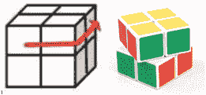
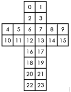
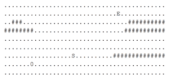

# 字节跳动 2018 校招算法方向（第三批）

## 1

以下函数用于找到整数矩阵 matrix 中，元素之和最大的 n 行 m 列的子矩阵的元素之和。请指出程序代码中错误的地方（问题不止一处，请尽量找出所有你认为错误的地方），并在不新增代码行的情况下将问题修复。 1 int maxSubmatrixSum(std::vector<std::vector<int>> matrix,
 2                     int n, int m) {
 3   int base_sum;
 4   for (int i = 0; i < n; i++){
 5     for (int j = 0; j < m; j++){
 6       base_sum += matrix[i][j];
 7     }
 8   }
 9   int result = 0;
10   for (int i = 0; i + n < matrix.size(); i++) {
11     if(i  > 0){
12       for (int y = 0; y < m; y++){
13         base_sum += matrix[i + n][y] - matrix[i - 1][y];
14       }
15     }
16     int real_sum = base_sum;
17     if (real_sum  > result) {
18       result = real_sum;
19     }
20     for (int j = 0; j + m < matrix.size(); j++) {
21       for (int x = 0; x < n; x++) {
22         real_sum += matrix[x][j + m] - matrix[x][j - 1];
23       }
24       if (real_sum > result) {
25         result = real_sum;
26       }
27     }
28   }
29   return result;
30 }

你的答案

本题知识点

算法工程师 字节跳动 2018

讨论

[李煜 201906182147519](https://www.nowcoder.com/profile/90947532)

```cpp
 int maxSubmatrixSum(std::vector<std::vector<int>> matrix,int n, int m) {
   int base_sum=0;
   for (int i = 0; i < n; i++){
     for (int j = 0; j < m; j++){
       base_sum += matrix[i][j];
     }
   }
   int result=0;
   for (int i = 0; i + n -1 < matrix.size(); i++) {
     int real_sum = base_sum;   //保存每一行初始 base_sum
         if((i+n)<matrix.size())   for (int y = 0; y < m; y++){
           base_sum += matrix[i + n][y] - matrix[i][y];  //整体下移一个单位的 base_sum
         }
     for (int j = 0; j + m < matrix[0].size(); j++) {  //右移一个单位长度，result 保存最大和
       for (int x = i; x < n+i; x++) {
         real_sum += matrix[x][j + m] - matrix[x][j];
       }
       if (real_sum > result) {
         result = real_sum;
       }
     }
   }
   return result;
 }
```

编辑于 2019-08-10 19:54:31

* * *

[逝去 D 那些](https://www.nowcoder.com/profile/437354810)

3 int base_sum = 0; //初始化
13  base_sum += matrix[i + n - 1][y] - matrix[i - 1][y];  // 下标从 0 开始 20  for (int j = 1; j + m < matrix.size(); j++)  //如果 j 从 0 开始的  matrix[x][j - 1] 报错。

发表于 2021-08-28 15:27:18

* * *

[Wbappé](https://www.nowcoder.com/profile/394171325)

 int maxSubmatrixSum(std::vector<std::vector<int>> matrix,
                     int n, int m) {
   int base_sum;
   for (int i = 0; i < n; i++){
     for (int j = 0; j < m; j++){
       base_sum += matrix[i][j];
     }
   }
   int result = 0;
   for (int i = 0; i + n < matrix.size(); i++) {     if(i  > 0){12       for (int y = 0; y < m; y++){
13         base_sum += matrix[i + n][y] - matrix[i - 1][y];
14       }
15     }
16     int real_sum = base_sum;
17     if (real_sum  > result) {
18       result = real_sum;
19     }
20     for (int j = 0; j + m < matrix.size(); j++) {
21       for (int x = 0; x < n; x++) {
22         real_sum += matrix[x][j + m] - matrix[x][j - 1];
23       }
24       if (real_sum > result) {
25         result = real_sum;
26       }
27     }
28   }
29   return result;
30 }   

发表于 2020-09-04 09:27:13

* * *

## 2

二阶魔方又叫小魔方，是 2*2*2 的立方形结构。每一面都有 4 个块，共有 24 个块。每次操作可以将任意一面逆时针或者顺时针旋转 90°，如将上面逆时针旋转 90°操作如下。
Nero 在小魔方上做了一些改动，用数字替换每个块上面的颜色，称之为数字魔方。魔方上每一面的优美度就是这个面上 4 个数字的乘积，而魔方的总优美度就是 6 个面优美度总和。
现在 Nero 有一个数字魔方，他想知道这个魔方在操作不超过 5 次的前提下能达到的最大优美度是多少。
魔方展开后每一块的序号如下图：

本题知识点

模拟 递归 穷举 算法工程师 字节跳动 2018

讨论

[霍七](https://www.nowcoder.com/profile/1903667)

【题解】最多五步，每一步都有 6 种可能，分别是前面，上面和右面顺时针或逆时针旋转 90 度。枚举就可以啦！

```cpp
#include <iostream>
#include <algorithm>
using namespace std;
class Cube
{
    friend istream& operator>>(istream &in, Cube &obj);
private:
    int _up[4];
    int _down[4];
    int _left[4];
    int _right[4];
    int _front[4];
    int _back[4];
    int calnow() const;
    void upp();     // 上层顺时针旋转 90 度
    void upn();     // 上层逆时针旋转 90 度
    void rightp();  // 右层顺时针旋转 90 度
    void rightn();  // 右层逆时针旋转 90 度
    void frontp();  // 前层顺时针旋转 90 度
    void frontn();  // 前层逆时针旋转 90 度
public:
    int rotate(int) const;
};
istream& operator>>(istream &in, Cube &obj)
{
    in >> obj._up[0] >> obj._up[1] >> obj._up[2] >> obj._up[3];
    in >> obj._left[0] >> obj._left[1] >> obj._front[0] >> obj._front[1];
    in >> obj._right[0] >> obj._right[1] >> obj._left[2] >> obj._left[3];
    in >> obj._front[2] >> obj._front[3] >> obj._right[2] >> obj._right[3];
    in >> obj._down[0] >> obj._down[1] >> obj._down[2] >> obj._down[3];
    in >> obj._back[0] >> obj._back[1] >> obj._back[2] >> obj._back[3];
    return in;
}
int Cube::calnow() const
{
    int now[6] = { 1, 1, 1, 1, 1, 1 }, result = 0;
    for (int i = 0; i < 4; i++) {
        now[0] *= _up[i]; now[1] *= _down[i];
        now[2] *= _left[i]; now[3] *= _right[i];
        now[4] *= _front[i]; now[5] *= _back[i];
    }
    for (int i = 0; i < 6; i++) {
        result += now[i];
    }
    return result;
}
void Cube::upp()
{
    swap(_up[0], _up[1]);
    swap(_up[0], _up[3]);
    swap(_up[0], _up[2]);
    swap(_front[0], _left[0]); swap(_front[1], _left[1]);
    swap(_front[0], _back[3]); swap(_front[1], _back[2]);
    swap(_front[0], _right[0]); swap(_front[1], _right[1]);
}
void Cube::upn()
{
    swap(_up[0], _up[2]);
    swap(_up[0], _up[3]);
    swap(_up[0], _up[1]);
    swap(_front[0], _right[0]); swap(_front[1], _right[1]);
    swap(_front[0], _back[3]); swap(_front[1], _back[2]);
    swap(_front[0], _left[0]); swap(_front[1], _left[1]);
}
void Cube::rightp()
{
    swap(_right[0], _right[1]);
    swap(_right[0], _right[3]);
    swap(_right[0], _right[2]);
    swap(_front[1], _up[1]); swap(_front[3], _up[3]);
    swap(_front[1], _back[1]); swap(_front[3], _back[3]);
    swap(_front[1], _down[1]); swap(_front[3], _down[3]);
}
void Cube::rightn()
{
    swap(_right[0], _right[2]);
    swap(_right[0], _right[3]);
    swap(_right[0], _right[1]);
    swap(_front[1], _down[1]); swap(_front[3], _down[3]);
    swap(_front[1], _back[1]); swap(_front[3], _back[3]);
    swap(_front[1], _up[1]); swap(_front[3], _up[3]);
}
void Cube::frontp()
{
    swap(_front[0], _front[1]);
    swap(_front[0], _front[3]);
    swap(_front[0], _front[2]);
    swap(_up[2], _right[0]); swap(_up[3], _right[2]);
    swap(_up[2], _down[1]); swap(_up[3], _down[0]);
    swap(_up[2], _left[3]); swap(_up[3], _left[1]);
}
void Cube::frontn()
{
    swap(_front[0], _front[2]);
    swap(_front[0], _front[3]);
    swap(_front[0], _front[1]);
    swap(_up[2], _left[3]); swap(_up[3], _left[1]);
    swap(_up[2], _down[1]); swap(_up[3], _down[0]);
    swap(_up[2], _right[0]); swap(_up[3], _right[2]);
}
int Cube::rotate(int n) const
{
    Cube temp = *this;
    while (n != 0) {
        switch (n % 6)
        {
        case 1:temp.upp(); break;
        case 2:temp.upn(); break;
        case 3:temp.rightp(); break;
        case 4:temp.rightn(); break;
        case 5:temp.frontp(); break;
        default:temp.frontn(); break;
        }
        n /= 6;
    }
    return temp.calnow();
}

int main()
{
    Cube cube; cin >> cube;
    int result = 0;
    for (int i = 1; i < 7776; i++) {
        result = max(result, cube.rotate(i));
    }
    cout << result;
    return 0;
} 
```

发表于 2017-12-26 20:04:15

* * *

[南洋理工大学-LUWEI](https://www.nowcoder.com/profile/686806)

```cpp
def compute(A):
    return A[0]*A[1]*A[2]*A[3] + A[4]*A[5]*A[10]*A[11] + A[6]*A[7]*A[12]*A[13] + A[8]*A[9]*A[14]*A[15] + A[16]*A[17]*A[18]*A[19] + A[20]*A[21]*A[22]*A[23]

def DS(A,i):
    if i == 0:
        return
#六种情况进行旋转，每次转动 12 个。
    A1 = A.copy()
    A1[1], A1[3],A1[7], A1[13], A1[17], A1[19],A1[21],A1[23],A1[8], A1[9],A1[14],A1[15] = A1[7], A1[13], A1[17], A1[19],A1[21],A1[23], A1[1], A1[3],A1[14], A1[8],A1[15],A1[9]
    res.append(compute(A1))
    DS(A1,i-1)

    A2 = A.copy()
    A2[1], A2[3],A2[7], A2[13], A2[17], A2[19],A2[21],A2[23],A2[8], A2[9],A2[14],A2[15] = A2[21],A2[23], A2[1], A2[3], A2[7], A2[13], A2[17],A2[19],A2[9], A2[15],A2[8],A2[14]
    res.append(compute(A2))
    DS(A2,i-1)

    A3 = A.copy()
    A3[4], A3[5], A3[6], A3[7], A3[8], A3[9], A3[23], A3[22],A3[0], A3[1], A3[2], A3[3] = A3[6], A3[7], A3[8], A3[9], A3[23], A3[22], A3[4], A3[5],A3[2], A3[0], A3[3], A3[1]
    res.append(compute(A3))
    DS(A3,i-1)

    A4 = A.copy()
    A4[4], A4[5], A4[6], A4[7], A4[8], A4[9], A4[23], A4[22],A4[0], A4[1], A4[2], A4[3] =  A4[23], A4[22], A4[4], A4[5], A4[6], A4[7], A4[8], A4[9],A4[1], A4[3], A4[0], A4[2]
    res.append(compute(A4))
    DS(A4,i-1)

    A5 = A.copy()
    A5[2], A5[3], A5[8], A5[14], A5[17], A5[16], A5[11], A5[5],A5[6], A5[7], A5[12], A5[13] = A5[8], A5[14], A5[17], A5[16], A5[11], A5[5], A5[2], A5[3], A5[7], A5[13], A5[6], A5[12]
    res.append(compute(A5))
    DS(A5,i-1)

    A6 = A.copy()
    A6[2], A6[3], A6[8], A6[14], A6[17], A6[16], A6[11], A6[5], A6[6], A6[7], A6[12], A6[13] =  A6[11], A6[5], A6[2], A6[3], A6[8], A6[14], A6[17], A6[16], A6[12], A6[6], A6[13], A6[7]
    res.append(compute(A6))
    DS(A6,i-1)

    i += -1

row= [int(i) for i in input().strip().split()]
res = [compute(row)]
i = 5
DS(row,i)
print(max(res))

```

发表于 2018-09-19 17:38:26

* * *

[牛客 50140947 号](https://www.nowcoder.com/profile/50140947)

#include<iostream>#include<climits>
using namespace std;
int ans=INT_MIN;
int calc(int* a){    return a[0]*a[1]*a[2]*a[3]+a[4]*a[5]*a[10]*a[11]+a[6]*a[7]*a[12]*a[13]+a[8]*a[9]*a[14]*a[15]+a[16]*a[17]*a[18]*a[19]+a[20]*a[21]*a[22]*a[23];}
void rotate(int *a, int step){    ans = max(calc(a), ans);    int b[24];    for(int i=0;i<24;i++) b[i]=a[i];    if(step == 0) return;    for(int i=0;i<6;i++){        for(int j=0;j<24;j++) a[j]=b[j];        if(i==0){            swap(a[6],a[7]);            swap(a[6],a[13]);            swap(a[6],a[12]);            swap(a[5],a[3]);            swap(a[11],a[2]);            swap(a[5],a[14]);            swap(a[11],a[8]);            swap(a[5],a[16]);            swap(a[11],a[17]);        }        if(i==1){            swap(a[6],a[7]);            swap(a[7],a[12]);            swap(a[7],a[13]);            swap(a[5],a[16]);            swap(a[11],a[17]);            swap(a[5],a[14]);            swap(a[11],a[8]);            swap(a[5],a[3]);            swap(a[11],a[2]);        }        if(i==2){            swap(a[0],a[1]);            swap(a[0],a[3]);            swap(a[0],a[2]);            swap(a[4],a[23]);            swap(a[5],a[22]);            swap(a[4],a[8]);            swap(a[5],a[9]);            swap(a[4],a[6]);            swap(a[5],a[7]);        }        if(i==3){            swap(a[0],a[1]);            swap(a[1],a[2]);            swap(a[1],a[3]);            swap(a[4],a[6]);            swap(a[5],a[7]);            swap(a[4],a[8]);            swap(a[5],a[9]);            swap(a[4],a[23]);            swap(a[5],a[22]);        }        if(i==4){            swap(a[4],a[5]);            swap(a[4],a[11]);            swap(a[4],a[10]);            swap(a[22],a[2]);            swap(a[20],a[0]);            swap(a[22],a[12]);            swap(a[20],a[6]);            swap(a[22],a[18]);            swap(a[20],a[16]);        }        if(i==5){            swap(a[4],a[5]);            swap(a[5],a[10]);            swap(a[5],a[11]);            swap(a[22],a[18]);            swap(a[20],a[16]);            swap(a[22],a[12]);            swap(a[20],a[6]);            swap(a[22],a[2]);            swap(a[20],a[0]);        }        rotate(a,step-1);    }}
int main(){    int a[24];    for(int i=0;i<24;i++) cin>>a[i];    rotate(a,5);    cout<<ans<<endl;    return 0;}

发表于 2022-03-11 19:21:02

* * *

## 3

有一个推箱子的游戏, 一开始的情况如下图:
上图中, '.' 表示可到达的位置, '#' 表示不可到达的位置，其中 S 表示你起始的位置, 0 表示初始箱子的位置, E 表示预期箱子的位置，你可以走到箱子的上下左右任意一侧, 将箱子向另一侧推动。如下图将箱子向右推动一格;

..S0.. -> ...S0\.

注意不能将箱子推动到'#'上, 也不能将箱子推出边界;

现在, 给你游戏的初始样子, 你需要输出最少几步能够完成游戏, 如果不能完成, 则输出-1。

本题知识点

模拟 算法工程师 字节跳动 2018

讨论

[-koil___](https://www.nowcoder.com/profile/681646819)

```cpp
#include <bits/stdc++.h>
using namespace std;
int n,m;
int dir[4][2]={1,0,0,1,-1,0,0,-1};
int vis[50][50][50][50];
vector<string> view;
struct node{
        int a_x,a_y,b_x,b_y,step;
        node(int a_x,int a_y,int b_x,int b_y,int step):
                a_x(a_x),a_y(a_y),b_x(b_x),b_y(b_y),step(step){};

};
bool isTrue(int x,int y)
{
        if(x<0||y<0||x>=n||y>=m||view[x][y]=='#')
                return false;
        return true;
}
int bfs(int start_x,int start_y,int box_x,int box_y)
{
        queue<node> ans;
        ans.push(node(start_x,start_y,box_x,box_y,0));
        vis[start_x][start_y][box_x][box_y]=1;
        while(!ans.empty())
        {
                node p=ans.front();
                ans.pop();
                int ax=p.a_x;
                int ay=p.a_y;
                int bx=p.b_x;
                int by=p.b_y;
                int step=p.step;
                for(int i=0;i<4;i++)
                {
                        int new_ax=ax+dir[i][0];
                        int new_ay=ay+dir[i][1];
                        int new_bx=bx+dir[i][0];
                        int new_by=by+dir[i][1];
                        if(!isTrue(new_ax,new_ay))
                                continue;
                        //移动到箱子前
                        if((new_ax!=bx||new_ay!=by)&&vis[new_ax][new_ay][bx][by]==0)
                        {
                                vis[new_ax][new_ay][bx][by]=1;
                                ans.push(node(new_ax,new_ay,bx,by,step+1));
                        }
                        //人和箱子一起移动
                        else if(new_ax==bx&&new_ay==by&&isTrue(new_bx,new_by)&&vis[new_ax][new_ay][new_bx][new_by]==0)
                        {
                                vis[new_ax][new_ay][new_bx][new_by]==1;
                                if(view[new_bx][new_by]=='E')
                                        return step+1;
                                ans.push(node(new_ax,new_ay,new_bx,new_by,step+1));
                        }

                }
        }
        return -1;

}
int main() {
        memset(vis,-0,sizeof(vis));
        cin>>n>>m;
        view=vector<string> (n,string(""));
        for(int i=0;i<n;i++)
                cin>>view[i];
        int start_x,start_y,box_x,box_y;
        for(int i=0;i<n;i++)
                for(int j=0;j<m;j++)
                {
                        if(view[i][j]=='S')
                                start_x=i,start_y=j;
                        else if(view[i][j]=='0')
                                box_x=i,box_y=j;
                }
        cout<<bfs(start_x,start_y,box_x,box_y)<<endl;
    return 0;
}

```

发表于 2019-08-21 20:32:18

* * *

[牛客 50140947 号](https://www.nowcoder.com/profile/50140947)

```cpp
#include<iostream>
#include<queue>

using namespace std;

int m,n;
int sx,sy;
int bx,by;
char a[52][52];
int dp[52][52][52][52];
int mov[4][2] = {{0,1},{0,-1},{1,0},{-1,0}};

int main(){
    cin>>n>>m;
    for(int i=0;i<52;i++){
        for(int j=0;j<52;j++){
            a[i][j]='#';
        }
    }
    for(int i=1;i<=n;i++){
        for(int j=1;j<=m;j++){
            cin>>a[i][j];
            if(a[i][j]=='S'){
                sx=i;
                sy=j;
            }
            if(a[i][j]=='0'){
                bx=i;
                by=j;
            }
        }
    }
    queue<vector<int>> q;
    vector<int> tmp={sx,sy,bx,by};
    q.push(tmp);
    int x,y,xb,yb,xn,yn;
    while(!q.empty()){
        vector<int> tmp = q.front();
        x=tmp[0],y=tmp[1],xb=tmp[2],yb=tmp[3];
        q.pop();
        for(int i=0;i<4;i++){
            xn=x+mov[i][0];
            yn=y+mov[i][1];
            if(xn!=xb || yn!=yb){
                if(a[xn][yn]!='#'&&dp[xn][yn][xb][yb]==0){
                    dp[xn][yn][xb][yb] = dp[x][y][xb][yb]+1;
                    vector<int> tmp2={xn,yn,xb,yb};
                    q.push(tmp2);
                }
            }
            else{
                int xbn=xb+mov[i][0];
                int ybn=yb+mov[i][1];
                if(a[xbn][ybn]!='#'&&dp[xn][yn][xbn][ybn]==0){
                    dp[xn][yn][xbn][ybn] = dp[x][y][xb][yb]+1;
                    if(a[xbn][ybn]=='E'){
                        cout<<dp[xn][yn][xbn][ybn]<<endl;
                        return 0;
                    }
                    vector<int> tmp2={xn,yn,xbn,ybn};
                    q.push(tmp2);
                }
            }
        }
    }
    cout<<-1<<endl;
    return 0;
}
```

发表于 2022-03-12 10:04:36

* * *

[h_m_w](https://www.nowcoder.com/profile/690800085)

是不是测试用例有问题？27 39 的矩阵，我自己加了下标 012345678901234567890123456789012345678
0.................................#.##..
1...#............#.#....................
2........#..............................
3...............#...#...................
4....#.....#..#.........................
5.....................##....#...........
6.....#..................#...##.#.......
7.#.#.....#.......#.....................
8................###....#.......#...#...
9...............#.#..3401.#......#......
0...#.7890123456789012##2.....#.........
1....#67890123.#..#.....34567890123.....
2....#567890#.....#...............4.....
3....5456789...........#..........5.....
4.#.5434567#.........#...#........6...#.
5.#54#2#6567#....#...#.........#..7.....
6.#43212#456.........#......#...#.8#....
7..5#1S123456...##.#.........#....E.....
8.543212345.............#..#....#.....#.
9..5432#45......................#.......
0..#54345.............#...........#.....
1....545.............#.........#......#.
2.....5.....##..........................
3..#.....#..............#...............
4.............#............##.#.........
5.......#....#.#....#.........#.......#.
6#.....................#................
我手算的是 45（25+19+1），如图所示。但答案是 53。下划线的部分分别是 S,0,E
PS：粘贴到 txt 文本里格式就对齐了，望大佬核对，指正【抱拳抱拳】

发表于 2019-08-23 17:08:05

* * *

## 4

有 n 个房间，现在 i 号房间里的人需要被重新分配，分配的规则是这样的：先让 i 号房间里的人全都出来，接下来按照 i+1, i+2, i+3, ... 的顺序依此往这些房间里放一个人，n 号房间的的下一个房间是 1 号房间，直到所有的人都被重新分配。

现在告诉你分配完后每个房间的人数以及最后一个人被分配的房间号 x，你需要求出分配前每个房间的人数。数据保证一定有解，若有多解输出任意一个解。

本题知识点

模拟 递归 动态规划 算法工程师 字节跳动 2018

讨论

[牛客 8046156 号](https://www.nowcoder.com/profile/8046156)

```cpp
#解析：https://blog.csdn.net/weixin_42001089/article/details/87114410
n,x = [int(e) for e in input().split()]
x = x-1
mintemp = 10**9
home = []
homemin = []
for i,e in enumerate(input().split()):
    e = int(e)
    home.append(e)
    if e<mintemp:
        homemin = []
        homemin.append(i)
        mintemp = e
    if e==mintemp:
        homemin.append(i)
i = 0
while i<len(homemin) and homemin[i]<=x:
    i+=1
start = homemin[i-1]
startcur = start
result = [e-mintemp for e in home]
result[start] = n*mintemp
while startcur!=x:
    startcur = (startcur+1)%n
    result[startcur]-=1
    result[start]+=1
for e in result:
    print(e,end=' ')

```

发表于 2019-02-16 11:37:07

* * *

[霍七](https://www.nowcoder.com/profile/1903667)

```cpp
#include <iostream>
using namespace std;
int main()
{
    int n, x; cin >> n >> x; x--;
    unsigned long long *data = new unsigned long long[n];
    unsigned long long minnum = -1, minindex;
    for (int i = 0; i < n; i++) {
        cin >> data[i];
        minindex = data[i] < minnum || (data[i] == minnum && i <= x) ? i : minindex;
        minnum = data[i] < minnum || (data[i] == minnum && i <= x) ? data[i] : minnum;
    }
    if (x < minindex) {
        for (int i = 0; i <= x; i++) {
            cout << data[i] - minnum - 1 << " ";
        }
        for (int i = x + 1; i < minindex; i++) {
            cout << data[i] - minnum << " ";
        }
        cout << n*(minnum + 1) - minindex + x;
        for (int i = minindex + 1; i < n; i++) {
            cout << " " << data[i] - minnum - 1;
        }
    }
    else if (x >= minindex) {
        for (int i = 0; i < minindex; i++) {
            cout << data[i] - minnum << " ";
        }
        cout << n*minnum + x - minindex;
        for (int i = minindex + 1; i <= x; i++) {
            cout << " " << data[i] - minnum - 1;
        }
        for (int i = x + 1; i < n; i++) {
            cout << " " << data[i] - minnum;
        }
    }
    delete[] data;
    return 0;
} 
```

发表于 2017-12-26 20:37:34

* * *

[牛客 50140947 号](https://www.nowcoder.com/profile/50140947)

```cpp
if __name__ == "__main__":
    n, x = list(map(int, input().split()))
    a = list(map(int, input().split()))
    x -= 1
    r = min(a)
    for i in range(len(a)):
        a[i]-=r
    s = x
    while(a[s]!=0):
        a[s]-=1
        s-=1
    a[s] += r*n + x-s
    for i in range(len(a)):
        print(a[i],end=' ')
```

 发表于 2022-03-13 09:40:02

* * *

## 5

在生产环境，我们常常要存储一些像服务参数、功能开关之类的键值。传统的做法是把配置都写到文件里，然后同步到线上每台机器上。随着机器变多，配置文件变得难以管理，并且容易出现不一致的情况。我们希望设计一个配置服务来解决这个问题。

统一配置服务可能会存在以下问题：由于是非常核心的服务，如果存在单节点问题对服务可用性影响非常大；线上可能读取非常频繁，尽可能提供高性能的服务同时，也要考虑横向扩容能力；需要保证配置在期望的时间内下发与更新；

请设计一个存储服务，包含但不限于以下角色：服务端（可能由多个节点组成），客户端（读取、写入一个配置），其他（如旁路的监控等）；

系统假设：

1、存储量都在 1GB 以内，单机内存可以存储下；

2、每秒写入在 1000 以内

3、每秒读取在 1000000 以上

4、使用尽量少的节点

5、无论什么时候，服务总是可以读写

6、允许故障期间读到老的配置数据

7、故障恢复后，数据保持同步

你的答案

本题知识点

算法工程师 字节跳动 2018