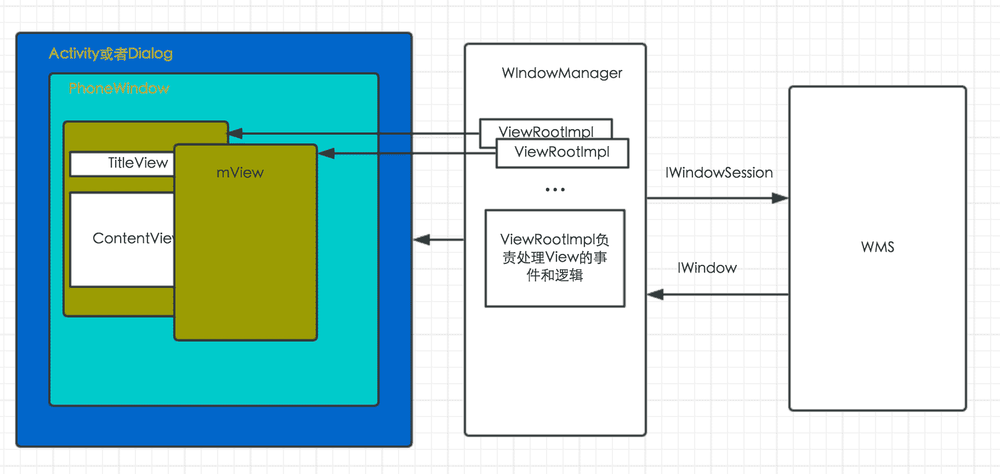

# 字节跳动 2018 校招 Android 方向（第三批）

## 1

以下函数用于找到整数矩阵 matrix 中，元素之和最大的 n 行 m 列的子矩阵的元素之和。请指出程序代码中错误的地方（问题不止一处，请尽量找出所有你认为错误的地方），并在不新增代码行的情况下将问题修复。 1 int maxSubmatrixSum(std::vector<std::vector<int>> matrix,
 2                     int n, int m) {
 3   int base_sum;
 4   for (int i = 0; i < n; i++){
 5     for (int j = 0; j < m; j++){
 6       base_sum += matrix[i][j];
 7     }
 8   }
 9   int result = 0;
10   for (int i = 0; i + n < matrix.size(); i++) {
11     if(i  > 0){
12       for (int y = 0; y < m; y++){
13         base_sum += matrix[i + n][y] - matrix[i - 1][y];
14       }
15     }
16     int real_sum = base_sum;
17     if (real_sum  > result) {
18       result = real_sum;
19     }
20     for (int j = 0; j + m < matrix.size(); j++) {
21       for (int x = 0; x < n; x++) {
22         real_sum += matrix[x][j + m] - matrix[x][j - 1];
23       }
24       if (real_sum > result) {
25         result = real_sum;
26       }
27     }
28   }
29   return result;
30 }

你的答案

本题知识点

安卓工程师 字节跳动 2018

讨论

[mg2flyingff](https://www.nowcoder.com/profile/4471600)

```cpp
int maxSubmatrixSum(std::vector<std::vector<int>> matrix,
                     int n, int m) {
   int base_sum;
  for (int i = 0; i < n; i++){
     for (int j = 0; j < m; j++){
       base_sum += matrix[i][j];
     }
   }
   int result = 0;
   for (int i = 0; i + n < matrix.size(); i++) {
     if(i  > 0){
       for (int y = 0; y < m; y++){
         base_sum += matrix[i + n][y] - matrix[i - 1][y];
       }
     }
     int real_sum = base_sum;
     if (real_sum  > result) {
       result = real_sum;
     }
     for (int j = 0; j + m < matrix[0].size(); j++) {
       for (int x = 0; x < n; x++) {
         real_sum += matrix[x + i][j + m] - matrix[x + i][j - 1];
       }
       if (real_sum > result) {              result = real_sum;        }
     }
   }
   return result;
 }

```

发表于 2018-05-11 12:56:15

* * *

[gonBorn](https://www.nowcoder.com/profile/450908694)

3：int base_sum=0;//没有初始化 10：for (int i = 0; i + n <= matrix.size(); i++)11: base_sum += matrix[i + n-1][y] - matrix[i - 1][y];21: for (int x = i; x < n+i; x++) 22:real_sum += matrix[x][j + m] - matrix[x][j];改了以上这些，我用 java 测试了一个简单用例可以通过，考虑不周的地方求指教

发表于 2019-03-15 15:53:09

* * *

## 2

有一个推箱子的游戏, 一开始的情况如下图:
上图中, '.' 表示可到达的位置, '#' 表示不可到达的位置，其中 S 表示你起始的位置, 0 表示初始箱子的位置, E 表示预期箱子的位置，你可以走到箱子的上下左右任意一侧, 将箱子向另一侧推动。如下图将箱子向右推动一格;

..S0.. -> ...S0\.

注意不能将箱子推动到'#'上, 也不能将箱子推出边界;

现在, 给你游戏的初始样子, 你需要输出最少几步能够完成游戏, 如果不能完成, 则输出-1。

本题知识点

模拟 安卓工程师 字节跳动 2018

讨论

[answ0r](https://www.nowcoder.com/profile/5050146)

```cpp
import java.util.*; public class Main { static char[][] map=new char[110][110]; static int next[][]={{1,0},{-1,0},{0,1},{0,-1}}; static int m,n; static int [][][][] visit = new int[60][60][60][60]; public static void main(String[] args) {

        Scanner sc = new Scanner(System.in);

        n=sc.nextInt();
        m=sc.nextInt();
        sc.nextLine(); for(int i=0;i<n;i++) {
            map[i] = sc.nextLine().toCharArray();
        } int r1=0,r2=0,b1=0,b2=0; for(int i=0;i<n;i++){ for(int j=0;j<m;j++){ if(map[i][j]=='S') {
                    r1 = i;
                    r2 = j;
                } if(map[i][j]=='0'){
                    b1=i;
                    b2=j;
                }
            }
        }
        System.out.println(bfs(r1,r2,b1,b2));
    } static int bfs(int r1,int r2,int b1,int b2){
        LinkedList<Node> queue=new LinkedList<>();
        queue.offer(new Node(r1,r2,b1,b2));
        visit[r1][r2][b1][b2]=1; while(queue.size()>0){
            Node t= queue.poll(); if(map[t.bx][t.by]=='E'){ return visit[t.x][t.y][t.bx][t.by]-1;
            } for(int k=0;k<4;k++){ int mx=t.x+next[k][0]; int my=t.y+next[k][1]; //System.out.println(mx+" ---- "+my); if(mx<0||mx>=n||my<0||my>=m||map[mx][my]=='#')continue; if(mx==t.bx&&my==t.by){ int mbx=t.bx+next[k][0]; int mby=t.by+next[k][1]; if(mbx>=n||mbx<0||mby<0||mby>=m ||map[mbx][mby]=='#'||visit[mx][my][mbx][mby]!=0)continue;
                    visit[mx][my][mbx][mby]= visit[t.x][t.y][t.bx][t.by]+1;
                    queue.offer(new Node(mx,my,mbx,mby));
                }else{ if(visit[mx][my][t.bx][t.by]!=0)continue;
                    visit[mx][my][t.bx][t.by] = visit[t.x][t.y][t.bx][t.by]+1;
                    queue.offer(new Node(mx,my,t.bx,t.by));
                }
            }
        } return -1;
    } public static class Node { int x, y, bx, by; public Node(int x, int y, int bx, int by) { this.x = x; this.y = y; this.bx = bx; this.by = by;
        }
    }
}
```

发表于 2021-01-10 22:30:15

* * *

## 3

有 n 个房间，现在 i 号房间里的人需要被重新分配，分配的规则是这样的：先让 i 号房间里的人全都出来，接下来按照 i+1, i+2, i+3, ... 的顺序依此往这些房间里放一个人，n 号房间的的下一个房间是 1 号房间，直到所有的人都被重新分配。

现在告诉你分配完后每个房间的人数以及最后一个人被分配的房间号 x，你需要求出分配前每个房间的人数。数据保证一定有解，若有多解输出任意一个解。

本题知识点

模拟 递归 动态规划 安卓工程师 字节跳动 2018

讨论

[鹅厂彭于晏](https://www.nowcoder.com/profile/8009074)

```cpp
AC 代码
开始 timeout 了，后来通过找到最小数，所有房间人数都先减去这个最小数，
然后遍历一遍即可。

```

	 public static void computer() {

	        Scanner scanner = new Scanner(System.in);

	        int n, x;

	        n = scanner.nextInt();

	        x = scanner.nextInt();

	        x--;

	        long[] houses = new long[n];

	        for(int i = 0; i < n; i++) {

	            houses[i] = scanner.nextInt();

	        }

	        long min=houses[0];

	        for(longhouse : houses) {

	            if(house < min) {

	                min = house;

	            }

	        }

	        for(int i = 0; i < houses.length; i++) {

	            houses[i]-=min;

	        }

	        long count=min*n;

	        while(true) {

	            if(houses[x]==0) {

	                houses[x]=count;

	                break;

	            } else{

	                houses[x]--;

	                count++;

	            }

	            if(x <= 0) {

	                x=houses.length-1;

	            }else{

	                x--;

	            }

	        }

	        for(longhouse : houses) {

	            System.out.print(house+" ");

	        }

	        }

```cpp

```

编辑于 2019-02-26 17:20:25

* * *

[牛客 901327554 号](https://www.nowcoder.com/profile/901327554)

import java.util.*;
import java.text.DecimalFormat;

public class Main {

    public static void main(String[] args) {

        Scanner sc = new Scanner(System.in);

        int n = sc.nextInt();
        int k = sc.nextInt();
        long[] person = new long[n];
        long outperson = 0l;
        long min = Long.MAX_VALUE;

        for(int i=0;i< n;i++ ) {
            person[i] = sc.nextLong();
            if(person[i] < min) {
                min = person[i];
            }
        }
        k = k-1;

        for(int i=0;i< n;i++ ) {
            person[i] = person[i] - min;
            outperson = outperson + min;
        }

        while(person[k] > 0 ) {
            person[k] = person[k] -1;
            outperson ++;

            k = k-1;

            if(k == -1) {
                k = n-1;
            }

        }

        person[k] = outperson;

        for(int i = 0;i< person.length;i++) {
            if(i != n-1) {
                System.out.print(new DecimalFormat("0").format(person[i]) + " ");
            }else {
                System.out.print(new DecimalFormat("0").format(person[i]));
            }
        }

        sc.close();
    }

}

发表于 2020-08-08 21:19:54

* * *

[hishark777](https://www.nowcoder.com/profile/765809)

```cpp
package ByteDanceInterview;

import java.util.Scanner;

public class Room {

    public static void main(String[] args) {
        int n, k;
        Scanner cin = new Scanner(System.in);
        n = cin.nextInt();
        k = cin.nextInt();
        int a[] = new int[n+1];
        for (int i = 1; i <= n; i++) {
            a[i] = cin.nextInt();
        }
        // 出去了多少人
        int outPerson = 0;

        //逆推
        while(a[k]!=0) {
            a[k]--;
            outPerson++;

            //k 为房间号 
            k = (k - 1) % n;
            if (k == 0)
                k = n;

        }

        a[k] = outPerson;

        for(int i=1;i<=n;i++) {
            if(i!=n) {
                System.out.print(a[i]+" ");
            }else {
                System.out.print(a[i]);
            }
        }

    }

} 
```

通过率 80%

编辑于 2018-11-13 20:29:45

* * *

## 4

【简答题】简述 Activity、Window、WindowManager、View、ViewRootImpl 的作用和相互之间的关系。

你的答案

本题知识点

安卓工程师 字节跳动 2018

讨论

[keep 丶 busy](https://www.nowcoder.com/profile/4526121)

每个 activity 有个 window,window 被 windowmanager 管理.

每个 window 都有 decorview.

每个 window 都有 ViewRootimpl.

绘制发起从 ViewRootimpl.

事件传递发起冲 ViewRootimpl.

绘制传递 canvas, canvas 来自 surface.

发表于 2018-03-12 15:46:18

* * *

[hishark777](https://www.nowcoder.com/profile/765809)

搜了很多解析，直到看到这张图。一张图就解释的蛮清楚了

编辑于 2018-11-13 20:38:07

* * *

## 5

【设计题】App 发展到一定程度时，页面越来越多，工程越来越大，合作开发的人也越来越多，这时就可能需要引入路由系统，实现模块间的解耦。请设计一个路由系统，使得 app 内页面的跳转就像浏览器访问网页一样易于管理和解耦。

你的答案

本题知识点

安卓工程师 字节跳动 2018

讨论

[长藏](https://www.nowcoder.com/profile/33990366)

可以使用编译时注解解析技术实现。1.自定义注解，注解应为编译时注解，对象为 class，其中设置 url 字段。2.通过 SPI 技术调用某接口未知的实现类，这里可以使用 auto-service 将注解解释器添加到 META-INF 文件中（Android build 不会生成该文件，需单独创建 java 的 library），以便调用该实现类。3.在注解解释器中获取指定注解，通过反射得到被注解的类信息。4.根据获得的被注解的类信息生成相应的 java 代码，可以用 javapoet 方便实现。5.这一步设计第四步的 java 代码，可以用 hashmap 来实现一个路由表，表中存放类名等需要的信息。6.设计 router 的 sdk，可以使用单例，在 application 中注册，以简单跳转为例，可以在 sdk 的代码中加入通过 url 获取目标类，根据获取到的类信息实现跳转，暴露相关方法给外部。7.使用方案，在目标 Activity 使用注解，赋予唯一路径名，需要跳转时调用 sdk 相关方法，传入目标 url（可以由服务端下发），sdk 内部完成跳转。8\. 扩展功能，可以加入 @RouterInject 注解用于注解字段，可以自动从 intent 中获取相关字段内容赋值，原理与上相同。

编辑于 2019-03-15 20:46:19

* * *