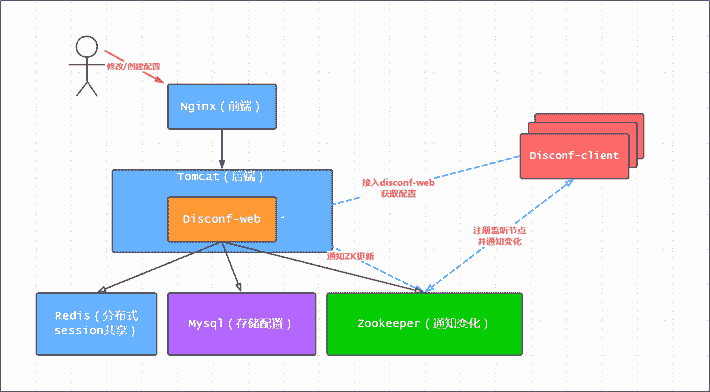

# 字节跳动 2018 校招大数据方向（第三批）

## 1

以下函数用于找到整数矩阵 matrix 中，元素之和最大的 n 行 m 列的子矩阵的元素之和。请指出程序代码中错误的地方（问题不止一处，请尽量找出所有你认为错误的地方），并在不新增代码行的情况下将问题修复。 1 int maxSubmatrixSum(std::vector<std::vector<int>> matrix,
 2                     int n, int m) {
 3   int base_sum;
 4   for (int i = 0; i < n; i++){
 5     for (int j = 0; j < m; j++){
 6       base_sum += matrix[i][j];
 7     }
 8   }
 9   int result = 0;
10   for (int i = 0; i + n < matrix.size(); i++) {
11     if(i  > 0){
12       for (int y = 0; y < m; y++){
13         base_sum += matrix[i + n][y] - matrix[i - 1][y];
14       }
15     }
16     int real_sum = base_sum;
17     if (real_sum  > result) {
18       result = real_sum;
19     }
20     for (int j = 0; j + m < matrix.size(); j++) {
21       for (int x = 0; x < n; x++) {
22         real_sum += matrix[x][j + m] - matrix[x][j - 1];
23       }
24       if (real_sum > result) {
25         result = real_sum;
26       }
27     }
28   }
29   return result;
30 }

你的答案

本题知识点

大数据开发工程师 字节跳动 2018

讨论

[牛客 545521097 号](https://www.nowcoder.com/profile/545521097)

如有错误，请指正！int maxSubmatrixSum(std::vector<std::vector<int>> matrix,int n, int m) {
int base_sum;
for (int i = 0; i < n; i++){
for (int j = 0; j < m; j++){
base_sum += matrix[i][j];
}
}
int result = 0;//i+n 修改为 i+n-1
for (int i = 0; i + n-1 < matrix.size(); i++) {
if(i  > 0){
for (int y = 0; y < m; y++){//i+n 修改为 i+n-1base_sum += matrix[i + n-1][y] - matrix[i - 1][y];
}
}
int real_sum = base_sum;
if (real_sum  > result) {
result = real_sum;
}
for (int j = 0; j + m < matrix[0].size(); j++) {
for (int x = 0; x < n; x++) {//x 修改为 x+i， matrix[x + i][j - 1]修改为 matrix[x + i][j]
real_sum += matrix[x + i][j + m] - matrix[x + i][j];
}
if (real_sum > result) {
result = real_sum;
}
}
}
return result;
}

编辑于 2019-01-08 21:24:57

* * *

## 2

二阶魔方又叫小魔方，是 2*2*2 的立方形结构。每一面都有 4 个块，共有 24 个块。每次操作可以将任意一面逆时针或者顺时针旋转 90°，如将上面逆时针旋转 90°操作如下。
Nero 在小魔方上做了一些改动，用数字替换每个块上面的颜色，称之为数字魔方。魔方上每一面的优美度就是这个面上 4 个数字的乘积，而魔方的总优美度就是 6 个面优美度总和。
现在 Nero 有一个数字魔方，他想知道这个魔方在操作不超过 5 次的前提下能达到的最大优美度是多少。
魔方展开后每一块的序号如下图：

本题知识点

模拟 递归 穷举 大数据开发工程师 字节跳动 2018

讨论

[零葬](https://www.nowcoder.com/profile/75718849)

利用 dfs 进行遍历，穷举所有的旋转结果

```cpp
import java.io.BufferedReader;
import java.io.InputStreamReader;
import java.io.IOException;

public class Main {
    static int[][] Rotate = {
        // FRONT
        {0, 1, 11, 5, 4, 16, 12, 6, 2, 9, 10, 17, 13, 7, 3, 15, 14, 8, 18, 19, 20, 21, 22, 23},
        // BEHIND
        {9, 15, 2, 3, 1, 5, 6, 7, 8, 19, 0, 11, 12, 13, 14, 18, 16, 17, 4, 10, 22, 20, 23, 21},
        // LEFT
        {20, 1, 22, 3, 10, 4, 0, 7, 8, 9, 11, 5, 2, 13, 14, 15, 6, 17, 12, 19, 16, 21, 18, 23},
        // RIGHT
        {0, 7, 2, 13, 4, 5, 6, 17, 14, 8, 10, 11, 12, 19, 15, 9, 16, 21, 18, 23, 20, 1, 22, 3},
        // UP
        {2, 0, 3, 1, 6, 7, 8, 9, 23, 22, 10, 11, 12, 13, 14, 15, 16, 17, 18, 19, 20, 21, 5, 4},
        // DOWN
        {0, 1, 2, 3, 4, 5, 6, 7, 8, 9, 21, 20, 10, 11, 12, 13, 18, 16, 19, 17, 15, 14, 22, 23}
    };

    static int[][] face = {
        {0, 1, 2, 3},
        {4, 5, 10, 11},
        {6, 7, 12, 13},
        {8, 9, 14, 15},
        {16, 17, 18, 19},
        {20,21, 22, 23}
    };

    public static void main(String[] args) throws IOException {
        BufferedReader br = new BufferedReader(new InputStreamReader(System.in));
        String[] strMagic = br.readLine().trim().split(" ");
        int[] magic = new int[24];
        for(int i = 0; i < 24; i++) magic[i] = Integer.parseInt(strMagic[i]);
        System.out.println(dfs(magic, 5));
    }

    private static long dfs(int[] magic, int opNum) {
        // 计算此时的优美度
        long grace = getGrace(magic);
        // 已经没有操作机会，直接返回
        if(opNum == 0) return grace;
        // 分别旋转 6 个面一次
        for(int face_id = 0; face_id < 6; face_id++){
            // 注意不能直接在原始的魔方上旋转，因为需要回溯（撤销本次旋转，对另外一个面进行旋转）
            int[] temp = new int[24];
            for(int i = 0; i < 24; i++) temp[i] = magic[i];
            // 顺时针旋转 1 次，然后更新 1 次最大优美度
            rotate(temp, face_id);
            grace = Math.max(grace, dfs(temp, opNum - 1));
            // 逆时针旋转 1 次（相当于顺时针旋转 3 次），然后更新 1 次最大优美度
            rotate(temp, face_id);
            rotate(temp, face_id);
            grace = Math.max(grace, dfs(temp, opNum - 1));
        }
        return grace;
    }

    // 顺时针旋转操作，根据旋转矩阵调整索引位置即可
    private static void rotate(int[] magic, int face_id) {
        int[] temp = new int[24];
        for(int i = 0; i < 24; i++) temp[i] = magic[i];
        for(int i = 0; i < 24; i++) magic[i] = temp[Rotate[face_id][i]];
    }

    private static long getGrace(int[] magic) {
        long sum = 0, mul = 1;
        for(int i = 0; i < 6; i++){      // 遍历每个面
            mul = 1;
            // 计算每个面的优美度
            for(int j = 0; j < 4; j++)
                mul *= magic[face[i][j]];
            sum += mul;
        }
        return sum;
    }
}
```

发表于 2021-01-27 16:38:39

* * *

[TER](https://www.nowcoder.com/profile/808518194)

无从下手

发表于 2020-03-31 17:42:07

* * *

[Yuha](https://www.nowcoder.com/profile/8029619)

本题思路:BFS，模拟每次转动的经过，暴力破解，遍历次数 12⁵(顺时针、逆时针)、（前、后、左、右、上、下）

发表于 2020-04-29 08:27:47

* * *

## 3

有一个推箱子的游戏, 一开始的情况如下图:
上图中, '.' 表示可到达的位置, '#' 表示不可到达的位置，其中 S 表示你起始的位置, 0 表示初始箱子的位置, E 表示预期箱子的位置，你可以走到箱子的上下左右任意一侧, 将箱子向另一侧推动。如下图将箱子向右推动一格;

..S0.. -> ...S0\.

注意不能将箱子推动到'#'上, 也不能将箱子推出边界;

现在, 给你游戏的初始样子, 你需要输出最少几步能够完成游戏, 如果不能完成, 则输出-1。

本题知识点

模拟 大数据开发工程师 字节跳动 2018

讨论

[零葬](https://www.nowcoder.com/profile/75718849)

利用 bfs 进行穷举搜索，计算到达终点的最少步数，需要注意的是：人的位置必须到达箱子的上下左右时才可以带着箱子进行相同方向的移动，否则就只能人动箱子不动。

```cpp
import java.io.BufferedReader;
import java.io.InputStreamReader;
import java.io.IOException;
import java.util.LinkedList;
import java.util.Queue;

public class Main {
    // 移动矩阵（上下向左右移动时，横纵坐标的改变）
    static int[][] move = {{0, -1}, {0, 1}, {-1, 0}, {1, 0}};
    public static void main(String[] args) throws IOException {
        BufferedReader br = new BufferedReader(new InputStreamReader(System.in));
        String[] temp = br.readLine().trim().split(" ");
        int n = Integer.parseInt(temp[0]), m = Integer.parseInt(temp[1]);
        char[][] maze = new char[n][];
        for(int i = 0; i < n; i++)
            maze[i] = br.readLine().trim().toCharArray();
        // 人的起始位置 S 以及箱子的位置
        int startX = 0, startY = 0, boxX = 0, boxY = 0;
        // 判断位置，即人要先找到箱子，再推着箱子往前走
        for(int i = 0; i < n; i++){  
            for(int j = 0; j < m; j++){
                if(maze[i][j] == 'S'){
                    // 人开始的位置
                    startX = i;
                    startY = j;
                }
                if(maze[i][j] == '0'){
                    // 箱子的位置
                    boxX = i;
                    boxY = j;
                }
            }
        }
        System.out.println(bfs(maze, startX, startY, boxX, boxY));
    }

    private static int bfs(char[][] maze, int startX, int startY, int boxX, int boxY) {
        Node start = new Node(startX, startY, boxX, boxY);
        int n = maze.length;
        int m = maze[0].length;
        // iswalked 四维数组，可以用来存储走过的路径以防重复。
        int[][][][] iswalked = new int[n][n][m][m];
        // 每个节点都有 4 个方向的移动，分别是上下左右
        int[][] moveDirection = new int[][]{{-1, 0}, {1, 0}, {0, -1}, {0, 1}};
        Queue<Node> queue = new LinkedList<>();  // 利用队列实现 BFS
        start.step = 0;
        queue.offer(start);
        // 开始 BFS 广度搜索最短路径
        while(!queue.isEmpty()){
            Node cur = queue.poll();
            int newBx = cur.bx;
            int newBy = cur.by;
            // 向 4 个方向走
            for(int i = 0; i < 4; i++){
                // 人在箱子的左右上下才能够推箱子，否则箱子的坐标不变
                if(cur.px == cur.bx){
                     if(cur.py + moveDirection[i][1] == cur.by){
                         newBy = cur.by + moveDirection[i][1];
                     }else{
                         newBy = cur.by;
                     }
                }
                if(cur.py == cur.by){
                    if(cur.px + moveDirection[i][0] == cur.bx){
                        newBx = cur.bx + moveDirection[i][0];
                    }else{
                        newBx = cur.bx;
                    }
               }
                // 箱子找到了要随人往 4 个方向动；没找到则箱子不动人动
                Node next = new Node(cur.px + moveDirection[i][0], cur.py + moveDirection[i][1], newBx, newBy); 
                // 不能让人在没找到箱子之前出地图或者自己提前到目的地
                if(next.px < 0 || next.px  >= n || next.py < 0||next.py >= m 
                   || next.bx < 0||next.bx >= n||next.by < 0||next.by >= m
                   || maze[next.px][next.py] == '#'
                   || maze[next.bx][next.by] == '#'){
                    continue;
                }
                // 0 说明这条路径没有走过
                if(iswalked[next.px][next.bx][next.py][next.by] == 0){
                    iswalked[next.px][next.bx][next.py][next.by] = 1;
                    next.step = cur.step + 1;
                    if(maze[next.bx][next.by] == 'E'){
                        // 此时把箱子推到终点了
                        return next.step;  // 最先到终点的就是最短路径
                    }
                    queue.offer(next);
                }
            }
        }
        return -1;
    }

    private static class Node{
        // 人的位置
        int px;
        int py;
        // 箱子的位置
        int bx;
        int by;
        // 从初始位置到现在节点所走的步数
        int step;
        public Node(int px, int py, int bx, int by){
            this.px = px;
            this.py = py;
            this.bx = bx;
            this.by = by;
        }
    }
}
```

发表于 2021-01-27 17:05:03

* * *

## 4

有 n 个房间，现在 i 号房间里的人需要被重新分配，分配的规则是这样的：先让 i 号房间里的人全都出来，接下来按照 i+1, i+2, i+3, ... 的顺序依此往这些房间里放一个人，n 号房间的的下一个房间是 1 号房间，直到所有的人都被重新分配。

现在告诉你分配完后每个房间的人数以及最后一个人被分配的房间号 x，你需要求出分配前每个房间的人数。数据保证一定有解，若有多解输出任意一个解。

本题知识点

模拟 递归 动态规划 大数据开发工程师 字节跳动 2018

## 5

在生产环境，我们常常要存储一些像服务参数、功能开关之类的键值。传统的做法是把配置都写到文件里，然后同步到线上每台机器上。随着机器变多，配置文件变得难以管理，并且容易出现不一致的情况。我们希望设计一个配置服务来解决这个问题。

统一配置服务可能会存在以下问题：由于是非常核心的服务，如果存在单节点问题对服务可用性影响非常大；线上可能读取非常频繁，尽可能提供高性能的服务同时，也要考虑横向扩容能力；需要保证配置在期望的时间内下发与更新；

请设计一个存储服务，包含但不限于以下角色：服务端（可能由多个节点组成），客户端（读取、写入一个配置），其他（如旁路的监控等）；

系统假设：

1、存储量都在 1GB 以内，单机内存可以存储下；

2、每秒写入在 1000 以内

3、每秒读取在 1000000 以上

4、使用尽量少的节点

5、无论什么时候，服务总是可以读写

6、允许故障期间读到老的配置数据

7、故障恢复后，数据保持同步

你的答案

本题知识点

大数据开发工程师 字节跳动 2018

讨论

[sichengLv](https://www.nowcoder.com/profile/253572)

Disconf 配置中心：[`github.com/knightliao/disconf`](https://github.com/knightliao/disconf)Apollo 配置中心：[`github.com/ctripcorp/apollo`](https://github.com/ctripcorp/apollo)

发表于 2018-03-24 15:49:17

* * *

[伍便士](https://www.nowcoder.com/profile/9622828)

典型的 zookeeper 适用场景。配置信息在集群中各节点共享，数据内容动态变化。服务端：一个 leader，多个 follower，多个 observer。主备模式。一般总量在奇数 3 到 5 台。leader 负责读写，客户端所有写操作都传到 leader 上完成，其他节点可以提供读操作。横向扩展增加机器可以提高读性能，但不提高集群的事务处理能力。各节点数据实时一致。数据一致性和崩溃恢复由 ZAB 协议保证。集群中每个节点向 leader 注册 watcher 监听，数据更新时 leader 广播机制向集群广播更新数据，来实现数据一致性。若 leader 宕掉，监听节点收到通知，并进行 leader***，采用过半机制提高集群性能。

发表于 2018-03-08 12:10:07

* * *