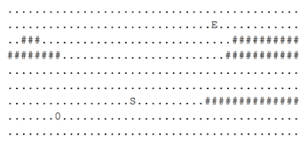

# 字节跳动 2018 校招 ios 方向（第三批）

## 1

以下函数用于找到整数矩阵 matrix 中，元素之和最大的 n 行 m 列的子矩阵的元素之和。请指出程序代码中错误的地方（问题不止一处，请尽量找出所有你认为错误的地方），并在不新增代码行的情况下将问题修复。 1 int maxSubmatrixSum(std::vector<std::vector<int>> matrix,
 2                     int n, int m) {
 3   int base_sum;
 4   for (int i = 0; i < n; i++){
 5     for (int j = 0; j < m; j++){
 6       base_sum += matrix[i][j];
 7     }
 8   }
 9   int result = 0;
10   for (int i = 0; i + n < matrix.size(); i++) {
11     if(i  > 0){
12       for (int y = 0; y < m; y++){
13         base_sum += matrix[i + n][y] - matrix[i - 1][y];
14       }
15     }
16     int real_sum = base_sum;
17     if (real_sum  > result) {
18       result = real_sum;
19     }
20     for (int j = 0; j + m < matrix.size(); j++) {
21       for (int x = 0; x < n; x++) {
22         real_sum += matrix[x][j + m] - matrix[x][j - 1];
23       }
24       if (real_sum > result) {
25         result = real_sum;
26       }
27     }
28   }
29   return result;
30 }

你的答案

本题知识点

iOS 工程师 字节跳动 2018

## 2

有一个推箱子的游戏, 一开始的情况如下图:
上图中, '.' 表示可到达的位置, '#' 表示不可到达的位置，其中 S 表示你起始的位置, 0 表示初始箱子的位置, E 表示预期箱子的位置，你可以走到箱子的上下左右任意一侧, 将箱子向另一侧推动。如下图将箱子向右推动一格;

..S0.. -> ...S0\.

注意不能将箱子推动到'#'上, 也不能将箱子推出边界;

现在, 给你游戏的初始样子, 你需要输出最少几步能够完成游戏, 如果不能完成, 则输出-1。

本题知识点

模拟 iOS 工程师 字节跳动 2018

讨论

[Reyzal](https://www.nowcoder.com/profile/9605341)

```cpp
//编程题 1
#include <iostream>
#include <sstream>
#include <vector>
#include <string>
#include <algorithm>
#include <deque>
#include <memory.h>
#include <queue>
#include <functional>
using namespace std;

int rows, cols;
vector<string> mat;
bool visited[50][50][50][50];

struct Step
{
    int manx, many;
    int boxx, boxy;
    int times;

    bool checkman()
    {
        return manx >= 0 && manx < cols && many >= 0 && many < rows && mat[many][manx] == '.';
    }

    bool checkbox()
    {
        return boxx >= 0 && boxx < cols && boxy >= 0 && boxy < rows && mat[boxy][boxx] == '.';
    }
    bool checkvisit()
    {
        if (visited[manx][many][boxx][boxy])
            return true;
        visited[manx][many][boxx][boxy] = true;
        return false;
    }
};

int main(int argc, char** argv) {
    cin >> rows >> cols;
    mat.resize(rows);
    int expectx, expecty;
    Step InitStep;
    for (size_t i = 0; i < rows; i++)
    {
        cin >> mat[i];
        for (size_t j = 0; j < cols; j++)
        {
            if (mat[i][j] == 'S') {
                InitStep.manx = j;
                InitStep.many = i;
                mat[i][j] = '.';
            }
            if (mat[i][j] == '0') {
                InitStep.boxx = j;
                InitStep.boxy = i;
                mat[i][j] = '.';
            }
            if (mat[i][j] == 'E') {
                expectx = j;
                expecty = i;
                mat[i][j] = '.';
            }
        }
    }
    InitStep.times = 0;
    int dirs[4][2] = {
        { -1,0 },
        { 0,1 },
        { 1,0 },
        { 0,-1 }
    };
    memset(visited, 0, 50 * 50 * 50 * 50);
    queue<Step> q;
    q.push(InitStep);
    int result = -1;
    while (result == -1 && !q.empty())
    {
        Step front = q.front();
        q.pop();
        for (size_t dir = 0; dir < 4; dir++)
        {
            //方向 左下右上
            Step nextStep = front;
            nextStep.times++;
            nextStep.manx += dirs[dir][0];
            nextStep.many += dirs[dir][1];
            if (!nextStep.checkman())
                continue;
            if (nextStep.manx == nextStep.boxx &&
                nextStep.many == nextStep.boxy) {
                nextStep.boxx += dirs[dir][0];
                nextStep.boxy += dirs[dir][1];
                if (!nextStep.checkbox())
                    continue;
            }
            if (nextStep.checkvisit())
                continue;
            if (nextStep.boxx == expectx &&
                nextStep.boxy == expecty)
            {
                //cout << "找到"<<nextStep.times << endl;
                result = nextStep.times;
                break;
            }
            q.push(nextStep);
        }
    }
    cout << result << endl;
    return 0;
} 
```

更多牛客网题解代码从[`github.com/ReyzalX/nowcoder`](https://github.com/ReyzalX/nowcoder)获取

发表于 2018-03-23 21:55:02

* * *

## 3

有 n 个房间，现在 i 号房间里的人需要被重新分配，分配的规则是这样的：先让 i 号房间里的人全都出来，接下来按照 i+1, i+2, i+3, ... 的顺序依此往这些房间里放一个人，n 号房间的的下一个房间是 1 号房间，直到所有的人都被重新分配。

现在告诉你分配完后每个房间的人数以及最后一个人被分配的房间号 x，你需要求出分配前每个房间的人数。数据保证一定有解，若有多解输出任意一个解。

本题知识点

模拟 递归 动态规划 iOS 工程师 字节跳动 2018

讨论

[布白](https://www.nowcoder.com/profile/8834439)

从房间 x 出发往前（注意头尾成环）寻找第一个最小人数的房间，即为被重新分配的房间 iii；

然后该房间人数代表的循环分配的轮数 cycle，要注意从房间 (iii + 1) 往后到房间 x（注意头尾成环）这一部分是多了一轮循环的；

找到了分配房间 iii 和循环分配轮数 cycle，就可以把房间人数恢复回去了，代码如下：

```cpp
int main()
{
    int n, x;
    cin >> n >> x;
    long room[n];
    for (int i = 0; i < n; i++) cin >> room[i];

    x--;
    int iii = x;
    long min = room[x];
    for (int i = x + n; i > x; i--)   // 寻找分配房间 iii
        if (room[i % n] < min) min = room[i % n], iii = i % n;

    if (iii > x) x += n;
    for (int i = iii + 1; i <= x; i++) room[i % n]--;   // 处理多一轮循环
    long cycle = room[iii];
    for (int i = 0; i < n; i++) room[i] -= cycle;   // 处理所有房间
    room[iii] = cycle * n + x - iii;   // 恢复分配房间人数

    for (int i = 0; i < n - 1; i++) cout << room[i] << " ";
    cout << room[n - 1];

    return 0;
}
```

编辑于 2018-03-24 15:08:05

* * *

[Reyzal](https://www.nowcoder.com/profile/9605341)

```cpp
//编程题 2
#include <iostream>
#include <vector>
#include <algorithm>
using namespace std;

int main() {
    int n, x;
    while (cin >> n) {
        cin >> x;
        if (n == 0) continue;
        vector<long long> data(n);
        long long mindata = 0x7fffffff;
        for (size_t i = 0; i < n; i++) {
            cin >> data[i];
            mindata = min(data[i], mindata);
        }
        if (mindata == data[x - 1]) {
            for (auto& it : data) {
                it -= mindata;
            }
            data[x - 1] = mindata * n;
        } else {
            //从 x 往前出发，遇到的第一个最小值就是开始点
            int begin = x - 1 + n;
            int count = 0;
            while (mindata != data[begin % n]) {
                data[begin % n]--;
                count++;
                begin--;
            }
            for (auto& it : data) {
                it -= mindata;
            }
            data[begin % n] = mindata * n + count;
        }
        for (size_t i = 0; i < n; i++)
        {
            cout << data[i] << (i == n - 1 ? '\n' : ' ');
        }
    }

    return 0;
} 
```

更多牛客网题解代码从[`github.com/ReyzalX/nowcoder`](https://github.com/ReyzalX/nowcoder)获取

发表于 2018-03-23 21:55:53

* * *

## 4

 iOS 开发中常常用到 KVO、Notification、Delegate、Block 等技术进行消息的传递

1）请简述上述名词分别的含义

2）请简述在使用以上技术时，需要注意哪些问题

3）请简述以上技术使用场景

你的答案

本题知识点

iOS 工程师 字节跳动 2018

## 5

【设计题】App 发展到一定程度时，页面越来越多，工程越来越大，合作开发的人也越来越多，这时就可能需要引入路由系统，实现模块间的解耦。请设计一个路由系统，使得 app 内页面的跳转就像浏览器访问网页一样易于管理和解耦。

你的答案

本题知识点

iOS 工程师 字节跳动 2018