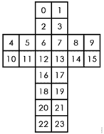

# 字节跳动 2018 校招后端方向（第三批）

## 1

以下函数用于找到整数矩阵 matrix 中，元素之和最大的 n 行 m 列的子矩阵的元素之和。请指出程序代码中错误的地方（问题不止一处，请尽量找出所有你认为错误的地方），并在不新增代码行的情况下将问题修复。 1 int maxSubmatrixSum(std::vector<std::vector<int>> matrix,
 2                     int n, int m) {
 3   int base_sum;
 4   for (int i = 0; i < n; i++){
 5     for (int j = 0; j < m; j++){
 6       base_sum += matrix[i][j];
 7     }
 8   }
 9   int result = 0;
10   for (int i = 0; i + n < matrix.size(); i++) {
11     if(i  > 0){
12       for (int y = 0; y < m; y++){
13         base_sum += matrix[i + n][y] - matrix[i - 1][y];
14       }
15     }
16     int real_sum = base_sum;
17     if (real_sum  > result) {
18       result = real_sum;
19     }
20     for (int j = 0; j + m < matrix.size(); j++) {
21       for (int x = 0; x < n; x++) {
22         real_sum += matrix[x][j + m] - matrix[x][j - 1];
23       }
24       if (real_sum > result) {
25         result = real_sum;
26       }
27     }
28   }
29   return result;
30 }

你的答案

本题知识点

C++工程师 Java 工程师 字节跳动 2018

讨论

[(ง•̀_•́)ง😀️](https://www.nowcoder.com/profile/6359713)

主要问题在于：
第 10 行循环结束的条件应为 i+n-1<matrix.size();
第 13 行 base_sum += matrix[i + n-1][y] - matrix[i - 1][y];
第 21 行 x 从 i 开始，到 x<i+n
第 22 行 real_sum += matrix[x][j + m] - matrix[x][j];

```cpp
 1 int maxSubmatrixSum(std::vector<std::vector<int>> matrix,
 2                     int n, int m) {
 3   int base_sum;
 4   for (int i = 0; i < n; i++){
 5     for (int j = 0; j < m; j++){
 6       base_sum += matrix[i][j];
 7     }
 8   }
 9   int result = 0;
10   for (int i = 0; i + n-1 < matrix.size(); i++) {
11     if(i  > 0){
12       for (int y = 0; y < m; y++){
13         base_sum += matrix[i + n-1][y] - matrix[i - 1][y];
14       }
15     }
16     int real_sum = base_sum;
17     if (real_sum  > result) {
18       result = real_sum;
19     }
20     for (int j = 0; j + m < matrix[i].size(); j++) {
21       for (int x = i; x < i+n; x++) {
22         real_sum += matrix[x][j + m] - matrix[x][j];
23       }
24       if (real_sum > result) {
25         result = real_sum;
26       }
27     }
28   }
29   return result;
30 }
```

编辑于 2019-06-14 09:54:02

* * *

[hliang](https://www.nowcoder.com/profile/9685985)

 1 int maxSubmatrixSum(std::vector<std::vector<int>> matrix,
 2                     int n, int m) {
 3   int base_sum;
 4   for (int i = 0; i < n; i++){
 5     for (int j = 0; j < m; j++){
 6       base_sum += matrix[i][j];
 7     }
 8   }
 9   int result = 0;
10   for (int i = 0; i + n < matrix.size(); i++) {
11     if(i  > 0){
12       for (int y = 0; y < m; y++){
13         base_sum += matrix[i + n-1][y] - matrix[i - 1][y];
14       }
15     }
16     int real_sum = base_sum;
17     if (real_sum  > result) {
18       result = real_sum;
19     }
20     for (int j = 0; j + m < matrix[0].size(); j++) {
21       for (int x = i; x < i+n; x++) {
22         real_sum += matrix[x][j + m] - matrix[x][j];
23       }
24       if (real_sum > result) {
25         result = real_sum;
26       }
27     }
28   }
29   return result;
30 }

发表于 2018-12-09 13:25:31

* * *

[Schrodingers_Cat](https://www.nowcoder.com/profile/539960070)

主要问题在于边界处理不合适 1\. 行的上界为 i + n - 1 而不是 i + n2\. 列的上界为 j + m - 1 而不是 j + m3\. 对最后对行进行求和的时候元素的行索引是 i + x 而不是 xint  maxSubmatrixSum(std::vector<std::vector<int>> matrix, int n, int m){ int base_sum; for (int i =  0; i < n; i++){ for (int j =  0; j < m; j++){base_sum += matrix[i][j];        }    } int result =  0; for (int i =  0; i + n -  1  < matrix.size(); i++) { if(i >  0){ for (int y =  0; y < m; y++){base_sum += matrix[i + n -  1][y] - matrix[i -  1][y];            }        } int real_sum = base_sum; if (real_sum > result) {result = real_sum;        } for (int j =  0; j + m -  1  < matrix.size(); j++) { for (int x =  0; x < n; x++) {real_sum += matrix[i+x][j + m -  1] - matrix[i+x][j -  1];            } if (real_sum > result) {result = real_sum;            }        }    } return result;}

发表于 2019-03-15 20:52:06

* * *

## 2

二阶魔方又叫小魔方，是 2*2*2 的立方形结构。每一面都有 4 个块，共有 24 个块。每次操作可以将任意一面逆时针或者顺时针旋转 90°，如将上面逆时针旋转 90°操作如下。
Nero 在小魔方上做了一些改动，用数字替换每个块上面的颜色，称之为数字魔方。魔方上每一面的优美度就是这个面上 4 个数字的乘积，而魔方的总优美度就是 6 个面优美度总和。
现在 Nero 有一个数字魔方，他想知道这个魔方在操作不超过 5 次的前提下能达到的最大优美度是多少。
魔方展开后每一块的序号如下图：

本题知识点

模拟 递归 穷举 C++工程师 Java 工程师 字节跳动 2018

讨论

[FlushHip](https://www.nowcoder.com/profile/7741213)

整套试卷详细解析：[`blog.csdn.net/flushhip/article/details/78267949`](http://blog.csdn.net/flushhip/article/details/78267949)

发表于 2017-12-31 12:58:50

* * *

[牛客 743990498 号](https://www.nowcoder.com/profile/743990498)



```cpp
import java.util.*;
import java.io.*;

public class Main {
    public static void main (String[] args) {
        record = new ArrayList<>();

        //魔方共有 6 种旋转方式。（逆时针旋转魔方的面朝你的一半等同于顺时针旋转魔方后侧的一半）
       //旋转一次发生两种变化，以上图为例：
        //假设面朝 4,5,10,11,将面前的平面逆时针旋转 90 度
        //0,2,6,12,16,18,20,22 编号的 8 个数字交换位置，结束后新的位置为 6,12,16,18,20,22,0,2
        //4,5,11,10 编号的 4 个数字变换位置，结束后新的位置为 5,11,10,4
        //record 里第一个 int[]用于记录此次旋转会改变的所有数字
        //之后每个 int[]各记录旋转一个平面后将改变的数字且遵从刚才的数字空间排列顺序

        record.add(new int[] {0,2,6,12,16,18,20,22,4,5,11,10}); 
        record.add(new int[] {1,3,7,13,17,19,21,23,8,14,15,9});
        record.add(new int[] {4,5,6,7,8,9,23,22,0,2,3,1});
        record.add(new int[] {10,11,12,13,14,15,21,20,16,17,19,18});
        record.add(new int[] {0,1,9,15,19,18,10,4,20,22,23,21});
        record.add(new int[] {2,3,8,14,17,16,11,5,6,7,13,12});
        Scanner s = new Scanner(System.in);
        String[] str_arr = s.nextLine().split(" ");
        int[] arr = new int[str_arr.length];
        for (int i=0; i<str_arr.length; i++) {
            arr[i] = Integer.parseInt(str_arr[i]);
        }
        //arr 是初始魔方
        System.out.println(turn(arr, 5));
    }

    //l 为魔方本身， remain 为剩余旋转次数， 返回最多旋转 remain 次魔方的最大优美度
    private static int turn (int[] l, int remain) {
        //不可再旋转，返回当前优美度即可
        if (remain==0) {
            return mult(l);
        }
        int result = -99999;
        int temp;
        for (int[] r:record) {
            int[] n = l.clone();

            //根据 record 变换魔方内的值 
            temp = n[r[6]];
            for (int i=4; i>=0; i-=2) {
                n[r[i+2]] = n[r[i]];
            }
            n[r[0]] = temp;
            temp = n[r[7]];
            for (int i=5; i>=1; i-=2) {
                n[r[i+2]] = n[r[i]];
            }
            n[r[1]] = temp;
            temp = n[r[11]];
            for (int i=10; i>=8; i--) {
                n[r[i+1]] = n[r[i]];
            }
            n[r[8]] = temp;

            //使用新魔方进行 remain-1 次旋转
            temp = turn(n, remain-1);

            //取最大优美度
            if (temp>result) result = temp;
        }
        //返回最大优美度
        return Math.max(mult(l),result);
    }

    //计算单个魔方优美度
    private static int mult (int[] l) {
        return l[0]*l[1]*l[2]*l[3]+l[4]*l[5]*l[10]*l[11]+l[6]*l[7]*l[12]*l[13]+l[8]*l[9]*l[14]*l[15]
            +l[16]*l[17]*l[18]*l[19]+l[20]*l[21]*l[22]*l[23];
    }

    private static List<int[]> record;
}
```

编辑于 2021-03-04 20:47:47

* * *

[forstwang](https://www.nowcoder.com/profile/149725703)

思路很简单，就是先计算当前的优美度。然后计算旋转一次后所有可能的最大优美度。取最大值。在旋转一次后的最大优美度可以递归的计算出来。当旋转次数为 0 时就是递归出口。

```cpp
import java.util.*;

public class Main {
    public static void main(String[] args) {
        Scanner scanner = new Scanner(System.in);
        int n = 24;
        int[] nore = new int[24];
        int i  =0;
        while(n-- > 0 && scanner.hasNextInt()) {
              nore[i++] = scanner.nextInt();
        }
        System.out.println(caculate(nore , 5));

    }

    private static int caculate(int[] nore, int k) {
        int ans  = nore[0] * nore[1] * nore[2]* nore[3];
            ans += nore[4] * nore[5] * nore[10]* nore[11];
            ans += nore[6] * nore[7] * nore[12]* nore[13];
            ans += nore[8] * nore[9] * nore[14]* nore[15];
            ans += nore[16] * nore[17] * nore[18]* nore[19];
            ans += nore[20] * nore[21] * nore[22]* nore[23];
        if(k == 0) {
            return ans;
        }
        //逆时针旋转上面  8-2 14-3  2-11 3-5 11-17 5-16   17-8 16-14
        ans = Math.max(caculate(transform(nore , 2 , 8, 17 , 11 , 3 , 14 , 16 , 5 , 6 , 7 , 13 , 12 ) , k-1) , ans);
         //顺时针旋转上面
        ans = Math.max(caculate(transform(nore , 11, 17, 8, 2 , 5 , 16,14,3 , 12 , 13 , 7 , 6) , k-1) , ans);
        //旋转前面
        ans = Math.max(caculate(transform(nore , 1 , 7 , 17 , 21, 3 , 13, 19 ,23 , 8 , 14 , 15 , 9) , k-1) , ans);
        ans = Math.max(caculate(transform(nore , 21 , 17,7,   1,  23, 19, 13,  3 , 9 , 15 , 14 , 8) , k-1) , ans);
        //旋转右面
        ans = Math.max(caculate(transform(nore , 15,13,11 ,20 , 14 , 12, 10 ,21 , 16  , 18 , 19,  17) , k-1) , ans);
        ans = Math.max(caculate(transform(nore , 20 , 11 , 13 ,15 ,21, 10 ,12,14 , 17 , 19 , 18 , 16) , k-1) , ans);
        return ans;
    }
    //旋转一次
    static int[] transform(int[] nore , int n1, int n2 ,int n3 ,int n4 ,int n5 , int n6 , int n7 , int n8 , int n9 , int n10 , int n11 , int n12) {
        int[] ans = Arrays.copyOf(nore, 24);
        ans[n1] = nore[n2];
        ans[n2] = nore[n3];
        ans[n3] = nore[n4];
        ans[n4] = nore[n1];
        ans[n5] = nore[n6];
        ans[n6] = nore[n7];
        ans[n7] = nore[n8];
        ans[n8] = nore[n5];
        ans[n9] = nore[n10];
        ans[n10] = nore[n11];
        ans[n11] = nore[n12];
        ans[n12] = nore[n9];
        return  ans;
    }
}
```

发表于 2020-08-18 22:43:12

* * *

## 3

有一个推箱子的游戏, 一开始的情况如下图:
上图中, '.' 表示可到达的位置, '#' 表示不可到达的位置，其中 S 表示你起始的位置, 0 表示初始箱子的位置, E 表示预期箱子的位置，你可以走到箱子的上下左右任意一侧, 将箱子向另一侧推动。如下图将箱子向右推动一格;

..S0.. -> ...S0\.

注意不能将箱子推动到'#'上, 也不能将箱子推出边界;

现在, 给你游戏的初始样子, 你需要输出最少几步能够完成游戏, 如果不能完成, 则输出-1。

本题知识点

模拟 C++工程师 Java 工程师 字节跳动 2018

讨论

[渡口的小太阳](https://www.nowcoder.com/profile/615721438)

bfs,注意找到箱子后和箱子一起移动

```cpp
import java.util.LinkedList;
import java.util.Queue;
import java.util.Scanner;

public class Main {
    public static void main(String[] args){
        Scanner sc=new Scanner(System.in);
        int n=sc.nextInt();
        int m=sc.nextInt();
        char[][] chas=new char[n][m];
        int startX=0,startY=0,boxX=0,boxY=0;
        for(int i=0;i<n;i++){
            String string=sc.next();
            for(int j=0;j<m;j++){
                chas[i][j]=string.charAt(j);
                if(chas[i][j]=='S'){
                    startX=i;
                    startY=j;
                }
                if(chas[i][j]=='0'){
                    boxX=i;
                    boxY=j;
                }
            }
        }
        System.out.println(bfsMinStep(chas,startX,startY,boxX,boxY));
    }

    public static class Node{
        int x;
        int y;
        int bx;
        int by;
        int step;
        public Node(int x,int y,int bx,int by){
            this.x=x;
            this.y=y;
            this.bx=bx;
            this.by=by;
        }
    }
    private static int bfsMinStep(char[][] chas,int startX, int startY,int boxX,int boxY) {
        Node start=new Node(startX, startY,boxX,boxY);
        int n=chas.length;
        int m=chas[0].length;
        boolean[][][][] isVisted=new boolean[n][m][n][m];

        int[][] dir=new int[][]{{1,0},{0,1},{-1,0},{0,-1}};
        Queue<Node> queue=new LinkedList<>();
        start.step=0;
        queue.add(start);
        while(!queue.isEmpty()){
            Node cur=queue.poll();
            int newBx=cur.bx;
            int newBy=cur.by;
            for(int i=0;i<4;i++){
                            //在箱子上面或下面
                if(cur.y==cur.by){
                     newBx=cur.x+dir[i][0]==cur.bx?cur.bx+dir[i][0]:cur.bx;
                }
                            //在箱子左边或右边
                if(cur.x==cur.bx){
                     newBy=cur.y+dir[i][1]==cur.by?cur.by+dir[i][1]:cur.by;    
                }
                Node next=new Node(cur.x+dir[i][0], cur.y+dir[i][1],newBx,newBy);
                if(next.x<0||next.x>=n||next.y<0||next.y>=m||chas[next.x][next.y]=='#'
                        ||next.bx<0||next.bx>=n||next.by<0||next.by>=m
                        ||chas[next.bx][next.by]=='#'){
                    continue;
                }
                if(!isVisted[next.x][next.y][next.bx][next.by]){
                    isVisted[next.x][next.y][next.bx][next.by]=true;
                    next.step=cur.step+1;
                    if(chas[next.bx][next.by]=='E'){
                        return next.step;
                    }
                    queue.add(next);
                }
            }
        }
        return -1;
    }
}

```

发表于 2019-04-23 22:39:15

* * *

[neekity](https://www.nowcoder.com/profile/7732482)

BFS 广搜实现最短步数 visit[p0][p1][b0][b1]存储状态信息：人的位置[p0,p1],箱子的位置[b0][b1]

```cpp
from collections import deque
n,m=map(int,input().split())
board=[]
s=[]
b=[]
for i in range(n):
    tmp=input()
    board.append(tmp)
    if not s:
        sidx=tmp.find('S')
        if sidx!=-1: s=[i,sidx]
    if not b:
        bidx=tmp.find('0')
        if bidx!=-1: b=[i,bidx]
step=-1
q=deque([(s[0],s[1],b[0],b[1],0)])
visit=[[[[False]*m for _ in range(n)]for _ in range(m)]for _ in range(n)]
visit[s[0]][s[1]][b[0]][b[1]]=True
while q:
    p0,p1,b0,b1,cnt=q.popleft()
    if board[b0][b1]=='E': 
        step=cnt
        break 
    for dx,dy in zip((-1,0,1,0),(0,-1,0,1)):
        nx,ny=p0+dx,p1+dy
        if 0<=nx<n and 0<=ny<m and board[nx][ny]!='#':
            if nx==b0 and ny==b1:
                nb0,nb1=b0+dx,b1+dy
                if 0<=nb0<n and 0<=nb1<m and board[nb0][nb1]!='#':
                    if not visit[nx][ny][nb0][nb1]:
                        visit[nx][ny][nb0][nb1]=True
                        q.append((nx,ny,nb0,nb1,cnt+1))
            else:
                if not visit[nx][ny][b0][b1]:
                    visit[nx][ny][b0][b1]=True
                    q.append((nx,ny,b0,b1,cnt+1))
print(step)

```

发表于 2019-03-28 13:42:41

* * *

[牛客 302235906 号](https://www.nowcoder.com/profile/302235906)

无需使用优先队列，我们只需要记录步数，每过一层就走一步，这里 while(size--> 0) 结束算做一层，当第一次遇到终点的时候，返回 step 即可我是在 poll() 后就进行判断，这样可以同时解决最开始箱子就在终点的情况，不同去特判

```cpp
import java.util.*;
public class Main{
    public static void main(String[] args){
        Scanner sc = new Scanner(System.in);
        Main main = new Main();
        //行
        int rlen = sc.nextInt();
        //列
        int llen = sc.nextInt();
        String[] strs = new String[rlen];
        for(int i = 0; i < rlen; i++){
            strs[i] = sc.next();
        }

        char[][] grid = new char[rlen][llen];
                //O(mn) 查找 人物坐标、箱子坐标
        int px = 0, py = 0, bx = 0, by = 0;
        for(int i = 0; i < rlen; i++){
            for(int j = 0; j < llen; j++){
                grid[i][j] = strs[i].charAt(j);
                if(grid[i][j] == 'S'){
                    px = i;
                    py = j;
                }
                if(grid[i][j] == '0'){
                    bx = i;
                    by = j;
                }
            }
        }
        System.out.println(main.helper(grid, px, py, bx, by));
    }
    private int helper(char[][] grid, int px, int py, int bx, int by){
        int rlen = grid.length;
        int llen = grid[0].length;
        //visited[i][j][m][n] = true 表示 人物在 (i, j) 坐标和 箱子在 (m, n) 坐标 这个状态已经访问过了
        boolean[][][][] visited = new boolean[rlen][llen][rlen][llen];
        /*
        当人物在箱子的左边时，人物可以选择向右边走
        当人物在箱子的右边时，人物可以选择向左边走
        当人物在箱子的上边时，人物可以选择向下边走
        当人物在箱子的下边时，人物可以选择向上边走
        这样才能保证步数最少，否则，如果箱子在左边，人物还向着右边走，那么就距离箱子越来越远，这是毫无意义的步数

        什么时候箱子的位置会发生改变？
        当人物向上下两个方向走的时候，如果人物的下一个位置就是箱子的位置，
        那么相当于顶着箱子前进，那么箱子同时也要往前进
        */
        ;int[][] pos = {{0, 1}, {0, -1}, {1, 0}, {-1, 0}}

        Queue<Node> queue = new ArrayDeque<>();
        queue.add(new Node(px, py, bx, by));
        int step = 0;
        while(!queue.isEmpty()){
            int size = queue.size();
            while(size-- > 0){
                Node node = queue.poll();
                if(grid[node.bx][node.by] == 'E'){
                    return step;
                }
                //往四个方向走
                for(int[] p : pos){
                    int newPx = node.px + p[0];
                    int newPy = node.py + p[1];
                    int newBx = node.bx;
                    int newBy = node.by;
                    //人物的前进位置刚好是箱子的位置，那么箱子的位置也要发生改变
                    if(newPx == node.bx && newPy == node.by){
                        newBx += p[0];
                        newBy += p[1];
                    }
                    //越界或者在障碍物上，那么跳过
                    if(newPx < 0 || newPx == rlen || newPy < 0 || newPy == llen
                      || newBx < 0 || newBx == rlen || newBy < 0 || newBy == llen
                      || grid[newPx][newPy] == '#' || grid[newBx][newBy] == '#'){
                        continue;
                    }
                    if(!visited[newPx][newPy][newBx][newBy]){
                        visited[newPx][newPy][newBx][newBy] = true;
                        queue.add(new Node(newPx, newPy, newBx, newBy));
                    }
                }
            }
            step++;
        }
        return -1;
    }
    class Node{
        //人物坐标
        int px;
        int py;
        //箱子坐标
        int bx;
        int by;
        public Node(int px, int py, int bx, int by){
            this.px = px;
            this.py = py;
            this.bx = bx;
            this.by = by;
        }
    }
}
```

编辑于 2020-08-10 14:52:37

* * *

## 4

有 n 个房间，现在 i 号房间里的人需要被重新分配，分配的规则是这样的：先让 i 号房间里的人全都出来，接下来按照 i+1, i+2, i+3, ... 的顺序依此往这些房间里放一个人，n 号房间的的下一个房间是 1 号房间，直到所有的人都被重新分配。

现在告诉你分配完后每个房间的人数以及最后一个人被分配的房间号 x，你需要求出分配前每个房间的人数。数据保证一定有解，若有多解输出任意一个解。

本题知识点

模拟 递归 动态规划 C++工程师 Java 工程师 字节跳动 2018

讨论

[牛客 933581686 号](https://www.nowcoder.com/profile/933581686)

有一说一啊，这题目描述跟💩一样

发表于 2021-02-22 16:10:36

* * *

[空空就是悟空](https://www.nowcoder.com/profile/940001276)

```cpp
很简单，python3.5 代码：（总共 14 行）

def room(n, x, a):
    b = a[x:] + a[:x]
    b.reverse()
    m = min(b)
    i = b.index(m)
    for j in range(n):
        b[j] -= m
    for j in range(0,i):
        b[j] -= 1
    b[i] = i+m*n
    b.reverse()
    b = b[n-x:] + b[:n-x]
    for i in b:
        print(i, end = ' ')

```

发表于 2019-04-12 16:08:41

* * *

[满天星 520](https://www.nowcoder.com/profile/9886593)

```cpp
import java.util.Scanner;
/**
 * <a href=https://interview.nowcoder.com/questionTerminal/43068a1013b4417a85c2c2ce8b18159e>牛客描述</a>
 * 思路：分配后的房间里，人数最少的那一个房间就是 i 号房间。如果有多个房间人数最少，则取 x 号房间往前数的第一个人最少的房间。综上：无论哪种情况，从 x 房间往前数找到的第一个人最少的房间就是 i 号房间。
 * 找出 i 号房间后，就很容易求出之前的人数了。首先根据 i 号房间最后的人数确定完整的轮数，然后从 x 号往前再减去最后不足一轮的部分，然后把多出的人数全部补到第 i 个房间，就结束了
 * @author LBW
 */
public class Main {
    public static void main(String[] args) {
        Scanner scanner = new Scanner(System.in);
        int n = scanner.nextInt();
        int x = scanner.nextInt() - 1;
        long[] room = new long[n];
        long min = Long.MAX_VALUE;
        for (int i = 0; i < n; i++) {
            room[i] = scanner.nextInt();
            if (room[i] < min)
                min = room[i];
        }
        //get min_index
        int minIndex = x;
        while (room[minIndex] != min) {
            minIndex = minIndex > 0 ? minIndex - 1 : n - 1;
        }
        // remove the round number.
        for (int i = 0; i < n; i++) {
            room[i] -= min;
        }
        // remove the tail
        int remain = 0;
        for (int i = x; i != minIndex; i = i > 0 ? i - 1 : n - 1) {
            room[i] -= 1;
            remain += 1;
        }
        room[minIndex] += remain + n * min;
        //print the result
        for (int i = 0; i < n; i++) {
            System.out.print(room[i] + " ");
        }
    }
}
```

发表于 2018-11-07 09:58:05

* * *

## 5

在生产环境，我们常常要存储一些像服务参数、功能开关之类的键值。传统的做法是把配置都写到文件里，然后同步到线上每台机器上。随着机器变多，配置文件变得难以管理，并且容易出现不一致的情况。我们希望设计一个配置服务来解决这个问题。

统一配置服务可能会存在以下问题：由于是非常核心的服务，如果存在单节点问题对服务可用性影响非常大；线上可能读取非常频繁，尽可能提供高性能的服务同时，也要考虑横向扩容能力；需要保证配置在期望的时间内下发与更新；

请设计一个存储服务，包含但不限于以下角色：服务端（可能由多个节点组成），客户端（读取、写入一个配置），其他（如旁路的监控等）；

系统假设：

1、存储量都在 1GB 以内，单机内存可以存储下；

2、每秒写入在 1000 以内

3、每秒读取在 1000000 以上

4、使用尽量少的节点

5、无论什么时候，服务总是可以读写

6、允许故障期间读到老的配置数据

7、故障恢复后，数据保持同步

你的答案

本题知识点

C++工程师 Java 工程师 字节跳动 2018

讨论

[IT 小村](https://www.nowcoder.com/profile/429065690)

1.springcloud config 配置中心

发表于 2019-03-04 10:27:09

* * *