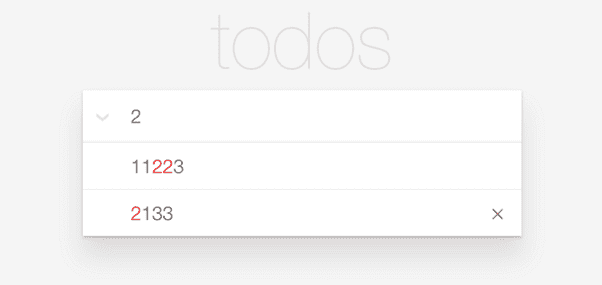

# 字节跳动 2018 校招前端方向（第二批）

## 1

 为了不断优化推荐效果，今日头条每天要存储和处理海量数据。假设有这样一种场景：我们对用户按照它们的注册时间先后来标号，对于一类文章，每个用户都有不同的喜好值，我们会想知道某一段时间内注册的用户（标号相连的一批用户）中，有多少用户对这类文章喜好值为 k。因为一些特殊的原因，不会出现一个查询的用户区间完全覆盖另一个查询的用户区间(不存在 L1<=L2<=R2<=R1)。 

本题知识点

哈希 *模拟 数组 查找 *前端工程师 字节跳动 2018** **讨论

[下雨天的纸飞机](https://www.nowcoder.com/profile/725406690)

```cpp
不吹不黑，这题我做了至少 5 个小时。
JS 代码如下：
```

let chaxunzuarr = [];
let yonghushu = readline(),
    xihaoduarr = readline().split(' '),
    chaxunzushu = readline();
for(let i = 0;i<chaxunzushu;i++){
    chaxunzuarr[i] = readline().split(' ');
}

let arr = [];
xihaoduarr.forEach((item,index) => {
    if(arr[item] == undefined){
        arr[item] = [];
    }
    arr[item].push(index);
});
for(let j = 0;j<chaxunzushu;j++){
    let start = chaxunzuarr[j][0] - 1,
    end = chaxunzuarr[j][1] - 1,
    value = chaxunzuarr[j][2],
    geshu = 0;
    if(arr[value] == undefined){
        console.log(0);
    }else{
        arr[value].forEach(e=>{
            if(e>=start && e<=end){
                geshu++;
            }
        })
        print(geshu);
    }
}

发表于 2019-04-21 15:31:49

* * *

[blitha](https://www.nowcoder.com/profile/312681099)

```cpp
//给前面的回答添加了点注释，方便阅读
let chaxunzuarr = [];
//第一行输入，用户个数
let yonghushu = readline(),
    //第二行输入，用户对应喜好，转化为数组
    xihaoduarr = readline().split(' '),
    //第三行输入，查询组数
    chaxunzushu = readline();
//循环所有查询组，4 行开始的所有行
for(let i = 0;i<chaxunzushu;i++){
    //取得每行值，转为数组
    chaxunzuarr[i] = readline().split(' ');
}
let arr = [];
//遍历喜好度数组，将相同喜好度的下标添加进一个新数组
//样例添加完后生成 arr=[,[0],[1],[2,3],,[4]]
xihaoduarr.forEach((item,index) => {
    if(arr[item] == undefined){
        arr[item] = [];
    }
    arr[item].push(index);
});

//遍历查询组
for(let j = 0;j<chaxunzushu;j++){
    //取得每行第一个数 l，转化为下标-1
    let start = chaxunzuarr[j][0] - 1,
    //取得每行第二个数 r，转化为下标-1
    end = chaxunzuarr[j][1] - 1,
    //取得每行第三个数 k，喜好度
    value = chaxunzuarr[j][2],
    //初始化结果用户个数
    geshu = 0;
    if(arr[value] == undefined){
        //下标数组为未定义时，无喜好度
        console.log(0);
    }else{
        //循环下标数组内元素，判断元素数组内元素是否处于标号间
        arr[value].forEach(e=>{
            if(e>=start && e<=end){
                geshu++;
            }
        })
        print(geshu);
    }
}

```

发表于 2019-05-16 09:51:44

* * *

[一叶之秋~](https://www.nowcoder.com/profile/1319299)

这个题的主要问题就是使用**顺序扫描**用户的时候会花费比较长的时间，从而导致超时

为了节省顺序查找的时间，我们可以利用**二分查找**的思路来实现：
1.使用 ArrrayList 将喜好值相同的用户 id 存储起来（此时这个 ArrayList 的用户 id 是递增的）
2.使用 hashmap 将该喜好值为 k 和对应的用户 id 的 list 进行存储
3.每次查找时找到对应 k 的 ArrayList 进行二分查找即可
最后可以通过所有测试用例

```cpp
import java.util.*;
public class Main{
    public int getCount(List<Integer> data, int target){
        int left=0, right = data.size()-1, middle=0;
        while(left <= right){
            middle = left + (right-left)/2;
            if (data.get(middle) > target)
                right = middle-1;
            else if(data.get(middle) < target)
                left = middle+1;
            else
                return middle;
        }
        return left;
    }

    public void f(){
        Scanner sc = new Scanner(System.in);
        while(sc.hasNextLine()){
            int n, q, l, r, k;
            n = Integer.parseInt(sc.nextLine());
            Map<Integer, List<Integer>> map = new HashMap<>();
            for(int i=1; i<=n; i++) {
                int worth = sc.nextInt();
                if(!map.containsKey(worth))
                    map.put(worth, new ArrayList<>());
                map.get(worth).add(i);
            }
            sc.nextLine();
            q = Integer.parseInt(sc.nextLine());
            for(int i=0; i<q; i++){
                l = sc.nextInt();
                r = sc.nextInt();
                k = sc.nextInt();
                sc.nextLine();
                if(map.containsKey(k)){
                    if(r<map.get(k).get(0) || l > map.get(k).get(map.get(k).size() -1))
                        System.out.println(0);
                    else{
                        int left = getCount(map.get(k), l);
                        int right = getCount(map.get(k), r);
                        if (right < map.get(k).size() && map.get(k).get(right) == r)
                            System.out.println(right-left+1);
                        else
                            System.out.println(right - left);
                    }
                }else
                    System.out.println(0);
            }
        }
    }

    public static void main(String[] args){
        new Main().f();
    }
}

```

编辑于 2018-09-10 10:27:40

* * *

## 2

 作为一个手串艺人，有金主向你订购了一条包含 n 个杂色串珠的手串——每个串珠要么无色，要么涂了若干种颜色。为了使手串的色彩看起来不那么单调，金主要求，手串上的任意一种颜色（不包含无色），在任意连续的 m 个串珠里至多出现一次（注意这里手串是一个环形）。手串上的颜色一共有 c 种。现在按顺时针序告诉你 n 个串珠的手串上，每个串珠用所包含的颜色分别有哪些。请你判断该手串上有多少种颜色不符合要求。即询问有多少种颜色在任意连续 m 个串珠中出现了至少两次。 

本题知识点

哈希 *模拟 字符串 *查找 *前端工程师 字节跳动 2018*** ***讨论

[一个前端小白](https://www.nowcoder.com/profile/952867867)

```cpp
// 初始化串珠总个数，连续的串珠个数，颜色种类数，所有串珠的颜色信息数组, 同一颜色的串珠数组, 不合格的颜色个数
let ballNums, linkNums, colorNums, ballColor = [], sameColorBall = [], count = 0;
[ballNums, linkNums, colorNums] = readline().split(' ').map(item => Number(item));

// 依次保存每个串珠所用颜色信息
// 数组的每个元素都是一个数组，元素数组的第一位代表颜色个数，后续代表所用颜色
for(let i = 0; i < ballNums; ++i) {
    ballColor[i] = readline().split(' ').map(item => Number(item))
}

// 将同一颜色出现的串珠序号进行收集
ballColor.forEach((item, index) => {
    // 若该串珠所用颜色种类大于 0
    // console.log(item, 'item');
    if(item[0] > 0) {
        let colorArr = item.slice(1)
        // 下面的 item 代表不同的颜色种类
        colorArr.forEach(color => {
            // 如果之前已经保存过使用某颜色的串珠序号，则直接将其添加到数组中去
            if(sameColorBall[color]) {
                sameColorBall[color].push(index + 1)
            } else {
               sameColorBall[color] = [index + 1]
            }
        })
    }

})
sameColorBall.forEach(item => {
    // sameColorBall[0]代表使用‘0’这种颜色的所有串珠的序号数组,这里的序号是按顺序排列的
    for(let i = 0; i < item.length - 1; ++i) {
        if(item[i+1] - item[i] < linkNums) {
            ++count;
            break;
        }
        if(ballNums - item[item.length - 1] + item[0] < linkNums) {
            ++count;
            break;
        }
    }
})

console.log(count);

```

发表于 2019-07-01 20:34:51

* * *

[牛排君](https://www.nowcoder.com/profile/70686135)

存储每个颜色所在的珠子位置，然后将位置排序并遍历，若两个位置的间距小于 m 则此颜色不合格。速度非常快，仅用时 6ms

```cpp
#include <stdio.h>
#include <malloc.h>
#include <vector>
#include <algorithm>
#include <iostream>
using namespace std;

int main()
{
    int n,m,c,numi,tmp,count=0;
    vector<int> color[50];
    scanf("%d %d %d", &n, &m, &c);
    for(int i = 0; i < n; i++)
    {
        scanf("%d", &numi);
        for(int j = 0; j < numi; j++)
        {
            scanf("%d", &tmp);
            color[tmp-1].push_back(i);
        }
    }
    for(int i = 0; i < c; i++)
    {
        if(color[i].size() == 0)
            continue;
        sort(color[i].begin(), color[i].end());
        for(int j = 0; j < color[i].size()-1; j++)
        {
            if(color[i][j + 1] - color[i][j] < m || color[i][j] + n - color[i][j + 1] < m)
            {
                count++;
                break;
            }
        }
    }
    printf("%d\n", count);
    return 0;
}
```

编辑于 2018-10-24 00:09:29

* * *

[嫑慌](https://www.nowcoder.com/profile/2553661)

```cpp
/*判断手串珠子颜色不合格*/
    var line1 = readline().split(' ');
    var n = line1[0],
        m = line1[1],
        c = line1[2];
    var  obj = {};
    var arr = [];
    var cnt = 0;
    for(var i=0;i<n;i++){
        arr[i] = readline().split(' ');
        for(var j=1;j<=arr[i][0];j++){
            if(obj[arr[i][j]]){
                obj[arr[i][j]].push(i+1);
            }else{
                obj[arr[i][j]] = [i+1];
            }
        }
    }
    var temp = Object.values(obj);
    for(var i=0;i<temp.length;i++){
        for(var j=0;j<temp[i].length-1;j++){
            if((temp[i][j+1] - temp[i][j]) < m){
                cnt++;
                break;
            }
        }
        if(n-temp[i][temp.length-1]+temp[i][0] < m){
            cnt++;
            break;
        }
    }
    print(cnt);

```

发表于 2018-10-03 20:53:26

* * *

## 3

 以下函数使用二分查找搜索一个增序的数组，当有多个元素值与目标元素相等时，返回最后一个元素的下标，目标元素不存在时返回-1。请指出程序代码中错误或不符最佳实践的地方（问题不止一处，请尽量找出所有你认为有问题的地方）

int BinarySearchMax(const std::vector<int>& data, int target)

{

   int left = 0;

   int right = data.size();

   while (left < right) {

       int mid = (left + right) / 2;

       if (data[mid] <= target)

           left = mid + 1;

       else

           right = mid - 1;

   }

   if (data[right] == target)

       return right;

   return -1;

} 

你的答案

本题知识点

前端工程师 字节跳动 2018

讨论

[牛排君](https://www.nowcoder.com/profile/70686135)

1、当 data 大小为零时，明显会出错，应该先判断一下。2、 right 应该等于 data.size()-1，否则当目标出现在 data 最右边或比 data 中所有的数大时，会访问越界。修改后的代码如下

```cpp
int BinarySearchMax(const vector<int>& data, int target)
 {
 if (data.size() == 0)
 return -1;
 int left = 0;
 int right = data.size() - 1;
 while (left < right) {
 int mid = (left + right) / 2;
 if (data[mid] <= target)
 left = mid + 1;
 else
 right = mid - 1;
 }
 if (data[right] == target)
 return right;
 return -1;
 }
```

编辑于 2018-10-24 00:10:31

* * *

[夜仙森 Yuki](https://www.nowcoder.com/profile/9022549)

1\. If the number array is [0, 1, 1, 1], and we want to find the last index of 1, the program will raise ArrayIndexOutOfBoundException: 4\. As the left position will become 4 at the end, and right will still be data.size() = 4, data[right] will be out of bound.
2\. To fix that, we first need to change the right start point to

| 1 | intright = data.size() - 1; |

3\. When data[mid] is smaller or equal to target, we should not make left as mid + 1, as data[mid] might be the last '1'.

| 1234 | if(data[mid] <= target)    left = mid;else     right = mid; |

To avoid the infinite loop, we make the while loop as

| 1 | while(left + 1< right) |

4\. At last, when we judge the index, we only need to see the value at left and right. So,

| 12345 | if(data[right] == target)     returnright;if(data[left] == target)    returnleft;return-1; |

5\. Some minor issue include the mid calculation. To avoid overflow, we'd better change mid calculation to

| 1 | intmid = left + (right - left) / 2; |

Overall, the program(in Java) should be:

| 123456789101112131415161718192021 | intBinarySeachMax(int[] data, inttarget) {    intlen = data.length;    intleft = 0;    intright = len - 1;    while(left + 1< right) {        intmid = left + (right - left) / 2;        if(data[mid] <= target) {            left = mid;        }        else{            right = mid;        }    }    if(array[right] == target) {        returnright;    }    if(array[left] == target) {        returnleft;    }    return-1;} |

发表于 2021-03-05 02:50:11

* * *

[jojomango99](https://www.nowcoder.com/profile/2909661)

int BinarySearchMax(const std::vector<int>& data, int target)

{

   int left = 0;

   int right = data.size() - 1; // 最後一個 index

   while (left < right) {

       int mid = (left + right) / 2;if (data[mid] == target) // mid 的判斷應在這, 符合的話就可以結束運算

       return mid;        if (data[mid] < target) // '=' 的話就已經從上方判斷結束，拿掉'='

           left = mid + 1;

       else

           right = mid - 1;

   }   

   return -1;

}

发表于 2018-04-23 15:11:48

* * *

## 4

 1.  设计一个 TODO List，页面结构如下图所示，要求：

    1.  使用 HTML 与 CSS 完成界面开发

    2.  实现添加功能：输入框中可输入任意字符，按回车后将输入字符串添加到下方列表的最后，并清空输入框

    3.  实现删除功能：点击列表项后面的“X”号，可以删除该项

    4.  实现模糊匹配：在输入框中输入字符后，将当前输入字符串与已添加的列表项进行模糊匹配，将匹配到的结果显示在输入框下方。如匹配不到任何列表项，列表显示空

注：以上代码实现需要能在浏览器中正常显示与执行。

 

你的答案

本题知识点

前端工程师 字节跳动 2018

讨论

[once_ 治疗拖延](https://www.nowcoder.com/profile/2750567)

<html>
<head>
    <meta charset="utf-8">
    <title>TODOList</title>
    <style type="text/css">
        body{
            margin: 0;
            background-color: #f5f5f5;
        }
        h1{
            margin: 30px 0 0 0;
            color: #ff5550;
            text-align: center;
            font-size: 60px;
        }
        #back{
            width: 300px;
            margin: 0 auto;
            border: 1px solid #333;
            box-shadow: 0px 0px 3px #999;
            background-color: #fff;
        }
        #back input{
            width: 100%;
            box-sizing: border-box;
            line-height: 30px;
            border: none;
            border-bottom: 1px solid #000;
            padding: 5px 15px;
            font-size: 18px;
        }
        #list_back .single{
            position: relative;
            border-bottom: 1px solid #000;
        }
        #list_back .single p{
            width: 100%;
            height: 30px;
            margin: 0;
            line-height: 30px;
            padding: 5px 15px;
        }
        #list_back .single span{
            position: absolute;
            right: 0;
            top: 0;
            width: 30px;
            text-align: center;
            line-height: 40px;
            font-size: 18px;
            color: #000;
            cursor: pointer;
        }
    </style>
</head>
<body>
<h1>todos</h1>
<div id="back">
    <input id="addInput" type="text" name="">
    <div id="list_back">

    </div>
</div>
<script type="text/javascript">
    var oAddInput = document.getElementById('addInput');
    var oList_back = document.getElementById('list_back');
    var all = document.getElementsByClassName('single');
    oAddInput.onkeyup = function(){
        // alert(event.keyCode);//13
        // alert(event.code);//Enter
        if(event.keyCode == '13'){
            // alert('add');
            var oDiv = document.createElement('div');
            var oSpan = document.createElement('span');
            var oP = document.createElement('p');
            oDiv.appendChild(oP);
            oDiv.appendChild(oSpan);
            oP.innerHTML = oAddInput.value;
            oSpan.innerHTML = '&times;';
            oDiv.className = 'single';
            oList_back.appendChild(oDiv);
            oAddInput.value = '';//清空输入框
            oSpan.onclick= function(){
                oList_back.removeChild(this.parentNode);//绑定删除方法
            };
        }
    };
    //模糊查询
    function select(){
        oAddInput.addEventListener('keyup', function(e){//监听键盘抬起事件（所有键盘按钮）
            // console.log(e.target.value);
            var str = e.target.value;
            var reg = new RegExp('(' + str + ')', 'g');//匹配到的文字变红色，准备工作
            for( var i = 0; i<all.length; i++ ){
                var one = all[i].getElementsByTagName('p')[0];
                var newStr = one.innerText.replace(reg, '<font color=red>$1</font>');//换-->红色，用 innerText 防止用 innerHTML 将标签也读取出来出错。
                if( one.innerText.indexOf(str) == -1 ){//也选用 innerHTML
                    all[i].style.display = 'none';//匹配不到的掩藏
                }else{
                    one.innerHTML = newStr;//匹配到的变红
                }
            }
            if(str == ''){
                for( var i = 0; i<all.length; i++ ){
                    all[i].style.display = 'block';//输入框空时全部显示
                }
            }
        });
    }
    select();  //函数解析完就运行

</script>
</body>
</html>

发表于 2019-04-25 21:29:51

* * *

[chenkun0402](https://www.nowcoder.com/profile/5617486)

```cpp

		<!DOCTYPE html>

		<html lang="en">

		<head>

		<meta charset="UTF-8">

		<meta name="viewport" content="width=device-width, initial-scale=1.0">

		<meta http-equiv="X-UA-Compatible" content="ie=edge">

		<title>TO DO</title>

		<style>

		* {

		margin: 0;

		padding: 0;

		}

		body {

		text-align: center;

		}

		.content {

		margin-top: 20px;

		}

		.content input {

		width: 200px;

		height: 32px;

		}

		.list-container {

		margin-top: 20px;

		display: flex;

		justify-content: center;

		}

		ul {

		list-style: none;

		border: 1px solid rebeccapurple;

		width: 200px;

		min-height: 200px;

		max-height: 200px;

		overflow: auto;

		}

		ul>li {

		text-align: left;

		margin: 2px;

		padding: 5px;

		box-sizing: content-box;

		border-bottom: 1px solid rgba(0, 0, 0, 0);

		}

		ul>li:hover {

		border-bottom: 1px solid rebeccapurple;

		}

		ul>li>span.del {

		font-size: 1.4rem;

		line-height: 1.4rem;

		float: right;

		cursor: pointer;

		}

		ul>li>span:hover {

		zoom: 1.1;

		}

		</style>

		</head>

		<body>

		<h1>todos</h1>

		<div class="content">

		<input id="input">

		<div class="list-container">

		<ul id="list">

		</ul>

		</div>

		</div>

		<script>

		var inputElement = document.getElementById("input");

		var listElement = document.getElementById("list");

		inputElement.addEventListener('keydown', (ev) => {

		if (ev.keyCode === 13) {

		if (inputElement.value === '') return;

		addLi(listElement, inputElement.value);

		inputElement.value = '';

		} else {

		setTimeout(() => {

		search(inputElement.value);

		}, 10)

		}

		});

		function addLi(_parentNode, _text) {

		var liElement = document.createElement('li');

		_parentNode.appendChild(liElement);

		//通过 innerHTML，通过字符串构建 HTMLElement

		liElement.innerHTML =

		`<span class="list-content" data-record="${_text}">${_text}</span><span class="del">×</span>`;

		bindClickRemove(liElement);

		}

		function bindClickRemove(_elem) {

		console.log(_elem.children);

		_elem.children[1].addEventListener('click', () => {

		_elem.remove();

		});

		}

		function search(_str) {

		var contents = document.getElementsByClassName('list-content');

		var tempStr;

		for (let i = 0; i < contents.length; i++) {

		tempStr = contents[i].dataset.record;

		var reger = new RegExp("(" + _str + ")", "gm");

		var reslut = tempStr.replace(reger, "<font color='red'>$1</font>");

		contents[i].innerHTML = reslut;

		}

		}

		</script>

		</body>

		</html>

```

发表于 2018-08-10 10:59:05

* * *

[Month 丶](https://www.nowcoder.com/profile/7400867)

<!DOCTYPE html><html><head><title>今日头条笔试题 2</title><style>*{margin: 0;padding: 0;}.main{width: 30%;margin: 300px auto;}.content{position: relative;}.content ul{position: absolute;top:32px;width: 200px;border-top:none;}.content ul li{list-style-type: none;border-top:1px solid #EEEEEE;font-weight: normal;position: relative;}.content ul li:hover .close{display: block;}/* .content ul li::after{content: 'X';position: absolute;right: 0;border: 1px solid black;cursor: pointer;} */.input{outline: none;border: 1px solid black;width: 200px;height: 30px;}.close{background: transparent;float: right;border: none;cursor: pointer;display: none;}</style></head><body><div class="main"><div class="content"><input class="input"><ul></ul></div></div></body><script>var close=document.getElementsByClassName("close");var input=document.getElementsByClassName("input")[0];var left=input.offsetLeft;var arr=['11223','2133','1111','222','332'];var button="<button class='close'>X</button>";input.onkeyup=function(e){var value=this.value;var ul=document.getElementsByTagName('ul')[0];ul.style.left=left+"px";ul.style.border="none";ul.innerHTML="";if(value){var reg=new RegExp(value+"+");for(var i=0;i<arr.length;i++){if(arr[i].match(reg)){var li=document.createElement('li');li.innerHTML=arr[i]+button;ul.style.border="1px solid black";ul.appendChild(li);}}e=e||window.event;switch(e.keyCode){case 13: var newLi=document.createElement('li');var newValue=input.value;newLi.innerHTML=newValue+button;ul.appendChild(newLi);arr.push(newValue);input.value="";break;}}close=document.getElementsByClassName("close");for(let i=0;i<close.length;i++){close[i].onclick=function(){this.parentNode.parentNode.removeChild(this.parentNode);}}}</script></html>

发表于 2018-01-07 16:35:19

* * ******