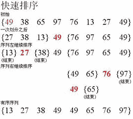
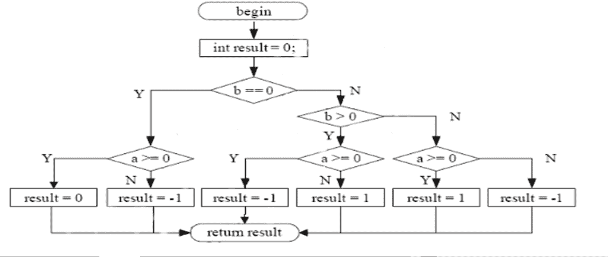

# 唯品会 2018 校招数据岗笔试题

## 1

主机甲与主机乙之间已建立一个 TCP 连接，主机甲向主机乙发送了两个连续的 TCP 段，分别包含 300B 和 500B 的有效载荷，第一个段的序列号为 200，主机乙正确接收到这两个数据段后，发送给主机甲的确认序列号是

正确答案: D   你的答案: 空 (错误)

```cpp
200
```

```cpp
500
```

```cpp
800
```

```cpp
1000
```

None

讨论

[324134134143428](https://www.nowcoder.com/profile/9990867)

确认序列号=原始序列号+TCP 段的长度（两段）别忘了点赞偶

发表于 2018-01-27 20:48:30

* * *

## 2

在支持多线程的系统中，进程 P 创建的若干个线程不能共享的是

正确答案: D   你的答案: 空 (错误)

```cpp
进程 P 的代码段
```

```cpp
进程 P 中打开的文件
```

```cpp
进程 P 的全局变量
```

```cpp
进程 P 中某线程的栈指针
```

None

讨论

[324134134143428](https://www.nowcoder.com/profile/9990867)

不同线程之间不可以共享

发表于 2018-01-27 22:25:12

* * *

## 3

排序算法的效率取决于元素的比较次数与元素的位置移动次数，现需要对数组进行升序排序，已知一数组的元素为{1, 2, 3, 4, 5, 6, 7, 8, 9, 10}，问下面哪种排序算法的效率最高？

正确答案: A   你的答案: 空 (错误)

```cpp
插入排序
```

```cpp
选择排序
```

```cpp
快速排序
```

```cpp
冒泡排序
```

None

讨论

[shunqiziran](https://www.nowcoder.com/profile/891467)

就这道题目而言，
1.如果插入排序每次插入都是在已有序序列的头部开始向后移动比较的话，需要比较(1+9)*9/2=45 次；如果插入排序每次插入都是在已有序序列的尾部开始向前移动比较的话，需要比较 9 次。
2.选择排序需要比较(1+8)*8/2=36 次。
3.优化的冒泡排序可以做到序列事先有序的情况下比较 9 次返回。

发表于 2018-05-09 13:58:10

* * *

[牛客 1659416](https://www.nowcoder.com/profile/6422446)

```cpp
每个元素距离其最终位置不远时，选择插入排序。但是冒泡排序是对全部已经排好序列排序最快的，是否 D 也可以？
```

发表于 2018-03-24 10:39:26

* * *

## 4

一个栈的入栈序列是 a b c d e，则栈的输出序列不可能是

正确答案: A   你的答案: 空 (错误)

```cpp
dceab
```

```cpp
decba
```

```cpp
edcba
```

```cpp
abcde
```

None

## 5

对数据库，关于索引的理解正确的是

正确答案: B C D   你的答案: 空 (错误)

```cpp
创建索引能提高数据插入的性能
```

```cpp
索引应该根据具体的检索需求来创建，在选择性好的列上创建索引
```

```cpp
索引并非越多越好
```

```cpp
建立索引可加速查询
```

None

讨论

[324134134143428](https://www.nowcoder.com/profile/9990867)

索引只有检索功能，相对而来删除插入之类的就慢了。

发表于 2018-01-27 22:27:05

* * *

## 6

用浏览器访问一个 Internet 网站，可能使用到的协议有

正确答案: A B D   你的答案: 空 (错误)

```cpp
PPP
```

```cpp
HTTP
```

```cpp
POP
```

```cpp
ARP
```

None

讨论

[324134134143428](https://www.nowcoder.com/profile/9990867)

应用层用到--HTTP 协议传输层--tcp 协议    网络层--ARP 协议控制信息的传递--ICMP 服务器后台处理--IP 协议(DNS)打开网页---HTML 还有其他的么？顺便一说 pop 协议是邮件传输协议，在发送时会用到，

发表于 2018-01-27 22:33:59

* * *

## 7

查找或删除性能较低的数据结构有

正确答案: A B   你的答案: 空 (错误)

```cpp
有序数组
```

```cpp
有序链表
```

```cpp
AVL 树
```

```cpp
Hash 表
```

None

讨论

[324134134143428](https://www.nowcoder.com/profile/9990867)

AB 全部都是 O(N)

发表于 2018-01-27 22:36:37

* * *

## 8

以下哪些与编译器的任务有关？

正确答案: A C D   你的答案: 空 (错误)

```cpp
公共子表达式合并
```

```cpp
运行程序前加载其依赖的动态库
```

```cpp
尾递归优化
```

```cpp
常量、不变式预计算
```

None

讨论

[324134134143428](https://www.nowcoder.com/profile/9990867)

难道是我审题不够仔细？“***运行前”***加载的动态库，，，运行前就不需要编译器了吧

编辑于 2018-01-27 22:41:55

* * *

## 9

现有代码如下，则 func(5)的返回值为 1
int func(int n){
if(n <= 1){
return 1;
}else{
return n * func(n-1);
}
}

你的答案 (错误)

1 参考答案 (1) 120
None

讨论

[何其润🐈](https://www.nowcoder.com/profile/4332252)

5 的阶乘

发表于 2018-01-08 00:05:20

* * *

## 10

下面 C 程序的运行打印结果是 1
#include <stdio.h>
int main(int argc, char** argv) {
char* array[] = {"hello", "my", "world", "goodbye"};
char** p = array;
p = p + 2;
printf("%s", *p);
return 0;
}

你的答案 (错误)

1 参考答案 (1) world
None

## 11

一个长度为 100 的循环链表，指针 A 和指针 B 都指向了链表中的同一个节点，A 以步长为 1 向前移动，B 以步长为 3 向前移动，最少需要同时移动 1 步 A 和 B 才能再次指向同一个节点

你的答案 (错误)

1 参考答案 (1) 50
None

讨论

[Amelie201801102225410](https://www.nowcoder.com/profile/2962003)

指针 b 要比 a 多遍历一遍后两者相遇，即 3x-x=100，得出 x 等于 50

发表于 2018-02-25 01:25:31

* * *

## 12

一棵完全二叉树中有 33 个结点，则该完全二叉树的深度为 1

你的答案 (错误)

1 参考答案 (1) 6
None

讨论

[324134134143428](https://www.nowcoder.com/profile/9990867)

33-1=32            132-2                    230-4                    326-8                    418-16                    52                            6 层

发表于 2018-01-27 22:46:12

* * *

## 13

{0, 2, 1, 4, 3, 9, 5, 8, 6, 7}是以数组形式存储的最小堆，删除堆顶元素 0 后的堆的新结果是 1（结果需要英文逗号分隔）

你的答案 (错误)

1 参考答案 (1) {1,2,5,4,3,9,7,8,6} 或 1,2,5,4,3,9,7,8,6
None

讨论

[324134134143428](https://www.nowcoder.com/profile/9990867)

将堆还原下，删除 0，之后将堆中的最后一个元素放在堆顶，按照规则将堆订元素放在正确的地方就可以了

发表于 2018-01-27 22:48:42

* * *

[Daredevil-S](https://www.nowcoder.com/profile/122887339)

0, 2, 1, 4, 3, 9, 5, 8, 6, 7 删掉 0,  7 上第一位： 7,2, 1, 4, 3, 9, 5, 8, 6 每次结果：1,2,7,4,3,9,5,8,6   1、7 换 1,2,5,4,3,9,7,8,6   5、7 换

发表于 2020-03-04 21:42:50

* * *

[编程的渣渣啊啊啊](https://www.nowcoder.com/profile/8501721)

为什么不是 1，2,5，4,3,9,8,6,7

发表于 2018-03-24 13:07:36

* * *

## 14

已知关键字序列为(51,22,83,46,75,18,68,30),进行快速排序，第一趟按关键码字 51 进行,完成后的序列为 1（结果需要英文逗号分隔）

你的答案 (错误)

1 参考答案 (1) 30,22,18,46,51,75,68,83 或 （30,22,18,46,51,75,68,83）
None

讨论

[Cony 同学](https://www.nowcoder.com/profile/627923)

如果移动 i,j 索引，然后交换 i,j 所表示的值，而不是次次都和 51 进行交换的话，结果会是 18,22,30,46,51,75,68,83

发表于 2018-01-27 21:54:00

* * *

[324134134143428](https://www.nowcoder.com/profile/9990867)

快拍，换位置。

发表于 2018-01-27 22:49:32

* * *

## 15

如果下列的公式成立：77+77=121，则数字是采用 1 进制表示的

你的答案 (错误)

1 参考答案 (1) 13
None

讨论

[324134134143428](https://www.nowcoder.com/profile/9990867)

七加七十进制是 14，但却是一，

发表于 2018-01-27 22:50:46

* * *

[牛客 1659416](https://www.nowcoder.com/profile/6422446)

```cpp
设进制为 x,于是 2*(7*x+7)=x²+2*x+1
```

编辑于 2018-03-24 11:14:51

* * *

## 16

LRU 的 cache 长度为 3,初始为空。依次访问如下元素后，cache 里的内容是 1（结果需要英文逗号分隔）
A,A,B,C,A,D,C,E

你的答案 (错误)

1 参考答案 (1) E,C,D
None

讨论

[324134134143428](https://www.nowcoder.com/profile/9990867)

页面置换算法中的 LRU 算法（Least Recently Used 算法)将最近久未使用的页面淘汰，ps：假设 序列为 4 3 4 2 3 1 4 2 物理块有 3 个 则首轮 4 调入内存 4 次轮 3 调入内存 3 4 之后 4 调入内存 4 3 之后 2 调入内存 2 4 3 之后 3 调入内存 3 2 4 之后 1 调入内存 1 3 2（因为最少使用的是 4，所以丢弃 4）之后 4 调入内存 4 1 3（原理同上）最后 2 调入内存 2 4 1

发表于 2018-01-27 22:54:28

* * *

## 17

已知一算数表达式的中缀表达式为 a-(b+c/d)*e，其后缀形式为 1

你的答案 (错误)

1 参考答案 (1) abcd/+e*-
None

讨论

[牛客 1659416](https://www.nowcoder.com/profile/6422446)

```cpp
先把原中缀表达式转换成中序遍历的二叉树，叶节点是数字，然后按后序遍历写出来即可
```

发表于 2018-03-24 11:35:15

* * *

[牛客 8872979 号](https://www.nowcoder.com/profile/8872979)

第一步：按照运算符的优先级对所有的运算单位加括号：式子变成了：(a-((b+(c/d))*e))第二步：转换后缀表达式把运算符号移动到对应的括号后面(a((b(cd)/)+e)*)-,把括号去掉 abcd/+e*- 

发表于 2018-05-01 17:50:16

* * *

## 18

从 1 - 1001 中，能被数字 2 或者数字 3 或者数字 5 整除的数字有 1 个

你的答案 (错误)

1 参考答案 (1) 734
None

讨论

[牛客 1659416](https://www.nowcoder.com/profile/6422446)

```cpp
假设 N(A)，N(B)和 N(C)分别表示能被 2、3 和 5 整除的个数
于是所求为 N(A U B U C)=N(A)+N(B)+N(C)-N(AB)-N(AC)-N(BC)+N(ABC)

```
被 2 整除的：500
被 3 整除的：333
被 5 整除的：200
同时被 2 和 3 整除的：166
同时被 2 和 5 整除的：100
同时被 3 和 5 整除的：66
同时被 2、3 和 5 整除的：33
所以答案是：500+333+200-166-100-66+33=734
```cpp

```

发表于 2018-03-24 10:12:58

* * *

[萧雲](https://www.nowcoder.com/profile/9733721)

```cpp
//思路:从 1 - 1001 中，能被数字 2 或者数字 3 或者数字 5 整除的数字有 n 个
//所以要把结果减去 6,10,15,30 的倍数,但要再减去一次 30 的倍数
#include <iostream>
using namespace std;
int mian()
{
    int s;
    s=1001/2 + 1001/3 + 1001/5 - 1001/6 - 1001/15 - 1001/10 - 1001/30*2
    cout<<s;
    return 0
}

```

发表于 2018-03-22 20:26:03

* * *

[牛客 1339462 号](https://www.nowcoder.com/profile/1339462)

1-1001 中：能被 2 整除的有 501 个能被 5 整除的奇数有 100 个由于能被 3 整除的也会存在偶数，所以剔除偶数，两个能被 3 整除的数相差 6，则 1001/6=166....5；会发现每隔 5 个会有一个被 5 整除的数 166/5=33，则 166-33=133501+100+133=734

发表于 2018-03-22 15:40:02

* * *

## 19

5 个盒子每个里面各有一个球，把球全拿出来打乱再放回去，每个球都不在自己原来的盒子里，有 1 种可能

你的答案 (错误)

1 参考答案 (1) 44
None

讨论

[牛客 1659416](https://www.nowcoder.com/profile/6422446)

```cpp
用 N(A1),N(A2),N(A3),N(A4),N(A5)分别表示第 1、2、3、4、5 个球在自己原来的盒子里的可能数量。
于是至少有一个球在自己原来的盒子里的可能数量为 N(A1 U A2 U A3 U A4 U A5)=
C(5,1)N(A1)-C(5,2)N(A1A2)+C(5,3)N(A1A2A3)-C(5,4)N(A1A2A3A4)+C(5,5)N(A1A2A3A4A5)=
5*4!-10*3!+10*2!-5*1!+1=76
故每个球都不在自己原来的盒子里的可能数量为 5！-76=44

```

发表于 2018-03-24 10:22:26

* * *

## 20

【T】当用分支覆盖法对以下流程图进行测试时，至少需要设计 1 个测试用例

你的答案 (错误)

1 参考答案 (1) 6
None

讨论

[Amelie201801102225410](https://www.nowcoder.com/profile/2962003)

看最终指向结果有几条路径就测试几次

发表于 2018-02-25 01:29:33

* * *

## 21

对一个整数的四则运算后缀表达式，请写函数将其打印成日常我们使用的中缀表达式。如对 ab+c*，打印出 (a+b)*c 。后缀表达式以一个列表形式作为函数输入，列表的元素为数字或加减乘除操作符。

你的答案

None

讨论

[Julianna🍀🍀](https://www.nowcoder.com/profile/7265477)

```cpp
from pythonds.basic.stack import Stack

def infixToPostfix(infixexpr):
    prec = {}
    prec['*'] = 3
    prec['/'] = 3
    prec['+'] = 2
    prec['-'] = 2
    prec['('] = 1
    opStack = Stack()
    postfixList = []
    tokenList = infixexpr.split()

    for token in tokenList:
        if token in 'abcdefghijklmnopqrstuvwxyz' or token in '0123456789':
            postfixList.append(token)
        elif token == '(':
            opStack.push(token)
        elif token == ')':
            topToken = opStack.pop()
            while topToken != '(':
                postfixList.append(topToken)
                topToken = opStack.pop()
        else:
            while (not opStack.isEmpty()) and (prec[opStack.peek()] >= prec[token]):
                postfixList.append(opStack.pop())
            opStack.push(token)

    while not opStack.isEmpty():
        postfixList.append(opStack.pop())
    return ''.join(postfixList) 

```

发表于 2018-08-02 15:29:40

* * *

[柏舟 201710171020244](https://www.nowcoder.com/profile/9427863)

```cpp
from pythonds.basic.stack import Stack def infixToPostfix(infixexpr): str1 = ''  stack = Stack()
    strList = infixexpr.split() for i in strList: if i in 'qwertyuiopasdfghjklzxcvbnm1234567890':
            stack.push(i) if i in '+-*/': if not stack.isEmpty():
                num1 = stack.pop()
                num2 = stack.pop()
                strinfo = '('+num1+ i+num2+')'  stack.push(strinfo) return strinfo
res = infixToPostfix('a b + c *')
```

发表于 2018-09-30 09:54:16

* * *

## 22

  挖雷游戏是一个 N*N 格子棋盘，一些随机的格子里有雷，把所有不是雷的格子挖开游戏取胜结束，挖中了任一有雷的格子游戏失败结束。在挖开一个没有雷的格子时，格子上会显示数字，表示相邻的 8 个格子里有几颗雷，如果是 0 颗，则程序会帮助把相邻的格子自动全挖开，如果其中又有 0 颗的，则继续下去。

请你写函数实现对挖开一个 0 颗雷的格子后，程序自动处理的过程。布了雷的所有格子的坐标作为已知的输入条件。

你的答案

None

## 23

 考虑一个网络服务，希望具备防刷的安全特性。假设要求策略是对每次请求访问，如果该请求的来源 IP，在当前的前 N 秒内已经请求过了 M 次，则拒绝服务 X 秒。请设计方案，无需写出完全代码，描述清楚设计实现即可。并请针对设计出的方案分析利弊

你的答案

None

## 24

（数据结构与算法）列举至少 2 种排序算法（如快排），并写出实现代码

你的答案

None

## 25

（数据结构与算法）已知一随机发生器，产生 0 的概率是 P，产生 1 的概率是 1-P。现在需要构造一个发生器，使得它构造 0 和 1 的概率均为 1/2，请写出思路或伪代码 

你的答案

None

讨论

[编程的渣渣啊啊啊](https://www.nowcoder.com/profile/8501721)

生成两个独立事件来预测，则发生器能产生 00,01,10,11 四种序列，其概率分别为 p*p,p*(1-p),(1-p)*p,(1-p)*(1-p)。可知 01 和 10 概率相等，因此我们将 01 映射成 0，10 映射成 1，遇到 00 或 11 则丢弃，则此时 0,1 发生概率均为 1/2.

发表于 2018-02-28 14:46:48

* * *

## 26

（机器学习理论）请列举生成模型与判别模型的区别

你的答案

None

讨论

[语语嫣嫣](https://www.nowcoder.com/profile/821264330)

*   判别模型：判别模型是学得一个分类面（即学得一个模型），该分类面可用来区分不同的数据分别属于哪一类；
*   生成模型：生成模型是学得各个类别各自的特征（即可看成学得多个模型），可用这些特征数据和要进行分类的数据进行比较，看新数据和学得的模型中哪个最相近，进而确定新数据属于哪一类。

发表于 2019-10-18 15:57:12

* * *

## 27

（机器学习理论）请列举分类模型和回归模型的区别

你的答案

None

讨论

[牛客 8872979 号](https://www.nowcoder.com/profile/8872979)

分类和回归的区别在于输出变量的类型。定量输出称为回归，或者说是连续变量预测；定性输出称为分类，或者说是离散变量预测。

发表于 2018-05-01 17:58:46

* * *

## 28

（机器学习理论）请描述决策树的原理、过程、终止条件，以及如何防止过拟合

你的答案

None

讨论

[牛客 8872979 号](https://www.nowcoder.com/profile/8872979)

决策树原理：从根节点开始，对实例的某一特征进行测试，根据测试结果，将实例分配其子节点；每个子节点对应着特征的一个取值，如此递归的对实例进行测试并分配，直到达到叶节点，最后将实例分到叶节点的类中。过程：特征选择、树的生成和树的剪枝终止条件：节点中的样本个数小于预定阈值，或样本集的基尼指数小于（信息增益或信息增益比大于）预定值，或者没有更多特征如何防止过拟合：剪枝

发表于 2018-05-01 17:59:52

* * *

## 29

（机器学习理论）请描述 K-means 的原理，说明选择聚类中心的方法

你的答案

None

讨论

[牛客 8872979 号](https://www.nowcoder.com/profile/8872979)

K-Means 算法的思想很简单，对于给定的样本集，按照样本之间的距离大小，将样本集划分为 K 个簇。让簇内的点尽量紧密的连在一起，而让簇间的距离尽量的大输入：样本集 D={x1, x2, x3,…,xm}，聚类簇数 k 
输出：簇划分 C={C1,C2,…,Ck} 
从 D 中随机选取 k 个样本作为初始向量； 
repeat: 
初始化所有 Ci 为空集； 
对于样本集里每个样本 x: 
计算 x 与 k 个初始向量的距离，选择距离最小的初始向量的簇标记 j 作为 x 的簇标记，将 x 加入 Cj 中； 
对于每个簇： 
计算新的均值向量，如果新的均值向量与上一步的不同，则更新；否则保持当前均值向量 不变； 
until 当前均值向量均未更新 

发表于 2018-05-01 18:01:34

* * *

## 30

（机器学习理论）请描述推荐系统中协同过滤算法的原理

你的答案

None

## 31

（NLP 方向）什么是中文分词？ 列举出几种你所知的分词方法

你的答案

None

## 32

（NLP 方向）现在深度学习在 nlp 领域有哪些应用？ 请具体说明

你的答案

None

## 33

（图像方向）传统图像处理提取的 sift 特征是什么意思？

你的答案

None

## 34

（图像方向）什么是卷积神经网络？请说明卷积的意义

你的答案

None

## 35

（深度学习方向）深度学习和过往的神经网络训练方法有什么区别？

你的答案

None

## 36

（深度学习方向）深度学习和过往的神经网络训练方法有什么区别？列举几种深度学习的 loss function，并说明意义

你的答案

None

讨论

[语语嫣嫣](https://www.nowcoder.com/profile/821264330)

从广义上说深度学习的网络结构也是多层神经网络的一种。
传统意义上的多层神经网络是只有输入层、隐藏层、输出层。其中隐藏层的层数根据需要而定，没有明确的理论推导来说明到底多少层合适。
而深度学习中最著名的卷积神经网络 CNN，在原来多层神经网络的基础上，加入了特征学习部分，这部分是模仿人脑对信号处理上的分级的。具体操作就是在原来的全连接的层前面加入了部分连接的卷积层与降维层，而且加入的是一个层级。 输入层 - 卷积层 -降维层 -卷积层 - 降维层 -- .... -- 隐藏层 -输出层
简单来说，原来多层神经网络做的步骤是：特征映射到值。特征是人工挑选。
深度学习做的步骤是 信号->特征->值。 特征是由网络自己选择。

发表于 2019-10-18 15:48:35

* * *

## 37

某校计算机专业有 80%的学生参加过比赛 A，有 30%的学生参加过比赛 B，有 15%的学生两个比赛都没参加过，随机询问一个学生，该学生既参加过比赛 A 又参加过比赛 B 的概率为 1

你的答案 (错误)

1 参考答案 (1) 25%
None

讨论

[永远 62](https://www.nowcoder.com/profile/4432104)

设即 A 又 B 的人数为 X，则 80%+30%-X=1-15%

发表于 2018-03-22 22:47:45

* * *

[牛客 1659416](https://www.nowcoder.com/profile/6422446)

```cpp
p(AB)=1-(1-0.8)-(1-0.3)+0.15=0.25
```

发表于 2018-03-24 11:56:10

* * *

## 38

某种酒精检测仪在对吸烟的人使用时 98%报阳性、2%报阴性，而在对不吸烟的人使用时 98%报阴性、2%报阳性。已知某校吸烟的学生大概占 2%，则若对该校某学生的检验结果呈阳性，那么该学生吸烟的概率为 1，计算公式为 2

你的答案 (错误)

12 参考答案 (1) 50%
(2) 0.98*0.02/(0.98*0.02+0.02*0.98)
None

讨论

[Daredevil-S](https://www.nowcoder.com/profile/122887339)

吸烟判对/（吸烟判对+不吸烟判错）

发表于 2020-03-04 23:02:24

* * *

[里予](https://www.nowcoder.com/profile/8152355)

50% A:吸烟 B：阳性 P(A|B)=P(AB)/P(B)=P(A)P(B|A)/(P(A)P(B|A)+P(A^)P(B|A^))

发表于 2018-03-03 21:35:35

* * *

[324134134143428](https://www.nowcoder.com/profile/9990867)

已经检测出来显阳性了----0.98*0.02+0.02*0.98

发表于 2018-01-27 23:00:36

* * *

## 39

考虑值集{6,47,49,15,42,41,7,39,43,40,36}，其四分位数极差为 1

你的答案 (错误)

1 参考答案 (1) 28
None

讨论

[编程的渣渣啊啊啊](https://www.nowcoder.com/profile/8501721)

四分位数极差=第三四分位数-第一四分位数=43-15=28

编辑于 2018-02-28 14:56:39

* * *

[324134134143428](https://www.nowcoder.com/profile/9990867)

四分位数————先将数组从小到大进行排序，之后按照分割点分城四份，
分割点求法-----(n+1)*(1/4)    (n+1)*(2/4)    (n+1)*(3/4)    分成四分所以只需要三个分割点
n 是数组中元素的个数(从 1 开始,不是从 0 开始偶）

发表于 2018-01-27 23:01:16

* * *

## 40

从某超市顾客中随机抽取 5 名，他们的购物篮数据的二元 0/1 表示如下：

|  | 面包 | 牛奶 | 尿布 | 啤酒 | 鸡蛋 | 可乐 |
| 1 | 1 | 1 | 0 | 0 | 0 | 0 |
| 2 | 1 | 0 | 1 | 1 | 1 | 0 |
| 3 | 0 | 1 | 1 | 1 | 0 | 1 |
| 4 | 1 | 1 | 1 | 1 | 0 | 0 |
| 5 | 1 | 1 | 1 | 0 | 0 | 1 |

某学生依据此数据做关联分析，考虑规则{牛奶，尿布}->{啤酒}，则该规则的支持度（support）为 1，置信度（confidence）为 2

你的答案 (错误)

12 参考答案 (1) 0.4 或 0.40
(2) 0.67
None

讨论

[编程的渣渣啊啊啊](https://www.nowcoder.com/profile/8501721)

支持度：{牛奶，尿布，啤酒}都出现的个数/事务数=2/5 置信度：{牛奶，尿布，啤酒}都出现的个数/{牛奶，尿布}出现的个数=2/3

编辑于 2018-02-28 15:19:27

* * *

[324134134143428](https://www.nowcoder.com/profile/9990867)

第一个不是 0.6 么？

发表于 2018-01-27 23:06:47

* * *

## 41

 列举至少 2 种排序算法（如快排），并写出实现代码

你的答案

None

讨论

[324134134143428](https://www.nowcoder.com/profile/9990867)

```cpp
class MergeSort {
public:
    int* mergeSort(int* A, int n)
    {
        Msort(A,A,0,n-1);
        return A;
    }
    void Msort(int *A,int *B,int s,int t)
    {
        if(s==t)
            B[s]=A[s];
        else
        {
            int m=(s+t)/2;
            int C[100]={0};
            Msort(A,C,s,m);
            Msort(A,C,m+1,t);
            Merge(C,B,s,m,t);
        }
    }
    void Merge(int *A,int *B,int i,int m,int n)
    {
        int j,k;
        for(j=m+1,k=i;i<=m&&j<=n;k++)
        {
            if(A[i]<A[j])
                B[k]=A[i++];
            else
                B[k]=A[j++];
        }
        if(i<=m)
            while(i<=m)
                B[k++]=A[i++];
        if(j<=n)
            while(j<=n)
                B[k++]=A[j++];
    }
}; 
```

编辑于 2018-01-27 23:10:44

* * *

## 42

什么是欠拟合、过拟合？避免过拟合有哪些途径？

你的答案

None

## 43

请描述 K-means 的原理，说明选择聚类中心的方法？

你的答案

None

讨论

[编程的渣渣啊啊啊](https://www.nowcoder.com/profile/8501721)

k-means 中选择聚类中心的方法:1.选择批次距离尽可能远的 K 个点聚类中心之间的距离尽可能远，因此首先在样本中随机选择一个点，作为第一个的聚类中心；接着选择距离该点最远的点，作为第二个聚类中心。第三个聚类中心选择距离这两个点最远的点，以此类推选择 k 个聚类中心。2.使用层次聚类法将原始数据划分为 k 个簇，取每个簇的中心作为聚类中心，再在该聚类中心之上运行标准 k-means 算法

发表于 2018-02-28 14:14:13

* * *

## 44

梯度下降法求解最优化问题的原理与步骤？

你的答案

None

## 45

请描述推荐系统中协同过滤算法的原理？

你的答案

None

讨论

[语语嫣嫣](https://www.nowcoder.com/profile/821264330)

链接：[`www.nowcoder.com/questionTerminal/0ca938d828864984af8ba5f66dddbc5f`](https://www.nowcoder.com/questionTerminal/0ca938d828864984af8ba5f66dddbc5f) 来源：牛客网
基于用户的协同过滤算法：寻找偏好相似的用户（计算相似度），为相似的用户提供推荐物品（加权排序推荐）。该算法依靠用户的历史行为数据来计算相似度，也就是说要有一定的数据积累。基于物品的协同过滤算法：寻找相似的物品（计算相似度），为用户推荐相似的物品。

发表于 2019-10-18 15:30:46

* * *

## 46

请说明分类算法中常用的评估指标（准确率、召回率、ROC、AUC）的定义，及计算方法？

你的答案

None

讨论

[编程的渣渣啊啊啊](https://www.nowcoder.com/profile/8501721)

准确率：P=TP/(TP+FP)，表示在预测的正例中确实为正例的比例召回率: R=TP/(TP+FN)，表示在全体正例中预测为正例的比例 ROC：把样例按照最可能为正例的顺序，从大到小排序，并逐个将样例作为正例进行预测。每次预测都计算 TPR=TP/(TP+FN)和 FPR=FP/(FP+TN)，并以 TPR 为纵轴坐标，FPR 为横轴坐标绘制曲线。AUC：评价分类器的好坏就是计算 ROC 曲线下的面积，该面积越大则证明分类器越好。面积计算可以通过极限法计算每个小矩形的面积，并求和得到

发表于 2018-02-28 14:30:48

* * *