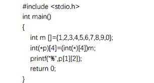
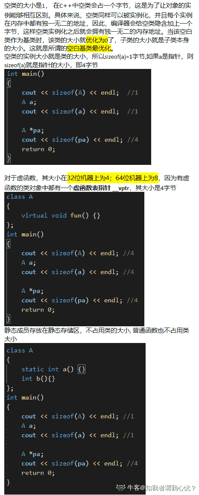

# 唯品会 2018 校招实时开发笔试题

## 1

（Linux 部分）Linux 文件权限一共 10 位长度(例如 drwxrwxrwx)，分成四段，第三段表示的内容是 

正确答案: C   你的答案: 空 (错误)

```cpp
文件类型
```

```cpp
文件所有者的权限
```

```cpp
文件所有者所在组的权限
```

```cpp
其他用户的权限
```

None

讨论

[一锅酸菜鱼](https://www.nowcoder.com/profile/9792946)

第一段为文件类型 -表示文件 d 表示文件夹 第二段为拥有者的可读可写可执行权限 第三段为属于这个组的成员是否拥有可读可写可执行权限 第四段为其他人对于该文件是否有可读可写可执行权限

发表于 2018-01-02 23:57:12

* * *

[冰冰脆旺旺](https://www.nowcoder.com/profile/98304998)

C

发表于 2020-08-26 21:52:01

* * *

## 2

（Linux 部分）Linux 终止一个前台进程可能用到的命令和操作

正确答案: B   你的答案: 空 (错误)

```cpp
kill
```

```cpp
ctrl+c
```

```cpp
shutdown
```

```cpp
halt
```

None

讨论

[NovB](https://www.nowcoder.com/profile/2513046)

前台进程 ctrl+c 后台用 kill

发表于 2018-03-08 09:14:06

* * *

[。20190104210271](https://www.nowcoder.com/profile/201389623)

B ctrl+c

发表于 2019-01-04 21:53:41

* * *

## 3

（Linux 部分）Linux 文件系统的文件都按其作用分门别类地放在相关的目录中，对于外部设备文件，一般应将其放在什么目录中？

正确答案: C   你的答案: 空 (错误)

```cpp
/bin
```

```cpp
/etc
```

```cpp
/dev
```

```cpp
/lib
```

None

讨论

[RichardWang](https://www.nowcoder.com/profile/7960659)

/bin：是 binary 的缩写,包含了引导系统启动所需的命令和普通用户可以使用的常用命令； /etc：用来存放所有的系统管理所需要的配置文件和子目录，linux 正是因为这些文件才能正常运行； /dev：这个目录下是所有 LINUX 的外部设备文件，其功能类似 DOS 下的.sys 和 Win 下的.vxd，用户可以通过这些文件访问外部设备，在 LINUX 中设备和文件是用同种方法访问的。例如:/dev/hda 代表第一个物理 IDE 硬盘； /lib：是根文件系统目录下程序和核心模块的共享库，存放了根文件系统程序，运行所需的共享文件。这些文件包含了可被许多程序共享的代码，以避免每个程序都包含有相同的子程序的副本，故可以使得可执行文件变得更小，节省空间。

发表于 2018-01-18 21:31:28

* * *

[冰冰脆旺旺](https://www.nowcoder.com/profile/98304998)

C

发表于 2020-08-26 21:51:21

* * *

[。20190104210271](https://www.nowcoder.com/profile/201389623)

C /dev

发表于 2019-01-04 21:52:28

* * *

## 4

（Linux 部分）Linux 改变文件所有者的命令为？ 

正确答案: C   你的答案: 空 (错误)

```cpp
chmod
```

```cpp
touch
```

```cpp
chown
```

```cpp
cat
```

None

讨论

[shijiacheng](https://www.nowcoder.com/profile/179663)

**chmod 命令**用来变更文件或目录的权限。在 UNIX 系统家族里，文件或目录权限的控制分别以读取、写入、执行 3 种一般权限来区分，另有 3 种特殊权限可供运用。用户可以使用 chmod 指令去变更文件与目录的权限，设置方式采用文字或数字代号皆可。**touch 命令**有两个功能：一是用于把已存在文件的时间标签更新为系统当前的时间（默认方式），它们的数据将原封不动地保留下来；二是用来创建新的空文件。 **chown 命令**改变某个文件或目录的所有者和所属的组，该命令可以向某个用户授权，使该用户变成指定文件的所有者或者改变文件所属的组。**cat 命令**连接文件并打印到标准输出设备上，cat 经常用来显示文件的内容。 

发表于 2018-01-17 21:29:09

* * *

[。20190104210271](https://www.nowcoder.com/profile/201389623)

chown 可修改文件属主 ：组名可修改属组

发表于 2019-01-04 21:51:20

* * *

## 5

（Linux 部分）Linux 在给定文件中查找与设定条件相符字符串的命令为

正确答案: A   你的答案: 空 (错误)

```cpp
grep
```

```cpp
gzip
```

```cpp
find
```

```cpp
sort
```

None

讨论

[shijiacheng](https://www.nowcoder.com/profile/179663)

**grep**（global search regular expression(RE) and print out the line，全面搜索正则表达式并把行打印出来）是一种强大的文本搜索工具，它能使用正则表达式搜索文本，并把匹配的行打印出来。**gzip 命令**用来压缩文件。 **find 命令**用来在指定目录下查找文件。任何位于参数之前的字符串都将被视为欲查找的目录名。**sort 命令**是在 Linux 里非常有用，它将文件进行排序，并将排序结果标准输出。 

发表于 2018-01-17 21:33:39

* * *

[。20190104210271](https://www.nowcoder.com/profile/201389623)

A grep 选项（-i -v） 文件名

发表于 2019-01-04 21:49:40

* * *

## 6

（Linux 部分）Linux 建立一个新文件可以使用的命令为

正确答案: D   你的答案: 空 (错误)

```cpp
Chmod
```

```cpp
More
```

```cpp
Cp
```

```cpp
touch
```

None

讨论

[冰冰脆旺旺](https://www.nowcoder.com/profile/98304998)

D

发表于 2020-08-26 21:51:05

* * *

[。20190104210271](https://www.nowcoder.com/profile/201389623)

D touch filename

发表于 2019-01-04 21:47:55

* * *

[秋招赶紧过去吧](https://www.nowcoder.com/profile/6535433)

D

发表于 2018-12-20 16:24:49

* * *

## 7

（Linux 部分）局域网的网络地址 192.168.1.0/24，局域网络连接其它网络的网关地址是 192.168.1.1。主机 192.168.1.20 访问 172.16.1.0/24 网络时，其路由设置正确的是

正确答案: B   你的答案: 空 (错误)

```cpp
route add –net 192.168.1.0 gw 192.168.1.1<br>netmask 255.255.255.0 metric 1
```

```cpp
route add –net 172.16.1.0 gw 192.168.1.1 netmask<br>255.255.255.0 metric 1
```

```cpp
route<br>add –net 172.16.1.0 gw 172.16.1.1 netmask 255.255.255.0 metric 1
```

```cpp
route add default 192.168.1.0 netmask 172.168.1.1 metric 1
```

None

讨论

[我是复读机](https://www.nowcoder.com/profile/162099353)

add : 添加一条路由规则 -net : 目的地址 gw : 路由数据包通过的网关 netmask : 目的地址的网络掩码 

发表于 2020-03-21 20:20:41

* * *

[0210.](https://www.nowcoder.com/profile/315104734)

(1)路由信息组成部分：1.目的主机的网络地址 2.下一跳的地址  3.子网掩码 (2)-net 后面跟的是目标网络，gw 就是 gateway（网关入口）就是你从哪个网关去到那个目标网络。

发表于 2019-06-30 23:09:37

* * *

## 8

（Java 部分）Java 中 Thread 类中的 start()方法和 run()方法有什么区别？

正确答案: A   你的答案: 空 (错误)

```cpp
start()方法创建一个线程，并内部调用 run()
```

```cpp
start()方法创建一个线程，但不会内部调用 run()
```

```cpp
run()方法创建一个线程，并内部调用 start()
```

```cpp
run()方法创建一个线程，但不会内部调用 start()
```

None

## 9

（Java 部分）在 Java 中，每个类都有 equals 和 hashCode 方法。下面的哪个描述是正确的？

正确答案: D   你的答案: 空 (错误)

```cpp
这是两个独立的方法，可以独立 override 其中任意一个。
```

```cpp
一般来说，override equals 方法的话，必须 override hashCode 方法；但反之不然
```

```cpp
一般来说，override hashCode 方法的话，必须 override equals 方法；但反之不然
```

```cpp
一般来说，如果要 override 的话，两个方法必须同时被 override。
```

None

讨论

[轻风 life](https://www.nowcoder.com/profile/7969056)

比较两个对象是否相等，只能用 equals，因为不同对象可能会有相同的 hashcode 值。但是如果要判断两个对象是否不等，就可以用 hashcode 方法，因为不同的对象的 hashcode 值肯定不相等。话句话说：

如果两个对象通过 equals 比较之后，返回的是 true，那么这两个对象的 hashcode 值必定相等；

如果 equals 返回的是 false，那么这两个对象的 hashcode 值不一定不相等；

如果两个对象的 hashcode 值不相等，那么 equals 返回的结果一定是 false；

但是如果两个对象的 hashcode 值相等，那么 equals 返回的不一定是 true。

如果一个类中重写了 equals 方法，那么必须同时重写 hashCode 方法。比如当一个对象保存到 HashMap 中后，在 HashMap 中是根据对象的 hashcode 值和 equals 方法来标识同一个对象的，如果 equals 方法和 hashCode 方法在逻辑上没有保持一致，就容易出错，比如要从 HashMap 中 get 某个对象，就会找不到。

发表于 2018-03-11 17:28:42

* * *

## 10

（Java 部分）下面关于 Java 中 weak reference 的说法，哪个是正确的？

正确答案: B   你的答案: 空 (错误)

```cpp
Weak<br>reference 指向的对象不会被 GC 回收。
```

```cpp
Weak<br>reference 指向的对象可以被 GC 回收。
```

```cpp
Weak<br>reference 指向的对象肯定会被 GC 回收。
```

```cpp
Weak<br>reference 指向的对象如果被回收，那么 weak<br>reference 会收到通知。
```

None

讨论

[一锅酸菜鱼](https://www.nowcoder.com/profile/9792946)

这个是弱引用 我还以为是虚引用 强引用 StrongReference ：一般在对象被 new 时创建，如果不自己解除引用则不会被 gc 软引用 SoftReference ：在内存溢出异常之前，对这些对象进行一次垃圾回收 弱引用 WeakReference：下一次一定进行垃圾回收 虚引用：收集时得到系统通知

发表于 2018-01-03 00:09:51

* * *

## 11

（Java 部分）Java 中堆和栈有什么区别？

正确答案: A B   你的答案: 空 (错误)

```cpp
堆是整个 JVM 共享的
```

```cpp
栈是每个线程独有的
```

```cpp
栈是整个 JVM 共享的
```

```cpp
对象可以分配在堆上也可以分配在栈上
```

None

讨论

[mynameLSD](https://www.nowcoder.com/profile/2842210)

1java 的栈内存。它的真正名称叫做：java 虚拟机栈。它和 java 堆内存的有一个很大的区别在于，它是线程私有的。它的生命周期也和线程的生命周期捆绑在一起。 每个 java 方法在执行的时候都会创建一个栈帧用来存储局部变量表，操作数栈，动态链接，方法出口等信息。每一个方法从调用直至完成执行后的过程，就对应着一个栈帧在虚拟机栈中的入栈到出栈的过程。在 java 虚拟机栈中，局部变量表所需要的内存空间在编译期间完成分配的。也就是说在进入一个方法时，这个方法在帧中分配多大的局部变量空间是完全确定的，在方法运行期间不会改变局部变量表的大小。那如果这个方法的线程所需要的内存大于这个空间呢？结果是会抛出 OutOfMemoryError 异常。另外如果线程请求的栈深度大于虚拟机所设的深度，将抛出 StackOverflowError 异常。2 同个 java 程序内的多线程运行在同个 JVM 实例上，多个线程之间共享堆内存（多线访问堆时，要实现数据的同步）。

发表于 2018-01-15 10:20:04

* * *

## 12

（Java 部分）volatile long 和 AtomicLong 的说法哪些是对的？

正确答案: A B D   你的答案: 空 (错误)

```cpp
在 64 位机器上，两者的读写都是原子的。
```

```cpp
volatile<br>long 读写是直接访问内存的，不会在 CPU cache 中出现。
```

```cpp
++运算在 volatile long 上是原子的。
```

```cpp
AtomicLong.getAndIncrement()是原子的。
```

None

讨论

[脑断电](https://www.nowcoder.com/profile/7714132)

volatile 不能不能保证原子性吧

发表于 2018-03-04 23:47:27

* * *

## 13

（Java 部分）下面关于 Atomic(比方说 AtomicLong)和 synchronized 关键字的说法哪些是对的？

正确答案: A B   你的答案: 空 (错误)

```cpp
两者都可以用于线程同步。
```

```cpp
synchronized 关键字用于同步一段代码，而 atomic 用于同步某个状态。
```

```cpp
两者都可以用于同步一段代码。
```

```cpp
多个 Atomic 在代码中嵌套使用时可能会产生死锁。
```

None

## 14

（Java 部分）64 位 JVM 中，int 的长度是多少位？

正确答案: B   你的答案: 空 (错误)

```cpp
16 位
```

```cpp
32 位
```

```cpp
64 位
```

```cpp
128 位
```

None

讨论

[不知道取啥昵称](https://www.nowcoder.com/profile/9229489)

Bint 数据类型占 4 个字节 32 位

发表于 2018-05-05 23:07:28

* * *

[Amarone](https://www.nowcoder.com/profile/1831929)

**byte**：byte 数据类型是 8 位有符号二进制补码整数。它的最小值为-128，最大值为 127（含）。的 byte 数据类型可以是在大型保存存储器有用 [阵列](https://docs.oracle.com/javase/tutorial/java/nutsandbolts/arrays.html)，其中存储器的节省实际上重要的。它们也可用于代替 int 其限制有助于澄清代码的地方; 变量范围有限的事实可以作为一种文档形式。

**short**：short 数据类型是 16 位带符号的二进制补码整数。它的最小值为-32,768，最大值为 32,767（含）。与 byte 此同样，适用相同的指导原则：short 在内存节省实际上很重要的情况下，您可以使用 a 来节省大型阵列中的内存。

**int**：默认情况下，int 数据类型是 32 位带符号的二进制补码整数，其最小值为-2 ³¹，最大值为 2 ³¹ -1。在 Java SE 8 及更高版本中，您可以使用 int 数据类型来表示无符号的 32 位整数，其最小值为 0，最大值为 2 ³² -1。使用 Integer 类将 int 数据类型用作无符号整数。有关详细信息，请参阅“数字类”一节。像静态方法 compareUnsigned，divideUnsigned 等已被添加到 [Integer](https://docs.oracle.com/javase/8/docs/api/java/lang/Integer.html)类，以支持算术运算的无符号整数。

*   **long**：long 数据类型是 64 位二进制补码整数。带符号的 long 的最小值为-2 ⁶³，最大值为 2 ⁶³ -1。在 Java SE 8 及更高版本中，您可以使用 long 数据类型来表示无符号的 64 位长，其最小值为 0，最大值为 2 ⁶⁴ -1。当您需要的值范围比提供的范围更宽时，请使用此数据类型 int。本 [Long](https://docs.oracle.com/javase/8/docs/api/java/lang/Long.html)类也包含类似的方法 compareUnsigned，divideUnsigned 等支持算术运算 unsigned long 类型。

*   **float**：float 数据类型是单精度 32 位 IEEE 754 浮点。其值范围超出了本讨论的范围，但在 Java 语言规范的 [浮点类型，格式和值](https://docs.oracle.com/javase/specs/jls/se7/html/jls-4.html#jls-4.2.3)部分中指定。正如所提建议 byte 和 short，使用 float（而不是 double 如果你需要节省内存浮点数的大型阵列）。绝不应将此数据类型用于精确值，例如货币。为此，您需要使用 [java.math.BigDecimal](https://docs.oracle.com/javase/8/docs/api/java/math/BigDecimal.html)类。 [数字和字符串](https://docs.oracle.com/javase/tutorial/java/data/index.html)涵盖 BigDecimalJava 平台提供的其他有用的类。

*   **double**：double 数据类型是双精度 64 位 IEEE 754 浮点数。其值范围超出了本讨论的范围，但在 Java 语言规范的 [浮点类型，格式和值](https://docs.oracle.com/javase/specs/jls/se7/html/jls-4.html#jls-4.2.3)部分中指定。对于十进制值，此数据类型通常是默认选择。如上所述，此数据类型不应用于精确值，例如货币。

*   **boolean**：boolean 数据类型只有两个可能的值：true 和 false。将此数据类型用于跟踪真/假条件的简单标志。此数据类型表示一位信息，但其“大小”不是精确定义的内容。

*   **char**：char 数据类型是单个 16 位 Unicode 字符。它的最小值为'\u0000'（或 0），最大值为'\uffff'（或 65,535（含））。

详细可参考 [`docs.oracle.com/javase/tutorial/java/nutsandbolts/datatypes.html`](https://docs.oracle.com/javase/tutorial/java/nutsandbolts/datatypes.html)

发表于 2018-11-29 10:02:54

* * *

[hq_seven](https://www.nowcoder.com/profile/535766)

B

发表于 2018-05-05 21:09:07

* * *

## 15

（Java 部分）下面关于异常处理，哪些说法是正确的？

正确答案: B   你的答案: 空 (错误)

```cpp
所有在本方法中可能抛出的异常都必须显式的在方法上用 throws 进行声明。
```

```cpp
Error 的子类表示无法修复的问题。
```

```cpp
RuntimeException 表示只在运行时（runtime）才可能出现这个异常。而普通 Exception 表示在运行时（runtime）和编译期间（compile time）都可能出现这个异常。
```

```cpp
Throwable 是 Exception 的子类。
```

None

讨论

[编程的渣渣啊啊啊](https://www.nowcoder.com/profile/8501721)

C 为啥错了

发表于 2018-04-02 16:21:49

* * *

[在逆光中浅唱青春。](https://www.nowcoder.com/profile/3965639)

Throwable 是 java.lang 包中一个专门用来处理异常的类。它有两个子类: Error 和 Exception

发表于 2018-02-14 20:39:15

* * *

## 16

（Java 部分）java.lang.OutOfMemoryError: PermGen Space 表示

正确答案: B   你的答案: 空 (错误)

```cpp
Java<br>heap 内存已经用完。
```

```cpp
Java<br>类对象（class）存储区域已经用完。
```

```cpp
Java<br>堆外内存已经用完。
```

```cpp
Java<br>栈空间已经用完。
```

None

## 17

（Java 部分）关于异常处理，下面哪些说法是正确的？

正确答案: B   你的答案: 空 (错误)

```cpp
加了 try{…}catch（）的代码块即使在不抛出异常时，也非常消耗性能，所以应该尽量少用。
```

```cpp
加了异常捕获的代码块在不抛出异常时，基本无性能损耗。
```

None

## 18

（Java 部分）int 和 Integer 哪个会占用更多的内存？

正确答案: C   你的答案: 空 (错误)

```cpp
int 占用更多
```

```cpp
Integer 占用更多
```

```cpp
两者一样多
```

None

讨论

[405200856](https://www.nowcoder.com/profile/405200856)

2 者一样多。因为 int，Integer 都是 4 字节

发表于 2019-07-14 17:08:28

* * *

[没意思了](https://www.nowcoder.com/profile/4559796)

我感觉是 Interger 多,毕竟对象在内存当中的布局分为对象头,实例的数据和对齐填充.而且对象头这部分就要有 32 位的长度

发表于 2019-08-19 21:45:18

* * *

[boy11111](https://www.nowcoder.com/profile/3060632)

下午有人问我这题 我回答一样多  结果那人说 int 精简代码 Integer 占用内存更大  搜到牛客这题期待大神解析一下

发表于 2019-07-16 20:52:50

* * *

## 19

（Java 部分）下面关于代码的哪个说法是正确的？logger.error（"We got an exception here.The exception is {}",exception）;

正确答案: B   你的答案: 空 (错误)

```cpp
执行到这里时会在 log 中打印出 stack trace。
```

```cpp
执行到这里时会在 log 中打印出相应的 exception name。
```

None

## 20

（Java 部分）下面 Java 中关于 List、Set 的说法哪些是正确的？

正确答案: A D   你的答案: 空 (错误)

```cpp
List 是有序的，允许元素重复
```

```cpp
Set 是无序的，允许元素重复
```

```cpp
List 允许随机访问（下标访问）
```

```cpp
Set 不允许元素重复
```

None

讨论

[我是复读机](https://www.nowcoder.com/profile/162099353)

感觉这道题不是很严谨。List 当然支持下标访问，只不过 linkedlist 是通过遍历来实现。

发表于 2020-03-21 22:46:18

* * *

[一锅酸菜鱼](https://www.nowcoder.com/profile/9792946)

List 是接口 有 LinkedList 这个实现类 这个就不支持通过索引随机访问

发表于 2018-01-03 00:12:02

* * *

[23 幸运星 55](https://www.nowcoder.com/profile/2880141)

A

发表于 2018-04-22 20:38:31

* * *

## 21

（C++部分）若 TestClass 为一个类，执行“TestClass a[4]，*p[5]；”语句时会自动调用该类构造函数的次数是 ？

正确答案: C   你的答案: 空 (错误)

```cpp
2
```

```cpp
5
```

```cpp
4
```

```cpp
9
```

本题知识点

C++

讨论

[牛客 879172473 号](https://www.nowcoder.com/profile/879172473)

语句“MyClass a[4]”定义了 4 个 MyClass 对象，分别为 a[0]，a[1]，a[2]，a[3]，调用 4 次构造函数；语句“MyClass *p[5]”定义了 5 个指向 MyClass 对象的指针变量，分别为*p[0]，*p[1]，*p[2]，*p[3]，*p[4]，但定义指针并没有实例化对象，所以不调用构造函数。因此，执行该语句共调用 MyClass 的构造函数 4 次

发表于 2021-01-26 12:53:48

* * *

[捞一下吧](https://www.nowcoder.com/profile/5465511)

a[4]表示 4 个对象，而*p[5]表示五个指针，并没有分配内存空间，因此不会调用构造函数和析构函数。如果需要生成，需要分配内存空间。例如：

```cpp
TestClass *p=new testClass();
```

发表于 2020-10-14 22:00:50

* * *

[kuang201803192235588](https://www.nowcoder.com/profile/7610074)

题都出错了，应该是构造函数，这里没事调用析构函数干啥？

发表于 2018-03-19 22:57:39

* * *

## 22

（C++部分）下列关于对象初始化的叙述中，正确的是:

正确答案: C   你的答案: 空 (错误)

```cpp
定义对象的时候不能对对象进行初始化
```

```cpp
定义对象之后可以显式地调用构造函数进行初始化
```

```cpp
定义对象时将自动调用构造函数进行初始化
```

```cpp
在一个类中必须显式地定义构造函数实现初始化
```

本题知识点

C++

讨论

[牛客 892242008 号](https://www.nowcoder.com/profile/892242008)

定义对象之后不能调用构造函数，因为构造函数是用来初始化的

发表于 2021-07-12 10:20:01

* * *

[20200722](https://www.nowcoder.com/profile/433084385)

B 为什么不对？

发表于 2020-08-21 14:55:41

* * *

[瑶小宝](https://www.nowcoder.com/profile/512208960)

没明白

发表于 2022-03-03 09:04:27

* * *

## 23

（C++部分）有函数模板声明和一些变量定义如下：

template<class Tl，class T2，class T3＞T1 sum（T2，T3）；

double dl，d2；

则下列调用中，错误的是

正确答案: D   你的答案: 空 (错误)

```cpp
sum&lt;double，double，double＞（dl，d2）；
```

```cpp
sum&lt;double；double&gt;（d1，d2）；
```

```cpp
sum&lt;double&gt;（d1，d2）；
```

```cpp
sum（d1，d2）；
```

本题知识点

C++

讨论

[人海追风](https://www.nowcoder.com/profile/896834337)

What the *** question?

发表于 2020-09-15 14:42:57

* * *

[牛客 536807034 号](https://www.nowcoder.com/profile/536807034)

T1 无法自动推断。除 D 外，所有实例化的各个类型都可自动推断出来。

发表于 2020-08-26 08:54:26

* * *

[醉酒倚枪笑红尘](https://www.nowcoder.com/profile/4492780)

显示不全

发表于 2021-04-28 09:34:08

* * *

## 24

（C++部分）有定义语句：int *p[4];以下选项中与此语句等价的是：

正确答案: C   你的答案: 空 (错误)

```cpp
int<br>p[4]
```

```cpp
int **p;
```

```cpp
int<br>*（p[4]）;
```

```cpp
int （*p）[4];
```

None

## 25

（C++部分）若要重载+、=、<<、=和[ ]运算符，则必须作为类成员重载的运算符是

正确答案: D   你的答案: 空 (错误)

```cpp
+和=
```

```cpp
=和&lt;&lt;
```

```cpp
＝＝和&lt;&lt;
```

```cpp
＝和[]
```

本题知识点

C++

讨论

[其华灼灼](https://www.nowcoder.com/profile/413223960)

C++语言规定，运算符“=”、“[]”、“()”、“->”以及所有的类型转换运算符只能作为成员函数重载

发表于 2020-08-10 19:27:48

* * *

[知人不评人](https://www.nowcoder.com/profile/730319140)

注意这个题目说的是必须作为成员函数重载的，有些运算符是最好作为而非必须，具体见 C++primer 第五版 493 页

编辑于 2021-10-23 13:21:40

* * *

## 26

（C++部分）下列说法正确的是

正确答案: B   你的答案: 空 (错误)

```cpp
内联函数在运行时是将该函数的目标代码插入每个调用该函数的地方
```

```cpp
内联函数在编译时是将该函数的目标代码插入每个调用该函数的地方
```

```cpp
类的内联函数必须在类体内定义
```

```cpp
类的内联函数必须在类体外通过加关键字 inline 定义
```

本题知识点

C++

讨论

[Uskudar](https://www.nowcoder.com/profile/537396923)

1）类内定义的函数都是内联函数，不管是否有 inline 修饰符 2）函数声明在类内，但定义在类外的看是否有 inline 修饰符，如果有就是内联函数，否则不是

发表于 2020-09-20 00:20:00

* * *

[晓之铭](https://www.nowcoder.com/profile/537625741)

类内定义的函数都是内联函数，在类外定义内联函数时需要使用 inline 修饰符

发表于 2021-03-23 08:36:57

* * *

[念之前，望之后](https://www.nowcoder.com/profile/837872598)

类中定义的成员函数一般会被编译器进行内联处理，但内联只是一种请求，并不一定成功。所以，成员函数的定义应尽量写得简单，以增加被编译器内联处理的可能性。

编辑于 2021-11-27 12:38:02

* * *

## 27

C++当中，如果已定义了一个 C++类 CMyList 并有以下语句：CMyList list(3); 以下说法正确的是？

正确答案: C   你的答案: 空 (错误)

```cpp
该语句会创建一个 CMyList 类的一个对象；
```

```cpp
该语句会创建一个 CMyList 类的 3 个对象；
```

```cpp
必须为类 CMyList 定义一个构造函数；
```

```cpp
必须为类 CMyList 定义一个析构函数；
```

本题知识点

C++

讨论

[帅得乱七八糟](https://www.nowcoder.com/profile/148139773)

A 选项为什么是错的呢？

发表于 2020-09-06 10:15:26

* * *

[风的味道 1990](https://www.nowcoder.com/profile/9444002)

如果没有自行定义构造函数，则编译器会自动生成默认构造函数，拷贝构造函数，移动构造函数（c++11 标准），不会有带 int 形参的构造函数，需要自行定义

发表于 2020-08-27 18:00:24

* * *

[liuzhen007](https://www.nowcoder.com/profile/873052646)

如果没有选项 C，一定可以选 A。但是有 C，就必须选择 C。因为 C 是 A 论断成立的前提，如果没有 C，那么 A 可能是错的，A 可能创建不出一个对象。注意：系统的默认构造函数是不带参数的。

发表于 2021-04-13 08:49:44

* * *

## 28

（C++部分）声明语句为 int a[3][4]; 下列表达式中与数组元素 a[2][1]等价的是: 

正确答案: A   你的答案: 空 (错误)

```cpp
*(a[2]+1)
```

```cpp
a[9]
```

```cpp
*(a[1]+2)
```

```cpp
*(*(a+2))+1
```

本题知识点

C++

讨论

[菜 B 来此一游](https://www.nowcoder.com/profile/2457834)

a[i][j] =*(a[i]+j) = *(*(a+i)+j) =(*(a+i))[j]

发表于 2020-08-09 10:50:03

* * *

[KlarkKenter](https://www.nowcoder.com/profile/490356392)

a[2]即为 a[2][0]的地址，a[2]+1 即 a[2][1]的地址，所以*(a[2]+1)=a[2][1]

发表于 2021-05-21 10:32:22

* * *

## 29

（C++部分）

设有如下的程序段

 char*ptr=NULL;

 char str[]="Hello";

 ptr=str;

执行完上面的程序段后，*(ptr+5)的值为: 

正确答案: B   你的答案: 空 (错误)

```cpp
'o'
```

```cpp
'\0'
```

```cpp
不确定的值
```

```cpp
'o'的地址
```

本题知识点

C++

讨论

[牛客 586204151 号](https://www.nowcoder.com/profile/586204151)

不是说 c++里面字符串不是‘\0’结束的吗

发表于 2020-08-14 10:53:11

* * *

## 30

（C++部分）请问下列代码的输出是多少（）

正确答案: A   你的答案: 空 (错误)

```cpp
7
```

```cpp
3
```

```cpp
8
```

```cpp
4
```

本题知识点

C++

讨论

[学 C++的兔子🐰](https://www.nowcoder.com/profile/411826983)

把 m 显性转化成三行四列的数组并将首元素的地址赋给指向三行四列二维数组的指针 p？

发表于 2020-12-18 16:35:32

* * *

[fangxiaox](https://www.nowcoder.com/profile/33519774)

int(*p)[4]=(int(*)[4])m; 在 p 中存放的数据按照 4 个一组存放，通过 m 给 p 赋值后 p 指向的地址中存放的数据格式为：{(1,2,3,4),(5,6,7,8),(9,0)},相当于二维数组： 1 2 3 4 5 6 7 8 9 0 所以输出 p[1][2]就是第二行第三列的值 7

发表于 2021-03-05 17:06:55

* * *

[牛客 363438018 号](https://www.nowcoder.com/profile/363438018)

只是一个三行四列的矩阵。 P 一二选取的就是第二行第三列的数。七。

发表于 2020-08-26 16:25:48

* * *

## 31

（C++部分）64 位 Linux 系统里，下面几个 sizeof 的运行结果是（）

int intValue = 1024;

char str[] = “Vipshop”;

const char* ch = str;

a=sizeof(intValue) ;

b=sizeof(str);

c=sizeof(ch);

正确答案: D   你的答案: 空 (错误)

```cpp
a=1，b=1，c=1
```

```cpp
a=4，b=4，c=4
```

```cpp
a=4，b=8，c=4
```

```cpp
a=4，b=8，c=8
```

本题知识点

C++

讨论

[9268](https://www.nowcoder.com/profile/552548540)

64 位系统指针占 8 个字节

发表于 2020-08-31 20:03:38

* * *

[丁程鑫今天发微博了吗](https://www.nowcoder.com/profile/984704892)

在 64 位系统中，指针占 4 个字节，而 int 不管在 32 位还是 64 位中都是 4 个字节

发表于 2020-08-10 15:52:29

* * *

[Charminggo](https://www.nowcoder.com/profile/710232700)

我是废物！看见指针就是 4😅

发表于 2022-02-14 15:53:08

* * *

## 32

（C++部分）c++定义一个空的类 CTest，CTest 没有定义任何成员变量和成员函数，在 32 位机器上，以下结论正确的有： 

正确答案: B C   你的答案: 空 (错误)

```cpp
对该类求 sizeof，结果为 0。
```

```cpp
给 CTest 添加构造函数，再对 CTest 求 sizeof，结果为 1.
```

```cpp
给 CTest 添加虚函数，再对 CTest 求 sizeof，结果为 4.
```

```cpp
给 CTest 添加虚函数，再对 CTest 求 sizeof，结果为 5.
```

本题知识点

C++

讨论

[知我者谓我心忧？](https://www.nowcoder.com/profile/6452098)



发表于 2020-08-27 15:00:41

* * *

[亮虎梦](https://www.nowcoder.com/profile/5794772)

```cpp
/*
https://ac.nowcoder.com/questionTerminal/61292be7140043609abfdd5e9624cca4?orderByHotValue=1&page=1&onlyReference=false
*/
#include<bits/stdc++.h>
using namespace std;
class A{//空类
};
class A1{//虚函数
	virtual void fun(){}
};
class A2{//静态成员和普通函数
	static int a(){}
	int b(){}
};
void test00(){
	/*
	空类的大小是 1，在 C++中空类会占用 1 个字节，这是为了让对象的实例能够相互区别。具体来说，空类同样可以被实例化
，并且每个实例在内存中都有独一无二的地址，因此，编译器会给空类隐含加上一个字节，这样空类实例化后就会拥有独一无二
的内存地址。当该空白类作为基类时，该类的大小就优化为零了，子类的大小就是子类本身的大小。这就是所谓的空白基类最优化。
空类的实例大小就是类的大小，所以 sizeof(a)=1 字节，如果 a 是指针，则 sizeof(a)就是指针的大小
	*/
	cout<<sizeof(A)<<endl;
	A a;
	cout<<sizeof(a)<<endl;
	A*pa;
	cout<<sizeof(pa)<<endl;
}
void test01(){
	/*
	对于虚函数，在 64 位机器上为 8，因为有虚函数的类对象中都有一个虚函数表指针，其大小是 8 字节
	*/
	cout<<sizeof(A1)<<endl;
	A1 a;
	cout<<sizeof(a)<<endl;
	A1*pa;
	cout<<sizeof(pa)<<endl;
}
void test02(){
	/*
	静态成员存放在静态存储区，不占用类的大小，普通函数也不占用类的大小
	*/
	cout<<sizeof(A2)<<endl;
	A2 a;
	cout<<sizeof(a)<<endl;
	A2*pa;
	cout<<sizeof(pa)<<endl;
}
int main(){
	test02();
	system("pause");
	return 0;
}
```

发表于 2021-06-18 16:20:19

* * *

## 33

（C++部分）有如下一段代码（unit16_t 为 2 字节无符号整数，unit8_t 位 1 字节无符号整数）；

union X

{

 unint16_t a;

    struct Z

    {

        unint8_t m;

        unint8_t n;

    }z;

};

union X x;

x.a = 0x1234;

请问 x.z.n 在大字节序和小字节序机器上的值分别为多少（）？ 

正确答案: A   你的答案: 空 (错误)

```cpp
0x34,0x12
```

```cpp
0x12,0x34
```

```cpp
0x1234,0x1234
```

```cpp
0x1234,0
```

None

## 34

输入一个字符串，输出该字符串中相邻字符的所有组合。
举个例子，如果输入 abc，它的组合有 a、b、c、ab、bc、abc。（注意：输出的组合需要去重）（40 分）

本题知识点

字符串 *排序 *穷举 哈希** ***讨论

[华科平凡](https://www.nowcoder.com/profile/4939096)

python 三行解法

注意，这道题贼坑。题目中说“每个组合以空格分隔”，但其实在结尾还要加一个空格才可以！！

* * *

1.  首先要找到所有相邻字符串的列表。使用两层循环遍历即可。（还要去重）

2.  多 key 排序。根据**长度**和**字典序**排序，在 python 中再简单不过。

六行：

```cpp
string = input()
res = set()
for i in range(1, len(string) + 1):
    for j in range(len(string) - i + 1):
        res.add(string[j:j + i])
print(" ".join(sorted(list(res), key=lambda c: (len(c), c))))
```

可以使用列表表达式简化成三行：

```cpp
string = input()
res = {string[j:j + i] for i in range(1, len(string) + 1) for j in range(len(string) - i + 1)}
print(" ".join(sorted(list(res), key=lambda c: (len(c), c)))+" ") 
```

发表于 2019-03-02 13:35:42

* * *

[wylu](https://www.nowcoder.com/profile/8627786)

```cpp
import java.io.BufferedReader;
import java.io.IOException;
import java.io.InputStreamReader;
import java.util.TreeSet;

/**
 * @author wylu
 */
public class Main {
    public static void main(String[] args) throws IOException {
        BufferedReader br = new BufferedReader(new InputStreamReader(System.in));
        String str = br.readLine();

        StringBuilder sb = new StringBuilder();
        for (int i = 1; i <= str.length(); i++) {
            TreeSet<String> sortedSet = new TreeSet<>();
            for (int j = 0; j + i <= str.length(); j++) {
                sortedSet.add(str.substring(j, j + i));
            }
            for (String s : sortedSet) {
                sb.append(s).append(" ");
            }
        }
        System.out.println(sb);
    }
}

```

发表于 2019-01-31 00:03:34

* * *

[绅士喵](https://www.nowcoder.com/profile/7128298)

用 set，既能保证去重，又能自动按照字典序排序。每次保存长度相同的子串，输出后清空。

```cpp
#include <iostream>
#include <set>

using namespace std;

int main(int argc, char *argv[])
{
    int i, j, len;
    string s, s_tmp;
    set<string> out;
    set<string> :: iterator it;

    cin >> s;
    len = s.length();
    for(i = 1; i <= len; i++)
    {
        for(j = 0; j + i - 1 < len; j++)
        {
            s_tmp = s.substr(j, i);
            out.insert(s_tmp);
        }
        for(it = out.begin(); it != out.end(); it++)
        {
             cout << *it << " ";
        }
        out.clear();
    }
    cout << endl;

    return 0;
}

```

编辑于 2019-01-31 15:08:19

* * *

## 35

数独是一个非常有名的游戏。整个是一个 9X9 的大宫格，其中又被划分成 9 个 3X3 的小宫格。要求在每个小格中放入 1-9 中的某个数字。要求是：每行、每列、每个小宫格中数字不能重复。 现要求用计算机求解数独。（50 分）

本题知识点

模拟 递归 穷举

讨论

[shijiacheng](https://www.nowcoder.com/profile/179663)

不觉的我的代码有什么问题，题目说了是 9x9,然后测试用例居然有 9x1 是几个意思!

```cpp
import java.util.Scanner;

/**
 * 数独是一个非常有名的游戏。整个是一个 9X9 的大宫格，其中又被划分成 9 个 3X3 的小宫格。
 * 要求在每个小格中放入 1-9 中的某个数字。要求是：每行、每列、每个小宫格中数字不能重复。
 * 现要求用计算机求解数独。
 *
 * @author shijiacheng
 */
public class SudokuSolution {

    private int[][] sudoku;
    public SudokuSolution(int[][] sudoku){
        this.sudoku = sudoku;
    }

    public static void main(String[] args){
        // 号称世界上最难数独
        int[][] suduku = new int[9][9];
        /*int[][] suduku = {
                {8, 0, 0, 0, 0, 0, 0, 0, 0},
                {0, 0, 3, 6, 0, 0, 0, 0, 0},
                {0, 7, 0, 0, 9, 0, 2, 0, 0},
                {0, 5, 0, 0, 0, 7, 0, 0, 0},
                {0, 0, 0, 0, 4, 5, 7, 0, 0},
                {0, 0, 0, 1, 0, 0, 0, 3, 0},
                {0, 0, 1, 0, 0, 0, 0, 6, 8},
                {0, 0, 8, 5, 0, 0, 0, 1, 0},
                {0, 9, 0, 0, 0, 0, 4, 0, 0}};*/
        Scanner sc = new Scanner(System.in);
        for (int i = 0; i < 9; i++) {
            for (int j = 0; j < 9; j++) {
                suduku[i][j] = sc.nextInt();
            }
        }
        sc.close();

        SudokuSolution solution = new SudokuSolution(suduku);
        solution.findNumber(0,0);

    }

    private void findNumber(int i, int j){
        if (i == 8 && j==9){
            //success find
            printResult();
            return;
        }

        if (j == 9){
            i++;
            j = 0;
        }

        if (sudoku[i][j] == 0){
            for (int k = 1; k <=9 ; k++) {
                if (canUse(i,j,k)){
                    sudoku[i][j] = k;
                    findNumber(i,j+1);
                }else {
                    sudoku[i][j] = 0;
                }
            }

        }else {
            findNumber(i,j+1);
        }
    }

    private boolean canUse(int row,int line,int number){
        for (int i = 0; i < 9; i++) {
            if (sudoku[row][i] == number || sudoku[i][line] == number){
                return false;
            }
        }

        //判断小九宫格是否有重复
        int eachRow = row / 3;
        int eachLine = line / 3;
        for (int i = 0; i < 3; i++) {
            for (int j = 0; j < 3; j++) {
                if (sudoku[eachRow * 3 + i][eachLine * 3 + j] == number) {
                    return false;
                }
            }
        }

        return true;
    }

    private void printResult(){

        for (int i = 0; i < 9; i++) {
            for (int j = 0; j < 9; j++) {
                if (j<8){
                    System.out.print(sudoku[i][j] + " ");
                }else {
                    System.out.print(sudoku[i][j]);
                }

            }
            System.out.println();
        }
        System.out.println();
    }
} 
```

发表于 2018-01-17 21:38:06

* * *

[牛客 827197003 号](https://www.nowcoder.com/profile/827197003)

```cpp
#include<iostream>
#include<vector>

using namespace std;

bool check(vector<vector<int>> & soduku,int x,int y,int n){
    for(int i = 0;i<9;i++){
        if(soduku[i][y] == n)return false;
        if(soduku[x][i] == n)return false;
    }
    for(int i = 0;i<3;i++){
        for(int j = 0;j<3;j++){
            if(soduku[x/3*3+i][y/3*3+j] == n)return false;

        }
    }
    return true;
}

bool solvesudo(vector<vector<int>> & soduku,int cur){
    if(cur == 81)return true;
    int x = cur/9;
    int y = cur%9;
    if(soduku[x][y]!=0)return solvesudo(soduku, cur+1);
    for(int i = 1;i<10;i++){
        if(check(soduku,x,y,i)){
            soduku[x][y] = i;
            if(solvesudo(soduku,cur+1))return true;
            soduku[x][y] = 0;
        }
    }return false;
}

int main(){
    vector<vector<int>>soduku(9,vector<int>(9,0));
    for(int i = 0;i<9;i++){
        for(int j = 0;j<9;j++){
            cin>>soduku[i][j];
        }
    }
    solvesudo(soduku, 0);
    for(int i = 0;i<9;i++){
        for(int j = 0;j<9;j++){
            if(j!=8)cout<<soduku[i][j]<<" ";
            else cout<<soduku[i][j];
        }
        cout<<endl;
    }
    return 0;
}
```

不知道 还有人能看见吗 经典简单的状态回溯输出的格式确实很烦 看了看评论才调出来 75%到全 ac

发表于 2020-11-24 06:13:47

* * *

[wylu](https://www.nowcoder.com/profile/8627786)

```cpp
import java.io.BufferedReader;
import java.io.IOException;
import java.io.InputStreamReader;

/**
 * @author wylu
 */
public class Main {
    public static void main(String[] args) throws IOException {
        BufferedReader br = new BufferedReader(new InputStreamReader(System.in));
        int[][] sudoku = new int[9][9];
        for (int i = 0; i < 9; i++) {
            String[] strs = br.readLine().split(" ");
            for (int j = 0; j < 9; j++) {
                sudoku[i][j] = Integer.parseInt(strs[j]);
            }
        }

        dfs(sudoku, 0, 0);
    }

    private static boolean dfs(int[][] sudoku, int i, int j) {
        if (i == 8 && j == 9) {
            prtSudoku(sudoku);
            return true;
        }
        if (j == 9) {
            i++;
            j = 0;
        }

        boolean res = false;
        if (sudoku[i][j] == 0) {
            boolean[] options = optionalNumber(sudoku, i, j);
            for (int k = 1; k < options.length; k++) {
                if (!res && !options[k]) {
                    sudoku[i][j] = k;
                    res = dfs(sudoku, i, j + 1);
                }
            }
            if (!res) sudoku[i][j] = 0;
        } else {
            dfs(sudoku, i, j + 1);
        }
        return res;
    }

    private static void prtSudoku(int[][] sudoku) {
        for (int i = 0; i < sudoku.length; i++) {
            for (int j = 0; j < sudoku[0].length - 1; j++) {
                System.out.print(sudoku[i][j] + " ");
            }
            System.out.println(sudoku[i][sudoku[0].length - 1]);
        }
    }

    private static boolean[] optionalNumber(int[][] sudoku, int x, int y) {
        boolean[] options = new boolean[10];
        for (int i = 0; i < sudoku.length; i++) {
            options[sudoku[x][i]] = true;
            options[sudoku[i][y]] = true;
        }
        int row = x / 3 * 3, col = y / 3 * 3;
        for (int i = row; i < row + 3; i++) {
            for (int j = col; j < col + 3; j++) {
                options[sudoku[i][j]] = true;
            }
        }
        return options;
    }
}

```

发表于 2019-01-31 22:15:50

* * ****